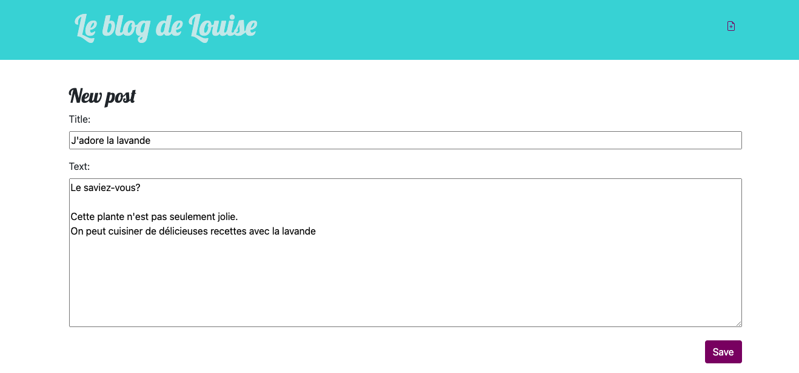
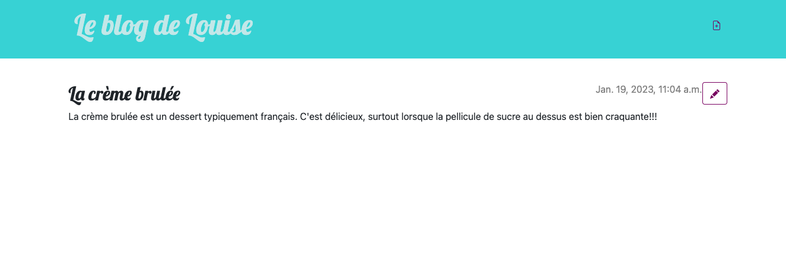

L'objectif de ce MON est de découvrir comment créer un site web et le déployer sur internet avec Django. Cela va aussi me permettre de voir comment on utilise des bases de données dans la vraie vie (c'est à dire avec un site). Pour cela je vais suivre le tutoriel [Django girls](https://tutorial.djangogirls.org/fr/).

Ce MON s'adresse aux débutants, très débutants en informatique. Il ne présuppose aucune connaissance.

Pour les plus expérimentés en développement qui veulent savoir comment déployer, dirigez vous vers les MON suivants:
- MON 2.1 de Nathan Gissler [Web Back](https://francoisbrucker.github.io/do-it/mon/NG/mon-2-1/)
- MON 2.1 de Thimothée Bermond [Publier son site sur un serveur web](https://francoisbrucker.github.io/do-it/mon/TB/Mes_MON/ServeurWeb/)

# Sommaire:
1. Qu'est ce que Django?
2. Un peu de théorie
3. Créer un projet avec Django
4. Déployer son site sur Internet
5. ORM Django et Query Sets
6. Résultat et retour d'expérience

## 1.Qu'est ce que Django?

Django est un framework python gratuit et opensource. Attendez !!! Mais qu'est ce que c'est un framework?


Framework signifie "cadre de travail" en français. Un framework est un ensemble de composants qui vous aide à développer des sites web plus rapidement et plus facilement. Concrètement ce sont des bouts de codes (= une bibliothèque de fonctionnalités) qu'on peut adapter à son projet .
Chaque framework fonctionne avec un ou plusieurs langages de programmation.


Si vous voulez en savoir plus sur Django, je vous conseille ce MON  de Jeffrey EDISAH [Introduction au Backend avec Django](https://francoisbrucker.github.io/do-it/mon/JE/mons/django/) 

Le tutoriel Django Girls: 
Ce tuto veut nous "emmener dans un voyage sous le capot des technologies web, en nous offrant un aperçu de tous les pièces et les morceaux qui doivent être assemblés pour que le web fonctionne tel que nous le connaissons."
Ce tutoriel est pensé pour les EXTREMEMENT débutants en informatique. il couvre beaucoup de sujet différents comme la théorie du fonctionnement des sites web, les bases de python/HTML/CSS et le déploiement d'un site sur internet (avec Github et PythonAnywhere).  
A la fin du tutoriel, on aura créé un blog sur lequel on peut faire des posts.

## 2. Un peu de théorie

Le tutoriel commence par nous (ré)expliquer certains concepts: 

**Comment fonctionne un site web?**
Un site Web consiste en un tas de fichiers sauvegardés sur un disque dur. Certains de ces fichiers contiennent du code en html.
Les navigateurs web sont conçus pour comprendre le code, suivre les instructions qu'il contient et présenter les fichiers de votre site web exactement comme vous voulez qu'ils soient présentés.
Le site web est stocké sur un serveur.
Lorsqu'on veut se connecter à un site web grâce à son URL, le serveur reçoit une requête. Il renvoit alors le site web vers notre ordinateur.

**Comment fonctionne un terminal?**
Cette fenêtre, qu'on appelle aussi ligne de commande ou interface en ligne de commande, est une application textuelle qui permet de voir et de manipuler des fichiers sur votre ordinateur. C'est un peu la même chose que l'Explorateur Windows  mais sans interface graphique. 

Tout cela vous semble peut-être évident. Pour moi ça ne l'était forcément.
Dans le tutoriel DjangoGirls on va beaucoup utiliser ce terminal. C'est l'occasion de se familiariser avec. 
Le tutoriel comporte un chapitre sur Python (que vous connaissez déjà bien depuis votre prépa). C'est l'occasion de faire une petite révision...
Pour la suite, nous allons utiliser VSCode.


Editeur de texte = Il permet de produire du code en format texte brut, contrairement aux éditeurs comme Word et Textedit qui produisent du texte enrichi (avec des polices et de la mise en forme). De plus ils sont conçus spécialement pour l'édition de code. Ils fournissent donc des fonctionnalités très utiles comme la coloration du code en fonction du sens de celui-ci ou l'ajout automatique d'un guillemet fermant à chaque fois que vous ouvrez un guillemet.


## 3. Créer un projet avec Django

Maintenent qu'on est équipé comme il faut (terminal, python et VSC), il faut créer un projet django.
La création du projet fait apparaitre différents fichiers :

myvenv correspond à l'environnement virtuel de travail. Je dois avouer que je n'ai toujours pas bien compris son utilité.

Dans les settings on va pouvoir configurer la langue, le fuseau horaire, la base de données utilisée (par défaut : sqlite3 )...

**Composants d'un projet Django :**
Les URLS
- *Une Vue:*  fonction Python acceptant une requête web et renvoyant une réponse web. Cette réponse peut contenir le contenu HTML d’une page web, une redirection, une erreur 404, un document XML, une image… ou vraiment n’importe quoi d’autre. La vue elle-même contient la logique nécessaire pour renvoyer une réponse.
Par convention, on la retrouvera dans un fichier nommé view.py

- *Un modèle:* C'est la source d’information unique et définitive à propos de vos données. Il contient les champs et le comportement essentiels des données que vous stockez. Généralement, chaque modèle correspond à une seule table de base de données.

- *Un template:* Document texte ou un chaîne Python, balisés à l’aide du langage de gabarit de Django. Certaines structures sont reconnues et interprétées par le moteur de gabarit. Les principales sont les variables et les balises.

Un template est produit avec un contexte. Le processus de production remplace les variables par leurs valeurs qui sont cherchées dans le contexte, et il exécute les balises. Tout le reste est affiché tel quel.
On peut créer des héritages de templates, C'est à dire créer un template de base et en faire des dérivations

Voir la documentation de Django: https://docs.djangoproject.com/fr/4.1/topics/templates/

Les fichiers statiques correspondent à tous vos CSS et vos images. Leur contenu ne dépend pas du contexte de la requête et sera le même pour tous les utilisateurs. 
A noter qu'il faut effectuer une commande supplémentaire pour mettre à jour ces fichiers sur le serveur.

## 4. Déployer son site sur Internet

Notre site web a besoin d'être installé sur un serveur. Il existe de nombreux fournisseurs de serveurs disponibles sur Internet, nous utiliserons PythonAnywhere. Il est gratuit pour les petites applications qui n'ont pas trop de visiteurs.
Nous allons aussi utiliser GitHub, pour héberger notre code en ligne.

(On développe en local puis on copie sur Github. On recopie le code depuis Github vers PythonAnywhere)


Git est un " système de gestion de versions" utilisé par de nombreux développeurs. Ce logiciel permet de garder une trace des modifications apportées à chaque fichier afin que vous puissiez facilement revenir en arrière ou à une version spécifique»


Le tutoriel nous fait utiliser une BDD différente sur  PythonAnywhere (pour la version en ligne de notre site.). Les données sur notre site en local et sur notre site en ligne sont donc complétement différentes. Si on ajoute des posts de blog sur l'un, ils ne seront pas visibles sur l'autre.

## 5. ORM Django et Query Sets

ORM est l'acronyme anglais de object relational mapping. Un ORM est une technique de programmation qui donne l' illusion de travailler avec une base de données orientée objet . Pour résumer ,on n'utilise plus les requêtes SQL , on travaille directement avec vos objets. Cela représente un gain de temps pour le développeur.Si vous êtes un nouveau développeur sur un projet, vous comprenez ce projet en quelques secondes en visualisant ces fichiers.
Pour représenter des données d’une table de base de données en objets Python, Django utilise un système intuitif : une classe de modèle représente une table de base de données, et une instance de cette classe représente un enregistrement particulier dans la table de base de données.

Pour extraire des objets de la base de données on utilise des QuerySet. Un QuerySet représente une collection d’objets de la base de données. Il peut comporter zéro, un ou plusieurs filtres.En termes SQL, un QuerySet équivaut à une commande SELECT et un filtre correspond à une clause restrictive telle que WHERE ou LIMIT.

Vous trouverez plus de détails ici: https://docs.djangoproject.com/fr/4.1/topics/db/queries/

## 6. Résultat et retour d'expérience

A l'issue de ce tutoriel j'ai bien obtenu mon blog , déployer sur internet. En voici quelques images: 

Après tout ça je pense pouvoir changer le style de ma page ainsi que les champs contenus pour chaque posts toute seule. Cependant beaucoup de points sur le code restent encore un peu flous:


- Je trouve l'imbrication des 3 composants du code (vue,template et modèle) compliquée à comprendre. Je me suis retrouvée plusieurs fois à copier des lignes de codes sans vraiment comprendre pourquoi
- Certaines commandes entrées dans le terminal durant le tutoriel restent assez mystèrieuses (je ne sais pas trop ce qu’elles font).
- J'ai eu plusieurs erreurs lors de l'exportation vers github et vers PythonAnywhere. J'ai finalement réussi à les résoudre grâce à Internet
- Durant ce tutoriel on manipule de nombreux fichiers. On s'y perd un peu. J'avoue ne pas avoir compris l'utilité  de certains d'entre eux.



**Conclusion**

Ce tutoriel est très ludique et facile à suivre .Les concepts de base sont très bien expliqués. On se sent pris par la main et accompagné à chaque étape. Les premiers chapitres sont très bien faits et permettent de remettre les points sur les i à propos d’outils qu'on utilise au quotidien, que l’on est censé comprendre, comme le terminal par exemple. J'ai pu aussi revoir certains sujets appris dans mes MON (POO ,HTML ,CSS ). Cependant beaucoup d'étapes manquent de clarifications, notamment sur les liens entre les différents fichiers manipulés. Normal, sinon le tutoriel serait plus compliqué ou beaucoup trop long.

En conclusion j'ai vraiment apprécié ce MON. Mes précédents (MON , Html, CSS et POO) m’ont permis d’aller plus rapidement sur certaines parties du tutoriel pour me concentrer sur des concepts plus intéressants.

Dans mon premier MON j’ai appris à faire un site from scratch, ici j'ai vu la différence avec un framework. C’est vraiment plus facile!