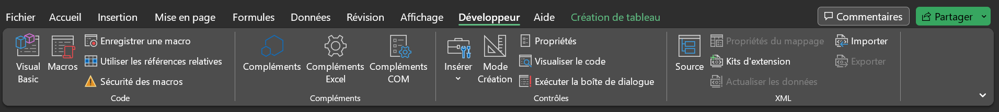
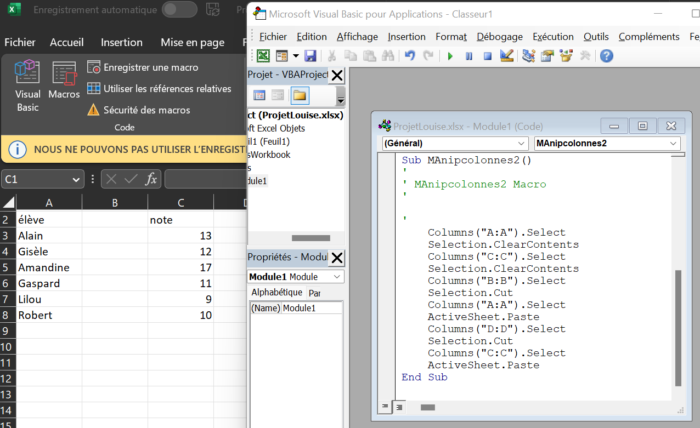
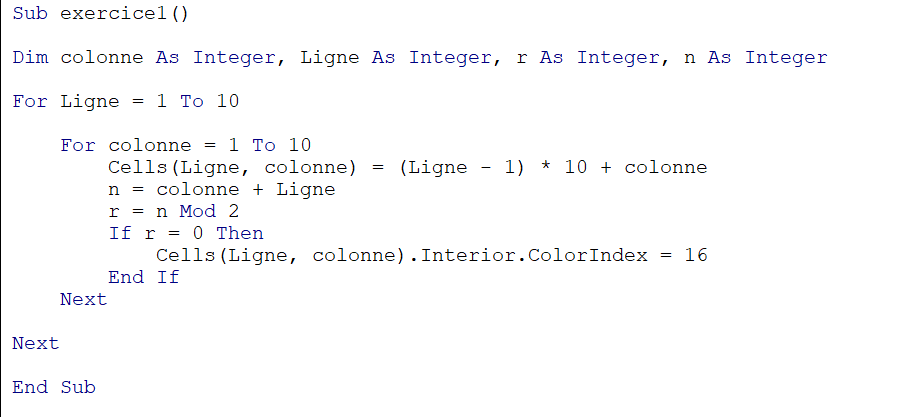
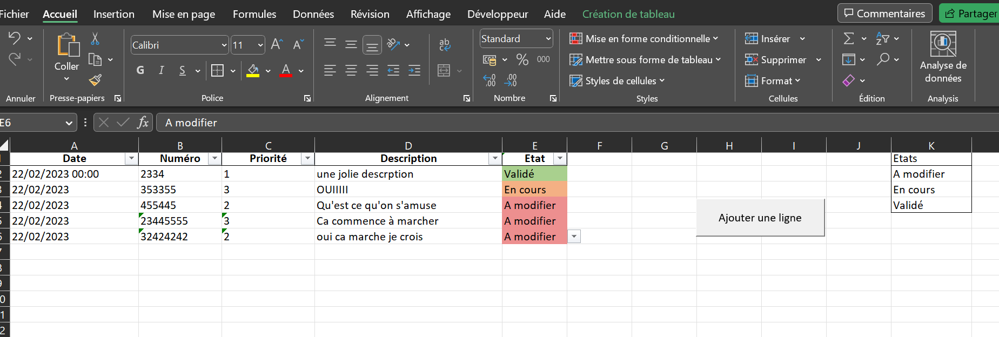
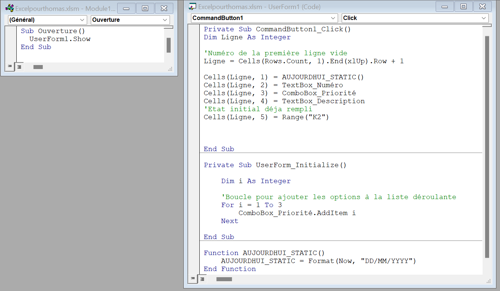
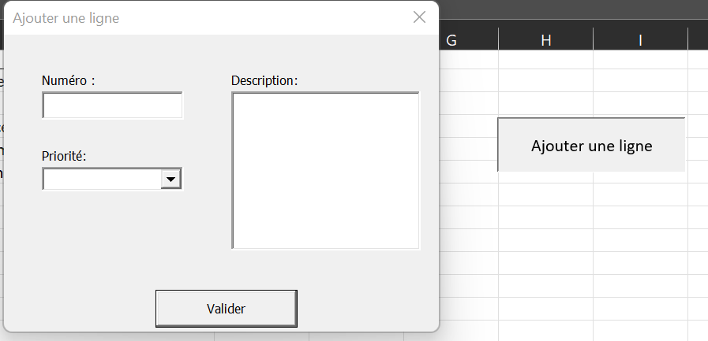

Dans ce  MON je vais me former au VBA.

# Sommaire :

1. Premiers pas
2. Ecriture d’une macro
3. Les variables 
4. Conditions et boucles
5. Utilisation des boites de dialogue
6. Les tableaux 
7. Retour sur le tutoriel
8. Petit projet

Le VBA ou Visual Basic for Applications est un langage de programmation évènementielle créé par Microsoft. Il est très utilisé dans les entreprises il me sera donc utile d’avoir des bases sur le sujet.C’est un langage facile et flexible :   pratiquement chaque opération que vous pouvez effectuer avec une souris, clavier ou une boîte de dialogue peut également être automatisée à l’aide de VBA. Le VBA ne peut s’utiliser qu’avec des applications Microsoft, d’où la nécessité d’avoir une licence. 

Attention il existe une version en ligne d’excel mais celle-ci ne gère pas les macros :
https://www.microsoft.com/fr-fr/microsoft-365/free-office-online-for-the-web

Pour ce MON j’ai suivi le tutoriel suivant :

https://www.excel-pratique.com/fr/vba


C’est un tutoriel assez complet qui ne demande aucune connaissance de base sur VBA.


Ce compte rendu pourra servir de mémo pour les personnes connaissant déjà le VBA.  


## 1. Premiers pas:

On découvre l’onglet développeur qui permet d’utiliser le VBA. Le  bouton « Visual Basic » permet d’accéder à l’éditeur de macros.



Dans cet éditeur on peut écrire du code dans des « Modules » . Une macro s’écrit toujours entre ces deux balises :

```
Sub nom_de_ma_macro ()
EndSub

```


Une fois le code écrit il n’y a plus qu’ à insérer un bouton dans la feuille et le relier à la macro que l’on veut activer. (Insérer → Bouton (Contrôles de formulaires) )

On peut aussi déclencher des macros avec des événements ( et non des boutons) par exemple au clique sur une cellule ou à l’activation d’une feuille.


A noter : on peut enregistrer une macro : c’est à dire effectuer des manipulations avec la souris qui seront traduites en code par excel (c’est très pratique)

Ici on voit un exemple de changement de colonnes et le code associé qu’a créé excel.  




## 2. Ecriture d’une macro :


Voici un petit exemple de macro



Le schéma d’écriture est toujours le même et fonctionne un peu comme une programmation objet :

On sélectionne un ensemble de cellules et on applique des propriétés/fonctions avec le « . »


Mémo des Sélecteurs principaux :

Workbooks(« Nom_du_fichiers ») ⇒ Sélectionner un autre classeur
Worksheets(« Nom_de_feuille ») ou Sheets(«  Nom_de_feuille ») ⇒ Sélectionner une autre feuille du classeur

ActiveCell ⇒ concerne la cellule active (= la cellule qui est actuellement sélectionnée)
Selection ⇒   concerne la ou les cellule sélectionnées
Cells (num_ligne,num_colonne) ⇒ La cellule de coordonnées :  num_ligne et num_colonne
Range(« A8 »), 
Range(« A1:A10 ») => les cellules A1 à A10
Range(« A1,A2 »)==> les cellules A1 et A2


On peut enchainer les sélecteurs :
``` 
Workbooks(« projet»).Worksheets(« Feuil2»).Range(« A8 »)
```


Ensuite on a les propriétés qui concernent l’apparence :

Value : renvoie la valeur
Activate :  
Font : modifie la police  		(Font .Size 	Font.Name 		Font.Bold)
Borders : modifie les bordure de cellules
Font.Color = RGB(174, 240, 194):modifie la  couleur de police 
Interior.Color = RGB(174, 240, 194) modifie la couleur de la cellule


exemple d’utilisation :
```
Sheets("Feuil3").Range("A1").Borders.Weight =4 
Sheets("Feuil3").Range("A1").Font.Bold = True
```
Pour éviter la répetition :

```
With Sheets("Feuil3").Range("A1") 
	.Borders.Weight = 4 
	.Font.Bold = True
End With
```

Enfin les fonctions excel :
Toutes les fonctions excel sont disponibles en tapant « WorksheetFunction. » dans l’éditeur de code. Un menu déroulant va alors apparaître avec les différentes fonctionne

Voici une liste avec explications des différentes fonctions :

https://www.excel-pratique.com/fr/fonctions-vba


## 3. Les variables :

A chaque début de macro il faut  déclarer ses variables, on utilise :
 
Dim nom_variable As Type_variable

Les principaux types  de variable:
Integer : entier
Single = virgule flottante
String = texte
Boolean = booléen
Date

Les opérations sur les variables sont semblables à celles qu’on effectue sur pyhton


## 4. Conditions et boucles:

Le fonctionnement des conditions en VBA est assez intuitif ( globalement cela marche comme en python)
La forme du bloc est la suivante :
```
If CONDITION Then 
	INSTRUCTION
ElseIf
	INSTRUCTION
Else 
	INSTRUCTION
End If
```

Attention, le « est différent de » s’écrit : <>
Les autres opérateurs :  And, Or, Not
On peut aussi tester le type :  If IsNumeric(Range...) 

Lorsqu’on a beaucoup de ElseIf, on préférera utiliser l’instruction Select
exemple d’utilisation :

Dim note As Single, commentaire As String note = Range("A1")
 
``` 
Select Case note
Case Is = 1,2 
	 commentaire = "résultat affligeant!" 
Case 3 to 4 
	commentaire = "résultat médiocre!" 
Case Is >5
	 commentaire = "Bon résultat"

```
comparaison des chaines de caractère :
Pour savoir si 2 chaines de caractère sont identiques on utilisera l’instruction Like
Par exemple :
```
If nom_variable Like "des_caractères" Then 
```

 La comparaison n’a pas besoin d’être exacte !!! on peut ainsi inclure plusieurs possibilités 
 

Exemple :
```
Variable = « Un joli poème »
If Variable like « Un ????? poè[mt]e » 
``` 

le ? Signifie que n’importe quel caractère peut se trouver ici., les accolades signifient que l’un de ces caractères est présent à cet emplacement.


On effectue le boucles ainsi :
```
Do While CONDITION
	ISTRUCTION 
Loop
```

Until permet de réaliser une boucle jusqu’a ce qu’une condition soit vraie

```
Dim i as Integer
For i = 1 To 5 Step 1
	INSTRUCTION 
Next

For Each valeur In tableau 
	MsgBox valeur 
Next


```



La fonction : WorksheetFunction.CountA(Range("A:A")
permet de compter le nombre de cases non vides, c’est très pratique .


## 5. Utilisation des boites de dialogue:

Les boites de dialogue permettent d’afficher des messages mais aussi de créer de formulaires. La plus utilisée est la :

MsgBox 
On peut lui ajouter des boutons :
```

MsgBox([TEXTE], [BOUTONS], [TITRE])
```
Les boutons sont prédéfini par excel, il faudra écrire « vbYesNo » pour avoir un bouton « Yes » et un bouton « No » par exemple 
(tapez simplement « vb » et excel vous proposera la suite)

On peut mettre plusieurs boutons à la suite : 
ex : 
```
MsgBox("Texte", vbYesNoCancel + vbExclamation + vbDefaultButton2, "Titre")
```

Pour demander à l’utilisateur de rentrer des informations dans la boite de dialogue on utilise: 
```

InputBox("Texte ?", "Titre", "Valeur par défaut")
``` 
La réalisation de formulaire est un peu plus compliquée donc je ne la détaillerai pas ici. 


## 6. Les tableaux :
Pour déclarer un tableau on utilise la structure suivante :

Dim  nom_tableau(4, 3) As String 
 (c’est un tableau à 5 lignes et 4 colonnes , le contenu des cases est du texte)
Pour déclarer un tableau dynamiques Dim tableau()
Attention : la numérotation d'un tableau commence à 0.

Les tableaux dynamiques sont très pratiques pour faciliter des procédures (voir exercie du tutoriel :https://www.excel-pratique.com/fr/vba/tableaux_vba_exercice)


## 7. Retour sur le tutoriel

Ce tutoriel est assez complet. Il est parfait pour les débutants souhaitant parcourir la plupart des possibilités de VBA. Il est aussi très bien découpé en chapitres pertinents et autoporteurs. Il pourra donc servir d’aide pour des utilisateurs plus avancés. La difficulté des exercices augmente le long des chapitres. J’ai trouvé le chapitre sur les UserForms plus compliqué que le reste. A titre indicatif il faudra un peu plus de 7h à le terminer.


## 8. Petit Projet

Pour pratiquer, j'ai réalisé un petit projet pour un ami. Il voulait un fichier excel lui servant de tableau de bord pour gérer des documents à modifier.

Voici le résultat:






Un Userform permet de remplir certaines informations. La date d'ajout est rempli automatiquement ainsi que l'état initial de la tâche.


