<!-- début résumé -->

Le but de ce POK est de partir d'une idée ou expérience utilisateur pour arriver à un prototype en suivant une démarche de Lean Startup. J'ai choisis de réaliser une application mobile de location de vêtements pour enfants pour répondre à la problèmatique suivante: les enfants grandissent vite, pas leurs habits.  

<!-- fin résumé -->

## Sommaire

1. Démarche suivi : Le lean startup
2. Planning/cycles du projets
3. Formualtion de l’idée, hypothèses de départ
4. Recrutement des testeurs
5. MVP 1 : Conception, tests , apprentissages
6. MVP 2 : Conception, tests , apprentissages
8. Conclusion et pistes d’amélioration

## 1.Démarche suivi : Le lean startup

Pour rappel, le lean startup est une démarche qui consiste en la réalisation de cycles. A chaque cycle on créer un MVP (Minimum Viable Product) qui contient les fonctionnalités principales du projets. Cycle après cylce on améliore ce MVP en prenant en compte les avis des utilisateurs.

« L’approche Lean Startup est basée sur un processus itératif et incrémental en 3 étapes : Build, Measure, Learn. »
Les étapes :
1.L’organisation commence par formuler des hypothèses sur ce que souhaitent les clients potentiels. Elle construit (build) ensuite un premier produit, destiné uniquement à tester ces hypothèses auprès clients potentiels réels
2.Elle mesure (measure) la validité des hypothèses de départ grâces aux données recueillies en testant ce premier produit auprès de clients potentiels réels.
3.Grâce à ces mesures l’organisation peut en tirer des enseignements, appelés validated learnings, soit des enseignements validés avec une méthode scientifique reposant sur des données. Ces validated learnings permettent de changer ou d’affiner les hypothèses, et de repartir dans une nouvelle boucle build-measure-learn. »


https://mbamci.com/design-thinking-lean-startup-design-sprint/


**Défi de ce projet :**
Ce projet s’adresse à des parents. Je ne connais pas de jeunes parents dans mon entourage proche. 
Le plus gros enjeux pour moi sera donc de trouver un panel de personnes suffisamment conséquent pour tester mes solutions . 

## 2. Planning/cycles du projets

Le projet s'étend sur 9 semaines. J'ai choisis de réaliser 3 itérations d'environs 3 semaines.
planning prévisionnel:
- Cycle 1: point pok du 7/12 , MVP sous forme de story board (dessin des interfaces)
- Cycle 2: 07/01 , MVP sous forme de maquette figma

## 3. Formualtion de l’idée, hypothèses de départ

Les enfants et surtout les bébés grandissent vite. Il faut donc renouveler leur garde robe régulièrement. Cela est coûteux et provoque une consommation importante de vêtements. Avec l’application BabyCameleon , vous pouvez changer la garde robe de bébé quand cela vous plait. Vous faites ainsi des économies tout en faisant un geste pour la planète. 
Il suffit de souscrire à un abonnement mensuel. Celui-ci vous donne le droit de sélectionner des habits pour une certaine quantités de points. La valeur en points de chaque vêtement dépend de sa qualité et de son état (neuf ou déjà utilisé).
Une fois la sélection faite, les habits vous sont livrés chez vous. Le changement de garde robe est simple : il suffit de renvoyer la précédente sélection et d’en faire une nouvelle.

J’ai recherché les offres similaires déjà existantes. Voici les principales :

- pirouette-salopette : location pour bébé de 1 à 12 mois
https://www.pirouette-salopette.fr/
offres : 4 possibilités : mallettes 3 ou 6 vêtements, neufs ou déjà utilisés.

Boutiques similaires : les ptitslouent, Tale me (1à 6 ans)

- Lili+Jusde : location bébé de 1 à 24 mois
https://liliandjude.fr/boutique/
offre : location à la pièce. Le prix affiché correspond à la location du vêtement pour un mois
Boutiques similaires : little clotherie family, loopyo

- Petit Nomade : 3 mois à 12 ans , vêtements de luxe
offre : combinaison d’un abonnement et de locations ponctuelles


Il y a assez peu d’offres de ce genre sur le marché français. Elles concernent surtout les 0-2 ans  et leur marketing est tourné soit vers le luxe, soit vers l‘éco responsabilité.


Hypothèses de départ :
- Les parents seront principalement intéressés pour les enfants 0 à 6 ans
- Un abonnement à points sera préféré plutôt que de louer chaque vêtements pour un prix
- Associer un nombre de points selon l’état du vêtement permettra une adaptation de l’offre à tous les budgets

**Cible :**

Parents, 35-45 ans (principalement des mères)
Ayant des enfants en bas âge (1 à 2 enfants)
Concernés par leur porte-monnaie et l’environnement.

**Remarques après le 1er point pok :**

Après un premier point POK avec les autres élèves de la classe, il est ressortit que la location de vêtements traditionnels ne présentait pas un intêret pour tout le monde. En effet en prenant en exemple nos propres expériences familiales, on se rend compte que les habits enfants sont souvent donnés par des membres de la famille. Cependant l'idée est pertinante pour des habits utilisés pour des occasions spéciales comme le ski et les cérémonie. 
C'est donc un pivot 1 : BabyCameleon change de créneaux d’habits!

## 4. Recrutement des testeurs :

Pour tester mon prototype, j'ai besoin de jeunes parents. J'ai contacté plus de 10 familles. Seules 7 ont répondu à mes questions. Seulement 2 vivent à Marseille. Lors de cette recherche je me suis heurtée à pas mal de difficultés. En effet, je ne connais pas de jeunes parents. J'ai du aller chercher dans l'entourage de mon entourage. Les personnes interrogées ne me connaissent donc pas, il est donc plus diffcile d'obtenir qu'elles prennent de leur temps pour m'aider.  

## 5. MVP 1 : Conception, tests , apprentissages

Avec le temps qui défile à une vitesse folle, mon premier MVP n'en est pas un. L'idée était surtout de valider mes hypothèses de départ. J'ai donc envoyé un mail sous forme de questionnaire. J'ai aussi ajouté un croquis de mon site afin que mes testeurs puissent visualiser quelques fonctionnalités.

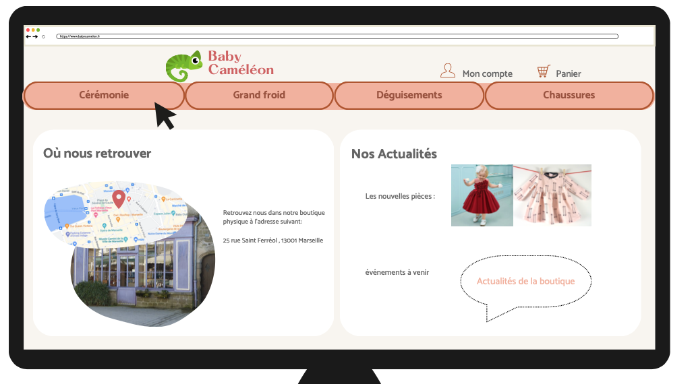
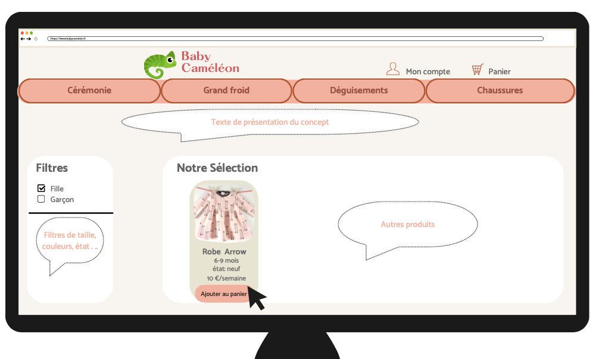

**Questions posées:**

- Le service proposé vous intéresse ? (pourquoi?)
- Si une telle boutique existait, est-ce que vous seriez clients ? ( pour quel produits?)
- Trouvez vous un intérêt à la création d’une boutique physique en plus du site web ? (expliquez)
- Comment aimeriez vous  recevoir et retourner les tenues louées?
- Préférez-vous payer abonnement mensuel qui vous donne droit à une certaine quantité de vêtements ou payer un prix par vêtement ?

- Le  segment d’habits choisis vous parait-il suffisant ? Quel autre produit souhaiteriez-vous voir à la location ? ( vêtements ou non)
- La tranche d’âge proposée (0-6 ans) vous paraît idéal ? Jusqu’à quel âge seriez vous intéressé par la location de vêtement ?

**Analyse des réponses:**

Il y a un vrai intérêt pour l’offre (100 % de oui), surtout pour les vêtements de ski ou cérémonie. Les parents ont des exigences de qualité : les habits doivent arriver en parfait état.
Pour ce qui est  de la boutique, seul 28 % des parents interrogés la trouve indispensable/ rassurante. (argument:" Etant parent d'un enfant en bas âge, nous évitons au maximum les déplacements qui nécessitent une logistique importante ")
Le projet pourra être seulement en ligne dans un premier temps.

Pour la formule, des locations ponctuelles sont préférées par plus de 60% des parents. Les abonnements pourront représenter des offres fidélité. 

La réception en boite au lettre/ main propre est un point clé. (On ne veut pas se rendre en point relais).

Sur le choix des produits : des vêtements de marque ou de créateur représentent un grand atout (Tartine et Chocolat par exemple)
La plupart (plus de 70%) des parents aimeraient aussi pouvoir louer des accesssoires : Siège auto, lits bébé, duvet pour le camping... 

La tranche d’âge choisie est idéale pour plus de 70% des parents.
J’ai décidé d’iclure les chaussures dans les catégories dédiées. Mon 4eme onglet regroupera les accessoires mentionnés plus tôt.


- Les réponses des  personnes sondées sont différentes et il faut faire des choix (lesquelles suivre?)
- Mon nombre de réponses n’est bien sûr pas représentatif. J’ai fais de mon mieux pour contacter le plus de familles possible mais au final je n’ai récolté que peu de réponses.



## 6. MVP 2 : Conception, tests , apprentissages

On va passer à la maquette sur Figma 

**Les fonctionnalités que je veux :**

- Une en tête avec le logo , une barre de recherche et un accès au panier et au compte client
- 4 catégories, montrer des sous catégories
- une pages d’accueil avec les actualités du site et es collaborations avec les créateurs 
- Sur les pages produits : des filtres (sexe,age,couleur, état)
-  Afficher le prix de la location/jour 
- Choix de la date de réception des vêtements
- Choix du mode de livraison
- Choix du nombre de jour loués
- Avoir une page récapitulative des livraisons prévues dans la section « mon compte » et un historique de commandes

**Maquette Figma :**

Pour ma maquette,j’ai suivi la méthodologie Monsieur Ly (cours Interface Utilisateur). J’ai adapté le niveau de finissions de mon  MVP en fonction du temps dont je disposais .

*1. Le brief graphique :*
J’ai d’abord travaillé sur les valeurs que je voulais transmettre par mon design et ma cible type.
- valeurs :
éco friendly
qualité
Pratique/accessible à tous
Facil
personnel/familial
- Profil cible: 
Mère, 30-45 ans
Ayant des enfants en bas âge (1 à 2 enfants)
Concernée par son porte-monnaie et l’environnement

- Mood board :  
Je me suis inspirée d’autres sites de marque pour enfants eco responsables. On remarque que les tons majoritairement présents sont le rose, le marron et le vert.

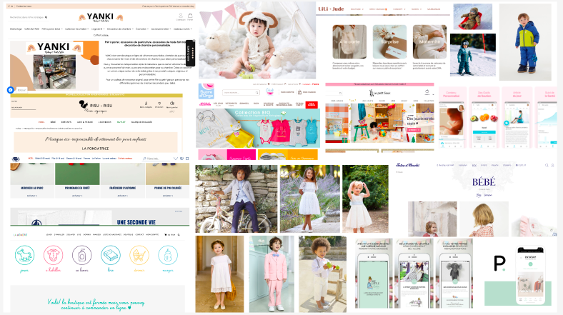

- Les palettes de couleur : Je me suis inspirée du mood board pr sélectionner différentes palettes de couleurs correspondant à la marque

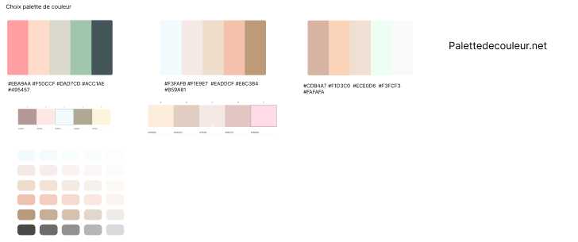

- La police : j’ai choisi des polices refletant les côtés simples et familiaux de la marque. Elles sont plus personnelles et arrondies que les polices classiques.

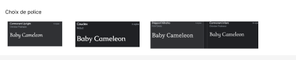

- Les écrans :
J’ai choisis de réaliser 6 écrans qui reflètent les fonctionnalités principales de mon site :
L’écran d’acceuil
L’onglet vêtements de cérémonies
Un écran de zoom sur une robe
L’onglet vêtements de ski
L’onglet correspondant au panier
l’onglet « Mon compte »

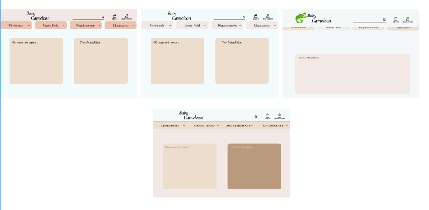

Après plusieurs tests couleur voici le resultat final. J’ai aussi choisi de mettre des photos des vêtements portés et sur fond de nature (dans le but de rappeler le côté eco-friendly de la boutique) . Je pensais que mes premiers dessins sur canvas ne me serviraient pas. Au final ils m’ont pas mal aidé pour remplir mes pages figma.

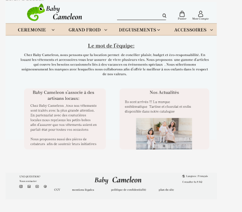
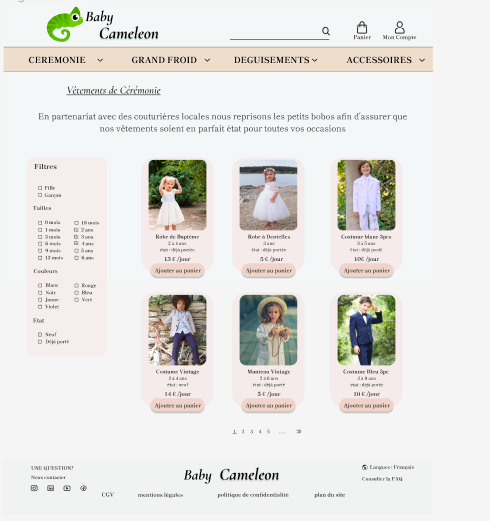

J’ai enregistré une démo vidéo de la maquette afin de l’envoyer à mes testeurs qui n’habitent pas sur Marseille.

<video width="320" height="240" controls>
  <source src="MVP.mov" type="video/mp4">
</video>

Voici le lien de la maquette figma si vou voulez tester par vous même:
 https://www.figma.com/file/gqB0yBRWeaXXhHdYDr8il8/BabyCam%C3%A9l%C3%A9on_pourtest?node-id=15%3A2&t=bLHL4qt4jXd6yuWf-1

**Retours:**
J' ai obtenu les retours de 4 familles pour ce test. J'ai pu réaliser un test en vrai avec un couple de parents marseillais. J'ai reçu les autres retours par mails ou téléphone.

Voici les remarques et recommandations qui en ressortent:

- **Général :**
charte de couleurs ; tres bien, en accord avec le theme, doux, elegant
Ajouter une page FAQ

- **Ecran d'accueil :**
Mieux expliquer le concept ( écrire LOCATION quelque part )
Créer une page 'vitrine' qui référencie les createurs et marques de vêtement + leurs évènements / annonces s
Mettre plus d'images

- **Ecran cérémonie :** 
 Filtres: Ajouter un filtre "mixte", un flitre par marque de vêtement, ou par disponibilités.
 Faire ressortir la marque des produits
 Attention au nom des vêtements, certains peuvent être discriminants

- **Zoom sur un produit :** 
Ajouter une section commentaires/avis sur les articles déjà loués avec possibilités d'ajouter des photos
Ecrire le nombre de fois que la pièce à été louée
Ajouter des photos des réparations dans l'historique du vêtement

- **Onglet panier :** 
Ajouter la date de retour
Prendre une caution
Revoir le prix d'envoi/retour
Ajouter l'impression du bon de renvoi

- **Onglet "mon compte":** 
Revoir l'ergonomie: mettre sur la même ligne le produit, la livraison et le retour

- **Petites idées en plus :**
Recevoir l'avis des clients sur des pieces qu'ils souhateraient voir dans le shop ( système de vote )
Envoyer une alerte par mail pour les retours de vêtements
Ajouter des petites icones sur les pages produits afin d'afficher s'ils sont vegans, eco-conçus...

## 7. Maquette finale et conclusion

J'ai intégré la plupart de ces retours sur ma maquette:

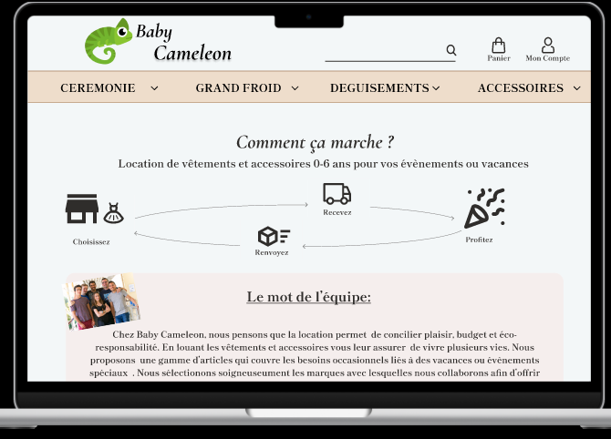
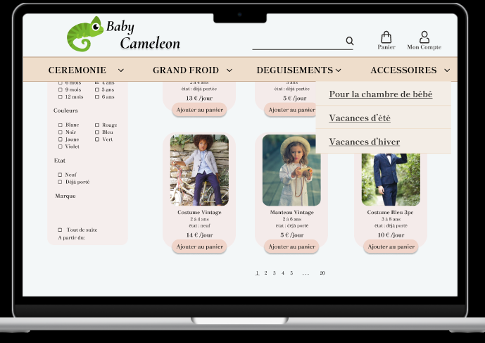
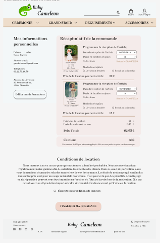
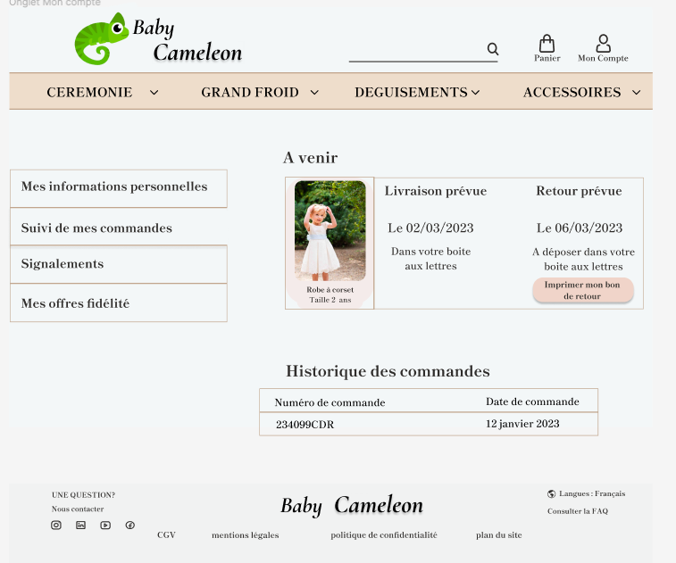
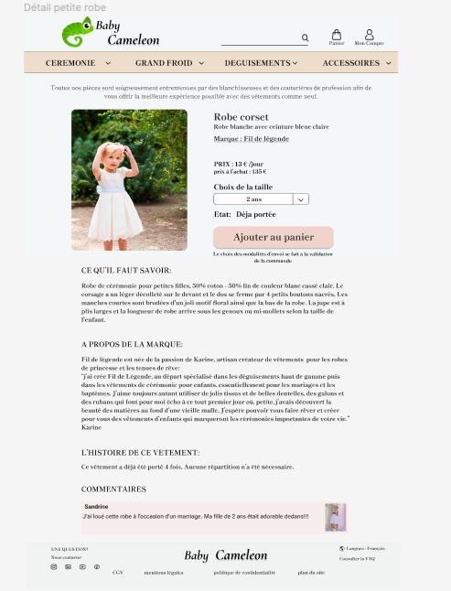

Voici le lien de la maquette figma si vou voulez tester par vous même:
https://www.figma.com/file/khPdhK9WQWeb1AcI7C2Iwx/BabyCam%C3%A9l%C3%A9onV2_pourtest?node-id=15%3A2&t=bLHL4qt4jXd6yuWf-1

Prochaines améliorations: 
- Ajouter la marque sur la présentation de chaque produit
- Retravailler les polices
- Ajouter des photos à la page d'accueil
- positionner le FAQ

