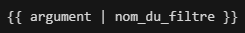
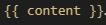

<!-- début résumé -->

Dans ce MON j'apprends à utiliser Eleventy pour la création de sites web statiques.

<!-- fin résumé -->

## 1. Sites statiques et dynamiques

### Sites statiques

Les sites statiques ont été les premiers à exister. Toutes les informations et fichiers sont stockés directement sur le serveur et sont transmis au navigateur lorsque l'utilisateur cherche à accéder à telle ou telle partie du site.

### Sites dynamiques

Les sites dynamiques vont également traiter les données transmises par l'utilisateur (mots-clés d'une recherche, géolocalisation...), contrairement aux sites statiques. Ce traitement se fait par un autre serveur, qui héberge l'application. Ce serveur communique avec un troisième serveur, la base de données, qui contient toutes sortes de données utilisées par le site.

### Les générateurs de sites statiques

Les générateurs de sites statiques permettent de créer des sites qui restent au final des sites statiques, mais qui sont plus faciles à créer et à maintenir par le développeur que des sites statiques codés de A à Z. Cela passe notamment par des templates qui sont communs à plusieurs pages du site, et qui sont utilisés pour générer ces pages avant la mise en ligne du site.

Ces générateurs simplifient le travail du développeur mais le résultat reste un site statique classique  du point de vue de l'utilisateur car tous les fichiers sont de toute façon générés puis stockés sur le serveur.

## 2. Installation d'Eleventy

Eleventy est un générateur de sites statiques. Il permet de générer plus facilement les pages de sites comme celui-ci grâce à des templates, entre autres fonctionnalités.

L'utilisation d'Eleventy nécessite node.js et npm. On l'installe avec la commande suivante :

    npm install -g @11ty/eleventy

## 3. Fonctionnalités

### Templates

Eleventy fonctionne avec des "templating engines" qui permettent de modifier certaines données du site à un seul endroit même si elles sont utilisées à plusieurs endroits (par exemple le titre d'une page).

Une des syntaxe qui existe avec Eleventy est la syntaxe liquid, elle est utilisée dans les fichiers HTML et Markdown. On place les données (titre de la page, noms de fichiers, etc.) en en-tête du fichier sous cette forme :

    ---
    title: Giffleball
    images:
      - ???.jpg
      - ….jpg
      - parrot.gif
    ---

Ces données peuvent ensuite être utilisée au sein du fichier (ici en HTML) de cette manière :

Ou encore comme ceci pour la liste d'images :

De cette manière les données doivent seulement être modifiées dans l'en-tête et plus dans chaque élément de la page.

`url_encode` est un filtre d'Eleventy qui permet d'éviter des erreurs avec les caractères spéciaux dans les noms de fichier, c'est un autre avantage des templates.

Remarque : attention quand on parle d'Eleventy sur un site qui fonctionne avec Eleventy, les textes entre doules accolades sont remplacés même si on les met entre `` ou dans un bloc de code (je n'ai pas trouvé d'autre moyen que de mettre des images).

### Filtres

Les filtres peuvent servir à différentes choses, ils peuvent se créer de cette manière, dans un fichier `.eleventy.js` :

    module.exports = (function(eleventyConfig) {
        eleventyConfig.addFilter("nom_du_filtre", function(argument) {
            /* code */
            return "valeur retournée";
        });
    });

Ils s'utilisent ensuite dans un fichier HTML comme ceci :

### Layouts

Un layout est un fichier Nunjucks que l'on crée de cette manière : `src/_includes/nom_du_layout.njk`

Ce fichier est constitué comme le fichier HTML d'une page de notre site, excepté que l'on peut par exemple remplacer le titre par :

Et le contenu de la page par :

Ces informations seront ensuite renseignées dans un fichier Markdown situé dans `/src` : `/src/index.md`.

    ---
    layout: nom_du_layout.njk
    title: Titre de la page
    ---

    Contenu de la page

Ce fichier correspond à une page de notre site qui utilise le layout nom_du_layout.njk. Lors de la génération du site, les informations comme le titre ou le contenu seront placés dans le code HTML du fichier Nunjucks pour créer un fichier HTML classique. La force des layouts est bien entendu qu'ils peuvent être utilisés pour de nombreuses pages, telles que des posts de blog, qui se présenteront sous la même forme et pourront être créées très simplement dans un fichier Markdown.

On peut également appliquer un layout à toutes les pages d'un dossier en leur appliquant un tag avec ce type de fichier JSON :

    {
    "layout": "base.njk",
    "tags": "articles"
    }

### Paginations

Les paginations servent à créer plusieurs page en itérant sur des données (qui peuvent être de plusieurs types).

On peut par exemple créer plusieurs pages du même format en itérant sur un fichier JSON :

- Fichier JSON contenant les données à utiliser (placé dans `_data`)

- Fichier Nunjucks qui définit le format des fichiers à générer

- Résultat (créé dans un dossier `portraits` avec les pages correspondant aux autres données du JSON)

On remarque que l'on peut choisir le lien auquel on trouvera les pages générées.

## 4. Création d'un site

On peut commencer par saisir ces commandes dans le dossier du projet :

    npm init -y
    npm i --save-dev @11ty/eleventy

Puis placer les lignes suivantes dans le `"scripts"` du `package.json` :

    "scripts": {
        "start": "eleventy --serve",
        "build": "eleventy"
    }

On crée le .eleventy.js avec le code suivant :

    module.exports = function(eleventyConfig) {
        return {
            dir: {
                input: "src",
                output: "public"
            }
        };
    };

On crée le `src/_includes` qui va contenir les fichiers Nunjucks de templates.

On crée notre `index.md`, puis un fichier CSS qu'on lie au fichier Nunjucks (comme à un fichier HTML classique).

On ajoute également cette ligne au `.eleventy.js` :

    eleventyConfig.addPassthroughCopy("./src/style.css");

Le site peut être lancé localement avec la commande `npm start`.

Je me suis aidé de [cette courte vidéo](https://www.youtube.com/watch?v=BKdQEXqfFA0) pour créer un [petit site](https://github.com/nathan-gissler/cours-eleventy) (sur GitHub) avec Eleventy. Cela a bien fonctionné, cependant j'ai remarqué que le style de mon fichier CSS ne s'appliquait pas à mes articles (équivalent des posts de la vidéos) alors que le layout s'applique sans problème, et le fichier CSS est lié à ce layout (le fichier `base.njk`). Ce problème semble être aussi présent dans l'exemple de la vidéo.

## 5. Liens

Pour ce MON j'ai lu [ce tutoriel](https://www.zachleat.com/web/eleventy-tutorial-level-1/) à propos des templates liquid et des filtres avec Eleventy. Cependant seules les deux premières parties semblent avoir été écrites, je n'ai pas trouvé la suite censée aborder les templates multiples, layouts et fichiers de données externes.

[Ce tutoriel](https://www.tatianamac.com/posts/beginner-eleventy-tutorial-parti/) ne semble pas être complet non plus mais j'ai pu me renseigner sur les sites statiques, dynamiques et statiques générés grâce à la première partie.

[Les paginations](https://www.11ty.dev/docs/pages-from-data/) dans la documentation d'Eleventy.

[Une vidéo](https://www.youtube.com/watch?v=BKdQEXqfFA0) très courte qui montre les bases de la création d'un site avec Eleventy et de l'utilisation des layouts.

J'ai créé [ce petit site](https://github.com/nathan-gissler/cours-eleventy) (sur GitHub) en suivant les instructions de la vidéo pour tester les fonctionnalités par moi-même.