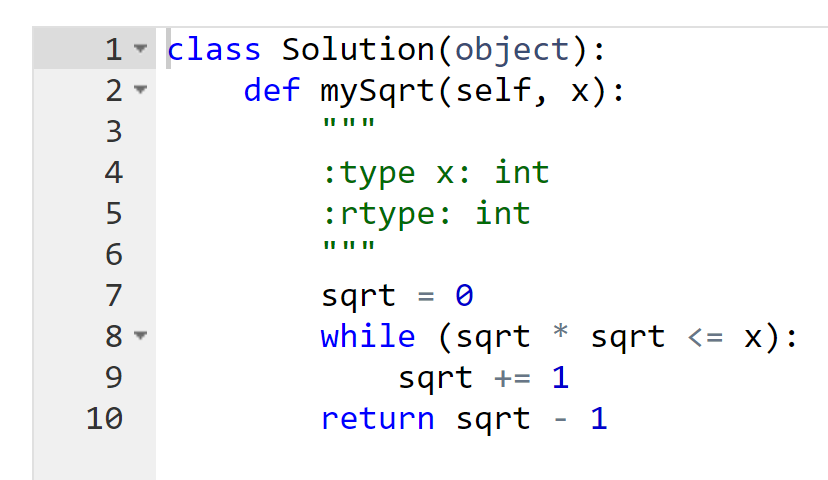
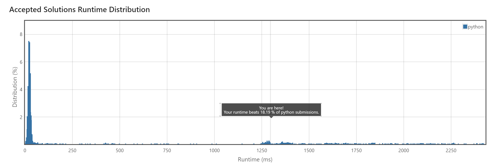

<!-- début résumé -->

Pour ce MON, je vais m'entraîner à résoudre des problèmes d'algorithmie sur la plateforme Leetcode.

<!-- fin résumé -->

## Leetcode

[Leetcode](https://leetcode.com) est une plateforme sur laquelle on trouve de nombreux problèmes d'algorithmie classés par difficulté (Easy, Medium ou Hard), qui peuvent être résolus avec un code relativement court. Il y a notamment des problèmes très demandés en entretien d'embauche et l'un des buts de la plateforme est de préparer à ces entretiens.

On peut choisir dans quel langage on veut résoudre les problèmes, pour ma part j'ai choisi Java pour m'y réhabituer avant mon stage. De nombreuses solutions sont également proposées par les utilisateurs pour chaque problème, ce qui permet de mieux comprendre les problèmes que l'on n'arrive pas à résoudre et de voir les astuces qui permettent d'obtenir des algorithmes plus efficaces en terme de temps et/ou de mémoire.

## Quelques algorithmes sur lesquels j'ai travaillé

### Conversion de chiffres romains en nombres entiers (Easy)

Ce problème consiste à convertir un chiffre romain donné sous forme de chaîne de caractères en entier. Pour le résoudre j'ai additionné dans l'ordre la valeur de chaque caractère. La seule exception est lorsqu'un caractère est suivi d'un caractère d'une valeur supérieur (comme "IV"), auquel cas il faut le retrancher (- 1 + 5 = 4).

### Calcul de la partie entière de la racine carrée d'un entier (Easy)

Comme pour certains problèmes de niveau Medium sur lesquels j'ai travaillé, ce problème montre l'importance du temps de calcul en plus de la correction de l'algorithme : la solution que j'ai fournie tient en 4 lignes et fonctionne, mais elle est nettement moins rapide que les meilleures solutions qui sont proposées. J'ai écrit cet algorithme en Python car l'équivalent écrit en Java n'était pas accepté, pour une raison qui m'échappe.

### Recherche d'un nombre premier palindrome (Medium)

Ce problème consiste à chercher le premier nombre premier palindrome (qui se lit de la même manière dans les deux sens) supérieur à un entier donnée. La première version du code que j'ai écrite testait chaque nombre un par un. Elle n'a pas été accepté à cause d'un "Time Limit Exceeded", sans surprise.

J'ai ensuite essayé d'affiner la recherche en ne regardant que les nombres finissant par 1, 3, 7 ou 9 et en passant certaines plages de nombres en se basant sur la fréquence des palindromes par rapport à l'ordre de grandeur des nombres (par exemple pour des nombres de 4 chiffres, on a généralement des palindromes tous les 100 environ, sauf quelques cas particuliers comme 1991-2002). Mais cela n'a pas suffit à faire accepter mon code.

J'ai ensuite lu une solution proposée qui est assez astucieuse. Elle se base notamment sur le fait que tous les palindromes ayant un nombre pair de chiffres sont multiples de 11, ce qui permet de les éliminer. Ensuite, on parcourt les palindromes ayant un nombre impair de chiffres en les construisant un par un de cette manière :

- ...
- "108" + "01" ("108" à l'envers, sans le "8") -> 10801
- "109" + "01" -> 10901
- "110" + "11" -> 11011
- ...

### Liens

- [Leetcode](https://leetcode.com)
- [Le MON de Léonard sur le même sujet](../../LB/Leetcode)