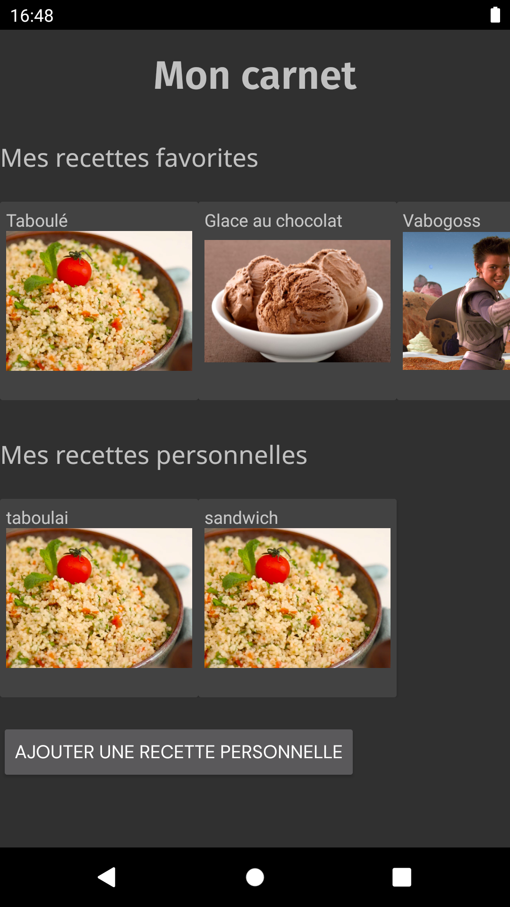
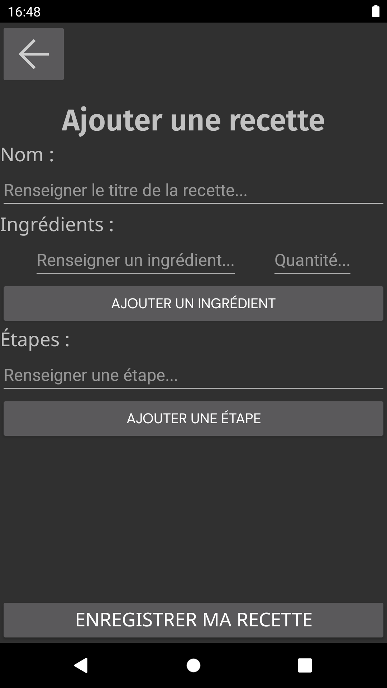

<!-- début résumé -->

Développement d'une application mobile avec Android Studio

<!-- fin résumé -->

## But du POK

Ce POK fait suite à mon MON sur le développement mobile. Je vais utiliser les connaissances que j'ai acquises pour développer l'application Menu du projet Do-It en Java, avec Android Studio. Je le fais sur le temps de mon POK car nous n'auront pas le temps de le faire pendant le projet, nous allons à la place développer l'application en no-code sur Bubble.

### Maquette Figma de l'appli

### L'appli en développement sur Bubble

### L'appli en développement sur Android Studio

La maquette réalisée en projet va donc me servir ici pour appliquer ce que j'ai appris sur Android Studio et cela me permettra d'essayer deux manières de développer une application mobile en parallèle.

## Objectifs

- page carnet
	- recettes favorites
	- recettes personnelles
	- apparence générale

- page recette
	- titre et ingrédients
	- étapes
	- apparence générale

- navigation entre les deux pages

- page ajouter recette
	- champs et boutons
	- apparence générale

- navigation avec les autres pages

- ajout d'une recette à la base de données

- visualisation des recettes de la base de données dans les pages carnet et recette

## Déroulement du POK

Les objectifs que je m'étais fixé étaient relativement bien dosés. Mise à part la gestion des styles et de l'apparence de l'application, j'ai pu tout faire sans trop de difficultés, même si beaucoup de points pourraient encore être largement améliorés.

### Création des trois pages de l'application

Dans un premier temps, j'ai principalement mis en place les éléments visuels de l'application grâce aux fichiers de layout en `.xml`. Cela correspond aux fichiers `html` utilisés en web. Le back est géré en parallèle dans des classes java où l'on récupère les données des champs de texte, on définit les actions des boutons, etc.

### Difficultés pour la gestion des styles

En parallèle, je me suis confronté à la gestion des styles et des thèmes dans l'application, mais j'ai eu du mal à en saisir la logique. Je me suis donc contenté des polices et j'ai poursuivi le développement des fonctionnalités de l'application.

### Gestion de la base de données avec Room

Enfin, pour ce qui est de la gestion de la base de données, j'ai choisi l'ORM Room qui m'a eu l'air d'être assez utilisé en développement mobile. Il est assez simple d'utilisation. Après avoir résolu quelques problèmes j'ai été en mesure d'ajouter des recettes à la base de données depuis l'application et de les visualiser dans la page "recette".

## Captures d'écran

## Difficultés rencontrées

Voici quelques problèmes / solutions que j'ai rencontrés au cours du POK :

- styles :
J'ai eu des difficultés pour savoir comment sont appliqués les styles (notamment la gestion des styles par les fichiers styles.xml et themes.xml) et comment appliquer les styles qu'on veut où on veut. J'ai pu par exemple afficher les polices mais pas les couleurs de texte. J'ai finalement abandonné le fait de reproduire le style visuel de notre maquette pour privilégier l'aspect fonctionnel de l'application.

- logos :
On peut les télécharger sur [fonts.google.com](fonts.google.com), puis les inclure au format xml au projet, dans le dossier 'drawable'

- crash à cause de la base de données :
Au moment de la mise en place de la base de données, l'application crashait systématiquement car elle ne permettait pas à la base de donnée d'être lancée dans le thread principal. J'ai utilisé la méthode `allowMainThreadQueries()` à l'instanciation de la base de données pour remédier au problème, bien que ça ne soit pas recommandé dans l'absolu.

- problème d'affichage :
Dans la page "Ajouter une recette", les listes d'ingrédients / d'étapes (créées à l'aide d'éléments de type RecyclerView) ne s'affichent pas toujours tout de suite et peuvent disparaître. Je n'ai pas trouvé la cause du problème.

- problèmes liés à la base de données :
L'ajout de recettes à la base de données ne fonctionnait car je n'avais pas mis en place la génération automatique d'ID uniques par Room. Une fois l'erreur corrigée, j'ai vu que lors de la modification du modèle de la base de données il faut incrémenter le numéro de version de la base de données et indiquer à Room comment gérer la migration vers cette nouvelle version. La migration se fait soit en indiquant les requêtes nécessaires, soit en autorisant une migration destructives si on ne tient pas à conserver nos données. J'ai opté pour la deuxième option.

- champs non enregistrables en base de données :
Le seul objet que j'enregistre dans ma base de données est l'objet `Recipe`. Certains de ses champs ne sont pas directement enregistrables dans la base de données, j'ai donc dû créer des classes `TypeConverter` qui expliquent à Room comment récupérer ces champs. Cela consiste par exemple à transformer une liste de chaînes de caractères en une chaîne de caractères avec des virgules comme séparateurs, et vice-versa.

- problème lié aux objets EditText (champs de texte pour récupérer un input de l'utilisateur) :
J'avais d'abord mis le texte indiquant comment remplir chaque champs avec l'attribut `text`, ce qui a généré des erreurs et n'était pas pratique pour remplir les champs (il fallait d'abord supprimer le texte de l'indication, qui n'était pas en "arrière-plan"). J'ai ensuite vu qu'il était mieux de mettre ces indices avec l'attribut `hint`.

## Amélioration possibles

- mettre plus de `RelativeLayout` au lieu de `ConstraintLayout`, notamment pour régler le problème du bouton "enregistrer recette" qui remonte quand le clavier s'ouvre
- régler le problème des listes qui s'affichent bizarrement dans "ajouter une recette"
- améliorer les styles / l'apparence de l'appli
- gérer les recettes personnelles / favorites dans la base de données et les afficher correctement (jusque là toute la base de données s'affiche dans "recettes personnelles" et on ne peut pas accéder aux recettes favorites)
- ajouter des messages d'erreur lorsque l'on rentre des mauvaises valeurs dans "ajouter une recette"
- faire en sorte de pouvoir ajouter des images à nos recettes
- (et bien sûr ajouter toutes les autres fonctionnalités de l'Appli Menu)

## Liens

- GitHub du projet : [AppliMenu](https://github.com/nathan-gissler/AppliMenu)
- [Android Studio](https://developer.android.com/studio)
- [Utiliser Room](https://developer.android.com/training/data-storage/room?hl=fr)
- [Google Fonts](fonts.google.com)
- [Mon MON sur le développement mobile](../../../mon/NG/mon-3-1)