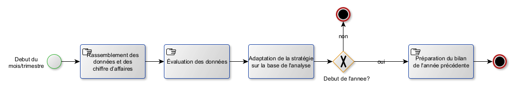
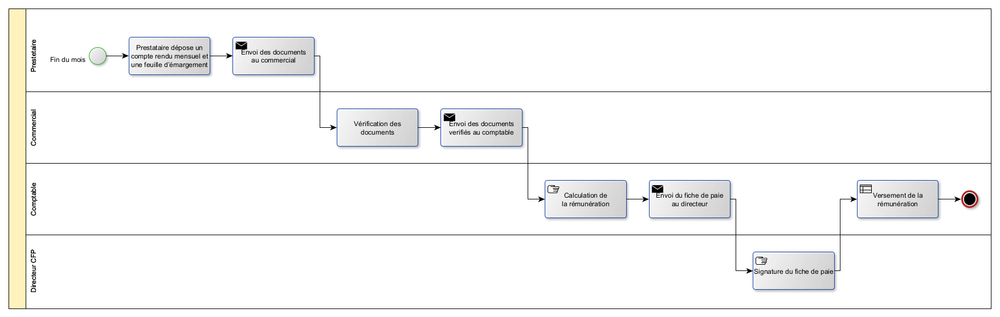

<!-- Début Résumé -->
Ici je vais mettre les informations sur mon MON 2 de temps 1 avec le sujet *diagnostic organisationnel, modélisation des processus, et conception d'un SI*.
<!-- fin résumé -->

## Management summary

Au cours de la consultation de notre cabinet, le statu quo de tous les processus au sein de CFP a été établi, documenté et analysé afin d'en déceler les insuffisances. Sur la base de ces problèmes identifiés, des exigences ont été développées pour un nouveau SI. Ce SI doit permettre de digitaliser et d'automatiser de nombreux processus qui se déroulaient jusqu'à présent manuellement et étaient sujets à des erreurs. En outre, de nombreuses données, qui étaient jusqu'à présent dispersées dans toute l'entreprise, seront rassemblées en un point central. Le nouveau système permettra également d'analyser les données commerciales et d'établir le bilan plus rapidement et dans de meilleures conditions. 
La mise en œuvre de ce SI permettra d'améliorer l'efficacité des opérations et de simplifier les processus. Cela permettra à CFP de continuer à être un pionnier sur le marché avec des solutions de formation innovantes. 


## But du projet
L'objectif du projet est de travailler sur une étude de cas de CFP dans la rôle d'un consultant en informatique et de répondre à autant de questions que possible de l'étude de cas.

Voici les questions :
1. Quelle est la finalité de la mission engagée par le dirigeant?
2. Quelles sont les attentes stratégiques de l’entreprise?
3. Réalisez une cartographie des acteurs.
4. Réalisez une cartographie des processus.
5. Réalisez un modèle de processus BPMN pour chaque processus identifié dans la cartographie.
6. Relevez les dysfonctionnements par rapport à chaque processus.
7. Établir à l’aide d’une matrice SWOT les forces, les faiblesses de l’organisation et du SI actuels ainsi que les opportunités et les risques d’un futur SI ?
8. Quels seraient les objectifs d’un futur SI et quels seraient les indicateurs associés?
9. Donner un aperçu des besoins et des priorités du futur SI.

## Déroulement du projet
### Présentation de l'étude de cas
Dans la présente étude de cas, il s'agit d'une entreprise de taille moyenne, le CFP (centre de formation professionnelle), qui souhaite revoir son SI en profondeur et qui, pour ce faire, fait appel à l'aide d'un consultant SSII. Des entretiens avec le directeur et un commercial permettent de discuter des processus actuels et de leurs problèmes, ainsi que des souhaits concernant le futur SI.

### Glossaire
**BPMN**
Business Process Model and Notation, un langage de modélisation de processus d'affaires.

**CFP**
Centre de Formation professionnelle, le nom de l'entreprise.

**CPF**
Compte personnel de formation (anciennement «DIF - Droit individuel à la formation»), un droit français qui permet aux salariés de suivre des formations professionnelles.

**ESN**
Entreprise de services du numérique (anciennement «SSII - Société de services en ingénierie informatique»), une entreprise qui fournit des services informatiques (p. ex. la consultation, la conception, la mise en œuvre, la maintenance, etc. des systèmes d'information) à d'autres entreprises.

**SWOT**
Strengths, Weaknesses, Opportunities, Threats, une méthode d'analyse stratégique qui permet d'identifier les forces et les faiblesses d'une organisation, ainsi que les opportunités et les menaces.

### Question 1 - Quelle est la finalité de la mission engagée par le dirigeant?
Tous les processus de l'entreprise doivent être analysés et les problèmes doivent être examinés. Ensuite, les processus doivent être améliorés en planifiant également la mise en place d'un SI. L'objectif est de mettre en place un nouveau SI avec les valeurs indicatives suivantes :
- Permettre une réponse aux demandes des clients en 48 heures.
- Permet de conclure un contrat en 5 jours en moyenne.
- Consultation facile des chiffres clés et des KPI.
- Automatisation des tâches répétitives (p.ex. signature de contrats, etc.).

Ce SI doit donc simplifier les processus et améliorer la communication entre les collaborateurs. 

### Question 2 - Quelles sont les attentes stratégiques de l’entreprise?
L'objectif stratégique à atteindre par le biais de la consultation est que CFP reste compétitif à long terme. Pour ce faire, l'entreprise doit atteindre les objectifs suivants :
- Réduire les retards dans le traitement des demandes et des contrats au moins au niveau de la concurrence.
- Augmenter la satisfaction des enseignants en résolvant les problèmes de gestion et de paiement des honoraires.
- L'aspect économique doit être optimisé en utilisant des chiffres clés et des indicateurs clés de performance pour l'analyse du chiffre d'affaires et l'observation du marché.
- L'entreprise doit devenir plus flexible et pouvoir réagir plus rapidement aux changements (p. ex. en cas de modification de la demande de cours).

### Question 3 - Réalisez une cartographie des acteurs.
J'ai dessiné l'esquisse suivante des acteurs et des relations entre eux :

### Question 4 - Réalisez une cartographie des processus.
Une cartographie des processus est une est une représentation des processus d'entreprise dans les domaines suivants qui sont aussi appelés macro-processus : ([source](https://www.advaloris.ch/nos-services/intelligence-organisationnelle/amelioration-de-performance-operationnelle-organisationnelle-dune-entreprise/modelisation-des-processus/cartographie-processus-de-lentreprise-prerequis-management-processus))
- Les **processus primaires/processus opérationnels**: Il s'agit des processus dans lesquels la valeur ajoutée de l'entreprise est réalisée, c'est-à-dire les activités quotidiennes ou les commandes des clients.
- Les **processus de pilotage**: Il s'agit des processus de planification et de gestion de l'entreprise (par ex. gestion de la stratégie et des objectifs).
- Les **processus de soutien**: Il s'agit de processus qui n'apportent pas de valeur ajoutée directe, mais qui sont d'une grande importance pour l'exécution de la prestation dans les processus primaires. 

L'identification des processus dans ces trois domaines sert à préparer la tâche suivante, à savoir la représentation des processus en BPMN. 

#### Processus primaires
- Gestion du catalogue de formation (p.ex. création, modification, suppression de cours)
- Vendre et dispenser une formation à un client (soit un cours du catalogue, soit un cours sur mesure)

#### Processus de pilotage
- Reporting et pilotage de gestion (p.ex. analyse mensuelle et trimestrielle des chiffres (KPI tels que chiffre d'affaires, bénéfice, nouveaux contacts, etc.), création du bilan annuel, etc.)

#### Processus de soutien
- Facturation client
- Paiement des prestataires
- Suivi des activités des commerciaux (pour calculer leur rémunération)
- Maintenance des fichiers clients et enseignants
- Édition des conventions de formation
- Édition des contrats de prestation

### Question 5 - Réalisations des modèles de processus BPMN
#### C'est quoi le BPMN?
BPMN est une **notation de modélisation de processus d'affaires**. Elle permet de représenter les processus d'affaires de manière graphique et standardisée. Elle est utilisée pour la modélisation, la simulation, l'analyse et l'optimisation des processus d'affaires. Pour créer des modèles BPMN, on utilise des elements de base comme les **activités**, des **gateways** et des **events**. Les activités représentent les tâches effectuées par les acteurs. Les gateways permettent de définir les conditions de passage d'une activité à l'autre. Les events représentent les événements qui peuvent se produire pendant le processus. Les éléments de base sont reliés entre eux par des flèches. Les elements de base sont les suivants:

 Éléments de base à partir desquels les diagrammes BPMN sont construits ([source de l'image](https://www.researchgate.net/figure/Basic-elements-of-BPMN-diagrams_fig2_228974950))


Je crée tous mes modèles de processus avec [yEd](https://www.yworks.com/products/yed), un logiciel gratuit pour la modélisation de graphes. La mise en page automatique, en particulier, est très utile.


**Je réponds en même temps à la question 6 (Relevez les dysfonctionnements par rapport à chaque processus) en décrivant les problèmes sous chaque modèle de processus.**

#### Gestion du catalogue de formation
**Dysfonctionnements:**
- Le catalogue n'est mise a jour que 2x par an (pas assez souvent) 
- Le catalogue est diffusé par e-mail (pas très moderne)
- Si un nouveau cours est créé, il n'est pas automatiquement ajouté au catalogue

#### Vendre et dispenser une formation à un client
**Dysfonctionnements:**
- Pas de distribution d'information entre les commerciaux 
- Manque de visibilité de l'entreprise  
- Création de cours sur mesure est lent
- Pas toujours un prestataire pour une formation

#### Reporting et pilotage de gestion

C'est un example d'un diagramme BPMN très simple.

**Dysfonctionnements:**
- Pas de reporting automatique
- Collecte des données manuelle est très complex (sujet à des erreurs)

#### Facturation client
**Dysfonctionnements:**
- Le directeur signe les factures

#### Paie des prestataires

C'est un example d'un diagramme BPMN plus complexe avec des swimlanes.

**Dysfonctionnements:**
- Rendu mensuel + feuille d'emargement en papier
- Le directeur signe le fiche de paie
- Prestatire est payé au debut de mois (c'est un problème, car si le traitement de la demande prend plus de temps, il devra attendre un mois de plus avant de recevoir son argent)

#### Suivi des activités des commerciaux

Pour ce processus, je n'ai pas trouvé assez d'information dans les entretiens. Je vais donc le laisser de côté.


#### Maintenance des fichiers clients et prestetaires
**Dysfonctionnements:**
- Chaque commercial a ses propres prestataires qu'il ne partage pas avec les autres commerciaux
- La liste des clients est un fichier Excel, chaque commercial a une copie qui est different des autres

#### Édition des conventions de formation
Ce processus est déja integrée dans le modèle du processus "vendre et dispenser uen formation a un client"

#### Édition des contrats de prestation
Ce processus est également déja integrée dans le modèle du processus "vendre et dispenser une formation a un client"

### Question 6 - Relevez les dysfonctionnements par rapport à chaque processus.
La question est déjà traitée ci-dessus. Mais pour être complet, j'ai laissé ici mon ancienne liste, que j'ai utilisée pour le brainstorming et qui contient déjà des propositions de solutions pour les problèmes identifiés.


Ici la liste avec tous les dysfonctionnements qui ont été identifié:

| Problème  | Solution proposé|
| ---------------- | --------------- |
| Cataloge: mise a jour 2x par an    | Ne pas distribuer de catalogue, mais rendre l'offre accessible sur un site web |
| Catalogue: diffusé par e-mail    | Envoi d'une newsletter avec un lien vers la site web |
| Rémuneration variable pour les commerciaux    | x  |
| Pas de distribution d'information entre les commerciaux    | Base d'information centrale, interdire d'avoir ses propres fichiers clients/prestetaires  |
| La liste des clients est un fichier Excel, chaque commercial a une copie qui est different des autres | solution centrale  |
| Chaque commercial a ses propres prestataires | Choix du prestetaire autorisé uniquement à partir d'un pool central de prestetaires |
| Rendu mensuel + feuille d'emargement en papier | Faire ca en ligne  |
| Manque de visibilité de l'entreprise   | Création d'une site web qui est mis a jour souvent, enrichi par d'autres choses (blog, ...) |
| Pas toujours un prestataire pour une formation     | Offrir une formation a une entreprise seulement si on a un prestataire  |
| Pas de processus defini pour créer une nouvelle formation   | créer un processus pour faire ca - standardisation |
| Réunions semestrielles  | Les réunions doivent être beaucoup plus souvent (le monde change très vite!)  |
| Le directeur signe le fiche de paie     | Ca n'est pas necessaire, vous devez avoir davantage confiance en vos collaborateurs|
| Prestatire est payé au debut de mois     | Payer les paiements accumulés une fois par semaine |
| Le directeur signe les factures     | Envoyer la facture par e-mail, pas de signature necessaire  |
| Le rassemble mensuellement et trimestriellement des donnée est trop complex | Création des dashboards pour les KPI, mis a jour automatiquement chaque jour|
| La reponse a un client n'est pas assez vite     | x |
| Les employés du CFP n'ont pas de connaissances plus avancées en informatique    | Formation pour le nouveau SI  |


### Question 7 - Création d'une matrice SWOT
#### C'est quoi, une analyse SWOT?
Une analyse SWOT est une analyse stratégique qui permet de déterminer les forces, les faiblesses, les opportunités et les menaces d'une entreprise. Elle est utilisée pour évaluer la situation d'une entreprise et pour définir une stratégie. Les forces et les faiblesses sont des **facteurs internes** à l'entreprise. Les opportunités et les menaces sont des **facteurs externes** à l'entreprise. L'analyse SWOT est donc un outil de **management stratégique**. 

#### La matrice SWOT du CFP
**Strengths**
- Le CFP est une entreprise qui a une longue expérience dans le domaine de la formation, qui est bien établie sur le marché et qui a su élargir constamment sa clientèle.
- L'entreprise dispose d'une très vaste base de données de prestataires, ce qui lui permet de se positionner largement avec un portefeuille étendu.

**Weaknesses**
- En raison de processus obsolètes et de procédures manuelles, il y a souvent des retards, par exemple dans la réponse aux demandes ou le paiement des honoraires.
- La rémunération variable des commerciaux crée de mauvaises incitations et entraîne une concurrence entre eux qui freine l'entreprise dans son ensemble.

**Opportunities**
- La demande d'offres de formation ne cesse d'augmenter et cette tendance n'est pas prête de s'arrêter.
- La digitalisation offre de nombreuses opportunités qui n'ont pas encore été exploitées. 

**Threats**
- La concurrence est forte et les clients ont de nombreuses possibilités de s'informer et de demander des offres.
- De plus en plus de fournisseurs de formations arrivent sur le marché, souvent avec des offres innovantes et des prix avantageux.
- En raison des développements techniques toujours plus rapides et des nouvelles demandes qui en découlent pour les collaborateurs, les formations doivent être adaptées et révisées de plus en plus souvent. Si cela n'est pas fait, l'offre de cours peut devenir totalement obsolète en peu de temps.

### Question 8 - Quels seraient les objectifs d’un futur SI et quels seraient les indicateurs associés?
Pour répondre à cette question, j'ai déduit des problèmes susmentionnés des objectifs sur la manière de les résoudre. Ces objectifs sont présentés dans le tableau ci-dessous, ainsi que des indicateurs clés de performance ( KPI ) possibles pour mesurer la réalisation des objectifs.

| Objectif  | Indicateur(s) associé(s)|
| ---------------- | --------------- |
| Gestion de l'offre de cours sur le site web | Nombre de visites du site web |
| Gestion d'une base de données centrale de tous les clients | Croissance de la clientèle |
| Gestion d'une base de données centrale de tous les prestataires | Exhaustivité des profils, augmentation du nombre de prestataires |
| Automatisation du processus d'honoraires | Temps moyen entre la demande et le paiement des honoraires |
| Trouver un fournisseur pour chaque formation | Rapport entre les offres non réalisées en raison de l'absence de prestataires et toutes les offres |
| Création et envoi automatisés des factures | Temps moyen nécessaire par facturation |

### Question 9 - Donner un aperçu des besoins et des priorités du futur SI.
**Les exigences**
- Simplicité d'utilisation, de sorte que même les collaborateurs peu familiarisés avec l'informatique puissent l'utiliser facilement.
- Le SI ne doit pas compliquer les processus.
- Le SI doit être protégé contre la perte de données et les données doivent être disponibles à tout moment, car les données sont indispensables au travail quotidien.
- Le SI doit stocker et gérer les données des clients et des fournisseurs de manière sécurisée.

**Les priorités**
J'ai sélectionné ce que je considère comme les cinq exigences fonctionnelles les plus importantes et les ai classées par ordre de priorité :
1. des bases de données unifiées de clients et de prestataires, car cela évite immédiatement et efficacement l'annulation inutile de formations parce que les prestataires de services potentiels ne sont pas connus de tous les vendeurs.
2. des processus automatisés qui déchargent les vendeurs, car ils peuvent ainsi se concentrer sur le conseil aux clients et ne doivent pas s'occuper de tâches administratives.
3. traitement électronique des paiements d'honoraires, car les prestataires peuvent ainsi se faire verser les honoraires plus rapidement et plus facilement, leur satisfaction et leur attachement à CFP augmentent.
4. simplifier radicalement la consultation des données et des indicateurs clés de performance (KPI) pour l'analyse des activités, par exemple en créant des tableaux de bord, car cela permet aux responsables d'identifier rapidement et facilement les problèmes et les points à améliorer.
5. des offres de formation actualisées quotidiennement et disponibles via une plate-forme centrale, car les vendeurs peuvent ainsi consulter rapidement et facilement les offres et conseiller le client en conséquence.

## Conclusion et réflexion
En répondant aux questions, une grande partie du projet a déjà été traitée en analysant les processus et en identifiant les problèmes. Si le projet se poursuivait, la conception du vrai SI commencerait maintenant, lequel serait ensuite mis en œuvre et testé.

L'étude de cas est très bien conçue, clairement compréhensible et pourtant suffisamment complexe pour que l'on doive réfléchir pour résoudre les tâches. J'ai pris plaisir à travailler sur cette étude de cas du point de vue d'un consultant et à apprendre les différents aspects organisationnels d'une entreprise autour de l'introduction d'un SI.

## Historique des modifications
- 10/10/2022 : Première version
- 13/10/2022 : Ajout du glossaire
- 17/10/2022 : Finalisation du tâche
- 18/10/2022 : Correction des petites erreurs
- 24/11/2022 - Correction du glossaire (CFP et ESN)

[<-- Retour](../)