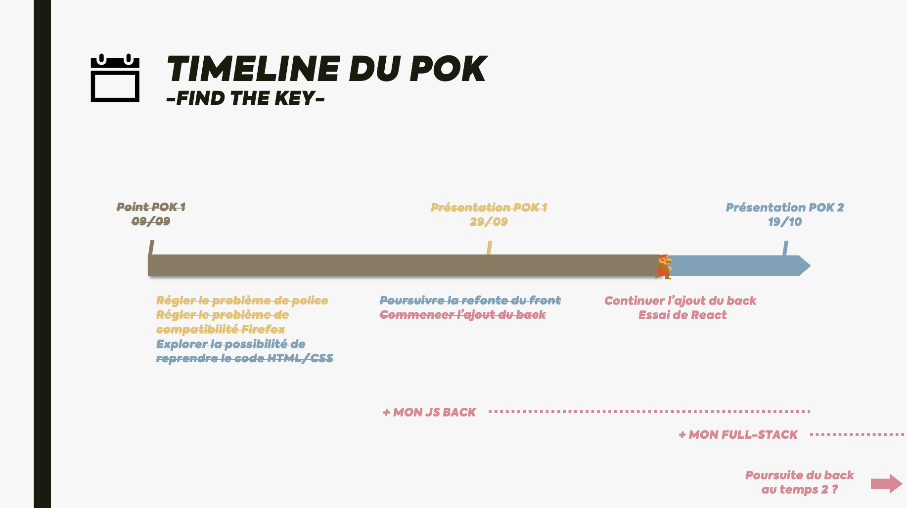
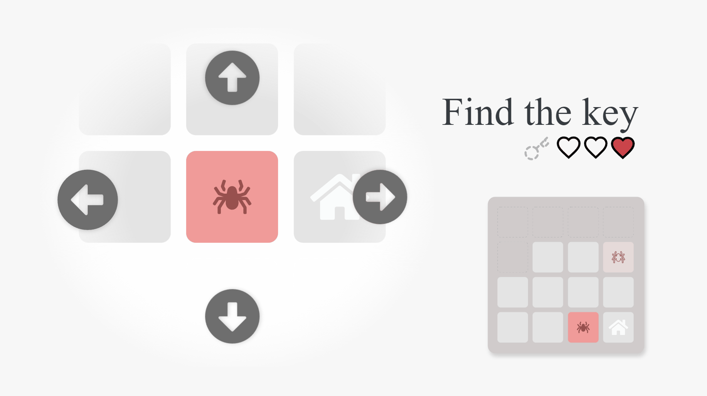

<!-- début résumé -->

Présentation de mon POK du temps 1 & 2 : Find The Key.

Find The Key est un jeu que j'ai développé durant mon S7. Le but est de trouver la clé placée aléatoirement sur un plateau puis de la ramener à la base en évitant les monstres. Il est codé en HTML/CSS/JS pur. Le desing a été réalisé depuis Adobe XD.

<!-- fin résumé -->



**Ressources**

- [Le résultat du POK (front)](https://royantk.github.io/FindTheKey/)
- [Le Github du POK](https://github.com/royantk/FindTheKey)



## Introduction

**Find The Key** est un jeu que j'ai développé durant mon S7. Le but est de trouver la clé placée aléatoirement sur un plateau puis de la ramener à la base en évitant les monstres.


Find The Key a été d'abord designé à l'aide du logiciel de maquettage Adobe XD. J'ai ensuite utilisé un plugin pour transformer ce design en fichiers HTML et CSS. J'ai enfin dû adapter ces fichiers afin de les rendres utilisables pour communiquer avec le fichier JavaScript devant gérer le jeu.

Néanmoins, le projet a rencontré des **problèmes**, dont la plupart liés à l'exportation au format HTML/CSS depuis Adobe XD :

- La maquette étant dessinée par rapport à un certain nombre de pixels, le site n'est donc **pas responsif**
- La **police** utilisée sur le logiciel n'était **pas disponible** dans les fichiers exportés, ce qui rendait impossible leur affichage en ligne
- Le jeu n'est **pas compatible** avec des navigateurs comme **Firefox**. En effet, le fichier JavaScript responsable du placement des cases sur la mini carte utilise du code imcompatible avec le moteur de Firefox.
- Enfin, la **structure générée** par l'exportation au format HTML/CSS par le plugin d'Adobe XD est plutôt **brouillon** : un empilement de balises SVG dont les liens avec le fichier CSS sont mals optimisés et chaotiques. Ainsi, l'**utilisation et la modification du code** se trouvaient très difficiles.

### Objectif - Améliorer et réparer le jeu

Mes objectifs à l'occasion de ce POK sont les suivants :

- **Reprendre, réparer et améliorer** le contenu du projet commencé au S7
- **Transformer** le projet **en un projet Full Stack** à l'aide de Node.js et d'Express afin de gérer la génération des cases en back et de créer un système d'utilisateurs

### To-Do List

N'ayant pas les compétences nécessaires au développement full stack, j'ai décidé de consacrer mes MON à l'apprentissage du développement full stack et de me concentrer uniquement sur la refonte du **front pour le temps 1**. Le **temps 2** sera consacré à l'**implémentation du back**.



- **Temps 1**
  - ~~Régler le problème de police~~ *(fait)*
  - ~~Régler le problème de compatibilité Firefox~~ *(fait)*
  - ~~Reprendre le code HTML/CSS pour l’améliorer (responsivité, gestion du CSS, etc.)~~ *(fait)*
  - ~~Améliorer le jeu~~ *(abandonné)*
    - ~~Ajout d’un personnage~~
    - ~~Ajout de pièces~~
  - Commencer à ajouter une partie « back » au site *(commencé)*
    - ~~Ajouter Parcel JS~~ *(fait et abandonné)*
    - Ajouter React ? *(commencé)*
    - Choix du support (Express ? Flask ?)
- **Temps 2**
  - Continuer d'ajouter la partie « back » au site
    - Création du back
    - Déplacement de la génération des cases
    - Création d'une gestion des utilisateurs

## Progression

### Ajout de la police d'écriture au site



Lors de la création de mon site, j'avais oublié d'importer la police d'écriture que j'utilisais. Résultat : une application toute moche lors de la présentation (qui ne fonctionnait d'ailleurs plus, voir la partie suivante).

Afin d'importer une police, un outil très utile est [**Google Font**](https://fonts.google.com/specimen/Barlow) qui fournit directement le code à ajouter dans le `<head>` du fichier HTML pour chaque police.

Voici un exemple de code pour importer la police **Barlow**, la fière police de la charte graphique de Centrale Méditerranée (le code est à ajouter dans le `<head>` du fichier HTML) :

```html
<link rel="preconnect" href="https://fonts.googleapis.com">
<link rel="preconnect" href="https://fonts.gstatic.com" crossorigin>
<link href="https://fonts.googleapis.com/css2?family=Barlow:wght@100;200;300;400;500;600;700;800;900&display=swap" rel="stylesheet">
```

### Résolution des problèmes de compatibilité


Afin de résoudre les problèmes de compatibilité rencontrés, j'ai tenté de débugger mon code dans Firefox afin d'identifier ce qui n'allait pas. J'ai découvert qu'**une ligne de code CSS n'était pas exécutée par le navigateur Firefox alors qu'elle l'était sur Chrome**, ce qui créait ce problème sur un navigateur et pas l'autre.

**Le problème** : J'avais simplement **oublié un "px"** en définissant une position. Chrome corrigeait lui-même l'erreur lors de son interprétation du code, ce que Firefox ne faisait pas. Ajouter le "px" a donc résolu le problème.

### Refonte du CSS


L'un des objectifs principaux de ce POK était également de **traiter la responsivité du site**. En effet, le site initial étant été généré à partir d'une maquette Adobe XD aux dimensiosn fixes, il n'est pas responsive, c'est à dire qu'il ne s'adapte pas selon à la taille de l'écran de l'utilisateur. Cela rend l'**utilisation de l'application impossible sur un petit écran**.

J'ai ainsi voulu recréer le site Web d'une manière responsive. Pour cela, j'ai **repris tout le code HTML/CSS à zéro**. Un des *points faibles* de ma démarche à été, je pense, de ne pas utiliser d'outil (comme des frameworks ou des librairies) pour créer mon code, ce qui ne correspond pas forcément à ce qui est fait en réalité et a pu ralentir mon projet. Néanmoins, même si ce n'était pas la manière la plus optimale, je pense que cet exercice m'a permis de **mieux saisir le fonctionnement et la structure des languages HTML et CSS**.

Pendant cette refonte du code, j'ai ainsi pu découvir plusieurs fonctionnalités du language CSS. Je me suis également retrouvé face à deux outils principaux qui pouvait m'être utiles pour structurer mes différents composants :

- Les `grid` : qui permettent de créer des grilles.
- Les `flexbox` : qui permettent de créer des objets flexibles

J'ai eu beaucoup de mal à gérer les flexboxes. Les grid se sont avérées beaucoup plus simple d'utilisation et beaucoup plus proches de ce que je voulais.

## Exploration de frameworks (React, Parcel, Tailwind...)

Après avoit exploré les possiblités du code HTML/CSS, j'ai voulu explorer les possibilités de frameworks pour le développement front-end. J'ai ainsi testé **Parcel** et **React**. J'ai également découvert **Tailwind**, un framework CSS qui permet de créer des sites web très rapidement.

Néanmoins, je n'ai pas pu aller plus loin dans l'utilisation de ces outils, car je n'ai pas réussi à les intégrer à mon projet. J'ai donc abandonné l'utilisation de ces outils pour le moment. L'utilisation de ces outils sera donc un objectif pour la prochaine période lors de laquelle je m'attaquerai à la partie back-end du site.

## Construire API pour récupérer les cases

J'ai commencé à construire l'API qui permettra de récupérer les cases générées par le jeu. J'ai utilisé le framework **Flask** pour créer cette API. J'ai également utilisé **Postman** pour tester l'API. Cette API permettra également de récupérer les informations du joueur (points de vie, position, etc.).

## Conclusion

Ce POK m'a permis de découvrir plus en détail le développement front-end. J'ai pu approfindir les bases du HTML et du CSS, ainsi que les possibilités de frameworks pour le développement front-end.

Lors de la prochaine période, je m'attaquerai à la partie back-end du site. Je m'attaquerai également à la création d'une API qui permettra de récupérer les informations du joueur (points de vie, position, etc.).

[<-- Retour](../)
