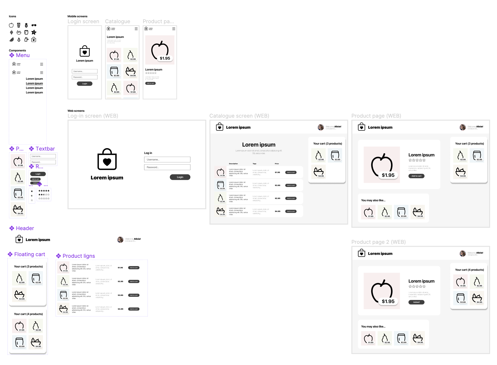
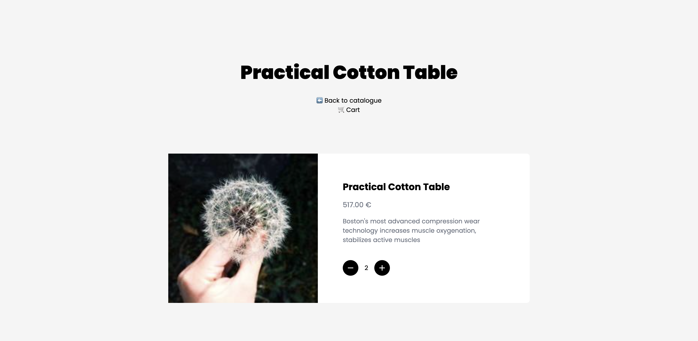
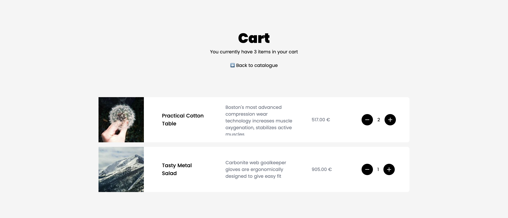

<!-- début résumé -->

Ce POK présente le développement d’une plateforme simple de e-commerce à l’aide de différentes technologies web (React, MUI, TailwindCSS…)

<!-- fin résumé -->

[<-- Retour](../)



- [👀 Voir le site en ligne](http://cerfeuil.ovh1.ec-m.fr:1234/)
- [Le Github du POK](https://github.com/royantk/POK3)
- [[MON] Débutez avec React](https://francoisbrucker.github.io/do-it/mon/royantk/temps_2/react/)
- [[Documentation] React](https://fr.reactjs.org/docs/getting-started.html)
- [[Documentation] React-Redux](https://react-redux.js.org/introduction/getting-started)
- [[Documentation] Material Design UI (MUI)](https://mui.com/material-ui/getting-started/overview/)
- [Getting Started - Parcel.js](https://parceljs.org/getting-started/webapp/)
- [Create React App - Documentation](https://create-react-app.dev/)
- [Chat GPT](https://chat.openai.com/chat)



## Introduction

L’objectif de ce POK est de **concevoir une boutique en ligne simple** utilisant des **technologies de développement web modernes**, notamment React. Pour cela, j’ai décidé de reprendre une maquette Figma que j’ai réalisé à lors de la création d’une formation afin d’avoir une vue claire de l’endroit où amener ce POK.




Afin d’identifier les différentes technologies que j’allais pouvoir utiliser, j’ai fais des recherches. J’en ai constitué un **MON** que vous pouvez consulter ici : [[MON] Technologies web](../../../mon/royantk/temps_3/technologies)



### Organisation et to-do

Afin de réaliser ce POK, j’ai identifié les tâches nécessaires suivantes. Ces tâches sont susceptibles d'évoluer.

#### **~~🌳 Général~~ *(fait)***

- ~~Comprendre le fonctionnement des bibliothèques (React, MUI, TailwindCSS, Parcel)~~
- ~~Mettre en place l’environnement du projet~~

#### **~~📑 Page catalogue~~ *(fait)***

- ~~Récupérer une liste de produits depuis un fichier JSON ou une API~~
- ~~Afficher la liste de produits sur la page~~
- ~~Pour chaque produit, afficher son nom, sa description, son prix et une image~~
- ~~Ajouter un bouton "Ajouter au panier" pour chaque produit~~
- Ajouter le header du tableau

#### **~~📄 Page produit~~ *(fait)***

- ~~Créer une page pour afficher les détails d'un produit sélectionné~~
- ~~Afficher le nom, la description, le prix et l'image du produit~~
- ~~Ajouter un bouton "Ajouter au panier"~~
- ~~Associer la page produit à la page catalogue~~

#### **~~🛒 Panier~~ *(fait)***

- ~~Créer un composant pour afficher le contenu du panier~~
- ~~Afficher les produits ajoutés au panier (nom, prix, quantité)~~
- ~~Afficher le prix total du panier~~
- ~~Ajouter la possibilité de modifier la quantité de chaque produit dans le panier~~
- ~~Ajouter la possibilité de supprimer un produit du panier~~

## Structure de l’application

### Composants nécessaires

J’ai repris ma maquette Figma pour définir les différents composants React nécessaires pour réaliser le prototype, ainsi que leurs designs respectifs. Voici ci-dessous les composants Figma.



## Arborescence des fichiers

Voici l’organisation de mes fichiers sources. J’ai divisé mon application en composants React, appelés dans une application globale App.js. Il n’y a qu’un seul fichier de style car le style des composant est directement écrit en Tailwind dans les fichiers React.

```bash
src/
├── components/
│   ├── AddToCart.js
│   ├── Catalogue.js
│   ├── CatalogueItem.js
│   └── Header.js
├── styles/
│   └── App.css
├── App.js
├── index.html
└── index.js
```

## Sprint 1 - Création de l’app et du catalogue

Le code ci-dessous représente la version 1 du prototype d'application React développée dans le cadre d'un POK sur la création d'une boutique en ligne. Cette version contient la page du catalogue, qui permet d'afficher les produits disponibles à l'achat. Le code utilise TailwindCSS pour appliquer des styles au composant et des composants Material-UI pour ajouter des fonctionnalités supplémentaires tels que les boutons d'ajout au panier.


### App.js

./App.js

Le code suivant est un extrait de l'application React développée dans le cadre d'un POK sur la création d'une boutique en ligne. Il s'agit du code de la fonction `App`, qui est le composant principal de l'application. Cette fonction retourne du JSX (JavaScript avec des balises XML), qui permet de décrire l'interface utilisateur de l'application.

```jsx
const products = ['...']  // Contient des produits

export function App() {

  const [cart, setCart] = useState([]);

  const addToCart = (product) => {
    setCart([...cart, product]);
  };

  return (
    <StyledEngineProvider injectFirst>
      <div className="app">
        <div className="app-head">
          <h1>Lorem Ipsum</h1>
          <p>Lorem Ipsum Dolor Sit Amet</p>
        </div>
        <Catalogue products={products} addToCart={addToCart} />
      </div>
    </StyledEngineProvider>

  );
}
```

Dans ce code, la fonction `useState` est utilisée pour stocker les produits ajoutés au panier par l'utilisateur. La fonction `addToCart` permet d'ajouter un produit au panier en mettant à jour l'état `cart` avec la fonction `setCart`.

Le JSX retourné par la fonction `App` contient un `StyledEngineProvider`, qui enveloppe un `div` avec une classe `app`. Ce div contient un titre (`h1`) et un paragraphe (`p`) qui ne sont pas pertinents pour la compréhension du code. Enfin, il y a un composant `Catalogue` qui prend deux props (`products` et `addToCart`). Cela signifie que le composant `Catalogue` est appelé avec ces deux props.

Le composant `StyledEngineProvider` est utilisé pour faire fonctionner TailwindCSS avec Material-UI. Concrètement, il permet d'injecter les styles dans l'application et de les rendre compatibles avec les composants Material-UI. Il s'agit donc d'un élément important pour utiliser les deux bibliothèques de manière conjointe dans une application React.

### Catalogue

./components/Catalogue.js

```jsx
import { CatalogueItem } from './CatalogueItem';

const addToCart = (product) => {
    console.log('Adding to cart:', product);
};

export function Catalogue(props) {
    return (
        <div className="flex flex-col space-y-4">
            {props.products.map((product) => (
                <CatalogueItem product={product} addToCart={addToCart} key={product.id} />
            ))}
        </div>
    );
}
```

Le code représente le composant `Catalogue` de l'application React. Ce composant est appelé dans le composant principal `App`. Le composant `Catalogue` prend une seule prop appelée `products`, qui est un tableau d'objets représentant les produits à afficher. Le composant `Catalogue` utilise la méthode `.map()` pour itérer sur le tableau des produits et afficher chaque produit à l'aide du composant `CatalogueItem`.

Le composant `CatalogueItem` prend deux props, `product` et `addToCart`. Le composant `addToCart` est une fonction qui sera appelée lorsqu'un utilisateur clique sur le bouton "Add to cart" dans le composant `CatalogueItem`.

Le code utilise également TailwindCSS pour appliquer des styles au composant `Catalogue`. Le conteneur principal est un div avec une classe `flex` qui utilise la direction verticale (`flex-col`) et ajoute un espacement vertical (`space-y-4`) entre chaque élément dans le conteneur. Le composant `CatalogueItem` est appelé pour chaque produit et est rendu à l'intérieur du conteneur principal.

### CatalogueItem

./components/CatalogueItem.js

```jsx
import { AddToCart } from './AddToCart';

export function CatalogueItem(props) {
    return (
        <div className="bg-white rounded-lg flex flex-row items-center space-x-16 pr-12">
            
            <h3 className="my-2 text-lg font-medium max-h-28 w-40 overflow-hidden">{props.product.name}</h3>
            <p className="break-words text-gray-500 max-h-28 w-60 overflow-hidden">{props.product.description}</p>
            <p className="break-words text-gray-500 max-h-28 w-28 overflow-hidden">{props.product.price} €</p>
            <AddToCart product={props.product} addToCart={props.addToCart} />
        </div>
    );
}
```

Le composant `CatalogueItem` est utilisé pour afficher les détails d'un produit dans le catalogue. Il prend deux props: `product` et `addToCart`. La prop `product` est un objet qui contient les informations du produit telles que l'image, le nom, la description et le prix. La prop `addToCart` est une fonction qui sera appelée lorsque l'utilisateur cliquera sur le bouton "Add to cart".

Le code utilise TailwindCSS pour appliquer des styles au composant `CatalogueItem`. Le conteneur principal est un div avec une classe `bg-white` qui ajoute une couleur de fond blanche au composant. Il utilise également la classe `rounded-lg` pour arrondir les coins du composant et `flex` pour afficher les éléments à l'intérieur du conteneur en ligne. `items-center` est utilisé pour aligner les éléments verticalement et `space-x-16` ajoute un espacement horizontal de 16 pixels entre chaque élément.

Le code utilise également l'objet `props.product` pour afficher l'image, le nom, la description et le prix du produit. `props.product.image` est utilisé pour afficher l'image du produit. `props.product.name` est utilisé pour afficher le nom du produit, et `props.product.description` est utilisé pour afficher la description du produit. `props.product.price` est utilisé pour afficher le prix du produit, avec le symbole de l'euro.

Le composant `AddToCart` est également appelé à la fin du composant `CatalogueItem`. Cette fonctionnalité permet à l'utilisateur d'ajouter le produit au panier en cliquant sur le bouton "Add to cart". La prop `product` est passée à `AddToCart` pour que la fonction `addToCart` sache quel produit ajouter au panier.

### AddToCart

```jsx
import Button from '@mui/material/Button';
import Add from '@mui/icons-material/Add';

export function AddToCart(props) {
    return (
        <Button
            startIcon={<Add />}
            variant="contained"
            className='bg-black hover:bg-white hover:text-black text-white font-bold py-2 px-6 rounded-full'
            onClick={() => props.addToCart(props.product)}
        >
            Add to cart
        </Button>
    );
}
```

Le composant `AddToCart` est appelé à partir du composant `CatalogueItem` et contient un bouton "Add to cart" qui permet à l'utilisateur d'ajouter un produit au panier.

Le composant `AddToCart` utilise les composants `Button` et `Add` de la bibliothèque MUI pour créer le bouton, et utilise TailwindCSS pour appliquer des styles supplémentaires au bouton. Le bouton est configuré pour avoir une icône "Add" à gauche du texte "Add to cart", et le texte du bouton est centré.

Lorsque l'utilisateur clique sur le bouton "Add to cart", la fonction `props.addToCart` est appelée avec l'objet `props.product` en tant que paramètre. Cela permet à la fonction `addToCart` de savoir quel produit ajouter au panier.

[https://isotropic.co/react-multiple-pages/](https://isotropic.co/react-multiple-pages/)

## Sprint 2 - Ajout de la page produit avec React Router



[https://upmostly.com/tutorials/how-to-pass-param-to-a-component-in-react-router](https://upmostly.com/tutorials/how-to-pass-param-to-a-component-in-react-router)

Dans cette section, nous allons ajouter une page produit à notre application de commerce électronique. Nous allons utiliser `React Router` pour créer des routes pour chaque page produit, en utilisant l'ID du produit comme paramètre d'entrée.

### Installation de React Router

Pour commencer, nous devons installer `React Router`. Vous pouvez l'installer en utilisant `npm` en exécutant la commande suivante :

```bash
npm install react-router-dom --save
```

### Configuration de l'application

Tout d'abord, nous allons ajouter une nouvelle page pour afficher les détails du produit. Créez un nouveau fichier nommé `Product.js` dans le dossier `components` et ajoutez le code suivant :

```jsx
import { useParams } from "react-router";
import { CatalogueItem } from './CatalogueItem';
import { Link } from 'react-router-dom';
import { AddToCart } from "./AddToCart";

export function Product(props) {
  let { id } = useParams();

  if (id > props.products.length) {
    return (
      <div className='app'>
        <div className="app-head">
          <h1>Product {id} not found</h1>
          <Link className="mt-6" to="/">⬅️ Back to catalogue</Link>
          <Link to="/cart">🛒 Cart</Link>
        </div>
      </div>
    );
  }

  return (
    <div className='app'>
      <div className="app-head">
        <h1>{props.products[id - 1].name}</h1>
        <Link className="mt-6" to="/">⬅️ Back to catalogue</Link>
        <Link to="/cart">🛒 Cart</Link>
      </div>
      <div className="bg-white rounded-lg flex flex-row items-center space-x-16 pr-12">
        <Link to={"/product/" + props.products[id - 1].id}>
          
        </Link>
        <div className="bg-white rounded-lg flex flex-col items-left space-y-4 pr-12">
          <h2 className="text-2xl font-bold max-h-28 w-96 overflow-hidden">{props.products[id - 1].name}</h2>
          <h3 className="text-lg break-words text-gray-500 max-h-28 w-96 overflow-hidden">{props.products[id - 1].price} €</h3>
          <p className="pb-6 break-words text-gray-500 max-h-28 w-96 overflow-hidden">{props.products[id - 1].description}</p>
          <AddToCart className="" product={props.products[id - 1]} addToCart={props.addToCart} removeFromCart={props.removeFromCart} cart={props.cart} />
        </div>

      </div>
    </div>
  );
}
```

Ce composant récupère l'ID du produit à partir des paramètres d'URL et affiche toutes les informations concernant ce composant de la même manière que le composant `CatalogItem`.

Ensuite, nous allons déplacer notre page d’accueil dans un composant `Home`. 

```jsx
import { Catalogue } from './Catalogue';
import { Link } from 'react-router-dom';

export function Home(props) {
    return (
        <div className="app">
          <div className="app-head">
            <h1>Lorem Ipsum Store</h1>
            <p>Welcome! There are {props.products.length} products in the catalogue</p>
            <Link className="mt-6" to="/cart">🛒 Cart</Link>
          </div>
          <Catalogue products={props.products} addToCart={props.addToCart} removeFromCart={props.removeFromCart} cart={props.cart} />
        </div>
    );
  }
```

Enfin, nous allons ajouter une nouvelle route pour notre page produit. Ouvrez le fichier `App.js` et ajoutez le code suivant :

```jsx
import { BrowserRouter as Router, Routes, Route } from 'react-router-dom';
import Home from './components/Home';
import Product from './components/Product';

...

export function App() {
  const [cart, setCart] = useState([]);

  const addToCart = (product) => {
    setCart([...cart, product]);
  };

  return (
    <Router>
      <div>
        <Routes>
          <Route exact path="/" element={<Home products={products} addToCart={addToCart}/>}/>
          <Route path="/product/:id" element={<Product  products={products} addToCart={addToCart}/>} />
        </Routes>
      </div>
    </Router>
  );
}
```

Nous avons ajouté une nouvelle route pour notre page produit. La route utilise le paramètre d'entrée `id` pour identifier le produit à afficher. Notez que nous avons également ajouté un en-tête et enveloppé les routes dans une balise `div` pour faciliter la mise en page.

### Mise à jour du composant CatalogueItem

Maintenant que nous avons ajouté une page produit, nous devons mettre à jour le composant `CatalogueItem` pour inclure un lien vers la page produit pour chaque produit. Ouvrez le fichier `CatalogueItem.js` et ajoutez le code suivant :

```jsx
import Card from '@mui/material/Card';
import { AddToCart } from './AddToCart';
import { Link } from 'react-router-dom';

export function CatalogueItem(props) {
    return (
        <div className="bg-white rounded-lg flex flex-row items-center space-x-16 pr-12">
            <Link to={"/product/" + props.product.id}>
                
            </Link>
            <h3 className="my-2 text-lg font-medium max-h-28 w-40 overflow-hidden">{props.product.name}</h3>
            <p className="break-words text-gray-500 max-h-28 w-60 overflow-hidden">{props.product.description}</p>
            <p className="break-words text-gray-500 max-h-28 w-28 overflow-hidden">{props.product.price} €</p>
            <AddToCart product={props.product} addToCart={props.addToCart} />
        </div>
    );
}
```

Nous avons enveloppé l'image du produit dans un lien `Link` pour que l'utilisateur puisse cliquer sur l'image pour accéder à la page produit. La prop `to` de `Link` utilise l'ID du produit pour créer une URL unique pour chaque produit.

## Sprint 3 - Ajout de la gestion du panier



### Création de la page du panier

Le composant `Cart` est une page qui affiche la liste des produits du panier. Il importe le composant `CatalogueItem`. Attention: le panier ne doit afficher qu'une seule instance de chaque produit, même si le même produit a été ajouté plusieurs fois au panier.

```jsx
import { CatalogueItem } from './CatalogueItem';
import { Link } from 'react-router-dom';

export function Cart(props) {
    const uniqueProducts = Array.from(new Set(props.cart));
    return (
        <div className="app">
            <div className="app-head">
                <h1>Cart</h1>
                <p>You currently have {props.cart.length} items in your cart</p>
                <Link className="mt-6" to="/">⬅️ Back to catalogue</Link>
            </div>
            <div className="flex flex-col space-y-4">
                {uniqueProducts.map((product) => (
                    <CatalogueItem product={product} addToCart={props.addToCart} removeFromCart={props.removeFromCart} cart={props.cart} key={product.id}/>
                ))}
            </div>

        </div>
    );
}

```

Le composant `Cart` utilise `Array.from(new Set(props.cart))` pour obtenir un tableau unique de produits (c'est-à-dire qu'il n'y aura qu'une seule instance de chaque produit dans le tableau). Le code utilise également `Link` pour permettre à l'utilisateur de revenir à la page du catalogue. La prop `to` de `Link` est utilisée pour créer une URL pour la page du catalogue.

Le composant `Cart` utilise `uniqueProducts.map()` pour itérer sur le tableau de produits uniques et afficher chaque produit à l'aide du composant `CatalogueItem`. Les props `product`, `addToCart`, `removeFromCart` et `cart` sont passées à `CatalogueItem` pour permettre l'affichage du produit, l'ajout et la suppression du produit dans le panier.

Le composant `CatalogueItem` est également utilisé pour afficher les produits dans le panier, mais il est appelé avec des props supplémentaires (`removeFromCart` et `cart`) pour permettre la suppression de produits du panier. Cela signifie que `CatalogueItem` peut être utilisé à la fois pour afficher les produits dans le catalogue et les produits dans le panier.

### Mise à jour des boutons d’ajout au panier

Le code a été mis à jour pour prendre en charge la gestion de la quantité d'un produit dans le panier, ainsi que la suppression d'un produit du panier.

Le composant `AddToCart` a été modifié pour afficher la quantité d'un produit dans le panier. Si le produit est déjà dans le panier, le bouton "Add to cart" est remplacé par deux boutons, un pour ajouter une unité du produit et un autre pour en retirer une. Pour cela, le composant utilise la fonction `filter()` pour compter le nombre d'occurrences du produit dans le panier.

Le composant `AddToCart` prend également une nouvelle prop, `removeFromCart`, qui est une fonction pour supprimer un produit du panier. Cette fonction est appelée lorsque l'utilisateur clique sur le bouton pour retirer une unité du produit.

Voici le nouveau code pour le composant `AddToCart` :

```jsx
import Button from '@mui/material/Button';
import Add from '@mui/icons-material/Add';
import Button from '@mui/material/Button';
import Remove from '@mui/icons-material/Remove';
import IconButton from '@mui/material/IconButton';

export function AddToCart(props) {
    if (props.cart.filter((item) => item.id === props.product.id).length > 0) {
        return (
            <div className="flex flex-row items-center space-x-4">
                <IconButton
                    className='bg-black hover:bg-white hover:text-black hover:shadow text-white py-2 rounded-full'
                    onClick={() => props.removeFromCart(props.product)}
                >
                    <Remove />
                </IconButton>
                <p>{props.cart.filter((item) => item.id === props.product.id).length}</p>
                <IconButton
                    className='bg-black hover:bg-white hover:text-black hover:shadow text-white py-2 rounded-full'
                    onClick={() => props.addToCart(props.product)}
                >
                    <Add />
                </IconButton>
            </div>
        );
    }
    return (
        <Button
            startIcon={<Add />}
            variant="contained"
            className='bg-black max-w-fit hover:bg-white hover:text-black text-white font-bold py-2 px-6 rounded-full'
            onClick={() => props.addToCart(props.product)}
        >
            Add to cart
        </Button>
    );
}

```

La fonction `addToCart` a également été mise à jour pour prendre en charge la gestion de la quantité d'un produit dans le panier. Si le produit est déjà dans le panier, la fonction ne doit ajouter qu'une seule instance du produit. Pour cela, la fonction utilise la fonction `indexOf()` pour trouver la première occurrence du produit dans le panier. Elle utilise ensuite la fonction `filter()` pour supprimer cette occurrence du panier, puis ajouter une nouvelle instance du produit.

La fonction `removeFromCart` a été ajoutée pour supprimer un produit du panier. Elle utilise la fonction `indexOf()` pour trouver la première occurrence du produit dans le panier, puis utilise la fonction `filter()` pour supprimer cette occurrence du panier.

Voici le nouveau code pour la gestion du panier :

```jsx
  const [cart, setCart] = useState([]);

  const addToCart = (product) => {
    const index = cart.indexOf(product);
    if (index === -1) {
      setCart([...cart, product]);
    } else {
      const newCart = [...cart];
      newCart.splice(index, 1);
      setCart([...newCart, product]);
    }
  };

  const removeFromCart = (product) => {
    const index = cart.indexOf(product);
    setCart(cart.filter((_, i) => i !== index));
  };

```

## Conclusion du POK

Dans ce POK, nous avons appris comment créer une application de commerce électronique avec React, TailwindCSS et MUI. Nous avons commencé par créer un catalogue de produits à l'aide du composant `CatalogueItem`, puis nous avons appris comment créer des pages de produits avec React Router en utilisant l'ID du produit comme paramètre d'entrée. Enfin, nous avons mis en place la gestion du panier avec la page du panier qui affiche la liste des produits du panier et la possibilité de supprimer des produits du panier.

[<-- Retour](../)
