Notre projet est de créer une appli pour les étudiants qui ont du mal à trouver des idées de repas et ceux qui veulent planifier leurs courses.

## Notre idée :

Nous sommes partis du constat que nous mangeons souvent les mêmes plats et que nous passons beaucoup de temps devant notre frigo à décider quoi préparer à manger avant de se rabattre sur des pâtes. Nous souhaitons apporter une solution numérique à ce problème en permettant aux étudiants comme nous de manger varier et bon. La solution que nous avons imaginée va prendre la forme d'une application mobile (collaborative, on l'espère) qui génère facilement des menus pour la semaine, adaptés à tous, ainsi que les listes de courses associées.

Voici un pitch que nous avons préparé en cours de Collective Intelligence : https://applimenu.carrd.co/.

## Nos grandes étapes et notre organisation :

Les cours que nous avons au cours de l'année nous ont permis de comprendre comment conduire un projet, comment s'assurer de sa pertinence, etc. C'est comme ça que nous avons décidé de notre plan de route.
Nous avons commencé par interviewer notre public cible, les étudiants, d'octobre à novembre, pour formaliser les besoins autour de notre thématique. Nous avons eu une longue période de maquettage de fin novembre jusqu'à mars. Ensuite, lorsque nous avons eu une maquette viable, nous l'avons fait tester auprès des étudiants que nous avions interviewés en début d'année et nous l'avons fait évoluer grâce à leurs critiques. Nous avons pu ensuite créer l'application grâce à Bubble et travailler sur notre base de données pour les recettes.

Pour nous organiser en tant qu'équipe, nous avions distribué les grandes tâches du projet pour s'attribuer les différentes responsabilités. Nous savions que nous allions tous avancer ensemble sur la plupart des tâches mais cela nous a permis de savoir qui était chargé de relancer le travail sur chaque partie du projet. C'est comme cela que nous avons avancé pendant une grande partie de l'année : tous ensemble sur les mêmes sujets. Nous n'avons dû nous séparer que les deux derniers mois. En effet, pendant que certains continuaient à peaufiner les maquettes, d'autres commençaient à s'intéresser au fonctionnement de Bubble et à expérimenter certaines fonctionnalités du site web. Ensuite, sur Bubble même, chacun avait un rôle défini : une personne était en charge du Workflow, une autre en charge de la Base de Données, une autre du Design et une dernière était chargée d'aider les différents rôles qui avaient besoin d'aide. Tout le monde créait des éléments sur l'application en se basant sur la dernière maquette Figma à jour.

## Définition des besoins :

Pour pouvoir définir les besoins auxquels nous pouvions répondre, nous avons interviewé des étudiants variés (habitant seul, en colocation, etc.). Nous avons tiré des réponses des fonctionnalités ou des concepts à mettre en œuvre dans l'application pour qu'elle soit adaptée à notre public cible. Nous avons également passé en revue de nombreuses applications déjà sur le marché pour pouvoir déterminer les choses à faire et à ne pas faire dans notre projet. Le meilleur cas de figure était lorsqu'un étudiant à qui nous posions des questions nous parlait d'une application qu'il connaissait pour en faire une critique.
Nous avons traduit tous ces besoins en fonctionnalités que nous avons classées par ordre d'importance.

Minimum pour que ça marche : 
- Pouvoir afficher une recette
- Générer des recettes
- Afficher un planning des recettes
- Modifier le nombre de personnes
- Générer une liste de course en fonction des recettes
------------------------------------------------------------------------------------------------------------------------
Fonctionnalités qui apporte de l’intérêt à notre appli : 
- Pouvoir prendre en compte la liste des ingrédients déjà possédés
- Mettre des filtres (coût, difficulté, calories, temps, régime alimentaire)
- Créer un profil utilisateur
- Ajouter ses propres recettes
- Ajouter favori
- Recettes collaboratives
- Générer une recette à partir d’un ingrédient
- Liste de courses triée par rayons
-------------------------------------------------------------------------------------------------------------------------
Bonus pur : 
- S’adapter aux saisons
- Mettre une vidéo des recettes
- Mettre image ingrédients
- Ajouter une recette depuis Internet

## Notre poster :

## Maquettes :

#### Expérience Utilisateur (UX) :

Nous avons eu un cours sur l'UX qui nous a appris à prendre en compte les différents parcours utilisateurs dans la création de l'application. Nous avons aussi pris en main Figma, un site web qui permet de créer des maquettes interactives. C'est pendant ce cours que nous avons créé la première maquette.

#### Première maquette :

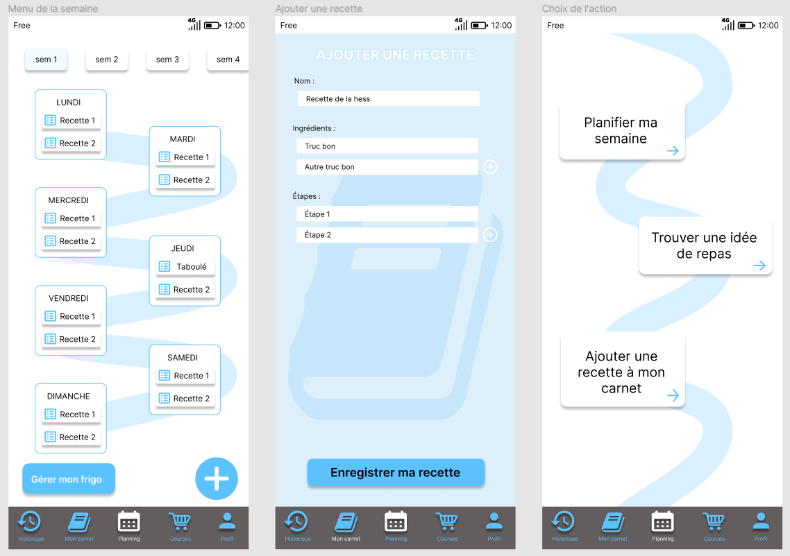

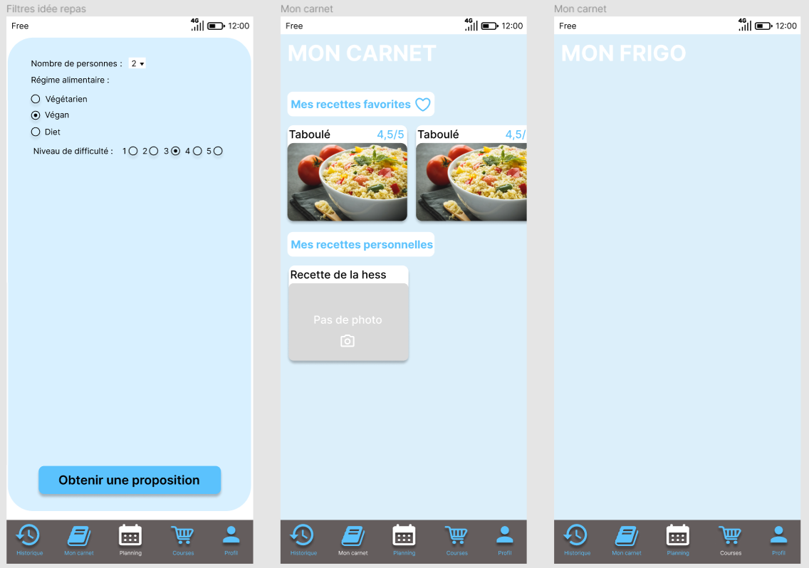

#### Retours des étudiants (partie 1) : 

Les premiers retours que nous avons obtenus à propos de cette maquette sont venus de nos camarades de Do-IT. D'une façon générale, l'application n'était pas très belle, pas particulièrement intuitive et certaines fonctionnalités semblaient manquer ou, au contraire, étaient de trop.
Notre bilan sur cette première maquette... Eh bien c'était la première ! Comme nous étions dans l'optique d'apprendre de nos erreurs et de repartir pour un autre sprint, cela ne nous a pas découragés, au contraire. 

#### UI Design (Interface Utilisateur) :

Nous avons eu un cours de Design qui nous a vraiment aidé à améliorer notre application et à créer notre brief graphique. Nous avons choisi en connaissance de cause des couleurs, des polices d'écriture et des valeurs à transmettre. Nous avons même créé un Visual Board pour nous aider à trouver une direction pour notre design.

Tout d'abord, nos valeurs sont le fait maison, la convivialité, la créativité et l'inspiration. 

Après une séance de recherches, nous avons construit notre Visual Board, une sorte de brainstorming visuel :

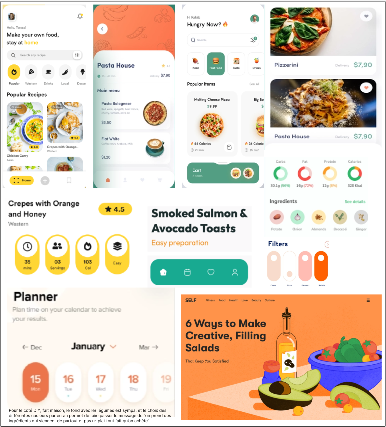

L'élément ci-dessus est ce qui nous a permis de choisir nos couleurs principales pour l'application. De plus, nous avons fait en sorte que ces couleurs reflètent bien nos valeurs. Vous pouvez remarquer que nous avons écrit en noir puis en blanc des textes sur les couleurs, c'était pour vérifier si c'était lisible quelle que soit la couleur du texte. En l'occurance, nous avons déterminé que nous n'allions pas écrire en blanc sur du mimosa.

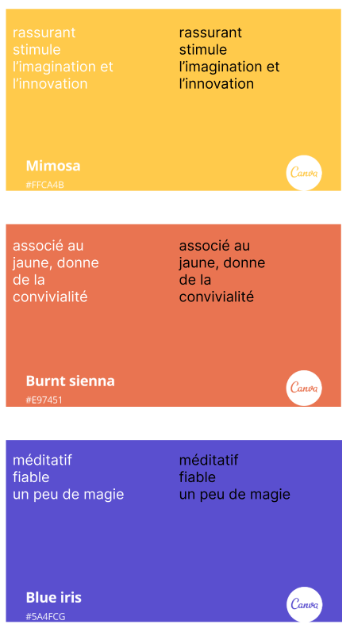

Enfin, il a fallu décider des polices d'écriture pour nos titres, sous-titres et textes. Après des recherches, nous avons choisi ces polices pour une première sélection.

En pratique, nous avons gardé la Fira Sans pour les titres, la Noto Sans pour les sous-titres et la DM Sans pour les textes.

L'utilisation des "layout grids" est quelque chose qui nous a beaucoup servi. En effet, cela permet d'aligner les éléments entre eux et de créer une harmonie visuelle. Il n'est pas nécessaire de l'appliquer parfaitement pour tous les éléments mais son utilisation générale permet de bien structurer la page. En voici l'exemple :

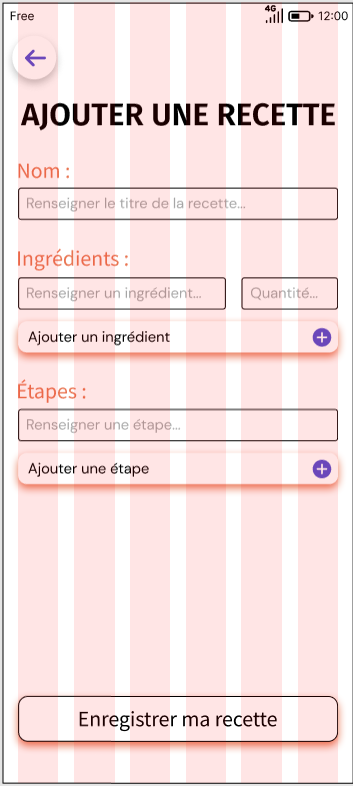

#### Deuxième maquette :

Pour la deuxième maquette, nous avons travaillé un peu différemment. Nous avons commencé par créer des pages qui ressemblaient à cela :

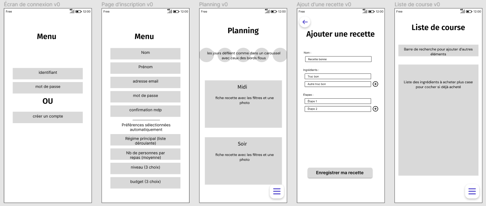

Puis, nous leur avons appliqué le design défini en UI pour donner cela :

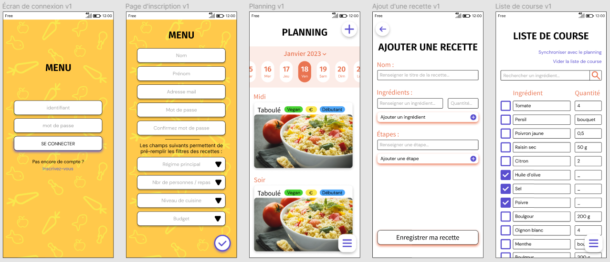

Une nouveauté a été la manière d'accéder aux autres pages de l'application. Au départ, nous avions mis un bandeau en bas de l'écran, mais nous nous sommes tournés vers un menu dépliant sur la gauche. Comme ceci :

#### Retours des étudiants (partie 2) :

Cette fois-ci, nous avons eu des retours beaucoup plus précis. Voici les principales remarques :
- L'application est vraiment intuitive et on en fait le tour rapidement.
- L'emplacement du bouton menu était étrange (les étudiants voulaient l'avoir en haut de l'écran).
- La grille de sélection des repas dans la page de "création du planning de la semaine" n'est pas très claire.
- Il faudrait qu'il y ait un bouton de retour sur toutes les pages.
- Pour vider la liste de course, il faut qu'il y ait une double validation (comme lorsqu'on refuse des cookies sur un site web).
- Il n'y a pas de vraie page d'accueil. Ils l'ont fait remarquer mais disaient que ça ne posait pas de problème.

#### Troisième maquette : 

Pour cette troisième maquette, nous sommes restés sur Figma et nous avons fait quelques modifications ponctuelles.

Par exemple, nous avons changé l'emplacement du bouton permettant d'accéder au menu dépliant : 
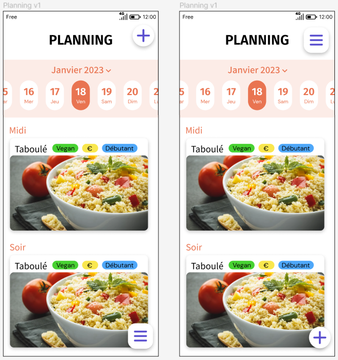

Aussi, nous avons mis une double validation pour vider la liste de course :
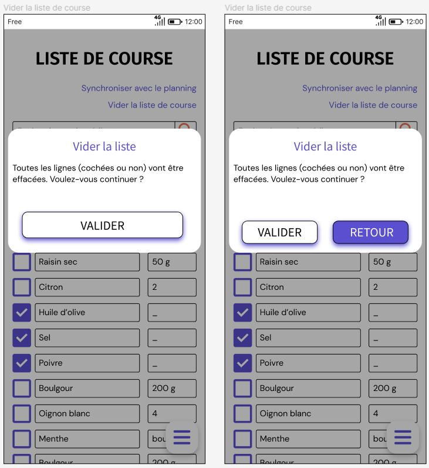

## L'application sur Bubble :

#### Méthodologie et MVP :

L'application nous aurait pris trop de temps à développer avec du code, nous avons donc choisi d'utiliser Bubble, qui est un outil no-code de développement d'applications web / mobiles. Notre choix a été guidé par le fait que nous avions un cours sur des outils no-code au temps 3, dont Bubble. Ce cours nous a d'ailleurs permis de comprendre certains aspects du fonctionnement de Bubble, comme la manière de gérer les données au sein d'une page lors de la création d'une nouvelle recette. Il faut faire attention, ce n'est pas parce qu'il n'y a pas de code que Bubble est tout de suite facile à utiliser, il faut prendre un peu de temps pour maîtriser les différents éléments visuels, les workflows, la gestion des données, etc.

En premier lieu, nous avons voulu utiliser la fonctionnalité qui permet d'importer un fichier Figma directement dans Bubble, mais après quelques essais nous avons vu que les différents éléments des pages de la maquette Figma n'étaient pas toujours importés correctement, et que les pages ainsi créées sur Bubble n'étaient pas très exploitables. Nous avons finalement choisi de créer l'application en partant de zéro afin d'avoir un résultat propre et fonctionnel.

Nous avons essayé, au fur et à mesure du développement, d'avancer par paliers en ayant à chaque étape une application fonctionnelle avant d'ajouter la fonctionnalité suivante (affichage d'une recette, puis création d'une nouvelle recette, création de compte et connexion, génération d'une recette avec filtres, puis d'un planning, etc.).

#### Création du design :

Le premier onglet que l'on utilise dans Bubble est l'onglet "Design" qui permet de créer le design de l'application, cette partie est similaire à la création de la maquette Figma.

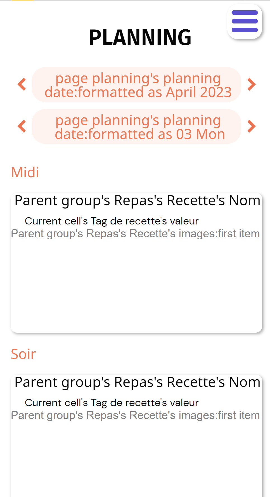

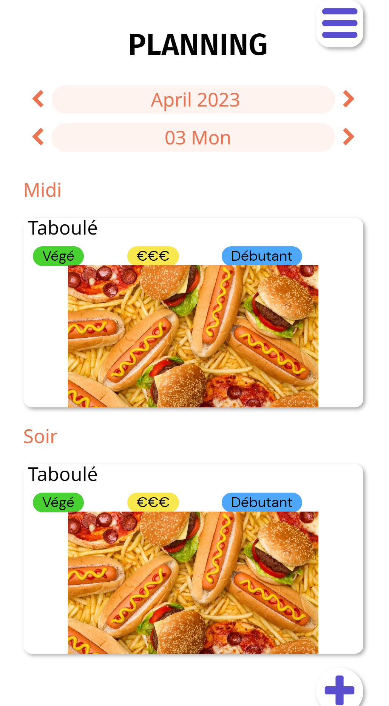

#### Base de données :

Bubble permet d'avoir accès à une base de données (onglet "Data") que l'on peut créer, remplir et utiliser sans aucune ligne de code. Nous avons eu quelques limites dans l'utilisation de la base de données, notamment liées au fait que nous n'avons pas pris d'abonnement payant :

- Nous ne pouvions pas importer de fichiers `.csv`, donc nous pouvions uniquement créer des recettes dans la base de données une par une dans Bubble, ou directement via l'application. Nous n'avons donc pas pu créer une base de données de recettes pré-enregistrées d'une taille correcte pour l'application, cela aurait pris beaucoup de temps.
- La base de données est limitée en nombre d'objets, ce qui nous a poussé à bien gérer la création de nouveaux objets par l'application afin de ne pas avoir une explosion du nombre de données à chaque utilisation.

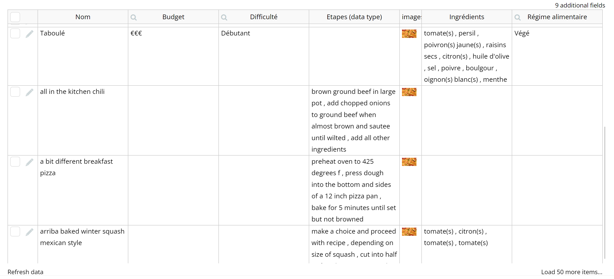

#### Workflows :

Le côté backend de l'application est gérée principalement dans l'onglet "Workflow". La plupart des workflows que nous avons utilisés se lancent lorsque l'on clique sur un élément de l'application (souvent un bouton). Ils permettent de gérer tous les comportements de l'application, comme la navigation vers une autre page ou encore la création ou la sélection de données dans la base de données, et le tout sans ligne de code.

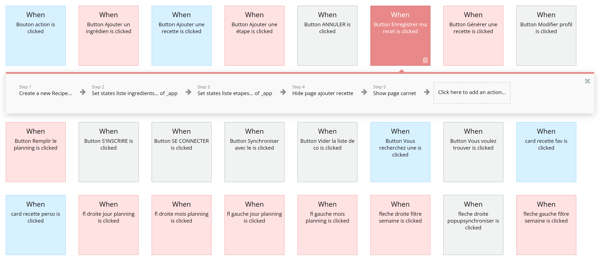

#### Application finale :

Si l'on reprend la liste des fonctionnalités que nous voulions créer, nous sommes en mesure de faire un bilan de notre projet :

Minimum pour que ça marche : 
- ~~Pouvoir afficher une recette~~
- ~~Générer des recettes~~
- ~~Afficher un planning des recettes~~
- ~~Modifier le nombre de personnes~~
- Générer une liste de course en fonction des recettes
------------------------------------------------------------------------------------------------------------------------
Fonctionnalités qui apporte de l’intérêt à notre appli : 
- Pouvoir prendre en compte la liste des ingrédients déjà possédés
- ~~Mettre des filtres (coût, difficulté, calories, temps, régime alimentaire)~~
- ~~Créer un profil utilisateur~~
- ~~Ajouter ses propres recettes~~
- ~~Ajouter favori~~
- Recettes collaboratives
- Générer une recette à partir d’un ingrédient
- Liste de courses triée par rayons
-------------------------------------------------------------------------------------------------------------------------
Bonus pur : 
- S’adapter aux saisons
- Mettre une vidéo des recettes
- Mettre image ingrédients
- Ajouter une recette depuis Internet

Notre application Menu marche malgré le fait que certaines fonctionnalités qui nous étaient chères ne soient pas mises en place. Notamment, la liste de course est moins intelligente que ce que l'on souhaitait. Entre les fonctionnalités réduites de la version gratuite de Bubble et le manque de temps à la fin du projet, notre application ne ressemble pas exactement à ce que nous voulions au départ. L'utilisation de Bubble nous a souvent contraint à trouver des chemins détournés pour atteindre notre but : cela prenait donc plus de temps et nous en laissait encore moins pour les fonctionnalités suivantes. Comme nous avons fini par travailler sur la liste de course, c'est la fonctionnalité la moins aboutie du projet. De plus, les restrictions de la base de données nous ont empêché d'ajouter autant de recettes que l'on souhaitait. Nous avons donc dû choisir avec soin les recettes que nous mettions pour pouvoir tester les différentes fonctionnalités de l'application.

Pour utiliser la version test de l'application, cliquez sur ce lien :
https://appli-menu.bubbleapps.io/version-test/_app
Utilisez l'identifiant : test2@gmail.com
Utilisez le mot de passe : testtest
Attention, comme la base de données est très très limitée, il ne faut pas s'attendre à pouvoir ajouter une recette. Et si elle est déjà pleine, l'application ne va pas fonctionner.

#### Mise service :

Comme dit précédemment, il n'est pas possible de déployer l'application en l'état. En effet, il faudrait payer Bubble pour le faire; d'une part pour le déploiement en tant que tel et d'autre part pour augmenter la capacité de la base de données qui est très réduite dans la version gratuite.
Pour être en capacité de déployer l'application, il nous faudrait des fonds et un business modèle. Nous avons pensé à quelques possibilités pour ce dernier :
- mettre des publicités dans l'application. C'est une solution à envisager même si elle ne nous enchante pas.
- proposer des abonnements pour obtenir des fonctionnalités supplémentaires. Cela nous permettrait de passer plus de temps sur des fonctionnalités que nous voulions développer au début du projet.
- faire des partenariats avec des diététiciens ou la santé publique. Les recettes pourraient être proposées par ces organismes et l'application pourrait promouvoir les repas sains et équilibrés.