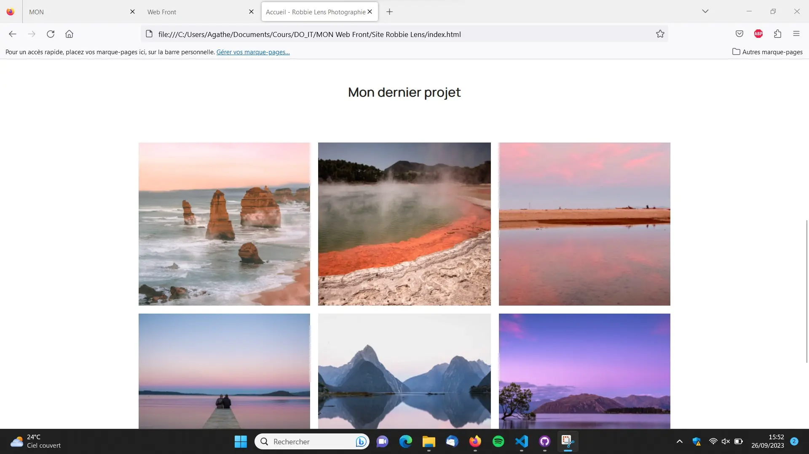
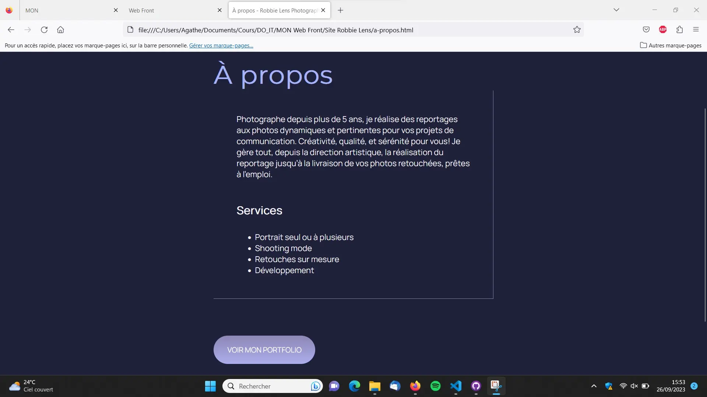
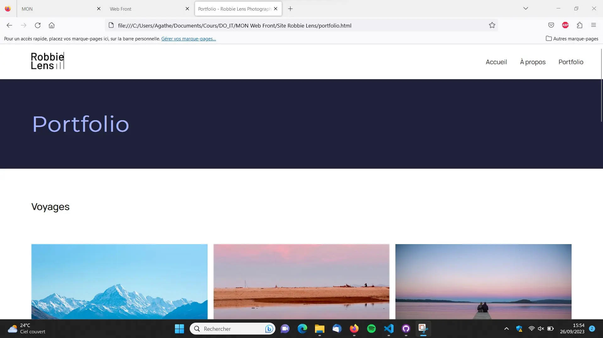
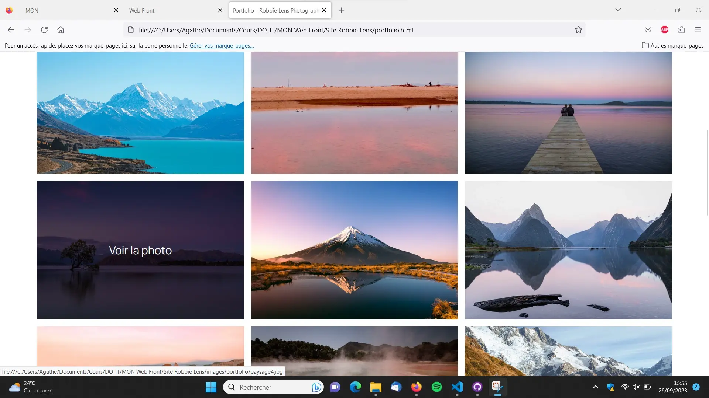
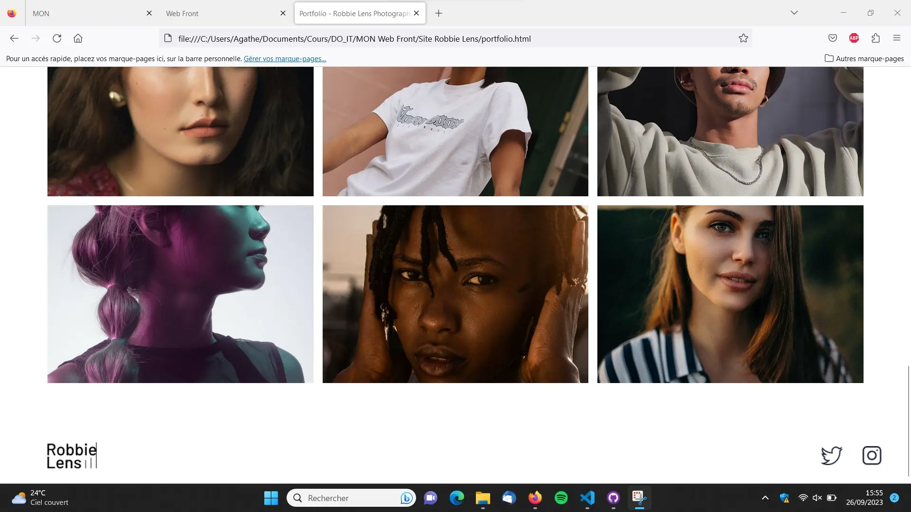

## 1. Introduction

Le front-end, ou développement web frontal, correspond à la partie visible et accessible d'un site web. En opposition, le back-end est la partie invisible mais qui permet de réaliser des actions.
Ce MON va présenter deux langages classiques du front-end que sont **HTML** et **CSS**. Il en existe d'autres, notamment JavaScript.

Ces deux langages sont complémentaires, et permettent déjà de nombreuses fonctionnalités pour coder un site lorsque l'on est débutant. Pour aller plus loin notamment dans certains aspects de mise en page, il faudra utiliser des langages plus poussés.

**HTML** sert à écrire le contenu du site : texte, images, liens, logo, et tout ce qui sera visible sur les différentes pages. Avec **CSS**, on met en forme ce contenu, on agence les éléments, on y ajoute de la couleur, on joue avec les fonds,  les polices, les tailles ou encore les espacements.

Chacune des deux parties suivantes introduira un de ces langages, que j'ai découvert en suivant le cours [Créez votre site web avec HTML5 et CSS3](https://openclassrooms.com/fr/courses/1603881-creez-votre-site-web-avec-html5-et-css3) sur OpenClassrooms. A mon sens, le gros point positif de ce cours est sa partie pratique, qui nous permet de développer un site de manière guidée et au fur et à mesure des connaissances acquises. Je présenterai donc le résultat de ce projet dans une dernière partie.

## 2. Les bases du langage HTML

Le langage **HTML** fonctionne avec un principe de balises, notées entre chevrons, qui structurent la page et définissent le type de chaque élément.

En général, une page s'articule comme suit :
```html
<!DOCTYPE html>
<html>

<head>
    <meta charset="utf-8" >
    <title>Accueil - Robbie Lens Photographie</title>
</head>

<body>
    <header>
      <!-- contenu de l'en-tête-->
    </header>
    <main>
      <!--contenu principal de la page-->
    </main>
    <footer>
      <!--contenu du pied de page-->    
    </footer>
</body>

</html>
```

Dans chacune des parties de la page, le contenu est lui-même structuré par différentes balises qui délimitent les éléments, mettent en avant les titres, les liens, permettent d'insérer des images ou encore d'isoler des morceaux de texte dans le but de leur appliquer une mise en forme spécifique plus tard. Par exemple, \<p\> est un paragraphe, \<h1\> un titre \<a\> un lien et \ une image.

Les éléments à l'intérieur de la balise \<head\> ne sont pas visibles sur la page, ils sont la uniquement pour donner des informations sur celle-ci.

Lorsque la page en **HTML** est terminée, le contenu s'affiche sans mise en forme, les éléments sont les uns en dessous des autres, noirs sur blancs et sans aucun style particulier. C'est pourquoi on utilise le **CSS**.

## 3. La mise en page avec CSS

Dans un premier temps, on créé un fichier en **CSS** que l'on appelle dans la partie \<head\> du fichier **HTML** à l'aide de cette commande :
```html
<link href="nom_du_fichier.css" rel="stylesheet" >
```

Ensuite, on peut commencer à coder sur le fichier **CSS** le style que l'on veut appliquer au site web.

La syntaxe **CSS** est différente de la syntaxe **HTML**. En **CSS**, on appelle un élément du code **HTML** par le nom donné dans sa balise (on utilise *class* pour attribuer des noms précis à des éléments), et on lui applique des propriétés précisées entre accolades. On peut par exemple modifier sa couleur, sa taille, le fond, les bordures...

Voici un exemple de ce que cela peut donner :
```css
body {
  font-family: 'Manrope', sans-serif;
  font-size: 1em;
  background-color: #1f2039;
}

h1 {
  font-size: 3.5em;
  color: #a5b4fc;
  font-family: 'Montserrat', sans-serif;
}
```

En plus d'appliquer des caractéristiques à chaque élément de la page web, le **CSS** permet aussi d'agencer les éléments entre eux pour styliser la mise en page.

Pour cela, on utilise *grid*. La page web est alors virtuellement découpée en une grille dont on décide le nombre de lignes et de colonnes ainsi que leurs tailles respectives. Ensuite, on peut placer chaque élément dans une case de cette grille, et ajouter des marges ou d'autres détails pour avoir un rendu plus esthétique.

Voici pour illustrer un morceau de code qui crée deux grilles d'images en considérant que les images ont été importées au préalable dans le fichier **HTML** et séparées en deux *class* voyages et portraits :

```css
.photos_voyages{
  display: grid;
  grid-template-columns: 1fr 1fr 1fr;
  grid-template-rows: 300px 300px 300px;
  gap: 15px;
  margin-bottom: 80px;
}

.photos_portraits{
  display: grid;
  grid-template-columns: 1fr 1fr 1fr;
  grid-template-rows: 300px 300px;
  gap: 15px
}
```

Les possibilités sont encore très nombreuses pour jouer avec le rendu visuel d'une page web grâce à **CSS**. J'ai vu durant ce MON plusieurs autres petites fonctionnalités qui permettent d'aller un peu plus loin, et j'espère continuer de m'améliorer dans l'utilisation de ce langage. Mais nous avons expliqué ici les principes de bases, qui je pense sont suffisants dans un premier temps pour démarrer en front-end. 

## 4. Le résultat

Durant les parties parties pratiques du cours suivi, j'ai pu réaliser le site web d'une photographe fictive au fil de l'avancée des chapitres.

Voici le rendu obtenu :








Je laisse également [ici](https://github.com/FrancoisBrucker/do-it/blob/main/src/promos/2023-2024/Agathe-Rabachou/mon/temps-1.1/codes_sites.md) le code **HTML** de chaque page ainsi que la feuille de style du site en **CSS** pour de potentiels intéressés !