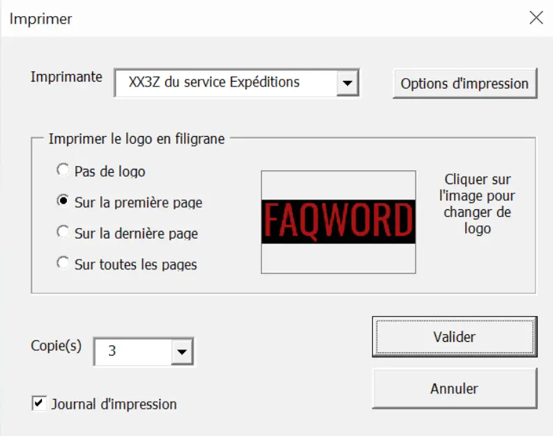


  - Bases du fonctionnement d'Excel
  - Aucun prérequis en VBA


## 1. Introduction

J’utilise Excel quotidiennement dans le cadre de mon alternance, et je me suis vite rendu compte que j’avais des lacunes sur certaines fonctionnalités. Ce MON a donc été l’occasion de les combler afin de gagner en efficacité. J’ai également voulu en profiter pour découvrir VBA, dont j’avais souvent entendu parler mais que je n’avais jamais utilisé.

## 2. Excel

Après avoir fait rapidement le tour de ce qui avait déjà été fait en termes de MON sur Excel (notamment par [Sarah](https://francoisbrucker.github.io/do-it/promos/2022-2023/Honor%C3%A9-Sarah/mon/MON3-1/) et [Lola](https://francoisbrucker.github.io/do-it/promos/2023-2024/Lola-Bourdon/mon/temps-1.2/)) et des retours concernant le contenu des différentes plateformes de formation, j’ai choisi de suivre le cours d’[Excel-pratique](https://www.excel-pratique.com/).

Il est découpé en 11 chapitres ponctués d’exercices d’application. J’ai parcouru sans difficulté les 6 premiers et la première partie du 7ème, qui étaient majoritairement des révisions pour moi. Ils reprenaient les bases d’Excel, les options de mise en forme, les concepts de tableaux, objets, incrémentations, formules et fonctions, et graphiques. La suite contenait plus de nouveautés, et voici un condensé de ce que j’y ai appris (ou revu pour certaines parties) :

### A. Graphique Sparkline

C’est un graphique miniature qui s’insère dans une cellule (depuis le menu insertion), par exemple au bout d’une ligne d’un tableau pour représenter simplement les données de cette ligne. Il en existe 3 types : la courbe, l’histogramme et le graphique conclusions et pertes. Le style de chacun est personnalisable. Ils sont représentés pour exemple dans le cas ci-dessous :


### B. Mise en forme conditionnelle

Cette fonctionnalité permet de modifier certaines caractéristiques d’une cellule (couleur de fond, police du texte, bordures ou format des données) en fonction de son contenu. Il existe des règles proposées par Excel, et il est également possible d’en créer des personnalisées.
Avec les mises en forme conditionnelles existantes dans Excel, on peut modifier une cellule si sa valeur se trouve dans un certain intervalle, si elle contient un certain mot ou encore si elle fait partie des 10% de valeurs les plus (ou moins) élevées par exemple. On peut également ajouter dans les cellules d’un tableau des barres de longueur proportionnelle à leur valeur, créer un nuancier de couleurs qui suit l’évolution des valeurs ou encore insérer des icônes selon les valeurs et leurs changements.

Pour ce qui est des mises en forme conditionnelles personnalisées, j’ai par exemple eu l’occasion de créer une règle sur un planning de projet qui mettait en rouge les missions non encore réalisées alors que la deadline était dépassée. Pour cela, il suffit de comparer la cellule contenant la deadline avec la fonction `AUJOURDHUI()` qui donne la date du jour.

De manière générale, il est possible de jouer sur tous les types de données selon les besoins.

### C. Tri et filtres

Ce chapitre a également fait partie des révisions d’Excel pour moi, je vais donc passer rapidement dessus.

Simplement, la fonction tri permet de ranger les éléments sélectionnés selon un critère choisi (ordre alphabétique, croissant ou selon une caractéristique précise comme le pays d’origine dans le cas d’une sélection d’athlètes par exemple). Il est également possible de faire des tris sur plusieurs niveaux lorsque le premier critère choisi est commun à plusieurs données.

La fonction filtre permet d’afficher les données qui correspondent à un ou plusieurs critères (une valeur vaut exactement x, est comprise entre x et y, est au-dessus de la moyenne ou encore se termine par xxx), et de masquer les autres. On peut alors trier les données restantes si besoin. Il existe également une option très pratique qui permet de filtrer en retirant les doublons.

### D. Validation des données

Cette fonctionnalité permet de forcer une cellule à ne contenir qu’un type de données précis, voire une donnée parmi une liste finie, sous peine de renvoyer une erreur. On peut donc forcer la cellule choisie à ne contenir que A, B ou C par exemple, une liste déroulante avec les options possibles est alors disponible dans la cellule. On peut également obliger un nombre compris dans un certain intervalle, une date ou une heure dans une plage donnée ou un certain nombre de caractères. Si aucun des cas prédéfinis ne convient, on peut écrire une fonction pour personnaliser le type de données attendu.

Enfin, il est possible d’afficher un message informatif au moment de la saisie (pour renseigner le contenu attendu par exemple), ou de choisir le message en cas d’erreur.

### E. Tableau croisé dynamique

C’est un moyen très pratique de synthétiser des données. Ci-dessous un exemple de ce que cela peut donner, qui s’appuie sur le tableau proposé pour s’entraîner dans le cours.

La table de données initiale :


Le tableau croisé dynamique associé :


C’est ici un exemple très simple, mais dans le cas de nombreuses données cette synthèse est particulièrement utile. Bien sûr, il est possible de changer les données en ligne et en colonne, l’ordre des catégories, de trier ou de filtrer à partir de données choisies, de calculer d’autres valeurs remarquables comme la somme ou le produit des données par exemple ou encore de personnaliser les couleurs et la mise en page.

## 3. VBA

Comme la formation Excel d’Excel-pratique était plutôt bien faite, j’ai décidé de rester sur la même plateforme et de suivre le [cours de VBA](https://www.excel-pratique.com/fr/vba) qui y était proposé. Il se découpe également en 11 chapitres, et de même que précédemment je vais résumer ce que j’en ai retenu afin de garder une synthèse que je pourrai utiliser comme pense-bête à l’avenir.

Le VBA est un langage de programmation orientée objet qui permet d’automatiser des tâches dans les différentes applications Microsoft. Ici, nous verrons donc uniquement l’utilisation de VBA appliquée à Excel.

Voici pour commencer le bandeau d’outils nécessaire pour ce cours :


Si l’onglet n’apparaît pas automatiquement à l’ouverture d’Excel, il faut le rajouter depuis les options.

### A. Enregistreur de macro

Un moyen très simple d’automatiser une tâche ou une suite de tâches est d’utiliser l’enregistreur de macro. Il enregistre l’ensemble des clics et des frappes de clavier sur la durée choisie, et transforme ces actions en code VBA. On peut alors voir ce code dans l’éditeur (que l’on ouvre en cliquant sur Visual Basic ou grâce au raccourci Alt+F11), le modifier, le renommer ou encore le commenter. Pour l’utiliser, il suffit d’insérer un bouton et de lui affecter la macro. Chaque clic sur ce bouton lancera alors la suite de tâches enregistrée au préalable.

### B. Création d'une macro

L’autre possibilité est de créer une macro en la codant à la main. Pour cela, on crée un nouveau module dans l’éditeur, dans lequel on écrit :
```vba
Sub nom_de_la_macro()

End Sub
```
Le code de la macro doit être écrit entre ces deux lignes. De la même manière que précédemment, une fois la macro écrite, il faudra l’associer à un bouton pour pouvoir l’utiliser.

  - **Instructions de base :**

Voici les principales commandes qui permettent d’écrire les actions les plus basiques :
```vba
Sub instructions_de_bases()

    'sélectionner une plage de cellules (on peut également sélectionner des lignes, des colonnes ou des cellules distinctes)
    Range("C3:C7").Select
    
    'changer la valeur d'une cellule (on peut retirer les morceaux du code correspondants lorsque l'on est dèja dans le bon fichier ou dans la bonne feuille)
    Workbooks("Nom_du_fichier").Sheets("Nom_de_la_feuille").Range("A8").Value = 48
    
    'mise en forme du texte
    Range("B2").Font.Size = 14
    Range("B2").Font.Bold = True
    
    'bordures de la cellule sélectionnée
    Selection.Borders.Value = 1
    
    'masquer une feuille
    Sheets("Feuil3").Visible = 2
    
    'modifier une propriété de la cellule active en fonction d'une autre cellule
    ActiveCell.Font.Name = Range("A1").Font.Name
    
    'créer un compteur de clics
    Range("C1") = Range("C1") + 1
    
    'pour éviter les répétitions
    With Sheets("Feuil1").Range("A1")
        .Borders.Weight = 3
        With .Font
            .Name = "Barlow"
            .Italic = True
            .Underline = False
        End With
    End With
    
    'appliquer une couleur (ColorIndex est un index proposé directement dans VBA qui contient 56 couleurs prédéfinies, numérotées de 1 à 56. Sinon, on peut choisir une couleur personnalisée)
    Range("A1").Font.ColorIndex = 25
    Range("A2").Font.Color = RGB(156, 12, 233)
    Range("A3").Borders.ColorIndex = 44
    Range("A4").Interior.Color = RGB(255, 0, 0)
    Sheets("Feuil1").Tab.Color = RGB(0, 0, 255)
    'la dernière commande colore l'onglet de la feuille
    
End Sub
```

  - **Variables :**

Pour aller plus loin et simplifier des codes plus complexes, on peut ensuite déclarer des variables. Pour cela, on écrit :
```vba
Sub variables()
    Dim Nom_variable As Integer
    Nom_variable = 12
End Sub
```
Le type peut être un entier, un flottant, une date ou encore une chaîne de caractères par exemple. Chacun de ces types à une notation en VBA (integer, single, date, string…).

On peut ensuite afficher cette variable dans une boîte de dialogue grâce à la commande :
```vba
MsgBox Nom_variable
```
Ainsi, on peut par exemple afficher une phrase contenant plusieurs informations extraites d’une base de données. A noter que, comme en Excel, on utilise & pour concaténer du texte et des valeurs de variables. Voici une illustration :


```vba
Sub variables()
    Dim Nom As String, Prenom As String, Numero As Integer, Poste As Integer, Ligne As Integer
    Ligne = Range("G6") + 1
    '+1 pour ne pas tenir compte de la première ligne qui contient les titres
    Nom = Cells(Ligne, 1)
    Prenom = Cells(Ligne, 2)
    Numero = Cells(Ligne, 3)
    Poste = Cells(Ligne, 4)
    MsgBox "La joueuse " & Nom & " " & Prenom & " porte le numéro " & Numero & " et évolue au poste " & Poste
End Sub
```


Une variable est utilisable dans l’environnement dans lequel elle a été définie. Dans une procédure (Sub) si elle est définie au début de cette procédure, dans tout un module si elle est initiée au début du module ou même dans l’ensemble des modules si l’on remplace Dim par Public. 

Pour conserver la valeur d’une variable d’une procédure après la fin de cette procédure il faut remplacer `Dim` par `Static`, et pour conserver la valeur de toutes les variables d’une procédure il faut ajouter Static devant Sub. 

Il est également possible pour des cas particuliers de créer son propre type de variable.

  - **Tableaux :**

Les tableaux fonctionnent sur le même principe que les variables mais permettent de stocker plusieurs informations. La syntaxe de définition est la suivante :
```vba
Sub tableaux()
    'créer un tableau à 1 dimension, 7 cases contenant des chaînes de caractères
    Dim Nom_tableau(6) As String
    'attribuer une valeur à la case 3
    Nom_tableau(2) = "texte"
    'à noter que la première case est la case 0
    
    'créer un tableau à 2 dimensions, 3x4 cases
    Dim Nom_tableau(2, 3) As Integer
    'attribuer une valeur à la case en haut à gauche
    Nom_tableau(0, 0) = 2
End Sub
```

  - **Constantes :**

Les constantes sont des variables dont on ne peut pas modifier la valeur. Elles sont utiles par exemple pour contenir un taux fixe qui sera réutilisé plusieurs fois dans un projet. On écrit `Dim NOM_CONSTANTE As Integer = 25` par exemple.

  - **Conditions :**

On peut ensuite ajouter des conditions, qui fonctionnent exactement comme en Python, avec la syntaxe suivante :
```vba
Sub conditions()
    If [CONDITION] Then 
        [INSTRUCTION]
    ElseIf [CONDITION2]
        [INSTRUCTION2]
    Else
        [INSTRUCTION3]
    End If
End Sub
```
Dans certains cas, plutôt que d’utiliser beaucoup de ElseIf, il peut être pertinent d’utiliser la fonction Select. On peut alors remplacer la série de ElseIf par :
```vba
Select Case Valeur_à_tester
    Case Is = A
        [INSTRUCTION]
    Case Is >= B
        [INSTRUCTION2]
    Case C to D
        [INSTRUCTION3]
End Select
```
Il existe également de nombreuses fonctions prédéfinies pour conditionner une instruction, telles que `IsNumeric` (vraie si la valeur est numérique), `IsDate` (vraie si la valeur est une date), `Day` ou `Year` (renvoie le jour ou l’année d’une date), ou encore `IsEmpty` (vraie si la variable n’a pas été initialisée).

Enfin, on peut aussi vérifier si une variable contient une chaîne de caractères avec `If Variable Like "*chaîne_caractères*"`, où `*` peut remplacer n’importe quoi. A la place de `*`, `#` remplacerait un unique caractère numérique, et `?` un unique caractère quelconque. Il existe d’autres notations pour préciser les caractères ou types de caractères que l’on cherche dans une variable.


`Option Compare Text` en début de module permet de ne pas faire de distinctions entre un caractère en majuscules et ce même caractère en minuscules.


  - **Boucles :**

Pour ne pas répéter des dizaines de fois la même instruction, on utilise des boucles.


**Attention** à ne pas créer de boucles infinies !


Voici les utilisations et syntaxes des différents types de boucles :
```vba
Sub boucles()
    'tant que la condition est vraie, l'instruction est exécutée
    Do While [CONDITION]
        [INSTRUCTION]
    Loop
    
    'idem mais l'instruction s'exécute au moins une première fois peu importe la condition
    Do
        [INSTRUCTION]
    Loop While [CONDITION]
    
    'lorsque la condition est vraie, la boucle d'arrête
    Do Until [CONDITION]
        [INSTRUCTION]
    Loop
    
    'la boucle se répète un nombre de fois défini
    For i = 1 To 10
        [INSTRUCTION]
    Next
    'on peut ajouter Step = x à la ligne For pour définir un pas x autre que 1
    
    'la boucle se répète au fur et à mesure que l'on parcourt un ensemble d'éléments
    For Each cellule In Range("A1:C5")
    'ou For Each feuille In Worksheets
    'ou For Each valeur In Tableau
        [INSTRUCTION]
    Next
    
    'pour quitter avant la fin
    Exit For 'une boucle For
    Exit Do 'une boucle Do
    Exit Sub 'une procédure
    Exit Function 'une fonction
End Sub
```

  - **Procédures :**

Comme présenté depuis le début, on utilise des procédures, ou Sub, pour écrire en VBA. Lorsqu’il y en a plusieurs, il est possible de les faire interagir entre elles.

Premièrement, les Subs tels qu’ils ont été décris ci-dessus sont dit publics. Si l’on rajoute `Private` avant le Sub, il devient privé, c’est-à-dire inaccessible en dehors du module dans lequel il a été créé.

Ensuite, on peut appeler une procédure à s’exécuter à l’intérieur d’une autre, simplement en écrivant son nom.

On peut également entrer des valeurs en argument d’une procédure, afin qu’elles soient conservées si l’on appelle cette procédure dans une autre. Voici une illustration simple :
```vba
Sub procédure1(texte As String)
    [INSTRUCTION utilisant texte]
End Sub
Sub procédure2()
    [INSTRUCTION appelant procédure1 «texte à utiliser»]
End Sub
```
Si plusieurs arguments doivent être entrés, on les sépare par une virgule.

Si l’on ajoute `Optional` devant un argument, il n’est pas obligatoire à l’exécution de la procédure. Dans ce cas, la procédure doit comprendre différents cas selon les arguments entrés. On peut tester qu’un argument a été renseigné avec la fonction `IsMissing` (attention elle ne fonctionne pas avec tous les types de variables), ou bien on peut renseigner des valeurs par défaut aux arguments optionnels et tester ensuite ces valeurs. Pour utiliser cette dernière option, on écrirait par exemple en argument `Optional numéro As Integer = 0`. Ainsi, un numéro non renseigné vaudrait 0.

Par défaut en VBA, lorsque l’on appelle un Sub qui contient des arguments, ce sont les références de ces arguments qui sont transmises. Cela signifie que si l’on modifie une variable dans la procédure initiale, elle changera aussi dans la procédure d’appel. Pour faire l’inverse et donc transmettre uniquement la valeur de la variable au moment de l’appel, sans possibilité de la modifier, on ajoute ByVal devant l’argument.

  - **Fonctions :**

Une fonction est un Sub qui retourne une valeur en sortie. Par exemple :
```vba
Function carre(nombre As Integer)
    carre = nombre ^2
End Function
```
On peut ensuite l’utiliser dans un Sub en l’appelant à l’aide de l’instruction `resultat = carre(7)`. resultat vaut alors 49.

  - **Boîtes de dialogue :**

La première utilisation possible des boîtes de dialogue est le simple affichage d’un message grâce à la requête `MsgBox "texte à afficher"`, comme mentionné dans la section sur les variables.

Ensuite, il est possible d’afficher une boîte de dialogue qui requiert une interaction. La structure globale est `MsgBox([texte], [bouton], [titre])`. Par exemple, on peut écrire :
```vba
Sub boîte_dialogue_interactive()
    If MsgBox("Voulez-vous vraiment supprimer le contenu de A1 ?", vbYesNo, "Confirmation") = vbYes Then
        Range("A1").ClearContents
    End If
End Sub
```
On obtient alors à l’exécution :


Puis l’action s’effectue ou non selon la réponse à la boîte de dialogue. Il existe de nombreux boutons qui permettent des interactions différentes telles que Ok, Annuler, Recommencer…, qui ajoutent une icône ou encore qui forcent à répondre avant de continuer. Il est possible de mettre plusieurs valeurs dans le deuxième argument de la MsgBox, séparés par des `+`. 

Enfin, on peut demander à l’utilisateur de remplir une valeur dans la boîte de dialogue grâce à la fonction `InputBox(«texte», «titre», «valeur par défaut»)`, et la comparer à un résultat pour générer une action. La valeur par défaut est un argument optionnel.

### C. Pour aller plus loin

Jusqu’ici nous avons vu les bases pour coder une macro. Dans cette partie je vais mentionner quelques fonctionnalités supplémentaires possibles (sans rentrer dans le détail du code car j’ai moins eu le temps de m’y pencher) dont il peut être très utile de connaître l’existence.

Premièrement, nous avons lancé des macros uniquement en cliquant sur un bouton. Il existe des commandes qui permettent de les lancer selon plein d’autres actions telles qu’à l’ouverture d’un classeur ou d’une feuille, avant la fermeture, à l’enregistrement, à l’impression, au clic droit, à chaque sélection etc.

Ensuite, il est possible de créer ce que l'on appelle un UserForm. C'est un objet qui se présente sous la forme d'une boîte de dialogue, et que l'on peut personnaliser avec de très nombreuses fonctionnalités appelées contrôles. On peut entre autres y ajouter des boutons, du texte, des cases à cocher, des listes déroulantes... Certains aspects du design sont également modifiables. Lorsque l'UserForm est appelé, tout comme pour une macro classique, les interactions avec celui-ci induisent des actions sur le fichier Excel associé. Ainsi, un UserForm peut être un point d'entrée pour remplir des informations dans un tableau par exemple.

Voici un exemple de rendu : 



*([source de l'image](https://faqword.com/index.php))*

Enfin, il existe une multitude de fonctions pré-définies que l'on peut utiliser dans un code VBA, et en particulier toutes les fonctions Excel, que l'on appelle grâce à la commande `WorksheetFunction.nom_fonction_excel`. Si toutefois ce n'est pas suffisant, il est possible de créer une fonction personnalisée pour réaliser une tâche spécifique.

## 4. Conclusion

Pour conclure, je dirais que ces deux formations étaient très claires, complètes et bien illustrées. Petit bémol, certaines parties manquaient d'exercices d'application, mais globalement je les recommande.

Il existe également sur la même plateforme une formation [VBA avancée](https://www.excel-pratique.com/fr/formation), mais je n'ai pas eu le temps d'en regarder le contenu.