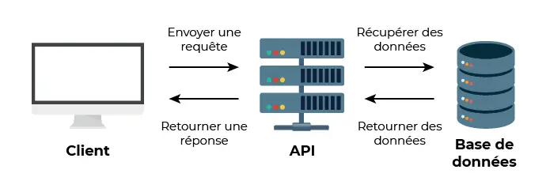
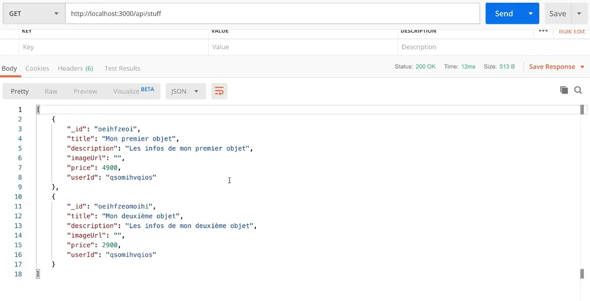


  - Débutant en back-end
  - Quelques bases du langage JavaScript


## 1. Introduction

J'ai côtoyé de loin la notion de back-end dans différents cours et projets, sans jamais réellement en comprendre le fonctionnement et les méthodes d'implémentation. Ce MON a donc été pour moi l'occasion de reprendre de zéro ce sujet et de développer mes connaissances. Pour cela, je me suis appuyée sur les MON de [Lucas](https://francoisbrucker.github.io/do-it/promos/2023-2024/Rioual-Lucas/mon/temps-1.2/) et de [William](https://francoisbrucker.github.io/do-it/promos/2023-2024/William%20Lalanne/mon/temps-2.1/) qui portent sur ce sujet, sur le cours [Web](https://francoisbrucker.github.io/cours_informatique/cours/web/) de François Brucker, sur une partie de la formation [Passez au Full Stack avec Node.js, Express et MongoDB](https://openclassrooms.com/fr/courses/6390246-passez-au-full-stack-avec-node-js-express-et-mongodb/6466206-configurez-votre-environnement-de-developpement) d'OpenClassrooms et sur quelques recherches annexes isolées quand il me manquaient des connaissances pour comprendre un concept.

Mais avant de rentrer dans le vif du sujet, rappelons rapidement **le rôle du back-end** en informatique. La construction d'un site ou d'une application web peut être décomposée en deux parties qui communiquent entre-elles : le front-end et le back-end.
- Le front est la partie visible du site, l'interface de communication côté client, qui s'exécute dans un navigateur. Mon MON [Web Front](https://francoisbrucker.github.io/do-it/promos/2023-2024/Agathe-Rabachou/mon/temps-1.1/) rentre plus dans le détail si besoin.
- Le back-end, que nous verrons ici, est la partie invisible du site, mais qui permet de le faire fonctionner. C'est notamment lui qui gère les bases de données, le traitement des requêtes ou encore la logique métier. Contrairement au front-end, le back-end s'exécute à distance sur un serveur.

Nous verrons donc dans ce MON comment implémenter le back-end d'un site ou d'une application web, et comment celui-ci communique avec le front pour récupérer et renvoyer les informations pertinentes.

## 2. La notion d'API

Pour mieux appréhender la suite, il est important de comprendre que dans une application web, le front communique avec le back via des **requêtes HTTP**. En bref, chaque action de l'utilisateur sur le front envoie une requête au back, et le back est une sorte de programme qui lit ces requêtes et renvoie au front la réponse correspondante.

Dans ce cadre, on parle souvent d'**API**. Une API (pour *Application Programming Interface*) est l'interface qui permet la communication entre les différentes parties d'une application, ici principalement le front, le back et la potentielle base de données, via ces requêtes HTTP et différentes routes que l'on verra plus loin. Le schéma suivant explique simplement le but de cette interface :



Plus largement et même si ce n'est pas l'utilisation que nous en ferons ici dans un premier temps, une API permet la communication et l'échange de données entre deux applications qui peuvent être distinctes. Un exemple classique : l'application météo d'un téléphone portable ne fait pas elle même une recherche et une analyse de données pour afficher la météo. Elle utilise une API qui se connecte à une base de données qui contient déjà ces informations.
Une API permet donc à un utilisateur de récupérer et d'intégrer à son application des fonctionnalités ou des données issues d'un programme externe, même si il n'en connaît pas exactement le fonctionnement.

## 3. Création et initialisation du back-end avec Node

*On considère que Node.js est déjà installé sur la machine utilisée. Node est un environnement d'exécution qui permet d'écrire en JavaScript toutes les tâches nécessaires côté serveur.*

Pour commencer, il est important de séparer le front et le back dans deux dossiers bien distincts à l'intérieur du projet.
Puis on se place dans le dossier back et on exécute la commande suivante :
```bash
npm init
```
Cela initialise le projet, et crée un fichier "package.json" dans lequel on remplit plusieurs paramètres initiaux (ou bien on laisse les paramètres par défaut), et qui contiendra toutes les informations liées aux packages utilisés dans le projets.

On peut ensuite exécuter
```bash
git init
```
afin de créer le repository GitHub du projet, et ajouter un fichier ".gitignore" dans lequel on mettra tout ce que l'on ne veut pas charger sur le repo GitHub.
Enfin, on crée un fichier "index.js", qui contiendra le code de notre projet.

On peut donc reprendre notre code, et dans le fichier "index.js", il faut commencer par créer le serveur et son fonctionnement de base. Le code commenté ci-dessous explique cette étape :
```js
const http = require('http'); //importe le package qui permet de créer le serveur

const server = http.createServer((req, res) => {
    res.end('Réponse du serveur');
}); //crée un serveur qui prend en argument la fonction à appeler en cas de requête au serveur, ici une fonction qui reçoit la requête (req) et la réponse (res) et renvoie 'Réponse au serveur'

server.listen(process.env.PORT || 3000); //écoute les requêtes émises par le port par défaut s'il existe ou par le port 3000
```

On démarre alors le serveur en exécutant :
```bash
node server
```

A noter : avec cette méthode, il est nécessaire de redémarrer le serveur avec la commande *node server* à chaque modification dans le code, pour prendre en compte cette modification.
Pour éviter cela, il est très utile d'installer le package **nodemon**. Lorsque c'est fait, il suffit de remplacer la commande de démarrage *node server* par *nodemon server*, et la mise à jour du serveur se fera automatiquement au fur et à mesure de l'avancée du code, sans besoin de le redémarrer.


## 4. Express : installation et utilisation

Express est un framework pour Node, qui rend beaucoup plus simple l'analyse des requêtes et évite le travail très fastidieux que demanderait la même tâche à réaliser uniquement avec Node (ce qui est malgré tout possible).
Pour l'utiliser, nous allons donc commencer par l'installer, en exécutant dans le dossier backend :
```bash
npm install express
```
On crée ensuite un fichier "app.js", qui contiendra l'application Express, dans lequel on écrit :
```js
const express = require('express'); //importe Express

const app = express(); //crée l'application (vide pour l'instant)

module.exports = app; //exporte l'application pour pouvoir y accéder depuis les autres fichiers du projet, notamment depuis le serveur Node
```

Pour pouvoir utiliser Express, il faut ensuite l'importer depuis le serveur Node. On modifie donc le code de "index.js" présenté précédemment comme suit :
```js
const http = require('http');
const app = require('./app'); //importe l'application

app.set('port', process.env.PORT || 3000); //donne le port de lancement de l'application
const server = http.createServer(app); //indique au serveur d'utiliser l'application pour répondre aux requêtes

server.listen(process.env.PORT || 3000);
```
On a alors configuré Express comme l'application à utiliser pour répondre aux requêtes reçues par le serveur. Il faut maintenant comprendre comment personnaliser les fonctionnalités d'Express pour répondre aux besoins du projet. Pour cela, plusieurs notions sont importantes :

- **Les middlewares**

Dans ce contexte, un middleware est une fonction qui prend en entrée un objet *request* et un objet *response* et qui peut les lire, les analyser et les manipuler si besoin. Pour faire simple, Express est une suite de middlewares. Chaque middleware reçoit également une méthode appelée *next*, qui lui permet de passer à l'exécution du middleware suivant lorsqu'il est terminé. Voici un exemple expliqué d'application Express :
```js
const express = require('express');
const app = express();


//premier middleware qui affiche dans la console que la requête a bien été reçue
app.use((req, res, next) => {
  console.log('Requête reçue !');
  next(); //permet de passer au second middleware
});


//second middleware qui renvoie au front un message à afficher (json est le format courant des réponses du back au front)
app.use((req, res, next) => {
  res.json({ message: 'Votre requête a bien été reçue !' });
  next(); //permet de passer au troisième middleware
});


//troisième middleware qui ajoute à la réponse un code d'état 201
app.use((req, res, next) => {
  res.status(201);
  next(); //permet de passer au quatrième middleware
});


//quatrième middleware qui affiche dans la console que la réponse a été renvoyée
app.use((req, res, next) => {
  console.log('Réponse envoyée avec succès !');
});

module.exports = app;
```
Ici, les réponses aux requêtes sont très simples et ne dépendent pas de la requête reçue (*app.use* s'applique à toutes les requêtes), mais cela permet de comprendre le concept.

- **Les routes**

Les routes permettent de construire l'API et donc le lien entre le front et le back. La plupart des API sont structurées autour de 4 grandes actions : on parle de CRUD pour Create, Read, Update et Delete, soit créer, lire, modifier et supprimer. Il existe donc une méthode pour chacune de ces actions :
-> On lit une donnée grâce à la méthode GET
-> On crée une donnée grâce à la méthode POST
-> On modifie une donnée grâce à la méthode PUT
-> On supprime une donnée grâce à la méthode DELETE

Voici un exemple de requête GET commentée :
```js
x = 7 

app.get('/', (req, res) => { //le '/' indique l'emplacement
    res.statusCode = 200; //200 est un code d'état classique pour indiquer une requête réussie
    res.setHeader('Content-Type', 'text/html; charset=utf-8'); //indique la mise en forme de la réponse

    res.end(donnée.toString()); //renvoie la réponse

})
```

De même pour une requête POST :
```js
app.post('/', (req, res) => {

    donnée = req.query.valeur //attribue à la variable "donnée" la valeur de "valeur" 
    res.redirect('/') //ajoute une méthode GET pour éviter de renvoyer une donnée au rafraîchissement du navigateur

})
```

En général, pour tester les méthodes au fur et à mesure du développement, on utilise une application externe comme [Postman](https://www.postman.com/). Elle permet de simuler des requêtes de différents types afin d'observer ce que renvoie le serveur.

Dans le cadre de la formation OpenClassrooms suivie, le projet qui sert de fil conducteur aux exercices de mise en pratique est la création d'un site de revente d'objets, dont le front est déjà existant. Voici donc, pour donner un exemple un peu plus contextuel, ce que pourrait donner le fichier "app.js" dans ce cas :
```js
app.use('/api/stuff', (req, res, next) => { // '/api/test' correspond à la route/l'URL où est enregistré le code (aussi appelée endpoint)
  const stuff = [ //création des articles sous la forme requise par le front du projet
    {
      _id: 'objet1',
      title: 'Mon premier objet',
      description: 'Les infos de mon premier objet',
      imageUrl: 'https://....jpg',
      price: 50,
      userId: 'adupont',
    },
    {
      _id: 'objet2',
      title: 'Mon deuxième objet',
      description: 'Les infos de mon deuxième objet',
      imageUrl: 'https://.....jpg',
      price: 70,
      userId: 'adupont',
    },
  ];
  res.status(200).json(stuff); //retourne les articles et le code d'état de requête réussie
});
```
On effectue ensuite une requête GET sur Postman, et on obtient comme prévu le résultat suivant :


- **Les headers**

Comme mentionné précédemment, le front du projet de ce cours est déjà crée et s'exécute donc en local, mais sur un port différent du back. On observe ci-dessus que lorsque l'on lance le back et qu'on le teste sur Postman, on reçoit bien les informations voulues du serveur, cependant elles ne s'affichent pas sur le front. Les deux parties ne communiquent pas. C'est dû à ce que l'on appelle une **erreur CORS**.

CORS signifie Cross Origin Resource Sharing. C'est un système qui définit comment les serveurs et les navigateurs interagissent, et notamment quelles ressources peuvent être acceptées ou non. Par mesure de sécurité, celui-ci empêche par défaut les requêtes HTTP entre des serveurs différents, et donc ici l'application n'a pas accès à l'API. Pour pouvoir faire communiquer les deux ports distincts entre eux, il va falloir ajouter des headers (ou en-tête en français).

On ajoute au fichier "app.js" le morceau de code suivant (toujours expliqué en commentaires), et celui-ci ce place bien sûr AVANT la commande qui crée les articles, car les middlewares sont lu dans l'ordre dans lequel ils sont écrit :
```js
app.use((req, res, next) => { //il n'y a pas d'URL spécifié donc le code s'applique à toutes les routes
  res.setHeader('Access-Control-Allow-Origin', '*'); //cette ligne autorise toutes les origines (d'où le '*') à accéder à l'API
  res.setHeader('Access-Control-Allow-Headers', 'Origin, X-Requested-With, Content, Accept, Content-Type, Authorization'); //cette ligne autorise l'ajout aux requêtes des headers mentionnés
  res.setHeader('Access-Control-Allow-Methods', 'GET, POST, PUT, DELETE, PATCH, OPTIONS'); //cette ligne autorise l'envoi de requêtes avec les méthodes mentionnées
  next(); //fonction next à ne pas oublier pour passer au middleware suivant 
});
```
Retenons au moins que pour permettre des requêtes de différentes origines (Cross Origin), il faut ajouter des headers spécifiques de contrôle d'accès aux objets de réponse.

## 5. Conclusion

Finalement, ce MON m'a beaucoup aidé à éclaircir la notion de back-end, même si j'ai eu besoin de nombreuses recherches pour assimiler certains concepts qui ne me sont pas très intuitifs. Cela me permettra de mieux cerner le fonctionnement global de futurs projets et notamment du projet 3A. 

Concernant les ressources, le [cours OpenClassrooms](https://openclassrooms.com/fr/courses/6390246-passez-au-full-stack-avec-node-js-express-et-mongodb/6466206-configurez-votre-environnement-de-developpement) m'a semblé plutôt complet, même si je l'ai trouvé relativement compliqué pour le niveau que j'avais. Il m'a souvent manqué du vocabulaire technique que j'ai dû chercher par moi-même pour pouvoir suivre la formation. J'ai par exemple consulté [ce site](https://fullstackopen.com/fr/) entre autres, sur les conseils du [MON de Lucas](https://francoisbrucker.github.io/do-it/promos/2023-2024/Rioual-Lucas/mon/temps-1.2/), qui est pour moi beaucoup plus clair et accessible pour un débutant, même si peut-être moins complet sur certaines notions.

La suite du [cours OpenClassrooms](https://openclassrooms.com/fr/courses/) porte entre autres sur les moyens d'autoriser les utilisateurs à ajouter leurs articles sur le site, l'introduction d'une base de données au projet, ainsi que la sécurisation du back-end avec des méthodes d'authentification. Je n'ai pas eu le temps de m'attarder sur ces différentes parties, mais elles pourraient faire l'objet d'un prochain MON.