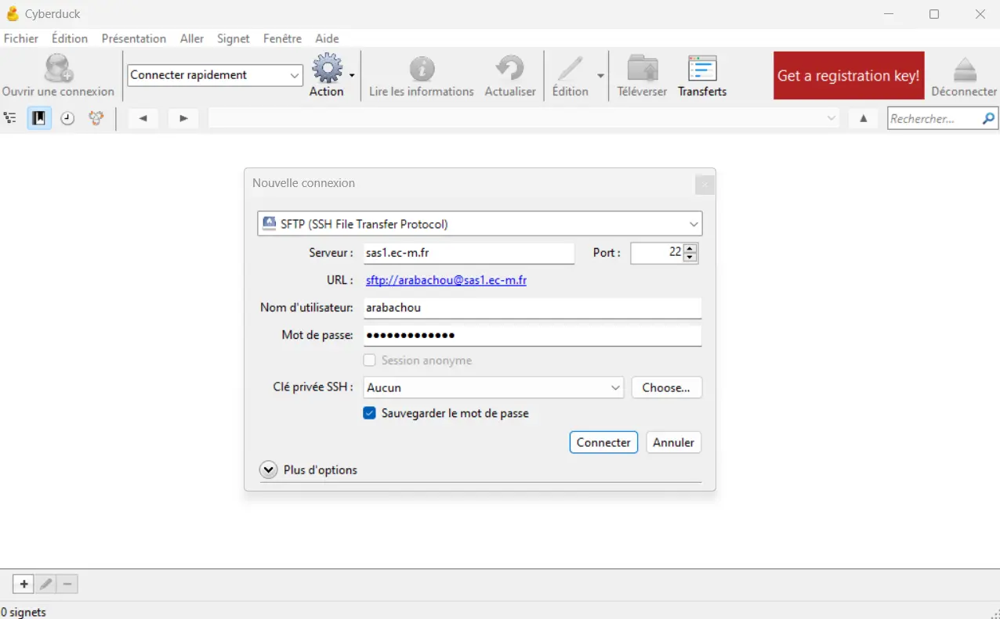
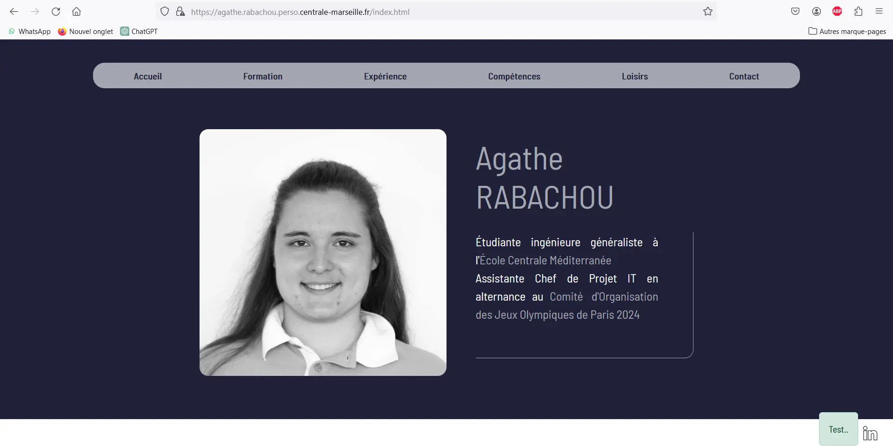


  - Débutant


## 1. Introduction

Dans le cadre du projet 3A, nous avons entamé une discussion autour de la mise en ligne de notre site web. N'ayant aucune connaissance dans ce domaine, j'ai décidé d'y consacrer ce MON. Mon but est donc de comprendre comment déployer un site à partir de sa version locale, où l'héberger, et par la suite comment le maintenir.

J'ai appuyé mes recherches sur plusieurs ressources, principalement le cours [Mettez en ligne votre site web](https://openclassrooms.com/fr/courses/7192596-mettez-en-ligne-votre-site-web) d'OpenClassrooms, et le cours [Web](https://francoisbrucker.github.io/cours_informatique/cours/web/) de François Brucker.

## 2. Vocabulaire et définitions

Voici quelques notions utiles à la compréhension de la suite de ce MON :
- Les noms de domaine :
On accède à un site web via son URL (par exemple [https://www.centrale-mediterranee.fr/](https://www.centrale-mediterranee.fr/)). Celui-ci contient un nom de domaine (ici centrale-mediterranee), qui est réservé à ce site. Le propriétaire du site peut ensuite créer d'autres pages sous le même nom de domaine, en changeant le préfixe ou l'extension. Un nom de domaine disponible peut être réservé grâce à un organisme appelé registrar, et a un coup annuel d'une dizaine d'euros. Il est possible de mettre en ligne un site sans nom de domaine associé, mais il ne sera alors accessible que par son adresse IP (par exemple [147.94.19.249](http://147.94.19.249)), ce qui rend son référencement beaucoup plus compliqué.

- Les hébergeurs :
Les fichiers du site web que l'on veut mettre en ligne vont devoir être stockés sur des serveurs pour rester disponible tout le temps et depuis n'importe où. L'hébergeur assure le bon fonctionnement de ces serveurs. Là encore, en théorie, il est possible de s'en passer et d'héberger son site sur son ordinateur personnel. Mais cela demande beaucoup plus de connaissances et une machine et une connexion très puissantes. Il vaut donc mieux passer par un hébergeur professionnel. Il en existe plusieurs types, plus ou moins coûteux, plus ou moins compliqués à utiliser et qui supportent des sites plus ou moins gros (notamment en terme de trafic). On peut souscrire en ligne à n'importe lequel, OVH étant l'un des plus connus. Lorsque l'on a acheté un hébergement, on récupère ce qu'on appelle les identifiants FTP.

- Les clients FTP :
FTP signifie File Transfer Protocol. Un client FTP est un logiciel qui permet de transférer les fichiers en local d'un site web vers un serveur distant. Pour la configuration, il faut y entrer l'adresse du serveur sur lequel on veut stocker les fichiers (qui peut être sous forme d'IP), le login et le mot de passe. Ces informations sont transmises lors de la réservation de l'hébergeur. Ensuite, on peut y déposer les fichiers souhaités (en général des fichiers .html, .css, .js, .php ou encore des images ou des pdf), afin de les mettre en ligne via le serveur. Enfin, on passe également par le client FTP pour modifier les fichiers déjà en ligne tout au long de la durée de vie du site.

A noter qu'une fois le site opérationnel, la première page qui sera chargée lorsque l'on accède au nom de domaine réservé sera par défaut la page "index.html". Il faut donc s'assurer qu'une telle page existe, ou changer les paramètres par défaut. 
Enfin, si le site à mettre en ligne contient une base de données, il faut réaliser quelques étapes supplémentaires pour l'intégrer à l'hébergeur, mais je ne me suis pas penchée sur ce cas.

## 3. La mise en ligne du site

Après avoir fait des recherches sur le fonctionnement des outils présentés ci-dessus, j'ai donc procédé à la mise en ligne d'un site web afin de tester tout le processus par moi-même. J'ai utilisé pour cela mon site web réalisé lors du POK du temps 1, ainsi que le client FTP Cyberduck. Pour ce qui est de l'hébergement, je me suis servie de mon site perso sur les serveurs de Centrale, accessible à l'URL [https://agathe.rabachou.perso.centrale-marseille.fr/](https://agathe.rabachou.perso.centrale-marseille.fr/).

J'ai donc crée une connexion vers l'un des serveurs de l'école :

Puis j'y ai ajouté mes fichiers (html, css, javascript et les images). J'ai dû faire quelques modifications pour corriger des problèmes de liens (il faut faire attention à ce que les liens relatifs naviguent correctement dans les dossiers), et mon CV en ligne est maintenant disponible et fonctionnel sur mon site.

## 4. Pour aller plus loin

Après discussion avec Monsieur Brucker, il m'a conseillé pour approfondir le sujet d'essayer d'ajouter l'utilisation d'un framework à mon site, et ensuite de déployer le tout. J'ai donc découvert Bootstrap en lisant la documentation sur le site, et je l'ai ajouté à mon projet. Afin de tester les deux méthodes, j'ai utilisé Bootstrap via CDN (un lien qui appelle Bootstrap en ligne) et j'ai également installé le package complet via la commande
```bash
npm install bootstrap
```
J'ai ensuite modifié mon code de base afin de rendre les boutons et le formulaire plus responsive ou encore de mieux gérer l'affichage des photos, ce qui m'a permis de tester certaines fonctionnalités du framework telles que le système de classes ou de grille. J'ai également ajouté un bouton test uniquement designé avec Bootstrap afin d'avoir un objet évident pour pouvoir vérifier que la mise en ligne du site avec le framework fonctionnait bien.
J'ai donc déployé comme précédemment la version modifiée de mon site sur le serveur de l'école en utilisant Cyberduck, et on peut bien constater que le site accessible sur mon adresse perso est la version utilisant Bootstrap (notamment grâce à l'alerte *Test..*) :



Enfin, également à la suite de l'échange avec Monsieur Brucker, je me suis renseignée sur l'automatisation de la mise en ligne d'un site. En effet, pour l'instant avec la méthode vue précédemment, il faut retéléverser les fichiers du site sur le serveur par le client FTP à chaque modification du code, ce qui peut être un peu lourd dans le cas de gros projets. Il existe donc plusieurs méthodes pour automatiser cette tâche :
- Il est possible d'écrire des scripts de déploiement (en Bash ou en Python par exemple), que l'on personnalise selon nos besoins et qui peuvent compiler les fichiers et les copier sur un serveur distant.
- On peut également utiliser une plateforme d'intégration continue. Il en existe plusieurs, et elles peuvent être configurées pour détecter les modifications dans des fichiers de code et lancer automatiquement un processus de déploiement défini à l'avance.
- Certains outils de gestion des versions, même si ce n'est pas leur objectif premier, permettent des actions similaires, tout comme certains outils de gestion de tâches.
- De même, il existe des services cloud et des plateformes de déploiement automatisé auxquels il est possible de connecter des projets Git qui sont mis en ligne à chaque commit.

Je n'ai pas eu le temps ni spécialement l'intérêt de les mettre en place, mon site étant très simple et n'étant pas voué à évoluer. Mais sur des projets de plus grande ampleur où une maintenance régulière est nécessaire pour mettre à jour le contenu ou les frameworks, pour améliorer les performances et la sécurité, pour s'adapter à la réglementation ou tout simplement à l'évolution des utilisateurs, cela peut faire gagner un temps considérable et également éviter des oublis lors du transfert des fichiers. 

## 5. Conclusion

Pour conclure ce MON, j'ai passé une partie importante des 10h à découvrir et tester le framework Bootstrap que je ne connaissais pas, ce qui n'était pas du tout prévu initialement. Cependant c'était un écart au sujet très intéressant et malgré celui-ci j'ai pu respecter mon objectif initial qui était de découvrir les notions de base autour du déploiement et de l'hébergement d'un site web. 

## 6. Organisation du temps

| Durée | Action |
| -------- | -------- |
| 1h30 | Suivi du cours [Mettez en ligne votre site web](https://openclassrooms.com/fr/courses/7192596-mettez-en-ligne-votre-site-web) d'OpenClassrooms |
| 30min | Discussion avec F. Brucker sur le sujet |
| 30min | Lecture du cours [Web](https://francoisbrucker.github.io/cours_informatique/cours/web/) de François Brucker |
| 30min | Recherches sur les notions en lien |
| 45min | Quelques modifications sur mon site web du POK1 pour pouvoir le déployer |
| 45min | Découverte de Cyberduck et mise en ligne du site |
| 1h30 | Découverte de Bootstrap et lecture de la documentation |
| 2h | Test de fonctionnalités Bootstrap et adaptation du code |
| 30min | Modification du site en ligne |
| 1h30 | Recherches automatisation mise en ligne d'un site et maintenance |