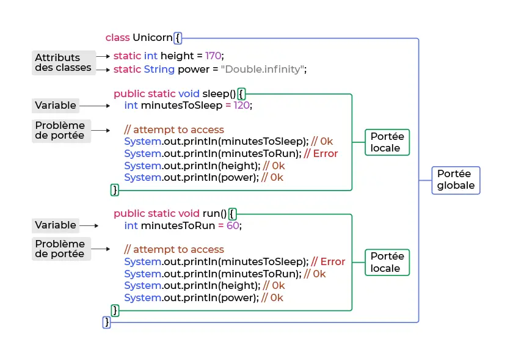


  - Débutant en Java
  - Quelques bases en Programmation Orientée Objet dans d'autres langages


## 1. Introduction

A travers ce MON, je cherche à me familiariser avec le langage de programmation Java, couramment utilisé en entreprise, afin de faciliter de potentiels futurs échanges avec des équipes de développeurs (mon but n'étant pas dans devenir un, mais sûrement de travailler en contact avec eux).

J'ai donc commencé par regarder ce qui avait déjà été fait sur le sujet, et on peut recenser le [MON de Nicolas](https://francoisbrucker.github.io/do-it/promos/2023-2024/Ouzoulias-Nicolas/mon/temps-1.1/), le [MON de Vladimir](https://francoisbrucker.github.io/do-it/promos/2023-2024/Vladimir-Jeantroux/mon/temps-3-1/) et le [POK de Sarah](https://francoisbrucker.github.io/do-it/promos/2023-2024/Sarah-Sebastien/pok/temps-2/). Tous les trois on commencé en s'appuyant sur la même formation OpenClassroom intitulée [Apprenez à programmer en Java](https://openclassrooms.com/fr/courses/6173501-apprenez-a-programmer-en-java), qu'ils recommandent. J'ai donc suivi cette formation en un peu moins des 10h annoncées, et je vais essayer de la synthétiser ci-dessous afin de pouvoir réutiliser ce MON comme fiche mémoire au besoin.

J'ai ensuite utilisé le temps restant pour lire le MON de Vladimir, qui a suivi une formation plus avancée sur Codecademy, disponible à [ce lien](https://www.codecademy.com/courses/learn-intermediate-java/informationals/welcome-to-learn-intermediate-java). Je n'ai pas suivi la formation moi-même par manque de temps, et le résumé de Valdimir m'a donc été très utile.

## 2. Les variables

Une **variable** est une sorte de conteneur qui renferme une donnée utilisée par un programme. Cette donnée s'appelle alors valeur, et il est de rigueur de donner à la variable associée un nom qui reflète la signification de cette valeur afin de rendre le code plus compréhensible.
Pour déclarer une variable, on utilise un mot clé qui dépend du type de la variable. On écrire par exemple :
```java
int age = 38; // pour un entier
double taille = 1.77; // pour un décimal (on peut également utiliser float, mais moins précis)
String text = "bonjour"; // pour du texte
boolean isItTrue = true; // pour un booléen
int count; // pour un entier dont on ne connaît pas encore la valeur
```


Attention à ne pas oublier le **;** pour indiquer la fin d'une instruction.


On peut ensuite modifier ces variables grâce aux opérateurs mathématiques classiques, et utiliser les raccourcis courants tels que **+=** pour simplifier les affectations. Pour des chaînes de caractère, on peut réaliser une concaténation grâce au **+**, et on utilise **!** placé juste devant un booléen pour l'inverser.

Les variables qui ne sont pas destinées à être modifiées sont appelées **constantes**. Il est très recommandé de les utiliser plutôt que des variables classiques dès que possibles, déjà pour éviter des modifications accidentelles de leur valeur, mais aussi car elles améliorent la rapidité d'exécution des programmes. On les déclare comme suit :
```java
final int AGE = 38;
final String MESSAGE = "bonjour";
// C'est un bonne pratique commune de les nommer en majuscules
```

Lorsque l'on réalise une opération mathématique sur des variables, il faut faire attention à la façon dont les types se mélangent. Par exemple, la division d'un entier par un entier donnera forcément un résultat entier, même si celui-ci est faux, et cela peut être à l'origine de nombreuses erreurs. Il faut donc bien penser à déclarer au moins l'un des entiers initiaux comme décimal pour que le résultat soit correct. Il existe une autre méthode pour corriger ce problème, qui consiste à changer le type d'une variable déjà déclarée directement dans l'opération dans laquelle on l'utilise. On écrit alors : 
```java
int a = 5;
int b = 2;
float c = (float) a / b;
```
C'est ce que l'on appelle le cast.

## 3. Les classes et les fonctions

Pour rappel, en Programmation Orientée Objet, une classe est un ensemble de variables (que l'on appelle attributs) et de fonctions (nommées méthodes) qui utilisent ces variables. En Java, l'ensemble du code doit se trouver à l'intérieur d'une classe, qui elle même est contenue dans un package.

Lorsque l'on lance un programme en Java, c'est la fonction appelée *main* qui se lance. On dit que c'est le point d'entrée.
Voici un programme très simple pour découvrir la syntaxe de base :
```java
package hello;                                      // déclare le package hello

public class HelloWorld {                           // déclare la classe HelloWorld qui contiendra le code

  public static void main(String[] args) {          // morceau de code recherché par l'interpréteur pour lancer le programme

    System.out.println("Hello World!");             // affiche dans la console le message passé entre guillemets

    }
}
```

Je ne me suis pas attardée sur cette partie car j'utilise un environnement de développement qui fait cela tout seul, mais à ce moment du cours sont présentées les différentes étapes et commandes pour exécuter un programme Java à partir du terminal. Je laisse cependant le lien [ici](https://openclassrooms.com/fr/courses/6173501-apprenez-a-programmer-en-java/6445721-ecrivez-une-fonction) pour les lecteurs intéressés.

Une autre bonne pratique en Java et en programmation de manière générale, est d'avoir un code organisé pour que la fonction main soit la plus courte possible et appelle uniquement les méthodes utiles, toutes écrites séparément.
Pour aider à cette organisation, il existe deux types de classes :
- **Les classes modèles** : ce sont des types complexes qui regroupent différentes variables d'un même concept. La classe *String* avec l'ensemble de ses méthodes en est un exemple (contrairement à *int* ou *double* qui sont des primitifs). En général, elles modélisent des objets auxquels s'appliquent le programme.
- **Les classes utilitaires** : elles contiennent des méthodes statiques que l'on écrit spécifiquement dans le cadre du programme et que l'on peut appeler directement sur la classe.


Lorsque l'on crée une classe, il est courant de la documenter pour expliquer son utilité et son fonctionnement. On le fait alors entre les indicateurs /** et */, ce qui crée automatiquement une page HTML avec la documentation, que l'on appelle Javadoc.


Pour appeler une méthode à agir sur une variable, on utilise la syntaxe suivante :
```java
variable = variable.méthode()     // on met les arguments nécessaires à la fonction entre les parenthèses le cas échéant
```

Une variable ne peut être utilisée que dans l'environnement dans laquelle elle a été déclarée (une boucle, une fonction, une classe...). C'est ce que l'on appelle la **portée** de la variable. En général, on repère cet environnement grâce à des indicateurs d'ouverture et de fermeture. En Java, ce sont des **accolades**. Voici un schéma tiré de la formation suivie qui explique très bien ce principe :

Cependant, une variable déclarée dans une classe peut par défaut être utilisée en dehors de celle-ci. Pour empêcher cela, on peut la restreindre en la précédant de la commande *private* (le contraire est le mot clé *public*). On peut faire de même avec une fonction pour empêcher son accès depuis une autre classe que celle dans laquelle elle a été déclarée. Il existe d'autres commandes pour contrôler de manière plus précise l'accès aux données.

## 4. Les boucles et les conditions

Comme dans la plupart des langages de programmation, on construit et structure les fonctions avec des boucles et des conditions. Voici la syntaxe en Java de ces outils :
- **Les boucles énumérées** (ou boucle for) :
```java
for (int i=0; i<10; i++) {               // ou en général for (initialisation, terminaison, incrément)
  // instruction qui sera répétée 10 fois
};
```


**Attention** à bien choisir la condition de terminaison pour ne pas créer de boucles infinies !


- **Les boucles 'for each'**
Elles fonctionnent comme les boucles for, mais lorsqu'on veut parcourir tous les éléments d'un tableau par exemple, dont on ne connaît pas la taille. On écrit alors :
```java
for (int number: monTableau) {
  // instruction 
};
```

- **Les boucles conditionnelles** (ou boucle while)
L'instruction est alors répétée tant que la condition est vraie.
```java
while (condition) {
  // instruction
};
``` 

- **Les boucles 'do... while'**
C'est une variante de la boucle while classique, mais dans laquelle la condition se trouve à la fin du code. Ainsi, l'instruction de la boucle est forcément exécutée au moins une fois, même quand la condition est fausse. On écrit :
```java
do {
  // instruction
} while (condition);
```

- **Interruption de boucle**
Il est possible d'interrompre une boucle. Par exemple si l'on a trouvé la valeur que la boucle cherchait dans un tableau. Pour cela, on écrit une condition dans la boucle qui vérifie à chaque itération si la valeur cherchée a été trouvée; lorsque c'est le cas, on arrête les itérations avec la commande *'break'*.
On peut également répéter k fois une action en voulant ignorer les itérations 3 et 7. On ajoute alors, dans la boucle et avant le code explicitant l'action, l'instruction suivante :
```java
if(k == 3 || k == 7) {
  continue;
}
```

- **Les opérateurs**
Afin de pouvoir construire des conditions pour la sous-partie suivante, voici des opérateurs courants, qu'il peut être utile de retenir :
| Symbole | Signification |
| -------- | -------- |
| == | égal à |
| =! | différent de  |
| < | inférieur à |
| <= | inférieur ou égal à |
| > | supérieur à |
| >= | supérieur ou égal à |
| equals | identique à (pour une chaîne de caractères) |
| && | ET logique |
| \|\| | OU logique |
| ! | NON logique |

- **Les conditions**
Pour écrire une condition ou un enchaînement de conditions en Java, on utilise la syntaxe classique suivante :
```java
if(condition1) {
  //instructions
}
else if(condition2) {
  //instructions
}
...
else {
  //instructions
}
```
On peut utiliser les arguments rentrés en paramètre de la fonction pour créer les conditions. A noter que ces arguments sont en réalité sous forme d'un tableau d'arguments, il faut donc les appeler en conséquence.

Il existe deux outils qui permettent dans certains cas de simplifier la rédaction des conditions.
Premièrement, la commande *switch*. Imaginons que l'on veuille par exemple agir différemment selon le nombre d'arguments entrés. On pourrait écrire avec la méthode basique présentée ci-dessus :
```java
public static void main(String[] args) {
    if (args.length==0) {
        //instructions
    } 
    else if (args.length==1) {
        //instructions
    } 
    else if (args.length==2) {
        //instructions
    } 
    else {
        //instructions
    }
}
```
On peut également utiliser la méthode *switch*, plus claire, pour n'évaluer qu'une fois la longueur du tableau d'arguments et faire une disjonction de cas. On écrit :
```java
public static void main(String[] args) {
    switch(args.length) {
        case 0:
            //instructions
            break;
        case 1:
            //instructions
            break;
        case 2:
            //instructions
            break;
        default:
            //instructions
    }
}
```

Deuxièmement, il existe le type *énumération*, qui permet de lister des cas prédéfinis et de les utiliser dans un switch, à nouveau à fin de simplifier et de clarifier le code. Voici un exemple parlant tiré du cours :
```java
public class myDirection {

    enum Direction {
        north, east, south, west;       //liste des cas possibles
    }

    public static void main(String[] args) {
        Direction direction = Direction.north;
        switch (direction) {
            case north:
                //instructions
                break;
            case east:
                //instructions
                break;
            case south:
                //instructions
                break;
            case west:
                //instructions
                break;
        }
    }
}
```
Tous les cas sont couverts, il n'est donc pas nécessaire d'avoir un cas par défaut. Si maintenant on considère qu'il n'y a une instruction spécifique que pour la direction nord, on peut remplacer la fonction par :
```java
public static void main(String[] args) {
    Direction direction = Direction.north;
    switch (direction) {
        case north:
            //instructions
            break;
        default:
            //instructions
    }
}
```

## 5. La Programmation Orientée Objet en Java

Pour comprendre le principe global de la POO, je vous renvoie vers mon [MON 1.2 : Programmation orientée objet](https://francoisbrucker.github.io/do-it/promos/2023-2024/Agathe-Rabachou/mon/temps-1.2/). Ici, on va s'intéresser plus particulièrement à son implémentation en Java.
Voici le format d'une déclaration de **classe** en Java :
```java
class ExempleClasse {
  String attribut1;
  String attribut2;
  int attribut3;
  // autres propriétés de la classe
}
```

Une fois que la classe existe, on peut y faire une **instanciation**, c'est-à-dire créer un **objet** du type de cette classe. Pour cela, il faut donner une valeur à chaque champ de la classe, en commençant par initialiser ces champs grâce à un **constructeur**. C'est une sorte d'objet référence, à partir duquel on pourra ensuite modifier les attributs. A noter que si un champ est identique pour tous les objets de la classe, il peut être rempli directement dans la déclaration de la classe. Prenons un exemple pour mieux comprendre, qui pourrait servir dans le cas d'une bibliothèque en ligne par exemple :
```java
class Book {            // déclaration de la classe
      String title;
      String author;
      int numberOfPages;
      String publisher;
      Book(String title, String author, int numberOfPages, String publisher) {          // constructeur
            this.title = title;
            this.author = author;
            this.numberOfPages = numberOfPages;
            this.publisher = publisher;
      }
}
```
On initialise toujours les attributs du constructeur grâce au mot-clé *this*.
De plus, il est possible de déclarer plusieurs constructeurs pour une même classe, par exemple dans le cas où l'un des attributs est identique pour un grand nombre d'éléments de la classe. Afin d'éviter les répétitions, on déclare alors un constructeur principal, et un secondaire dans lequel l'attribut en question est déjà renseigné et n'est plus une variable des objets.

Une fois que tout cela est fait, on peut alors créer un objet de notre classe. On écrit, si l'on reprend l'exemple de classe précédent :
```java
Book monLivre = new Book("Harry Potter et le prisonnier d'Azkaban", "J.K. Rowling", 444, "folio")
```
Enfin, il est possible d'accéder aux champs de notre objet pour les modifier en utilisant le point :
```java
monLivre.numberOfPages = 446
```

## 6. L'héritage et le polymorphisme

Il existe deux notions importantes pour spécialiser des classes, que l'on va expliciter dans cette partie.
- **L'héritage** :
C'est le fait de regrouper des attributs ou des méthodes communes à plusieurs classe dans une *classe mère*, puis de créer plusieurs *classes filles* qui récupèrent les propriétés de la classe mère et y ajoutent leurs spécialisations. Pour cela, on définit la classe mère comme vu précédemment, puis on crée une classe fille avec la syntaxe suivante :
```java
public class ClasseFille extends ClasseMere {
    // propriétés spécifiques à la classe fille
}
```

Plusieurs points sont importants : une classe fille ne peut hériter que d'une seule classe mère (l'inverse est faux); tous les champs de la classe mère sont hérités, et ils peuvent être manipulés selon leur accessibilité (comme présenté plus haut); on peut également appeler le constructeur de la classe mère dans la classe fille grâce au mot clé *super*.

- **Le polymorphisme**
C'est un concept qui permet d'adapter le comportement d'une méthode de la classe mère selon la classe fille depuis laquelle on l'appelle. Prenons un exemple :
```java
class Saluer {
  void saluer() {
    System.out.println("Bonjour");
  }
}

class SaluerAmi extends Saluer {
  void saluer() {
    System.out.println("Salut");
  }
}

class SaluerEtranger extends Saluer {
  void saluer() {
    System.out.println("Hello");
  }
}
```
On peut alors appeler la méthode saluer sur toutes les classes et elle s'adapte à l'objet pour lequel on l'utilise.

Grâce au mot clé *super*, on peut appeler la méthode parente sans la modifier pour y ajouter autre chose ensuite. Cela donne par exemple :
```java
class SaluerProfesseur extends Saluer {
  void saluer() {
    super.saluer();
    System.out.println("Monsieur");
  }
}
```

## 7. Les collections

Cette partie présente les principaux moyens de stocker des piles de données.
- **Le tableau** (ou array en anglais) :
Il est ordonné et indexé à partir de 0. On le déclare en fournissant le type de variables qu'il stocke, des crochets et le nom de ces variables. Ensuite on l'instancie en lui attribuant un nombre d'emplacements qui s'initialisent automatiquement à 0 dans le cas d'entiers. Puis on peut accéder à ces emplacements et les modifier si besoin. Cela donne :
```java
int[] notesElevesDoIT;       // création du tableau

notesElevesDoIT=new int[23];         // instanciation

int[] notesElevesDoIt = new int [23];          // les deux lignes précédentes en une

notesELevesDoIt[7]=16;       // attribue 16 au 8ème élève

System.out.println(notesElevesDoIt[12]);         // affiche la note du 13ème élève
```

Il est également possible de remplir le tableau directement à sa création en ajoutant ses valeurs entre accolades, ou de créer des tableaux multidimensionnels en ajoutant des paires de crochets (pour faire des matrices par exemple).

- **La liste** :
Elle n'a pas une taille fixe, elle est ordonnée et on ne peut y modifier que des variables existantes. Elle est obligatoirement vide au départ et se déclare comme suit :
```java
List<Integer>maListe = new ArrayList<Integer>();
```
Ensuite, on peut y effectuer plusieurs opérations :
```java
maListe.add(7); // ajoute l'élément 7
maListe.set(0,4); // change l'élément de rang 0 en un 4
maListe.remove(0); // retire le premier élément
System.out.println(maListe.size()); // affiche la taille de la liste
```

- **L'ensemble** (ou set) :
Il est non ordonné, ses éléments sont uniques.
```java
Set<String>nomsPrenomsEleves = new HashSet<String>(); // déclaration de l'ensemble
nomsPrenomsEleves.add("AgatheRabachou"); // ajoute l'élève AgatheRabachou à l'ensemble
nomsPrenomsEleves.remove("AgatheRabachou"); // retire l'élève AgatheRabachou de l'ensemble
System.out.println(nomsPrenomsEleves()); // compte les éléments de l'ensemble
```

- Il existe également les **dictionnaires** (ou maps), qui sont des sortes de listes améliorées de paires d'éléments (clé-valeur), et dans lesquels on accède à une valeur par sa clé.

## 8. Les paramètres et les retours

Lorsque l'on définit une méthode, elle peut prendre en arguments des paramètres, que l'on déclare entre parenthèses lors de la définition par leur nom précédé de leur type. Si l'on veut que la fonction renvoie une valeur afin de pouvoir la réutiliser ailleurs, il faut le préciser avec le mot-clé *return*. Ensuite, on utilise ce retour en appelant la fonction avec les paramètres choisis. Un exemple simple :
```java
public static int sum(int a, int b) {
  int c = a + b;
  return c;
  // ou return a + b pour écrire les deux lignes en une seule
}

// on peut alors utiliser le résultat :
int resultat = sum(2,4);
```


**Attention**, il existe deux types pour les paramètres, et la différence est fondamentale.
Si l'on copie un objet de type **valeur**, comme un entier, d'une variable dans une autre, les deux variables sont indépendantes, on peut en modifier une sans changer l'autre.
A l'inverse, dans le cas d'un objet de type **référence**, comme une classe, lorsque l'on en crée une copie on crée simplement un autre pointeur qui renvoie en fait vers le même élément. Une modification sur cette copie modifie donc la classe originale.
Ainsi, il faut faire très attention à ce que l'on fait des éléments dans une fonction, et notamment des éléments de types référence, au risque de faire des modifications plus larges sans le vouloir.


## 9. La récursivité

Pour rappel, une méthode est dite récursive lorsqu'elle fonctionne en continue en s'appelant elle-même. Cela s'illustre très bien avec la fonction qui calcule la factorielle de n (n!) :
```java
class Recursion {
  public static int factoriel(int n) {
    if (n == 1) return 1;             // Attention à ne pas oublier la condition d'arrêt !!
    else return n * factoriel (n-1);
  }
}
```

## 10. Pour aller plus loin

La méthode **try/catch** est une méthode qui permet de gérer des exceptions pour éviter les bugs. L'idée est d'essayer d'exécuter un morceau de code, et d'en prévoir un autre qui s'exécute dans le cas où le premier génère une erreur. On écrit :
```java
try {
  // code principal, contenant une fonction qui peut potentiellement générer une erreur
}
catch (Exception e) {
  // code à lancer si la partie try renvoie une erreur
}
```

Il est possible de faire intervenir des fichiers extérieurs dans notre code Java. Plusieurs outils pour cela :
```java
FileReader fileReader = new FileReader("/path/to/file") // lit le fichier situé au chemin donné

BufferedReader reader = new BufferedReader(fileReader); // utilise le fileReader

line = reader.readLine(); //lit la prochaine ligne du fichier (à mettre dans une boucle pour lire le fichier en entier)

FileWriter fileWriter = new FileWriter("/path/to/file", false); // trouve le fichier au chemin donné

BufferedWriter writer = new BufferedWriter(fileWriter); // prépare le fichier pour écrire dedans

writer.write("text") // ajoute du texte

writer.newLine(); // revient à la ligne
```

Enfin, le [MON de Vladimir](https://francoisbrucker.github.io/do-it/promos/2023-2024/Vladimir-Jeantroux/mon/temps-3-1/) présente d'autres notions avancées en Java, comme les **input et output** (que j'ai en partie utilisé plus haut sans réellement expliquer le concept), la **sérialisation** et les **génériques**, que je ne vais pas expliquer ici car il l'a déjà très bien fait.

## 11. Retours

Comme les quelques cours OpenClassroom que j'avais déjà suivi auparavant, le gros point fort est pour moi la partie mise en pratique, avec des exercices interactifs tout au long de la formation pour pouvoir appliquer les notions de manière plus concrète au fur et à mesure de l'apprentissage (bien que je les ai trouvés ici légèrement trop peu nombreux par rapport à d'autres cours que j'avais pu faire). Sur cette formation, ils étaient à faire sur la plateforme [Replit](https://replit.com/), que je ne connaissais pas mais qui est gratuite et simple d'utilisation. Par ailleurs, le cours est très clair, adapté aux débutants en Java (de préférences avec quelques notions globales en informatique quand même), et permet je trouve une bonne prise en main des concepts de base du langage et de la programmation orientée objet.

Pour ce qui est du résumé fait par Vladimir de la formation Codecademy qu'il a suivie, je l'ai également trouvé très clair et présentant des notions différentes de la formation OpenClassroom (qui s'intéressait surtout aux bases et à la syntaxe), c'était donc un très bon complément.

## 12. Organisation du temps

| Durée | Action |
| -------- | -------- |
| 3h45 | Cours OpenClassroom partie 1 : Gestion des variables |
| 2h45 | Cours OpenClassroom partie 2 : Programmation Orientée Objet |
| 2h | Cours OpenClassroom partie 3 : Quelques principes avancés |
| 1h30 | MON de Vladimir |