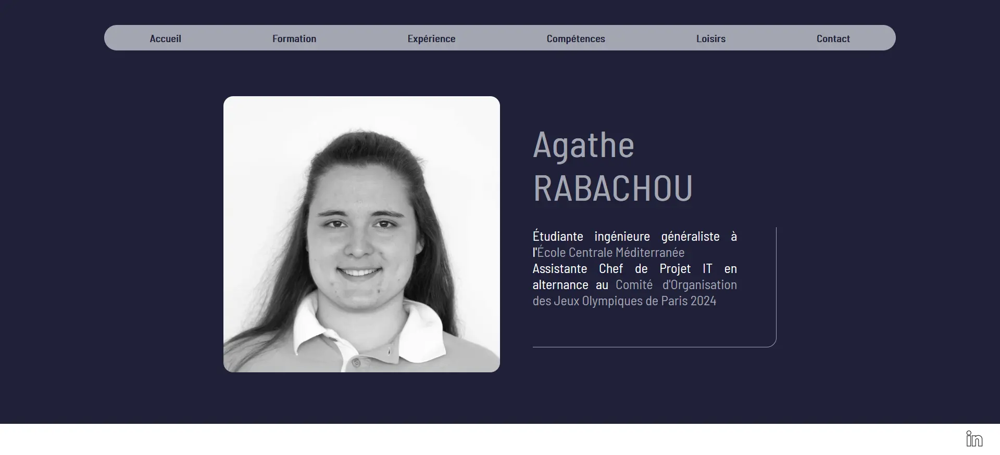
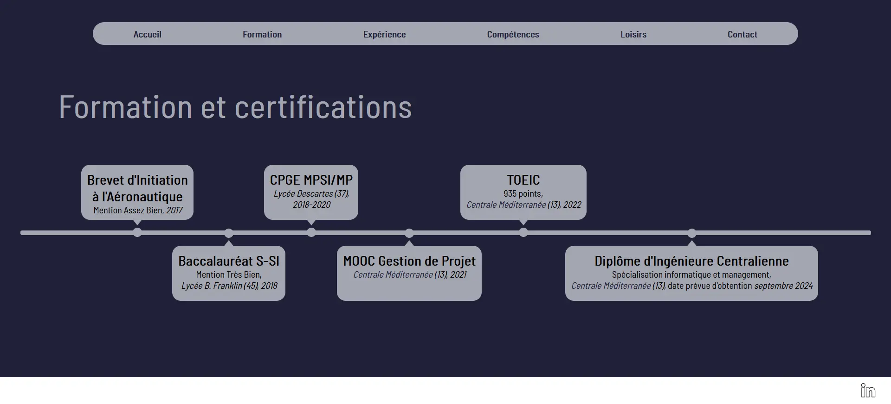
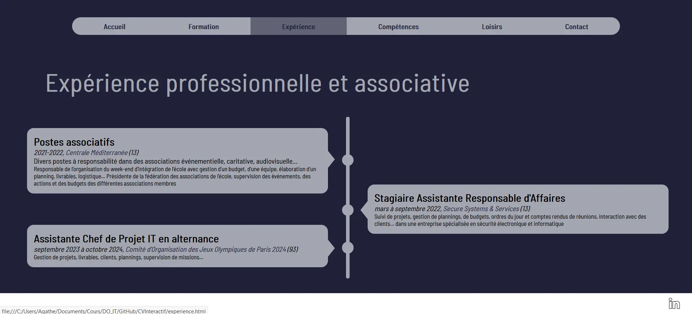
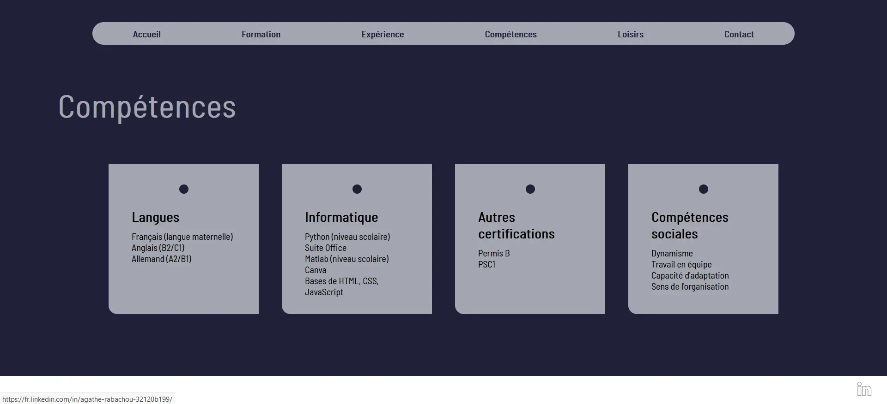
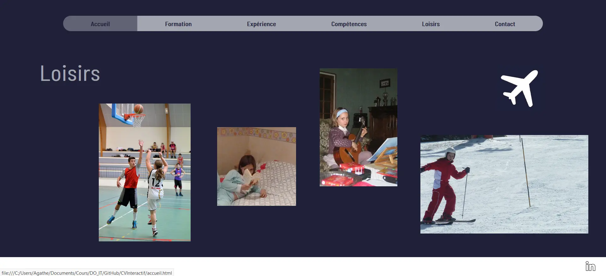
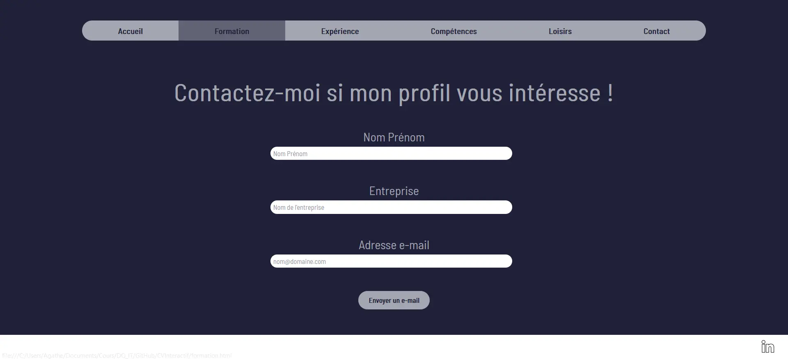

## Introduction

Ce POK est la continuité de mon premier MON intitulé [Web Front](https://francoisbrucker.github.io/do-it/promos/2023-2024/Agathe-Rabachou/mon/temps-1.1/). L'objectif ici est d'approfondir les connaissances acquises lors de ce MON, de les compléter en découvrant les bases du langage **JavaScript**, et d'utiliser le tout pour réaliser mon premier site web de A à Z.

## Sprint 1 - Les langages et la maquette

Pour commencer ce POK, je souhaitais pousser davantage l'apprentissage commencé dans le cadre de mon MON. Pour cela, j'ai suivi la fin du cours [Créez votre site web avec HTML5 et CSS3](https://openclassrooms.com/fr/courses/1603881-creez-votre-site-web-avec-html5-et-css3) sur OpenClassrooms, que je n'avais pas eu le temps de voir en entier lors du MON, et j'ai démarré [Apprenez à programmer avec JavaScript](https://openclassrooms.com/fr/courses/7696886-apprenez-a-programmer-avec-javascript) sur la même plateforme. Contrairement à mes objectifs, je n'ai pas eu le temps de suivre tous les chapitres durant le sprint 1, et j'ai donc dû terminer ce cours au sprint 2.

En parallèle, il m'a fallu trouver l'idée de fond de mon site web et réfléchir à une première maquette. J'ai décidé de réaliser mon CV en ligne interactif, car cela me semblait à la fois être un bon premier entraînement au front-end, et un outil que je pourrai forcément réutiliser.
Pour ce qui est du design, j'imagine une première page d'accueil, plutôt épurée, avec une photo, mon nom, une courte description, et des boutons pour mener vers les différentes parties classiques d'un CV.
L'objectif étant vraiment de tester et d'approfondir mes connaissances, chaque partie aurait un design différent qui me permettrait de varier l'utilisation des fonctionnalités de **HTML**, **CSS** et **Javascript**.

## Sprint 2 - Le développement du site

Après avoir fini de me former sur les langages utilisés, je me suis donc lancée dans la création du site. J'ai réalisé 6 onglets : accueil, formation, expérience, compétences, loisirs et contact.
J'ai fait des choix de charte graphique et de mise en page, et je me suis efforcée de continuer à apprendre et d'utiliser des méthodes variées en fonction des onglets. Par exemple, je me suis renseignée au sujet des pseudo-éléments CSS pour pouvoir réaliser une frise chronologique, j'ai utilisé différentes méthodes pour gérer le placement des éléments sur la page, on encore j'ai créé un formulaire de contact fonctionnel à l'aide de **JavaScript**. En effet, lorsqu'un potentiel recruteur remplit ce formulaire et clique sur "envoyer un mail", sa boite mail s'ouvre avec mon adresse mail en destinataire, et un objet et un message pré-écrits.
Enfin, certains éléments sont cliquables et amènent vers des informations plus détaillées comme le site web des établissements mentionnés par exemple.

## Rendu final

Voici donc le rendu final des différents onglets :

Vous trouverez [ici](https://github.com/arabachou/CVInteractif) mon repository GitHub avec l'ensemble du code.

## Pour aller plus loin

Le site est complet et fonctionnel, mais par manque de temps, je n'ai pas pu mettre en place l'intégralité de ce que j'avais imaginé. Pour continuer ce projet, je commencerais par me pencher sur l'aspect responsive, qui n'est pas assez travaillé sur toutes les pages, et j'essaierai aussi de mettre en place plus d'interactivité, avec par exemple l'apparition progressive de certains éléments selon les actions du visiteur du site.

## Bibliographie

Ce site a été réalisé avec l'aide des connaissances des cours [Créez votre site web avec HTML5 et CSS3](https://openclassrooms.com/fr/courses/1603881-creez-votre-site-web-avec-html5-et-css3) et [Apprenez à programmer avec JavaScript](https://openclassrooms.com/fr/courses/7696886-apprenez-a-programmer-avec-javascript) d'OpenClassrooms, ainsi que du tutoriel [Comment faire une timeline en html/css ?](https://www.codeur.com/tuto/css/timeline-en-html-css/) de Codeur.com.