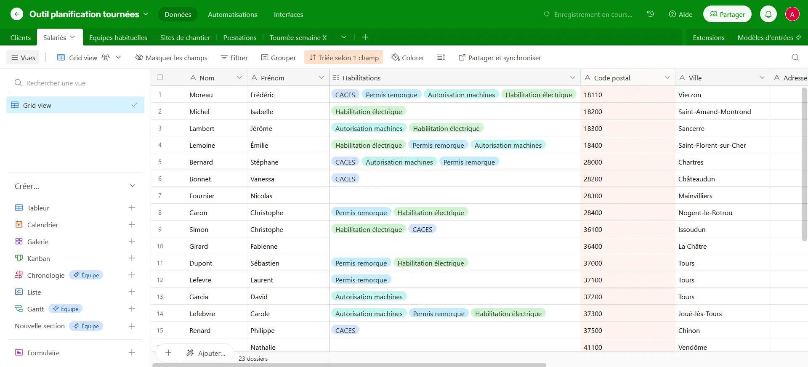
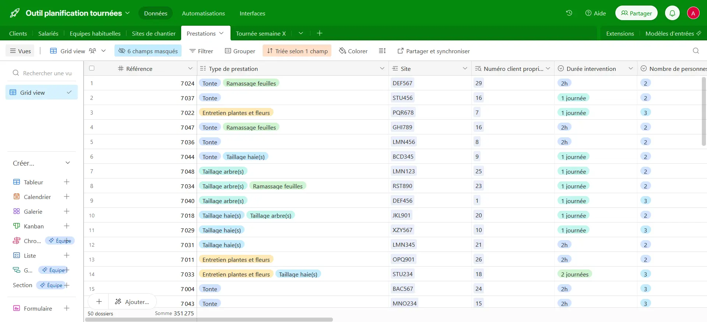
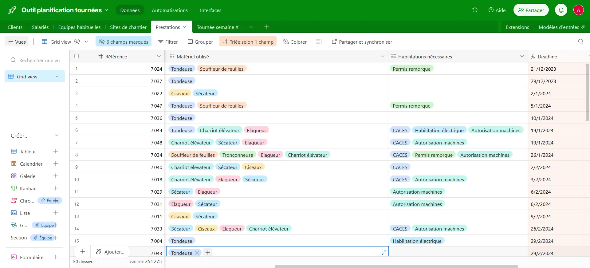
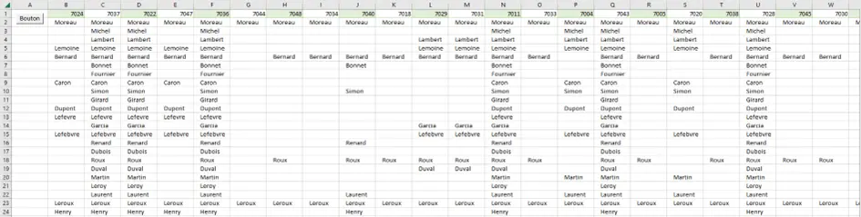

## Introduction

Initialement l'objectif de ce POK était de découvrir le low-code, n'ayant pas suivi ce cours au temps 1 et ayant entendu des retours très positifs sur celui-ci. J'avais donc imaginé inventer un prétexte, site ou application, pour pouvoir apprendre et pratiquer. J'ai finalement trouvé un cas d'étude plus intéressant lorsqu'Henri m'a parlé d'une connaissance qui cherchait à refaire l'outil de planification de son entreprise en low-code. Cela me donnait un cas concret, avec un contexte et un réel besoin client, et je me suis donc lancée dans ce projet.

## Sprint 1

### Objectifs

- Découverte du sujet, contact avec le client, étude du fonctionnement actuel de l'entreprise et des problèmes qui en découlent, compréhension du besoin et mise en place d'un cahier des charges de l'outil à créer (5h) ;
- Comparaison des différents moyen de faire du low-code, choix de la ou des technologies à utiliser et prise en main de leur fonctionnement (3h) ;
- Premières réflexions sur la solution à mettre en place (2h).

### Réalisations

Pour commencer, j'ai pris contact avec le client pour réaliser un bilan de la situation existante, dont voici un compte rendu :

**Contexte** : La société est une ETI (Entreprise de Taille Intermédiaire) du domaine agricole. Son activité principale est constituée de prestations de paysagisme telles que la tonte de pelouse, le taillage d'arbres ou de haies ou encore le ramassage de feuilles. L'entreprise a environ 300 clients pour 600 sites à entretenir. Elle se compose de 9 équipes de 2 à 3 personnes. Dans chacune d'entre-elles un chef d'équipe est désigné. Chaque équipe a un nombre défini de sites et de clients à gérer, répartis en général par zones géographiques, matériel nécessaire aux travaux et habilitations et compétences des chefs d'équipes (autorisations pour certaines machines, permis remorque, CACES, habilitation électrique...).

**Problème** : De plus en plus de chefs d’équipe sont incapables d’organiser les tournées ou sont peu motivés et trichent sur les heures. Le management demande donc que les encadrants prennent en main l'organisation des tournées et imposent les chantiers à réaliser chaque jour.

**Organisation actuelle** : Les tournées sont organisées sur un tableau à feutres, les jours de la semaine en colonnes, les chefs d'équipe en lignes, et les cases sont complétées pour indiquer qui s'occupe quand de quel client ou secteur géographique. Ils ont également un tableau pour confirmer les travaux effectués, les semaines en colonnes, les sites en lignes, et les cases sont hachurées pour indiquer que la prestation a bien été réalisées. Enfin, les chefs d'équipes entrent leurs heures dans un ERP, chaque jour et pour chaque site.
Pour ce qui est de la solution actuelle de recensement des prestations, il s'agit d'un fichier Excel qui contient pour chaque prestation le client, le site, le chef d'équipe, le type de prestation, la fréquence et la durée d'intervention, le nombre de personnes et le matériel utilisé. L'entreprise est également en train de tester un outil Excel qui permet de comparer le nombre d'heures planifiées sur ce document avec le nombre d'heures réellement effectuées.

**Objectif de l'outil à développer** : L'outil à élaborer devra permettre de planifier les interventions à venir et de les réajuster selon les aléas, afin d'optimiser l'activité et de mieux contrôler les équipes. Parmi ces aléas on trouve régulièrement les absences, les intempéries, la casse de matériel ou encore les annulations du client. Pour gérer cette planification, il faudra prendre en compte les compétences et habilitations des chefs d'équipes, leur entente avec les autres membres, l'éloignement entre leur domicile et les sites de chantiers (que l'on essaiera de minimiser), les contraintes clients (horaires, jours, délais de prévenance...) et la possibilité pour les équipes de rentrer sur les sites (pour les clients industriels notamment, avec des questions de plan de prévention).
Voici quelques directives pour certains des aléas courants :
- En cas d'absence de dernière minute, on essaie de recomposer une équipe en faisant passer un second au rang de chef d'équipe pour une journée si nécessaire. Si ce n'est pas possible, on annule les chantiers planifiés ;
- Pour ce qui est des intempéries, si c'est un impératif l'équipe réalise la prestation, sinon le chantier est reporté. Si il y a un délai côté client le chantier doit être repositionné rapidement, sinon c'est plus aléatoire.

**Contraintes supplémentaires** :
- La solution proposée doit convenir à du personnel qui n'est pas forcément très à l'aise avec l'informatique, il faut donc qu'elle soit la plus simple possible ;
- Idéalement elle communiquerait avec l'ERP pour remplir la fonction de l'outil actuellement en développement ;
- Elle devrai rester facilement adaptable à tout changement effectué à la main en dernière minute.


Dans un deuxième temps s'est posée la question du ou des outils low-code à utiliser. J'ai donc fait des recherches sur les différentes technologies existantes pour déterminer ce qui conviendrait le mieux au cas d'étude. J'ai regardé différents tutoriels d'utilisation, entre autres de Microsoft Power Apps, Mendix ou Appian. Finalement, Airtable m'a semblé être la solution la plus intuitive et adaptée à l'analyse de données, et je prévois donc de me servir de cette plateforme. L'idée serait de l'utiliser pour la partie analyse des données et de garder Excel en ce qui concerne l'affichage de la planification et sa manipulation.
J'ai également commencé à me renseigner sur des solutions pour mettre en lien  l'ERP existant avec le nouveau système de planification, notamment avec des outils comme Zapier ou Make (anciennement Integromat), mais je n'ai pas assez poussé mes recherches pour choisir une solution en particulier, d'autant plus que je ne suis pas encore sûre d'avoir le temps d'implémenter cette fonctionnalité.

### Retours

Pour conclure ce premier sprint, j'ai à peu près réalisé les objectifs prévus dans le temps imparti (un peu moins de 10h en réalité). Je pense cependant que j'aurais pu passer moins de temps sur l'étude des outils low-code si j'avais fait des recherches de manières plus structurée et méthodique et sans me disperser comme j'ai pu le faire.
Malgré ma légère avance sur le sprint planning en terme de temps, je n'ai pas pu commencer le développement de la solution (qui me prendra je pense un peu plus de 10h) car j'ai reçu certaines informations plutôt tardivement relativement à la date de la première revue. Je pense donc que ce POK avoisinera bien les 20h au total mais de manière un peu déséquilibrée entre les deux sprints.

## Sprint 2

### Objectifs

- Finalisation de la réflexion autour du design et du fonctionnement final de la solution (1h) ;
- Développement de l'outil (8h) ;
- Tests et retours par le client (1h) ;
- Reprise de la solution si besoin (en plus).

### Réalisations

Les objectifs de ce deuxième sprint ont été beaucoup plus difficiles que je ne l'avais imaginé.

Tout d'abord, j'ai réfléchi aux bases de données nécessaires pour une entreprise telle que celle de la présente étude de cas, et j'ai crée un jeu de données fictif pour pouvoir tester les fonctionnalités d'Airtable. J'ai ainsi crée :
- une table *Clients* avec les données Numéro client, Nom, Prénom, Adresse, Code Postal, Ville, Téléphone et E-mail
- une table *Salariés* avec les données Nom, Prénom, Habilitations, Adresse, Code Postal, Ville, Téléphone et E-mail
- une table *Sites de chantiers* avec les données Code site, Adresse, Code Postal, Ville, Surface et Client propriétaire (lié à la table *Clients*)
- une table *Prestations* avec les données Référence, Type de prestation, Durée d'intervention, Nombre de salariés min. nécessaire, Matériel utilisé, Habilitations nécessaires, Deadline (Deadline brute pour les prestations uniques et deadline calculée en fonction de la fréquence et de la date de dernière intervention pour les prestations récurrentes, rassemblée dans une même colonne à l'aide de formules)
- Enfin, j'ai crée une table *Équipes habituelles* dans l'objectif de simplifier la suite, qui contient pour chaque équipe une Numéro d'équipe, un Chef d'équipe et un ou deux Membres.

Voici des captures d'écran d'une partie des deux tables les plus importantes pour suivre la suite du raisonnement. La base complètes est disponible à [ce lien](https://airtable.com/invite/l?inviteId=invc2LAbkSvKVUnEi&inviteToken=1c7005e9f0657cb15f4fa7ae54c7ff06a310988c4991084748d8f2b8e2585733&utm_medium=email&utm_source=product_team&utm_content=transactional-alerts) sous réserve de créer un compte Airtable.





Ensuite, j'ai crée les connexions pertinentes entre les différentes tables pour faciliter la lecture et l'utilisation des données. Entre autres, j'ai par exemple extrait de la table *Salariés* dans la table *Équipes habituelles* les habilitations des chefs de chaque équipe, puis j'ai utilisé cela pour reporter dans une colonne Équipes habilitées de la table *Prestations* la liste des équipes pouvant effectuer chaque prestation au regard des habilitations de leur chef d'équipe (comme mentionné dans le cahier des charges).

C'est dans la suite que cela ce complique. J'ai d'abord voulu créer sur Airtable une version simplifiée du planning qui était mon objectif initial. Dans cette version, je prenais en compte uniquement les habilitations nécessaires pour réaliser la prestation, sa durée, et la priorisation selon la deadline (j'ai donc laissé de côté l'optimisation des temps de trajet entre le domicile des salariés et les sites de chantier ou encore l'entente entre les membres de l'équipe, qui étaient des critères mentionnés lors du sprint 1 mais qui rendaient le projet beaucoup trop complexe).
Le problème est que les fonctionnalités Airtable (et notamment les possibilités de créer des fonctions) sont très limitées, et je n'ai donc pas réussi. Mon principal point bloquant a été le fait de ne pas pouvoir connecter plus de deux bases ensemble pour récupérer une donnée. Par exemple, imaginons une nouvelle table dans laquelle je mets une partie des prestations les plus urgentes dans l'objectif de leur attribuer une équipe, il est impossible d'écrire dans une colonne de cette table une fonction qui dirait "je veux extraire ici les Noms de la table *Salariés* telles que les Habilitations associées correspondent aux Habilitations nécessaires dans la table *Prestations* des prestations auxquelles j'ai fait référence ici". Autrement dit on ne peut pas extraire automatiquement les salariés habilités à effectuer certaines prestations. Ce qui rend impossible la résolution de la suite du problème.

J'ai donc fait plusieurs recherches sur d'autres outils Low-Code depuis lesquels je pourrais récupérer ma base de données Airtable et automatiser certaines actions, mais je pense que mon objectif dépasse de loin les possibilités du Low-Code de manière générale, et cela n'a donc pas abouti.

Afin d'essayer tout de même d'obtenir un résultat, j'ai converti ma base de données en csv pour l'importer dans Excel et essayer de faire du VBA (même si on sort du No-Code). Cette étape a été très laborieuse dû à mes faibles connaissances en VBA, mais j'ai réussi pour commencer à créer une fonction qui prend en paramètre les habilitations d'un salarié et les habilitations nécessaires pour réaliser une prestations et qui renvoie vrai si le salarié peut réaliser la prestation. Je l'ai testé en générant un tableau qui affiche les salariés habilités pour chaque prestation, et en voici le code et le résultat : 

```vba
Function Habilité(Habilitations As String, Habilitations_requises As String) As Boolean
    Dim Liste_habilitations() As String
    Dim Liste_habilitations_requises() As String
    
    Liste_habilitations = Split(Habilitations, ",")
    Liste_habilitations_requises = Split(Habilitations_requises, ",")
    
    Dim Habilitation_requise As Variant
    
    For Each Habilitation_requise In Liste_habilitations_requises
        If InStr(1, Habilitations, Habilitation_requise) = 0 Then
            Habilité = False
            Exit Function
        End If
    Next Habilitation_requise
    
    Habilité = True
End Function

Sub test()
    Dim Tab_salariés As Worksheet
    Dim Tab_prestations As Worksheet
    Dim Tab_planning As Worksheet
    Dim Nb_salariés As Long
    Dim Nb_prestations As Long
    Dim i As Long
    Dim j As Long

    Set Tab_salariés = ThisWorkbook.Sheets("Salaries")
    Set Tab_prestations = ThisWorkbook.Sheets("Prestations")
    Set Tab_planning = ThisWorkbook.Sheets("Planning")

    Nb_salariés = Tab_salariés.Cells(Tab_salariés.Rows.Count, "A").End(xlUp).Row
    Nb_prestations = Tab_prestations.Cells(Tab_prestations.Rows.Count, "A").End(xlUp).Row

    For i = 2 To Nb_salariés
        For j = 2 To Nb_prestations
            If Habilité(Tab_salariés.Cells(i, "C").Value, Tab_prestations.Cells(j, "H").Value) Then
                Tab_planning.Cells(i, j).Value = Tab_salariés.Cells(i, "A").Value
                End If
            Next j
        Next i
End Sub
```



A partir de cela, j'ai donc voulu créer une procédure qui pour chaque prestation (priorisées par urgence) cherche un salarié habilité (grâce à la fonction ci-dessus) et disponible le plus tôt possible (on considère qu'un salarié est disponible au lendemain du dernier jour de sa dernière prestation, on calcule donc son premier jour de disponibilité en faisant "date de début de la prestation attribuée juste avant" + "durée de cette prestation" + 1). Lorsque ce salarié est trouvé, la prestation lui est attribué dès son prochain jour vide et le code passe à la prestation suivante.
Cependant, même après de nombreux tests et modifications, je n'ai pas réussi à faire aboutir cette idée. Voici la dernière version du code mais qui n'est donc pas fonctionnelle comme je le souhaitais :

```vba
Function Habilité(Habilitations As String, Habilitations_requises As String) As Boolean
    Dim Liste_habilitations() As String
    Dim Liste_habilitations_requises() As String
    
    Liste_habilitations = Split(Habilitations, ",")
    Liste_habilitations_requises = Split(Habilitations_requises, ",")
    
    Dim Habilitation_requise As Variant
    
    For Each Habilitation_requise In Liste_habilitations_requises
        If InStr(1, Habilitations, Habilitation_requise) = 0 Then
            Habilité = False
            Exit Function
        End If
    Next Habilitation_requise
    
    Habilité = True
End Function

Sub test()
    Dim Tab_salariés As Worksheet
    Dim Tab_prestations As Worksheet
    Dim Tab_planning As Worksheet
    Dim Nb_salariés As Long
    Dim Nb_prestations As Long
    Dim i As Long
    Dim j As Long
    Dim Début_prestation As Date
    Dim Fin_prestation As Date
    Dim Durée_prestation As Double

    Set Tab_salariés = ThisWorkbook.Sheets("Salaries")
    Set Tab_prestations = ThisWorkbook.Sheets("Prestations")
    Set Tab_planning = ThisWorkbook.Sheets("Planning")

    Nb_salariés = Tab_salariés.Cells(Tab_salariés.Rows.Count, "A").End(xlUp).Row
    Nb_prestations = Tab_prestations.Cells(Tab_prestations.Rows.Count, "A").End(xlUp).Row
    
    'Cette partie de code trie les données de la table Prestations par ordre de priorité
    Tab_prestations.Sort.SortFields.Clear
    Tab_prestations.Sort.SortFields.Add2 Key:=Range("K2:K" & Nb_prestations), SortOn:=xlSortOnValues, Order:=xlAscending
    With Tab_prestations.Sort
        .SetRange Range("A1:K" & Nb_prestations)
        .Header = xlYes
        .MatchCase = False
        .Orientation = xlTopToBottom
        .SortMethod = xlPinYin
        .Apply
    End With

    Tab_planning.Cells.Clear
    
    Début_prestation = Date + 1

    For i = 2 To Nb_prestations
        Fin_prestation = 1 / 1 / 100
        Durée_prestation = Tab_prestations.Cells(i, "F").Value
        
        For j = 2 To Nb_salariés
            If Habilité(Tab_salariés.Cells(j, "C").Value, Tab_prestations.Cells(i, "I").Value) Then
                If Fin_prestation < Début_prestation Then
                    Tab_planning.Cells(j, i).Value = Tab_prestations.Cells(i, "A").Value
                    
                    Fin_prestation = Début_prestation + Durée_prestation
                    Début_prestation = Fin_prestation + 1
                    Exit For
                End If
            End If
        Next j
    Next i
End Sub
```

Le résultat de l'exécution de cette procédure est une suite de prestations dans l'ordre dans lequel elles sont attribuées mais en ligne et non en tableau de i par j, ce qui signifie que le j ne varie pas, donc la boucle sur j n'est pas prise en compte, mais je n'ai pas trouvé d'où vient le problème.

### Retours

Pour conclure ce sprint :
- En terme de temps, j'ai passé environ 2h à construire les bases de données, 2h à créer les liens et à tester des solutions pour créer un planning sous Airtable, 1h à chercher d'autres solutions Low-Code, et 5h à travailler sur le problème en VBA (je n'ai pas du tout abordé la partie discussion et retour au client comme prévu).
- Cette problématique est très intéressante bien que beaucoup trop complexe pour un POK, même en version très simplifiée (ce que j'avais largement sous-estimé). Par curiosité, j'ai fait des recherches plus poussées sur le sujet de l'optimisation de planning selon différentes contraintes de manière générale, les algorithmes qui pourraient être utiles et la notion d'optimisation combinatoire, et je suis tombée sur une thèse qui traite quasiment ce problème et dont voici le [lien](https://theses.hal.science/tel-00011399/document) pour les intéressés.
- Enfin, je pense que même si cela n'a pas abouti à un planning automatique comme c'était l'objectif initialement, la base de données créée sous Airtable peut-être un bon outil pour l'entreprise. En effet, elle permet quand même, même s'il faut remplir le planning à la main, de tirer plus rapidement certaines informations du jeu de données comme le personnel habilité, l'adresse d'un chantier ou encore le matériel nécessaire. De plus, il est possible d'automatiser certaines actions sur la plateforme, comme par exemple l'envoi d'un mail aux salariés concernés lorsque l'on modifie une ligne sur le planning (toujours à la main, le cas échéant). Cela pourrait permettre en somme d'éviter aux équipes de venir voir chaque matin le planning sur un tableau fixe, mais plutôt de le consulter / d'être notifié de leurs missions directement en ligne.