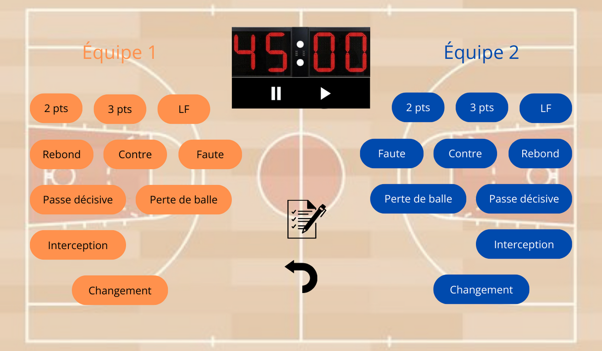
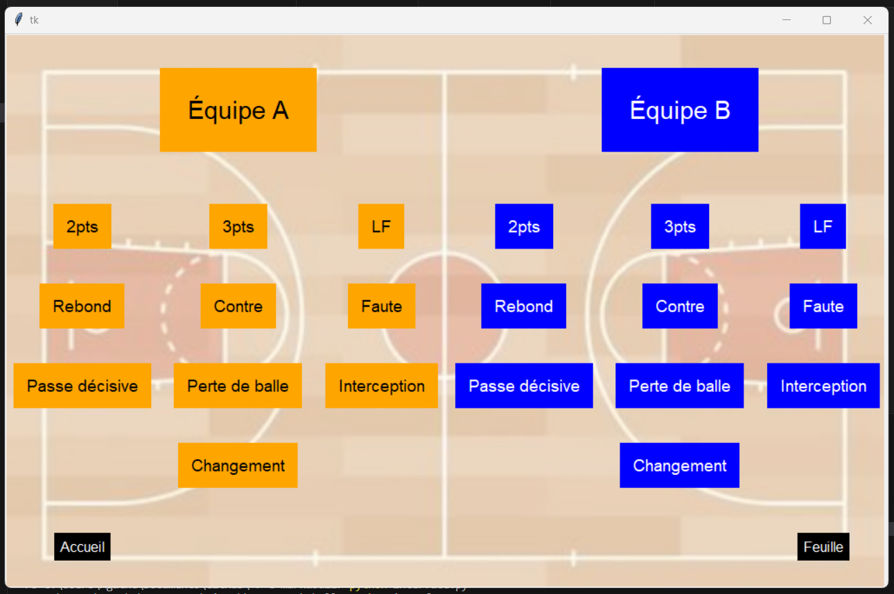

## Introduction

Ce POK s'inscrit dans le cadre d'un loisir personnel : le basket-ball. Le but est de réaliser une interface qui permette de rentrer un maximum d'informations sur un match que l'on regarderait en temps réel, et de laquelle on pourrait récupérer la feuille de match et toutes les grilles de statistiques à l'issue de la rencontre. A terme, l'outil pourrait être utilisé dans un club amateur à des fins d'optimisation des performances. L'interface devra donc être la plus intuitive possible afin que l'utilisateur puisse suivre le rythme du match, et les documents extraits devront respecter un certain format, condenser les données pertinentes et permettre des comparaisons rapides.
Tout ce projet sera réalisé en Python, afin de revoir et de développer mes (faibles) connaissances dans ce langage.

## Sprint 1

### Objectifs

- Définition exacte et précise du backlog, avec notamment l'ensemble des données en entrée et en sortie de l'interface (1h) ;
- Réflexion autour du design de l'interface et réalisation d'une maquette (1h) ;
- Réalisation de l'interface fonctionnelle en Python (2h) ;
- Amélioration du design de l'interface pour obtenir quelque chose de plus attractif (2h) ;
- Implémentation des premières fonctionnalités avec au minimum la récupération des données de l'utilisateur et la création de la feuille de match (4h).

### Réalisations

Dans un **premier temps**, j'ai établi la liste exhaustive et idéale des fonctionnalités de mon interface. L'interface doit contenir un chronomètre de 4x 10 minutes, que l'utilisateur doit pouvoir arrêter et relancer. L'utilisateur doit pouvoir rentrer au fur et à mesure du match :
- Chaque panier, marqué ou non, avec le nombre de point (ou le type de shoot, c'est équivalent), l'équipe et le joueur concernés ;
- Chaque rebond, avec l'équipe et le joueur concernés ;
- Chaque contre, avec l'équipe et le rebond concernés ;
- Chaque interception, avec l'équipe et le joueur concernés ;
- Chaque passe décisive, avec l'équipe et le joueur concernés ;
- Chaque perte de balle, avec l'équipe et le joueur concernés ;
- Chaque faute, avec le type de faute, l'équipe et le joueur concernés ;
- Chaque changement, avec l'équipe concernée, le joueur entrant, le joueur sortant, et le chrono associé (cela comprend les joueurs du 5 majeur au début du match).

Idéalement, chaque événement rentré dans l'interface doit être lié à un quart-temps (grâce au temps déjà écoulé au chronomètre). L'utilisateur doit également pour revenir en arrière en cas d'erreur, et consulter l'ensemble des événements déjà rentrés.
A la fin du match, l'utilisateur doit pouvoir récupérer :
- La feuille de match remplie ;
- La grille de statistique de chaque équipe ;
- L'évaluation individuelle et la grille de statistique de chaque joueur ;

Si le temps me le permet, une suite intéressante au projet pourrait être de conserver toutes les informations de chaque match dans une base de données pour pouvoir faire des comparaisons de performance des équipes et des joueurs entre les matchs ou encore des statistiques moyennes sur une saison complète. Dans ce cas, il faudrait également conserver en mémoire pour chaque match la date, le lieu (domicile ou extérieur) et l'équipe adverse.

Dans un **second temps**, j'ai imaginé un design pour l'interface, que j'ai maquetté sur Canva. Voici le rendu de la page principale :

La maquette complète avec la page d'accueil et des exemples de fonctionnement est disponible à [ce lien](https://www.canva.com/design/DAF9aX-qabs/2vwFKz3I0joGODFLJQR0hw/edit?utm_content=DAF9aX-qabs&utm_campaign=designshare&utm_medium=link2&utm_source=sharebutton).

**Ensuite**, j'ai commencé le développement. J'ai fait quelques recherche avant de choisir Tkinter comme framework Python pour réaliser l'interface. J'ai eu un peu de mal à le prendre en main, mais je suis finalement arrivée au résultat suivant pour ma page principale :

J'ai alors commencé le développement des fonctionnalités : pour l'instant, une liste déroulante pour choisir le joueur s'affiche lorsque l'on clic sur un événement, et une fois le joueur choisi, un couple ('événement', 'numéro du joueur') s'ajoute à la liste correspondante.

### Retours

Pour conclure, l'ensemble du code réalisé est disponible sur ce [Github](https://github.com/arabachou/-r-e-markaball.git). Faute de temps, ce sprint n'a pas duré les 10h prévues et sera compensé par le suivant. Enfin, les difficultés rencontrées se sont principalement situées sur la prise en main et l'utilisation de Tkinter pour l'interface, que je ne connaissais pas du tout, mais qui s'avère très bien fait une fois maîtrisé.

### Organisation du temps

| Durée | Action |
| -------- | -------- |
| 30min | Définition exacte du backlog |
| 1h15 | Réalisation de la maquette |
| 30min | Recherches et choix du framework pour l'interface |
| 1h | Lecture de la documentation et prise en main de Tkinter |
| 1h | Réalisation d'une interface fonctionnelle |
| 1h30 | Design de l'interface |
| 1h15 | Écriture des premières fonctions |

## Sprint 2

### Objectifs

- Designer les autres pages de l'interface (3h)
- Terminer le développements des fonctionnalités principales pour rendre l'application utilisable (3h)
- Faire le lien entre les pages (30min)
- Rendre l'utilisation personnalisable selon les joueurs et les équipes (1h30)
- Créer et formaliser les documents extraits par l'utilisateur (2h)
- En plus selon le temps : implémenter un chronomètre et associer un temps aux événements

### Réalisations

### Retours

### Organisation du temps

