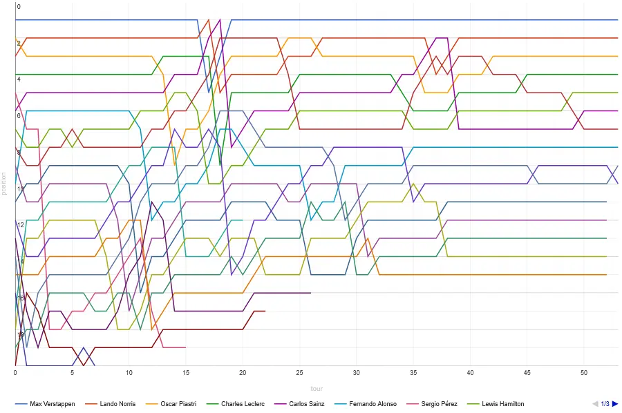
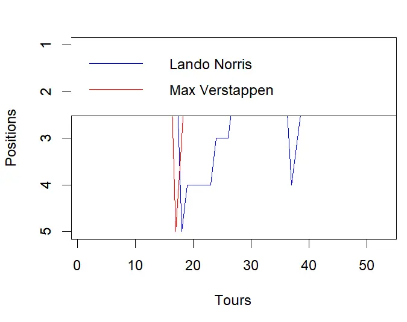
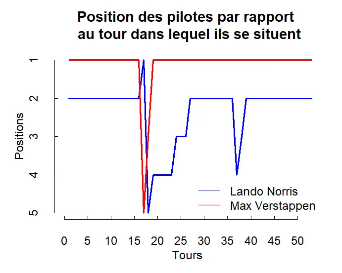



**Niveau :** débutant
**Prérequis :**
- Bases de programmation



## Sommaire

1. Introduction
2. Bases
3. Importation de données à partir de fichiers externes
4. Application sur des données de Formule 1

## 1. Introduction
Pour la réalisation de ce cours, j'aurais cinq sources principales : 
- Initiez-vous au langage R pour analyser vos données, cours dispensé sur le site openclassrooms que vous pouvez trouvez [ici](https://openclassrooms.com/fr/courses/4525256-initiez-vous-au-langage-r-pour-analyser-vos-donnees).
- La documentation officielle R pour aller plus loin accessible [ici](https://cran.r-project.org/other-docs.html).
- Le site internet Racing Statistics accessible [ici](https://www.racing-statistics.com)
- Le site internet Pitwall.app accessible [ici](https://www.pitwall.app)
- L'e-book d'AWS sur la gestion des données en Formule 1

R est un logiciel de la famille GNU (GNU signifie "GNU's Not Unix"). Le projet GNU a été lancé en 1984 afin de développer un système d’exploitation complet, semblable à Unix, et qui soit un logiciel libre.
Je vais utiliser l'environnement de travail RStudio tout au long de cette formation puis des approfondissements. Mon but à la fin de ce MON est de pouvoir analyser et visualiser des jeux de données divers. J'espère approfondir suffisamment le langage pour analyser des données d'un sujet que je connais assez bien, le sport automobile.

## 2. Bases
#### Répertoire
Comme dans beaucoup d'environnements, il faut spécifier à RStudio le répertoire de travail avec la commande 
```shell
setwd("C:Users...")
```

#### Types d'objets
S'en suivent ensuite d'autres explications basiques sur les trois manières d'attribuer des variables, ou *objets* comme ils sont appelés dans la formation ; ainsi que la suppression des objets et l'explication sur les différents types d'objets en R. 

J'ai trouvé très intéressante la partie sur la conversion entre les types. R permet de convertir un objet en n'importe quel type, et ce même quand cela n'a pas de sens (par exemple : un nombre en type *numeric* que l'on peut convertir en booléen de type *logical*). Cette liberté peut permettre, à mon sens, des facilités de programmation utiles dans certains cas.

#### Les dataframes
Les dataframes sont des listes d'objets (appelés *composantes*), dont chaques composantes ont la même longueur. Ils sont particulièrement utiles dans l'analyse des données. J'ai appris à en créer à partir de deux listes, à partir d'une matrice et à en importer depuis un fixhier (.csv ou .txt par exemple) et aussi à les visualiser grâce à la fonction View.

#### La sélection d'éléments dans les différents types d'objets
Un réel atout de R par rapport à Python repose, à mon sens, dans la syntaxe de sélection d'éléments. Je trouve celle-ci très intuitive et logique et ce pour tous types d'objets, là où cela peut s'avérer plus technique selon les objets manipulés sur Python.
La sélection peut se faire par condition, par exemple :

```shell
#Créons la matrice X

X <- matrix(1:12,nrow=3,ncol=4)
X
#      [,1] [,2] [,3] [,4]
# [1,]    1    4    7   10
# [2,]    2    5    8   11
# [3,]    3    6    9   12

#Sélection par condition
X[,X[1,]>2]
#      [,1] [,2] [,3]
# [1,]    4    7   10
# [2,]    5    8   11
# [3,]    6    9   12
```

ou alors par indice :

```shell
X[1,-1:2] # Première ligne de X privée de ses deux premières colonnes
#      [,1] [,2]
# [1,]    7   10
```

## 3. Importation de données à partir de fichiers externes
#### A partir d'un fichier texte (.txt ou .csv)
Pour lire les données d'un fichier texte externe avec R, il faut utiliser la commande

```shell
maVariable <- read.table("monFichier.txt", sep=";", row.names=1, header=TRUE)
#header indique si la première ligne contient ou non les intitulés des variables. Il est FALSE par défaut.
```

#### A partir d'un fichier quelconque


Il est aussi possible avec RStudio d'importer tous les types de fichiers en utilisant le bouton Import Dataset.



#### Gérer les erreurs d'importations
J'ai appris dans ce MOOC à détecter les erreurs d'importation (provenant du fichier source généralement), notamment avec la bonne pratique d'utiliser la fonction `summary()`.
Celle-ci permet de visualiser un résumé de chaque donnée, ainsi que le nombre de type *NA*, en l'occurrence des erreurs de données. Un trop grand nombre de *NA* montre que le fichier source manque d'un grand nombre de données.

```shell
> summary(data1)
     noms               sexe                age    
 Length:6           Length:6           Min.   :16  
 Class :character   Class :character   1st Qu.:17  
 Mode  :character   Mode  :character   Median :17  
                                       Mean   :17  
                                       3rd Qu.:17  
                                       Max.   :18  
```


Ici il n'y a aucun problème d'import.

 
Ce MOOC s'est ensuite terminé sur un petit test que j'ai validé.

Source : Open Classrooms

## 4. Application sur des données de Formule 1
#### Objectif
Je vais dans cette partie appliquer ce que j'ai appris dans le MOOC pour visualiser et analyser rapidement des données issues de la Formule 1. Je fais d'abord des recherches pour déterminer le type de données auxquelles je pourrais avoir accès.

#### Générer un graphique des positions des pilotes à chaque tour
J'ai trouvé sur Internet plusieurs bases de données mettant à disposition des données de chaque Grand Prix, telles que les positions d'arrivées, les écarts avec les autres pilotes, les positions à chaque tour... C'est cette dernière donnée qui va m'intéresser, et je vais d'abord essayer de générer un graphique des positions de chaque pilote à chaque tour, comme montré ci-dessous :


Source : Pitwall

Cela me paraît assez accessible mais relève d'un bon entraînement d'utilisation de la fonction `plot()` .

#### Récupérer les données
A partir du site [Pitwall](https://pitwall.app), j'ai extrait les positions à chaque tour de deux pilotes (seulement deux pour l'exemple car je dois faire la procédure manuellement), Max Verstappen et lando Norris, pour le Grand Prix du Japon qui s'est déroulé le 24/09/2023. J'ai ensuite placé ces données dans un fichier Excel puis je les ai exporté en .csv. 
J'importe ensuite les fichiers dans RStudio, en déclarant des variables `Lando` et `Max` qui sont de type `dataframe` :

```shell
setwd("C:/Users/Beguier/Desktop")
Lando  <- read.csv("Norris.csv", header = TRUE, sep = ";")

Max  <- read.csv("Verstappen.csv", header = TRUE, sep = ";")
```

Je peux ensuite facilement demander à R une représentation graphique de la position des pilotes en fonction du tour dans lequel ils se situent.

```shell
# Créez un graphique avec la première colonne en abscisse et la deuxième colonne des deux fichiers en ordonnée
plot(Lando$Lap, Lando$Position, type="l", col="blue", xlab="Tours", ylab="Positions", ylim=rev(range(Lando$Position)))
lines(Lando$Lap, Max$Position, type="l", col="red")

# Inversez l'axe des ordonnées
axis(2, at=pretty(rev(Lando$Position)))

# Légendes
legend("topright", legend=c("Lando Norris", "Max Verstappen"), col=c("blue", "red"), lty=1)
```
On obtient alors ce graphique :



Afin d'améliorer l'esthétisme de ce graphique, j'y apporte quelques modifications pour obtenir le résultat suivant :

```python
setwd("C:/Users/Beguier/Desktop")
Lando  <- read.csv("Norris.csv", header = TRUE, sep = ";")

Max  <- read.csv("Verstappen.csv", header = TRUE, sep = ";")


# Créez un graphique avec la première colonne en abscisse et la deuxième colonne des deux fichiers en ordonnée
par(bg="white") # Définir le fond en blanc
plot(Lando$Lap, Lando$Position, type="l", col="blue", xlab="", ylab="", xlim=c(0, max(Lando$Lap)), ylim=rev(range(Lando$Position)), lwd=2, axes=FALSE)
lines(Lando$Lap, Max$Position, type="l", col="red", lwd=2)

# Emplacements des graduations sur l'axe des abscisses (tous les 5 tours)
x_ticks <- seq(0, max(Lando$Lap), by=5)

# Emplacements des graduations sur l'axe des ordonnées
y_ticks <- seq(max(Lando$Position), min(Lando$Position), by=-1)

# Ajoutez des axes personnalisés en noir (sans quadrillage)
axis(1, at=x_ticks, col.axis="black", tck=0.02, labels=TRUE) # Axe des abscisses en noir sans quadrillage
axis(2, at=y_ticks, col.axis="black", tck=0.02, labels=TRUE) # Axe des abscisses en noir sans quadrillage

# Déplacez l'étiquette de l'axe des abscisses en bas
mtext("Tours", side=1, line=2, col="black") # Texte en noir, ligne 2 pour le bas
mtext("Positions", side=2, line=2, col="black") # Texte en noir, ligne 2 pour le bas

# Légendes (positionnée en bas à droite)
legend("bottomright", legend=c("Lando Norris", "Max Verstappen"), col=c("blue", "red"), lty=1, text.col="black", bty="n") # Texte en noir, position en bas à droite
# Titre du graphique avec retour à la ligne au milieu
title(main="Position des pilotes par rapport \n au tour dans lequel ils se situent", col.main="black") # Titre en noir avec retour à la ligne au milieu
```



J'ai donc réussi mon cas pratique. J'aimerais poursuivre plus loin l'utilisation de R, peut-être dans un prochain MON ou de mon côté.