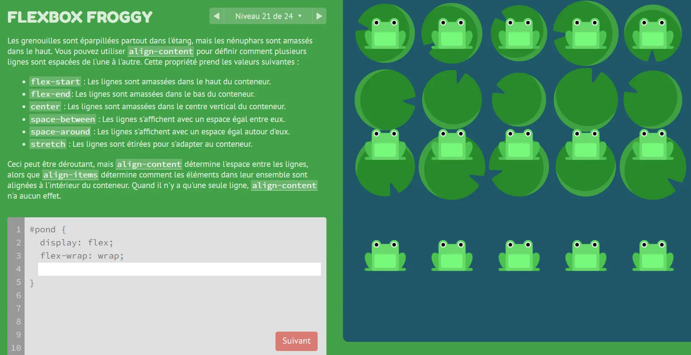



**Niveau :** débutant
**Prérequis :**
- Aucuns




## Sommaire
1. Introduction
2. Structure de la page
3. CSS3


## Introduction

Pour la réalisation de ce cours, je me réfèrerais aux sources listées ci-dessous : 
- *Créez votre site web avec HTML5 et CSS3*, cours réalisé sur OpenClassrooms par Mathieu Nebra et Alexia Toulmet. Accessible [ici](https://openclassrooms.com/fr/courses/1603881-creez-votre-site-web-avec-html5-et-css3).
- *Flexbox Froggy*, jeu permettant de s'entraîner à la syntaxe des Flexbox. Jeu créé par Codepip, accessible [ici](https://flexboxfroggy.com/#fr).

Je souhaitais dès le début de l'année savoir comment créer un site web, et cela passe par l'apprentissage de l'HTML et du CSS. Suivant les recommandations des [MONs précédents](https://francoisbrucker.github.io/do-it/mon/2023-2024/), j'ai choisi de suivre la formation de 15 heures disponible sur OpenClassrooms. Nous sommes amené tout au long de la formation à mettre nos connaissances en pratique à travers la construction d'un site web fictif de Robbie Lens.

## Structure de la page
La structure sommaire d'une page web est la suivante :

```html
<!DOCTYPE html> 
<html lang="fr">  <!--Balise principale : elle nous dit que la langue de la page est en français -->
    <head>        <!--Balise d'en tête : contient les informations de la page, comme le nom ou le type de caractère utilisé-->
        <meta charset="utf-8">
        <title>Nom de l'onglet</title>
    </head>
    <body> <!-- Corps de la page : Contient tous les éléments visibles pour l'utilisateur-->
    </body>
</html>

```

Les différents éléments de la page sont définis par des balises (par exemple : `<head>` et `</head>`) qui ouvrent et ferment le bloc. 
Pour plus de détails, je vous recommande de consulter le [MON de Vladimir](https://francoisbrucker.github.io/do-it/promos/2023-2024/Vladimir-Jeantroux/mon/temps-1-1/) qui détaille l'ensemble des balises standards.

On y rajoute des paragraphes avec `<p>` et des sections avec `<div>`.

```html
<!DOCTYPE html> 
<html lang="fr">  
    <head>        
        <meta charset="utf-8">
        <title>Mon de Benoît</title>
    </head>
    <body>
      <header>
        <div class="entete">
          <h1>Mon site web</h1>
            <a href="a-propos.html" class="apropos">À propos</a>
            <div class="search-bar">
              <input type="text" placeholder="Rechercher">
              <button type="button">Rechercher</button>
            </div>
        </div>
      </header>
    </body>
</html>

```

Cependant, nous n'avons ici écrit que la structure du site que le navigateur interprètera. 
Il est aussi important de s'attarder sur la forme et la mise en page.

## CSS3
Le CSS est un autre langage qui permet de mettre en forme les différents composants écrits en HTML. Dans l'idée, nous pouvons en CSS paramétrer le visuel de chaque composant HTML. Je recommande cette fois le [MON de William](https://francoisbrucker.github.io/do-it/promos/2023-2024/William%20Lalanne/mon/temps-1.1/) qui insiste sur les points importants du CSS et qui est très complet.

Personnellement, je retiens les points suivants pour mon futur site Web.

#### Les Grid

Les Grid permettent de créer un tableau sur la page qui facilite la mise en page. On déclare le composant que l'on souhaite transformer en grid en HTML, puis on le paramètre en CSS. Voici un exemple de syntaxe :

```css
.composant {
    display: grid;
    grid-template-columns: 200px 200px 200px;
    grid-template-rows: 400px 150px 200px;
    gap: 10px;
}
```

Je conseille d'utiliser les unités relatives *fr* (fraction units) pour s'adapter à toutes les tailles d'écrans. Cela permet une meilleure accessibilité sur tous les appareils. On peut par exemple écrire ceci :

```css
    grid-template-columns: 1fr 2fr;
```

Une deuxième manière de structurer la page web en CSS repose sur les Flexbox.

#### Flexbox

C'est pour ma part la syntaxe que j'ai préféré utiliser par rapport aux Grids. Je la trouve plus intuitive et maniable dans son comportement. La philosophie de Flexbox repose en mon sens sur la géométrie, ce qui est assez naturel. On oriente en CSS un axe primaire pour indiquer au navigateur dans quel sens doivent naviguer les boxes. Naturellement, l'axe secondaire correspond à sa rotation de 90°. On peut ainsi effectuer toutes les opérations auxquelles l'on pourrait penser en indiquant à CSS l'axe concerné.

J'ai ensuite passé tous les niveaux du jeu [Flexbox Froggy](https://flexboxfroggy.com/#fr) pour me familiariser avec toutes les subtilités du langage.



J'ai beaucoup appris et les petites grenouilles me rappelaient Nicolas Ouzoulias.