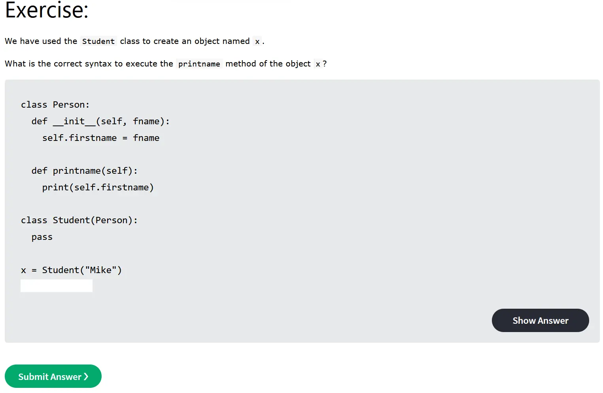
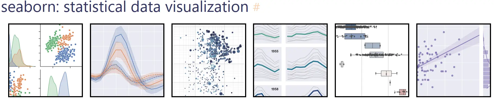
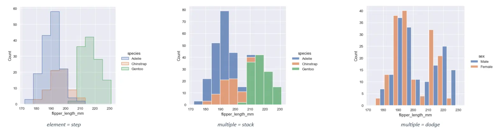
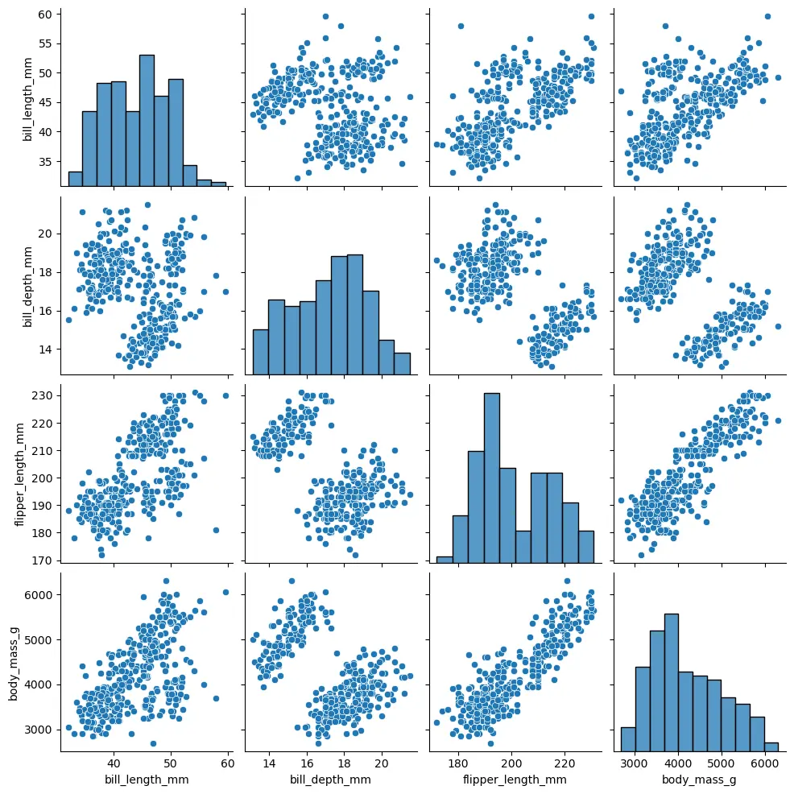
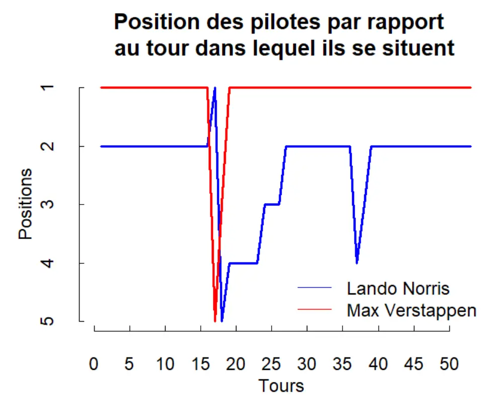
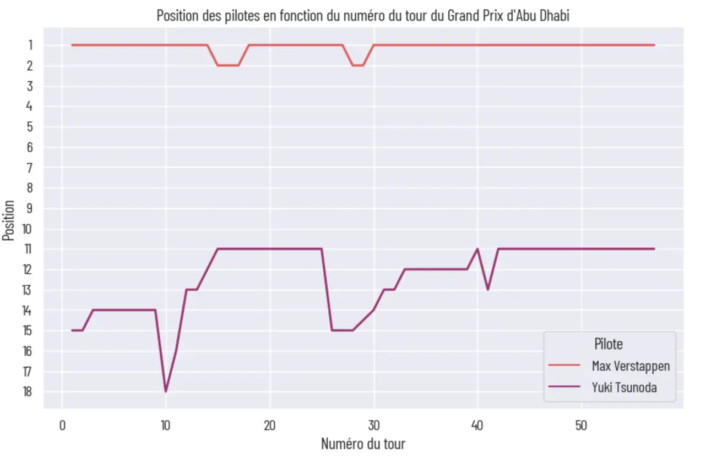



**Niveau :** Intermédiaire
**Prérequis :**

- Bases de Python



## Sommaire

1. Introduction
2. Remise au niveau intermédiaire sur Python
3. Découverte de la bibliothèque Seaborn
4. Mise en pratique en reprenant l'exemple du MON 1.1

## Introduction

Pour la réalisation de ce cours, je me réfèrerais aux sources listées ci-dessous :

- *Python Tutorial*, W3 Schools. Accessible [ici](https://www.w3schools.com/python/).
- *Coder en Python*, François Brucker. Accessible [ici](https://francoisbrucker.github.io/cours_informatique/cours/coder-en-python/)
- *Le tutoriel Python*. Accessible [ici](https://docs.python.org/fr/3/tutorial/index.html)
- *Documentation*, Seaborn. Accessible [ici](https://seaborn.pydata.org/tutorial.html)
- *How to Visualize Data in Python Using Seaborn | Seaborn Tutorial*, Gaelim Holland. Accessible [ici](https://www.youtube.com/watch?v=LnGz20B3nTU)
- *Seaborn Tutorial : Seaborn Full Course*, Derek Banas. Accessible [ici](https://www.youtube.com/watch?v=6GUZXDef2U0)

## Remise au niveau intermédiaire sur Python

### Exercices de décrassage (2 heures)

J'ai débuté ce MON en effectuant un grand nombre d'exercices Python sur le site W3 Schools, cité dans mes références. Ce site propose un peu moins de 5 exercices sur les différents aspect essentiels du langage, tels que :

- la syntaxe
- les variables
- les data types : string, boolean, number, integer, dictionnaries, ...
- les opérateurs
- les listes
- les tuples
- les boucles
- les fonctions
- les classes

Ces exercices représentaient selon moi le meilleur moyen de me remettre dans la syntaxe Python. Bien que Python soit assez intutif, certains mots-clés m'échappaient (*dir*, *break*, *continue*, ...). Les exercices sont d'abord très simples ce qui permet de se refaire la main, puis ils se corsent (très légèrement) pour aborder quelques détails, commandes et méthodes. J'ai aussi consulté en profondeur la documentation sur les listes car j'utilise fréquemment ce type d'objets.
Je recommande à tous de faire ces exercices. Ils m'ont pris deux heures, car j'ai systématiquement survolé la documentation des types et des commandes que je maîtrisais mal.



### Échauffement (2 heures 30)

J'ai ensuite effectué le cours de Python de M. Brucker accessible [ici](https://francoisbrucker.github.io/cours_informatique/cours/coder-en-python/). Je me suis attardé sur les parties Variables, Fonctions, Listes et Notebook.
Je retiens notamment la partie sur les listes en compréhension (dont la documentation est disponible [ici](https://docs.python.org/fr/3/tutorial/datastructures.html#list-comprehensions)), les arrays (dont la documentation est disponible [ici](https://numpy.org/doc/stable/reference/generated/numpy.array.html)), les Notebook et la partie *Pour aller plus loin*.
J'ai effectué l'ensemble des exercices proposés par M. Brucker sur les pages que j'ai consulté, afin de reprendre rapidement la main sur tous les types.

J'ai ensuite suivi le tutoriel Python (encore recommandé par Brucker) qui est disponible [ici](https://docs.python.org/fr/3/tutorial/index.html). Celui-ci étant très long, j'ai sélectionné uniquement les parties qui m'intéressaient :

- [10.6. Mathématiques](https://docs.python.org/fr/3/tutorial/stdlib.html#mathematics)
- [12.2. Création d'environnements virtuels](https://docs.python.org/fr/3/tutorial/venv.html#creating-virtual-environments)
- [12.3. Gestion des paquets avec pip](https://docs.python.org/fr/3/tutorial/venv.html#managing-packages-with-pip) histoire de consolider le cours de DevWeb du temps 2.

Enfin, j'ai lu la documentation du mot-clé *case* accessible [ici](https://docs.python.org/fr/dev/reference/compound_stmts.html) car je n'étais plus certain de son utilisation.

## Découverte de la bibliothèque Seaborn

### Introduction

Suite aux recommandations d'[Olivier Bastide](https://www.facebook.com/olivier.bastide.902), qui, après avoir suivi ses semaines de filières métier en ADAD, m'a chanté les louanges de la bibliothèque [Seaborn](https://seaborn.pydata.org/), je décide de lui faire confiance et d'apprendre à utiliser cette bibliothèque. Basée sur matplotlib, cette bibliothèque bénéficie donc de l'intégration sur tous les environnements supportés par matplotlib, ce qui est très pratique. Seaborn est plutôt orientée statistique et analyse des données, ce qui me convient parfaitement pour ce que je veux en faire. Il ne suffit que d'un

```python
pip install seaborn
```

pour installer la bibliothèque.



### Analyse de la documentation fournie sur le site Seaborn (2 heures)

J'ai d'abord fait un tour sur la page [Introduction](https://seaborn.pydata.org/tutorial/introduction) de Seaborn. Une rapide présentation des possibilités permises par la bibliothèque sont montrées et on a une première approche avec les méthodes de la bibliothèque.

L'ensemble des exemples fournis par Seaborn utilisent des *datasets* pré-existants. Il est possible de les consulter avec la commande

```python
sns.get_dataset_names()

['anagrams',
 'anscombe',
 'attention',
 'brain_networks',
 'car_crashes',
 'diamonds',
 'dots',
 'dowjones',
 'exercise',
 'flights',
 'fmri',
 'geyser',
 'glue',
 'healthexp',
 'iris',
 'mpg',
 'penguins',
 'planets',
 'seaice',
 'taxis',
 'tips',
 'titanic']
```

Je m'attarde ensuite sur la partie [Visualizing distributions of data](https://seaborn.pydata.org/tutorial/distributions.html) car c'est ce que j'aimerais effectuer dans la suite de ce MON.
J'apprends d'abord à paramétrer l'affichage des histogrammes, dans les cas simples et dans les cas de données multiples. Seaborn permet par exemple de sélectionner **très facilement** le mode d'affichage de données multiples sur un même graphique. En jouant sur deux paramètres, on peut alors empiler (*stack*) les barres des données au lieu de les superposer, les faire afficher en *step*, ou encore les afficher côte-à-côte.



Nous abordons aussi le cas des distributions à deux variables. J'ai trouvé cette partie très intéressante car elle lie statistiques et programmation. J'ai légèrement survolé la partie sur les distributions marginales, qui ne m'intéressent pas spécialement dans mon étude.

Je retiens les fonctions suivantes :

- *`displot()`*, qui permet d'afficher la distribution des données. Indiquer `kind=hist` dans ses paramètres affiche un histogramme, `kind=kde` affiche une Kernel Distribution Estimation. A noter que les fonctions *`hisplot()`* et *`kdeplot()`* existent à part entière mais *`displot()`* permet une souplesse d'utilisation très agréable.
- *`scatterplot()`* pour les nuages de points, avec le paramètre `hue` très utile qui permet de grouper les données.
- *`countplot()`* qui permet d'afficher des histogrammes pour des variables non quantitatives.
- *`heatmap()`* que je trouve très stylé même si je n'en vois pas l'utilisation pour les données que j'utilise.

Dédicace à la fonction *`pairplot()`* qui permet, lorsque l'on étudie un grand *dataset* et que l'on ne connaît pas les relations entre chaque variable, d'afficher la distribution univariée de chaque variable ainsi que leurs relations par pair.

```python
penguins = sns.load_dataset("penguins")
sns.pairplot(penguins)
```

**Output :**


#### Vidéos Youtube (1 heure)

J'ai ensuite décidé de regarder plusieurs vidéos Youtube sur la bibliothèque Seaborn, car en général il y a souvent des applications ou des pratiques que je n'aurais pas soupconnées en lisant uniquement la documentation.

J'ai d'abord regardé la vidéo de Gaelim Holland : [*How to Visualize Data in Python Using Seaborn | Seaborn Tutorial.*](https://www.youtube.com/watch?v=LnGz20B3nTU). Honnêtement je ne la recommande pas, car le contenu n'est pas très différent de la documentation, et il commet quelques imprécisions malvenues (par exemple dans `import seaborn as sb`, il affirme que `sb` est une variable alors que c'est un alias).

Je retiens cependant la ligne de commande

```python
data.head()
```

qui permet d'afficher les premières lignes du dataset, ce qui est très pratique en particulier dans les Notebooks.

J'ai ensuite regardé la vidéo [*Seaborn Tutorial : Seaborn Full Course*](https://www.youtube.com/watch?v=6GUZXDef2U0) de Derek Banas. Claire et directe, elle permet de revoir toutes les possibilités offertes par Seaborn. Bonus : son notebook qu'il rend disponible dans la description.

## Mise en pratique en reprenant l'exemple du MON 1.1

Dans mon [MON 1.1](https://francoisbrucker.github.io/do-it/promos/2023-2024/Beguier-Benoit/mon/temps-1.1/), j'avais utilisé le langage R pour analyser les données issues du Grand Prix du Japon et afficher un graphique montrant la position de deux pilotes en foction du tour de la course.



Je souhaite cette fois améliorer le graphique obtenu et le temps machine grâce à Seaborn. Je vais pour ce MON me baser sur les données du dernier Grand Prix de la saison qui s'est déroulé à Abu Dhabi le 26/11/2023. J'ai récupéré les données sur le site [Pitwall](https://pitwall.app/analysis/compare-lap-times) et je crée un fichier .csv avec les données.

J'ai réalisé tout ce travail dans un Notebook que vous pourrez trouver ci-dessous.


[Lien du Notebook](https://github.com/FrancoisBrucker/do-it/blob/main/src/promos/2023-2024/Beguier-Benoit/mon/temps-2.1/MON2_1.ipynb)


Je suis satisfait de la finalité de mon MON et de la bibliothèque Seaborn. Je n'ai fait ici qu'effleurer les possibilités qu'elle offre car je n'ai pas fait d'études statistiques, mais il en résulte une très grande facilité d'utilisation.


