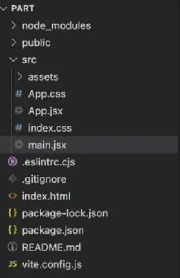



**Niveau :** Intermédiaire
**Prérequis :**

- Bases d'HTML, CSS et de JavaScript sont un plus



## Sommaire

1. Introduction
2. Apprentissage de Node.js
3. Mise en application

## Introduction

Pour la réalisation de ce cours, je me réfèrerais aux sources listées ci-dessous :

- *Passez au Full Stack avec Node.js, Express et MongoDB*, cours réalisé sur OpenClassrooms*. Accessible [ici](https://openclassrooms.com/fr/courses/6390246-passez-au-full-stack-avec-node-js-express-et-mongodb)
- *Deep Dive Into Modern Web Development*. Accessible [ici](https://fullstackopen.com/en/)
- *Maîtriser le Développement Back-End Web avec Node.js, Express et MongoDB*, MON d'Omar Salame. Accessible [ici](https://francoisbrucker.github.io/do-it/promos/2023-2024/Omar-Salame/mon/temps-1.2/)
- *Introduction to Node.js*, Node.js. Accessible [ici](https://nodejs.org/en/learn/getting-started/introduction-to-nodejs)
- *Basic Routing*, ExpressJS. Accessible [ici](https://expressjs.com/en/starter/basic-routing.html).

Le développement back-end représente la colonne vertébrale souvent méconnue mais cruciale de tout système informatique. Il englobe l'ensemble des opérations côté serveur, assurant le bon déroulement, la gestion des données et la logique métier nécessaire aux applications web et systèmes informatiques pour offrir des fonctionnalités interactives et dynamiques. Les bases de données, les serveurs web, les langages de programmation côté serveur et les frameworks sont au coeur du développement back-end.

## Apprentissage de Node.js

Je prends d'abord connaissance du MON d'Omar, car il constitue une bonne base pour la direction que je souhaite prendre lors de ce MON. Son MON est complet, je vous recommande de le consulter. Je ne suis pas sûr d'aller plus loin que lui en 10 heures. J'essaierai dans mon MON d'apporter des précisions et compléments.

## Mise en application

### Initialisation du projet avec Vite

Nous allons utiliser Vite dans ce tutoriel, tout comme dans mon POK 2. Pour rappel, Vite est une technologie permettant la création d'applications back-end. Je l'utilise car j'apprécie sa fluidité et sa réactivité.

Pour créer une application :

```shell
npm create vite@latest part1 -- --template react

cd part1
npm install

npm run dev
```

NPM signifie Node Package Manager.
Vite dirige l'application sur le port 5173. Cela crée un répertoire entier avec des modules, un fichier `index.html`, un fichier .css, et un package .json. Le code de l'application est dans le dossier *src*.



### Configuration du serveur Node.js

Node.js est un environnement d'exécution JavaScript côté serveur, basé sur le moteur V8 de Google. L'un de ses principaux avantages réside dans sa capacité à créer des serveurs de manière efficace et non bloquante. Pour mettre en place un serveur avec Node.js de manière traditionnelle, le processus est relativement simple. 
Tout d'abord, il faut importer le module "http" inclus dans Node.js, puis créer un serveur en utilisant la méthode `createServer()`. Ensuite, on définit une fonction de rappel qui sera appelée à chaque fois qu'une requête est reçue. Cette fonction de rappel prend généralement deux paramètres, représentant la requête (*request*) et la réponse (*response*). À l'intérieur de cette fonction, on spécifie les actions à effectuer en réponse à la requête, comme par exemple l'envoi de données ou la lecture de fichiers. On spécifie enfin le port sur lequel le serveur "écoutera" les requêtes entrantes, en utilisant la méthode `listen()`. 

Pour ajouter un serveur Node.js, je vais plutôt utiliser Express, un framework web reposant sur Node. Cette méthode est relativement plus rapide et simple. Express s'installe avec la commande :

```shell
npm install express
```

On crée ensuite un fichier `server.js` à la racine du projet pour configurer le serveur.

```js
const express = require('express');
const app = express();
const port = 3001;

app.get('/', (req, res) => {
  res.send('Hello from the server!');
});

app.listen(port, () => {
  console.log(`Server running at http://localhost:${port}`);
});

```

### Configuration du Proxy

Un proxy est un serveur intermédiaire qui agit comme un relais entre l'utilisateur et le serveur de destination. Son rôle principal est de filtrer, rediriger et contrôler les requêtes et les réponses échangées entre les deux parties. Les proxies sont largement utilisés pour plusieurs raisons, notamment la gestion des performances, la sécurité et la confidentialité.

Pour ce faire, on modifie ensuite le fichier *vite.config.js* pour configurer le proxy vers le serveur Node.js.

```js
export default {
  server: {
    proxy: {
      '/api': 'http://localhost:3001',
    },
  },
};
```

### Communication Client-Serveur

On peut utiliser une commande `fetch` pour communiquer avec le serveur depuis le client React. Par exemple :

```js
fetch('/api')
  .then(response => response.json())
  .then(data => console.log(data));
```

Le développement Frontend, lui, s'effectue comme d'habitude.

### Formation d'OpenClassrooms

Je ne recommande pas spécialement la formation d'OpenClassrooms. La première partie est suffisante pour créer sa propre application, et la description de la route `GET` est bien faite. Le reste manque cependant de détails. La partie de sécurisation de l'API ne m'intéressait pas, tout comme l'utilisation de *multer*.

## Conclusion

Je suis maintenant à l'aise avec les termes de base du développement fullstack. Je sais comment créer et paramétrer un serveur et un proxy.