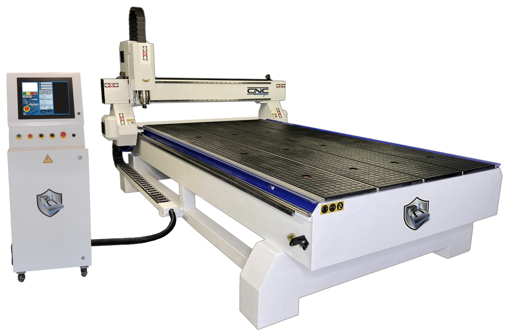
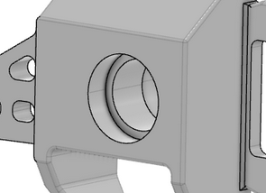



**Niveau :** Intermédiaire
**Prérequis :** Aucun prérequis



## Sommaire

1. Sources
2. Introduction

## Sources

Pour la réalisation de ce cours, je me réfèrerais aux sources listées ci-dessous :

- *LOGICIEL POUR L'USINAGE CNC*, Autodesk. Accessible [ici](https://www.autodesk.fr/solutions/cnc-machining-software).
- *Usinage 5 axes: qu'est-ce que c'est ?*, Weerg. Accessible [ici](https://www.weerg.com/fr/guides/usinage-5-axes-definition).

## Introduction

*CNC machines*, que l'on appelle machine CNC en français, est une machine contrôlée par ordinateur qui va usiner une pièce (en général un bloc de matière appelé **brut**). CNC est l'abréviation de *Computer Numerical Control* , c'est-à-dire commande numérique par ordinateur. Les machines CNC les plus répandues sont les fraiseuses, qui permettent d'usiner la pièce fixée par rotation des outils sur les axes de la machine, ou les tours, qui cette fois font tourner la pièce par rapport aux outils fixés. Les CNC sont en général à 3 axes (et donc travailler la pièce selon 2 plans), mais les plus perfectionnées bénéficient de 4 et 5 axes (avec 2 axes de rotation en plus). En gros, la topologie formée par une 3-axes est un cube, tandis que c'est une sphère par une 5-axes.

Source de l'image : fraiseusecnc.com

Source de l'image : RPWorld.com

L'usinage en CNC permet de jouir d'une grande précision d'usinage, que ce soit en surfaçage ou en alésage. Par exemple, c'est grâce à la CNC que l'on peut usiner convenablement un palier à roulements, surface demandant une très grande précision et admettant une tolérance très faible.


Et le G-code dans tout ça ?
