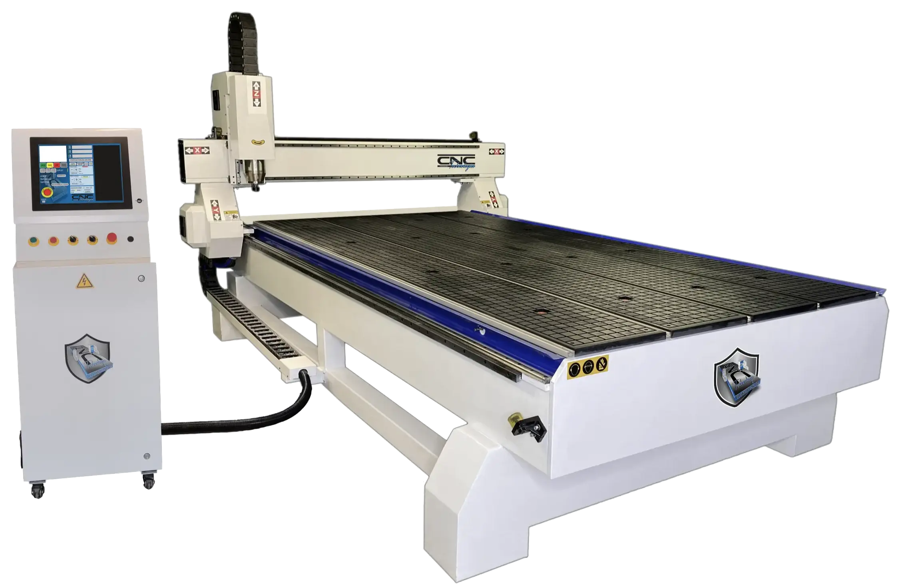
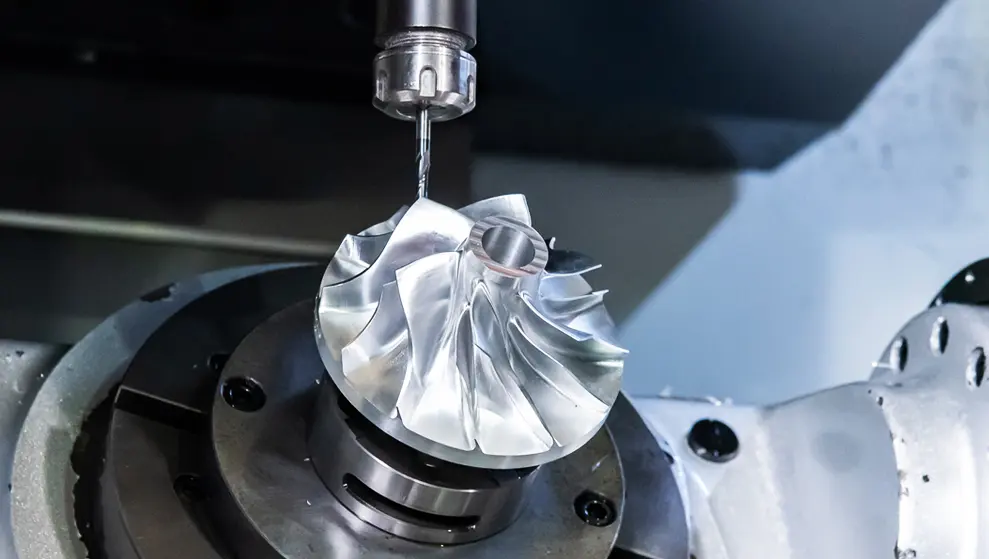
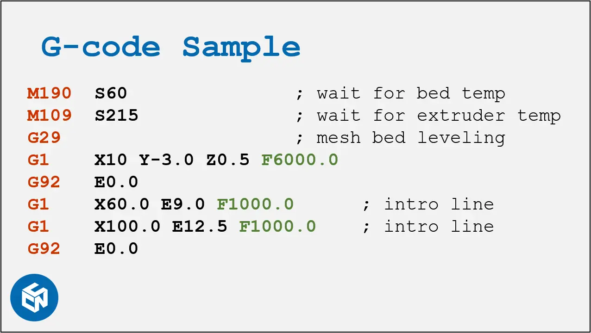
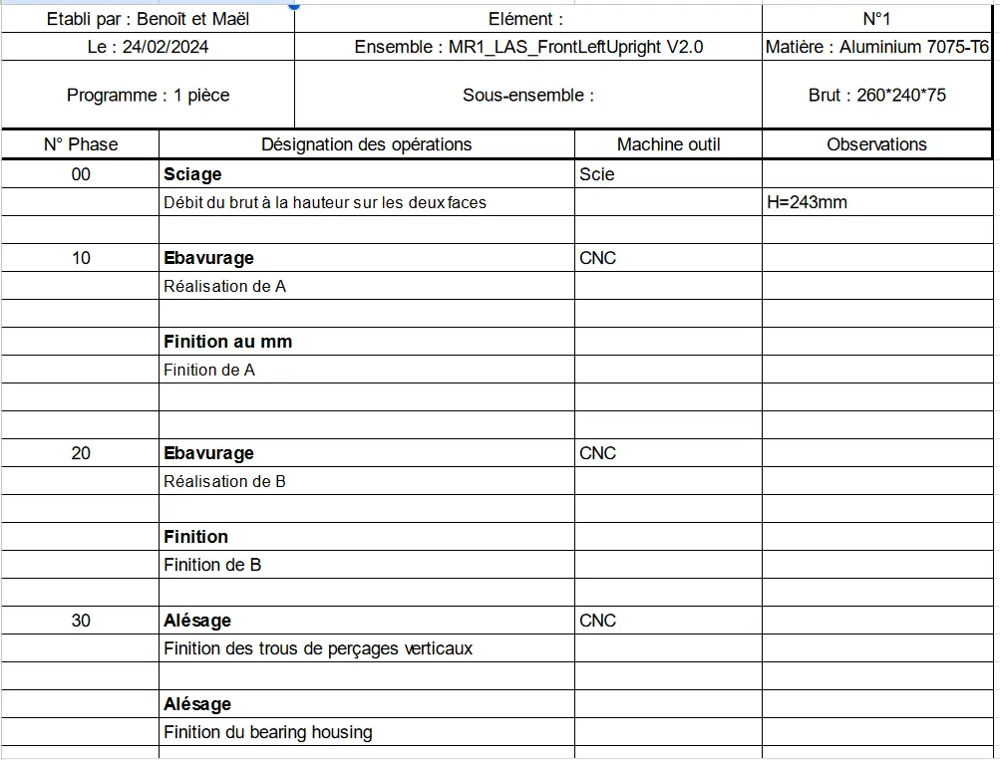
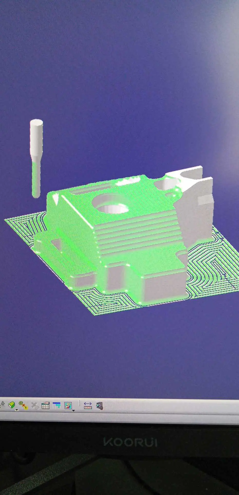



**Niveau :** Intermédiaire
**Prérequis :** Aucun prérequis



## Sommaire

1. Sources
2. Introduction
3. Nomenclature des phases
4. Gamme d'usinage
5. La Fabrication Assistée par Ordinateur

## Sources

Pour la réalisation de ce cours, je me réfèrerais aux sources listées ci-dessous :

- *LOGICIEL POUR L'USINAGE CNC*, Autodesk. Accessible [ici](https://www.autodesk.fr/solutions/cnc-machining-software).
- *Usinage 5 axes: qu'est-ce que c'est ?*, Weerg. Accessible [ici](https://www.weerg.com/fr/guides/usinage-5-axes-definition).
- *G-code/fr*, RepRap. Accessible [ici](https://reprap.org/wiki/G-code/fr).
- *Isostatisme*, Philippe Berger. Accessible [ici](http://philippe.berger2.free.fr/productique/ressources/isostatisme/isostatisme.htm).

## Introduction

*CNC machines*, que l'on appelle machine CNC en français, est une machine contrôlée par ordinateur qui va usiner une pièce (en général un bloc de matière appelé **brut**). CNC est l'abréviation de *Computer Numerical Control* , c'est-à-dire commande numérique par ordinateur. Les machines CNC les plus répandues sont les fraiseuses, qui permettent d'usiner la pièce fixée par rotation des outils sur les axes de la machine, ou les tours, qui cette fois font tourner la pièce par rapport aux outils fixés. Les CNC sont en général à 3 axes (et donc travailler la pièce selon 2 plans), mais les plus perfectionnées bénéficient de 4 et 5 axes (avec 2 axes de rotation en plus). En gros, la topologie formée par une 3-axes est un cube, tandis que c'est une sphère par une 5-axes.

Source de l'image : fraiseusecnc.com

Source de l'image : RPWorld.com

L'usinage en CNC permet de jouir d'une grande précision d'usinage, que ce soit en surfaçage ou en alésage. Par exemple, c'est grâce à la CNC que l'on peut usiner convenablement un palier à roulements, surface demandant une très grande précision et admettant une tolérance très faible.


Et le G-code dans tout ça ?


Le G-code est le langage de transmission des consignes de commmandes à la CNC. Cela traduit les consignes de vitesse d'avance, de vitesse de rotation des outils et les points d'arrêts de la machine. Les différentes consignes sont divisées en séquence d'usinage.

Source de l'image : CNC Kitchen.com

## Nomenclature des phases

Pour remettre les choses dans son contexte, l'usinage CNC est majoritairement utilisé en industrie. Cela permet d'usiner une pièce précise à partir d'un bloc de matière, appelé **brut**, par exemple un bloc d'aluminium. Il est nécessaire de définir en amont les différentes étapes de l'usinage, appelées **phases**. Une phase correspond à l'ensemble des étapes que peut réaliser la machine sans que l'homme intervienne. En effet, l'homme est quand même nécessaire dans l'usinage par ordinateur afin d'effectuer la **MIse en Position (MIP)** et le **MAintien en Position (MAP)** da la pièce en cours d'usinage. Afin que la pièce soit correctement usinée, elle doit être isostatique (6 degrés de libertés dans l'espace restreints) et bien positionnée ; c'est toujours le fruit du travail d'un opérateur.

La **nomenclature des phases** est le document qui recense l'ensemble des phases de l'usinage, ainsi que les outils utilisés.

Exemple de nomenclature des phases :

## Gamme d'usinage

La gamme d'usinage est un document qui recense chaque phase de l'usinage, et pour chaque phase les MIP et MAP nécessaires au bon déroulement.

Exemple d'une gamme d'usinage :

## La Fabrication Assistée par Ordinateur

Actuellement, la création de G-code *ex nihilo* se fait de plus en plus rare. Les ingénieurs fabrication utilisent les outils de Fabrication Assistée par Ordinateur (FAO), tels que les logiciels Delmia (Dassault Système). Ces logiciels permettent de représenter le brut sur l'ordinateur, utiliser un clone numérique de la machine CNC utilisée, simuler les MIP et les MAP, et enfin obtenir la pièce usinée simulée par le logiciel.

J'ai effectué un test sur le logiciel Delmia sur la pièce suivante que j'ai créé moi-même :

Voici un extrait du résultat obtenu avec Delmia :

Le logiciel permet donc de générer le G-code fonctionnel, et de le tester en amont pour s'assurer que le résultat sera celui que l'on souhaite. Il est tout à fait possible d'écrire tout le G-code soit même, cependant ce n'est plus du tout la manière de faire actuelle et avec une fiabilité plus faible.
