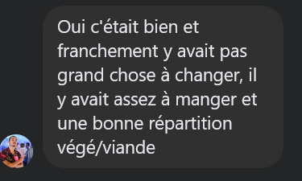



**Niveau :** Très difficile
**Prérequis :** Aucun prérequis



## Sommaire

1. Sources
2. Construction de la To-do

## Sources

Pour la réalisation de ce cours, je me réfèrerais aux sources listées ci-dessous :

- *Organisation du Barbecue de fin d'option Do-IT*, Eugénie Giraud-Telme. Accessible [ici](https://francoisbrucker.github.io/do-it/promos/2022-2023/Giraud-Telme-Eug%C3%A9nie/mon/MON_3_2/).

## Construction de la To-do

De la même manière qu'Eugénie, j'établis ma To-do pour ce MON.

- [X] Lire le MON d'Eugénie
- [X] Demander un Retour d'expérience aux anciens qui ont participé au barbecue de l'année dernière
- [X] estimer le nombre de participants
- [X] obtenir une répartition végé/carné
- [X] faire une liste de courses
- [X] estimer le budget (à la hausse)
- [] demander aux professeurs d'avancer le budget
- [] demander au Bar'bu d'héberger l'événement
- [] demander si le Bar'bu peut prêter le barbecue (si non, voir le réchaud de l'UA avec poële)
- [] obtenir le permis feu auprès du PLP
- [] faire les courses
- [] organiser le remboursement en demandant les sous aux participants
- [] trouver l'équipe pour allumer le barbecue et faire la cuisine
- [] organiser le rangement

### Retour d'expérience sur le barbecue 2023

J'ai eu de très bons retours sur le barbecue 2023 donc je ne changerai pas l'organisation.

### Estimation du nombre de participants
