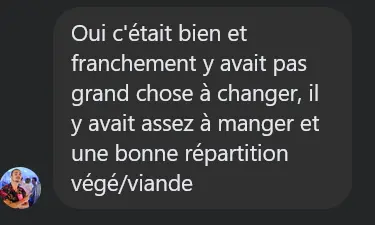
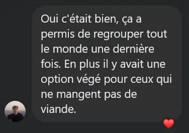
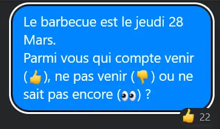
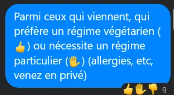
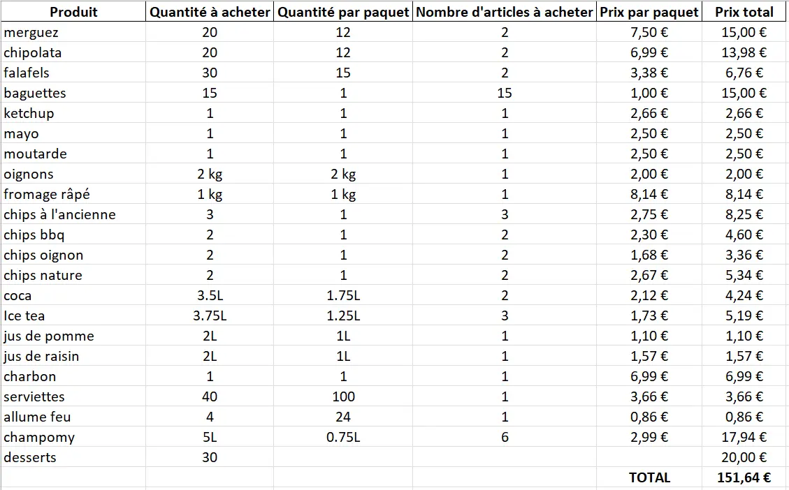
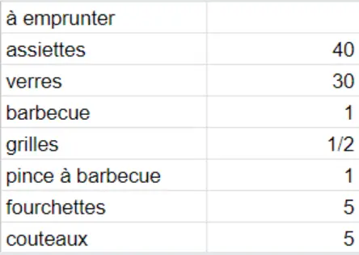
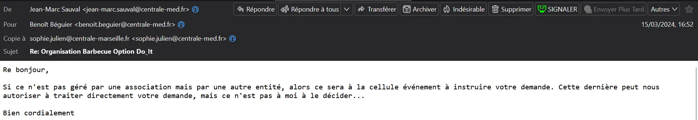



**Niveau :** Très difficile
**Prérequis :** Aucun prérequis



## Sommaire

1. Sources
2. Construction de la To-do

## Sources

Pour la réalisation de ce cours, je me réfèrerais aux sources listées ci-dessous :

- *Organisation du Barbecue de fin d'option Do-IT*, Eugénie Giraud-Telme. Accessible [ici](https://francoisbrucker.github.io/do-it/promos/2022-2023/Giraud-Telme-Eug%C3%A9nie/mon/MON_3_2/).

## Construction de la To-do

De la même manière qu'Eugénie, j'établis ma To-do pour ce MON.

- [X] Lire le MON d'Eugénie
- [X] Demander un Retour d'expérience aux anciens qui ont participé au barbecue de l'année dernière
- [X] estimer le nombre de participants
- [X] obtenir une répartition végé/carné
- [X] faire une liste de courses
- [X] estimer le budget (à la hausse)
- [X] demander aux professeurs d'avancer le budget
- [X] demander au Bar'bu d'héberger l'événement
- [X] demander si le Bar'bu peut prêter le barbecue (si non, voir le réchaud de l'UA avec poële)
- [] obtenir le permis feu auprès du PLP
- [] faire les courses
- [] organiser le remboursement en demandant les sous aux participants
- [X] trouver l'équipe pour allumer le barbecue et faire la cuisine
- [] organiser le rangement

### Retour d'expérience sur le barbecue 2023

J'ai eu de très bons retours sur le barbecue 2023 donc je ne changerai pas l'organisation.

### Estimation du nombre de participants

Au lieu de faire un Google Form, j'ai préféré faire voter sur la conversation Messenger avec l'ensemble des élèves de Do-It. Cela permet de rajouter des options simples et visuelles (vote avec emojis) sans remplir un questionnaire, qui peut être rebutant pour certaines personnes.

Nous avons 22 participants (moi compris) au sein des étudiants de Do-It, auxquels je rajoute les trois professeurs, soit **25 repas** à préparer au total.

Au vu de l'appétit de mes camarades en pleine croissance intellectuelle, je décide de monter les portions à **30 repas**. Dans le cas où il resterait de la nourriture (peu de chances mais probabilité non nulle), celle-ci sera distribuée parmi les étudiants et les professeurs.

### Régimes alimentaires

Je prends ensuite en compte les régimes alimentaires de mes petits camarades ainsi que celui des professeurs. D'après les votes, je prévois au moins 6 portions végétariennes pour les étudiants, et aucune pour les professeurs.

Je table donc pour 10 portions végétariennes, et 20 portions de viandes.

### Liste de course

### Budget

D'après la liste de course, le budget total est de **150€**.
Les professeurs m'avancent la sommme (chacun 50€) ce qui m'évite de l'avancer par moi-même.

Cela revient à 150/25=**6€** par personne.

### Prêt de matériel

Demande au respo patrimoine de l'UA du matériel suivant :

Le matériel est ensuite autorisé à travers le dossier COMA. L'UA fait payer 20€ de frais de prêt, et 1000€ de caution.

## Autorisations

### Autorisation d'événement

Demande au PLP mais finalement ce n'est pas l'interlocuteur. Il faut remplir un dossier COMA de l'UA qui sera étudié en commission événement.

## Remboursement de l'avance

Les remboursements seront organisés par une cagnotte Lydia ou bien sur mon Lydia directement, que je reverserai ensuite aux professeurs.