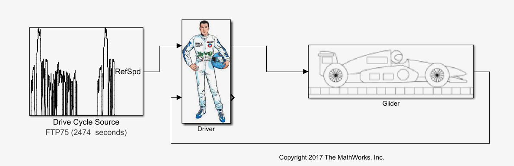
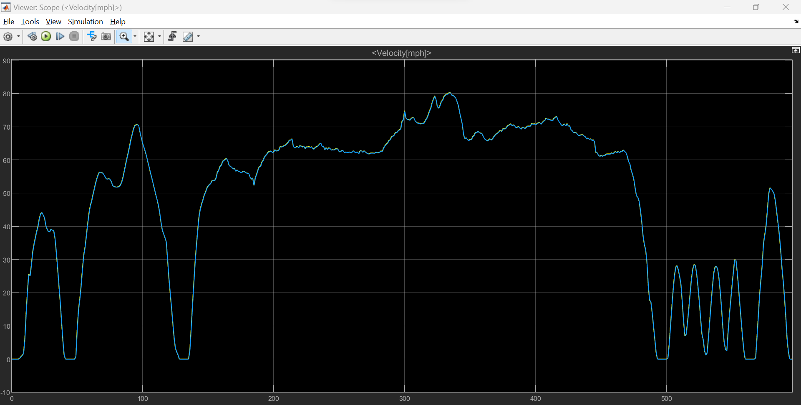
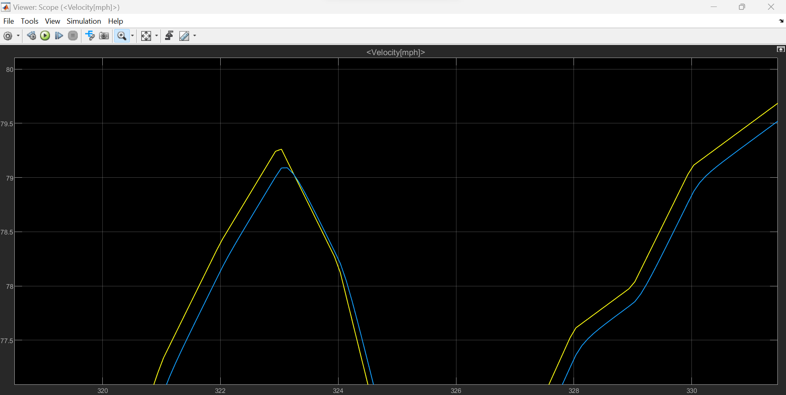
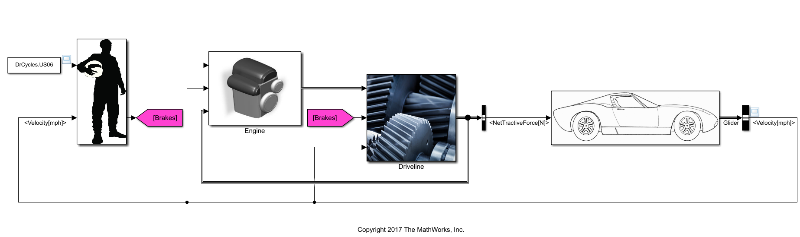
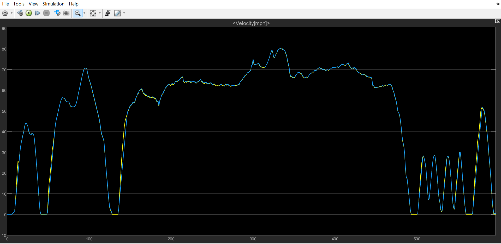
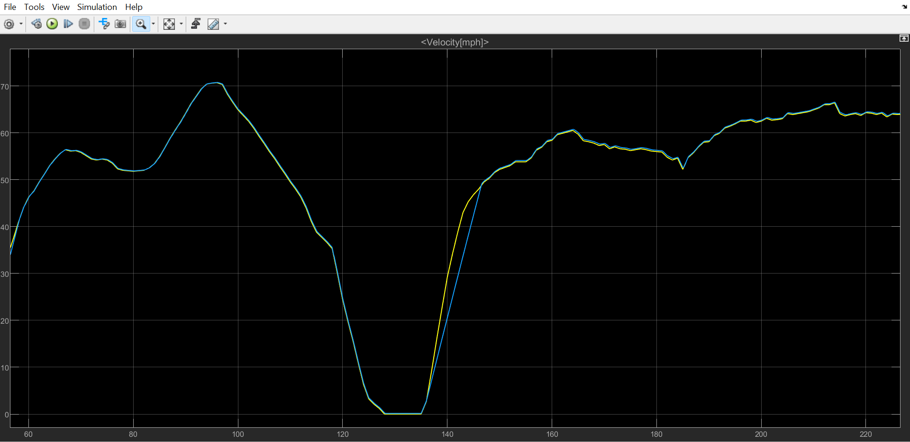
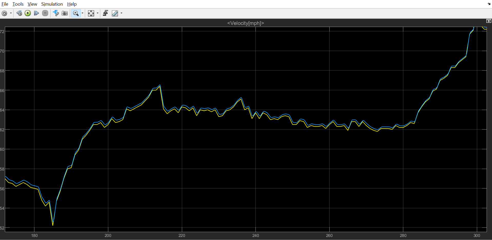
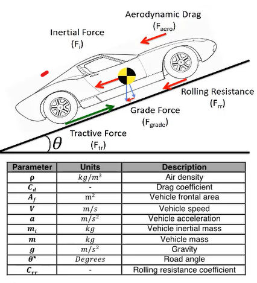
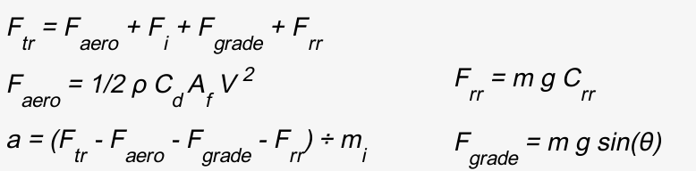


**Niveau :** intermédiaire
**Prérequis :**
- Bases de programmation
- Matlab et Simulink


Pour la réalisation de ce cours, j'aurais plusieurs sources principales : 
- *Race Car Vehicle Dynamics*, de William F. MILLIKEN et Douglas L. MILLIKEN, consulté en pdf.
- *Race Car Design*, de Derek SEWARD, consulté en pdf.
- *MATLAB - Simulink Tutorial for Beginners | Udemy instructor, Dr. Ryan Ahmed*, vidéo Youtube accessible [ici](https://www.youtube.com/watch?v=vxzR3W2BcRk)
- *MATLAB and Simulink Racing Lounge: Vehicle Modeling* accessible [ici](https://fr.mathworks.com/matlabcentral/fileexchange/63823-matlab-and-simulink-racing-lounge-vehicle-modeling).

## Sommaire

1. Objectifs
2. Tâtonnement
3. Première modélisation du comportement dynamique d'une monoplace
4. Etablir les paramètres d'intérêts pour une étude dynamique
5. Nouvelle modélisation

## Objectifs
Voici les objectifs que je me suis donné :
- Documentation et analyse de l'existant (moyen)
- Modélisation dynamique simple du comportement d'une monoplace (moyen)
- Etablir les paramètres d'intérêts pour une étude dynamique (facile)
- Complexifier l'étude avec un paramétrage plus poussé (compliqué, bonus)

## Tâtonnement

Comment s'y prendre ?


A l'heure où je débute ce projet, je ne sais pas encore par quel bout le prendre. Je décide alors de me renseigner sur l'existant de la modélisation de la dynamique d'un véhicule par un point matériel, et ce sur Matlab ou sur un autre logiciel. 
J'ai passé plus de temps que prévu sur la documentation et la recherche. J'ai aussi du regarder une vidéo Youtube de 1 heure pour me remettre à niveau sur Simulink.
J'ai ensuite consulté sans m'attarder les deux documents .pdf, qui donnent les bases dynamiques d'un véhicule. Ceux-ci me permettent d'estimer plus précisément les paramètres importants à prendre en compte.

Je décide de m'orienter vers le package *MATLAB and Simulink Racing Lounge: Vehicle Modeling* accessible [ici](https://fr.mathworks.com/matlabcentral/fileexchange/63823-matlab-and-simulink-racing-lounge-vehicle-modeling). Une fois celui-ci téléchargé, je peux commencer ma modélisation.

## Première modélisation du comportement dynamique d'une monoplace
#### Prise en main de la bibliothèque
J'ai commencé par me mettre à jour sur le contenu de la bibliothèque. Celle-ci étant très fournie, j'effectue alors des petits tests pour visualiser des données simples, telles que l'angle du volant.

J'ai visualisé la vidéo de présentation d'une trentaine de minutes afin de mieux me familiariser avec le package.

#### Réalisation d'une première modélisation

**Objectif  :** Modéliser une monoplace par un point matériel et vérifier la cohérence du modèle

J'ai alors réalisé un premier modèle basé sur une représentation en un seul point de la monoplace. Ce point de masse *m* est soumis à la force de traînée, l'inertie, le poids et la résistance au roulement (Source : Zongxuan Sun, Guoming G. Zhu, *Design and Control of Automotive Propulsion Systems*, e-Book).

Le but de cette modélisation est de soumettre le véhicule à un cycle de vitesse de référence : j'ai ici choisi le cycle classique EPA US06 effectué lors des tests de sécurité sur les prototypes automobiles aux Etats-Unis. 


Vous pourrez trouver plus d'informations sur le cycle EPA US06 [ici](https://www.epa.gov/emission-standards-reference-guide/epa-us06-or-supplemental-federal-test-procedures-sftp)


Pour ma modélisation, le pilote applique une force de traction (opérée par la pédale d'accélérateur) sur le véhicule pour que le véhicule ait la vitesse la plus proche possible de celle exigée par le cycle de référence. Le pilote agit donc comme un correcteur.
Le véhicule est quant à lui modélisé à partir des lois physiques auxquelles il obéit, et que je ne détaillerai pas dans ce POK. Je les ajouter cependant dans l'Annexe en fin de document pour les intéressés.

#### Résultats
Après avoir exécuté la modélisation Simulink, j'obtiens un graphique comparant la vitesse exigée par le cycle et la vitesse réelle de la monoplace. Nous constatons que ces deux courbes sont **très proches** et qu'il faut zoomer pour voir une différence. 

L'écart le plus important que j'ai noté est de 0.2 mph (comprenez *miles per hour*), soit en comparant à la vitesse demandée un **écart de 0.3%**. 

Nous pouvons affirmer que nous respectons ce cycle de conduite, et que la force de traction ainsi que la puissance utilisées pour cette masse sont tout à fait adéquates pour le respecter.

#### Conclusion
Cet écart pourrait paraître négligeable, et la modélisataion jugée suffisante. Cependant, le sport automobile reposant sur l'optimisation permanente, je décide de continuer mon travail et de fournir une modélisation plus poussée. J'espère pouvoir en tirer un modèle plus proche de la réalité, ce qui ne se traduira pas pour autant par un gain de temps ou de vitesse.

## Etablir les paramètres d'intérêts pour une étude dynamique

#### Faiblesses de mon premier modèle
La première modélisation ne prends pas en compte plusieurs paramètres importants :
- Le système de freinage
- L'aérodynamique générale et la carrosserie
- La transmission

#### Liste des paramètres
Les paramètres cruciaux pour une telle simulation sont :
- La vitesse V du véhicule (car la traînée est proportionnelle au carré de V)
- La masse du véhicule
- La résistance au roulement

## Nouvelle modélisation plus approfondie
Je décide cette fois de prendre en compte le système de freinage disponible pour le pilote, et de modéliser directement un sous-bloc moteur et un sous-bloc de transmission.
Les paramètres suivants sont ainsi ajoutés :
- Couple moteur
- Pédale de frein
- Transmission

La transmission est assez simple. Elle doit simplement transmettre le couple du moteur au modèle de point matériel. Elle prend en entrée le couple moteur, la force de freinage provenant de notre sous-système de conduite et la vitesse du véhicule. Les sorties de la chaîne cinématique sont la force de traction que nous envoyons au point matériel et la vitesse du moteur.

La chaîne dans son entièreté est représentée ci-dessous :

#### Résultats
Je décide de lancer la modélisation avec la même "stimulation" en entrée, c'est-à-dire le cycle de vitesse de référence US06. Voici le résultat en sortie du bloc du véhicule :

Dans l'ensemble, la courbe bleue est moins proche de la courbe jaune (ici la référence). Je rajoute un bloc qui permet d'afficher les écarts moyens, j'obtiens en moyenne un écart de **0.4 mph** là ou il représentait 0.05 mph pour le modèle précédent.

Il est aussi utile de s'intéresser aux résultats locaux, c'est-à-dire aux  réponses du véhicule aux singularités de la courbe de référence.

Lors des grandes consignes d'accélération vive, la réponse est très en retard, de lors de **2 secondes**, ce qui se traduit par une différence de vitesse instantanée par rapport à la référence de **10 mph** !

Lors des consignes constantes avec une petite oscillation, on constate un écart de vitesse par rapport à la référence d'environ **0.25 mph**.

#### Conclusion sur le modèle
Il m'est assez difficile de conclure sur la pertinence de mon modèle et sa précision. En rajoutant plus de paramètres, les courbes semblent montrer que le modèle est plus difficilement maniable et adaptable par rapport au cycle de référence. 
Cependant, est-ce uniquement dû aux nouveaux paramètres pris en compte, je ne saurais le dire.

## Simulateur de temps au tour
#### Découverte de OpenLAP-Lap-Time-Simulator

## Annexe
#### Annexe 1
Modélisation physique du problème :

Source : Mathworks.

#### Annexe 2
Voici les équations qui régissent le mouvement de la monoplace dans la partie 3 :

Source : Zongxuan Sun, Guoming G. Zhu, *Design and Control of Automotive Propulsion Systems*, e-Book.

#### Annexe 3
Voici le détail du bloc Monoplace dans la partie 3 :

#### Annexe 4
Voici le détail du bloc Pilote dans la partie 3 :

