
**Niveau :** intermédiaire
**Prérequis :**
- Bases de programmation
- Matlab et Simulink


Pour la réalisation de ce cours, je me réfèrerais aux sources listées ci-dessous : 
- *Race Car Vehicle Dynamics*, de William F. MILLIKEN et Douglas L. MILLIKEN, consulté en pdf.
- *Race Car Design*, de Derek SEWARD, consulté en pdf.
- *MATLAB - Simulink Tutorial for Beginners | Udemy instructor, Dr. Ryan Ahmed*, vidéo Youtube accessible [ici](https://www.youtube.com/watch?v=vxzR3W2BcRk).
- *MATLAB and Simulink Racing Lounge: Vehicle Modeling*, package Matlab accessible [ici](https://fr.mathworks.com/matlabcentral/fileexchange/63823-matlab-and-simulink-racing-lounge-vehicle-modeling).
- *OpenLAP-Lap-Time-Simulator*, package Matlab accessible [ici](https://fr.mathworks.com/matlabcentral/fileexchange/75063-openlap-lap-time-simulator).

## Sommaire

1. Objectifs
2. Tâtonnement
3. Première modélisation du comportement dynamique d'une monoplace
4. Etablir les paramètres d'intérêts pour une étude dynamique
5. Nouvelle modélisation plus approfondie
6. Simulateur de temps au tour
7. Conclusion


## Objectifs
Voici les objectifs que je me suis fixé :
- Documentation personnelle et analyse de l'existant (★★★☆☆)
- Modélisation dynamique simple du comportement d'une monoplace (★★★☆☆)
- Etablir les paramètres d'intérêt pour une étude dynamique (★★☆☆☆)
- Complexifier l'étude avec un paramétrage plus poussé (★★★★☆)
- Simuler des temps aux tours d'une modélisation (★★★☆☆)
- Observer l'impact des paramètres d'intérêt sur le temps au tour (★★★☆☆)

## Tâtonnement

Comment s'y prendre ?



A l'heure où je débute ce projet, je ne sais pas encore par quel bout le prendre. Je décide alors de me renseigner sur l'existant de la modélisation de la dynamique d'un véhicule par un point matériel, et ce sur Matlab ou sur un autre logiciel. 
J'ai passé plus de temps que prévu sur la documentation et la recherche. J'ai aussi du regarder une vidéo Youtube de 1 heure pour me remettre à niveau sur Simulink.
J'ai ensuite consulté sans m'attarder les deux documents .pdf, qui donnent les bases dynamiques d'un véhicule. Ceux-ci me permettent d'estimer plus précisément les paramètres importants à prendre en compte.

Je décide de m'orienter vers le package *MATLAB and Simulink Racing Lounge: Vehicle Modeling* accessible [ici](https://fr.mathworks.com/matlabcentral/fileexchange/63823-matlab-and-simulink-racing-lounge-vehicle-modeling). Une fois celui-ci téléchargé, je peux commencer ma modélisation.


## Première modélisation du comportement dynamique d'une monoplace
#### Prise en main de la bibliothèque
J'ai commencé par me mettre à jour sur le contenu de la bibliothèque. Celle-ci étant très fournie, j'effectue alors des petits tests pour visualiser des données simples, telles que l'angle du volant.


J'ai visualisé la vidéo de présentation d'une trentaine de minutes afin de mieux me familiariser avec le package.

#### Réalisation d'une première modélisation

**Objectif  :** Modéliser une monoplace par un point matériel et vérifier la cohérence du modèle

J'ai alors réalisé un premier modèle basé sur une représentation en un seul point de la monoplace. Ce point de masse *m* est soumis à la force de traînée, l'inertie, le poids et la résistance au roulement (Source : Zongxuan Sun, Guoming G. Zhu, *Design and Control of Automotive Propulsion Systems*, e-Book).

Le but de cette modélisation est de soumettre le véhicule à un cycle de vitesse de référence : j'ai ici choisi le cycle classique EPA US06 effectué lors des tests de sécurité sur les prototypes automobiles aux Etats-Unis. 


Vous pourrez trouver plus d'informations sur le cycle EPA US06 [ici](https://www.epa.gov/emission-standards-reference-guide/epa-us06-or-supplemental-federal-test-procedures-sftp)


Pour ma modélisation, le pilote applique une force de traction (opérée par la pédale d'accélérateur) sur le véhicule pour que le véhicule ait la vitesse la plus proche possible de celle exigée par le cycle de référence. Le pilote agit donc comme un correcteur.
Le véhicule est quant à lui modélisé à partir des lois physiques auxquelles il obéit, et que je ne détaillerai pas dans ce POK. Je les ajouter cependant dans l'Annexe en fin de document pour les intéressés.


#### Résultats
Après avoir exécuté la modélisation Simulink, j'obtiens un graphique comparant la vitesse exigée par le cycle et la vitesse réelle de la monoplace. Nous constatons que ces deux courbes sont **très proches** et qu'il faut zoomer pour voir une différence. 

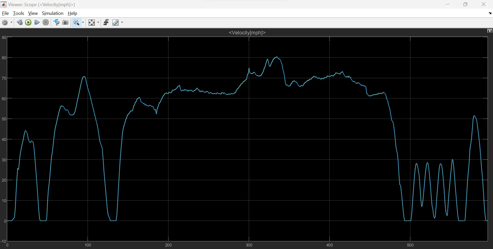

L'écart le plus important que j'ai noté est de 0.2 mph (comprenez *miles per hour*), soit en comparant à la vitesse demandée un **écart de 0.3%**. 

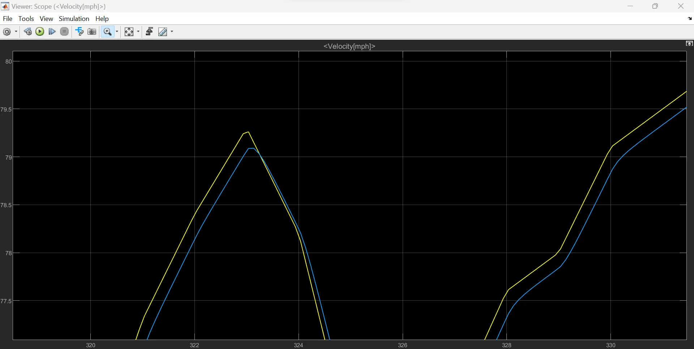

Nous pouvons affirmer que nous respectons ce cycle de conduite, et que la force de traction ainsi que la puissance utilisées pour cette masse sont tout à fait adéquates pour le respecter.

#### Conclusion
Cet écart pourrait paraître négligeable, et la modélisation jugée suffisante. Cependant, le sport automobile reposant sur l'optimisation permanente, je décide de continuer mon travail et de fournir une modélisation plus poussée. J'espère pouvoir en tirer un modèle plus proche de la réalité, ce qui ne se traduira pas pour autant par un gain de temps ou de vitesse.

## Etablir les paramètres d'intérêts pour une étude dynamique

#### Faiblesses de mon premier modèle
La première modélisation ne prends pas en compte plusieurs paramètres importants :
- Le système de freinage
- L'aérodynamique générale et la carrosserie
- La transmission
- La suspension

#### Liste des paramètres d'intérêts
Les paramètres cruciaux pour une telle simulation sont :

- La masse du véhicule
- La résistance au roulement
- Le coefficient de traînée du véhicule


## Nouvelle modélisation plus approfondie
Je décide cette fois de prendre en compte le système de freinage disponible pour le pilote, et de modéliser directement un sous-bloc moteur et un sous-bloc de transmission.
Les paramètres suivants sont ainsi ajoutés :
- Couple moteur
- Pédale de frein
- Transmission

La transmission est assez simple. Elle doit simplement transmettre le couple du moteur au modèle de point matériel. Elle prend en entrée le couple moteur, la force de freinage provenant de notre sous-système de conduite et la vitesse du véhicule. Les sorties de la chaîne cinématique sont la force de traction que nous envoyons au point matériel et la vitesse du moteur.

La chaîne dans son entièreté est représentée ci-dessous :
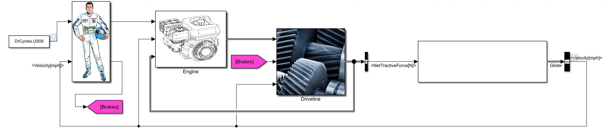

#### Résultats
Je décide de lancer la modélisation avec la même "stimulation" en entrée, c'est-à-dire le cycle de vitesse de référence US06. Voici le résultat en sortie du bloc du véhicule :


Dans l'ensemble, la courbe bleue est moins proche de la courbe jaune (ici la référence). Je rajoute un bloc qui permet d'afficher les écarts moyens, j'obtiens en moyenne un écart de **0.4 mph** là ou il représentait 0.05 mph pour le modèle précédent.

Il est aussi utile de s'intéresser aux résultats locaux, c'est-à-dire aux  réponses du véhicule aux singularités de la courbe de référence.

- Lors des consignes d'accélération vive, la réponse est très en retard, de l'ordre de **2 secondes**, ce qui se traduit par une différence de vitesse instantanée par rapport à la référence de **10 mph** soit environ **16%**!

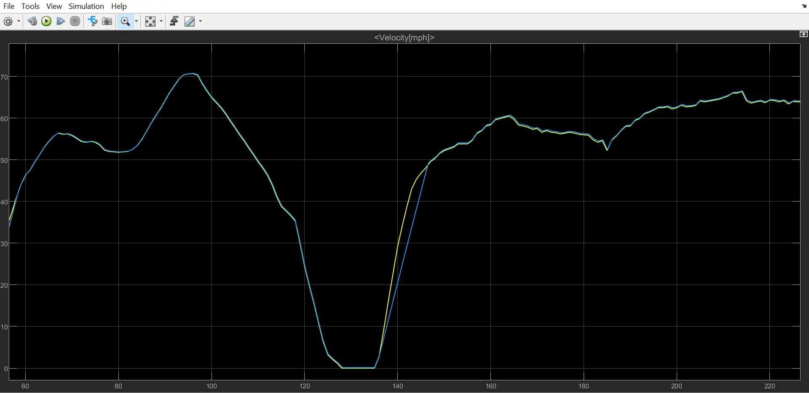

- Lors des consignes constantes avec une petite oscillation, on constate un écart de vitesse par rapport à la référence d'environ **0.25 mph**.

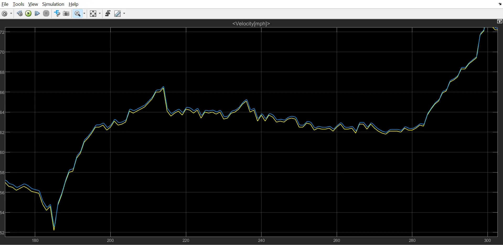

#### Conclusion sur le modèle
Il m'est assez difficile de conclure sur la pertinence de mon modèle et sur sa précision. En rajoutant plus de paramètres, les courbes semblent montrer que le modèle est plus difficilement maniable et adaptable par rapport au cycle de référence. 
Cependant, est-ce uniquement dû aux nouveaux paramètres pris en compte, je ne saurais le dire.

## Simulateur de temps au tour
#### Découverte de OpenLAP-Lap-Time-Simulator
Le package OpenLAP-Lap-Time-Simulator a été créé par Michael CHALKIOPOULOS. Ce package est divisé en 4 fonctions :
- OpenVEHICLE pour **créer un véhicule**
- OpenTRACK pour **créer une piste de course**
- OpenDRAG pour **simuler des courses en ligne droite** du véhicule créé avec OpenVEHICLE, et obtenir des informations sur la traînée
- OpenLAP, pour **simuler des temps au tour**

Je vais donc procéder par l'ordre logique que je viens de décrire afin d'arriver à mes fins.

#### OpenVEHICLE
La première fonction MATLAB prend en argument un fichier Excel à remplir. Celui-ci permet de décrire à MATLAB nos contraintes techniques, telles que la masse du véhicule, le nombre de rapport de la boîte de vitesse, la dimension des disques de frein...

J'ai rempli le fichier à partir des données techniques et du règlement technique 2022 de la Formule 1 (disponible [ici](https://www.fia.com/sites/default/files/2022-2023_season_9_formula_e_techregs_wmsc_07.12.2022_eng_fr_marked_up.pdf)). J'ai néanmoins du faire quelques approximations, notamment sur les rayons des disques de frein ainsi que celui des roues. En effet, la structure du fichier ne permet de rentrer qu'un seul rayon en supposant qu'il est identique pour les quatres roues, cependant celui-ci varie entre l'essieu avant et l'essieu arrière. J'ai à chaque fois indiqué dans le document le rayon le plus petit (celui de l'essieu AR)
J'ai extrait les rapport de boîte en me basant sur ceux provenant de la Redbull RB18 (*[Source](https://answers.ea.com/t5/General-Discussion/Gear-ratios-ERS/m-p/12443280)*).

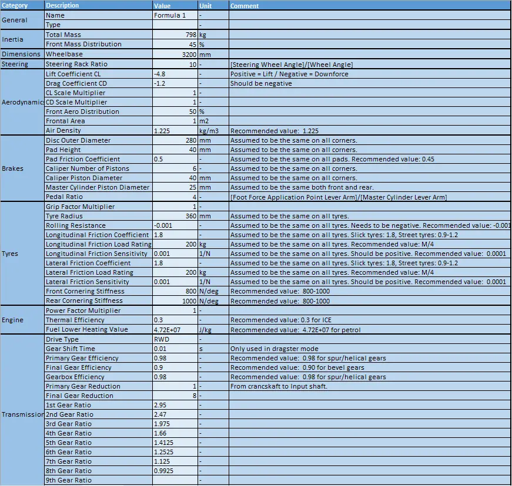
<p style="text-align: center;">Extrait du fichier Excel recensant les paramètres du véhicule à partir du règlement FIA 2022.</p>


<p style="text-align: center;">Détail du couple moteur associé à chaque régime moteur.</p>


J'obtiens la visualisation ci-dessous une fois le programme exécuté :

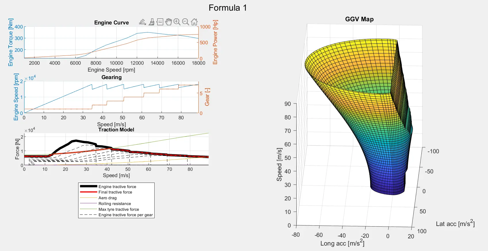

- La courbe **Engine Curve** affiche la puissance (en chevaux, *hp*) et le couple disponibles en fonction du régime moteur. Le couple maximal de 350 N.M est disponible à 13 000 tr/min, tandis que la puissance maximale de 750 hp est disponible à 18 000 tr/min.
Il est nécessaire d'ajouter que les Formule 1 actuelles (y compris celles de 2022 comme notre modélisation) génèrent plus de 1000 hp dans la réalité mais à l'aide d'un système électrique additionnel (ERS, composé de MGU-H et MGU-K, plus d'infos [ici](https://www.info-auto-moto.fr/qu-est-ce-que-ers-en-f1/)).

- La courbe **Gearing** représente le rapport de boîte engagé par rapport à la vitesse de rotation du moteur. Je ne détaillerai pas plus cette section.

- La courbe **Traction Model** montre la force de traction générée par le moteur (en gras noir) par rapport à la force de traction finale (en rouge). La perte de traction est due à la traînée (en orange) et à la résistance au roulement (en violet, difficilement visible sur ce graphique). Cette courbe donne des données cruciales sur les performances que l'on peut attendre de notre véhicule grâce à une modélisation rapide.

- Enfin, le **graphique en 3D** (généralement appelé *enveloppe de performance* ou *GGV Diagram*) représente les accélérations longitudinales et latérales subies par le véhicule en fonction de sa vitesse (en **m/s**). Nous pouvons notamment en déduire la "force g" subie par le pilote lors des freinages ou des accélérations longitudinales.




```
%% OpenLAP Laptime Simulation Project
%
% OpenVEHICLE
%
% Racing vehicle model file creation for use in OpenLAP and OpenDRAG.
% This software is licensed under the GPL V3 Open Source License.
%
% Open Source MATLAB project created by:
%
% Michael Halkiopoulos
% Cranfield University Advanced Motorsport MSc Engineer
% National Technical University of Athens MEng Mechanical Engineer
%
% LinkedIn: https://www.linkedin.com/in/michael-halkiopoulos/
% email: halkiopoulos_michalis@hotmail.com
% MATLAB file exchange: https://uk.mathworks.com/matlabcentral/fileexchange/
% GitHub: https://github.com/mc12027
%
% April 2020.

%% Clearing Memory

clear
clc
close all force
diary('off')
fclose('all') ;

%% Vehicle file selection

filename = 'Formula 1.xlsx' ;

%% Reading vehicle file

info = read_info(filename,'Info') ;
data = read_torque_curve(filename,'Torque Curve') ;

%% Getting variables

% info
name = table2array(info(1,2)) ;
type = table2array(info(2,2)) ;
% index
i = 3 ;
% mass
M = str2double(table2array(info(i,2))) ; i = i+1 ; % [kg]
df = str2double(table2array(info(i,2)))/100 ; i = i+1 ; % [-]
% wheelbase
L = str2double(table2array(info(i,2)))/1000 ; i = i+1 ; % [m]
% steering rack ratio
rack = str2double(table2array(info(i,2))) ; i = i+1 ; % [-]
% aerodynamics
Cl = str2double(table2array(info(i,2))) ; i = i+1 ; % [-]
Cd = str2double(table2array(info(i,2))) ; i = i+1 ; % [-]
factor_Cl = str2double(table2array(info(i,2))) ; i = i+1 ; % [-]
factor_Cd = str2double(table2array(info(i,2))) ; i = i+1 ; % [-]
da = str2double(table2array(info(i,2)))/100 ; i = i+1 ; % [-]
A = str2double(table2array(info(i,2))) ; i = i+1 ; % [m2]
rho = str2double(table2array(info(i,2))) ; i = i+1 ; % [kg/m3]
% brakes
br_disc_d = str2double(table2array(info(i,2)))/1000 ; i = i+1 ; % [m]
br_pad_h = str2double(table2array(info(i,2)))/1000 ; i = i+1 ; % [m]
br_pad_mu = str2double(table2array(info(i,2))) ; i = i+1 ; % [m]
br_nop = str2double(table2array(info(i,2))) ; i = i+1 ; % [m]
br_pist_d = str2double(table2array(info(i,2))) ; i = i+1 ; % [m]
br_mast_d = str2double(table2array(info(i,2))) ; i = i+1 ; % [m]
br_ped_r = str2double(table2array(info(i,2))) ; i = i+1 ; % [m]
% tyres
factor_grip = str2double(table2array(info(i,2))) ; i = i+1 ; % [-]
tyre_radius = str2double(table2array(info(i,2)))/1000 ; i = i+1 ; % [m]
Cr = str2double(table2array(info(i,2))) ; i = i+1 ; % [-]
mu_x = str2double(table2array(info(i,2))) ; i = i+1 ; % [-]
mu_x_M = str2double(table2array(info(i,2))) ; i = i+1 ; % [1/kg]
sens_x = str2double(table2array(info(i,2))) ; i = i+1 ; % [-]
mu_y = str2double(table2array(info(i,2))) ; i = i+1 ; % [-]
mu_y_M = str2double(table2array(info(i,2))) ; i = i+1 ; % [1/kg]
sens_y = str2double(table2array(info(i,2))) ; i = i+1 ; % [-]
CF = str2double(table2array(info(i,2))) ; i = i+1 ; % [N/deg]
CR = str2double(table2array(info(i,2))) ; i = i+1 ; % [N/deg]
% engine
factor_power = str2double(table2array(info(i,2))) ; i = i+1 ;
n_thermal = str2double(table2array(info(i,2))) ; i = i+1 ;
fuel_LHV = str2double(table2array(info(i,2))) ; i = i+1 ; % [J/kg]
% drivetrain
drive = table2array(info(i,2)) ; i = i+1 ;
shift_time = str2double(table2array(info(i,2))) ; i = i+1 ; % [s]
n_primary = str2double(table2array(info(i,2))) ; i = i+1 ;
n_final = str2double(table2array(info(i,2))) ; i = i+1 ;
n_gearbox = str2double(table2array(info(i,2))) ; i = i+1 ;
ratio_primary = str2double(table2array(info(i,2))) ; i = i+1 ;
ratio_final = str2double(table2array(info(i,2))) ; i = i+1 ;
ratio_gearbox = str2double(table2array(info(i:end,2))) ;
nog = length(ratio_gearbox) ;

%% HUD

[folder_status,folder_msg] = mkdir('OpenVEHICLE Vehicles') ;
vehname = "OpenVEHICLE Vehicles/OpenVEHICLE_"+name+"_"+type ;
delete(vehname+".log") ;
diary(vehname+".log") ;
disp([...
    '_______                    ___    ________________  ________________________________';...
    '__  __ \_____________________ |  / /__  ____/__  / / /___  _/_  ____/__  /___  ____/';...
    '_  / / /__  __ \  _ \_  __ \_ | / /__  __/  __  /_/ / __  / _  /    __  / __  __/   ';...
    '/ /_/ /__  /_/ /  __/  / / /_ |/ / _  /___  _  __  / __/ /  / /___  _  /___  /___   ';...
    '\____/ _  .___/\___//_/ /_/_____/  /_____/  /_/ /_/  /___/  \____/  /_____/_____/   ';...
    '       /_/                                                                          '...
    ]) ;
disp('====================================================================================')
disp(filename)
disp('File read successfully')
disp('====================================================================================')
disp("Name: "+name)
disp("Type: "+type)
disp("Date: "+datestr(now,'dd/mm/yyyy'))
disp("Time: "+datestr(now,'HH:MM:SS'))
disp('====================================================================================')
disp('Vehicle generation started.')

%% Brake Model

br_pist_a = br_nop*pi*(br_pist_d/1000)^2/4 ; % [m2]
br_mast_a = pi*(br_mast_d/1000)^2/4 ; % [m2]
beta = tyre_radius/(br_disc_d/2-br_pad_h/2)/br_pist_a/br_pad_mu/4 ; % [Pa/N] per wheel
phi = br_mast_a/br_ped_r*2 ; % [-] for both systems
% HUD
disp('Braking model generated successfully.')

%% Steering Model

a = (1-df)*L ; % distance of front axle from center of mass [mm]
b = -df*L ; % distance of rear axle from center of mass [mm]
C = 2*[CF,CF+CR;CF*a,CF*a+CR*b] ; % steering model matrix
% HUD
disp('Steering model generated successfully.')

%% Driveline Model

% fetching engine curves
en_speed_curve = table2array(data(:,1)) ; % [rpm]
en_torque_curve = table2array(data(:,2)) ; % [N*m]
en_power_curve = en_torque_curve.*en_speed_curve*2*pi/60 ; % [W]
% memory preallocation
% wheel speed per gear for every engine speed value
wheel_speed_gear = zeros(length(en_speed_curve),nog) ;
% vehicle speed per gear for every engine speed value
vehicle_speed_gear = zeros(length(en_speed_curve),nog) ;
% wheel torque per gear for every engine speed value
wheel_torque_gear = zeros(length(en_torque_curve),nog) ;
% calculating values for each gear and engine speed
for i=1:nog
    wheel_speed_gear(:,i) = en_speed_curve/ratio_primary/ratio_gearbox(i)/ratio_final ;
    vehicle_speed_gear(:,i) = wheel_speed_gear(:,i)*2*pi/60*tyre_radius ;
    wheel_torque_gear(:,i) = en_torque_curve*ratio_primary*ratio_gearbox(i)*ratio_final*n_primary*n_gearbox*n_final ;
end
% minimum and maximum vehicle speeds
v_min = min(vehicle_speed_gear,[],'all') ;
v_max = max(vehicle_speed_gear,[],'all') ;
% new speed vector for fine meshing
dv = 0.5/3.6 ;
vehicle_speed = linspace(v_min,v_max,(v_max-v_min)/dv)' ;
% memory preallocation
% gear
gear = zeros(length(vehicle_speed),1) ;
% engine tractive force
fx_engine = zeros(length(vehicle_speed),1) ;
% engine tractive force per gear
fx = zeros(length(vehicle_speed),nog) ;
% optimising gear selection and calculating tractive force
for i=1:length(vehicle_speed)
    % going through the gears
    for j=1:nog
        fx(i,j) = interp1(vehicle_speed_gear(:,j),wheel_torque_gear(:,j)/tyre_radius,vehicle_speed(i),'linear',0) ;
    end
    % getting maximum tractive force and gear
    [fx_engine(i),gear(i)] = max(fx(i,:)) ;
end
% adding values for 0 speed to vectors for interpolation purposes at low speeds
vehicle_speed = [0;vehicle_speed] ;
gear = [gear(1);gear] ;
fx_engine = [fx_engine(1);fx_engine] ;
% final vectors
% engine speed
engine_speed = ratio_final*ratio_gearbox(gear)*ratio_primary.*vehicle_speed/tyre_radius*60/2/pi ;
% wheel torque
wheel_torque = fx_engine*tyre_radius ;
% engine torque
engine_torque = wheel_torque/ratio_final./ratio_gearbox(gear)/ratio_primary/n_primary/n_gearbox/n_final ;
% engine power
engine_power = engine_torque.*engine_speed*2*pi/60 ;
% HUD
disp('Driveline model generated successfully.')

%% Shifting Points and Rev Drops

% finding gear changes
gear_change = diff(gear) ; % gear change will appear as 1
% getting speed right before and after gear change
gear_change = logical([gear_change;0]+[0;gear_change]) ;
% getting engine speed at gear change
engine_speed_gear_change = engine_speed(gear_change) ;
% getting shift points
shift_points = engine_speed_gear_change(1:2:length(engine_speed_gear_change)) ;
% getting arrive points
arrive_points = engine_speed_gear_change(2:2:length(engine_speed_gear_change)) ;
% calculating revdrops
rev_drops = shift_points-arrive_points ;
% creating shifting table
rownames = cell(nog-1,1) ;
for i=1:nog-1
    rownames(i) = {[num2str(i,'%d'),'-',num2str(i+1,'%d')]} ;
end
shifting = table(shift_points,arrive_points,rev_drops,'RowNames',rownames) ;
% HUD
disp('Shift points calculated successfully.')

%% Force model

% gravitational constant
g = 9.81 ;
% drive and aero factors
switch drive
    case 'RWD'
        factor_drive = (1-df) ; % weight distribution
        factor_aero = (1-da) ; % aero distribution
        driven_wheels = 2 ; % number of driven wheels
    case 'FWD'
        factor_drive = df ;
        factor_aero = da ;
        driven_wheels = 2 ;
    otherwise % AWD
        factor_drive = 1 ;
        factor_aero = 1 ;
        driven_wheels = 4 ;
end
% Z axis
fz_mass = -M*g ;
fz_aero = 1/2*rho*factor_Cl*Cl*A*vehicle_speed.^2 ;
fz_total = fz_mass+fz_aero ;
fz_tyre = (factor_drive*fz_mass+factor_aero*fz_aero)/driven_wheels ;
% x axis
fx_aero = 1/2*rho*factor_Cd*Cd*A*vehicle_speed.^2 ;
fx_roll = Cr*abs(fz_total) ;
fx_tyre = driven_wheels*(mu_x+sens_x*(mu_x_M*g-abs(fz_tyre))).*abs(fz_tyre) ;
% HUD
disp('Forces calculated successfully.')

%% GGV Map

% track data
bank = 0 ;
incl = 0 ;
% lateral tyre coefficients
dmy = factor_grip*sens_y ;
muy = factor_grip*mu_y ;
Ny = mu_y_M*g ;
% longitudinal tyre coefficients
dmx = factor_grip*sens_x ;
mux = factor_grip*mu_x ;
Nx = mu_x_M*g ;
% normal load on all wheels
Wz = M*g*cosd(bank)*cosd(incl) ;
% induced weight from banking and inclination
Wy = -M*g*sind(bank) ;
Wx = M*g*sind(incl) ;
% speed map vector
dv = 2 ;
v = (0:dv:v_max)' ;
if v(end)~=v_max
    v = [v;v_max] ;
end
% friction ellipse points
N = 45 ;
% map preallocation
GGV = zeros(length(v),2*N-1,3) ;
for i=1:length(v)
    % aero forces
    Aero_Df = 1/2*rho*factor_Cl*Cl*A*v(i)^2 ;
    Aero_Dr = 1/2*rho*factor_Cd*Cd*A*v(i)^2 ;
    % rolling resistance
    Roll_Dr = Cr*abs(-Aero_Df+Wz) ;
    % normal load on driven wheels
    Wd = (factor_drive*Wz+(-factor_aero*Aero_Df))/driven_wheels ;
    % drag acceleration
    ax_drag = (Aero_Dr+Roll_Dr+Wx)/M ;
    % maximum lat acc available from tyres
    ay_max = 1/M*(muy+dmy*(Ny-(Wz-Aero_Df)/4))*(Wz-Aero_Df) ;
    % max long acc available from tyres
    ax_tyre_max_acc = 1/M*(mux+dmx*(Nx-Wd))*Wd*driven_wheels ;
    % max long acc available from tyres
    ax_tyre_max_dec = -1/M*(mux+dmx*(Nx-(Wz-Aero_Df)/4))*(Wz-Aero_Df) ;
    % getting power limit from engine
    ax_power_limit = 1/M*(interp1(vehicle_speed,factor_power*fx_engine,v(i))) ;
    ax_power_limit = ax_power_limit*ones(N,1) ;
    % lat acc vector
    ay = ay_max*cosd(linspace(0,180,N))' ;
    % long acc vector
    ax_tyre_acc = ax_tyre_max_acc*sqrt(1-(ay/ay_max).^2) ; % friction ellipse
    ax_acc = min(ax_tyre_acc,ax_power_limit)+ax_drag ; % limiting by engine power
    ax_dec = ax_tyre_max_dec*sqrt(1-(ay/ay_max).^2)+ax_drag ; % friction ellipse
    % saving GGV map
    GGV(i,:,1) = [ax_acc',ax_dec(2:end)'] ;
    GGV(i,:,2) = [ay',flipud(ay(2:end))'] ;
    GGV(i,:,3) = v(i)*ones(1,2*N-1) ;
end
% HUD
disp('GGV map generated successfully.')

%% Saving vehicle

% saving
save(vehname+".mat")

%% Plot

% figure
set(0,'units','pixels') ;
SS = get(0,'screensize') ;
H = 900-90 ;
W = 900 ;
Xpos = floor((SS(3)-W)/2) ;
Ypos = floor((SS(4)-H)/2) ;
f = figure('Name','Vehicle Model','Position',[Xpos,Ypos,W,H]) ;
sgtitle(name)

% rows and columns
rows = 4 ;
cols = 2 ;

% engine curves
subplot(rows,cols,1)
hold on
title('Engine Curve')
xlabel('Engine Speed [rpm]')
yyaxis left
plot(en_speed_curve,factor_power*en_torque_curve)
ylabel('Engine Torque [Nm]')
grid on
xlim([en_speed_curve(1),en_speed_curve(end)])
yyaxis right
plot(en_speed_curve,factor_power*en_power_curve/745.7)
ylabel('Engine Power [Hp]')

% gearing
subplot(rows,cols,3)
hold on
title('Gearing')
xlabel('Speed [m/s]')
yyaxis left
plot(vehicle_speed,engine_speed)
ylabel('Engine Speed [rpm]')
grid on
xlim([vehicle_speed(1),vehicle_speed(end)])
yyaxis right
plot(vehicle_speed,gear)
ylabel('Gear [-]')
ylim([gear(1)-1,gear(end)+1])

% traction model
subplot(rows,cols,[5,7])
hold on
title('Traction Model')
plot(vehicle_speed,factor_power*fx_engine,'k','LineWidth',4)
plot(vehicle_speed,min([factor_power*fx_engine';fx_tyre']),'r','LineWidth',2)
plot(vehicle_speed,-fx_aero)
plot(vehicle_speed,-fx_roll)
plot(vehicle_speed,fx_tyre)
for i=1:nog
    plot(vehicle_speed(2:end),fx(:,i),'k--')
end
grid on
xlabel('Speed [m/s]')
ylabel('Force [N]')
xlim([vehicle_speed(1),vehicle_speed(end)])
legend({'Engine tractive force','Final tractive force','Aero drag','Rolling resistance','Max tyre tractive force','Engine tractive force per gear'},'Location','southoutside')

% ggv map
subplot(rows,cols,[2,4,6,8])
hold on
title('GGV Map')
surf(GGV(:,:,2),GGV(:,:,1),GGV(:,:,3))
grid on
xlabel('Lat acc [m/s^2]')
ylabel('Long acc [m/s^2]')
zlabel('Speed [m/s]')
% xlim([-ay_max,ay_max])
% ylim([min(GGV(:,:,1),[],'all'),max(GGV(:,:,1),[],'all')])
view(105,5)
set(gca,'DataAspectRatio',[1 1 0.8])
% cbar = colorbar ;
% set(get(cbar,'Title'),'String','Speed [m/s]')

% saving figure
savefig(vehname+".fig")
% HUD
disp('Plots created and saved.')

%% HUD

% HUD
disp('Vehicle generated successfully.')
% diary
diary('off') ;

%% Functions

%%%%%%%%%%%%%%%%%%%%%%%%%%%%%%%%%%%%%%%%%%%%%%%%%%%%%%%%%%%%%%%%%%%%%%%%%%%
function [data] = read_torque_curve(workbookFile,sheetName,startRow,endRow)
    % Input handling
    % If no sheet is specified, read first sheet
    if nargin == 1 || isempty(sheetName)
        sheetName = 1;
    end
    % If row start and end points are not specified, define defaults
    if nargin <= 3
        startRow = 2;
        endRow = 10000;
    end
    % Setup the Import Options
    opts = spreadsheetImportOptions("NumVariables", 2);
    % Specify sheet and range
    opts.Sheet = sheetName;
    opts.DataRange = "A" + startRow(1) + ":B" + endRow(1);
    % Specify column names and types
    opts.VariableNames = ["Engine_Speed_rpm", "Torque_Nm"];
    opts.VariableTypes = ["double", "double"];
    % Setup rules for import
    opts.MissingRule = "omitrow";
    opts = setvaropts(opts, [1, 2], "TreatAsMissing", '');
    % Import the data
    data = readtable(workbookFile, opts, "UseExcel", false);
    for idx = 2:length(startRow)
        opts.DataRange = "A" + startRow(idx) + ":B" + endRow(idx);
        tb = readtable(workbookFile, opts, "UseExcel", false);
        data = [data; tb]; %#ok<AGROW>
    end
end

%%%%%%%%%%%%%%%%%%%%%%%%%%%%%%%%%%%%%%%%%%%%%%%%%%%%%%%%%%%%%%%%%%%%%%%%%%%
function [data] = read_info(workbookFile,sheetName,startRow,endRow)
    % Input handling
    % If no sheet is specified, read first sheet
    if nargin == 1 || isempty(sheetName)
        sheetName = 1;
    end
    % If row start and end points are not specified, define defaults
    if nargin <= 3
        startRow = 2;
        endRow = 10000;
    end
    % Setup the Import Options
    opts = spreadsheetImportOptions("NumVariables", 2);
    % Specify sheet and range
    opts.Sheet = sheetName;
    opts.DataRange = "B" + startRow(1) + ":C" + endRow(1);
    % Specify column names and types
    opts.VariableNames = ["Variable", "Value"];
    opts.VariableTypes = ["string", "string"];
    % Setup rules for import
    opts.MissingRule = "omitrow";
    opts = setvaropts(opts, [1, 2], "TreatAsMissing", '');
    % Import the data
    data = readtable(workbookFile, opts, "UseExcel", false);
    for idx = 2:length(startRow)
        opts.DataRange = "A" + startRow(idx) + ":B" + endRow(idx);
        tb = readtable(workbookFile, opts, "UseExcel", false);
        data = [data; tb]; %#ok<AGROW>
    end
end
```



#### OpenTRACK
De la même manière, OpenTRACK fonctionne en prenant en argument un fichier Excel contenant les informations de piste comme la distance, l'inclinaison de la piste, les virages, etc. Il est aussi possible de générer ses propres circuits. J'ai pour ma part choisi de représenter mon circuit favori, le circuit de Spa-Francorchamps (situé à Francorchamps, Belgique). Le fichier ressemble à ça :
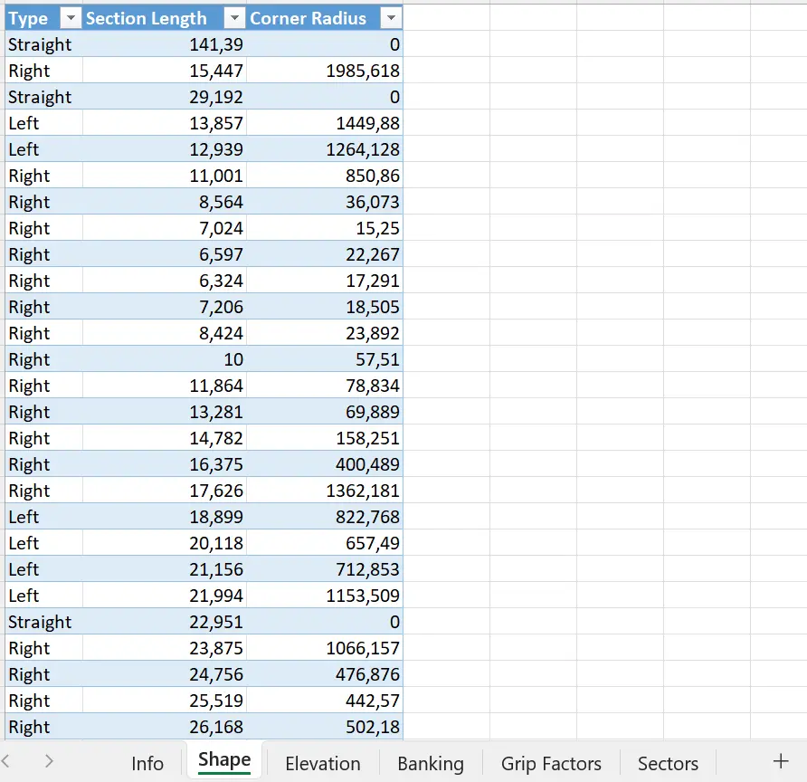

Une fois le code exécuté, on obtient alors une visualisation de la carte de la piste :

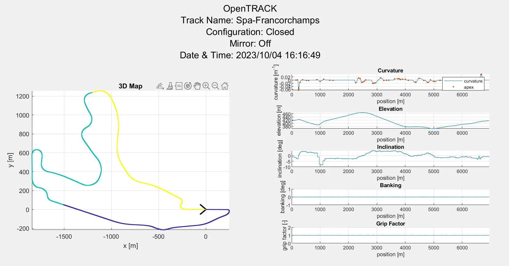

Nous pouvons observer les trois secteurs (respectivement en violet, bleu et jaune). A droite, le programme trace le graphe des courbures du circuit (c'est-à-dire le rayon des virages), l'altitude et l'inclinaison (par rapport au Nord) selon le kilométrage. 
Nous ne nous intéresserons pas au banking et facteur d'adhérence dans ce POK. 



```
%% OpenLAP Laptime Simulation Project
%
% OpenTRACK
%
% Track model file creation for use in OpenLAP.
%
% This software is licensed under the GPL V3 Open Source License.
%
% Open Source MATLAB project created by:
%
% Michael Halkiopoulos
% Cranfield University Advanced Motorsport MSc Engineer
% National Technical University of Athens MEng Mechanical Engineer
%
% LinkedIn: https://www.linkedin.com/in/michael-halkiopoulos/
% email: halkiopoulos_michalis@hotmail.com
% MATLAB file exchange: https://uk.mathworks.com/matlabcentral/fileexchange/
% GitHub: https://github.com/mc12027
%
% April 2020.

%% Clearing memory

clear
clc
close all force
diary('off')
fclose('all') ;

%% Track file selection

filename = 'Spa-Francorchamps.xlsx' ;


%% Mode selection

% mode = 'logged data' ;
mode = 'shape data' ;
% log_mode = 'speed & yaw' ;
log_mode = 'speed & latacc' ;

%% Settings

% meshing
mesh_size = 1 ; % [m]
% filtering for logged data mode
filter_dt = 0.1 ; % [s]
% track map rotation angle
rotation = 0 ; % [deg]
% track map shape adjuster
lambda = 1 ; % [-]
% long corner adjuster
kappa = 1000 ; % [deg]

%% Reading file

% HUD
disp(['Reading track file: ',filename])
if strcmp(mode,'logged data')
    
    %% from logged data
    
    [head,data] = read_logged_data(filename) ;
    info.name = head(2,2) ;
    info.country = head(3,2) ;
    info.city = head(4,2) ;
    info.type = head(5,2) ;
    info.config = head(6,2) ;
    info.direction = head(7,2) ;
    info.mirror = head(8,2) ;
    % channels
    channels = head(11,:) ;
    units = head(12,:) ;
    % frequency
    freq = str2double(head(9,2)) ;
    % data columns
    col_dist = 1 ;
    col_vel = 2 ;
    col_yaw = 3 ;
    col_ay = 4 ;
    col_el = 5 ;
    col_bk = 6 ;
    col_gf = 7 ;
    col_sc = 8 ;
    % extracting data
    x = data(:,col_dist) ;
    v = data(:,col_vel) ;
    w = data(:,col_yaw) ;
    ay = data(:,col_ay) ;
    el = data(:,col_el) ;
    bk = data(:,col_bk) ;
    gf = data(:,col_gf) ;
    sc = data(:,col_sc) ;
    % converting units
    if units(col_dist)~="m"
        switch units(col_dist) % target is [m]
            case 'km'
                x = x*1000 ;
            case 'miles'
                x = x*1609.34 ;
            case 'ft'
                x = x*0.3048 ;
            otherwise
                warning('Check distance units.')
        end
    end
    if units(col_vel)~="m/s"
        switch units(col_vel) % target is [m/s]
            case 'km/h'
                v = v/3.6 ;
            case 'mph'
                v = v*0.44704 ;
            otherwise
                warning('Check speed units.')
        end
    end
    if units(col_yaw)~="rad/s"
        switch units(col_yaw) % target is [rad/s]
            case 'deg/s'
                w = w*2*pi/360 ;
            case 'rpm'
                w = w*2*pi/60 ;
            case 'rps'
                w = w*2*pi ;
            otherwise
                warning('Check yaw velocity units.')
        end
    end
    if units(col_ay)~="m/s/s"
        switch units(col_ay) % target is [m/s2]
            case 'G'
                ay = ay*9.81 ;
            case 'ft/s/s'
                ay = ay*0.3048 ;
            otherwise
                warning('Check lateral acceleration units.')
        end
    end
    if units(col_el)~="m"
        switch units(col_el) % target is [m]
            case 'km'
                el = el*1000 ;
            case 'miles'
                el = el*1609.34 ;
            case 'ft'
                el = el*0.3048 ;
            otherwise
                warning('Check elevation units.')
        end
    end
    if units(col_bk)~="deg"
        switch units(col_bk) % target is [m]
            case 'rad'
                bk = bk/2/pi*360 ;
            otherwise
                warning('Check banking units.')
        end
    end
else
    %% from shape data
    

    [info] = read_info(filename,'info') ;
    table_shape = read_shape_data(filename,'Shape') ;
    table_el = read_data(filename,'Elevation') ;
    table_bk = read_data(filename,'Banking') ;
    table_gf = read_data(filename,'Grip Factors') ;
    table_sc = read_data(filename,'Sectors') ;
    
end

%% Track model name

[folder_status,folder_msg] = mkdir('OpenTRACK Tracks') ;
trackname = "OpenTRACK Tracks/OpenTRACK_"+info.name+"_"+info.config+"_"+info.direction ;
if strcmp(info.mirror,"On")
    trackname = trackname+"_Mirrored" ;
end

%% HUD

delete(trackname+".log") ;
diary(trackname+".log") ;
disp([...
    '_______                    ____________________________________ __';...
    '__  __ \______________________  __/__  __ \__    |_  ____/__  //_/';...
    '_  / / /__  __ \  _ \_  __ \_  /  __  /_/ /_  /| |  /    __  ,<   ';...
    '/ /_/ /__  /_/ /  __/  / / /  /   _  _, _/_  ___ / /___  _  /| |  ';...
    '\____/ _  .___/\___//_/ /_//_/    /_/ |_| /_/  |_\____/  /_/ |_|  ';...
    '       /_/                                                        '...
    ]) ;
disp('==================================================================')
disp(filename)
disp('File read successfully')
disp('==================================================================')
disp("Name:          "+info.name)
disp("City:          "+info.city)
disp("Country:       "+info.country)
disp("Type:          "+info.type)
disp("Configuration: "+info.config)
disp("Direction:     "+info.direction)
disp("Mirror:        "+info.mirror)
disp("Date:          "+datestr(now,'dd/mm/yyyy'))
disp("Time:          "+datestr(now,'HH:MM:SS'))
disp('==================================================================')
disp('Track generation started.')

%% Pre-processing

if strcmp(mode,'logged data') % logged data
    % getting unique points
    [x,rows_to_keep,~] = unique(x) ;
    v = smooth(v(rows_to_keep),round(freq*filter_dt)) ;
    w = smooth(w(rows_to_keep),round(freq*filter_dt)) ;
    ay = smooth(ay(rows_to_keep),round(freq*filter_dt)) ;
    el = smooth(el(rows_to_keep),round(freq*filter_dt)) ;
    bk = smooth(bk(rows_to_keep),round(freq*filter_dt)) ;
    gf = gf(rows_to_keep) ;
    sc = sc(rows_to_keep) ;
    % shifting position vector for 0 value at start
    x = x-x(1) ;
    % curvature
    switch log_mode
        case 'speed & yaw'
            r = lambda*w./v ;
        case 'speed & latacc'
            r = lambda*ay./v.^2 ;
    end
    r = smooth(r,round(freq*filter_dt)) ;
    % mirroring if needed
    if strcmp(info.mirror,'On')
        r = -r ;
    end
    % track length
    L = x(end) ;
    % saving coarse position vectors
    xx = x ;
    xe = x ;
    xb = x ;
    xg = x ;
    xs = x ;
else % shape data
    % turning radius
    R = table2array(table_shape(:,3)) ;
    % segment length
    l = table2array(table_shape(:,2)) ;
    % segment type
    type_tmp = table2array(table_shape(:,1)) ;
    % correcting straight segment radius
    R(R==0) = inf ;
    % total length
    L = sum(l) ;
    % segment type variable conversion to number
    type = zeros(length(l),1) ;
    type(string(type_tmp)=="Straight") = 0 ;
    type(string(type_tmp)=="Left") = 1 ;
    type(string(type_tmp)=="Right") = -1 ;
    if strcmp(info.mirror,'On')
        type = -type ;
    end
    % removing segments with zero length
    R(l==0) = [] ;
    type(l==0) = [] ;
    l(l==0) = [] ;
    % injecting points at long corners
    angle_seg = rad2deg(l./R) ;
    j = 1 ; % index
    RR = R ; % new vector containing injected points
    ll = l ; % new vector containing injected points
    tt = type ; % new vector containing injected points
    for i=1:length(l)
        if angle_seg(i)>kappa
            l_inj = min([ll(j)/3,deg2rad(kappa)*R(i)]) ;
            ll = [...
                ll(1:j-1);...
                l_inj;...
                ll(j)-2*l_inj;...
                l_inj;...
                ll(j+1:end)...
                ] ;
            RR = [...
                RR(1:j-1);...
                RR(j);...
                RR(j);...
                RR(j);...
                RR(j+1:end)...
                ] ;
            tt = [...
                tt(1:j-1);...
                tt(j);...
                tt(j);...
                tt(j);...
                tt(j+1:end)...
                ] ;
            j = j+3 ;
        else
            j = j+1 ;
        end
    end
    R = RR ;
    l = ll ;
    type = tt ;
    % replacing consecutive straights
    for i=1:length(l)-1
        j = 1 ;
        while true
            if type(i+j)==0 && type(i)==0 && l(i)~=-1
                l(i) = l(i)+l(i+j) ;
                l(i+j) = -1 ;
            else
                break
            end
            j = j+1 ;
        end
    end
    R(l==-1) = [] ;
    type(l==-1) = [] ;
    l(l==-1) = [] ;
    % final segment point calculation
    X = cumsum(l) ; % end position of each segment
    XC = cumsum(l)-l/2 ; % center position of each segment
    j = 1 ; % index
    x = zeros(length(X)+sum(R==inf),1) ; % preallocation
    r = zeros(length(X)+sum(R==inf),1) ; % preallocation
    for i=1:length(X)
        if R(i)==inf % end of straight point injection
            x(j) = X(i)-l(i) ;
            x(j+1) = X(i) ;
            j = j+2 ;
        else % circular segment center
            x(j) = XC(i) ;
            r(j) = type(i)./R(i) ;
            j = j+1 ;
        end
    end
    % getting data from tables and ignoring points with x>L
    el = table2array(table_el) ;
    el(el(:,1)>L,:) = [] ;
    bk = table2array(table_bk) ;
    bk(bk(:,1)>L,:) = [] ;
    gf = table2array(table_gf) ;
    gf(gf(:,1)>L,:) = [] ;
    sc = table2array(table_sc) ;
    sc(sc(:,1)>=L,:) = [] ;
    sc = [sc;[L,sc(end,end)]] ;
    % saving coarse position vectors
    xx = x ;
    xe = el(:,1) ;
    xb = bk(:,1) ;
    xg = gf(:,1) ;
    xs = sc(:,1) ;
    % saving coarse topology
    el = el(:,2) ;
    bk = bk(:,2) ;
    gf = gf(:,2) ;
    sc = sc(:,2) ;
end
% HUD
disp('Pre-processing completed.')

%% Meshing

% new fine position vector
if floor(L)<L % check for injecting last point
    x = [(0:mesh_size:floor(L))';L] ;
else
    x = (0:mesh_size:floor(L))' ;
end
% distance step vector
dx = diff(x) ;
dx = [dx;dx(end)] ;
% number of mesh points
n = length(x) ;
% fine curvature vector
r = interp1(xx,r,x,'pchip','extrap') ;
% elevation
Z = interp1(xe,el,x,'linear','extrap') ;
% banking
bank = interp1(xb,bk,x,'linear','extrap') ;
% inclination
incl = -atand((diff(Z)./diff(x))) ;
incl = [incl;incl(end)] ;
% grip factor
factor_grip = interp1(xg,gf,x,'linear','extrap') ;
% sector
sector = interp1(xs,sc,x,'previous','extrap') ;
% HUD
disp("Fine meshing completed with mesh size: "+num2str(mesh_size)+" [m]")

%% Map generation

% coordinate vector preallocation
X = zeros(n,1) ;
Y = zeros(n,1) ;
% segment angles
angle_seg = rad2deg(dx.*r) ;
% heading angles
angle_head = cumsum(angle_seg) ;
if strcmp(info.config,'Closed') % tangency correction for closed track
    dh = [...
        mod(angle_head(end),sign(angle_head(end))*360);...
        angle_head(end)-sign(angle_head(end))*360....
        ] ;
    [~,idx] = min(abs(dh)) ;
    dh = dh(idx) ;
    angle_head = angle_head-x/L*dh ;
    angle_seg = [angle_head(1);diff(angle_head)] ;
end
angle_head = angle_head-angle_head(1) ;
% map generation
for i=2:n
    % previous point
    p = [X(i-1);Y(i-1);0] ;
    % next point
    xyz = rotz(angle_head(i-1))*[dx(i-1);0;0]+p ;
    % saving point coordinates of next point
    X(i) = xyz(1) ;
    Y(i) = xyz(2) ;
end

%% Apexes

% finding Apexes
[~,apex] = findpeaks(abs(r)) ;
% correcting corner type
r_apex = r(apex) ;
% HUD
disp('Apex calculation completed.')

%% Map edit

% track direction
if strcmp(info.direction,'Backward')
    x = x(end)-flipud(x) ;
    r = -flipud(r) ;
    apex = length(x)-flipud(apex) ;
    r_apex = -flipud(r_apex) ;
    incl = -flipud(incl) ;
    bank = -flipud(bank) ;
    factor_frip = flipud(factor_grip) ;
    sector = flipud(sector) ;
    X = flipud(X) ;
    Y = flipud(Y) ;
    Z = flipud(Z) ;
end

% track rotation
% rotating track map
xyz = rotz(rotation)*[X';Y';Z'] ;
X = xyz(1,:)' ;
Y = xyz(2,:)' ;
Z = xyz(3,:)' ;
% HUD
disp('Track rotated.')

% closing map if necessary
if strcmp(info.config,'Closed') % closed track
    % HUD
    disp('Closing fine mesh map.')
    % linear correction vectors
    DX = x/L*(X(1)-X(end)) ;
    DY = x/L*(Y(1)-Y(end)) ;
    DZ = x/L*(Z(1)-Z(end)) ;
    db = x/L*(bank(1)-bank(end)) ;
    % adding correction
    X = X+DX ;
    Y = Y+DY ;
    Z = Z+DZ ;
    bank = bank+db ;
    % recalculating inclination
    incl = -atand((diff(Z)./diff(x))) ;
    incl = [incl;(incl(end-1)+incl(1))/2] ;
    % HUD
    disp('Fine mesh map closed.')
end
% smoothing track inclination
incl = smooth(incl) ;
% HUD
disp('Fine mesh map created.')

%% Plotting Results

% finish line arrow
% settings
factor_scale = 25 ;
half_angle = 40 ;
% scaling
scale = max([max(X)-min(X);max(Y)-min(Y)])/factor_scale ;
% nondimentional vector from point 2 to point 1
arrow_n = [X(1)-X(2);Y(1)-Y(2);Z(1)-Z(2)]/norm([X(1)-X(2);Y(1)-Y(2);Z(1)-Z(2)]) ;
% first arrow point
arrow_1 = scale*rotz(half_angle)*arrow_n+[X(1);Y(1);Z(1)] ;
% mid arrow point
arrow_c = [X(1);Y(1);Z(1)] ;
% second arrow point
arrow_2 = scale*rotz(-half_angle)*arrow_n+[X(1);Y(1);Z(1)] ;
% arrow vector components
arrow_x = [arrow_1(1);arrow_c(1);arrow_2(1)] ;
arrow_y = [arrow_1(2);arrow_c(2);arrow_2(2)] ;
arrow_z = [arrow_1(3);arrow_c(3);arrow_2(3)] ;
% final arrow matrix
arrow = [arrow_x,arrow_y,arrow_z] ;

% figure
set(0,'units','pixels') ;
SS = get(0,'screensize') ;
H = 900-90 ;
W = 900 ;
Xpos = floor((SS(3)-W)/2) ;
Ypos = floor((SS(4)-H)/2) ;
f = figure('Name',filename,'Position',[Xpos,Ypos,W,H]) ;
figtitle = ["OpenTRACK","Track Name: "+info.name,"Configuration: "+info.config,"Mirror: "+info.mirror,"Date & Time: "+datestr(now,'yyyy/mm/dd')+" "+datestr(now,'HH:MM:SS')] ;
figtitle = strrep(figtitle,"_"," ") ;
sgtitle(figtitle)

% rows and columns
rows = 5 ;
cols = 2 ;

% 3d map
subplot(rows,cols,[1,3,5,7,9])
title('3D Map')
hold on
grid on
axis equal
axis tight
xlabel('x [m]')
ylabel('y [m]')
scatter3(X,Y,Z,20,sector,'.')
plot3(arrow_x,arrow_y,arrow_z,'k','LineWidth',2)

% curvature
subplot(rows,cols,2)
title('Curvature')
hold on
grid on
xlabel('position [m]')
ylabel('curvature [m^-^1]')
plot(x,r)
scatter(x(apex),r_apex,'.')
xlim([x(1),x(end)])
legend({'curvature','apex'})

% elevation
subplot(rows,cols,4)
title('Elevation')
hold on
grid on
xlabel('position [m]')
ylabel('elevation [m]')
plot(x,Z)
xlim([x(1),x(end)])

% inclination
subplot(rows,cols,6)
title('Inclination')
hold on
grid on
xlabel('position [m]')
ylabel('inclination [deg]')
plot(x,incl)
xlim([x(1),x(end)])

% banking
subplot(rows,cols,8)
title('Banking')
hold on
grid on
xlabel('position [m]')
ylabel('banking [deg]')
plot(x,bank)
xlim([x(1),x(end)])

% grip factors
subplot(rows,cols,10)
title('Grip Factor')
hold on
grid on
xlabel('position [m]')
ylabel('grip factor [-]')
plot(x,factor_grip)
xlim([x(1),x(end)])

% saving plot
savefig(f,trackname+".fig")
% HUD
disp('Plots created and saved.')

%% Saving circuit

% saving
save(trackname+".mat",'info','x','dx','n','r','bank','incl','factor_grip','sector','r_apex','apex','X','Y','Z','arrow')
% HUD
disp('Track generated successfully.')

%% ASCII map

charh = 15 ; % font height [pixels]
charw = 8 ; % font width [pixels]
linew = 66 ; % log file character width
mapw = max(X)-min(X) ; % map width
YY = round(Y/(charh/charw)/mapw*linew) ; % scales y values
XX = round(X/mapw*linew) ; % scales x values
YY = -YY-min(-YY) ; % flipping y and shifting to positive space
XX = XX-min(XX) ; % shifting x to positive space
p = unique([XX,YY],'rows') ; % getting unique points
XX = p(:,1)+1 ; % saving x
YY = p(:,2)+1 ; % saving y
maph = max(YY) ; % getting new map height [lines]
mapw = max(XX) ; % getting new map width [columns]
map = char(maph,mapw) ; % character map preallocation
% looping through characters
for i=1:maph
    for j=1:mapw
        check = [XX,YY]==[j,i] ; % checking if pixel is on
        check = check(:,1).*check(:,2) ; % combining truth table
        if max(check)
            map(i,j) = 'o' ; % pixel is on
        else
            map(i,j) = ' ' ; % pixel is off
        end
    end
end
disp('Map:')
disp(map)

% diary
diary('off') ;

%% Functions

%%%%%%%%%%%%%%%%%%%%%%%%%%%%%%%%%%%%%%%%%%%%%%%%%%%%%%%%%%%%%%%%%%%%%%%%%%%
function [info] = read_info(workbookFile,sheetName,startRow,endRow)
    % Input handling
    % If no sheet is specified, read first sheet
    if nargin == 1 || isempty(sheetName)
        sheetName = 1;
    end
    % If row start and end points are not specified, define defaults
    if nargin <= 3
        startRow = 1;
        endRow = 7;
    end
    % Setup the Import Options
    opts = spreadsheetImportOptions("NumVariables", 2);
    % Specify sheet and range
    opts.Sheet = sheetName;
    opts.DataRange = "A" + startRow(1) + ":B" + endRow(1);
    % Specify column names and types
    opts.VariableNames = ["info", "data"];
    opts.VariableTypes = ["string", "string"];
    opts = setvaropts(opts, [1, 2], "WhitespaceRule", "preserve");
    opts = setvaropts(opts, [1, 2], "EmptyFieldRule", "auto");
    % Import the data
    tbl = readtable(workbookFile, opts, "UseExcel", false);
    for idx = 2:length(startRow)
        opts.DataRange = "A" + startRow(idx) + ":B" + endRow(idx);
        tb = readtable(workbookFile, opts, "UseExcel", false);
        tbl = [tbl; tb]; %#ok<AGROW>
    end
    % Convert to output type
    data = tbl.data ;
    info.name = data(1) ;
    info.country = data(2) ;
    info.city = data(3) ;
    info.type = data(4) ;
    info.config = data(5) ;
    info.direction = data(6) ;
    info.mirror = data(7) ;
end

%%%%%%%%%%%%%%%%%%%%%%%%%%%%%%%%%%%%%%%%%%%%%%%%%%%%%%%%%%%%%%%%%%%%%%%%%%%
function [tbl] = read_shape_data(workbookFile,sheetName,startRow,endRow)
    % Input handling
    % If no sheet is specified, read first sheet
    if nargin == 1 || isempty(sheetName)
        sheetName = 1;
    end
    % If row start and end points are not specified, define defaults
    if nargin <= 3
        startRow = 2;
        endRow = 10000;
    end
    % Setup the Import Options
    opts = spreadsheetImportOptions("NumVariables", 3);
    % Specify sheet and range
    opts.Sheet = sheetName;
    opts.DataRange = "A" + startRow(1) + ":C" + endRow(1);
    % Specify column names and types
    opts.VariableNames = ["Type", "SectionLength", "CornerRadius"];
    opts.VariableTypes = ["categorical", "double", "double"];
    opts = setvaropts(opts, 1, "EmptyFieldRule", "auto");
    % Setup rules for import
    opts.MissingRule = "omitrow";
    opts = setvaropts(opts, [2, 3], "TreatAsMissing", '');
    % Import the data
    tbl = readtable(workbookFile, opts, "UseExcel", false);
    for idx = 2:length(startRow)
        opts.DataRange = "A" + startRow(idx) + ":C" + endRow(idx);
        tb = readtable(workbookFile, opts, "UseExcel", false);
        tbl = [tbl; tb]; %#ok<AGROW>
    end
end

%%%%%%%%%%%%%%%%%%%%%%%%%%%%%%%%%%%%%%%%%%%%%%%%%%%%%%%%%%%%%%%%%%%%%%%%%%%
function [data] = read_data(workbookFile,sheetName,startRow,endRow)
    % Input handling
    % If no sheet is specified, read first sheet
    if nargin == 1 || isempty(sheetName)
        sheetName = 1;
    end
    % If row start and end points are not specified, define defaults
    if nargin <= 3
        startRow = 2;
        endRow = 10000;
    end
    % Setup the Import Options
    opts = spreadsheetImportOptions("NumVariables", 2);
    % Specify sheet and range
    opts.Sheet = sheetName;
    opts.DataRange = "A" + startRow(1) + ":B" + endRow(1);
    % Specify column names and types
    opts.VariableNames = ["Point", "Data"];
    opts.VariableTypes = ["double", "double"];
    % Setup rules for import
    opts.MissingRule = "omitrow";
    opts = setvaropts(opts, [1, 2], "TreatAsMissing", '');
    % Import the data
    data = readtable(workbookFile, opts, "UseExcel", false);
    for idx = 2:length(startRow)
        opts.DataRange = "A" + startRow(idx) + ":B" + endRow(idx);
        tb = readtable(workbookFile, opts, "UseExcel", false);
        data = [data; tb]; %#ok<AGROW>
    end
end

%%%%%%%%%%%%%%%%%%%%%%%%%%%%%%%%%%%%%%%%%%%%%%%%%%%%%%%%%%%%%%%%%%%%%%%%%%%
function [header,data] = read_logged_data(filename,header_startRow,header_endRow,data_startRow,data_endRow)
    
    % Initialize variables.
    delimiter = ',';
    if nargin<=2
        header_startRow = 1 ;
        header_endRow = 12 ;
        data_startRow = 14 ;
        data_endRow = inf ;
    end

    % Open the text file.
    fileID = fopen(filename,'r');

    % Header array
    % Format for each line of text:
    header_formatSpec = '%s%s%s%s%s%s%s%s%s%s%s%[^\n\r]';
    % Read columns of data according to the format.
    headerArray = textscan(fileID, header_formatSpec, header_endRow(1)-header_startRow(1)+1, 'Delimiter', delimiter, 'TextType', 'string', 'HeaderLines', header_startRow(1)-1, 'ReturnOnError', false, 'EndOfLine', '\r\n');
    for block=2:length(header_startRow)
        frewind(fileID);
        dataArrayBlock = textscan(fileID, header_formatSpec, header_endRow(block)-header_startRow(block)+1, 'Delimiter', delimiter, 'TextType', 'string', 'HeaderLines', header_startRow(block)-1, 'ReturnOnError', false, 'EndOfLine', '\r\n');
        for col=1:length(headerArray)
            headerArray{col} = [headerArray{col};dataArrayBlock{col}];
        end
    end
    % Create output variable
    header = [headerArray{1:end-1}];

    % Data array
    % Pointer to start of file
    fseek(fileID,0,'bof') ;
    % Format for each line of text:
    data_formatSpec = '%f%f%f%f%f%f%f%f%f%f%f%[^\n\r]';
    % Read columns of data according to the format.
    dataArray = textscan(fileID, data_formatSpec, data_endRow(1)-data_startRow(1)+1, 'Delimiter', delimiter, 'TextType', 'string', 'HeaderLines', data_startRow(1)-1, 'ReturnOnError', false, 'EndOfLine', '\r\n');
    for block=2:length(data_startRow)
        frewind(fileID);
        dataArrayBlock = textscan(fileID, data_formatSpec, data_endRow(block)-data_startRow(block)+1, 'Delimiter', delimiter, 'TextType', 'string', 'HeaderLines', data_startRow(block)-1, 'ReturnOnError', false, 'EndOfLine', '\r\n');
        for col=1:length(dataArray)
            dataArray{col} = [dataArray{col};dataArrayBlock{col}];
        end
    end
    % Create output variable
    data = [dataArray{1:end-1}];
    
    % Close the text file.
    fclose(fileID);
end

```


#### OpenDRAG

Le but de cette partie est de simuler le comportement de notre modélisation effectuée plus tôt sur une ligne droite. Je souhaite obtenir le temps nécessaire à notre modèle pour atteindre certaines vitesses (100 km/h, 200 km/h et 300 km/h), ainsi que la vitesse atteignable sur 1 km.

Nous obtenons les résultats suivants :

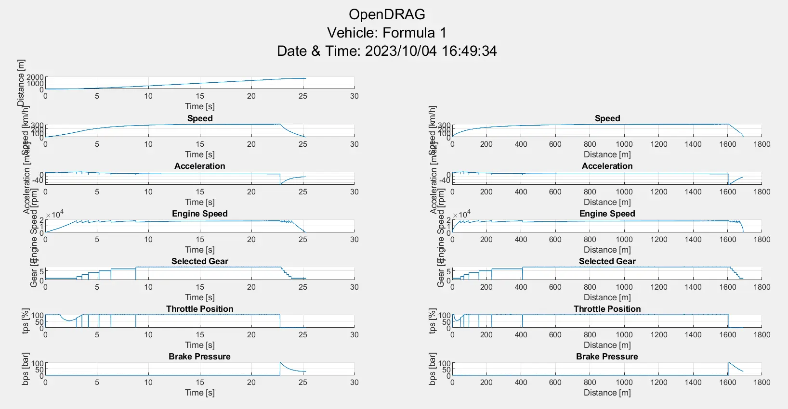

Compilation des résultats :
- **16 s** pour parcourir 1000 m
- **2,56 s** pour atteindre la vitesse de 100 km/h
- **4,65 s** pour atteindre la vitesse de 200 km/h
- **11,4 s** pour atteindre la vitesse de 300 km/h
- **316,27 km/h** atteints à une distance de 1600 m




```
%% OpenLAP Laptime Simulation Project
%
% OpenDRAG
%
% Straight line acceleration and braking simulation using a simple point
% mass model for a racing vehicle.
% Instructions:
% 1) Select a vehicle file created by OpenVEHICLE by assigning the full
%    path to the variable "vehiclefile".
% 2) Run the script.
% 3) The results will appear on the command window and inside the folder
%    "OpenDRAG Sims". You can choose to include the date and time of each
%    simulation in the result file name by changing the
%    "use_date_time_in_name" variable to true.
%
% More information can be found in the "OpenLAP Laptime Simulator"
% videos on YouTube.
%
% This software is licensed under the GPL V3 Open Source License.
%
% Open Source MATLAB project created by:
%
% Michael Halkiopoulos
% Cranfield University Advanced Motorsport MSc Engineer
% National Technical University of Athens MEng Mechanical Engineer
%
% LinkedIn: https://www.linkedin.com/in/michael-halkiopoulos/
% email: halkiopoulos_michalis@hotmail.com
% MATLAB file exchange: https://uk.mathworks.com/matlabcentral/fileexchange/
% GitHub: https://github.com/mc12027
%
% April 2020.

%% Clearing memory

clear
clc
close all force
diary('off')
fclose('all') ;

%% Timer start

% total timer start
total_timer = tic ;

%% Loading vehicle

% filename
vehiclefile = 'OpenVEHICLE Vehicles/MaFormule1.mat' ;

%% Simulation settings

% date and time in simulation name
use_date_time_in_name = false ;
% time step
dt = 1E-3 ;
% maximum simulation time for memory preallocation
t_max = 60 ;
% acceleration sensitivity for drag limitation
ax_sens = 0.05 ; % [m/s2]
% speed traps
speed_trap = [50;100;150;200;250;300;350]/3.6 ;
% track data
bank = 0 ;
incl = 0 ;

%% Vehicle data preprocessing

% loading file
veh = load(vehiclefile) ;
% mass
M = veh.M ;
% gravity constant
g = 9.81 ;
% longitudinal tyre coefficients
dmx = veh.factor_grip*veh.sens_x ;
mux = veh.factor_grip*veh.mu_x ;
Nx = veh.mu_x_M*g ;
% normal load on all wheels
Wz = M*g*cosd(bank)*cosd(incl) ;
% induced weight from banking and inclination
Wy = M*g*sind(bank) ;
Wx = M*g*sind(incl) ;
% ratios
rf = veh.ratio_final ;
rg = veh.ratio_gearbox ;
rp = veh.ratio_primary ;
% tyre radius
Rt = veh.tyre_radius ;
% drivetrain efficiency
np = veh.n_primary ;
ng = veh.n_gearbox ;
nf = veh.n_final ;
% engine curves
rpm_curve = [0;veh.en_speed_curve] ;
torque_curve = veh.factor_power*[veh.en_torque_curve(1);veh.en_torque_curve] ;
% shift points
shift_points = table2array(veh.shifting(:,1)) ;
shift_points = [shift_points;veh.en_speed_curve(end)] ;

%% Acceleration preprocessing

% memory preallocation
N = t_max/dt ;
T = -ones(N,1) ;
X = -ones(N,1) ;
V = -ones(N,1) ;
A = -ones(N,1) ;
RPM = -ones(N,1) ;
TPS = -ones(N,1) ;
BPS = -ones(N,1) ;
GEAR = -ones(N,1) ;
MODE = -ones(N,1) ;
% initial time
t = 0 ;
t_start = 0 ;
% initial distance
x = 0 ;
x_start = 0 ;
% initial velocity
v = 0 ;
% initial accelerartion
a = 0 ;
% initial gears
gear = 1 ;
gear_prev = 1 ;
% shifting condition
shifting = false ;
% initial rpm
rpm = 0 ;
% initial tps
tps = 0 ;
% initial bps
bps = 0 ;
% initial trap number
trap_number = 1 ;
% speed trap checking condition
check_speed_traps = true ;
% iteration number
i = 1 ;

%% HUD display

%  folder
[folder_status,folder_msg] = mkdir('OpenDRAG Sims') ;
% diary
if use_date_time_in_name
    date_time = "_"+datestr(now,'yyyy_mm_dd')+"_"+datestr(now,'HH_MM_SS') ; %#ok<UNRCH>
else
    date_time = "" ;
end
simname = "OpenDRAG Sims/OpenDRAG_"+veh.name+date_time ;
delete(simname+".log") ;
diary(simname+".log") ;
% HUD
disp([...
    '               _______                    ________________________________';...
    '               __  __ \______________________  __ \__  __ \__    |_  ____/';...
    '               _  / / /__  __ \  _ \_  __ \_  / / /_  /_/ /_  /| |  / __  ';...
    '               / /_/ /__  /_/ /  __/  / / /  /_/ /_  _, _/_  ___ / /_/ /  ';...
    '               \____/ _  .___/\___//_/ /_//_____/ /_/ |_| /_/  |_\____/   ';...
    '                      /_/                                                 '...
    ]) ;
disp('=======================================================================================')
disp(['Vehicle: ',char(veh.name)])
disp("Date:    "+datestr(now,'dd/mm/yyyy'))
disp("Time:    "+datestr(now,'HH:MM:SS'))
disp('=======================================================================================')
disp('Acceleration simulation started:')
disp(['Initial Speed: ',num2str(v*3.6),' km/h'])
disp('|_______Comment________|_Speed_|_Accel_|_EnRPM_|_Gear__|_Tabs__|_Xabs__|_Trel__|_Xrel_|')
disp('|______________________|[km/h]_|__[G]__|_[rpm]_|__[#]__|__[s]__|__[m]__|__[s]__|_[m]__|')

%% Acceleration

% acceleration timer start
acceleration_timer = tic ;
while true
    % saving values
    MODE(i) = 1 ;
    T(i) = t ;
    X(i) = x ;
    V(i) = v ;
    A(i) = a ;
    RPM(i) = rpm ;
    TPS(i) = tps ;
    BPS(i) = 0 ;
    GEAR(i) = gear ;
    % checking if rpm limiter is on or if out of memory
    if v>=veh.v_max
        % HUD
        fprintf('Engine speed limited\t')
        hud(v,a,rpm,gear,t,x,t_start,x_start)
        break
    elseif i==N
        % HUD
        disp(['Did not reach maximum speed at time ',num2str(t),' s'])
        break
    end
    % check if drag limited
    if tps==1 && ax+ax_drag<=ax_sens
        % HUD
        fprintf('Drag limited        \t')
        hud(v,a,rpm,gear,t,x,t_start,x_start)
        break
    end
    % checking speed trap
    if check_speed_traps
        % checking if current speed is above trap speed
        if v>=speed_trap(trap_number)
            fprintf('%s%3d %3d%s ','Speed Trap #',trap_number,round(speed_trap(trap_number)*3.6),'km/h')
            hud(v,a,rpm,gear,t,x,t_start,x_start)
            % next speed trap
            trap_number = trap_number+1 ;
            % checking if speed traps are completed
            if trap_number>length(speed_trap)
                check_speed_traps = false ;
            end
        end
    end
    % aero forces
    Aero_Df = 1/2*veh.rho*veh.factor_Cl*veh.Cl*veh.A*v^2 ;
    Aero_Dr = 1/2*veh.rho*veh.factor_Cd*veh.Cd*veh.A*v^2 ;
    % rolling resistance
    Roll_Dr = veh.Cr*(-Aero_Df+Wz) ;
    % normal load on driven wheels
    Wd = (veh.factor_drive*Wz+(-veh.factor_aero*Aero_Df))/veh.driven_wheels ;
    % drag acceleration
    ax_drag = (Aero_Dr+Roll_Dr+Wx)/M ;
    % rpm calculation
    if gear==0 % shifting gears
        rpm = rf*rg(gear_prev)*rp*v/Rt*60/2/pi ;
        rpm_shift = shift_points(gear_prev) ;
    else % gear change finished
        rpm = rf*rg(gear)*rp*v/Rt*60/2/pi ;
        rpm_shift = shift_points(gear) ;
    end
    % checking for gearshifts
    if rpm>=rpm_shift && ~shifting % need to change gears
        if gear==veh.nog % maximum gear number
            % HUD
            fprintf('Engine speed limited\t')
            hud(v,a,rpm,gear,t,x,t_start,x_start)
            break
        else % higher gear available
            % shifting condition
            shifting = true ;
            % shift initialisation time
            t_shift = t ;
            % zeroing  engine acceleration
            ax = 0 ;
            % saving previous gear
            gear_prev = gear ;
            % setting gear to neutral for duration of gearshift
            gear = 0 ;
        end
    elseif shifting % currently shifting gears
        % zeroing  engine acceleration
        ax = 0 ;
        % checking if gearshift duration has passed
        if t-t_shift>veh.shift_time
            % HUD
            fprintf('%s%2d\t','Shifting to gear #',gear_prev+1)
            hud(v,a,rpm,gear_prev+1,t,x,t_start,x_start)
            % shifting condition
            shifting = false ;
            % next gear
            gear = gear_prev+1 ;
        end
    else % no gearshift
        % max long acc available from tyres
        ax_tyre_max_acc = 1/M*(mux+dmx*(Nx-Wd))*Wd*veh.driven_wheels ;
        % getting power limit from engine
        engine_torque = interp1(rpm_curve,torque_curve,rpm) ;
        wheel_torque = engine_torque*rf*rg(gear)*rp*nf*ng*np ;
        ax_power_limit = 1/M*wheel_torque/Rt ;
        % final long acc
        ax = min([ax_power_limit,ax_tyre_max_acc]) ;
    end
    % tps
    tps = ax/ax_power_limit ;
    % longitudinal acceleration
    a = ax+ax_drag ;
    % new position
    x = x+v*dt+1/2*a*dt^2 ;
    % new velocity
    v = v+a*dt ;
    % new time
    t = t+dt ;
    % next iteration
    i = i+1 ;
end
i_acc = i ; % saving acceleration index
% average acceleration
a_acc_ave = v/t ;
disp(['Average acceleration:    ',num2str(a_acc_ave/9.81,'%6.3f'),' [G]'])
disp(['Peak acceleration   :    ',num2str(max(A)/9.81,'%6.3f'),' [G]'])
% acceleration timer
toc(acceleration_timer)

%% Deceleration preprocessing

% deceleration timer start
deceleration_timer = tic ;
% saving time and position of braking start
t_start = t ;
x_start = x ;
% speed trap condition
check_speed_traps = true ;
% active braking speed traps
speed_trap_decel = speed_trap(speed_trap<=v) ;
trap_number = length(speed_trap_decel) ;

%% HUD display

disp('===============================================================================')
disp('Deceleration simulation started:')
disp(['Initial Speed: ',num2str(v*3.6),' [km/h]'])
disp('|_______Comment________|_Speed_|_Accel_|_EnRPM_|_Gear__|_Tabs__|_Xabs__|_Trel__|_Xrel_|')
disp('|______________________|[km/h]_|__[G]__|_[rpm]_|__[#]__|__[s]__|__[m]__|__[s]__|_[m]__|')

%% Deceleration

while true
    % saving values
    MODE(i) = 2 ;
    T(i) = t ;
    X(i) = x ;
    V(i) = v ;
    A(i) = a ;
    RPM(i) = rpm ;
    TPS(i) = 0 ;
    BPS(i) = bps ;
    GEAR(i) = gear ;
    % checking if stopped or if out of memory
    if v<=0
        % zeroing speed
        v = 0 ;
        % HUD
        fprintf('Stopped             \t')
        hud(v,a,rpm,gear,t,x,t_start,x_start)
        break
    elseif i==N
        % HUD
        disp(['Did not stop at time ',num2str(t),' s'])
        break
    end
    % checking speed trap
    if check_speed_traps
        % checking if current speed is under trap speed
        if v<=speed_trap_decel(trap_number)
            % HUD
            fprintf('%s%3d %3d%s ','Speed Trap #',trap_number,round(speed_trap(trap_number)*3.6),'km/h')
            hud(v,a,rpm,gear,t,x,t_start,x_start)
            % next speed trap
            trap_number = trap_number-1 ;
            % checking if speed traps are completed
            if trap_number<1
                check_speed_traps = false ;
            end
        end
    end
    % aero forces
    Aero_Df = 1/2*veh.rho*veh.factor_Cl*veh.Cl*veh.A*v^2 ;
    Aero_Dr = 1/2*veh.rho*veh.factor_Cd*veh.Cd*veh.A*v^2 ;
    % rolling resistance
    Roll_Dr = veh.Cr*(-Aero_Df+Wz) ;
    % drag acceleration
    ax_drag = (Aero_Dr+Roll_Dr+Wx)/M ;
    % gear
    gear = interp1(veh.vehicle_speed,veh.gear,v) ;
    % rpm
    rpm = interp1(veh.vehicle_speed,veh.engine_speed,v) ;
    % max long dec available from tyres
    ax_tyre_max_dec = -1/M*(mux+dmx*(Nx-(Wz-Aero_Df)/4))*(Wz-Aero_Df) ;
    % final long acc
    ax = ax_tyre_max_dec ;
    % brake pressure
    bps = -veh.beta*veh.M*ax ;
    % longitudinal acceleration
    a = ax+ax_drag ;
    % new position
    x = x+v*dt+1/2*a*dt^2 ;
    % new velocity
    v = v+a*dt ;
    % new time
    t = t+dt ;
    % next iteration
    i = i+1 ;
end
% average deceleration
a_dec_ave = V(i_acc)/(t-t_start) ;
disp(['Average deceleration:    ',num2str(a_dec_ave/9.81,'%6.3f'),' [G]'])
disp(['Peak deceleration   :    ',num2str(-min(A)/9.81,'%6.3f'),' [G]'])
% deceleration timer
toc(deceleration_timer)

%% End of simulation

disp('===============================================================================')
disp('Simulation completed successfully.')% total timer
toc(total_timer)

%% Results compression

% getting values to delete
to_delete = T==-1 ;
% deleting values
T(to_delete) = [] ;
X(to_delete) = [] ;
V(to_delete) = [] ;
A(to_delete) = [] ;
RPM(to_delete) = [] ;
TPS(to_delete) = [] ;
BPS(to_delete) = [] ;
GEAR(to_delete) = [] ;
MODE(to_delete) = [] ;

%% Saving results

save(simname+".mat")
diary('off') ;

%% Plots

% figure window
set(0,'units','pixels') ;
SS = get(0,'screensize') ;
H = 900-90 ;
W = 900 ;
Xpos = floor((SS(3)-W)/2) ;
Ypos = floor((SS(4)-H)/2) ;
f = figure('Name','OpenDRAG Simulation Results','Position',[Xpos,Ypos,W,H]) ;
figtitle = ["OpenDRAG","Vehicle: "+veh.name,"Date & Time: "+datestr(now,'yyyy/mm/dd')+" "+datestr(now,'HH:MM:SS')] ;
sgtitle(figtitle)

% rows & columns
row = 7 ;
col = 2 ;
% plot number
i = 0 ;

% distance
i = i+1 ;
subplot(row,col,i)
hold on
grid on
% title('Traveled Distance')
xlabel('Time [s]')
ylabel('Distance [m]')
plot(T,X)
i = i+1 ;

% speed
i = i+1 ;
subplot(row,col,i)
hold on
grid on
title('Speed')
xlabel('Time [s]')
ylabel('Speed [km/h]')
plot(T,V*3.6)
i = i+1 ;
subplot(row,col,i)
hold on
grid on
title('Speed')
xlabel('Distance [m]')
ylabel('Speed [km/h]')
plot(X,V*3.6)

% acceleration
i = i+1 ;
subplot(row,col,i)
hold on
grid on
title('Acceleration')
xlabel('Time [s]')
ylabel('Acceleration [m/s2]')
plot(T,A)
i = i+1 ;
subplot(row,col,i)
hold on
grid on
title('Acceleration')
xlabel('Distance [m]')
ylabel('Acceleration [m/s2]')
plot(X,A)

% engine speed
i = i+1 ;
subplot(row,col,i)
hold on
grid on
title('Engine Speed')
xlabel('Time [s]')
ylabel('Engine Speed [rpm]')
plot(T,RPM)
i = i+1 ;
subplot(row,col,i)
hold on
grid on
title('Engine Speed')
xlabel('Distance [m]')
ylabel('Engine Speed [rpm]')
plot(X,RPM)

% gear
i = i+1 ;
subplot(row,col,i)
hold on
grid on
title('Selected Gear')
xlabel('Time [s]')
ylabel('Gear [-]')
plot(T,GEAR)
i = i+1 ;
subplot(row,col,i)
hold on
grid on
title('Selected Gear')
xlabel('Distance [m]')
ylabel('Gear [-]')
plot(X,GEAR)

% throttle
i = i+1 ;
subplot(row,col,i)
hold on
grid on
title('Throttle Position')
xlabel('Time [s]')
ylabel('tps [%]')
plot(T,TPS*100)
i = i+1 ;
subplot(row,col,i)
hold on
grid on
title('Throttle Position')
xlabel('Distance [m]')
ylabel('tps [%]')
plot(X,TPS*100)

% brake
i = i+1 ;
subplot(row,col,i)
hold on
grid on
title('Brake Pressure')
xlabel('Time [s]')
ylabel('bps [bar]')
plot(T,BPS/10^5)
i = i+1 ;
subplot(row,col,i)
hold on
grid on
title('Brake Pressure')
xlabel('Distance [m]')
ylabel('bps [bar]')
plot(X,BPS/10^5)

savefig(f,simname+".fig")

%% HUD function

%%%%%%%%%%%%%%%%%%%%%%%%%%%%%%%%%%%%%%%%%%%%%%%%%%%%%%%%%%%%%%%%%%%%%%%%%%%
function [] = hud(v,a,rpm,gear,t,x,t_start,x_start)
%     disp(['          Speed         : ',num2str(v*3.6),' km/h'])
%     disp(['          Acceleration  : ',num2str(g/9.81),' G'])
%     disp(['          RPM           : ',num2str(rpm)])
%     disp(['          Gear          : ',num2str(gear)])
%     disp(['          Time          : ',num2str(t-t_start),' s'])
%     disp(['          Distance      : ',num2str(x-x_start),' m'])
%     disp(['          Total Time    : ',num2str(t),' s'])
%     disp(['          Total Distance: ',num2str(x),' m'])
    fprintf('%7.2f\t%7.2f\t%7d\t%7d\t%7.2f\t%7.2f\t%7.2f\t%7.2f\n',v*3.6,a/9.81,round(rpm),gear,t,x,t-t_start,x-x_start) ;
end

```



#### OpenLAP
Nous arrivons enfin à l'ultime étape de ce POK, et ce pourquoi  tout le travail précédent a été effectué. OpenLAP prend en paramètre le véhicule MaFormule1 que nous avons créé précédement ainsi que la piste de Spa-Francorchamps.
Pour faire simple, à partir des informations sur les longueurs des rapports de la boîte de vitesse que nous avons fourni lors de la construction du véhicule, le code va en déduire une vitesse et une accélération. Le programme repère alors les points de corde (*apex* en anglais) du circuit et fait décélérer suffisamment la voiture . 
Après exécution du code, nous obtenons ce résultat en terme de temps au tour :

```
Simulation completed.
Laptime:  99.196 [s]
Sector 1: 28.932 [s]
Sector 2: 40.707 [s]
Sector 3: 29.516 [s]
```

Nous obtenons un temps de **1'39"196**. Celui-ci mets une raclée au record établi par Lewis Hamilton au volant de la Mercedes W11 EQ Performance avec un temps de **1'41"252** ([source](https://www.formula1.com/en/latest/article.watch-hamiltons-record-breaking-pole-lap-at-spa-for-the-belgian-grand-prix.1Omiln4DYwzGhsJRq7Ibzm.html)). La simulation est plus rapide de 2" (28"392 vs 30"421) dans le secteur 1, de 1"7 dans le secteur 2 (40"707 vs 42"466), et plus lente de 1"2 dans le secteur 3 (29"516 vs 28"365). Plusieurs paramètres peuvent expliquer cette différence :
- la simulation ne prend pas en compte le poids du carburant et du pilote, ce qui joue énormément dans la vitesse en ligne droite (et donc dans ligne droite de Kemmel secteur 1, et entre le T10 et le T12 au secteur 2)
- la simulation ne prend pas en compte les paramètres météorologiques (vent, température de piste)


Le rapport suivant est obtenu :

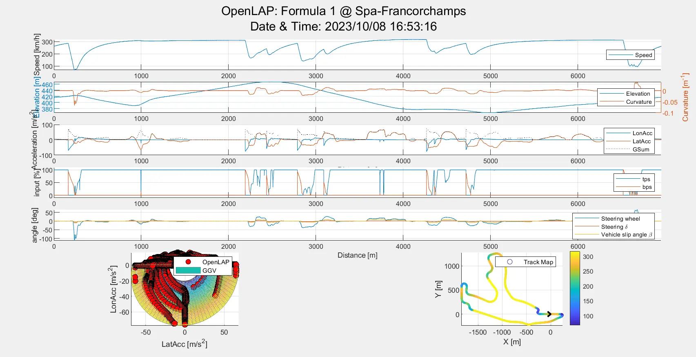

Je suis plus que satisfait par le résultat obtenu. Voici les principaux points sur lesquels je m'attarde :
- La première courbe affiche la vitesse du véhicule en fonction de la distance sur le circuit. La courbe seule n'est qu'indicative, mais en combinant plusieurs simulations (par exemple en changeant la charge aéro de la voiture), nous pourrons constater instantanément les différences (dans notre cas, en vitesse de pointe par exemple).
- La troisième courbe mets en évidence l'accélération subie par la voiture (et le pilote), en bleu lors des zones de freinage (*longitudinal acceleration*) et en orange lors des virages (*lateral acceleration*). Ces courbes correspondent bien aux zones de frainage sur la courbe de vitesse, et aux virages de la track map.
- Nous avons aussi pour information l'angle volant ainsi que la pression appliquée sur la pédale de frein et la course de la pédale d'accélérateur. Ces informations peuvent servir de comparaison lors d'un débrief pilote. 


Ces données servent d'indication, et ne sauraient prévaloir sur le ressenti du pilote. Par exemple, la voiture peut-être survireuse ou sous-vireuse, et cela expliquerait des différences d'angle volant avec la simulation.


Enfin, on a superposé au GGV Diagram présenté plus tôt les points simulés par le programme (en rouge). Nous constatons une très forte corrélation entre la simulation et l'enveloppe, la quasi-totalité de points se situent sur l'enveloppe de la courbe.


```
%% OpenLAP Laptime Simulation Project
%
% OpenLAP
%
% This software is licensed under the GPL V3 Open Source License.
%
% Open Source MATLAB project created by:
%
% Michael Halkiopoulos
% Cranfield University MSc Advanced Motorsport Engineer
% National Technical University of Athens MEng Mechanical Engineer
%
% LinkedIn: https://www.linkedin.com/in/michael-halkiopoulos/
% email: halkiopoulos_michalis@hotmail.com
% MATLAB file exchange: https://uk.mathworks.com/matlabcentral/fileexchange/
% GitHub: https://github.com/mc12027
%
% April 2020.

%% Clearing memory

clear
clc
close all force
diary('off')
fclose('all') ;

%% Starting timer

tic

%% Filenames

trackfile = 'OpenTRACK Tracks/OpenTRACK_Spa-Francorchamps_Closed_Forward.mat' ;
vehiclefile = 'OpenVEHICLE Vehicles/MaFormule1.mat' ;

%% Loading circuit

tr = load(trackfile) ;

%% Loading car

veh = load(vehiclefile) ;

%% Export frequency

freq = 50 ; % [Hz]

%% Simulation name

use_date_time_in_name = true ;
if use_date_time_in_name
    date_time = "_"+datestr(now,'yyyy_mm_dd')+"_"+datestr(now,'HH_MM_SS') ; %#ok<UNRCH>
else
    date_time = "" ;
end
simname = "OpenLAP Sims/OpenLAP_"+char(veh.name)+"_"+tr.info.name+date_time ;
logfile = simname+".log" ;

%% HUD

[folder_status,folder_msg] = mkdir('OpenLAP Sims') ;
delete(simname+".log") ;
logid = fopen(logfile,'w') ;
disp_logo(logid)
disp('=================================================')
disp("Vehicle: "+veh.name)
disp("Track:   "+tr.info.name)
disp("Date:    "+datestr(now,'dd/mm/yyyy'))
disp("Time:    "+datestr(now,'HH:MM:SS'))
disp('=================================================')
fprintf(logid,'%s\n','=================================================') ;
fprintf(logid,'%s\n',"Vehicle: "+veh.name) ;
fprintf(logid,'%s\n',"Track:   "+tr.info.name) ;
fprintf(logid,'%s\n',"Date:    "+datestr(now,'dd/mm/yyyy')) ;
fprintf(logid,'%s\n',"Time:    "+datestr(now,'HH:MM:SS')) ;
fprintf(logid,'%s\n','=================================================') ;

%% Lap Simulation

[sim] = simulate(veh,tr,simname,logid) ;

%% Displaying laptime

disp(['Laptime:  ',num2str(sim.laptime.data,'%3.3f'),' [s]'])
fprintf(logid,'%s','Laptime   : ') ;
fprintf(logid,'%7.3f',sim.laptime.data) ;
fprintf(logid,'%s\n',' [s]') ;
for i=1:max(tr.sector)
    disp(['Sector ',num2str(i),': ',num2str(sim.sector_time.data(i),'%3.3f'),' [s]'])
    fprintf(logid,'%s','Sector ') ;
    fprintf(logid,'%3d',i) ;
    fprintf(logid,'%s',': ') ;
    fprintf(logid,'%7.3f',sim.sector_time.data(i)) ;
    fprintf(logid,'%s\n',' [s]') ;
end

%% Ploting results

% figure window
set(0,'units','pixels') ;
SS = get(0,'screensize') ;
H = 900-90 ;
W = 900 ;
Xpos = floor((SS(3)-W)/2) ;
Ypos = floor((SS(4)-H)/2) ;
f = figure('Name','OpenLAP Simulation Results','Position',[Xpos,Ypos,W,H]) ;
figname = ["OpenLAP: "+char(veh.name)+" @ "+tr.info.name,"Date & Time: "+datestr(now,'yyyy/mm/dd')+" "+datestr(now,'HH:MM:SS')] ;
sgtitle(figname)

% setting rows & columns
rows = 7 ;
cols = 2 ;
% x axis limits
xlimit = [tr.x(1),tr.x(end)] ;
% xlimit = [4000,4500] ;
% setting legend location
loc = 'east' ;

% speed
subplot(rows,cols,[1,2])
hold on
plot(tr.x,sim.speed.data*3.6)
legend({'Speed'},'Location',loc)
xlabel('Distance [m]')
xlim(xlimit)
ylabel('Speed [m/s]')
ylabel('Speed [km/h]')
grid on

% elevation and curvature
subplot(rows,cols,[3,4])
yyaxis left
plot(tr.x,tr.Z)
xlabel('Distance [m]')
xlim(xlimit)
ylabel('Elevation [m]')
grid on
yyaxis right
plot(tr.x,tr.r)
legend({'Elevation','Curvature'},'Location',loc)
ylabel('Curvature [m^-^1]')

% accelerations
subplot(rows,cols,[5,6])
hold on
plot(tr.x,sim.long_acc.data)
plot(tr.x,sim.lat_acc.data)
plot(tr.x,sim.sum_acc.data,'k:')
legend({'LonAcc','LatAcc','GSum'},'Location',loc)
xlabel('Distance [m]')
xlim(xlimit)
ylabel('Acceleration [m/s^2]')
grid on

% drive inputs
subplot(rows,cols,[7,8])
hold on
plot(tr.x,sim.throttle.data*100)
plot(tr.x,sim.brake_pres.data/10^5)
legend({'tps','bps'},'Location',loc)
xlabel('Distance [m]')
xlim(xlimit)
ylabel('input [%]')
grid on
ylim([-10,110])

% steering inputs
subplot(rows,cols,[9,10])
hold on
plot(tr.x,sim.steering.data)
plot(tr.x,sim.delta.data)
plot(tr.x,sim.beta.data)
legend({'Steering wheel','Steering \delta','Vehicle slip angle \beta'},'Location',loc)
xlabel('Distance [m]')
xlim(xlimit)
ylabel('angle [deg]')
grid on

% ggv circle
subplot(rows,cols,[11,13])
hold on
scatter3(sim.lat_acc.data,sim.long_acc.data,sim.speed.data*3.6,50,'ro','filled','MarkerEdgeColor',[0,0,0])
surf(veh.GGV(:,:,2),veh.GGV(:,:,1),veh.GGV(:,:,3)*3.6,'EdgeAlpha',0.3,'FaceAlpha',0.8)
legend('OpenLAP','GGV','Location','northeast')
xlabel('LatAcc [m/s^2]')
ylabel('LonAcc [m/s^2]')
zlabel('Speed [km/h]')
grid on
set(gca,'DataAspectRatio',[1 1 3])
axis tight

% track map
subplot(rows,cols,[12,14])
hold on
scatter(tr.X,tr.Y,5,sim.speed.data*3.6)
plot(tr.arrow(:,1),tr.arrow(:,2),'k','LineWidth',2)
legend('Track Map','Location','northeast')
xlabel('X [m]')
ylabel('Y [m]')
colorbar
grid on
axis equal

% saving figure
savefig(simname+".fig")

% HUD
disp('Plots created and saved.')
fprintf(logid,'%s\n','Plots created and saved.') ;

%% Report generation

% csv report generation
export_report(veh,tr,sim,freq,logid) ;
% saving .mat file
save(simname+".mat",'veh','tr','sim')
% HUD
toc
fprintf(logid,'%s','Elapsed time is: ') ;
fprintf(logid,'%f',toc) ;
fprintf(logid,'%s\n',' [s]') ;
fclose('all') ;

%% Functions

%%%%%%%%%%%%%%%%%%%%%%%%%%%%%%%%%%%%%%%%%%%%%%%%%%%%%%%%%%%%%%%%%%%%%%%%%%%
function [sim] = simulate(veh,tr,simname,logid)
    
    %% initialisation
    
    % solver timer
    timer_solver_start = tic ;
    
    % HUD
    disp('Simulation started.')
    fprintf(logid,'%s\n','Simulation started.') ;
    
    %% maximum speed curve (assuming pure lateral condition)
    
    v_max = single(zeros(tr.n,1)) ;
    bps_v_max = single(zeros(tr.n,1)) ;
    tps_v_max = single(zeros(tr.n,1)) ;
    for i=1:tr.n
        [v_max(i),tps_v_max(i),bps_v_max(i)] = vehicle_model_lat(veh,tr,i) ;
    end
    
    % HUD
    disp('Maximum speed calculated at all points.')
    fprintf(logid,'%s\n','Maximum speed calculated at all points.') ;
    
    %% finding apexes
    
    [v_apex,apex] = findpeaks(-v_max) ; % findpeaks works for maxima, so need to flip values
    v_apex = -v_apex ; % flipping to get positive values
    % setting up standing start for open track configuration
    if strcmp(tr.info.config,'Open')
        if apex(1)~=1 % if index 1 is not already an apex
            apex = [1;apex] ; % inject index 1 as apex
            v_apex = [0;v_apex] ; % inject standing start
        else % index 1 is already an apex
            v_apex(1) = 0 ; % set standing start at index 1
        end
    end
    % checking if no apexes found and adding one if needed
    if isempty(apex)
        [v_apex,apex] = min(v_max) ;
    end
    % reordering apexes for solver time optimisation
    apex_table = sortrows([v_apex,apex],1) ;
    v_apex = apex_table(:,1) ;
    apex = apex_table(:,2) ;
    % getting driver inputs at apexes
    tps_apex = tps_v_max(apex) ;
    bps_apex = bps_v_max(apex) ;
    
    % HUD
    disp('Found all apexes on track.')
    fprintf(logid,'%s\n','Found all apexes on track.') ;
    
    %% simulation
    
    % memory preallocation
    N = uint32((length(apex))) ; % number of apexes
    flag = false(tr.n,2) ; % flag for checking that speed has been correctly evaluated
    % 1st matrix dimension equal to number of points in track mesh
    % 2nd matrix dimension equal to number of apexes
    % 3rd matrix dimension equal to 2 if needed (1 copy for acceleration and 1 for deceleration)
    v = single(inf*ones(tr.n,N,2)) ;
    ax = single(zeros(tr.n,N,2)) ;
    ay = single(zeros(tr.n,N,2)) ;
    tps = single(zeros(tr.n,N,2)) ;
    bps = single(zeros(tr.n,N,2)) ;
    
    % HUD
    disp('Starting acceleration and deceleration.')
    fprintf(logid,'%s\n','Starting acceleration and deceleration.') ;
    prg_size = 30 ;
    prg_pos = ftell(logid) ;
    fprintf(['Running: [',repmat(' ',1,prg_size),'] '])
    fprintf('% 3.0f',0)
    fprintf(' [%%]')
    fprintf(logid,'%s',['Running: [',repmat(' ',1,prg_size),'] ']) ;
    fprintf(logid,'% 3.0f',0) ;
    fprintf(logid,'%s\n',' [%]') ;
    fprintf(logid,'________________________________________________\n') ;
    fprintf(logid,'|_Apex__|_Point_|_Mode__|___x___|___v___|_vmax_|\n') ;
    
    % running simulation
    for i=1:N % apex number
        for k=uint8(1:2) % mode number
            switch k
                case 1 % acceleration
                    mode = 1 ;
                    k_rest = 2 ;
                case 2 % deceleration
                    mode = -1 ;
                    k_rest = 1 ;
            end
            if ~(strcmp(tr.info.config,'Open') && mode==-1 && i==1) % does not run in decel mode at standing start in open track
                % getting other apex for later checking
                [i_rest] = other_points(i,N) ;
                if isempty(i_rest)
                    i_rest = i ;
                end
                % getting apex index
                j = uint32(apex(i)) ;
                % saving speed & latacc & driver inputs from presolved apex
                v(j,i,k) = v_apex(i) ;
                ay(j,i,k) = v_apex(i)^2*tr.r(j) ;
                tps(j,:,1) = tps_apex(i)*ones(1,N) ;
                bps(j,:,1) = bps_apex(i)*ones(1,N) ;
                tps(j,:,2) = tps_apex(i)*ones(1,N) ;
                bps(j,:,2) = bps_apex(i)*ones(1,N) ;
                % setting apex flag
                flag(j,k) = true ;
                % getting next point index
                [~,j_next] = next_point(j,tr.n,mode,tr.info.config) ;
                if ~(strcmp(tr.info.config,'Open') && mode==1 && i==1) % if not in standing start
                    % assuming same speed right after apex
                    v(j_next,i,k) = v(j,i,k) ;
                    % moving to next point index
                    [j_next,j] = next_point(j,tr.n,mode,tr.info.config) ;
                end
                while 1
                    % writing to log file
                    fprintf(logid,'%7d\t%7d\t%7d\t%7.1f\t%7.2f\t%7.2f\n',i,j,k,tr.x(j),v(j,i,k),v_max(j)) ;
                    % calculating speed, accelerations and driver inputs from vehicle model
                    [v(j_next,i,k),ax(j,i,k),ay(j,i,k),tps(j,i,k),bps(j,i,k),overshoot] = vehicle_model_comb(veh,tr,v(j,i,k),v_max(j_next),j,mode) ;
                    % checking for limit
                    if overshoot
                        break
                    end
                    % checking if point is already solved in other apex iteration
                    if flag(j,k) || flag(j,k_rest)
                        if max(v(j_next,i,k)>=v(j_next,i_rest,k)) || max(v(j_next,i,k)>v(j_next,i_rest,k_rest))
                            break
                        end
                    end
                    % updating flag and grogress bar
                    flag = flag_update(flag,j,k,prg_size,logid,prg_pos) ;
                    % moving to next point index
                    [j_next,j] = next_point(j,tr.n,mode,tr.info.config) ;
                    % checking if lap is completed
                    switch tr.info.config
                        case 'Closed'
                            if j==apex(i) % made it to the same apex
                                break
                            end
                        case 'Open'
                            if j==tr.n % made it to the end
                                flag = flag_update(flag,j,k,prg_size,logid,prg_pos) ;
                                break
                            end
                            if j==1 % made it to the start
                                break
                            end
                    end
                end
            end
        end
    end
    
    % HUD
    progress_bar(max(flag,[],2),prg_size,logid,prg_pos) ;
    fprintf('\n')
    disp('Velocity profile calculated.')
    disp(['Solver time is: ',num2str(toc(timer_solver_start)),' [s]']) ;
    disp('Post-processing initialised.')
    fprintf(logid,'________________________________________________\n') ;
    if sum(flag)<size(flag,1)/size(flag,2)
        fprintf(logid,'%s\n','Velocity profile calculation error.') ;
        fprintf(logid,'%s\n','Points not calculated.') ;
        p = (1:tr.n)' ;
        fprintf(logid,'%d\n',p(min(flag,[],2))) ;
    else
        fprintf(logid,'%s\n','Velocity profile calculated successfully.') ;
    end
    fprintf(logid,'%s','Solver time is: ') ;
    fprintf(logid,'%f',toc(timer_solver_start)) ;
    fprintf(logid,'%s\n',' [s]') ;
    fprintf(logid,'%s\n','Post-processing initialised.') ;
    
    %% post-processing resutls
    
    % result preallocation
    V = zeros(tr.n,1) ;
    AX = zeros(tr.n,1) ;
    AY = zeros(tr.n,1) ;
    TPS = zeros(tr.n,1) ;
    BPS = zeros(tr.n,1) ;
    % solution selection
    for i=1:tr.n
        IDX = length(v(i,:,1)) ;
        [V(i),idx] = min([v(i,:,1),v(i,:,2)]) ; % order of k in v(i,:,k) inside min() must be the same as mode order to not miss correct values
        if idx<=IDX % solved in acceleration
            AX(i) = ax(i,idx,1) ;
            AY(i) = ay(i,idx,1) ;
            TPS(i) = tps(i,idx,1) ;
            BPS(i) = bps(i,idx,1) ;
        else % solved in deceleration
            AX(i) = ax(i,idx-IDX,2) ;
            AY(i) = ay(i,idx-IDX,2) ;
            TPS(i) = tps(i,idx-IDX,2) ;
            BPS(i) = bps(i,idx-IDX,2) ;
        end
    end
    % HUD
    disp('Correct solution selected from modes.')
    fprintf(logid,'%s\n','Correct solution selected from modes.') ;
    
    % laptime calculation
    if strcmp(tr.info.config,'Open')
        time = cumsum([tr.dx(2)./V(2);tr.dx(2:end)./V(2:end)]) ;
    else
        time = cumsum(tr.dx./V) ;
    end
    sector_time = zeros(max(tr.sector),1) ;
    for i=1:max(tr.sector)
        sector_time(i) = max(time(tr.sector==i))-min(time(tr.sector==i)) ;
    end
    laptime = time(end) ;
    % HUD
    disp('Laptime calculated.')
    fprintf(logid,'%s\n','Laptime calculated.') ;
    
    % calculating forces
    M = veh.M ;
    g = 9.81 ;
    A = sqrt(AX.^2+AY.^2) ;
    Fz_mass = -M*g*cosd(tr.bank).*cosd(tr.incl) ;
    Fz_aero = 1/2*veh.rho*veh.factor_Cl*veh.Cl*veh.A*V.^2 ;
    Fz_total = Fz_mass+Fz_aero ;
    Fx_aero = 1/2*veh.rho*veh.factor_Cd*veh.Cd*veh.A*V.^2 ;
    Fx_roll = veh.Cr*abs(Fz_total) ;
    % HUD
    disp('Forces calculated.')
    fprintf(logid,'%s\n','Forces calculated.') ;
    
    % calculating yaw motion, vehicle slip angle and steering input
    yaw_rate = V.*tr.r ;
    delta = zeros(tr.n,1) ;
    beta = zeros(tr.n,1) ;
    for i=1:tr.n
        B = [M*V(i)^2*tr.r(i)+M*g*sind(tr.bank(i));0] ;
        sol = veh.C\B ;
        delta(i) = sol(1)+atand(veh.L*tr.r(i)) ;
        beta(i) = sol(2) ;
    end
    steer = delta*veh.rack ;
    % HUD
    disp('Yaw motion calculated.')
    disp('Steering angles calculated.')
    disp('Vehicle slip angles calculated.')
    fprintf(logid,'%s\n','Yaw motion calculated.') ;
    fprintf(logid,'%s\n','Steering angles calculated.') ;
    fprintf(logid,'%s\n','Vehicle slip angles calculated.') ;
    
    % calculating engine metrics
    wheel_torque = TPS.*interp1(veh.vehicle_speed,veh.wheel_torque,V,'linear','extrap') ;
    Fx_eng = wheel_torque/veh.tyre_radius ;
    engine_torque = TPS.*interp1(veh.vehicle_speed,veh.engine_torque,V,'linear','extrap') ;
    engine_power = TPS.*interp1(veh.vehicle_speed,veh.engine_power,V,'linear','extrap') ;
    engine_speed = interp1(veh.vehicle_speed,veh.engine_speed,V,'linear','extrap') ;
    gear = interp1(veh.vehicle_speed,veh.gear,V,'nearest','extrap') ;
    fuel_cons = cumsum(wheel_torque/veh.tyre_radius.*tr.dx/veh.n_primary/veh.n_gearbox/veh.n_final/veh.n_thermal/veh.fuel_LHV) ;
    fuel_cons_total = fuel_cons(end) ;
    % HUD
    disp('Engine metrics calculated.')
    fprintf(logid,'%s\n','Engine metrics calculated.') ;
    
    % calculating kpis
    percent_in_corners = sum(tr.r~=0)/tr.n*100 ;
    percent_in_accel = sum(TPS>0)/tr.n*100 ;
    percent_in_decel = sum(BPS>0)/tr.n*100 ;
    percent_in_coast = sum(and(BPS==0,TPS==0))/tr.n*100 ;
    percent_in_full_tps = sum(tps==1)/tr.n*100 ;
    percent_in_gear = zeros(veh.nog,1) ;
    for i=1:veh.nog
        percent_in_gear(i) = sum(gear==i)/tr.n*100 ;
    end
    energy_spent_fuel = fuel_cons*veh.fuel_LHV ;
    energy_spent_mech = energy_spent_fuel*veh.n_thermal ;
    gear_shifts = sum(abs(diff(gear))) ;
    [~,i] = max(abs(AY)) ;
    ay_max = AY(i) ;
    ax_max = max(AX) ;
    ax_min = min(AX) ;
    sector_v_max = zeros(max(tr.sector),1) ;
    sector_v_min = zeros(max(tr.sector),1) ;
    for i=1:max(tr.sector)
        sector_v_max(i) = max(V(tr.sector==i)) ;
        sector_v_min(i) = min(V(tr.sector==i)) ;
    end
    % HUD
    disp('KPIs calculated.')
    disp('Post-processing finished.')
    fprintf(logid,'%s\n','KPIs calculated.') ;
    fprintf(logid,'%s\n','Post-processing finished.') ;
    
    %% saving results in sim structure
    sim.sim_name.data = simname ;
    sim.distance.data = tr.x ;
    sim.distance.unit = 'm' ;
    sim.time.data = time ;
    sim.time.unit = 's' ;
    sim.N.data = N ;
    sim.N.unit = [] ;
    sim.apex.data = apex ;
    sim.apex.unit = [] ;
    sim.speed_max.data = v_max ;
    sim.speed_max.unit = 'm/s' ;
    sim.flag.data = flag ;
    sim.flag.unit = [] ;
    sim.v.data = v ;
    sim.v.unit = 'm/s' ;
    sim.Ax.data = ax ;
    sim.Ax.unit = 'm/s/s' ;
    sim.Ay.data = ay ;
    sim.Ay.unit = 'm/s/s' ;
    sim.tps.data = tps ;
    sim.tps.unit = [] ;
    sim.bps.data = bps ;
    sim.bps.unit = [] ;
    sim.elevation.data = tr.Z ;
    sim.elevation.unit = 'm' ;
    sim.speed.data = V ;
    sim.speed.unit = 'm/s' ;
    sim.yaw_rate.data = yaw_rate ;
    sim.yaw_rate.unit = 'rad/s' ;
    sim.long_acc.data = AX ;
    sim.long_acc.unit = 'm/s/s' ;
    sim.lat_acc.data = AY ;
    sim.lat_acc.unit = 'm/s/s' ;
    sim.sum_acc.data = A ;
    sim.sum_acc.unit = 'm/s/s' ;
    sim.throttle.data = TPS ;
    sim.throttle.unit = 'ratio' ;
    sim.brake_pres.data = BPS ;
    sim.brake_pres.unit = 'Pa' ;
    sim.brake_force.data = BPS*veh.phi ;
    sim.brake_force.unit = 'N' ;
    sim.steering.data = steer ;
    sim.steering.unit = 'deg' ;
    sim.delta.data = delta ;
    sim.delta.unit = 'deg' ;
    sim.beta.data = beta ;
    sim.beta.unit = 'deg' ;
    sim.Fz_aero.data = Fz_aero ;
    sim.Fz_aero.unit = 'N' ;
    sim.Fx_aero.data = Fx_aero ;
    sim.Fx_aero.unit = 'N' ;
    sim.Fx_eng.data = Fx_eng ;
    sim.Fx_eng.unit = 'N' ;
    sim.Fx_roll.data = Fx_roll ;
    sim.Fx_roll.unit = 'N' ;
    sim.Fz_mass.data = Fz_mass ;
    sim.Fz_mass.unit = 'N' ;
    sim.Fz_total.data = Fz_total ;
    sim.Fz_total.unit = 'N' ;
    sim.wheel_torque.data = wheel_torque ;
    sim.wheel_torque.unit = 'N.m' ;
    sim.engine_torque.data = engine_torque ;
    sim.engine_torque.unit = 'N.m' ;
    sim.engine_power.data = engine_power ;
    sim.engine_power.unit = 'W' ;
    sim.engine_speed.data = engine_speed ;
    sim.engine_speed.unit = 'rpm' ;
    sim.gear.data = gear ;
    sim.gear.unit = [] ;
    sim.fuel_cons.data = fuel_cons ;
    sim.fuel_cons.unit = 'kg' ;
    sim.fuel_cons_total.data = fuel_cons_total ;
    sim.fuel_cons_total.unit = 'kg' ;
    sim.laptime.data = laptime ;
    sim.laptime.unit = 's' ;
    sim.sector_time.data = sector_time ;
    sim.sector_time.unit = 's' ;
    sim.percent_in_corners.data = percent_in_corners ;
    sim.percent_in_corners.unit = '%' ;
    sim.percent_in_accel.data = percent_in_accel ;
    sim.percent_in_accel.unit = '%' ;
    sim.percent_in_decel.data = percent_in_decel ;
    sim.percent_in_decel.unit = '%' ;
    sim.percent_in_coast.data = percent_in_coast ;
    sim.percent_in_coast.unit = '%' ;
    sim.percent_in_full_tps.data = percent_in_full_tps ;
    sim.percent_in_full_tps.unit = '%' ;
    sim.percent_in_gear.data = percent_in_gear ;
    sim.percent_in_gear.unit = '%' ;
    sim.v_min.data = min(V) ;
    sim.v_min.unit = 'm/s' ;
    sim.v_max.data = max(V) ;
    sim.v_max.unit = 'm/s' ;
    sim.v_ave.data = mean(V) ;
    sim.v_ave.unit = 'm/s' ;
    sim.energy_spent_fuel.data = energy_spent_fuel ;
    sim.energy_spent_fuel.unit = 'J' ;
    sim.energy_spent_mech.data = energy_spent_mech ;
    sim.energy_spent_mech.unit = 'J' ;
    sim.gear_shifts.data = gear_shifts ;
    sim.gear_shifts.unit = [] ;
    sim.lat_acc_max.data = ay_max ;
    sim.lat_acc_max.unit = 'm/s/s' ;
    sim.long_acc_max.data = ax_max ;
    sim.long_acc_max.unit = 'm/s/s' ;
    sim.long_acc_min.data = ax_min ;
    sim.long_acc_min.unit = 'm/s/s' ;
    sim.sector_v_max.data = sector_v_max ;
    sim.sector_v_max.unit = 'm/s' ;
    sim.sector_v_min.data = sector_v_min ;
    sim.sector_v_min.unit = 'm/s' ;
    % HUD
    disp('Simulation results saved.')
    disp('Simulation completed.')
    fprintf(logid,'%s\n','Simulation results saved.') ;
    fprintf(logid,'%s\n','Simulation completed.') ;
    
end

%%%%%%%%%%%%%%%%%%%%%%%%%%%%%%%%%%%%%%%%%%%%%%%%%%%%%%%%%%%%%%%%%%%%%%%%%%%
function [v,tps,bps] = vehicle_model_lat(veh,tr,p)
    
    %% initialisation
    % getting track data
    g = 9.81 ;
    r = tr.r(p) ;
    incl = tr.incl(p) ;
    bank = tr.bank(p) ;
    factor_grip = tr.factor_grip(p)*veh.factor_grip ;
    % getting vehicle data
    factor_drive = veh.factor_drive ;
    factor_aero = veh.factor_aero ;
    driven_wheels = veh.driven_wheels ;
    % Mass
    M = veh.M ;
    % normal load on all wheels
    Wz = M*g*cosd(bank)*cosd(incl) ;
    % induced weight from banking and inclination
    Wy = -M*g*sind(bank) ;
    Wx = M*g*sind(incl) ;
    
    %% speed solution
    if r==0 % straight (limited by engine speed limit or drag)
        % checking for engine speed limit
        v = veh.v_max ;
        tps = 1 ; % full throttle
        bps = 0 ; % 0 brake
    else % corner (may be limited by engine, drag or cornering ability)
        %% initial speed solution
        % downforce coefficient
        D = -1/2*veh.rho*veh.factor_Cl*veh.Cl*veh.A ;
        % longitudinal tyre coefficients
        dmy = factor_grip*veh.sens_y ;
        muy = factor_grip*veh.mu_y ;
        Ny = veh.mu_y_M*g ;
        % longitudinal tyre coefficients
        dmx = factor_grip*veh.sens_x ;
        mux = factor_grip*veh.mu_x ;
        Nx = veh.mu_x_M*g ;
        % 2nd degree polynomial coefficients ( a*x^2+b*x+c = 0 )
        a = -sign(r)*dmy/4*D^2 ;
        b = sign(r)*(muy*D+(dmy/4)*(Ny*4)*D-2*(dmy/4)*Wz*D)-M*r ;
        c = sign(r)*(muy*Wz+(dmy/4)*(Ny*4)*Wz-(dmy/4)*Wz^2)+Wy ;
        % calculating 2nd degree polynomial roots
        if a==0
            v = sqrt(-c/b) ;
        elseif b^2-4*a*c>=0
            if (-b+sqrt(b^2-4*a*c))/2/a>=0
                v = sqrt((-b+sqrt(b^2-4*a*c))/2/a) ;
            elseif (-b-sqrt(b^2-4*a*c))/2/a>=0
                v = sqrt((-b-sqrt(b^2-4*a*c))/2/a) ;
            else
                error(['No real roots at point index: ',num2str(p)])
            end
        else
            error(['Discriminant <0 at point index: ',num2str(p)])
        end
        % checking for engine speed limit
        v = min([v,veh.v_max]) ;
        %% adjusting speed for drag force compensation
        adjust_speed = true ;
        while adjust_speed
            % aero forces
            Aero_Df = 1/2*veh.rho*veh.factor_Cl*veh.Cl*veh.A*v^2 ;
            Aero_Dr = 1/2*veh.rho*veh.factor_Cd*veh.Cd*veh.A*v^2 ;
            % rolling resistance
            Roll_Dr = veh.Cr*(-Aero_Df+Wz) ;
            % normal load on driven wheels
            Wd = (factor_drive*Wz+(-factor_aero*Aero_Df))/driven_wheels ;
            % drag acceleration
            ax_drag = (Aero_Dr+Roll_Dr+Wx)/M ;
            % maximum lat acc available from tyres
            ay_max = sign(r)/M*(muy+dmy*(Ny-(Wz-Aero_Df)/4))*(Wz-Aero_Df) ;
            % needed lat acc make turn
            ay_needed = v^2*r+g*sind(bank) ; % circular motion and track banking
            % calculating driver inputs
            if ax_drag<=0 % need throttle to compensate for drag
                % max long acc available from tyres
                ax_tyre_max_acc = 1/M*(mux+dmx*(Nx-Wd))*Wd*driven_wheels ;
                % getting power limit from engine
                ax_power_limit = 1/M*(interp1(veh.vehicle_speed,veh.factor_power*veh.fx_engine,v)) ;
                % available combined lat acc at ax_net==0 => ax_tyre==-ax_drag
                ay = ay_max*sqrt(1-(ax_drag/ax_tyre_max_acc)^2) ; % friction ellipse
                % available combined long acc at ay_needed
                ax_acc = ax_tyre_max_acc*sqrt(1-(ay_needed/ay_max)^2) ; % friction ellipse
                % getting tps value
                scale = min([-ax_drag,ax_acc])/ax_power_limit ;
                tps = max([min([1,scale]),0]) ; % making sure its positive
                bps = 0 ; % setting brake pressure to 0
            else % need brake to compensate for drag
                % max long acc available from tyres
                ax_tyre_max_dec = -1/M*(mux+dmx*(Nx-(Wz-Aero_Df)/4))*(Wz-Aero_Df) ;
                % available combined lat acc at ax_net==0 => ax_tyre==-ax_drag
                ay = ay_max*sqrt(1-(ax_drag/ax_tyre_max_dec)^2) ; % friction ellipse
                % available combined long acc at ay_needed
                ax_dec = ax_tyre_max_dec*sqrt(1-(ay_needed/ay_max)^2) ; % friction ellipse
                % getting brake input
                fx_tyre = max([ax_drag,-ax_dec])*M ;
                bps = max([fx_tyre,0])*veh.beta ; % making sure its positive
                tps = 0 ; % setting throttle to 0
            end
            % checking if tyres can produce the available combined lat acc
            if ay/ay_needed<1 % not enough grip
                v = sqrt((ay-g*sind(bank))/r)-1E-3 ; % the (-1E-3 factor is there for convergence speed)
            else % enough grip
                adjust_speed = false ;
            end
        end
    end
    
end

%%%%%%%%%%%%%%%%%%%%%%%%%%%%%%%%%%%%%%%%%%%%%%%%%%%%%%%%%%%%%%%%%%%%%%%%%%%
function [v_next,ax,ay,tps,bps,overshoot] = vehicle_model_comb(veh,tr,v,v_max_next,j,mode)
    
    %% initialisation
    
    % assuming no overshoot
    overshoot = false ;
    % getting track data
    dx = tr.dx(j) ;
    r = tr.r(j) ;
    incl = tr.incl(j) ;
    bank = tr.bank(j) ;
    factor_grip = tr.factor_grip(j)*veh.factor_grip ;
    g = 9.81 ;
    % getting vehicle data
    if mode==1
        factor_drive = veh.factor_drive ;
        factor_aero = veh.factor_aero ;
        driven_wheels = veh.driven_wheels ;
    else
        factor_drive = 1 ;
        factor_aero = 1 ;
        driven_wheels = 4 ;
    end
    
    %% external forces
    
    % Mass
    M = veh.M ;
    % normal load on all wheels
    Wz = M*g*cosd(bank)*cosd(incl) ;
    % induced weight from banking and inclination
    Wy = -M*g*sind(bank) ;
    Wx = M*g*sind(incl) ;
    % aero forces
    Aero_Df = 1/2*veh.rho*veh.factor_Cl*veh.Cl*veh.A*v^2 ;
    Aero_Dr = 1/2*veh.rho*veh.factor_Cd*veh.Cd*veh.A*v^2 ;
    % rolling resistance
    Roll_Dr = veh.Cr*(-Aero_Df+Wz) ;
    % normal load on driven wheels
    Wd = (factor_drive*Wz+(-factor_aero*Aero_Df))/driven_wheels ;
    
    %% overshoot acceleration
    
    % maximum allowed long acc to not overshoot at next point
    ax_max = mode*(v_max_next^2-v^2)/2/dx ;
    % drag acceleration
    ax_drag = (Aero_Dr+Roll_Dr+Wx)/M ;
    % ovesrhoot acceleration limit
	ax_needed = ax_max-ax_drag ;
    
    %% current lat acc
    
    ay = v^2*r+g*sind(bank) ;
    
    %% tyre forces
    
    % longitudinal tyre coefficients
    dmy = factor_grip*veh.sens_y ;
    muy = factor_grip*veh.mu_y ;
    Ny = veh.mu_y_M*g ;
    % longitudinal tyre coefficients
    dmx = factor_grip*veh.sens_x ;
    mux = factor_grip*veh.mu_x ;
    Nx = veh.mu_x_M*g ;
    % friction ellipse multiplier
    if sign(ay)~=0 % in corner or compensating for banking
        % max lat acc available from tyres
        ay_max = 1/M*(sign(ay)*(muy+dmy*(Ny-(Wz-Aero_Df)/4))*(Wz-Aero_Df)+Wy) ;
        % max combined long acc available from tyres
        if abs(ay/ay_max)>1 % checking if vehicle overshot (should not happen, but check exists to exclude complex numbers in solution from friction ellipse)
            ellipse_multi = 0 ;
        else
            ellipse_multi = sqrt(1-(ay/ay_max)^2) ; % friction ellipse
        end
    else % in straight or no compensation for banking needed
        ellipse_multi = 1 ;
    end
    
    %% calculating driver inputs
    
    if ax_needed>=0 % need tps
        % max pure long acc available from driven tyres
        ax_tyre_max = 1/M*(mux+dmx*(Nx-Wd))*Wd*driven_wheels ;
        % max combined long acc available from driven tyres
        ax_tyre = ax_tyre_max*ellipse_multi ;
        % getting power limit from engine
        ax_power_limit = 1/M*(interp1(veh.vehicle_speed,veh.factor_power*veh.fx_engine,v,'linear',0)) ;
        % getting tps value
        scale = min([ax_tyre,ax_needed]/ax_power_limit) ;
        tps = max([min([1,scale]),0]) ; % making sure its positive
        bps = 0 ; % setting brake pressure to 0
        % final long acc command
        ax_com = tps*ax_power_limit ;
    else % need braking
        % max pure long acc available from all tyres
        ax_tyre_max = -1/M*(mux+dmx*(Nx-(Wz-Aero_Df)/4))*(Wz-Aero_Df) ;
        % max comb long acc available from all tyres
        ax_tyre = ax_tyre_max*ellipse_multi ;
        % tyre braking force
        fx_tyre = min(-[ax_tyre,ax_needed])*M ;
        % getting brake input
        bps = max([fx_tyre,0])*veh.beta ; % making sure its positive
        tps = 0 ; % seting throttle to 0
        % final long acc command
        ax_com = -min(-[ax_tyre,ax_needed]) ;
    end
    
    %% final results
    
    % total vehicle long acc
    ax = ax_com+ax_drag ;
    % next speed value
    v_next = sqrt(v^2+2*mode*ax*tr.dx(j)) ;
    % correcting tps for full throttle when at v_max on straights
    if tps>0 && v/veh.v_max>=0.999
        tps = 1 ;
    end
    
    %% checking for overshoot
    
    if v_next/v_max_next>1
        % setting overshoot flag
        overshoot = true ;
        % resetting values for overshoot
        v_next = inf ;
        ax = 0 ;
        ay = 0 ;
        tps = -1 ;
        bps = -1 ;
        return
    end
    
end

%%%%%%%%%%%%%%%%%%%%%%%%%%%%%%%%%%%%%%%%%%%%%%%%%%%%%%%%%%%%%%%%%%%%%%%%%%%
function [j_next,j] = next_point(j,j_max,mode,tr_config)
    switch mode
        case 1 % acceleration
            switch tr_config
                case 'Closed'
                    if j==j_max-1
                        j = j_max ;
                        j_next = 1 ;
                    elseif j==j_max
                        j = 1 ;
                        j_next = j+1 ;
                    else
                        j = j+1 ;
                        j_next = j+1 ;
                    end
                case 'Open'
                    j = j+1 ;
                    j_next = j+1 ;
            end
        case -1 % deceleration
            switch tr_config
                case 'Closed'
                    if j==2
                        j = 1 ;
                        j_next = j_max ;
                    elseif j==1
                        j = j_max ;
                        j_next = j-1 ;
                    else
                        j = j-1 ;
                        j_next = j-1 ;
                    end
                case 'Open'
                    j = j-1 ;
                    j_next = j-1 ;
            end
    end
end

%%%%%%%%%%%%%%%%%%%%%%%%%%%%%%%%%%%%%%%%%%%%%%%%%%%%%%%%%%%%%%%%%%%%%%%%%%%
function [i_rest] = other_points(i,i_max)
    i_rest = (1:i_max)' ;
    i_rest(i) = [] ;
end

%%%%%%%%%%%%%%%%%%%%%%%%%%%%%%%%%%%%%%%%%%%%%%%%%%%%%%%%%%%%%%%%%%%%%%%%%%%
function [flag] = flag_update(flag,j,k,prg_size,logid,prg_pos)
    % current flag state
    p = sum(flag,'all')/size(flag,1)/size(flag,2) ;
    n_old = floor(p*prg_size) ; % old number of lines
    % new flag state
    flag(j,k) = true ;
    p = sum(flag,'all')/size(flag,1)/size(flag,2) ;
    n = floor(p*prg_size) ; % new number of lines
    % checking if state has changed enough to update progress bar
    if n>n_old
        progress_bar(flag,prg_size,logid,prg_pos) ;
    end
end

%%%%%%%%%%%%%%%%%%%%%%%%%%%%%%%%%%%%%%%%%%%%%%%%%%%%%%%%%%%%%%%%%%%%%%%%%%%
function [] = progress_bar(flag,prg_size,logid,prg_pos)
    % current flag state
    p = sum(flag,'all')/size(flag,1)/size(flag,2) ; % progress percentage
    n = floor(p*prg_size) ; % new number of lines
    e = prg_size-n ; % number of spaces
    % updating progress bar in command window
    fprintf(repmat('\b',1,prg_size+1+8)) % backspace to start of bar
    fprintf(repmat('|',1,n)) % writing lines
    fprintf(repmat(' ',1,e)) % writing spaces
    fprintf(']') % closing bar
    fprintf('%4.0f',p*100) % writing percentage
    fprintf(' [%%]') % writing % symbol
    % updating progress bar in log file
    fseek(logid,prg_pos,'bof') ; % start of progress bar position in log file
    fprintf(logid,'%s','Running: [') ;
    fprintf(logid,'%s',repmat('|',1,n)) ;
    fprintf(logid,'%s',repmat(' ',1,e)) ;
    fprintf(logid,'%s','] ') ;
    fprintf(logid,'%3.0f',p*100) ;
    fprintf(logid,'%s\n',' [%]') ;
    fseek(logid,0,'eof') ; % continue at end of file
end

%%%%%%%%%%%%%%%%%%%%%%%%%%%%%%%%%%%%%%%%%%%%%%%%%%%%%%%%%%%%%%%%%%%%%%%%%%%
function [] = disp_logo(logid)
    lg = [...
        '_______                    _____________________ ';...
        '__  __ \______________________  /___    |__  __ \';...
        '_  / / /__  __ \  _ \_  __ \_  / __  /| |_  /_/ /';...
        '/ /_/ /__  /_/ /  __/  / / /  /___  ___ |  ____/ ';...
        '\____/ _  .___/\___//_/ /_//_____/_/  |_/_/      ';...
        '       /_/                                       '...
        ] ;
    disp(lg) % command window
    fprintf(logid,'%s',[lg,repmat(newline,size(lg,1),1)].') ; % log file
end

%%%%%%%%%%%%%%%%%%%%%%%%%%%%%%%%%%%%%%%%%%%%%%%%%%%%%%%%%%%%%%%%%%%%%%%%%%%
function [] = export_report(veh,tr,sim,freq,logid)
    % frequency
    freq = round(freq) ;
    % channel names
    all_names = fieldnames(sim) ;
    % number of channels to export
    S = 0 ;
    % channel id vector
    I = (1:length(all_names))' ;
    % getting only vector channels (excluding matrices)
    for i=1:length(all_names)
        % getting size for each channel
        s = size(eval(['sim.',all_names{i},'.data'])) ;
        % checking if channel is a vector
        if length(s)==2 && s(1)==tr.n && s(2)==1 % is vector
            S = S+1 ;
        else % is not vector
            I(i) = 0 ;
        end
    end
    % keeping only vector channel ids
    I(I==0) = [] ;
    % getting channel names
    channel_names = all_names(I)' ;
    % memory preallocation
    % data matrix
    data = single(zeros(tr.n,S)) ;
    % units vector
    channel_units = cell(1,length(I)) ;
    % getting data and units
    for i=1:length(I)
        data(:,i) = eval(['sim.',all_names{I(i)},'.data']) ;
        channel_units(i) = eval(['{sim.',all_names{I(i)},'.unit}']) ;
    end
    % new time vector for specified frequency
    t = (0:1/freq:sim.laptime.data)' ;
    % getting time channel id vector
    j = strcmp(string(channel_names),"time") ;
    % time data memory preallocation
    time_data = single(zeros(length(t),length(I))) ;
    % getting 
    for i=1:length(I)
         % checking if channel corresponds to time
        if i==j % time channel
            time_data(:,i) = t ;
        else % all other channels
            % checking for integer channel
            if strcmp(string(channel_names(i)),"gear") % gear needs to be integer
                time_data(:,i) = interp1(data(:,j),data(:,i),t,'nearest','extrap') ;
            else % all other channels are linearly interpolated
                time_data(:,i) = interp1(data(:,j),data(:,i),t,'linear','extrap') ;
            end
        end
    end
    % opening and writing .csv file
    % HUD
    disp('Export initialised.')
    fprintf(logid,'%s\n','Export initialised.') ;
    % filename
    filename = sim.sim_name.data+".csv" ;
    % opening file
    fid = fopen(filename,'w') ;
    % writing file header
    fprintf(fid,'%s,%s\n',["Format","OpenLAP Export"]) ;
    fprintf(fid,'%s,%s\n',["Venue",tr.info.name]) ;
    fprintf(fid,'%s,%s\n',["Vehicle",veh.name]) ;
    fprintf(fid,'%s,%s\n',["Driver",'OpenLap']) ;
    fprintf(fid,'%s\n',"Device") ;
    fprintf(fid,'%s\n',"Comment") ;
    fprintf(fid,'%s,%s\n',["Date",datestr(now,'dd/mm/yyyy')]) ;
    fprintf(fid,'%s,%s\n',["Time",datestr(now,'HH:MM:SS')]) ;
    fprintf(fid,'%s,%s\n',["Frequency",num2str(freq,'%d')]) ;
    fprintf(fid,'\n') ;
    fprintf(fid,'\n') ;
    fprintf(fid,'\n') ;
    fprintf(fid,'\n') ;
    fprintf(fid,'\n') ;
    % writing channels
    form = [repmat('%s,',1,length(I)-1),'%s\n'] ;
    fprintf(fid,form,channel_names{:}) ;
    fprintf(fid,form,channel_names{:}) ;
    fprintf(fid,form,channel_units{:}) ;
    fprintf(fid,'\n') ;
    fprintf(fid,'\n') ;
    form = [repmat('%f,',1,length(I)-1),'%f\n'] ;
    for i=1:length(t)
        fprintf(fid,form,time_data(i,:)) ;
    end
    % closing file
    fclose(fid) ;
    % HUD
    disp('Exported .csv file successfully.')
    fprintf(logid,'%s\n','Exported .csv file successfully.') ;
end

```


## Conclusion
Je suis très satisfait de ce que j'ai pu expérimenter durant ce POK. J'aurais aimé avoir un peu plus de temps pour approfondir la simulation de temps au tour (notamment effectuer plusieurs simulations avec une voiture différente ou avec un set-up différent).


## Annexe
#### Annexe 1
Modélisation physique du problème :
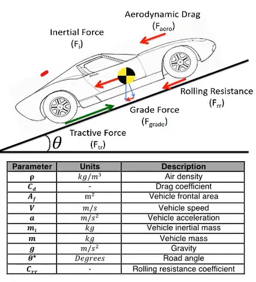

Source : Mathworks.

#### Annexe 2
Voici les équations qui régissent le mouvement de la monoplace dans la partie 3 :


Source : Zongxuan Sun, Guoming G. Zhu, *Design and Control of Automotive Propulsion Systems*, e-Book.

#### Annexe 3
Voici le détail du bloc Monoplace dans la partie 3 :

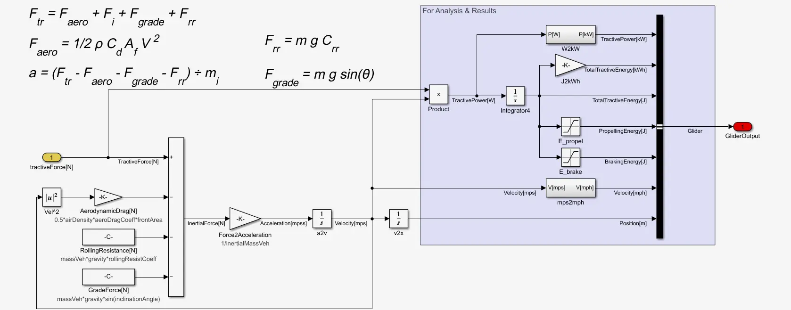

#### Annexe 4
Voici le détail du bloc Pilote dans la partie 3 :

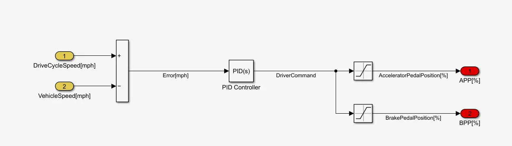