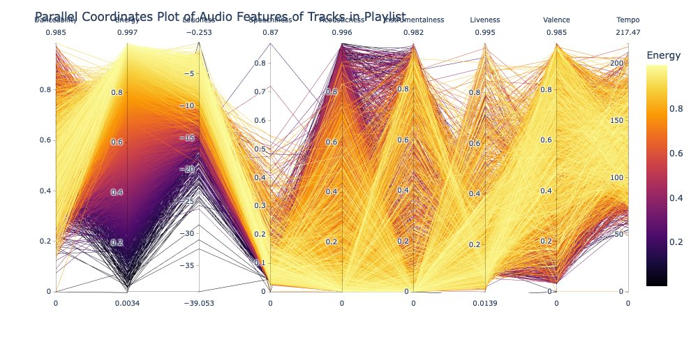
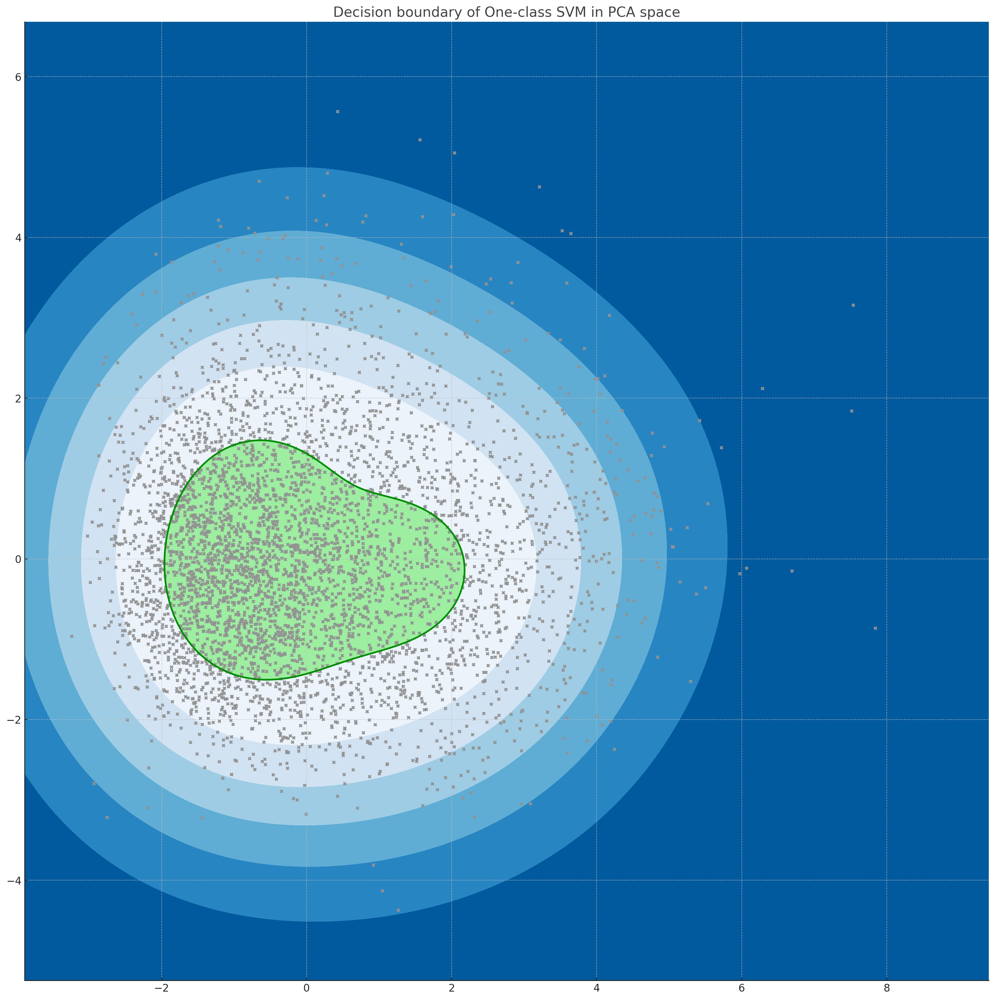
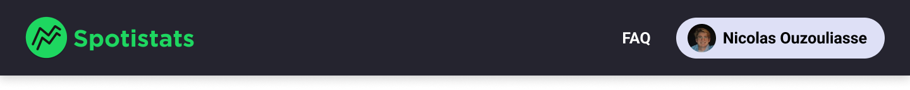
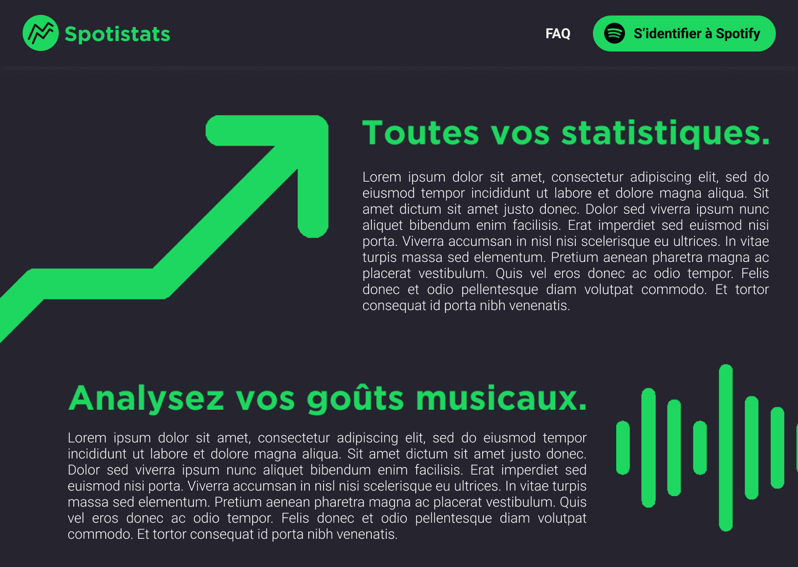


**Niveau :** débutant
**Prérequis :**

- Bases de développement Web (HTML et CSS)
- Des prérequis en utilisation d'API peuvent être un plus mais ne sont pas indispensables


Pour la réalisation de ce cours, je me réfèrerais aux sources listées ci-dessous :

- *Créez votre site web avec HTML5 et CSS3.* OpenClassrooms. Accessible [ici](https://openclassrooms.com/fr/courses/1603881-creez-votre-site-web-avec-html5-et-css3).
- Developer Mozilla. Accessible [ici](https://developer.mozilla.org/fr/)

## Sommaire

1. Objectifs du Sprint 1
2. Objectifs du Sprint 2
3. Maquette Figma
4. Création des pages du site en HTML
5. Mise en page V1 en CSS
6. Retour d'expérience du Sprint 1

Le but de ce POK est de mettre en pratique mon MON1.2 sur le développement web. Je souhaite créer un site web fonctionnel, qui utilise l'API de Spotify. Ce site permettrait à l'utilisateur de connecter son compte Spotify personnel, et en retour afficher une analyse de ses goûts musicaux.


"Analyser les goûts musicaux de l'utilisateur" : ça veut dire quoi concrètement ?


Il y a une multitude d'analyses possibles à partir d'un compte Spotify.
Concrètement j'aimerais proposer les fonctionnalités suivantes :

- Afficher une liste des principaux genres de musique que l'utilisateur écoute
  - Si possible, afficher un graphique des genres écoutés en fonction de l'heure de la journée. Cela pourrait (et je dis bien pourrait) potentiellement mettre en avant une tendance de l'utilisateur : par exemple des musiques mouvementées à haut *bpm* (*beats per minute*) en fin d'après-midi lors de sa séance de sport.

- Afficher le Top 5 des musiques écoutées depuis le début de l'année par l'utilisateur

- Afficher des graphiques décomposant les musiques écoutées par l'utilisateur selon des paramètres définis dans la suite du POK.

Ces graphiques prennent en ordonnée des paramètres tels que le tempo, la dançabilité

- En bonus, effectuer une analyse en composantes principales (ACP, *PCA* en anglais) des musiques écoutées par l'utilisateur, et afficher le spectre d'écoute (*cf.* image ci-dessous). Vous pourrez trouver [ici](https://fr.wikipedia.org/wiki/Analyse_en_composantes_principales) la documentation sur l'ACP.

Illustration du type de graphique que je souhaite afficher.

## Objectifs du Sprint 1

Voici les objectifs que je me suis fixé :

- Première maquette sur Figma (★☆☆☆☆, 2 heures estimées)
- Création des pages et de leur contenu primaire en HTML (★☆☆☆☆, 4 heures estimées)
- Mise en page V1 en CSS (★★☆☆☆, 4 heures estimées)

Les étoiles correspondent au niveau de difficulté de l'objectif dans mon référentiel de débutant en DevWeb.

## Objectifs du Sprint 2

Voici les objectifs que je me suis fixé :

- Lier l'API de Spotify avec mon site
- Travailler sur les différentes fonctionnalités d'affichage de données de l'utlisateur en lien avec son compte Spotify

## Maquette Figma

Avant de partir dans tous les sens, il est nécessaire de cadrer le projet en amont. Mon but est d'offrir à l'utilisateur une expérience simple et personnalisée.

Je choisis en premier lieu une interface simple et épurée. Afin de rappeler la proximité de mon service avec Spotify, je conserve en couleur secondaire la couleur du logo Spotify : #1ED760.

Je crée aussi un logo se basant sur la forme ronde du logo Spotify, mais en y incluant un rappel de statistiques au travers des courbes de tendances. Je choisis ainsi le nom de mon service : **Spotistats**.

Je choisis ensuite le type de boutons de ma page Web. Je télécharge les icones sur le site [Flaticon](https://www.flaticon.com/). J'utilise le pack d'icônes [*Outline*](https://www.flaticon.com/authors/icongeek26/outline?author_id=296&type=standard) créé par Icongeek26.

Je définis les composantes de mes pages :

- les boutons seront des rectangles de 330px*65px, avec des bords arrondis de 38px.

- le header fait 1440px*120px, de couleur #25242F, avec une ombre portée grise.

- la page fait 1440px*1024px (dimension Desktop), de couleur #25242F qui rappelle le mode sombre sur Spotify. Les titres de section sont écrits avec la police Gotham de couleur #1ED760, tandis que le corps de texte est blanc en Roboto Light de 25px.

Ma maquette Figma est accessible [ici](https://www.figma.com/file/Rx2sAj4SSzLNnZjNFwKq6O/Spotistats?type=design&node-id=0%3A1&mode=design&t=T7OGaQuYW9phVxnz-1).

## Création des pages du site en HTML

Rien de très intéressant à ajouter dans cette partie, si ce n'est que je vais transformer la maquette Figma en HTML et en CSS.
