
**Niveau :** débutant
**Prérequis :**

- Bases de développement Web (HTML et CSS)
- Des prérequis en utilisation d'API peuvent être un plus mais ne sont pas indispensables


Pour la réalisation de ce cours, je me réfèrerais aux sources listées ci-dessous :

- *Créez votre site web avec HTML5 et CSS3.* OpenClassrooms. Accessible [ici](https://openclassrooms.com/fr/courses/1603881-creez-votre-site-web-avec-html5-et-css3).
- Developer Mozilla. Accessible [ici](https://developer.mozilla.org/fr/).
- *Web API*, Spotify. Accessible [ici](https://developer.spotify.com/documentation/web-api).

## Sommaire

1. Objectifs du Sprint 1
2. Objectifs du Sprint 2
3. Maquette Figma
4. Création des pages du site en HTML et en CSS
5. Retour d'expérience du Sprint 1
6. Objectifs du Sprint 2 rationnalisés
7. Documentation sur l'API Spotify
8. Mise en pratique
9. Appel à l'API
10. Récupérer le top artiste et genres de l'utilisateur
11. Retour d'expérience du Sprint 2

Le but de ce POK est de mettre en pratique mon MON1.2 sur le développement web. Je souhaite créer un site web fonctionnel, qui utilise l'API de Spotify. Ce site permettrait à l'utilisateur de connecter son compte Spotify personnel, et en retour afficher une analyse de ses goûts musicaux.


"Analyser les goûts musicaux de l'utilisateur" : ça veut dire quoi concrètement ?


Il y a une multitude d'analyses possibles à partir d'un compte Spotify.
Concrètement j'aimerais proposer les fonctionnalités suivantes :

- Afficher une liste des principaux genres de musique que l'utilisateur écoute
  - Si possible, afficher un graphique des genres écoutés en fonction de l'heure de la journée. Cela pourrait (et je dis bien pourrait) potentiellement mettre en avant une tendance de l'utilisateur : par exemple des musiques mouvementées à haut *bpm* (*beats per minute*) en fin d'après-midi lors de sa séance de sport.

- Afficher le Top 5 des musiques écoutées depuis le début de l'année par l'utilisateur

- Afficher des graphiques décomposant les musiques écoutées par l'utilisateur selon des paramètres définis dans la suite du POK.


Ces graphiques prennent en ordonnée des paramètres tels que le tempo, la dançabilité

- En bonus, effectuer une analyse en composantes principales (ACP, *PCA* en anglais) des musiques écoutées par l'utilisateur, et afficher le spectre d'écoute (*cf.* image ci-dessous). Vous pourrez trouver [ici](https://fr.wikipedia.org/wiki/Analyse_en_composantes_principales) la documentation sur l'ACP.

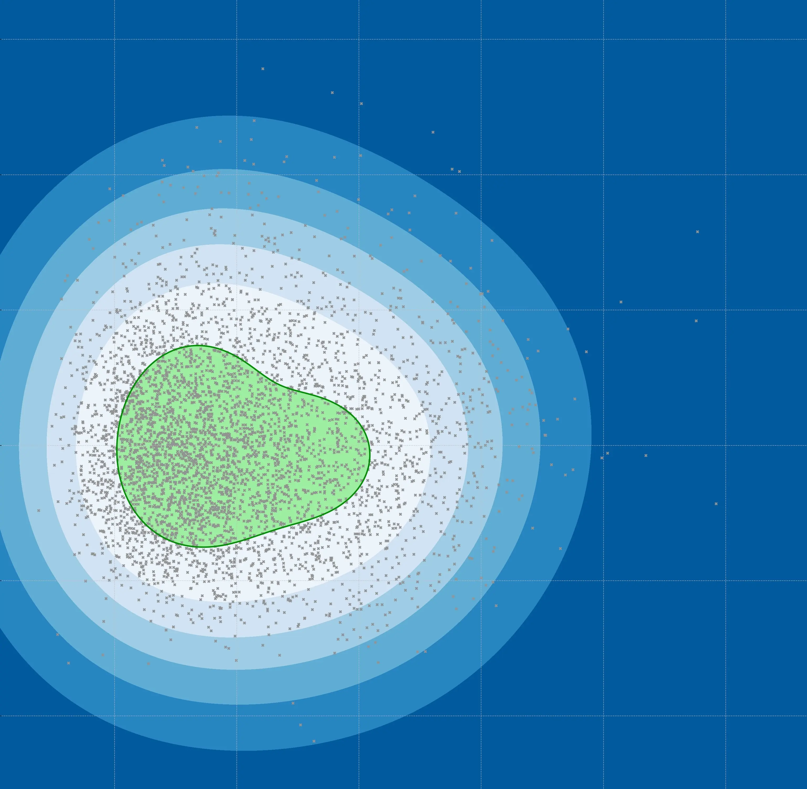
Illustration du type de graphique que je souhaite afficher.

## Objectifs du Sprint 1

Voici les objectifs que je me suis fixé :

- Créer une maquette esthétique sur Figma (★☆☆☆☆, **2 heures estimées**)
- Créer un logo pour mon site Web (★☆☆☆☆, **0 heure 30 estimée**)
- Créer la page d'accueil en HTML (★☆☆☆☆, **1 heure 30 estimée**)
- Créer le fichier CSS sur le header (★★☆☆☆, **2 heures estimées**)
- Créer le fichier CSS sur le body de l'accueil (★★☆☆☆, **2 heures estimées**)
- Créer la page FAQ en HTML (★☆☆☆☆, **0 heure 30 estimée**)
- Créer le fichier CSS associé à la page FAQ (★☆☆☆☆, **0 heure 30 estimée**)
- Créer la page principale en HTML (★☆☆☆☆, **0 heure 30 estimée**)
- Créer le fichier CSS associé à la page principale (★☆☆☆☆, **0 heure 30 estimée**)

TOTAL : 10 heures

Les étoiles correspondent au niveau de difficulté de l'objectif dans mon référentiel de débutant en DevWeb.

## Objectifs du Sprint 2

Voici les gros objectifs que je me suis fixé :

- Lier l'API de Spotify avec mon site
- Travailler sur les différentes fonctionnalités d'affichage de données de l'utlisateur en lien avec son compte Spotify

Ces objectifs servent de fil conducteur pour la logique de mon POK, les objectifs précis seront détailles à la fin du Sprint 1.

## Maquette Figma

Avant de partir dans tous les sens, il est nécessaire de cadrer le projet en amont. Mon but est d'offrir à l'utilisateur une expérience simple et personnalisée.

Je choisis en premier lieu une interface simple et épurée. Afin de rappeler la proximité de mon service avec Spotify, je conserve en couleur secondaire la couleur du logo Spotify : #1ED760.

Je crée aussi un logo se basant sur la forme ronde du logo Spotify, mais en y incluant un rappel de statistiques au travers des courbes de tendances. Je choisis ainsi le nom de mon service : **Spotistats**.

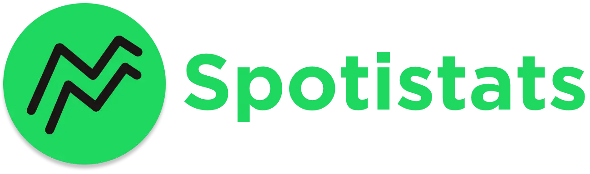

Je choisis ensuite le type de boutons de ma page Web. Je télécharge les icones sur le site [Flaticon](https://www.flaticon.com/). J'utilise le pack d'icônes [*Outline*](https://www.flaticon.com/authors/icongeek26/outline?author_id=296&type=standard) créé par Icongeek26.

Je définis les composantes de mes pages :

- les boutons seront des rectangles de 330px*65px, avec des bords arrondis de 38px.


- le header fait 1440px*120px, de couleur #25242F, avec une ombre portée grise.

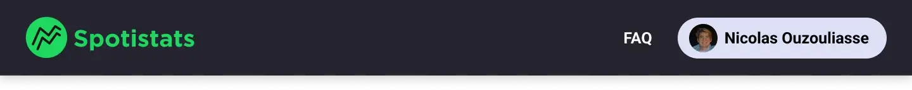

- la page fait 1440px*1024px (dimension Desktop), de couleur #25242F qui rappelle le mode sombre sur Spotify. Les titres de section sont écrits avec la police Gotham de couleur #1ED760, tandis que le corps de texte est blanc en Roboto Light de 25px.

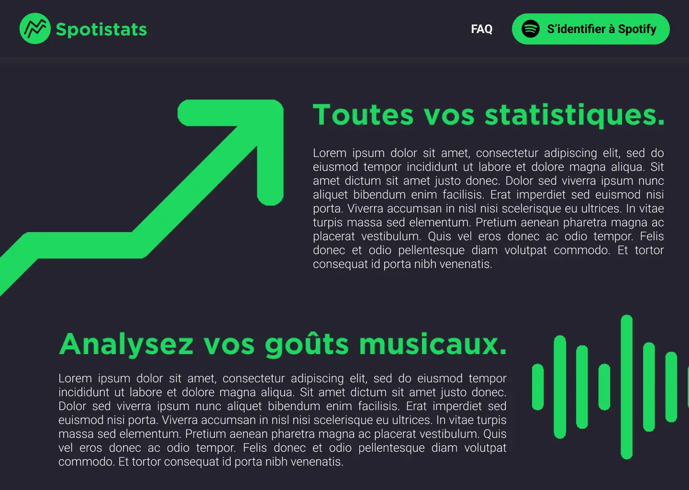

Ma maquette Figma est accessible [ici](https://www.figma.com/file/Rx2sAj4SSzLNnZjNFwKq6O/Spotistats?type=design&node-id=0%3A1&mode=design&t=T7OGaQuYW9phVxnz-1).

## Création des pages du site en HTML et en CSS

Rien de très intéressant à ajouter dans cette partie, si ce n'est que je vais transformer la maquette Figma en HTML et en CSS.

Voici le résultat pour la page d'accueil :
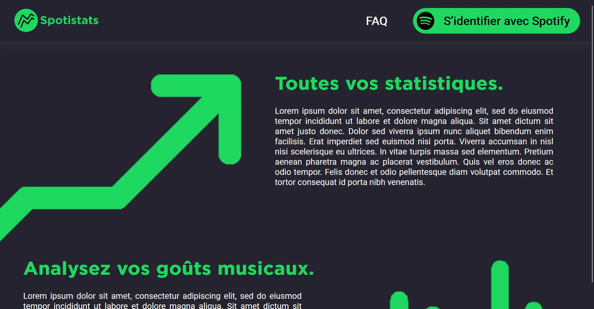



```html
<!DOCTYPE html>
<html lang="fr">
    <head>
        <meta charset="utf-8">
        <title>Accueil - Spotistats 📈</title>
        <link href="styles.css" rel="stylesheet">
        <link rel="preconnect" href="https://fonts.googleapis.com">
        <link rel="preconnect" href="https://fonts.gstatic.com" crossorigin>
        <link href="https://fonts.googleapis.com/css2?family=Roboto&display=swap" rel="stylesheet">
    </head>
    <body>
        <header>
            
            <a class="FAQ" href="FAQ.html">FAQ</a>
            <button class="Connexion">
                
                <span class="ButtonText">S’identifier avec Spotify</span>
            </button>
        </header>

        <div class="container">
            
            <div class="column">
                <h1> Toutes vos statistiques.</h1>
                <p>Lorem ipsum dolor sit amet, consectetur adipiscing elit, 
                    sed do eiusmod tempor incididunt ut labore et dolore magna aliqua. 
                    Sit amet dictum sit amet justo donec. Dolor sed viverra ipsum nunc aliquet 
                    bibendum enim facilisis. Erat imperdiet sed euismod nisi porta. Viverra 
                    accumsan in nisl nisi scelerisque eu ultrices. In vitae turpis massa sed elementum. 
                    Pretium aenean pharetra magna ac placerat vestibulum. Quis vel eros donec ac odio tempor. 
                    Felis donec et odio pellentesque diam volutpat commodo. Et tortor consequat id porta nibh
                    venenatis.
                </p>
            </div>
        </div>

        <div class="container2">
            <div class="column2">
                <h1> Analysez vos goûts musicaux.</h1>
                <p class="parap2">Lorem ipsum dolor sit amet, consectetur adipiscing elit, 
                    sed do eiusmod tempor incididunt ut labore et dolore magna aliqua. 
                    Sit amet dictum sit amet justo donec. Dolor sed viverra ipsum nunc aliquet 
                    bibendum enim facilisis. Erat imperdiet sed euismod nisi porta. Viverra 
                    accumsan in nisl nisi scelerisque eu ultrices. In vitae turpis massa sed elementum. 
                    Pretium aenean pharetra magna ac placerat vestibulum. Quis vel eros donec ac odio tempor. 
                    Felis donec et odio pellentesque diam volutpat commodo. Et tortor consequat id porta nibh
                    venenatis.
                </p>
            </div>
            
        </div>
        
    </body>
</html>
```





```css
body {
    margin: 0;
    padding: 0;
    background-color: #25242F;
    display: flex;
    flex-direction: column;
}

header {
    display: flex;
    justify-content: space-between;
    align-items: center;
    background-color: #25242F;
    height: 90px;
    padding: 0 30px;
    box-shadow: 0 4px 17px rgba(81, 95, 95, 0.25);
}

.logo {
    margin-right: 30px;
}

.FAQ {
    order: 1;
    font-size: 25px;
    font-weight: bolder;
    font-family: 'Roboto', sans-serif;
    color: #FFFFFF;
    text-decoration: none;
    justify-content: center;
    margin-left: 520px;
}

button.Connexion {
    order: 2;
    display: flex;
    align-items: center;
    justify-content: flex-end;
    text-align: right;
    font-size: 25px;
    font-weight: bolder;
    background-color: #1ed760;
    font-family: 'Roboto', sans-serif;
    border: none;
    border-radius: 38px;
    width: 360px;
    height: 55px;
    margin-left: 30px;
}

.ButtonText {
    margin-right: 18px;
    margin-left: 10px;
    font-weight: bold;
}

button.Connexion img {
    margin-right: 10px;
}

button:hover {
    box-shadow: 6px 6px 10px rgba(0, 0, 0, 0.5);
}

@font-face {
    font-family: 'Gotham-Bold';
    src: url('Spotify-Font/Gotham-Bold.otf') format('opentype');
    font-weight: normal;
    font-style: normal;
}

.container {
    display: flex;
    flex-direction: row;
    justify-content:flex-start;
    align-self: center;
}

.column {
    display: flex;
    flex-direction: column;
    margin-top: 40px;
    margin-left: 70px;
    width: 650px;
    margin-right: 50px;
}

h1 {
    font-family: 'Gotham-Bold', sans-serif;
    font-size: 40px;
    color: #1ed760;
    margin-bottom: 10px;
}

p {
    font-family: 'Roboto', sans-serif;
    color: #FFFFFF;
    font-size: large;
    width: 600px;
    text-align: justify;
}

.arrow {
    width: 41.6%;
    height: 41.4%;
    margin-top: 70px;
}

.sound {
    width: 55%;
    height: 55%;
    margin-top: 30px;
}

.container2 {
    display: flex;
    flex-direction: row;
    justify-content: flex-start;
    align-self: center;
}

.column2 {
    display: flex;
    flex-direction: column;
    margin-top: 0px;
    margin-left: 50px;
    margin-right: 30px;
    width: 950px;
}

.parap2{
    width:950px;
}

```



Le seul problème est qu'au scroll, le header est aussi scrollé. J'ai décidé de mettre un `position: fixed;` pour régler ce problème, mais cela décale toutes mes marges. Pour l'instant, je décide de rester comme ça.

### Apparition du pop-up de connexion

Et oui, il faut pouvoir se connecter à son compte Spotify pour accéder aux fonctionnalités de mon super site. Le bouton Connexion n'est à l'heure actuelle pas encore cliquable.

Pour ce faire, j'avais deux solutions : de l'HTML pur ou du JavaScript. J'opte pour la deuxième option sur les conseil de [William Lalanne](https://www.instagram.com/william.lalanne/). Je ne suis pas spécialement familier du langage, mais après quelques explications et quelques recherches, je comprends la philosophie des variables et des fonctions, qui ressemblent pas mal à Python.

Il y a deux parties à prendre en compte :

- lorsque le bouton est cliqué, il faut faire apparaître un pop-up demandant à l'utilisateur l'adresse e-mail associée à son compte Spotify et son mot de passe.
- un écran noir doit aussi apparaître en-dessous du pop-up afin de faciliter la différienciation des fenêtres.

J'ai donc réalisé ces fonctionnalités. J'ai rajouté dans l'HTML un petit script qui permet d'effacer à chaque *refresh* les données précédentes contenues dans les champs à remplir.
J'ai aussi mis en forme le texte du mot de passe pour qu'il soit crypté.

Petit regret : j'ai eu la flemme de créer une box pour la position de la croix dans le *content*, je l'ai fait à la position absolue, peut-être que je regretterai après.

Deuxième petit regret (décidément) : pour l'instant, il n'y a que le bouton fermer qui ferme le pop-up, il faudrait rajouter la possibilité de cliquer autre part.

A noter que la page ne fait rien avec l'e-mail et le mot de passe, cela viendra dans le Sprint 2 en utilisant l'API.



```html
<!DOCTYPE html>
<html lang="fr">
    <head>
        <meta charset="utf-8">
        <title>Accueil - Spotistats 📈</title>
        <link href="styles.css" rel="stylesheet">
        <link rel="preconnect" href="https://fonts.googleapis.com">
        <link rel="preconnect" href="https://fonts.gstatic.com" crossorigin>
        <link href="https://fonts.googleapis.com/css2?family=Roboto&display=swap" rel="stylesheet">
        <script>
            window.onload = function () {
                // Réinitialiser les champs input lors du chargement de la page
                var emailInput = document.getElementById('email');
                var mdpInput = document.getElementById('mdp');

                if (emailInput && mdpInput) {
                    emailInput.value = '';
                    mdpInput.value = '';
                }
            };
        </script>
    </head>
    <body>
        <header>
            
            <a class="FAQ" href="FAQ.html">FAQ</a>
            <button onclick="afficherEcran_noir()" class="Connexion">
                
                <span class="ButtonText">S’identifier avec Spotify</span>
            </button>
        </header>

        <div class="container">
            
            <div class="column">
                <h1> Toutes vos statistiques.</h1>
                <p>Lorem ipsum dolor sit amet, consectetur adipiscing elit, 
                    sed do eiusmod tempor incididunt ut labore et dolore magna aliqua. 
                    Sit amet dictum sit amet justo donec. Dolor sed viverra ipsum nunc aliquet 
                    bibendum enim facilisis. Erat imperdiet sed euismod nisi porta. Viverra 
                    accumsan in nisl nisi scelerisque eu ultrices. In vitae turpis massa sed elementum. 
                    Pretium aenean pharetra magna ac placerat vestibulum. Quis vel eros donec ac odio tempor. 
                    Felis donec et odio pellentesque diam volutpat commodo. Et tortor consequat id porta nibh
                    venenatis.
                </p>
            </div>
        </div>

        <div class="container2">
            <div class="column2">
                <h1> Analysez vos goûts musicaux.</h1>
                <p>Lorem ipsum dolor sit amet, consectetur adipiscing elit, 
                    sed do eiusmod tempor incididunt ut labore et dolore magna aliqua. 
                    Sit amet dictum sit amet justo donec. Dolor sed viverra ipsum nunc aliquet 
                    bibendum enim facilisis. Erat imperdiet sed euismod nisi porta. Viverra 
                    accumsan in nisl nisi scelerisque eu ultrices. In vitae turpis massa sed elementum. 
                    Pretium aenean pharetra magna ac placerat vestibulum. Quis vel eros donec ac odio tempor. 
                    Felis donec et odio pellentesque diam volutpat commodo. Et tortor consequat id porta nibh
                    venenatis.
                </p>
            </div>
            
        </div>
        
        <div id="ecran_noir" class="ecran_noir">
            <div class="ecran_noir-content">
                <span class="close" onclick="fermerEcran_noir()">&times;</span>
                <label for="email">Adresse e-mail liée à votre compte Spotify :</label>
                <input type="email" id="email" name="email" required>
                <label for="mdp">Mot de passe :</label>
                <input type="password" id="mdp" name="mdp" required>
                <button class="check_id" onclick="submitForm()">Connexion</button>
            </div>
        </div>
    
        <script>
            function afficherEcran_noir() {
                var ecran_noir = document.getElementById('ecran_noir');
                ecran_noir.style.display = 'block';
            }
    
            function fermerEcran_noir() {
                var ecran_noir = document.getElementById('ecran_noir');
                ecran_noir.style.display = 'none';
            }
    
            function submitForm() {
                var emailValue = document.getElementById('email').value;
                var mdpValue = document.getElementById('mdp').value;
        
                fermerEcran_noir()
            }
        </script>

    </body>
</html>
```





```css
body {
    margin: 0;
    padding: 0;
    background-color: #25242F;
    display: flex;
    flex-direction: column;
}

header {
    display: flex;
    justify-content: space-between;
    align-items: center;
    background-color: #25242F;
    height: 90px;
    padding: 0 30px;
    box-shadow: 0 4px 17px rgba(81, 95, 95, 0.25);
}

.logo {
    margin-right: 30px;
}

.FAQ {
    order: 1;
    font-size: 25px;
    font-weight: bolder;
    font-family: 'Roboto', sans-serif;
    color: #FFFFFF;
    text-decoration: none;
    justify-content: center;
    margin-left: 520px;
}

button.Connexion {
    order: 2;
    display: flex;
    align-items: center;
    justify-content: flex-end;
    text-align: right;
    font-size: 25px;
    font-weight: bolder;
    background-color: #1ed760;
    font-family: 'Roboto', sans-serif;
    border: none;
    border-radius: 38px;
    width: 360px;
    height: 55px;
    margin-left: 30px;
    cursor:pointer;
}

.ButtonText {
    margin-right: 18px;
    margin-left: 10px;
    font-weight: bold;
}

button.Connexion img {
    margin-right: 10px;
}

button:hover {
    box-shadow: 6px 6px 10px rgba(0, 0, 0, 0.5);
}

@font-face {
    font-family: 'Gotham-Bold';
    src: url('Spotify-Font/Gotham-Bold.otf') format('opentype');
    font-weight: normal;
    font-style: normal;
}

.container {
    display: flex;
    flex-direction: row;
    justify-content:flex-start;
    align-self: center;
}

.column {
    display: flex;
    flex-direction: column;
    margin-top: 40px;
    margin-left: 70px;
    width: 650px;
    margin-right: 50px;
}

h1 {
    font-family: 'Gotham-Bold', sans-serif;
    font-size: 40px;
    color: #1ed760;
    margin-bottom: 10px;
}

p {
    font-family: 'Roboto', sans-serif;
    color: #FFFFFF;
    font-size: large;
    width: 600px;
    text-align: justify;
}

.arrow {
    width: 41.6%;
    height: 41.4%;
    margin-top: 70px;
}

.sound {
    width: 55%;
    height: 55%;
    margin-top: 30px;
}

.container2 {
    display: flex;
    flex-direction: row;
    justify-content: flex-start;
    align-self: center;
}

.column2 {
    display: flex;
    flex-direction: column;
    margin-top: 0px;
    margin-left: 50px;
    margin-right: 30px;
    width: 950px;
}

.parap2{
    width:950px;
}

.ecran_noir {
    display: none;
    position: fixed;
    z-index: 1;
    left: 0;
    top: 0;
    width: 100%;
    height: 100%;
    overflow: auto;
    background-color: rgba(0, 0, 0, 0.8);
}

.ecran_noir-content {
    background-color: #25242F;
    margin: 10% auto;
    padding: 20px;
    border: 1px solid #888;
    border-radius: 10px;
    width: 50%;
    color: #FFFFFF;
    font-family: 'Gotham-Bold', sans-serif;
}

label {
    display: block;
    margin-bottom: 10px;
}

input {
    width: 100%;
    padding: 10px;
    margin-bottom: 20px;
    box-sizing: border-box;
}

.check_id {
    background-color: #1ed760;
    color: #FFFFFF;
    border: none;
    padding: 15px;
    border-radius: 5px;
    cursor: pointer;
    font-family: 'Gotham-Bold', sans-serif;
}

button:hover {
    background-color: #149754; /* Changement de couleur au survol */
}


.close {
    color: #aaa;
    float: right;
    font-size: 28px;
    font-weight: bold;
    position: absolute;
    top: 140px;
    right: 320px;
}

.close:hover,
.close:focus {
    color: black;
    text-decoration: none;
    cursor: pointer;
}
```



Je vais maintenant créer la page FAQ, ce qui devrait être assez rapide.



```html
<!DOCTYPE html>
<html lang="fr">
    <head>
        <meta charset="utf-8">
        <title>FAQ - Spotistats ❓</title>
        <link href="stylesFAQ.css" rel="stylesheet">
        <link rel="preconnect" href="https://fonts.googleapis.com">
        <link rel="preconnect" href="https://fonts.gstatic.com" crossorigin>
        <link href="https://fonts.googleapis.com/css2?family=Roboto&display=swap" rel="stylesheet">
        <script>
            window.onload = function () {
                var emailInput = document.getElementById('email');
                var mdpInput = document.getElementById('mdp');
    
                if (emailInput && mdpInput) {
                    emailInput.value = '';
                    mdpInput.value = '';
                }
            };
        </script>
    </head>
    <body>
        <header>
            
            <a class="FAQ" href="FAQ.html">FAQ</a>
            <button onclick="afficherEcran_noir()" class="Connexion">
                
                <span class="ButtonText">S’identifier avec Spotify</span>
            </button>
        </header>
        <h1>Pourquoi dois-je me connecter à mon compte Spotify ?</h1>
        <p>La connexion à votre compte Spotify est nécessaire afin d'avoir accès à vos données d'écoute.
            L'accès à vos données permet l'analyse de vos goûts musicaux.
        </p>
        <h1>Que faites-vous de mes données de connexion Spotify ?</h1>
        <p>Vos données de connexion ne sont pas stockées mais seulement utilisées par notre service.
            Nous validons l'authentification grâce à l'API Spotify, qui elle se charge d'évaluer 
            la corrélation entre votre adresse mail et le mot de passe indiqué.
        </p>
        <h1>Est-il possible de regarder les données de quelqu'un d'autre ?</h1>
        <p>Pour des raisons de sécurité, il n'est pas possible de consulter les analyse Spotistats
            d'un autre individu. En effet, nous certifions l'authentification personnelle et la privatisation 
            de chaque résultat.
        </p>
        <h1>Sera-t'il possible dans l'avenir d'effectuer l'analyse sur Deezer ?</h1>
        <p>Ce n'est pas d'actualité pour le moment. Sinon on aura un problème de nom.</p>
    </body>

```





```css
body {
    margin: 0;
    padding: 0;
    background-color: #25242F;
    display: flex;
    flex-direction: column;
}

header {
    display: flex;
    justify-content: space-between;
    align-items: center;
    background-color: #25242F;
    height: 90px;
    padding: 0 30px;
    box-shadow: 0 4px 17px rgba(81, 95, 95, 0.25);
}

.logo {
    margin-right: 30px;
}

.FAQ {
    order: 1;
    font-size: 25px;
    font-weight: bolder;
    font-family: 'Roboto', sans-serif;
    color: #FFFFFF;
    text-decoration: none;
    justify-content: center;
    margin-left: 520px;
}

button.Connexion {
    order: 2;
    display: flex;
    align-items: center;
    justify-content: flex-end;
    text-align: right;
    font-size: 25px;
    font-weight: bolder;
    background-color: #1ed760;
    font-family: 'Roboto', sans-serif;
    border: none;
    border-radius: 38px;
    width: 360px;
    height: 55px;
    margin-left: 30px;
    cursor:pointer;
}

.ButtonText {
    margin-right: 18px;
    margin-left: 10px;
    font-weight: bold;
}

button.Connexion img {
    margin-right: 10px;
}

button:hover {
    box-shadow: 6px 6px 10px rgba(0, 0, 0, 0.5);
}

@font-face {
    font-family: 'Gotham-Bold';
    src: url('Spotify-Font/Gotham-Bold.otf') format('opentype');
    font-weight: normal;
    font-style: normal;
}

h1 {
    font-family: 'Gotham-Bold', sans-serif;
    font-size: 40px;
    color: #1ed760;
    margin-bottom: 0px;
    margin-left: 40px;
}

p{
    font-family: 'Gotham', sans-serif;
    color:#FFFFFF;
    font-size:20px;
    margin-left: 40px;
    margin-right:40px;    
}

.ecran_noir {
    display: none;
    position: fixed;
    z-index: 1;
    left: 0;
    top: 0;
    width: 100%;
    height: 100%;
    overflow: auto;
    background-color: rgba(0, 0, 0, 0.8);
}

.ecran_noir-content {
    background-color: #25242F;
    margin: 10% auto;
    padding: 20px;
    border: 1px solid #888;
    border-radius: 10px;
    width: 50%;
    color: #FFFFFF;
    font-family: 'Gotham-Bold', sans-serif;
}

label {
    display: block;
    margin-bottom: 10px;
}

input {
    width: 100%;
    padding: 10px;
    margin-bottom: 20px;
    box-sizing: border-box;
}

.check_id {
    background-color: #1ed760;
    color: #FFFFFF;
    border: none;
    padding: 15px;
    border-radius: 5px;
    cursor: pointer;
    font-family: 'Gotham-Bold', sans-serif;
}

button:hover {
    background-color: #149754;
}


.close {
    color: #aaa;
    float: right;
    font-size: 28px;
    font-weight: bold;
    position: absolute;
    top: 140px;
    right: 320px;
}

.close:hover,
.close:focus {
    color: black;
    text-decoration: none;
    cursor: pointer;
}
```



Je n'ai pas eu le temps de faire la page principale car les autres m'ont pris plus de temps. Cependant, j'ai déjà défini tous les styles que j'utilise et cela me prendra beaucoup plus de temps.

## Retour d'expérience du Sprint 1

J'ai finalisé presque tous les objectifs que je m'étais fixé, à l'exception de la page principale en HTML et CSS. Je le ferai donc au Sprint 2.
J'ai effectué une autre tâche à la place : le pop-up de connexion en JavaScript, cela m'a pris une heure et demi, donc je respecte le planning qui m'était fixé.
Pas de point dur particulier.

## Objectifs du Sprint 2 rationnalisés

Voici les objectifs que je me suis fixé pour le Sprint 2 :

- Créer la page principale en HTML et y définir les styles en CSS (★☆☆☆☆, **1 heure estimée**)
- Documentation sur les API de Spotify, leur intégration et leurs features (★☆☆☆☆, **2 heures estimées**)
- Lier l'API de Spotify avec mon bouton Connexion (★★★☆☆, **2 heures estimées**)
- Comprendre comment récupérer les données de l'utilisateur qui s'est connecté (★★★☆☆, **2 heures estimées**)
- Rechercher les visualisations de données musicales existantes, et lesquelles sont pertinentes dans mon cas (★☆☆☆☆, **0 heure 30 estimée**)
- Déterminer quelle technologie utiliser pour la visualisation (★☆☆☆☆, **0 heure 30 estimée**)
- Réaliser une première visualisation des données de l'utilisateur, sous une forme à préciser (★★★☆☆, **2 heures estimées**)

C'est possible que je ne puisse pas effectuer la partie de connexion avec l'API. Les objectifs suivants sont décorrélés ce qui me permettra d'avancer dans tous les cas.

## Sprint 2

Création de la page principale; c'est-à-dire la page d'analyse de l'utilisateur, en HTML et en CSS.



```html
<!DOCTYPE html>
<html lang="fr">
    <head>
        <meta charset="utf-8">
        <title>Analyse - Spotistats ✅</title>
        <link href="stylesAnalyse.css" rel="stylesheet">
        <link rel="preconnect" href="https://fonts.googleapis.com">
        <link rel="preconnect" href="https://fonts.gstatic.com" crossorigin>
        <link href="https://fonts.googleapis.com/css2?family=Roboto&display=swap" rel="stylesheet">
    </head>
    <body>
        <header>
            <a href="Accueil.html" style="width: 15%; height: 60%;">
                
            </a>
            <a class="FAQ" href="FAQ.html">FAQ</a>
            <button onclick="afficherEcran_noir()" class="Connexion">
                
                <span class="ButtonText">Nicolas Ouzouliasse</span>
            </button>
        </header>

        <div class="container">
            <div class="column">
                <h1> Votre overview.</h1>
                <p>
                <li>
                    Lorem ipsum dolor sit amet, consectetur adipiscing elit, 
                    sed do eiusmod tempor incididunt ut labore et dolore magna aliqua.
                </li> 
                <li>
                    Sit amet dictum sit amet justo donec. Dolor sed viverra ipsum nunc aliquet 
                    ibendum enim facilisis.
                </li>
                <li>
                    Erat imperdiet sed euismod nisi porta. Viverra accumsan in nisl nisi scelerisque eu 
                    ultrices.
                    In vitae turpis massa sed elementum.
                </li>
                <li>Pretium aenean pharetra magna ac placerat vestibulum. Quis vel eros 
                    donec ac odio tempor.</li>
                <li>Felis donec et odio pellentesque diam volutpat commodo. 
                    Et tortor consequat id porta nibh venenatis.</li>  
                </p>
            </div>
            
        </div>

        <div class="container2">
            
            <div class="column2">
                <h1> Vos goûts musicaux.</h1>
                <p><li>
                    Lorem ipsum dolor sit amet, consectetur adipiscing elit, 
                    sed do eiusmod tempor incididunt ut labore et dolore magna aliqua.
                </li> 
                <li>
                    Sit amet dictum sit amet justo donec. Dolor sed viverra ipsum nunc aliquet 
                    ibendum enim facilisis.
                </li>
                <li>
                    Erat imperdiet sed euismod nisi porta. Viverra accumsan in nisl nisi scelerisque eu 
                    ultrices.
                    In vitae turpis massa sed elementum.
                </li>
                <li>Pretium aenean pharetra magna ac placerat vestibulum. Quis vel eros 
                    donec ac odio tempor.</li>
                <li>Felis donec et odio pellentesque diam volutpat commodo. 
                    Et tortor consequat id porta nibh venenatis.</li>
                </p>
            </div>
            
        </div>
        
 

    </body>
</html>

```





```css
body {
    margin: 0;
    padding: 0;
    background-color: #25242F;
    display: flex;
    flex-direction: column;
}

header {
    display: flex;
    justify-content: space-between;
    align-items: center;
    background-color: #25242F;
    height: 90px;
    padding: 0 30px;
    box-shadow: 0 4px 17px rgba(81, 95, 95, 0.25);
}

.logo {
    margin-right: 30px;
}

.FAQ {
    order: 1;
    font-size: 25px;
    font-weight: bolder;
    font-family: 'Roboto', sans-serif;
    color: #FFFFFF;
    text-decoration: none;
    justify-content: center;
    margin-left: 520px;
}

button.Connexion {
    order: 2;
    display: flex;
    align-items: center;
    justify-content: flex-end;
    text-align: right;
    font-size: 25px;
    font-weight: bolder;
    background-color: #dee0f6;
    font-family: 'Roboto', sans-serif;
    border: none;
    border-radius: 38px;
    width: 330px;
    height: 55px;
    margin-left: 30px;
    cursor:pointer;
}

.ButtonText {
    margin-right: 18px;
    margin-left: 10px;
    font-weight: bold;
}

button.Connexion img {
    margin-right: 10px;
}

button:hover {
    box-shadow: 6px 6px 10px rgba(0, 0, 0, 0.5);
}

@font-face {
    font-family: 'Gotham-Bold';
    src: url('Spotify-Font/Gotham-Bold.otf') format('opentype');
    font-weight: normal;
    font-style: normal;
}

.container {
    display: flex;
    flex-direction: row;
    justify-content:flex-start;
    align-self: center;
}

.column {
    display: flex;
    flex-direction: column;
    margin-top: 40px;
    margin-left: 70px;
    width: 660px;
    margin-right: 50px;
}

h1 {
    font-family: 'Gotham-Bold', sans-serif;
    font-size: 40px;
    color: #1ed760;
    margin-bottom: 10px;
    margin-left: 40px;
}

p {
    font-family: 'Roboto', sans-serif;
    color: #FFFFFF;
    font-size: large;
    width: 650px;
    text-align: justify;
    margin-right: 0px;
}

li {
    font-family: 'Roboto', sans-serif;
    color: #FFFFFF;
    font-size: large;
    width: 650px;
    text-align: justify;
    margin-right: 0px;
    margin-left:40px;
}

.spectre {
    width: 30%;
    height: 30%;
    margin-top: 70px;
    margin-left: 40px;
    margin-right: 40px;
    border-radius: 15px;
    margin-bottom: 20px;
}

.graphe{
    width: 45%;
    height: 45%;
    margin-top: 120px;
    margin-left: 40px;
    border-radius: 15px;
}

.container2 {
    display: flex;
    flex-direction: row;
    justify-content: flex-start;
    align-self: center;
}

.column2 {
    display: flex;
    flex-direction: column;
    margin-top: 0px;
    margin-left: 40px;
    margin-right: 30px;
    width: 950px;
}
```



### Documentation sur l'API Spotify

Je vais vraisemblablement devoir adapter mon code HTML d'authentification pour qu'il utilise le système d'authentification de l'API. Je vais devoir créer un fichier .JS permettant de gérer cette fonctionnalité. Spotify dispose d'une interface destinée aux développeurs permettant d'avoir accès à des ressources très utiles : plusieurs explications et tutoriels, mais aussi de créer une App fournissant les *Client ID* and *Client Secret* permettant *in fine* d'accéder à un *access token*.
L'*access token* est un string qui contient les informations d'identification et les autorisations qui peuvent être utilisées pour accéder à une ressource donnée (par exemple, artistes ou albums) ou aux données de l'utilisateur (par exemple son profil).

Pour résumer, voici la logique que je vais suivre pour mener à bien mon projet :

- Créer une app sur le [Dashboard Spotify](https://developer.spotify.com/dashboard/create)
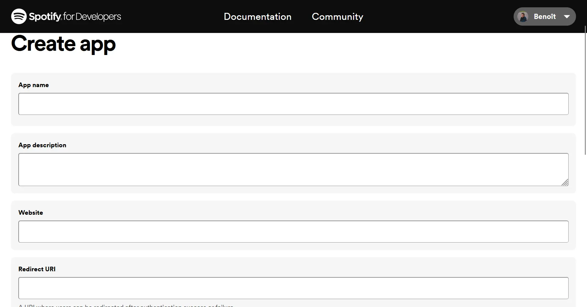

- Récupérer le *Client ID* et le *Client Secret*
- Demander un *access token*
- A partir de l'*access token*, écrire les requêtes nécessaires pour récupérer les données de l'utilisateur.
- Appeler l'API

### Mise en pratique

Une fois l'app créée, je peux récupérer le *Client ID* directement dans les paramètres de l'app :
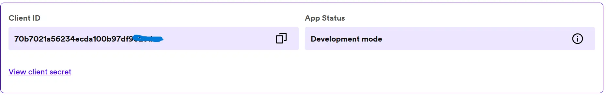

et aussi le *Client Secret* :
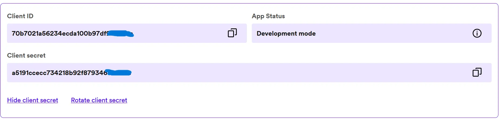

Une fois que ces codes ont été récupérés, il est possible de faire une requête en [cURL](https://curl.se/) (un outil de ligne de commande en open source) pour obtenir l'*Access Token*.

```shell
curl -X POST "https://accounts.spotify.com/api/token" \
     -H "Content-Type: application/x-www-form-urlencoded" \
     -d "grant_type=client_credentials&client_id=70b7021a56234ecda100b97df93*****&client_secret=a5191ccecc734218b92f879346*****"

```

Je n'ai jamais réussi à installer cUrl, donc en modifiant les commandes pour pouvoir les exécuter dans PowerShell, j'obtiens:

```shell
Invoke-RestMethod -Uri "https://accounts.spotify.com/api/token" -Method Post `
>>     -Headers @{
>>         "Content-Type" = "application/x-www-form-urlencoded"
>>     } `
>>     -Body @{
>>         "grant_type"    = "client_credentials"
>>         "client_id"     = "70b7021a56234ecda100b97df9******"
>>         "client_secret" = "a5191ccecc734218b92f879346******"
>>     } 
    
access_token
------------
BQBf8bmbQ36w84jhmPm6zyN7CuzaekzLF6bwVCpgpiQO-RgRfPssBD198d49BRQiO6sLyADRMaRVfjpzsknWo6JLYta4ZkaK*****... 
```

J'ai ainsi l'*Access token* qui me permet d'interagir avec l'API.

Je vais maintenant m'attacher à appeler l'API dans un programme JavaScript, afin que lorsque l'utilisateur se connecte avec son compte, des informations basiques apparaissent.
Il est important de rappeler que pour l'instant, je n'ai créé que du **Front-End**. Je vais créer à l'aide de [Vite](https://github.com/vitejs/vite) un serveur de développement.

```shell
npm create vite@latest spotistats -- --template vanilla

cd spotistats
npm install
npm run dev 
```

Dans le fichier index.html créé par cette commande Vite, j'ai inséré le contenu de la page Analyse.html, et j'ai fait référence à un script JS que l'on créera ensuite. J'ai ensuite modifié son contenu pour en faire une page dynamique et non statique : par exemple, le nom dans la box en haut à droite doit être celui de la personne connectée et non un string 'Nicolas Ouzouliasse'. J'utilise pour cela des attributs *id* tels que `<span id="displayName">` qui seront obtenus avec le script JS et l'appel à l'API.



```html
<!DOCTYPE html>
<html lang="fr">
    <head>
        <meta charset="utf-8">
        <title>Analyse - Spotistats ✅</title>
        <link href="stylesAnalyse.css" rel="stylesheet">
        <link rel="preconnect" href="https://fonts.googleapis.com">
        <link rel="preconnect" href="https://fonts.gstatic.com" crossorigin>
        <link href="https://fonts.googleapis.com/css2?family=Roboto&display=swap" rel="stylesheet">
        <script src="src/script.js" type="module"></script>
    </head>
    <body>
        <header>
            <a href="Accueil.html" style="width: 15%; height: 60%;">
                
            </a>
            <a class="FAQ" href="FAQ.html">FAQ</a>
            <button onclick="afficherEcran_noir()" class="Connexion">
                <span id="avatar" width="38" height="39"></span>
                <span class="ButtonText"><span id="displayName"></span></span>
            </button>
        </header>

        <div class="container">
            <div class="column">
                <h1> Votre overview.</h1>
                <p>
                <li>
                    Lorem ipsum dolor sit amet, consectetur adipiscing elit, 
                    sed do eiusmod tempor incididunt ut labore et dolore magna aliqua.
                </li> 
                <li>
                    Sit amet dictum sit amet justo donec. Dolor sed viverra ipsum nunc aliquet 
                    ibendum enim facilisis.
                </li>
                <li>
                    Erat imperdiet sed euismod nisi porta. Viverra accumsan in nisl nisi scelerisque eu 
                    ultrices.
                    In vitae turpis massa sed elementum.
                </li>
                <li>Pretium aenean pharetra magna ac placerat vestibulum. Quis vel eros 
                    donec ac odio tempor.</li>
                <li>Felis donec et odio pellentesque diam volutpat commodo. 
                    Et tortor consequat id porta nibh venenatis.</li>  
                </p>
            </div>
            
        </div>

        <div class="container2">
            
            <div class="column2">
                <h1> Vos goûts musicaux.</h1>
                <p><li>
                    Lorem ipsum dolor sit amet, consectetur adipiscing elit, 
                    sed do eiusmod tempor incididunt ut labore et dolore magna aliqua.
                </li> 
                <li>
                    Sit amet dictum sit amet justo donec. Dolor sed viverra ipsum nunc aliquet 
                    ibendum enim facilisis.
                </li>
                <li>
                    Erat imperdiet sed euismod nisi porta. Viverra accumsan in nisl nisi scelerisque eu 
                    ultrices.
                    In vitae turpis massa sed elementum.
                </li>
                <li>Pretium aenean pharetra magna ac placerat vestibulum. Quis vel eros 
                    donec ac odio tempor.</li>
                <li>Felis donec et odio pellentesque diam volutpat commodo. 
                    Et tortor consequat id porta nibh venenatis.</li>
                </p>
            </div>
            
        </div>
        
 

    </body>
</html>

```



### Appel à l'API

Nous souhaitons maintenant appeler l'API, de manière automatique dans le script JS.
Extrait de la documentation [Spotify](https://developer.spotify.com/) :

- "Lorsque la page se charge, nous vérifions s'il y a un code dans le string de requête de rappel
- S'il n'y a pas de code, nous redirigerons l'utilisateur vers la page d'autorisation de Spotify.
- Une fois que l'utilisateur a autorisé l'application, Spotify le redirige vers notre application et nous lisons le code dans le string de requête.
- Nous utiliserons ce code pour demander un *access token* à l'API de Spotify
- Nous utiliserons l'*access token* pour appeler l'API Web afin d'obtenir les données du profil de l'utilisateur."

Je ne pourrais pas expliquer d'une manière plus claire. Pour vérifier l'authenticité de notre requête, nous générons un code unique, appelé *PKCE verifier* qui est stocké en local et qui va subir une transformation, un *hash* avec un algorithme. C'est ce code transformé qui va être envoyé dans la *user authorization request*.

J'ai aussi ajouté plusieurs fonctions grâce à la documentation :

- `redirectToAuthCodeFlow(clientId)`, qui permet de rediriger l'utilisateur à la page d'autorisation Spotify
- `getAccessToken(clientId, code)`, qui *challenge* le token généré
- `fetchProfile(token)`, qui appelle l'API et utilise la méthode GET pour obtenir les données d'intérêt
- `populateUI(profile)`, qui permet de récupérer et de remplir les données d'intérêt.



```shell
const clientId = "70b7021a56234ecda100b97df932edec";
const params = new URLSearchParams(window.location.search);
const code = params.get("code");


function generateCodeVerifier(length) {
    let text = '';
    let possible = 'ABCDEFGHIJKLMNOPQRSTUVWXYZabcdefghijklmnopqrstuvwxyz0123456789';

    for (let i = 0; i < length; i++) {
        text += possible.charAt(Math.floor(Math.random() * possible.length));
    }
    return text;
}

async function generateCodeChallenge(codeVerifier) {
    const data = new TextEncoder().encode(codeVerifier);
    const digest = await window.crypto.subtle.digest('SHA-256', data);
    return btoa(String.fromCharCode.apply(null, [...new Uint8Array(digest)]))
        .replace(/\+/g, '-')
        .replace(/\//g, '_')
        .replace(/=+$/, '');
}

if (!code) {
    redirectToAuthCodeFlow(clientId);
} else {
    const accessToken = await getAccessToken(clientId, code);
    const profile = await fetchProfile(accessToken);
    populateUI(profile);
}

export async function redirectToAuthCodeFlow(clientId) {
    const verifier = generateCodeVerifier(128);
    const challenge = await generateCodeChallenge(verifier);

    localStorage.setItem("verifier", verifier);

    const params = new URLSearchParams();
    params.append("client_id", clientId);
    params.append("response_type", "code");
    params.append("redirect_uri", "http://localhost:5173/callback");
    params.append("scope", "user-read-private user-read-email");
    params.append("code_challenge_method", "S256");
    params.append("code_challenge", challenge);

    document.location = `https://accounts.spotify.com/authorize?${params.toString()}`;
}

export async function getAccessToken(clientId, code) {
    const verifier = localStorage.getItem("verifier");

    const params = new URLSearchParams();
    params.append("client_id", clientId);
    params.append("grant_type", "authorization_code");
    params.append("code", code);
    params.append("redirect_uri", "http://localhost:5173/callback");
    params.append("code_verifier", verifier);

    const result = await fetch("https://accounts.spotify.com/api/token", {
        method: "POST",
        headers: { "Content-Type": "application/x-www-form-urlencoded" },
        body: params
    });

    const { access_token } = await result.json();
    return access_token;
}

async function fetchProfile(token) {
    const result = await fetch("https://api.spotify.com/v1/me", {
        method: "GET", headers: { Authorization: `Bearer ${token}` }
    });

    return await result.json();
}

function populateUI(profile) {
    document.getElementById("displayName").innerText = profile.display_name;
    if (profile.images[0]) {
        const profileImage = new Image(200, 200);
        profileImage.src = profile.images[0].url;
        document.getElementById("avatar").appendChild(profileImage);
        document.getElementById("imgUrl").innerText = profile.images[0].url;
    }
    document.getElementById("id").innerText = profile.id;
    document.getElementById("email").innerText = profile.email;
    document.getElementById("uri").innerText = profile.uri;
    document.getElementById("uri").setAttribute("href", profile.external_urls.spotify);
    document.getElementById("url").innerText = profile.href;
    document.getElementById("url").setAttribute("href", profile.href);
}
```



Après exécution d'un rapide `npm run dev` dans la console, j'obtiens le résultat suivant :
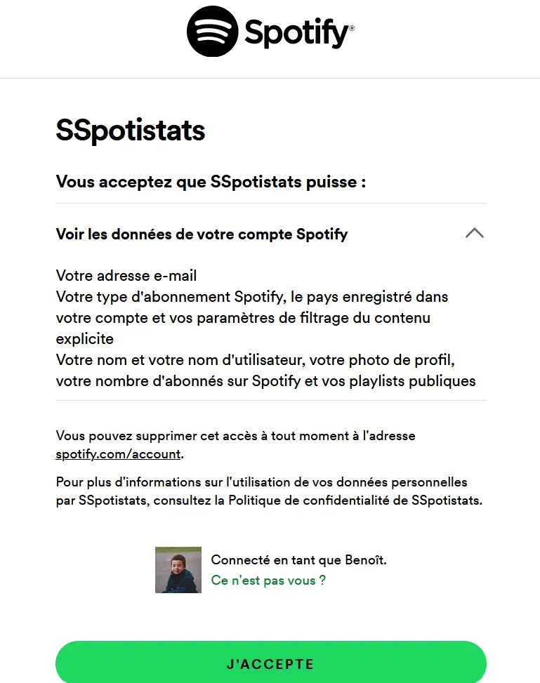
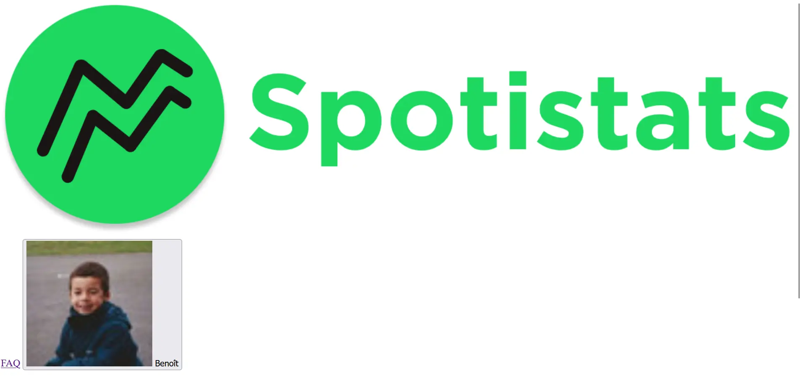

Au-delà du CSS qui est absent, j'obtiens bien la page d'authentification de Spotify appelée par l'API, et je suis effectivement redirigé ensuite vers la bonne page avec ma photo de profil et mon prénom récupérés sur mon compte Spotify.

### Recherche des visualisations de données musicales existantes, et lesquelles sont pertinentes dans mon cas

Je choisis d'abord, comme annoncé en préambule, de visualiser les genres de musiques écoutés par l'utilisateur sur un graphique. J'aimerais aussi afficher les 5 artistes favoris de l'utilisateur.

Enfin, la visualisation des paramètres des musiques pourrait être affiché de telle sorte :

Source de l'image : Researchgate

### Récupérer le top artiste et genres de l'utilisateur

Pour récupérer le top artiste et genres de l'utilisateur, la méthode précédente ne suffit pas : ce ne sont pas des *datas* remplies dans son profil, mais des *datas* qu'il faut extraire de manière dynamique avec une méthode *GET()*. Je modifie donc le script Javascript et je rajoute dans le code HTML une liste pour afficher les 5 top artistes.



```shell
const clientId = "70b7021a56234ecda100b97df932edec";
const params = new URLSearchParams(window.location.search);
const code = params.get("code");

function generateCodeVerifier(length) {
    let text = '';
    let possible = 'ABCDEFGHIJKLMNOPQRSTUVWXYZabcdefghijklmnopqrstuvwxyz0123456789';

    for (let i = 0; i < length; i++) {
        text += possible.charAt(Math.floor(Math.random() * possible.length));
    }
    return text;
}

async function generateCodeChallenge(codeVerifier) {
    const data = new TextEncoder().encode(codeVerifier);
    const digest = await window.crypto.subtle.digest('SHA-256', data);
    return btoa(String.fromCharCode.apply(null, [...new Uint8Array(digest)]))
        .replace(/\+/g, '-')
        .replace(/\//g, '_')
        .replace(/=+$/, '');
}

async function fetchTopArtists(token) {
    const apiUrl = 'https://api.spotify.com/v1/me/top/artists?time_range=medium_term&limit=5&offset=0';

    const result = await fetch(apiUrl, {
        method: 'GET',
        headers: {
            'Authorization': `Bearer ${token}`,
        },
    });

    return await result.json();
}

async function fetchTopTracks(token) {
    const apiUrl = 'https://api.spotify.com/v1/me/top/tracks?time_range=medium_term&limit=5&offset=0';

    const result = await fetch(apiUrl, {
        method: 'GET',
        headers: {
            'Authorization': `Bearer ${token}`,
        },
    });

    return await result.json();
}

if (!code) {
    redirectToAuthCodeFlow(clientId);
} else {
    const accessToken = await getAccessToken(clientId, code);
    const profile = await fetchProfile(accessToken);
    const topArtists = await fetchTopArtists(accessToken);
    const topTracks = await fetchTopTracks(accessToken);

    populateUI(profile, topArtists, topTracks);
}

export async function redirectToAuthCodeFlow(clientId) {
    const verifier = generateCodeVerifier(128);
    const challenge = await generateCodeChallenge(verifier);

    localStorage.setItem("verifier", verifier);

    const params = new URLSearchParams();
    params.append("client_id", clientId);
    params.append("response_type", "code");
    params.append("redirect_uri", "http://localhost:5173/callback");
    params.append("scope", "user-read-private user-read-email");
    params.append("code_challenge_method", "S256");
    params.append("code_challenge", challenge);

    document.location = `https://accounts.spotify.com/authorize?${params.toString()}`;
}

export async function getAccessToken(clientId, code) {
    const verifier = localStorage.getItem("verifier");

    const params = new URLSearchParams();
    params.append("client_id", clientId);
    params.append("grant_type", "authorization_code");
    params.append("code", code);
    params.append("redirect_uri", "http://localhost:5173/callback");
    params.append("code_verifier", verifier);

    const result = await fetch("https://accounts.spotify.com/api/token", {
        method: "POST",
        headers: { "Content-Type": "application/x-www-form-urlencoded" },
        body: params
    });

    const { access_token } = await result.json();
    return access_token;
}

async function fetchProfile(token) {
    const result = await fetch("https://api.spotify.com/v1/me", {
        method: "GET", headers: { Authorization: `Bearer ${token}` }
    });

    return await result.json();
}

function populateUI(profile, topArtists) {
    document.getElementById("displayName").innerText = profile.display_name;

    if (profile.images[0]) {
        const profileImage = new Image(200, 200);
        profileImage.src = profile.images[0].url;
        document.getElementById("avatar").appendChild(profileImage);
        document.getElementById("imgUrl").innerText = profile.images[0].url;
    }

    document.getElementById("id").innerText = profile.id;
    document.getElementById("email").innerText = profile.email;
    document.getElementById("uri").innerText = profile.uri;
    document.getElementById("uri").setAttribute("href", profile.external_urls.spotify);
    document.getElementById("url").innerText = profile.href;
    document.getElementById("url").setAttribute("href", profile.href);

    if (topArtists && topArtists.items) {
        const topArtistsList = document.getElementById("topArtistsList");
        topArtistsList.innerHTML = ""; 

        topArtists.items.forEach(artist => {
            const listItem = document.createElement("li");
            listItem.innerText = artist.name;
            topArtistsList.appendChild(listItem);
        });
    }

    if (topTracks && topTracks.items) {
        const topTracksList = document.getElementById("topTracksList");
        topTracksList.innerHTML = "";

        topTracks.items.forEach(track => {
            const listItem = document.createElement("li");
            listItem.innerText = `${track.name} - ${track.artists.map(artist => artist.name).join(', ')}`;
            topTracksList.appendChild(listItem);
        });
    }
}

```



et on adapte le code HTML pour intégrer les réponses de l'API : `topTracksList` et `topArtistsList`.



```shell
<!DOCTYPE html>
<html lang="fr">
    <head>
        <meta charset="utf-8">
        <title>Analyse - Spotistats ✅</title>
        <link href="stylesAnalyse.css" rel="stylesheet">
        <link rel="preconnect" href="https://fonts.googleapis.com">
        <link rel="preconnect" href="https://fonts.gstatic.com" crossorigin>
        <link href="https://fonts.googleapis.com/css2?family=Roboto&display=swap" rel="stylesheet">
        <script src="src/script.js" type="module"></script>
    </head>
    <body>
        <header>
            <a href="Accueil.html" style="width: 15%; height: 60%;">
                
            </a>
            <a class="FAQ" href="FAQ.html">FAQ</a>
            <button class="Connexion">
                <span id="avatar" width="38" height="39"></span>
                <span class="ButtonText"><span id="displayName"></span></span>
            </button>
        </header>

        <div class="container">
            <div class="column">
                <h1> Votre top 5 des artistes les plus écoutés.</h1>
                <p>
                    <ul id="topArtistsList"></ul> 
                </p>
            </div>
            
        </div>

        <div class="container2">
            
            <div class="column2">
                <h1> Votre top 5 des musiques les plus écoutées.</h1>
                <p><ul id="topTracksList"></ul>
                </p>
            </div>
            
        </div>
        
    </body>
</html>

```



Quand je lance l'API, j'obtiens maintenant mon TOP artiste et musique. La photo de profil a disparu, c'est un petit bug sur lequel je m'attarderai après. Le CSS est aussi à adapter, mais ce n'est pas le but de mon projet.

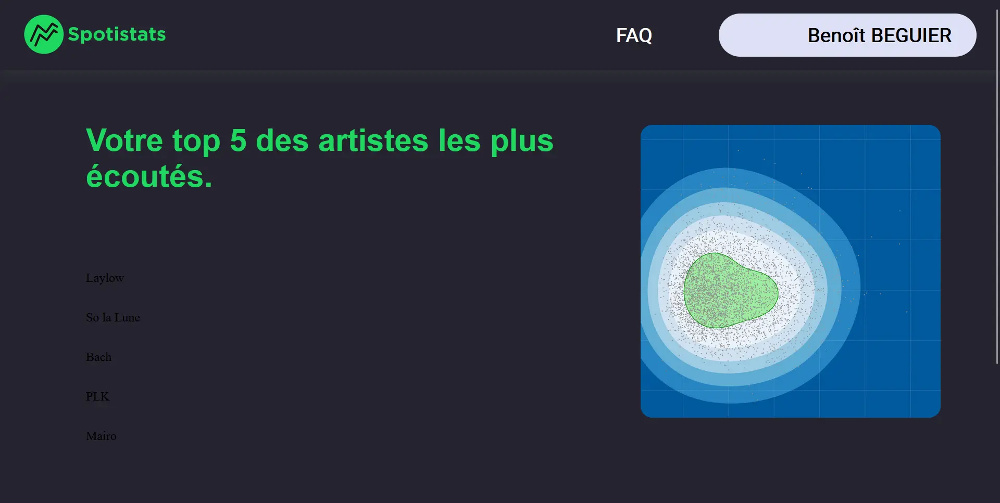
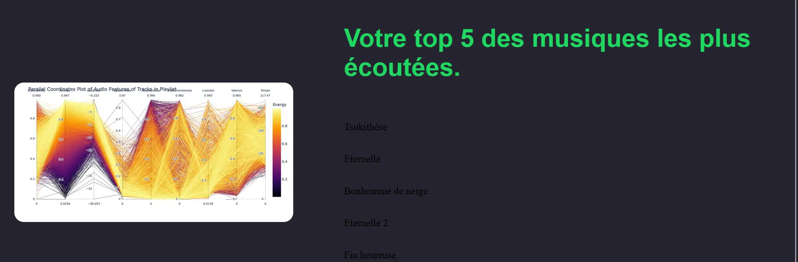

## Retour d'expérience du Sprint 2

J'ai réussi à lier l'API Spotify avec mon front-end pour permettre à l'utilisateur de s'identifier, et d'arriver sur une page qui *display* ses informations personnalisées et ses top artistes/musiques. C'est globalement l'idée que j'avais de mon POK.
Par contre je n'ai pas eu le temps de m'attarder sur la visualisation des données car la partie API m'a pris beaucoup plus de temps que prévu.

Bilan du temps passé :

- Créer la page principale en HTML et y définir les styles en CSS (★☆☆☆☆, **1 heure estimée**, 1 heure réelle)
- Documentation sur les API de Spotify, leur intégration et leurs features (★☆☆☆☆, **2 heures estimées**, 2 heures réelles)
- Lier l'API de Spotify avec mon bouton Connexion (★★★☆☆, **2 heures estimées**, 4 heures réelles)
- Comprendre comment récupérer les données de l'utilisateur qui s'est connecté (★★★☆☆, **2 heures estimées**, 3 heures réelles)
- Rechercher les visualisations de données musicales existantes, et lesquelles sont pertinentes dans mon cas (★☆☆☆☆, **0 heure 30 estimée**, 0h30 réelle)
- Déterminer quelle technologie utiliser pour la visualisation (★☆☆☆☆, **0 heure 30 estimée**)
- Réaliser une première visualisation des données de l'utilisateur, sous une forme à préciser (★★★☆☆, **2 heures estimées**)