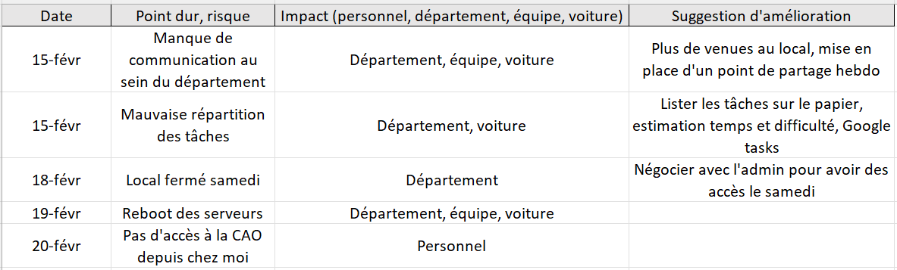
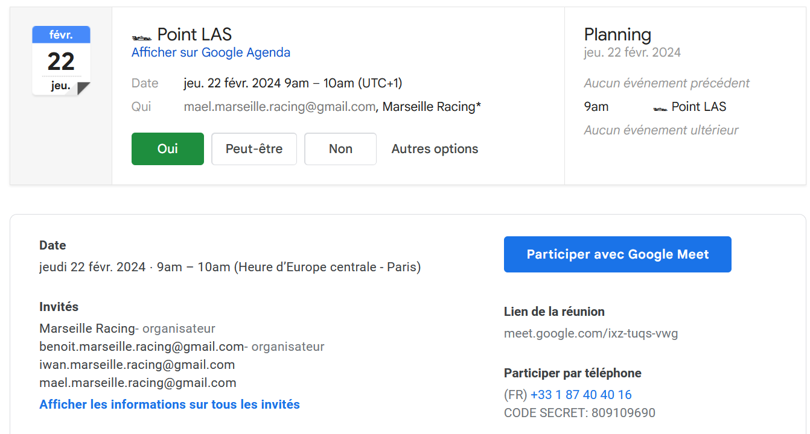
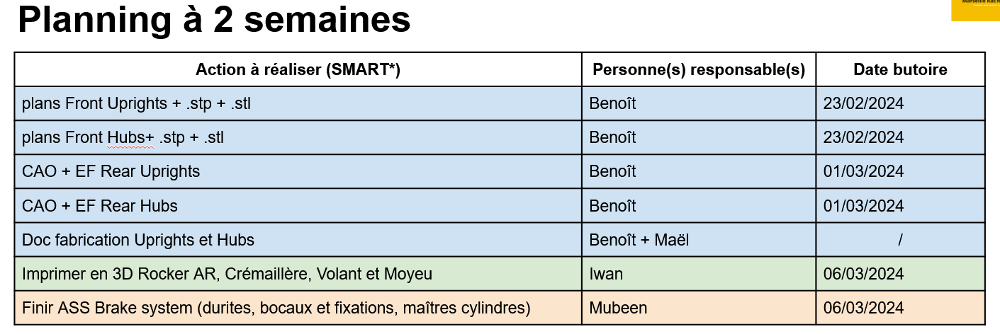
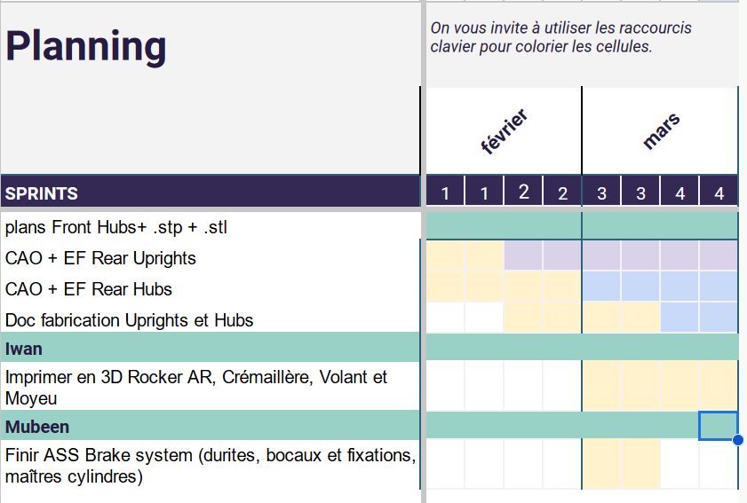


**Niveau :** débutant
**Prérequis :**

- Bases de Gestion de projet (Tronc commun 1A)


Pour la réalisation de ce cours, je me réfèrerais aux sources listées ci-dessous :

- Gaudichau, O., Matsumoto, E. H., & Magnani, F. (2019). *Lean à 540° : D’abord faire un virage de pensée à 180° puis explorer à 360°*
- D. Golembiewski (2018). *MANAGING STUDENT VEHICLE PROJECTS. The non-technical side*

## Sommaire

1. Objectifs du Sprint 1
2. Déroulement pratique
3. Bilan et plan d'action suite à la lecture du livre *Lean à 540°*
4. Documentation et recherche sur les bonnes pratiques de l'organisation d'une équipe de Formula Student
5. Collecte des retours
6. Organiser l'action
7. Actions concrètes

## Objectifs du Sprint 1

Voici les objectifs que je me suis fixé :

- Organiser les points de partage du département (★☆☆☆☆, **1 heure estimée**)
- Documentation et recherche sur les bonnes pratiques de l'organisation d'une équipe de Formula Student (★☆☆☆☆, **2 heures estimées**)
- Lire un livre sur la logistique et la supply chain (★☆☆☆☆, **3 heures estimées**)
- Mettre en pratique les demandes de prix, devis (★☆☆☆☆, **1 heure estimée**)
- Jalonnement des tâches du département à court terme et à long terme (★☆☆☆☆, **1 heure estimée**)
- Documentation sur quels critères se baser pour choisir un fournisseur, négocier les prix et les délais (★☆☆☆☆, **2 heures estimées**)
TOTAL : 10 heures

Les étoiles correspondent au niveau de difficulté de l'objectif dans mon référentiel de débutant en Gestion de projet et en Management.

## Déroulement pratique

Suite à mes échanges avec Florian, je choisis de mener une approche incrémentale et itérative pour mon POK. Cela cadre les modalités d’interactions entre les collaborateurs (communication, avancement et suivi) et la méthodologie de résolution de problème. La méthode LEAN s'appliquerait bien dans cette situation, c'est pour cela que je vais consulter le livre *Lean à 540°* de Florian Magnani, qui permettra très vite d’orienter le sujet vers de la mise en pratique.
On pourrait ensuite se concentrer sur les irritants de mes collaborateurs, la relance du dialogue pour enfin tendre vers les fournisseurs.

## Bilan et plan d'action suite à la lecture du livre *Lean à 540°*

Voici en vrac ce que je tire de la lecture d'une trentaine de pages de cet ouvrage :

- Avant de résoudre un problème, il faut avant tout l'exposer (par exemple, aller sur le terrain avce ce but en tête). Après la résolution, il faut en tirer profit pour le futur.
- Réaliser des faits marquants pour identifier des risques potentiels ou des dysfonctionnements
- On peut ensuite dresser une liste d'actions à mener avec acteur, jalon, outil, objectif...
- Etapes de la résolution de problèmes : Act, Plan, Check, Do

## Documentation et recherche sur les bonnes pratiques de l'organisation d'une équipe de Formula Student

J'ai consulté le document *MANAGING STUDENT VEHICLE PROJECTS. The Non-Technical Side* de D. Golembiewski. Celui-ci traite de la construction et du management d'équipe dans la FSAE (l'équivalent américain de la Formula Student). Honnêtement, je ne recommande pas sa lecture car il reste très général et n'apprend pas grand chose. Les différents items sont applicables à n'importe quel projet et sont assez bâteaux : Positive attitude, The most valuable resource is people...

## Collecte des retours

J'ai fait remplir par mon département (4 personnes) un sheet anonyme dont l'objectif était de récolter les suggestions d'améliorations, les points bloquants et les risques potentiels.
En voici un extrait :

Il est nécessaire de traiter et prioriser l'ensemble des remarques et des points durs, par ordre d'importance. De mon côté, je décide de m'attarder sur :

- améliorer la communication au sein du département
- organiser les points de partage hebdomadaires du département

Je ne peux pas agir sur les autres remarques, néanmoins je les ai transmises au Team Manager.

## Organiser l'action

Il faut ensuite organiser l'action en termes d'acteurs et de temporalité.
J'ai répertorié ces informations dans un tableau, comme recommandé dans *Lean au 540°*.

## Actions concrètes

Mise en place d'une réunion hebdomadaire pour faire le point du département (département LAS, Liaison Au Sol)

Améliorer la communication au sein du département

Jalonnement des tâches du département à court terme

Jalonnement des tâches du département à long terme

