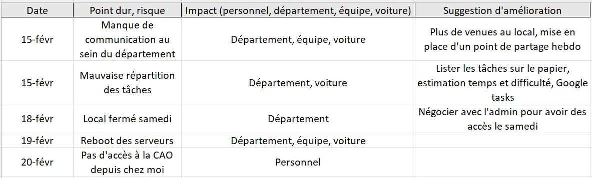
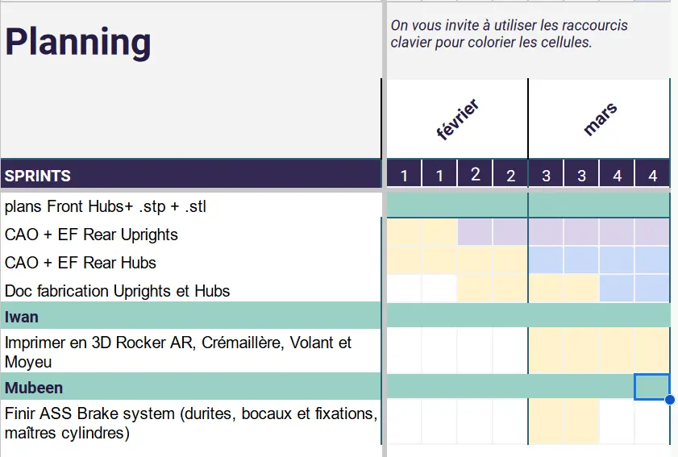
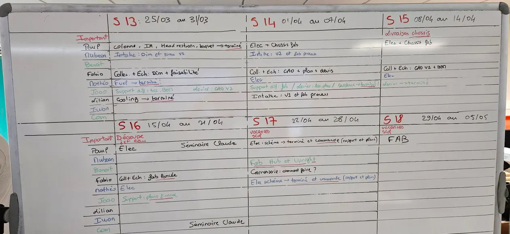
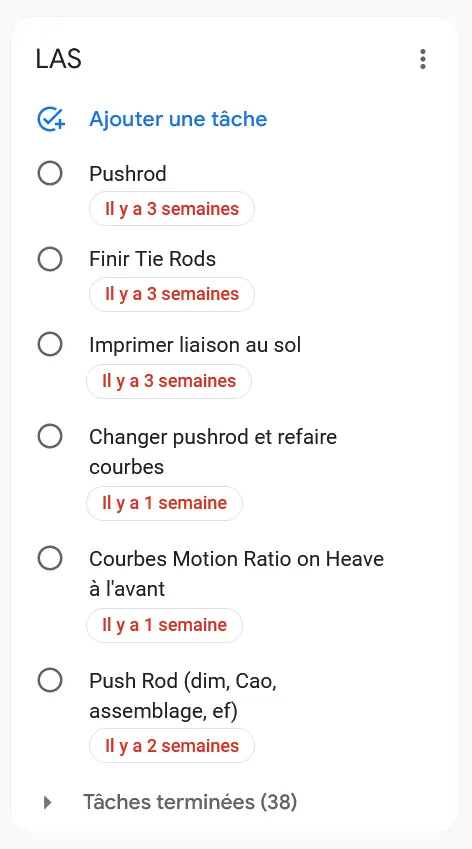
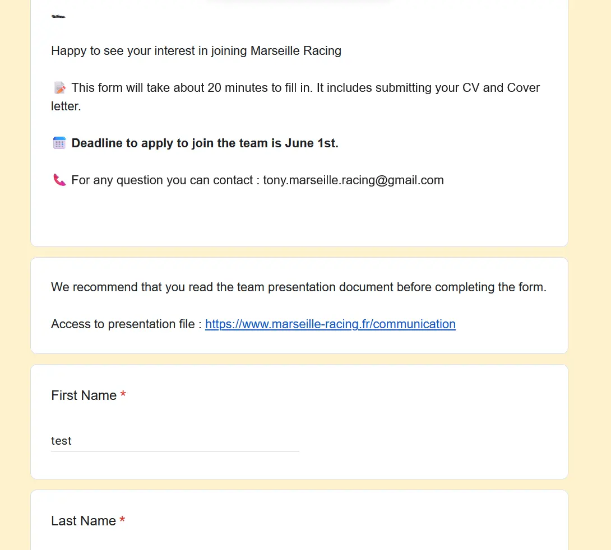


**Niveau :** débutant
**Prérequis :**

- Bases de Gestion de projet (Tronc commun 1A)


Pour la réalisation de ce cours, je me réfèrerais aux sources listées ci-dessous :

- Gaudichau, O., Matsumoto, E. H., & Magnani, F. (2019). *Lean à 540° : D’abord faire un virage de pensée à 180° puis explorer à 360°*
- D. Golembiewski (2018). *MANAGING STUDENT VEHICLE PROJECTS. The non-technical side*

## Sommaire

1. Objectifs du Sprint 1
2. Déroulement pratique
3. Contexte
4. Bilan et plan d'action suite à la lecture du livre *Lean à 540°*
5. Collecte des retours
6. Organiser l'action
7. Actions concrètes
8. Retour d'expérience sur le Sprint 1
9. Objectifs du Sprint 2
10. Mise en place d'un processus d'organisation et de partage des tâches de mon département
11. Pérennisation du savoir
12. Passation
13. Entretiens individuels
14. Retour d'expérience sur le Sprint 2

## Objectifs du Sprint 1

Voici les objectifs que je me suis fixé :

- Organiser les points de partage du département (★☆☆☆☆, **1 heure estimée**)
- Documentation et recherche sur les bonnes pratiques de l'organisation d'une équipe de Formula Student (★☆☆☆☆, **2 heures estimées**)
- Lire un livre sur la logistique et la supply chain (★☆☆☆☆, **3 heures estimées**)
- Mettre en pratique les demandes de prix, devis (★☆☆☆☆, **1 heure estimée**)
- Jalonnement des tâches du département à court terme et à long terme (★☆☆☆☆, **1 heure estimée**)
- Documentation sur quels critères se baser pour choisir un fournisseur, négocier les prix et les délais (★☆☆☆☆, **2 heures estimées**)
TOTAL : 10 heures

Les étoiles correspondent au niveau de difficulté de l'objectif dans mon référentiel de débutant en Gestion de projet et en Management.

## Déroulement pratique

Suite à mes échanges avec Florian, je choisis de mener une approche incrémentale et itérative pour mon POK. Cela cadre les modalités d’interactions entre les collaborateurs (communication, avancement et suivi) et la méthodologie de résolution de problème. La méthode LEAN s'appliquerait bien dans cette situation, c'est pour cela que je vais consulter le livre *Lean à 540°* de Florian Magnani, qui permettra très vite d’orienter le sujet vers de la mise en pratique.
On pourrait ensuite se concentrer sur les irritants de mes collaborateurs, la relance du dialogue pour enfin tendre vers les fournisseurs.

## Contexte

Je fais partie d'une équipe de Formula Student, que j'ai rejointe en octobre 2023. Nous sommes 12 étudiants d'Aix-Marseille Université, de tous âges (17 ans à 24 ans) et de toutes formations (Ecole d'ingénieur, BTS chaudronnerie, DUT Génie Mécanique,...) et notre but est de concevoir et fabriquer par nous-même une monoplace d'ici l'été 2024, en partant de 0.
L'association, Marseille Racing, a été crée durant 2022 mais seuls 2 membres sur les 6 ont vraiment été productifs.
Un premier item important que je souhaite travailler est la pérennisation de l'association, de sa vision et de ses objectifs dans le temps, car chaque année un turn-over très important a lieu (80% au moins).
Le deuxième point important concerne la communication au sein de l'équipe, que ce soit entre les membres, entre les départements ou pour les futurs membres. Il y a la nécessité de rouvrir le dialogue entre chaque partie prenante en adoptant une méthode itérative. Pour cela il faut d'abord définir les objectifs, les *features* à obtenir, puis juger la qualité du résultat obtenu. Enfin, il faut conclure sur la pertinence de la première itération pour améliorer la prochaine.

## Bilan et plan d'action suite à la lecture du livre *Lean à 540°*

Voici en vrac ce que je tire de la lecture d'une trentaine de pages de cet ouvrage :

- Avant de résoudre un problème, il faut avant tout l'exposer (par exemple, aller sur le terrain avce ce but en tête). Après la résolution, il faut en tirer profit pour le futur.
- Réaliser des faits marquants pour identifier des risques potentiels ou des dysfonctionnements
- On peut ensuite dresser une liste d'actions à mener avec acteur, jalon, outil, objectif...
- Etapes de la résolution de problèmes : Act, Plan, Check, Do
- Il est important d'instaurer des rituels auxquels toutes les personnes concernées adhèrent, cela permet d'instaurer une cohésion et une confiance nécessaires à la communication, d'informations mais aussi d'irritants. Certains outils sont très efficaces pour mettre en évidence la souffrance des collaborateurs, même lorsque dans mon cas tout les membres sont bénévoles.

## Documentation et recherche sur les bonnes pratiques de l'organisation d'une équipe de Formula Student

J'ai consulté le document *MANAGING STUDENT VEHICLE PROJECTS. The Non-Technical Side* de D. Golembiewski. Celui-ci traite de la construction et du management d'équipe dans la FSAE (l'équivalent américain de la Formula Student). Honnêtement, je ne recommande pas sa lecture car il reste très général et n'apprend pas grand chose. Les différents items sont applicables à n'importe quel projet et sont assez bâteaux : Positive attitude, The most valuable resource is people...

## Collecte des retours

J'ai fait remplir par mon département (4 personnes) un sheet anonyme dont l'objectif était de récolter les suggestions d'améliorations, les points bloquants et les risques potentiels.
En voici un extrait :

Il est nécessaire de traiter et prioriser l'ensemble des remarques et des points durs, par ordre d'importance. De mon côté, je décide de m'attarder sur :

- améliorer la communication au sein du département
- organiser les points de partage hebdomadaires du département

Je ne peux pas agir sur les autres remarques, néanmoins je les ai transmises au Team Manager.
La communication est souvent en lien avec l'organisation : la structure est censée répondre à un besoin, il faut donc baser l'ensemble de la structure sur l'échange, et si besoin réformer l'ancienne organisation.

## Organiser l'action

Il faut ensuite organiser l'action en termes d'acteurs et de temporalité.
J'ai répertorié ces informations dans un tableau, comme recommandé dans *Lean au 540°*.

## Actions concrètes

Mise en place d'une réunion hebdomadaire pour faire le point du département (département LAS, Liaison Au Sol)

Améliorer la communication au sein du département

Jalonnement des tâches du département à court terme

Jalonnement des tâches du département à long terme

J'ai aussi mis en place un outil Google Tasks, qui permet d'assigner des tâches, avec des jalons et des acteurs, qui apparaissent sur Google Calendar. Force est d'avouer que l'outil n'a pas été adopté par l'équipe, car actuellement toutes les tâches ne sont plus cochées comme faites alors qu'elles le sont lorsqu'on discute avec eux.

## Retour d'expérience sur le Sprint 1

L'ensemble des tâches que je m'étais fixée ont été effectuées. Il était important de bien discerner le besoin et les actions à mener. Au lieu d'aborder le sujet des fournisseurs, j'ai du coup préféré allouer ces deux heures à ce sujet.

### Horodotage

Lundi 19/02 : 2 heures de documentation
Mercredi 21/02 : 1 heure de documentation de *Lean 540°* + 1 heure pour créer le questionnaire du besoin de la bonne manière
Vendredi 23/02 : 2 heures d'organisation de partage des avancées + créer le support adéquat
Samedi 24/02 : 1 heure de tri des réponses du questionnaire, choix des actions à mener, des outils et des jalons
Lundi 26/02 : 2 heures de jalonnement de tâches et répartition des acteurs
Mardi 27/02 : 1h échange avec Florian + lecture de *Lean 540°*

## Objectifs du Sprint 2

Voici les objectifs que je me suis fixé :

- Finir la lecture de *Lean 540°* (★☆☆☆☆, **0 heure 30 estimée**)
- Mettre en place un processus d'organisation et de partage des tâches de mon département (★☆☆☆☆, **1 heure 30 estimées**)
- Mise en place du Google Tasks (★☆☆☆☆, **1 heure 30 estimées**)
- Pérennisation du savoir (★☆☆☆☆, **1 heure estimée**)
- Passation (★☆☆☆☆, **1 heure estimée**)
- Entretien avec le Team Manager (★☆☆☆☆, **1 heure estimée**)
- Entretien avec chacun des membres (★☆☆☆☆, **2 heures estimées**)
- Rédaction d'un rapport détaillé à destination de toute l'équipe (★☆☆☆☆, **1 heure 30 estimées**)

TOTAL : 10 heures

Les étoiles correspondent au niveau de difficulté de l'objectif dans mon référentiel de débutant en Gestion de projet et en Management.

## Mise en place d'un processus d'organisation et de partage des tâches de mon département

### Partage des tâches

Avant de jalonner les tâches, il faut d'abord les définir et les répartir au sein de l'équipe.
On peut parler de **lots de travail** ou de **work package**. Nous avons au sein de l'association souvent procédé par Sprint, et chaque membre avait son work package à réaliser.
Nous avons procédé de la même manière ici. Les lots étaient définis en amont par deux critères :

- type de tâche (réaliser des plans, dimensionner, CAO)
- objet de travail, en l'occurrence le sous-ensemble ou la pièce

A partir des affinités et de l'expérience de chacun, nous avons ensemble dispatché les tâches. Cela a pu être réalisé suite au point LAS que j'avais mis en place.
J'ai noté un réel redynamisme au sein du département.

### Calendrier sur tableau

De part plusieurs lectures que j'ai pu faire et mon expérience personnelle, j'ai décidé de mettre en place un planning sur un tableau, au sein du local de l'association. De telle sorte, chaque membre de mon département est constamment au fait des prochaines échéances, que ce soit les siennes mais aussi celles du département dans son ensemble.
En effet, il est important de **réintégrer dans l'association une cohésion et une vue d'ensemble** du projet. L'articulation du travail de chacun est ainsi mise en exergue par ce planning : il ne suffit pas de concevoir ses pièces dans son coin, mais il faut aussi prendre en compte les pièces du voisin. Dans le même temps, cela permet aussi de mieux s'organiser avec les autres départements. Par exemple, j'ai pu planifier avant de débuter ma conception des moyeux arrières la réunion avec le département GMP (Groupe Motopropulseur) qui était indispensable à la réussite du projet.

### Mise en place d'un Google Tasks

En supplément du planning sur le tableau, il faut aussi que chacun puisse consulter ses tâches à distance, et tenir les autres au courant de ses avancées. J'ai donc décidé de créer un Google Tasks, qui permet de créer une tâche, l'assigner à quelqu'un de l'équipe et ajouter une échéance. La personne peut la cocher en tant que *Terminée* lorsque la mission est remplie.
Dans mon esprit, cela permettrait un management plus simple des avancées. En réalité, l'outil n'a pas été adopté par tout le monde, il a été au fur et à mesures délaissé.

## Pérennisation du savoir

Le *turnover* d'une association telle que Marseille Racing est assez élevé : l'équipe est renouvelée quasiment dans sa totalité tous les ans. Il est vital de stocker l'information et les travaux produits d'une manière organisée, et qui a vocation a être compris par tous : un document de travail illisible ou suivant la logique de son auteur sans aucune explication est inutilisable.

Action :

- ré-organisation du Google Drive
- création d'un *template* de rapport utilisé par toute l'équipe, avec une structure et une charte graphique communes.

## Passation

Dans la continuité du paragraphe précédent, il faut aussi penser à la passation pour les futurs membres et au recrutement. J'ai participé à l'élaboration du formulaire de recrutement qui a pour objectif de mettre en valeur les candidats qui correspondraient à l'engagement et aux valeurs recherchés.

## Entretiens individuels

### Entretien avec le département

J'ai d'abord fait un entretien personnalisé avec les deux autres membres de mon département afin de recueillir leur avis sur le déroulement de l'année, l'organisation, la communication, le management de l'équipe et leur vision du projet à l'heure actuelle. Cette manière de faire permet de ne pas mettre uniquement l'accent sur les choses positives ou négatives.
Ma méthode : leur donner ces grandes lignes et les laisser parler. Si le sujet dérive, je recentre avec du tact pour avoir une discussion constructive.

Je n'ai pas leur autorisation pour dévoiler ce qui s'est dit pendant ces entretiens.

### Entretien avec le Team Manager

J'ai ensuite fait le même type d'entretien avec le Team Manager. Je lui ai d'abord posé les mêmes questions, puis je l'ai questionné sur son retour d'expérience en tant que manager, qu'impulseur.

### Rédaction du rapport

J'ai ensuite rédigé un rapport détaillant ce que j'ai pu apprendre lors de ce POK, mais de manière très appliquée. Ce rapport n'a pas vocation à être une "recette magique" mais il pourra aider l'équipe dans le futur. Ils y trouveront notamment des sections telles que :

- la communication du manager
- l'importance d'une organisation horizontale et transparente
- la découverte puis la gestion d'un irritant

## Retour d'expérience sur le Sprint 2

J'ai pu réaliser l'ensemble des objectifs que j'avais fixé pour le temps 2. J'aurais aimé avoir le temps d'aborder le thème de la supply chain, qui n'est pas directement lié au POK que j'ai traité mais qui a un lien dans Marseille Racing. Ce POK était très plaisant car j'ai pu mettre en pratique de la théorie sur le management et la gestion d'équipe, qui sont parfois abstraits pour des jeunes de 24 ans qui n'ont pas encore d'équipe à gérer.

### Horodatage

Samedi 02/03 : 3 heures pour la réflexion, la création du planning sur le tableau et le Google tasks dans la foulée

Dimanche 03/03 sur la route des vacances : 30 minutes pour terminer l'agréable lecture de *Lean à 540°*

Trêve des vacances

Mercredi 14/03 : 1 heure pour le premier entretien avec Iwan

Jeudi 14/03 : 1 heure pour le deuxième entretien avec Maël

Samedi 16/03 : 1 heure pour l'entretien avec Tony

Lundi 18/03 : 1 heure pour organiser le Drive et créer le template du rapport

Mercredi 20/03 : 1 heure 30 pour rédiger le rapport sur la gestion et l'amélioration d'un département et de l'équipe

Samedi 23/03 : 1 heure pour construire le formulaire de passation