
**Niveau :** Facile
**Prérequis :** Bases en Python


## Sommaire

1. Introduction
2. Bibliothèque NumPy 
3. Bibliothèque Matplotlib
4. Bibliothèque Pandas
5. Conclusion
6. Bibliographie

## 1. Introduction

La vocation de ce MON est d'introduire de façon non exhaustive aux bibliothèques python utiles pour la DataScience.
Ce premier MON introduit aux bibliothèques Numpy, Matplotlib et Pandas qui servent respectivement au calcul numérique, à la visualisation basique des données et à leur analyse.

Le MON 2.1 va de pair avec le MON 2.2 qui lui introduit les bibliothèques Seaborn et Scikit Learn. Celles-ci permettent d'effectuer d'une part de la visualisation plus poussée, très adaptée aux dataframe issus de Pandas, d'autre part appelle aux algorithmes d'apprentissage pour effectuer de la classification, de la régression et du clustering.

## 2. Bibliothèque NumPy
```python
import numpy as np
```

La bibliothèque NumPy permet de faciliter l'application de calculs numériques en Python en introduisant aux tableaux.

Ces tableaux à N dimensions s'avèrent être bien plus utiles que les listes en Data Science dans la mesure où :
- leur coût mémoire est moins important que celui des séquences
- ils présentent beaucoup plus de méthodes que ces dernières et permettent une plus grande flexibilité et facilité dans les calculs.

### Construire un tableau NumPy

**Construction à la main np.array(object, dtype)**

```python
>>>np.array([1, 2, 3])
array([1, 2, 3])
>>>np.array([[0, 2 ,4], [1, 2, 3]])
array([[0, 2, 4],
       [1, 2, 3]])
```
**En 2D avec NumPy, l'axe 0 est celui selon les lignes, l'axe 1 celui selon les colonnes.**
Ainsi, notre tableau B est bien une matrice à 2 lignes et 3 colonnes.

**Remplissage automatique : 0, 1 ou identité**

```python
#np.zeros((shape), dtype)
>>>np.zeros((3,2))             
array([[0., 0.],
       [0., 0.],
       [0., 0.]])

#np.ones((shape), dtype)
>>>np.ones((3,4))              
array([[1., 1., 1., 1.],
       [1., 1., 1., 1.],
       [1., 1., 1., 1.]])

#np.ones(shape, dtype)
>>>np.ones(2)           
array([[1., 0.],
       [0., 1.]])
```
**Remplissage aléatoire**
- rand génère des valeurs aléatoires issues de la distribution uniforme sur l'intervalle [0,1]
- randn génère des valeurs aléatoires issues de la distribution normale centrée en 0
- randint génère des valeurs entières aléatoires issues d'une distribution uniforme sur un intervalle donné

```python
#np.random.randn(lignes, colonnes)
>>>np.random.randn(3,4)
array([[ 0.32146014, -1.38563513,  0.346344  , -1.60361699],
       [-0.26914238,  0.156633  , -0.16439682, -0.96573034],
       [ 0.27903539,  0.69972398, -0.73055932,  0.47816189]])
```
**Arange & linspace**
Chacun de ces constructeurs renvoie une matrice de dimension 1 dont les nombres sont régulièrement espacés sur un intervalle spécifié.
Linspace permet de choisir le nombre de points alors qu'arange permet de définir l'intervalle entre ces points.

```python
#np.linspace(start, stop, num)
>>>np.linspace(0,10,5)
array([ 0. ,  2.5,  5. ,  7.5, 10. ])

#np.arange(start, stop, step)
>>>np.arange(0,10,2)
array([0, 2, 4, 6, 8])
```
### Quelques attributs utiles
**- ndim :** dimension du tableau
**- shape :** forme du tableau (tuple)
**- size :** nombre d'éléments dans le tableau

```python
>>>A = np.array([[1,2],[2,3],[4,5]])
>>>A.ndim
2
>>>A.shape
(3, 2)
>>>A.size
6
```
### Manipulation de tableaux
**concatenate**

```python
>>>A = np.zeros((3,2))
>>>A
array([[0., 0.],
       [0., 0.],
       [0., 0.]])
>>>B = np.ones((3,2))
>>>B
array([[1., 1.],
       [1., 1.],
       [1., 1.]])

#np.concatenate((shape), axis=?)
>>>np.concatenate((A,B), axis=0)
array([[0., 0.],
       [0., 0.],
       [0., 0.],
       [1., 1.],
       [1., 1.],
       [1., 1.]])

>>>np.concatenate((A,B), axis=1)
array([[0., 0., 1., 1.],
       [0., 0., 1., 1.],
       [0., 0., 1., 1.]])
```
En 2D, il est également possible d'utiliser **np.hstack** et **np.vstack** afin d'assembler selon l'axe 0 (vertical), l'axe 1 (horizontal)...

**reshape**
La fonction reshape est utilisée pour redimensionner la forme d'un tableau sans modifier les données qu'il contient. 

```python
>>>A = np.zeros((3,2)), B = np.ones((3,2))
>>>C = F = np.concatenate((D,E), axis=0)
print('La forme de C est', C.shape, 'et son nombre d\'items', C.size)
La forme de la matrice est (6, 2) et son nombre d'items 12

#C.reshape((shape))
>>>C.reshape((3,4))
array([[0., 0., 0., 0.],
       [0., 0., 1., 1.],
       [1., 1., 1., 1.]])
>>>print('La forme de C est', C.shape, 'et son nombre d\'items', C.size)
La forme de C est (3, 4) et son nombre d'items 12
```
Cette méthode est particulièrement utile lorsque l'on crée un tableau à une dimension afin d'éviter des erreurs de calcul matriciel.

```python
>>>E = np.array([1, 2, 3])
>>>E.shape
(3,)
>>>E.reshape((E.shape[0], 1))
>>>E.shape
(3,1)
```
**ravel**

Enfin ravel permet "d'aplatir" un tableau pour qu'il n'ait plus qu'une seule dimension.

```python
>>>D = np.array(([1,2,3], [4,5,6], [7,8,9]))
>>>D
array([[1, 2, 3],
       [4, 5, 6],
       [7, 8, 9]])

#D.ravel()
>>>D.ravel()
array([1, 2, 3, 4, 5, 6, 7, 8, 9])
```
### Indexing, Slicing et Masking
Il faut désormais pouvoir parcourir un tableau et atteindre certains de leurs items.

```python
A = np.array([[1, 2, 3], [4, 5, 6], [7, 8, 9]])

# Indexing
>>>A[1, 2]
6

# Slicing
>>>A[:,0]
array([1, 4, 7])

>>>A[::2,::2]
array([[1, 3],
       [7, 9]])

>>>A[::2,::2] = 10
array([[10,  2, 10],
       [ 4,  5,  6],
       [10,  8, 10]])

# Masking (utile pour du filtrage/traitement d'image)
>>>B = np.random.randint(0, 255, [1024, 720])
array([[169, 231,   7, ...,  16, 243,  95],
       [248,  80, 175, ..., 196,  95, 205],
       [214, 218,   9, ...,  12,   7, 119],
       ...,
       [ 86, 133,  92, ...,  97,  47,   7],
       [125, 133, 108, ..., 239, 114, 107],
       [240,  45, 106, ...,  46, 214,  74]])

>>>B[B>200] = 255

>>>B
array([[169, 255,   7, ...,  16, 255,  95],
       [255,  80, 175, ..., 196,  95, 255],
       [255, 255,   9, ...,  12,   7, 119],
       ...,
       [ 86, 133,  92, ...,  97,  47,   7],
       [125, 133, 108, ..., 255, 114, 107],
       [255,  45, 106, ...,  46, 255,  74]])
```

**Exemple d'un traitement d'image**
```python
#import de l'image d'origine et affichage

from scipy import misc
import matplotlib.pyplot as plt
face = misc.face(gray=True)
plt.imshow(face, cmap=plt.cm.gray)
plt.show()
face.shape

# traitement (zoom + éclaircissement des pixels proches du blanc)
h = face.shape[0]
w = face.shape[1]
A = face[int(h/4):int(3*h/4),int(w/4):int(3*w/4)]
A[A > 200] = 255
plt.imshow(A, cmap=plt.cm.gray)
plt.show()
```
Voici l'image d'origine :

Et ici l'image traitée :


### Algèbre linéaire avec les tableaux

A+B : addition classique
A*B : produit terme à terme
np.dot(A,B) : produit matriciel classique
np.transpose(A) : transposée de A

Différentes routines pour trouver le déterminant d'une matrice, ses valeurs propres et vecteurs propres, sa matrice inverse... sont disponibles dans la documentation [scipy routines.linalg](https://docs.scipy.org/doc/numpy-1.13.0/reference/routines.linalg.html)

### Méthodes utiles
```python
>>>A = np.array([[1, 2, 3], [4, 5, 6]])
>>>A
array([[1, 2, 3],
       [4, 5, 6]])

>>>A.sum(axis=0)
array([5, 7, 9])

>>>A.sum(axis=1)
array([ 6, 15])
```
- A.prod() : effectue le produit des nombres de la matrice
- A.min(axis=?) : renvoie le minimum selon l'axe
- A.max(axis=?) : renvoie le maximum selon l'axe
- A.argmin(axis=?) : renvoie la position du min
- A.argmax(axis=?) : renvoie la position du max
- A.sort(axis=?) : trie le tableau selon l'axe
- A.argsort(axis=?) : retourne les index dans l'ordre de tri du tableau ( ne modifie pas le tableau)

D'autres routines mathématiques sont égalements décrites dans la documentation : [Scipy routines.math](https://docs.scipy.org/doc/numpy-1.13.0/reference/routines.math.html)

Et statistiques : [Scipy routines.statistics](https://docs.scipy.org/doc/numpy-1.13.0/reference/routines.statistics.html)

Il est également intéressant de remarquer :
- np.corrcoef(A) qui permet d'obtenir la matrice de corrélation de A : l'élément à l'emplacement (i, j) représente la corrélation entre la i-ème et la j-ème colonnes de la matrice A.
- np.unique(A, return_counts=True) qui va sortir un tableau indiquant le nombre de fois d'apparition d'un item de la matrice A.
- np.isnan(A) : renvoie un masque de A avec des False et True si isnan permettant ainsi de corriger ces NaN

## 3. Bibliothèque Matplotlib
```python
import matplotlib.pyplot as plt
```

La bibliothèque Matplolib permet de créer des visualisations statiques, animées et interactives en Python.

### Fonction Pyplot

**Arguments de la fonction**
plot(x, y, label=..., lw=..., ls=..., c=...)
- label : nom de la courbe
- lw : épaisseur du trait
- ls : style du trait
- c : couleur du trait

Attention, x et y doivent être de même dimension !

**Corps type de l'affichage d'une figure**
```python
# définition de la fonction
import numpy as np
x = np.linspace(0, 2, 10)
y = x**2

# début de la figure
plt.figure(figsize=(12, 8)) #dimensions en pouces et non en centimètres

# contenu
plt.plot(x, y, label='quadratique', lw=6, ls='--', c='red')
plt.plot(x, x**3, label='cubique', lw=4, c='blue')
plt.title('figure 1')
plt.xlabel('abscisses')
plt.ylabel('ordonnées')
plt.legend()

# affichage
plt.show()

# sauvegarde dans le répertoire
plt.savefig('figure_type.webp')
```

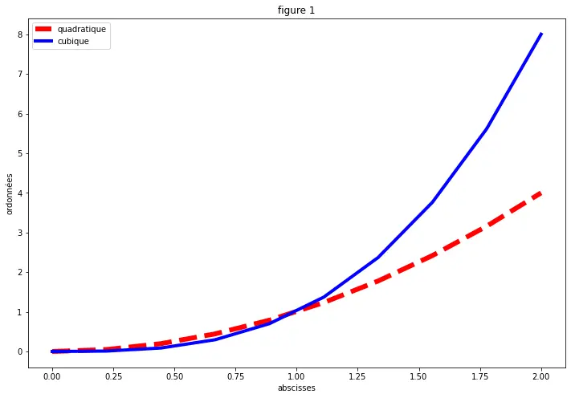

Il est également possible d'afficher plusieurs graphique avec subplot.

```python
plt.figure()

#plt.subplot(lignes, colonnes, position)

plt.subplot(2, 2, 1)
plt.plot(x, x)
plt.title('courbe1')

plt.subplot(2, 2, 2)
plt.plot(x, np.cos(x))
plt.title('courbe2')

plt.subplot(2, 2, 3)
plt.plot(x, y)

plt.subplot(2, 2, 4)
plt.plot(x, np.cos(x))
plt.plot(x, np.sin(x))
```
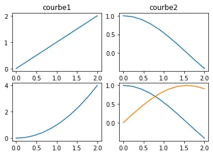

### Différents graphiques
Afin de visualiser les différents graphiques que l'on peut tracer avec matlpolib, nous allons nous servir du dataset iris flower qui contient 150 exemples de fleurs d'iris répartis en 3 classes.
4 variables permettent alors de classer la fleur :
- longueur et largeur du pétale
- longeur et largeur du sépal

```python
import numpy as np
import matplotlib.pyplot as plt
from sklearn.datasets import load_iris

iris = load_iris()

x = iris.data  # Correction ici
y = iris.target
names = list(iris.target_names)

print(f'x contient {x.shape[0]} exemples et {x.shape[1]} variables')  # Correction ici
print(f'il y a {np.unique(y).size} classes')

#exécution du code*
x contient 150 exemples et 4 variables
il y a 3 classes
```

**Classification avec un nuage de points : plt.scatter**
```python
plt.scatter(x[:, 0], x[:, 1], c=y, alpha=0.5, s=100)
plt.xlabel('longueur sépale')
plt.ylabel('largeur sépale')
```
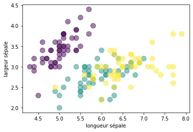

**Visualisation 3D avec mpl_toolkits**
```python
from mpl_toolkits.mplot3d import Axes3D
ax = plt.axes(projection='3d')
ax.scatter(x[:, 0], x[:, 1], x[:, 2], c=y)
```
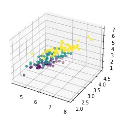

```python
f = lambda x, y: np.sin(x) + np.cos(x+y)
X = np.linspace(0, 5, 100)
Y = np.linspace(0, 5, 100)
X, Y = np.meshgrid(X, Y)
Z = f(X, Y)

ax = plt.axes(projection='3d')
ax.plot_surface(X, Y, Z, cmap='plasma')
```
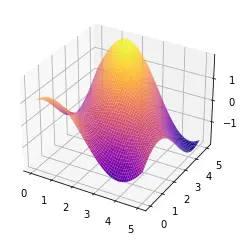

**Contour plots**
```python
f = lambda x, y: np.sin(x) + np.cos(x+y)*np.cos(x)
X = np.linspace(0, 5, 100)
Y = np.linspace(0, 5, 100)
X, Y = np.meshgrid(X, Y)
Z = f(X, Y)
plt.contour(X, Y, Z, 20, colors='black')

plt.contourf(X, Y, Z, 20, cmap='RdGy')
plt.colorbar()
```
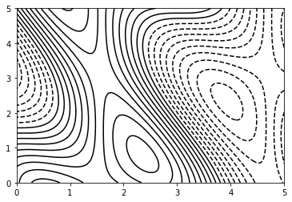
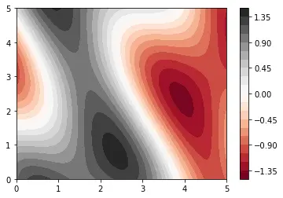

**Histogramme**
```python
plt.hist(x[:,0], bins=20)
plt.xlabel('longueur sépale')
plt.ylabel('nombre de sépales')

plt.hist2d(x[:,0], x[:, 1], cmap='Blues')
plt.xlabel('longueur sépale')
plt.ylabel('largeur sépale')
plt.colorbar()
```

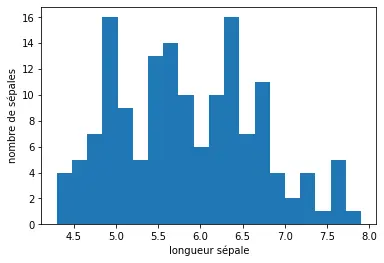
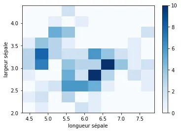


## 4. Bibliothèque Pandas
```python
import pandas as pd
```

La bibliothèque Pandas permet de d'effectuer de l'analyse de données de manière simple et intuitive.
Basée sur NumPy, elle fournit une structure de donnée appelée Dataframe adaptée pour lire et écrire dans différents formats : .csv, .txt, .xls, .sql...)

### Application au DataFrame
**Dataset Titanic**
Pour mettre en lumière les possibilités de la bibliothèque Pandas, je vous propose de nous pencher sur le dataset Titanic disponible en suivant ce lien : [Dataset Titanic](https://github.com/MachineLearnia/Python-Machine-Learning/tree/master/Dataset)

**Charger le fichier**
```python
pd.read_excel('titanic.xls')
# .csv : pd.read_csv()
# .json : pd.read_json()
...
```
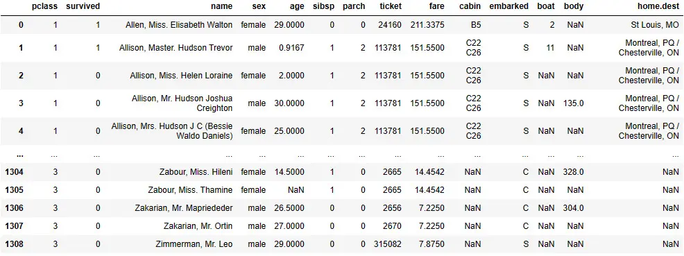

**Fonctions utiles**
```python
df.head() # Afficher le début du DataFrame
df.describe() # Statistiques sur le DataFrame
df.drop(['column', 'column',...]) # Éliminer des colonnes
df.dropna(axis=0) # Éliminer les lignes aux données manquantes
df.['column'].value_counts() # Compter les répétitions
df.groupby(['column']) # Analyser par groupe

df.shape # Afficher les dimensions du DataFrame
df.columns # Renvoie les différentes colonnes du DataFrame
```

**Application**
```python
>>>file_path = r"C:\MOOC_Data_Sciences\Machine_Learnia\titanic3.xls"
>>>df = pd.read_excel(file_path)

>>>df.shape
(1309, 14) # 1309 lignes et 14 colonnes

>>>df.columns
Index(['pclass', 'survived', 'name', 'sex', 'age', 'sibsp', 'parch', 'ticket',
       'fare', 'cabin', 'embarked', 'boat', 'body', 'home.dest'],
      dtype='object')
```
Afin d'analyser les données, supprimons quelques colonnes.

```python
>>>df_bis = data.drop(['name', 'parch', 'sibsp', 'ticket', 'fare', 'cabin', 'embarked', 'boat', 'body', 'home.dest'], axis=1)

>>>df_bis.head()
# cf image retournée ci-dessous
>>>df_bis.describe()
# cf image retournée ci dessous
```
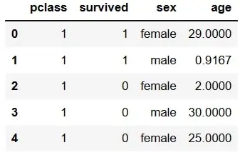
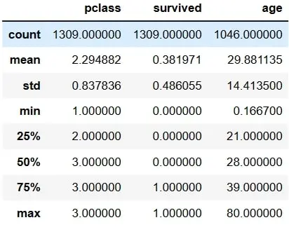

On peut remarquer via le "describe" que 1309 lignes sont présentes dans les 2 premières colonnes contre 1046 dans la troisième.
Il manque des données concernant l'âge de certains passagers, 2 options sont alors envisageable pour palier ce problème :
- compléter par une valeur par défaut, par exemple par l'âge moyen de la colonne avec la commande "data.fillna(df['age].mean())"
- supprimer les lignes pour lesquelles ces données sont manquantes "data.dropna(axis=0)"

Poussons l'analyse pour désormais déterminer la répartition de ces 1046 passagers par classe.

```python
>>>df_bis['pclass'].value_counts()
pclass
3    501
1    284
2    261

>>>df_bis.groupby(['sex', 'pclass']).mean() #cf image retournée ci-dessous
```
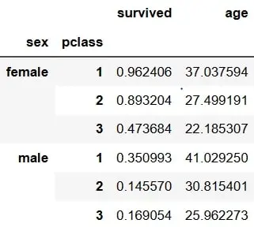

**Combinaison Matplotlib et Pandas**
Pandas fonctionne en collaboration avec Matplotlib, il va donc être possible de réaliser des graphiques simples sur le dataframe.

```python
df.plot()
df.plot.bar()
df.hist(bins=...)
df.plot.scatter(x=...,y=...)

pd.plotting.scatter_matrix(df)

# répartition des âges du DataFrame
>>>df_bis['age'].hist()
```
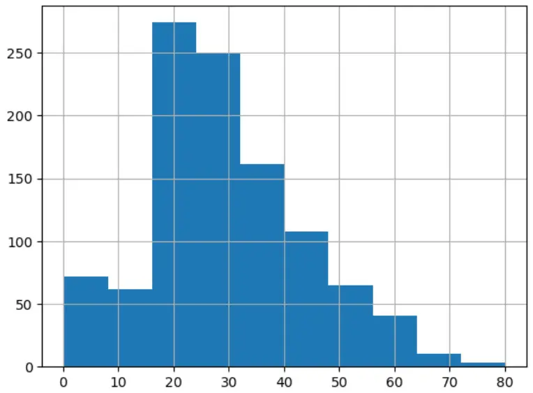

## 5. Conclusion

En somme, l'utilisation des bibliothèques NumPy, Matplotlib et Pandas s'avère essentielle pour l'analyse de données.
NumPy facilite la manipulation des données, Matplotlib offre des outils graphiques puissants, et Pandas simplifie le traitement des données tabulaires.

**Ensemble**, ces bibliothèques forment un arsenal efficace, accélérant le processus d'exploration, de visualisation et d'interprétation des données. Qui plus est, il est **très facile de prendre en main ces bibliothèques et ainsi aboutir à des traitements intéressants en peu de temps.**

#### Répartition du temps

| Timing | NumPy | Matplotlib | Pandas |
| -------| -------- | -------- | -------- |
| Temps prévu (en heures) | 4 | 4 | 2 |
| Temps dédié (en heures)| 5 | 3 | 2 |

## 6. Bibliographie

[Documentation NumPy](https://numpy.org/doc/stable/user/absolute_beginners.html)
[Documentation Scipy](https://courspython.com/apprendre-numpy.html)
[Chaine YouTube Machine Learnia](https://www.youtube.com/playlist?list=PLO_fdPEVlfKqMDNmCFzQISI2H_nJcEDJq)

