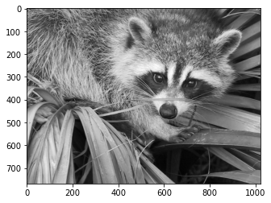
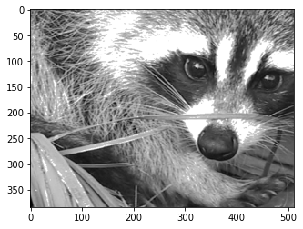


**Niveau :** Facile
**Prérequis :** Bases en Python


## Sommaire

1. Introduction
2. Bibliothèque NumPy 
3. Bibliothèque Matplotlib
4. Bibliothèque Pandas
5. Combinaison des bibliothèques
6. Conclusion
7. Bibliographie

## 1. Introduction

quid sklearn et seaborn ??

## 2. Bibliothèque NumPy
```python
import numpy as np
```

La bibliothèque NumPy permet de faciliter l'application de calculs numériques en Python en introduisant aux tableaux.

Ces tableaux à N dimensions s'avèrent être bien plus utiles que les listes en Data Science dans la mesure où :
- leur coût mémoire est moins important que celui des séquences
- ils présentent beaucoup plus de méthodes que ces dernières et permettent une plus grande flexibilité et facilité dans les calculs.

### Construire un tableau NumPy

**Construction à la main np.array(object, dtype)**

```python
>>>np.array([1, 2, 3])
array([1, 2, 3])
>>>np.array([[0, 2 ,4], [1, 2, 3]])
array([[0, 2, 4],
       [1, 2, 3]])
```
**En 2D avec NumPy, l'axe 0 est celui selon les lignes, l'axe 1 celui selon les colonnes.**
Ainsi, notre tableau B est bien une matrice à 2 lignes et 3 colonnes.

**Remplissage automatique : 0, 1 ou identité**

```python
#np.zeros((shape), dtype)
>>>np.zeros((3,2))             
array([[0., 0.],
       [0., 0.],
       [0., 0.]])

#np.ones((shape), dtype)
>>>np.ones((3,4))              
array([[1., 1., 1., 1.],
       [1., 1., 1., 1.],
       [1., 1., 1., 1.]])

#np.ones(shape, dtype)
>>>np.ones(2)           
array([[1., 0.],
       [0., 1.]])
```
**Remplissage aléatoire**
- rand génère des valeurs aléatoires issues de la distribution uniforme sur l'intervalle [0,1]
- randn génère des valeurs aléatoires issues de la distribution normale centrée en 0
- randint génère des valeurs entières aléatoires issues d'une distribution uniforme sur un intervalle donné

```python
#np.random.randn(lignes, colonnes)
>>>np.random.randn(3,4)
array([[ 0.32146014, -1.38563513,  0.346344  , -1.60361699],
       [-0.26914238,  0.156633  , -0.16439682, -0.96573034],
       [ 0.27903539,  0.69972398, -0.73055932,  0.47816189]])
```
**Arange & linspace**
Chacun de ces constructeurs renvoie une matrice de dimension 1 dont les nombres sont régulièrement espacés sur un intervalle spécifié.
Linspace permet de choisir le nombre de points alors qu'arange permet de définir l'intervalle entre ces points.

```python
#np.linspace(start, stop, num)
>>>np.linspace(0,10,5)
array([ 0. ,  2.5,  5. ,  7.5, 10. ])

#np.arange(start, stop, step)
>>>np.arange(0,10,2)
array([0, 2, 4, 6, 8])
```
### Quelques attributs utiles
**- ndim :** dimension du tableau
**- shape :** forme du tableau (tuple)
**- size :** nombre d'éléments dans le tableau

```python
>>>A = np.array([[1,2],[2,3],[4,5]])
>>>A.ndim
2
>>>A.shape
(3, 2)
>>>A.size
6
```
### Manipulation de tableaux
**concatenate**

```python
>>>A = np.zeros((3,2))
>>>A
array([[0., 0.],
       [0., 0.],
       [0., 0.]])
>>>B = np.ones((3,2))
>>>B
array([[1., 1.],
       [1., 1.],
       [1., 1.]])

#np.concatenate((shape), axis=?)
>>>np.concatenate((A,B), axis=0)
array([[0., 0.],
       [0., 0.],
       [0., 0.],
       [1., 1.],
       [1., 1.],
       [1., 1.]])

>>>np.concatenate((A,B), axis=1)
array([[0., 0., 1., 1.],
       [0., 0., 1., 1.],
       [0., 0., 1., 1.]])
```
En 2D, il est également possible d'utiliser **np.hstack** et **np.vstack** afin d'assembler selon l'axe 0 (vertical), l'axe 1 (horizontal)...

**reshape**
La fonction reshape est utilisée pour redimensionner la forme d'un tableau sans modifier les données qu'il contient. 

```python
>>>A = np.zeros((3,2)), B = np.ones((3,2))
>>>C = F = np.concatenate((D,E), axis=0)
print('La forme de C est', C.shape, 'et son nombre d\'items', C.size)
La forme de la matrice est (6, 2) et son nombre d'items 12

#C.reshape((shape))
>>>C.reshape((3,4))
array([[0., 0., 0., 0.],
       [0., 0., 1., 1.],
       [1., 1., 1., 1.]])
>>>print('La forme de C est', C.shape, 'et son nombre d\'items', C.size)
La forme de C est (3, 4) et son nombre d'items 12
```
Cette méthode est particulièrement utile lorsque l'on crée un tableau à une dimension afin d'éviter des erreurs de calcul matriciel.

```python
>>>E = np.array([1, 2, 3])
>>>E.shape
(3,)
>>>E.reshape((E.shape[0], 1))
>>>E.shape
(3,1)
```
**ravel**

Enfin ravel permet "d'aplatir" un tableau pour qu'il n'ait plus qu'une seule dimension.

```python
>>>D = np.array(([1,2,3], [4,5,6], [7,8,9]))
>>>D
array([[1, 2, 3],
       [4, 5, 6],
       [7, 8, 9]])

#D.ravel()
>>>D.ravel()
array([1, 2, 3, 4, 5, 6, 7, 8, 9])
```
### Indexing, Slicing et Masking
Il faut désormais pouvoir parcourir un tableau et atteindre certains de leurs items.

```python
A = np.array([[1, 2, 3], [4, 5, 6], [7, 8, 9]])

# Indexing
>>>A[1, 2]
6

# Slicing
>>>A[:,0]
array([1, 4, 7])

>>>A[::2,::2]
array([[1, 3],
       [7, 9]])

>>>A[::2,::2] = 10
array([[10,  2, 10],
       [ 4,  5,  6],
       [10,  8, 10]])

# Masking (utile pour du filtrage/traitement d'image)
>>>B = np.random.randint(0, 255, [1024, 720])
array([[169, 231,   7, ...,  16, 243,  95],
       [248,  80, 175, ..., 196,  95, 205],
       [214, 218,   9, ...,  12,   7, 119],
       ...,
       [ 86, 133,  92, ...,  97,  47,   7],
       [125, 133, 108, ..., 239, 114, 107],
       [240,  45, 106, ...,  46, 214,  74]])

>>>B[B>200] = 255

>>>B
array([[169, 255,   7, ...,  16, 255,  95],
       [255,  80, 175, ..., 196,  95, 255],
       [255, 255,   9, ...,  12,   7, 119],
       ...,
       [ 86, 133,  92, ...,  97,  47,   7],
       [125, 133, 108, ..., 255, 114, 107],
       [255,  45, 106, ...,  46, 255,  74]])
```

**Exemple d'un traitement d'image**
```python
#import de l'image d'origine et affichage

from scipy import misc
import matplotlib.pyplot as plt
face = misc.face(gray=True)
plt.imshow(face, cmap=plt.cm.gray)
plt.show()
face.shape

# traitement (zoom + éclaircissement des pixels proches du blanc)
h = face.shape[0]
w = face.shape[1]
A = face[int(h/4):int(3*h/4),int(w/4):int(3*w/4)]
A[A > 200] = 255
plt.imshow(A, cmap=plt.cm.gray)
plt.show()
```
Voici l'image d'origine :

Et ici l'image traitée :


### Algèbre linéaire avec les tableaux

A+B : addition classique
A*B : produit terme à terme
np.dot(A,B) : produit matriciel classique
np.transpose(A) : transposée de A

Différentes routines pour trouver le déterminant d'une matrice, ses valeurs propres et vecteurs propres, sa matrice inverse... sont disponibles dans la documentation [scipy routines.linalg](https://docs.scipy.org/doc/numpy-1.13.0/reference/routines.linalg.html)

### Méthodes utiles
```python
>>>A = np.array([[1, 2, 3], [4, 5, 6]])
>>>A
array([[1, 2, 3],
       [4, 5, 6]])

>>>A.sum(axis=0)
array([5, 7, 9])

>>>A.sum(axis=1)
array([ 6, 15])
```
- A.prod() : effectue le produit des nombres de la matrice
- A.min(axis=?) : renvoie le minimum selon l'axe
- A.max(axis=?) : renvoie le maximum selon l'axe
- A.argmin(axis=?) : renvoie la position du min
- A.argmax(axis=?) : renvoie la position du max
- A.sort(axis=?) : trie le tableau selon l'axe
- A.argsort(axis=?) : retourne les index dans l'ordre de tri du tableau ( ne modifie pas le tableau)

D'autres routines mathématiques sont égalements décrites dans la documentation : https://docs.scipy.org/doc/numpy-1.13.0/reference/routines.math.html 

Et statistiques : https://docs.scipy.org/doc/numpy-1.13.0/reference/routines.statistics.html

Il est également intéressant de remarquer :
- np.corrcoef(A) qui permet d'obtenir la matrice de corrélation de A : l'élément à l'emplacement (i, j) représente la corrélation entre la i-ème et la j-ème colonnes de la matrice A.
- np.unique(A, return_counts=True) qui va sortir un tableau indiquant le nombre de fois d'apparition d'un item de la matrice A.
- np.isnan(A) : renvoie un masque de A avec des False et True si isnan permettant ainsi de corriger ces NaN

## 3. Bibliothèque Matplotlib
## 4. Bibliothèque Pandas
## 5. Combinaison des bibliothèques
## 6. Conclusion
## 7. Bibliographie

https://numpy.org/doc/stable/user/absolute_beginners.html
https://courspython.com/apprendre-numpy.html
https://www.youtube.com/playlist?list=PLO_fdPEVlfKqMDNmCFzQISI2H_nJcEDJq

