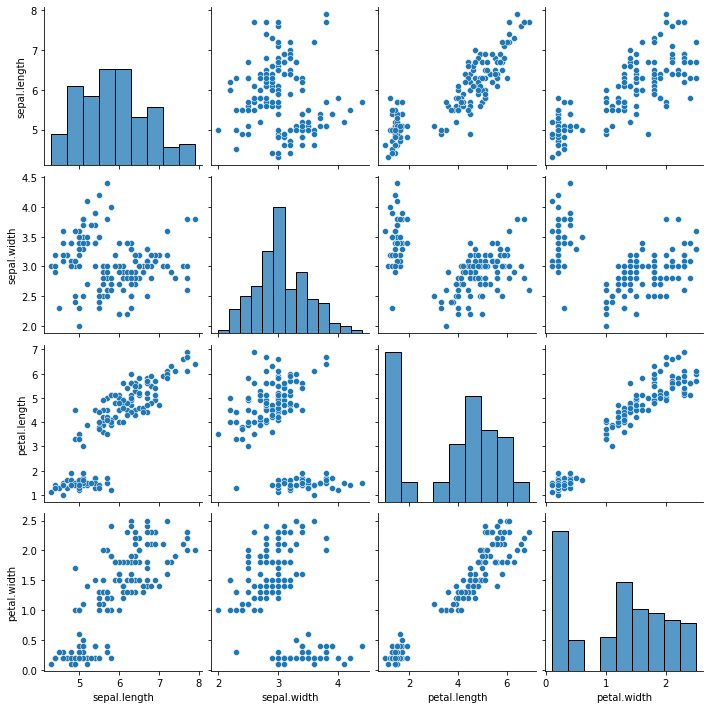
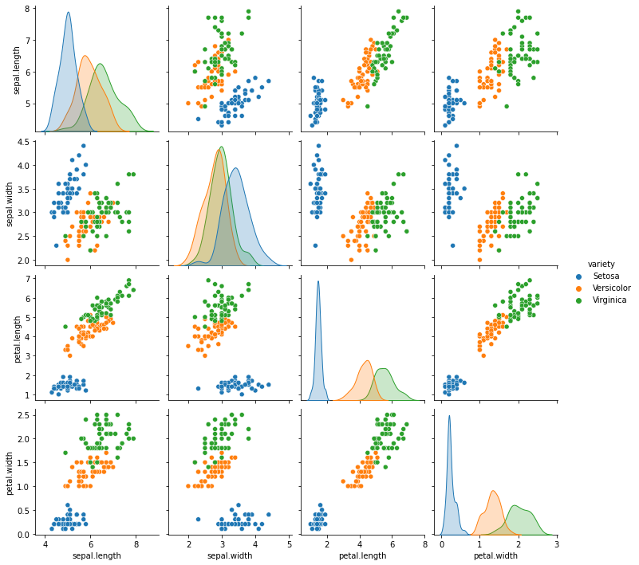
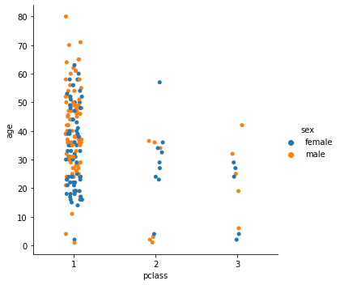
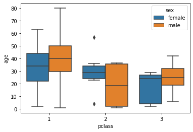
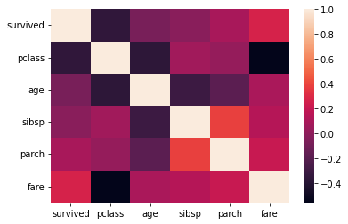
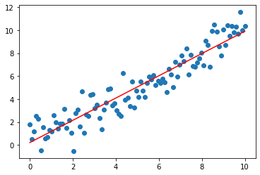


**Niveau :** Facile
**Prérequis :** Bases en Python


## Sommaire

1. Introduction
2. Bibliothèque Seaborn 
3. Bibliothèque Scikit Learn
4. Bibliothèque Keras
5. Conclusion
6. Bibliographie

## 1. Introduction

La vocation de ce MON est d'introduire de façon non exhaustive aux bibliothèques python utiles pour la DataScience.
Ce second MON introduit aux bibliothèques Seaborn et Scikit Leanr qui servent respectivement à la visualisation des données et au Machine Learning.

Le MON 2.2 va de pair avec le MON 2.1 qui lui introduit les bibliothèques NumPy, Matplotlib et Pandas.

## 2. Bibliothèque Seaborn
```python
import seaborn as sns
```

La bibliothèque Seaborn va permettre d'obtenir de la visualisation avancée en comparaison à Matplotlib et ce en simplifiant les lignes de code.

Reprenons l'exemple du dataset iris (cf MON 2.1).
En lisant ce dataset sous forme de dataframe pandas, il va être possible en une seule ligne de code de produire une figure montrant toutes les différentes relations entre nos différentes variable.

```python
chemin = 'C:\MOOC_Data_Sciences\Machine_Learnia\iris.csv'
iris = pd.read_csv(chemin)
sns.pairplot(iris)
```



Pour aller plus loin, il va même être possible d'analyser les sépales et pétales par variété de fleur grâce à l'ajout d'un seul paramètre.

```python
sns.pairplot(iris, hue = 'variety')
```


Les possibilités de seaborn sont multiples, [la documentation officielle](https://seaborn.pydata.org/) répertorie les différents graphiques réalisables en fonction des besoins :
- distribution
- regressions
- catégories...

Et ces possibilités ont presque toujours la même structure : **sns.fonction(x, y, data, hue, size, style)**

À titre d'exemple, reprenons le dataset titanic.

Il va être possible d'étudier la répartition des âges des passagers en fonction de leur classe et de leur sexe, sous forme de categorical plot ou de box plot.

```python
titanic = sns.load_dataset('titanic')
sns.catplot(x='pclass', y='age', data=titanic, hue='sex')
sns.boxplot(x='pclass', y='age', data=titanic, hue='sex')
```





On va également pouvoir visualiser la relation entre 2 distributions.

```python
sns.jointplot(x='age', y='fare', data=titanic, kind='hex')
```


Ou encore de visualiser les matrices de corrélation sous forme de heatmap.

**NB :** Attention, il s'avère au préalable nécessaire de supprimer les colonnes contenant autre chose que des int ou float ou de convertir des colonnes.

```python
sns.heatmap(titanic.corr())
```




## 3. Bibliothèque Scikit Learn
La bibliothèque Scikit Learn va permettre d'effectuer du Machine Learning.
C'est cette bibliothèque qui répertorie toutes les méthodes d'apprentissage et prêtes à l'emploi. [La documentation Scikit-Learn](https://scikit-learn.org/stable/#) va alors être très utile. Elle répertorie ces différentes méthodes : classification, régression, clustering... et explique leur fonctionnement. Ainsi, il n'y aura plus qu'à appeler les différentes fonctions déjà codées en python orienté objet pour effectuer du Machine Learning.

Les programmes utilisant Sckit Learn auront tous le même schéma :
- Sélection du modèle et précision de ses hyperpramètres : **model = LinearRegression(...)**
- Entraînement du modèle : **model.fit(X, Y)**
- Évaluation du modèle : **model.score(X, Y)**
- Utilisation du modèle : **model.predict(X)**

### 3.1 Régression

Commençons par une simple régression linéaire.

```python
## Création des données
np.random.seed(0)
X = np.linspace(0, 10, 100).reshape(100, 1)
Y = X + np.random.randn(100, 1)

## Modèle
from sklearn.linear_model import LinearRegression

model = LinearRegression()
model.fit(X, Y)
model.score(X, Y) ## renvoie le coefficient de détermination
predictions = model.predict(X) ## renvoie un tableau Numpy des prédictions

## Visualisation
plt.scatter(X, Y)
plt.plot(X,predictions, c='r')
```


Désormais, dans le cas où la relation entre les données ne serait plus linéaire, nous pourrions envisager le modèle SVR (Support Vector Regression).

Le programme reste alors tout à fait similaire, il ne suffit que d'importer le modèle et modifier le choix du modèle.

**NB :** En regardant la [☻documentation de ce modèle](https://scikit-learn.org/stable/modules/generated/sklearn.svm.SVR.html), on comprend que seuls 2 hyperparamètres peuvent être modifiés :
- C : paramètre de régularisation. Il détermine la marge d'erreur tolérée par le modèle. (attention au surapprentissage si celui-ci est choisi trop grand)
- epsilon : l'erreur par rapport à la prédiction, comme en prépa lors de la détermination de limites, il s'agit du tunnel de tolérance autour d'une courbe. Plus epsilon est grand, plus le modèle est tolérant aux erreurs.

```python
...
Y = X**2 + np.random.randn(100, 1)

## Modèle
from sklearn.svm import SVR
model = SVR(C=100)
...
```


##  5. Conclusion

#### Répartition du temps

| Timing | Seaborn | Scikit Learn | Combinaison |
| -------| -------- | -------- | -------- |
| Temps prévu (en heures) | 2 | 4 | 4 |
| Temps dédié (en heures)| 2 | ? | ? |


## 6. Bibliographie

[Documentation Seaborn](https://seaborn.pydata.org/)
[Documentation Scikit Learn](https://scikit-learn.org/stable/#)
[Chaine YouTube Machine Learnia](https://www.youtube.com/playlist?list=PLO_fdPEVlfKqMDNmCFzQISI2H_nJcEDJq)