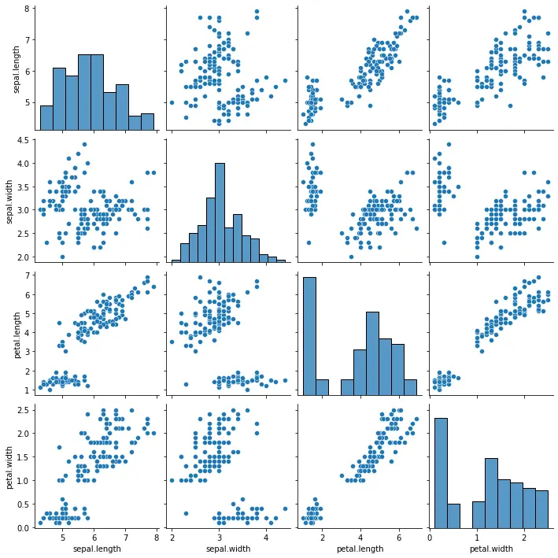
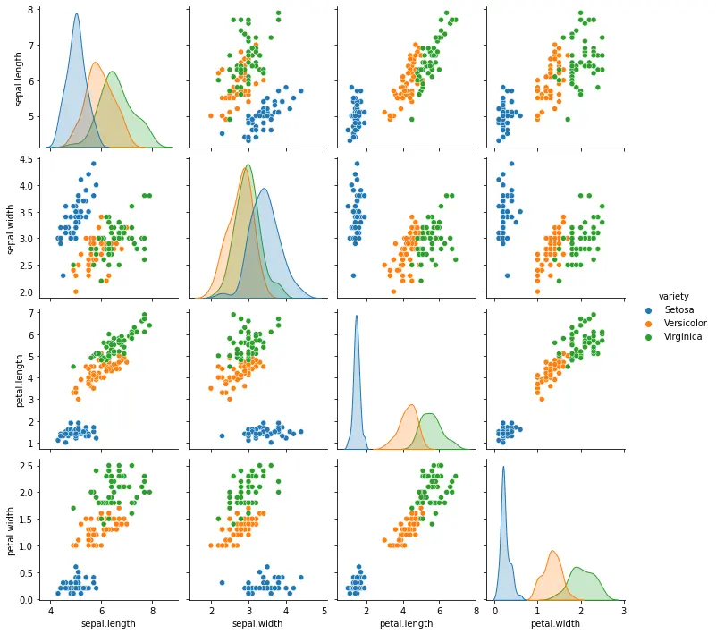
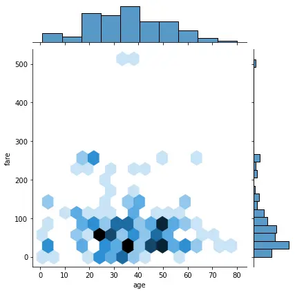
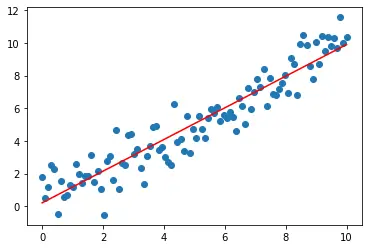
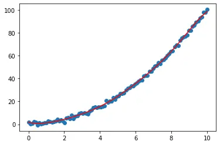
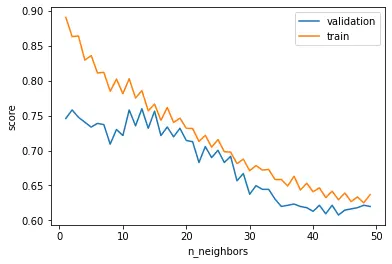
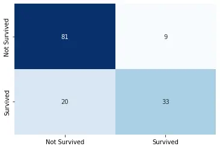


**Niveau :** Moyen
**Prérequis :** Bases en Python


## Sommaire

1. Introduction
2. Bibliothèque Seaborn 
3. Bibliothèque Scikit Learn
4. Application : combinaison des bibliothèques
5. Conclusion
6. Bibliographie

## 1. Introduction

La vocation de ce MON est d'introduire de façon non exhaustive aux bibliothèques python utiles pour la DataScience.
Ce second MON introduit aux bibliothèques Seaborn et Scikit Leanr qui servent respectivement à la **visualisation des données et au Machine Learning.**

Le MON 2.2 est une suite du [MON 2.1](https://francoisbrucker.github.io/do-it/promos/2023-2024/Beyaert-Alexandre/mon/temps-2.1/) qui lui introduit les bibliothèques NumPy, Matplotlib et Pandas.

## 2. Bibliothèque Seaborn
```python
import seaborn as sns
```

La bibliothèque Seaborn va permettre d'obtenir de la **visualisation avancée** en comparaison à Matplotlib et ce en simplifiant les lignes de code.

Reprenons l'exemple du **dataset iris** *(cf MON 2.1)*.
En lisant ce dataset sous forme de dataframe pandas, il va être possible en une seule ligne de code de produire une figure montrant toutes les différentes relations entre nos différentes variables.

```python
chemin = 'C:\MOOC_Data_Sciences\Machine_Learnia\iris.csv'
iris = pd.read_csv(chemin)
sns.pairplot(iris)
```



Pour aller plus loin, il va même être possible d'analyser les sépales et pétales par variété de fleur grâce à l'ajout d'un seul paramètre.

```python
sns.pairplot(iris, hue = 'variety')
```


Les possibilités de seaborn sont multiples, [la documentation officielle](https://seaborn.pydata.org/) répertorie les différents graphiques réalisables en fonction des besoins :
- distributions
- regressions
- catégories...

Et ces possibilités ont presque toujours la même structure : **sns.fonction(x, y, data, hue, size, style)**

À titre d'exemple, reprenons désormais **le dataset titanic.** Il va être possible d'étudier la répartition des âges des passagers en fonction de leur classe et de leur sexe, sous forme de categorical plot ou de box plot.

```python
titanic = sns.load_dataset('titanic')
sns.catplot(x='pclass', y='age', data=titanic, hue='sex')
sns.boxplot(x='pclass', y='age', data=titanic, hue='sex')
```


On va également pouvoir visualiser la relation entre 2 distributions.

```python
sns.jointplot(x='age', y='fare', data=titanic, kind='hex')
```


Ou encore visualiser les matrices de corrélation sous forme de heatmap.

**NB :** Attention, il s'avère au préalable nécessaire de supprimer les colonnes contenant autre chose que des int ou float ou de convertir des colonnes. *(cf partie 3.3 Préparation des données)*

```python
sns.heatmap(titanic.corr())
```


## 3. Bibliothèque Scikit Learn
La bibliothèque Scikit Learn va permettre d'**effectuer du Machine Learning.**

C'est cette bibliothèque qui répertorie toutes les méthodes d'apprentissage et prêtes à l'emploi. [La documentation Scikit-Learn](https://scikit-learn.org/stable/#) va alors être très utile. Elle répertorie ces différentes méthodes : classification, régression, clustering... et explique leur fonctionnement. Ainsi, il n'y aura plus qu'à appeler les différentes fonctions déjà codées en python orienté objet pour effectuer du Machine Learning.

Les programmes utilisant Sckit Learn auront tous le même schéma :
- Sélection du modèle et précision de ses hyperpramètres : **model = LinearRegression(...)**
- Entraînement du modèle : **model.fit(X, Y)**
- Évaluation du modèle : **model.score(X, Y)**
- Utilisation du modèle : **model.predict(X)**

### 3.1 Régression

Voici ci-dessous une façon de réaliser une régression linéaire en suivante le schéma **"choix du modèle - entraînement - évaluation - utilisation"**.

```python
## Création des données
np.random.seed(0)
X = np.linspace(0, 10, 100).reshape(100, 1)
Y = X + np.random.randn(100, 1)

## Modèle
from sklearn.linear_model import LinearRegression

model = LinearRegression()
model.fit(X, Y)
model.score(X, Y) ## renvoie le coefficient de détermination
predictions = model.predict(X) ## renvoie un tableau Numpy des prédictions

## Visualisation
plt.scatter(X, Y)
plt.plot(X,predictions, c='r')
```


Pour s'adapter à un cas où la relation entre les données ne serait plus linéaire, il ne suffira que de changer de modèle. Nous pourrions envisager le modèle SVR *(Support Vector Regression)*.

**NB :** En regardant la [documentation de ce modèle](https://scikit-learn.org/stable/modules/generated/sklearn.svm.SVR.html), on comprend que pour ce modèle, seuls 2 hyperparamètres peuvent être ajustés :
- C : paramètre de régularisation. Il détermine la marge d'erreur tolérée par le modèle. (attention au surapprentissage si celui-ci est choisi trop grand)
- epsilon : l'erreur par rapport à la prédiction, comme en prépa lors de la détermination de limites, il s'agit du tunnel de tolérance autour d'une courbe. Plus epsilon est grand, plus le modèle est tolérant aux erreurs.

```python
...
Y = X**2 + np.random.randn(100, 1)

## Modèle
from sklearn.svm import SVR
model = SVR(C=100)
...
```
Et voici notre nouvelle régression.



### 3.2 Classification

Basons nous une nouvelle fois le dataset titanic pour effectuer de la classification et ainsi déterminer les chances de survie d'un passager.

Un modèle approprié pourrait être le [KNeighborsClassifier](https://scikit-learn.org/stable/modules/neighbors.html#nearest-neighbors-classification). Celui-ci va analyser les K plus proches voisins d'un élément et tirer la classification la plus probable qui en ressort.

Commençons par **importer** et **filtrer** le dataset.

```python
titanic = sns.load_dataset('titanic')

titanic = titanic[['survived', 'pclass', 'sex', 'age']]
titanic.dropna(axis=0, inplace=True)
titanic['sex'].replace(['male', 'female'], [0, 1], inplace=True)
```

Puis **implémentons** le modèle.

```python
from sklearn.neighbors import KNeighborsClassifier

model = KNeighborsClassifier()

Y = titanic['survived']
X = titanic[['pclass', 'sex', 'age']]

model.fit(X, Y)
model.score(X, Y)
model.predict(X)
```

Le score qui en ressort est alors de 84% : les prédictions du modèle sont bonnes dans 84% des cas et la fonction model.predict(X) renvoie un tableau de 0 et de 1 indiquant les passagers qui survivraient.

Pour aller plus loin, créons une fonction permettant de déterminer si un individu lambda aurait survécu et avec quelle probabilité.

```python
def survie(model, pclass, sex, age):
    x = np.array([pclass, sex, age]).reshape(1, 3)
    return(model.predict(x), model.predict_proba(x))
```
Ainsi en testant la fonction sur moi : pclass=3, sex=0, age=24 ; le modèle prédit que je ne survivrai pas avec une probabilité de 80%.

En suivant ces précédentes manipulations, on biaise toutefois le résultat puisque l'on teste notre modèle sur les données d'entraînement. En pratique, il est **nécessaire de diviser notre dataset en données d'entraînement et données de test.**

```python
from sklearn.model_selection import train_test_split

X_train, X_test, Y_train, Y_test = train_test_split(X, Y, test_size=0.2)

model = KNeighborsClassifier(n_neighbors=1) # On choisit le nombre de plus proches voisins

model.fit(X_train, Y_train)
print('Train score:', model.score(X_train, Y_train))
print('Test score:', model.score(X_test, Y_test))
```
En sortie, on observe que sur les données d'entraînement l'algorithme est fiable à 89% contre 79% pour les données de test.

Puisque l'on choisit le nombre de plus proches voisins, vient alors la question de l'optimisation de cet hyperparamètre et des performances de l'algorithme.

Il peut être intéressant de diviser notre dataset en plusieurs parties dont l'une d'entre elle sert à la validation. En réitérant cette étape plusieurs fois, nous pourrions alors déterminer la meilleure façon d'optimiser l'algorithme.

```python
from sklearn.model_selection import validation_curve

model = KNeighborsClassifier()
k = np.arange(1, 50) # tableau Numpy répertoriant le nombre de plus proches voisins que nous allons tester

train_score, val_score = validation_curve(model, X_train, Y_train, param_name='n_neighbors', param_range=k, cv=5) # on teste le paramètre n_neighbors sur le tableau k et l'on divise nos données en 5 parties (cross validation)

train_score.shape # train_score est alors un tableau à 49 lignes (les itérations du tableau k) et à 5 colonnes issues de la cross validation

plt.plot(k, val_score.mean(axis=1), label='validation')
plt.plot(k, train_score.mean(axis=1), label='train')
plt.xlabel('n_neighbors')
plt.ylabel('score')
plt.legend()
plt.show()
```


L'écart entre la courbe train et celle validation est très important lorsqu'on ne sélectionne qu'un seul plus proche voisin, il y a de l'**overfitting**. Le modèle essaye trop de se rapprocher des données qu'il apprend et en déforme la réalité. Cet écart diminue plus le nombre de plus proches voisins augmente. Cependant, lorsque l'on choisit trop de plus proches voisins, la performance de la courbe validation diminue puisque certains plus proches voisins sont en réalité éloignés de l'élément à analyser.

**Une dizaine de plus proches voisins semble être la solution la plus appropriée**, il s'agit de celle maximisant la précision des données de validation et minimisant l'écart avec le train.

Vérifions désormais cette supposition grâce aux fonctions de la bibliothèque Scikit-Learn.

Le module **GridSearchCV** est capable de donner le meilleur score atteignable pour un modèle et les paramètres associés.

```python
from sklearn.model_selection import GridSearchCV

param_grid = {'n_neighbors': np.arange(1, 20), 'metric': ['euclidiean', 'manhattan']} # on crée un dictionnaire avec les paramètres à tester : n_neigbors et la mesure de distance parmi différentes possibilités

grid = GridSearchCV(KNeighborsClassifier(), param_grid, cv=5)

grid.fit(X_train, Y_train) # on entraîne la grille comme précédemment

# La grille est prête à renvoyer les différents éléments par exemple
grid.best_score_ # renvoie le meilleur score atteignable, dans notre cas 77%

grid.best_params_ # renvoie les meilleurs paramètres, dans notre cas 9 plus proches voisins (ce qui confirme la 10aine observée précédemment) et la distance manhattan
```
Si on le souhaite, il va ainsi être possible de régler notre modèle avec ces paramètres optimums et d'observer la matrice de confusion : la matrice retournant le nombre de bonnes réponses et d'erreurs.

```python
model = grid.best_estimator_

model.score(X_test, Y_test) # renvoie le 71% précédent

confusion_matrix(Y_test, model.predict(X_test)) # renvoie la matrice ci-dessous
#array([[65, 20],
#       [21, 37]], dtype=int64)
# 65 survivants ont bien été trouvé par l'algorithme mais 20 d'entre eux sont manquants et ont été classés comme morts
# à l'inverse, 37 morts ont bien été trouvé mais 21 d'entre eux ont été prédits comme survivants alors qu'ils sont morts

# Nous pouvons retrouver notre 71% de performances en vérifiant le rapport (bonnes prédictions / nombre de prédictions)
# (65 + 37)/(65 + 20 + 21 + 37) = 71%
```

### 3.3 Préparation des données
#### 3.3.1 Encodage

Je l'ai déjà mentionné précédemment, avant de pouvoir effectuer du machine learning, j'effectue un pré-traitement des données. Par exemple, pour effectuer des calculs (régressions, classifications...) il est très souvent nécessaire de travailler avec des valeurs numériques. Certaines valeurs vont alors poser problèmes :

- les données manquantes 'NaN'
- les chaînes de caractères telles que 'male' ou 'female' dans la colonne 'sex' du dataset titanic

Dans le premier cas, un simple usage de la fonction **dropna()** résoudra notre problème. Pour ce qui est du second cas, il sera nécessaire d'effectuer de l'**encodage**.


2 types d'encodages sont envisageables :
**- l'encodage Ordinal :** il associe chaque catégorie d'une variable à une valeur décimale unique
| chat   | chien    | oiseau   | chien    | chat | lion |
| -------| -------- | -------- | -------- |----- | ---- |
|    0   |     1    |     3    |    1     |  0   |   2  |

Lorsque nous avons une simple liste, la fonction à utiliser sera alors **LabelEncoder()**.
```python
from sklearn.preprocessing import LabelEncoder

y = np.array(['chat', 'chien', 'oiseau', 'chien', 'chat', 'lion'])

encoder = LabelEncoder() # création de l'objet

# Méthode 1
encoder.fit(y) # développement de l'encoder
print(encoder.classes_) # renvoie les différentes classes existantes
# ['chat' 'chien' 'lion' 'oiseau']
encoder.transform(y) # appliquer la transformation
# array([0, 1, 3, 1, 0, 2])

# Méthode 2
encoder.fit_transform(y) # fais tout en 1
# array([0, 1, 3, 1, 0, 2])
```
À l'inverse, on peut retrouver ces chaînes de caractère à partir des nombres.

```python
encoder.inverse_transform((np.array([3, 2, 3, 0, 1, 3])))
# renvoie : array(['oiseau', 'lion', 'oiseau', 'chat', 'chien', 'oiseau'], dtype='<U6')
```
Dans le cas d'un tableau à plusieurs variables, il faudra opter pour la fonction **OrdinalEncoder()**.

```python
from sklearn.preprocessing import OrdinalEncoder

X = np.array([['Chat', 'Poils'],
              ['Chien', 'Poils'],
              ['Chat', 'Poils'],
              ['Oiseau', 'Plumes']])

encoder = OrdinalEncoder()
encoder.fit_transform(X) # Renvoie le tableau ci-dessous

array([[0., 1.],
       [1., 1.],
       [0., 1.],
       [2., 0.]])
```
Le problème de l'encodage ordinal est qu'il **crée un ordre** 0 < 1 < 2... et cet ordre risque de pénaliser des modèles de Machine Learning. Pour y remédier, il faudra opter pour l'encodage One Hot.

**- L'encodage One Hot :** permet d'éviter l'ordonancement, il va représenter chacune des valeurs sous forme de vecteurs, empêchant ainsi les comparaisons.

Pour une simple liste, il faut utiliser **LabelBinarizer()**.
```python
from sklearn.preprocessing import LabelBinarizer

y = np.array(['chat', 'chien', 'oiseau', 'chien', 'chat', 'lion'])

encoder = LabelBinarizer()
encoder.fit_transform(y) # Renvoie le tableau ci-dessous

array([[1, 0, 0, 0],
       [0, 1, 0, 0],
       [0, 0, 0, 1],
       [0, 1, 0, 0],
       [1, 0, 0, 0],
       [0, 0, 1, 0]])
```
Et pour un tableau, **OneHotEncoder()**.

```python
from sklearn.preprocessing import OneHotEncoder

X = np.array([['Chat', 'Poils'],
              ['Chien', 'Poils'],
              ['Chat', 'Poils'],
              ['Oiseau', 'Plumes']])

encoder = OneHotEncoder()
encoder.fit_transform(X) # Renvoie un tableau compressé ci-dessous
<4x5 sparse matrix of type '<class 'numpy.float64'>'
	with 8 stored elements in Compressed Sparse Row format>
```

#### 3.3.2 Normalisation
La normalisation est également une étape très importante du pré-traitement.
Elle va notamment permettre à l'algorithme de converger plus facilement vers sa valeur finale.

3 types de normalisation sont principalement utilisés :
- MinMax : la plage de données initiale va être rapportée à l'intervalle [0, 1] 
```python
from sklearn.preprocessing import MinMaxScaler

X = np.array([[70],
              [80],
              [120]])

scaler = MinMaxScaler()
scaler.fit_transform(X) # Renvoie le tableau ci-dessous

array([[0. ],
       [0.2],
       [1. ]])
```

- Standardisation : les données seront normalisées de sorte à obtenir une moyenne nulle et un écart type égal à 1

```python
from sklearn.preprocessing import StandardScaler

X = np.array...

scaler = StandardScaler()
scaler.fit_transform(X)

array([[-0.9258201 ],
       [-0.46291005],
       [ 1.38873015]])
```
Le problème de ces 2 premières techniques est qu'elles sont très sensibles aux valeurs aberrantes.

- RobustScaler : chaque donnée sera soustraite à la médiane le tout divisé par l'interquartile (X-mediane)/(Q3-Q1)

## 4. Application : combinaison des bibliothèques

Pour terminer ce MON, je vous propose d'effectuer un algorithme combinant nos différentes bibliothèques et incluant un  pipeline complet de Machine Learning "pré-traitement - modèle - entraînement - évaluation - visualisation" afin de prédire la survie des passagers du Titanic.

Le score sera ensuite comparé à celui obtenu sans pré-traitement.

```python
# imports
import numpy as np
import pandas as pd
import seaborn as sns
from sklearn.pipeline import make_pipeline
from sklearn.preprocessing import StandardScaler
from sklearn.model_selection import GridSearchCV
from sklearn.neighbors import KNeighborsClassifier
from sklearn.model_selection import train_test_split
from sklearn.preprocessing import LabelEncoder
from sklearn.metrics import confusion_matrix

# import du dataset
titanic = sns.load_dataset('titanic') 

# sélection des colonnes et supression des NaN
titanic = titanic[['survived', 'pclass', 'sex', 'age']] 
titanic.dropna(axis=0, inplace=True)

Y = titanic['survived']
X = titanic[['pclass', 'sex', 'age']]

# encodage de la colonne 'sex'
encoder = LabelEncoder()
X['sex'] = encoder.fit_transform(X['sex'])

# division en test, train
X_train, X_test, Y_train, Y_test = train_test_split(X, Y, test_size=0.2)

# choix du modèle, sous forme d'un pipeline pour appliquer les mêmes opérations au train et au test
model = make_pipeline(StandardScaler(), KNeighborsClassifier())

param = {
    'kneighborsclassifier__n_neighbors': np.arange(1, 20)}

# création de la grille de recherche
grid = GridSearchCV(model, param_grid=param, cv=4)

# entraînement
grid.fit(X_train, Y_train)

# résultats
grid.best_params_

grid.score(X_test, Y_test)

# calcul de la matrice de confusion
Y_pred = grid.predict(X_test)
conf_matrix = confusion_matrix(Y_test, Y_pred)

# affichage de la matrice de confusion
sns.heatmap(conf_matrix, annot=True, fmt='d', cmap='Blues', cbar=False,
            xticklabels=['Not Survived', 'Survived'], yticklabels=['Not Survived', 'Survived'])
```


On remarque ainsi que la performance est de 81%, alors que pour un modèle sans pré-traitement :

```python
titanic = sns.load_dataset('titanic') # import du dataset

titanic = titanic[['survived', 'pclass', 'sex', 'age']] 
titanic.dropna(axis=0, inplace=True)

Y = titanic['survived']
X = titanic[['pclass', 'sex', 'age']]

encoder = LabelEncoder()
X['sex'] = encoder.fit_transform(X['sex'])


X_train, X_test, Y_train, Y_test = train_test_split(X, Y, test_size=0.2)

model = KNeighborsClassifier()
model.fit(X_train, Y_train)
model.score(X_test, Y_test)
```
La performance est de 74% soit une amélioration de la performance de (81-74)/74 = 8% avec les simples opérations de pré-traitement.

##  5. Conclusion

#### Répartition du temps

| Timing | Seaborn | Sklearn modèle | Sklearn pré-traitement | Combinaison des bibliothèques |
| -------| -------- | -------- | -------- |
| Temps prévu (en heures) | 2 | 3 | 3 | 2 |
| Temps dédié (en heures) | 2 | 4 | 2 | 2 |


## 6. Bibliographie

[Documentation Seaborn](https://seaborn.pydata.org/)
[Documentation Scikit Learn](https://scikit-learn.org/stable/#)
[Choisir le bon estimateur](https://scikit-learn.org/stable/tutorial/machine_learning_map/index.html)
[Chaine YouTube Machine Learnia](https://www.youtube.com/playlist?list=PLO_fdPEVlfKqMDNmCFzQISI2H_nJcEDJq)