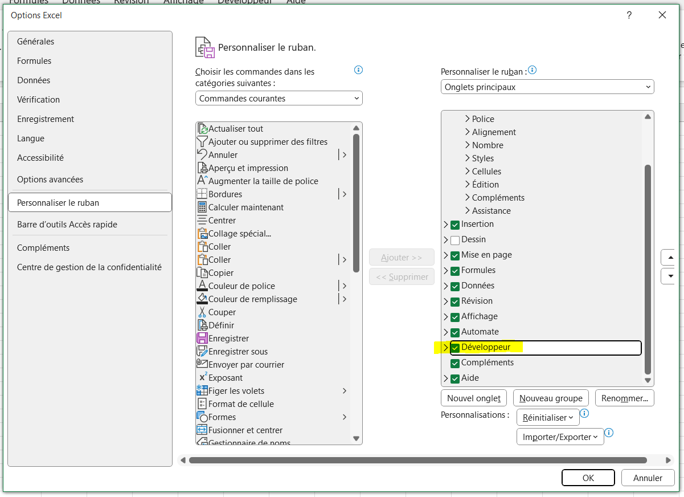
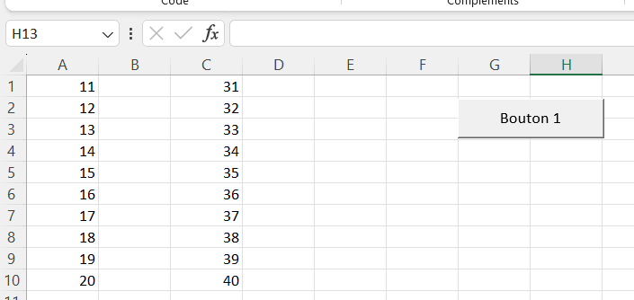

## Sommaire

1. Introduction
2. VBA, c'est quoi ?
3. Prise en main
4. 
5. Conclusion
6. Bibliographie

## 1. Introduction

Les MON sur VBA ne datent pas d'hier, cette année [Paul](https://francoisbrucker.github.io/do-it/promos/2023-2024/Le_Bihan-Paul/mon/temps-1.1/), [Mathis](https://francoisbrucker.github.io/do-it/promos/2023-2024/Mathis%20Schultz/mon/temps-2.1/#h4), [Agathe](https://francoisbrucker.github.io/do-it/promos/2023-2024/Agathe-Rabachou/mon/temps-2.1/) et [Lola](https://francoisbrucker.github.io/do-it/promos/2023-2024/Lola-Bourdon/mon/temps-2.1/) s'y sont déjà prêtés.

Cette fois-ci c'est à mon tour de découvrir se langage, à la fois par curiosité mais aussi par intérêt pour mon stage de fin d'études en tant que consultant en Supply Chain.

## 2. VBA, c'est quoi ?

VBA pour "Visual Basic for Applications" est un langage de programmation intégré, développé par Microsoft dans le but d'automatiser les opérations réalisées dans les outils de la suite office : Excel, Word, Powerpoint...

Il est très utile pour :
- automatiser des tâches
- personnaliser des applications
- intégrer des données en facilitant le flux de travail
- développer des applications

## 3. Prise en main

### Onglet développeur

Pour commencer à prendre en main VBA, il est nécessaire d'accéder aux outils de développements d'Excel. Pour se faire, cliquer sur Fichier > Options > Personnaliser le Ruban puis sélectionner la case Développeur.



Reste alors à ouvrir l'éditeur grâce au bouton "Visual Basic" ou avec le raccourci Alt + F11.

### Macro

L'automatisation des tâches en VBA est rendu possible grâce à l'enregistreur de macro.

**Qu'est-ce qu'une macro ?**

Une macro est une série d'instructions ou de commandes enregistrées dans un langage de programmation intégré - dans notre cas VBA - qui permet d'automatiser des tâches répétitives ou complexes dans une application. 

**Enregistreur de macro**

Une macro peut-être facilement implementée en VBA grâce à l'enregistreur de macro : il s'agit d'un outil permettant d'enregistrer les actions de l'utilisateur en temps réel et de générer automatiquement le code VBA correspondant. C'est un moyen très pratique pour créer rapidement des macros sans avoir à écrire manuellement le code.

Pour utiliser l'enregistreur de macro, depuis l'onglet Développeur sélectionner "Enregistrer une macro", toutes les manipulations effectuées seront alors enregistrées : suppression / ajout / déplacement de données, tout sera converti en VBA.
Il suffit ensuite de cliquer sur "Arrêter l'enregistrement" pour terminer la macro.

Dans Visual Basic apparaît alors un nouveau module, lorsqu'on le sélectionne la macro retranscrite en langage VBA apparaît.

### Caractéristiques d'une macro

Une macro commence par Sub et se termine par End Sub.
Il est également possible d'ajouter :
- un nom suivi de parenthèses après "Sub" pour nommer notre macro
- des commentaires qui ne seront pas exécutés en ajoutant du texte précédé d'une apostrophe

```
Sub nom_macro()

'Ceci est un commentaire

End sub
```

Pour faciliter l'exécution de notre macro, il est possible d'ajouter un bouton : Insérer > Bouton > Sélectionner la macro > Tracer le bouton.



Il est également possible de :
- sélectionner une ou plusieurs cellules
- modifier la valeur d'une cellule
- changer la mise en forme d'un texte
- afficher / masquer des feuilles...

Le MON d'[Agathe](https://francoisbrucker.github.io/do-it/promos/2023-2024/Agathe-Rabachou/mon/temps-2.1/) résume très bien ces fonctionnalités, je me contenterai donc de renvoyer vers sa page pour éviter les répétitions.

https://www.excel-pratique.com/fr/vba

https://www.youtube.com/watch?v=X9xR7LW6dPs&list=PL4moFYPB3KVsY_E5WAANYuZGeUQekvS3U