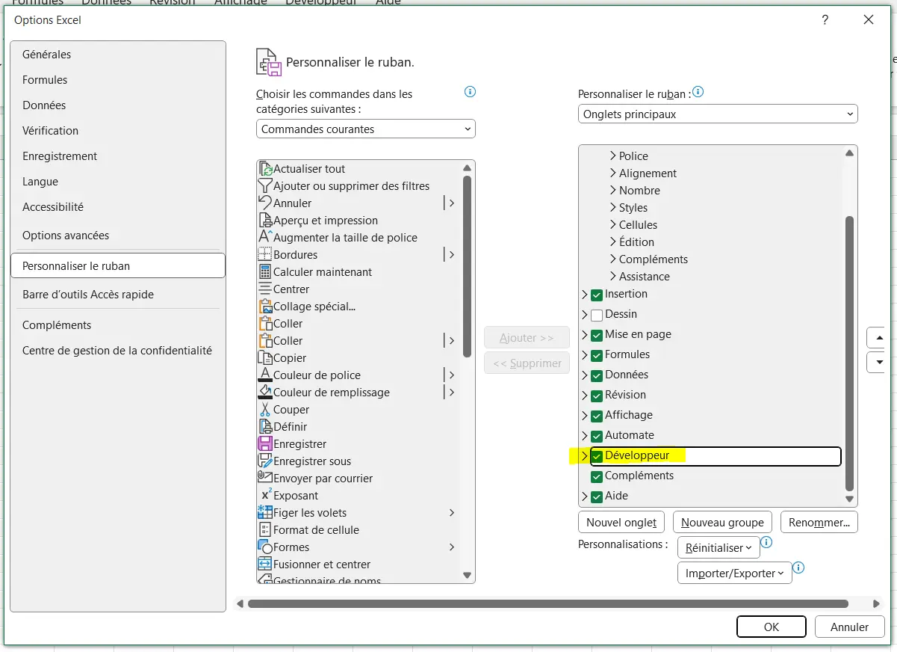
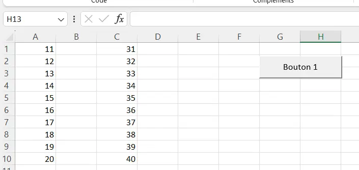

## Sommaire

1. Introduction
2. VBA, c'est quoi ?
3. Prise en main
4. Variables et types de données
5. Conclusion
6. Bibliographie

| Timing | VBA, c'est quoi ? | Comparaison des MON et MOOC | Formation site excel | Formation YouTube |
| -------| -------- | -------- | -------- |
| Temps prévu (en heures) | 1 | 2 | 5 | 2 |
| Temps dédié (en heures) | 1 | 1 | 6 | 2 |


## 1. Introduction

Les MON sur VBA ne datent pas d'hier, cette année [Paul](https://francoisbrucker.github.io/do-it/promos/2023-2024/Le_Bihan-Paul/mon/temps-1.1/), [Mathis](https://francoisbrucker.github.io/do-it/promos/2023-2024/Mathis%20Schultz/mon/temps-2.1/#h4), [Agathe](https://francoisbrucker.github.io/do-it/promos/2023-2024/Agathe-Rabachou/mon/temps-2.1/) et [Lola](https://francoisbrucker.github.io/do-it/promos/2023-2024/Lola-Bourdon/mon/temps-2.1/) s'y sont déjà prêtés.

Cette fois-ci c'est à mon tour de découvrir se langage, à la fois par curiosité mais aussi par intérêt pour mon stage de fin d'études en tant que consultant en Supply Chain.

Pour ce faire, j'ai décidé de mêler la formation VBA proposée par le site d'[excel](https://www.excel-pratique.com/fr/vba) à la playlist YouTube [Formation VBA Excel](https://www.youtube.com/watch?v=X9xR7LW6dPs&list=PL4moFYPB3KVsY_E5WAANYuZGeUQekvS3U) de la chaîne Excel Formation et de confronter ces apprentissages aux différents MON existants.

## 2. VBA, c'est quoi ?

VBA pour "Visual Basic for Applications" est un langage de programmation intégré, développé par Microsoft dans le but d'automatiser les opérations réalisées dans les outils de la suite office : Excel, Word, Powerpoint...

Il est très utile pour :
- automatiser des tâches
- personnaliser des applications
- intégrer des données en facilitant le flux de travail
- développer des applications

## 3. Prise en main

### Onglet développeur

Pour commencer à prendre en main VBA, il est nécessaire d'accéder aux outils de développements d'Excel. Pour se faire, cliquer sur Fichier > Options > Personnaliser le Ruban puis sélectionner la case Développeur.



Reste alors à ouvrir l'éditeur grâce au bouton "Visual Basic" ou avec le raccourci Alt + F11.

### Macro

L'automatisation des tâches en VBA est rendu possible grâce à l'enregistreur de macro.

**Qu'est-ce qu'une macro ?**

Une macro est une série d'instructions ou de commandes enregistrées dans un langage de programmation intégré - dans notre cas VBA - qui permet d'automatiser des tâches répétitives ou complexes dans une application. 

**Enregistreur de macro**

Une macro peut-être facilement implementée en VBA grâce à l'enregistreur de macro : il s'agit d'un outil permettant d'enregistrer les actions de l'utilisateur en temps réel et de générer automatiquement le code VBA correspondant. C'est un moyen très pratique pour créer rapidement des macros sans avoir à écrire manuellement le code.

Pour utiliser l'enregistreur de macro, depuis l'onglet Développeur sélectionner "Enregistrer une macro", toutes les manipulations effectuées seront alors enregistrées : suppression / ajout / déplacement de données, tout sera converti en VBA.
Il suffit ensuite de cliquer sur "Arrêter l'enregistrement" pour terminer la macro.

Dans Visual Basic apparaît alors un nouveau module, lorsqu'on le sélectionne la macro retranscrite en langage VBA apparaît.

### Caractéristiques d'une macro

Une macro commence par Sub et se termine par End Sub.
Il est également possible d'ajouter :
- un nom suivi de parenthèses après "Sub" pour nommer notre macro
- des commentaires qui ne seront pas exécutés en ajoutant du texte précédé d'une apostrophe

```
Sub nom_macro()

'Ceci est un commentaire

End sub
```

Pour faciliter l'exécution de notre macro, il est possible d'ajouter un bouton : Insérer > Bouton > Sélectionner la macro > Tracer le bouton.



Il est également possible de :
- sélectionner une ou plusieurs cellules
- modifier la valeur d'une cellule
- changer la mise en forme d'un texte
- afficher / masquer des feuilles...

Le MON d'[Agathe](https://francoisbrucker.github.io/do-it/promos/2023-2024/Agathe-Rabachou/mon/temps-2.1/) résume très bien ces fonctionnalités, je me contenterai donc de renvoyer vers sa page pour éviter les répétitions et de développer davantage la partie 4 sur les variables et types de données.

## 4. Variables et types de données

### Variables
Dans VBA, il existe différents types de données tels que **les entiers (Integer), les nombres décimaux (Double), les chaînes de caractères (String), etc.** On peut déclarer une variable et lui assigner une valeur de la manière suivante :

```
Dim monEntier As Integer
monEntier = 10
```
### Structures de contrôle

Les structures de contrôle, comme les boucles et les conditions, sont utilisées pour contrôler le flux d'exécution du programme. Par exemple, **la boucle For...Next** est couramment utilisée pour répéter une série d'instructions un certain nombre de fois :

```
For i = 1 To 10
    ' Instructions à répéter
Next i
```
Les instructions conditionnelles, comme **If...Then...Else**, sont également disponibles pour exécuter des blocs de code en fonction de certaines conditions :

```
If monEntier > 5 Then
    ' Instructions si monEntier est supérieur à 5
Else
    ' Instructions si monEntier est inférieur ou égal à 5
End If
```

### Fonctions et sous-procédures

En plus des macros, il est possible de créer des fonctions et des sous-procédures dans VBA. Les fonctions prennent généralement des arguments en entrée et renvoient une valeur, tandis que les sous-procédures effectuent simplement des actions sans renvoyer de valeur. Voici un exemple de fonction qui renvoie la somme de deux nombres :

```
Function Somme(a As Integer, b As Integer) As Integer
    Somme = a + b
End Function
```

### Manipulation des objets

En VBA, on travaille généralement avec des objets qui représentent les éléments d'une application (comme des cellules dans Excel ou des paragraphes dans Word).
On peut manipuler ces objets en accédant à leurs propriétés et en appelant leurs méthodes. Par exemple, pour modifier le contenu d'une cellule dans Excel, on peut utiliser le code suivant :

```
ActiveSheet.Cells(1, 1).Value = "Nouvelle valeur"
```
Cela change la valeur de la cellule A1 de la feuille active.

## 5. Conclusion

Au cours de ce MON j'ai appris à automatiser des tâches simples, avec l'enregistreur de macro ou à la main en écrivant le script.
On retrouve dans ce langage une logique prosimilaire à d'autres langages : l'utilisation de variables, de fonctions, d'objets...

Ce MON m'a apporté une première compréhension aux bases de la programmation en VBA. Celle-ci sera très utile au travail que j'exercerai dans mon stage de consultant en Supply Chain notamment pour automatiser des processus de gestion de dépenses, de stock, de production...
