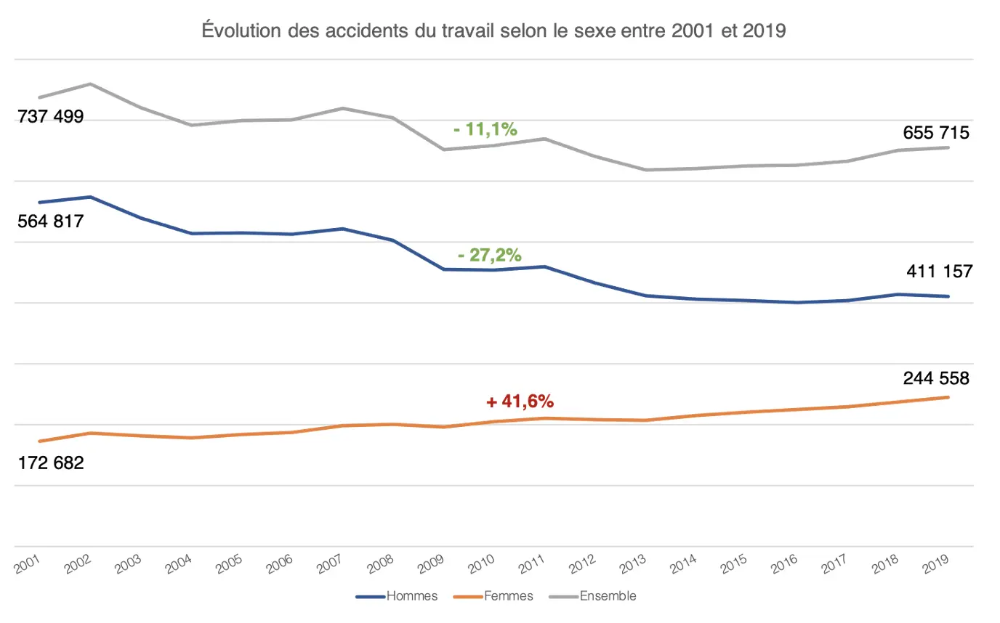

## Horodateur

| Timing | Lecture livre | Systèmes organisationnels | Études de cas |
| -------| ------------- | ------------------------- | ------------- |
| Sprint 1 - Temps prévu (en heures) | 4 | 4 | 2 |
| Sprint 1 - Temps dédié (en heures) | 4 | 5 | 2 |

## Sommaire

1. Introduction
2. Modèles organisationnels : Organisation Scientifique du Travail (OST)
3. Philippe Askenazy : "Les désordres du travail. Enquête sur le nouveau productivisme."
4. Comparaison statistique des conditions de travai au fil du temps
5. Études de cas
6. Conclusion
7. Bibliographie

## 1. Introduction

L'objectif de ce MON est de revoir la question du travail sur les dernières décennies.
Il commence par une révision des modèles organisationnels (Taylorisme, fordisme, toyotisme...) permettant de situer les **enjeux socio-économiques** du travail au fil des époques. Dans un second temps, la lecture du livre de Philippe Askenazy permet de soulever différentes controverses sur les **conditions de travail** au milieu des années 90. Celles-ci seront **comparées avec les statistiques actuelles** du gouvernement français avant d'ouvrir sur les enjeux socio-économiques actuels et la place du travailleur entre délocalisation/relocalisation/industrie 4.0/digitalisation...

## 2. Modèles organisationnels : Organisation Scientifique du Travail (OST) [1] & [2]

L'OST trouve ses fondements dans l'ouvrage "Recherches sur la nature et les causes de la richesse des nations" publié en 1776 par l'économiste écossais **Adam Smith**. L'étude de la manufacture d'épingle lui permet de remarquer deux conclusions quant à la division du travail :
- elle permet d'accroître la **productivité** de l'entreprise
- elle **nuit au développement intellectuel** des ouvriers. Le travail répétitif de gestes simples rend le travailleur "aussi stupide et ignorant qu'il est possible à une créature de le devenir." [3]

### 2.1 L'école classique du management [4], [5] & [6]

L'école classique du management (ou école formelle des organisation), initiée par les travaux de **Fayol, Taylor et Weber,** a profondément marqué la gestion des entreprises.

#### Fayol, la rationalité administrative
**Henri Fayol est un ingénieur civil des mines français.** Auteur de **L'Administration industrielle et générale (1916)**, il propose une théorie administrative qui se concentre sur la **direction de l'entreprise,** reposant principalement sur son expérience personelle de directeur général d'une société minière pendant 30 ans. Il estime que toutes les activités dans l'entreprise se répartissent en 6 catégories :
1. La fonction technique : production, fabrication, transformation
2. La fonction commerciale : achats, ventes, échanges
3. La fonction financière : recherche et gestion des capitaux
4. La fonction de sécurité : protection des bien et des personnes
5. La fonction de comptabilité : inventaire, bilan, prix de revient...
6. La fonction administrative : prévoir, organiser, commander, coordonner et contrôler.

La fonction administrative est ce que l'on appelle désormais le management. Selon Fayol, l'efficacité de cette dernière dépend de l'application de 14 principes :
1. La division de travail
2. L'autorité et la responsabilité
3. La discipline
4. L'unité de commandement
5. L'unité de directio
6. La subordination de l'intérêt particulier à l'intérêt général
7. Rémunération du personnel
8. La centralisation
9. La hiérarchie
10. L'ordr
11. L'équité
12. La stabilité du personnel
13. L'initiative
14. L'union du personnel

#### Weber, la rationalité structurelle
**Max Weber, économiste et sociologue allemand,** préconise lui une **organisation bureaucratique de l'entreprise,** qu'il considère comme garante de son efficacité.  Sa théorie de la bureaucratie, met en avant la rationalisation des organisations à travers une **structure hiérarchique stricte, des règles et des procédures bien définies.** Son ouvrage **Économie et Société (1921)** sera publié inachevé et à titre posthume.

Selon Weber, la mise en place de l'administration bureaucratique représente une manifestation puissante de la rationalisation. Elle symbolise l'avancée de la domination légale ou rationnelle au détriment des formes traditionnelles ou charismatiques de légitimité, souvent prévalentes dans les structures antérieures. Weber identifie trois types de domination légitime :
- **La légitimité charismatique,** fondée sur la reconnaissance des qualités extraordinaires d'un leader, telles que le charisme. Cependant, cette forme de légitimité est vulnérable aux défis posés par la succession en cas de disparition du leader charismatique.
- **La légitimité traditionnelle** repose sur la croyance en la validité des traditions historiques et en la légitimité des détenteurs du pouvoir en vertu de ces traditions. Toutefois, elle est remise en question par son manque d'adaptabilité aux évolutions de l'environnement.
- **La légitimité rationnelle-légale,** dont la validité découle de son caractère rationnel et de la conformité aux règles et aux lois établies. Dans le modèle organisationnel de Weber, l'autorité repose sur cette forme de légitimité, où le pouvoir est exercé conformément à des statuts légaux et à des compétences fondées sur des règles établies de manière rationnelle.

#### Taylor, la rationalité productive : le Taylorisme

**Frederick Winslow Taylor, ingénieur américain,** s'intéresse à l'organisation des ateliers de production. 

Il conceptualisera le constat d'Adam Smith au travers son livre **The Principles of Scientific Management (1911)** pour développer une OST consistant en une division **horizontale** (spécialisation avec parcellisation des tâches d'exécution et chronométrage pour définir "the one best way") et **verticale** (hiérarchie afin de séparer les tâches d'éxecution de celles de conception) du travail.

Le taylorisme repose ainsi sur une approche scientifique du travail, visant à maximiser l'efficacité en éliminant les mouvements inutiles et en spécialisant les tâches.

Indexant le salaire des employés sur la production, cette méthode permettra une nette **augmentation de la productivité et une fidélisation des employés.**+

### 2.2 Le Fordisme

**Henri Ford** reprend l'OST proposée par Taylor en y intégrant le **travail à la chaîne**. Les ouvriers n'ont alors plus besoin de se déplacer, de plus la cadence de production devient **rythmée** par le convoyeur.

Cette méthode propice au développement des **machines industrielles** et à la **standardisation** des pièces et produits finis permet non seulement une hausse de la productivité mais aussi de la production.  Ce modèle induit une **production de masse où la demande est dès lors conditonné par l'offre.**

Le concept de fordisme a été appliqué pour la première fois en 1908 dans la production de la **Ford T**, la première voiture de série. À ce jour, la Ford T reste la troisième voiture la plus produite, avec plus de 15 millions d'exemplaires.

Au-delà d'une organisation du travail, le fordisme représentait un **mode de régulation du capitalisme**. Il garantissait aux travailleurs des salaires élevés, augmentant leur pouvoir d'achat et permettant ainsi d'acheter les produits qu'ils contribuaient à fabriquer, tout en les fidélisant. Il promettait le plein emploi, ce qui a entraîné un exode rural de peuplement des zones industrielles. Le fordisme était synonyme de progrès technique et a notamment contribué à l'émergence des **Trente Glorieuses** et à la **consommation de masse.**

En 1973, la France comptabilisait 8 millions d'ouvriers soit 37% de sa population active.

### 2.3 Dégradation des conditions de travail dans l'OST tayloro-fordiste

Les répercussions de cette récente OST se feront fortement ressentir dans le domaine industriel, engendrant des impacts **tant sur le plan physique que moral.** La diminution prévue de la main-d'œuvre qualifiée au profit d'une augmentation des **Ouvriers Spécialisés (OS)** confrontés à des tâches exigeantes en constitue un aspect majeur. De plus, sur le plan moral, cette situation pose problème en raison du **manque d'autonomie** et de la **pression exercée par la hiérarchie** : la qualité du travail fournit par les OS mais aussi leur productivité sont surveillés de près.

Cette méthode d'organisation du travail tant à se généraliser à d'autres secteurs tels que la grande distribution et la restauration rapide. Cependant, la détérioration des conditions de travail entraîna une augmentation du turn over des employés et de l'absentéisme, se répercutant sur la productivité.

### 2.4 Toyotisme

Pour remédier aux lacunes de productivité associées à l'OST tayloro-fordiste, **Taiichi Ohno** propose dans les **années 1960** une alternative novatrice : le **Toyotisme** ou **Lean Manufacturing**, axant la **production en fonction de la demande**. Cette approche d'**excellence opérationnelle**, mit plusieurs dizaines d'années à se déployer au Japon. Ses concepts fondamentaux en sont :
**- Les 5 zéros :** zéro stock, zéro délai (Just-in-Time), zéro défaut, zéro panne, zéro papier
**- Le Jidoka ou autonomisation des machines :** les machines sont programmées pour s'arrêter automatiquement en cas de problème.
**- Le kaizen ou amélioration continue :** une culture d'amélioration permanente est instaurée.
**- Le kanban :** un système d'étiquetage est utilisé pour gérer efficacement les stocks et la production.
**- Les cercles de qualité :** des groupes composés d'ouvriers et de cadres se réunissent pour identifier et résoudre les problèmes de qualité et de production.
**- Muda, Muri, Muda :** une méthode permettant d'élimiter le gaspillage.
**- Le Heijunka :** une méthode permettant de lisser la production et réduire les irrégularités.

Cette approche révolutionnaire a permis de répondre aux défis posés par les modèles de production traditionnels, en favorisant une **gestion plus efficiente des ressources et en améliorant la qualité tout en réduisant les coûts.**

### 2.5 Et maintenant ?

Dans les années 1970, les entreprises ont adopté des modèles d'organisation du travail plus **flexibles** pour répondre à la demande changeante du marché.

La flexibilité, qu'elle soit quantitative, qualitative ou salariale, permet d'ajuster la production et l'emploi aux fluctuations économiques.

Parallèlement, le **management participatif** a émergé dans les années 1980, encourageant la collaboration avec les employés pour fixer des objectifs réalistes et les incitant à s'impliquer dans les performances de l'entreprise.

En 2017, la France compte 5,5 millions d’ouvriers soit 20,7% de la population active.

## 3. Philippe Askenazy : "Les désordres du travail. Enquête sur le nouveau productivisme." [7]

"Chaque jour en France, 2000 personnes sont victimes d'un accident du travail nécessitant une réduction d'activité. Le coût global cumulé des accidents et des maladies professionnels s'élève à 3% de la richesse nationale, soit l'équivalent théorique de plus de dix jours fériés supplémentaires".

À travers son livre, Philippe Askenazy étudie l'évolution des conditions de travail dans les années 1990, confrontées au nouveau productivisme : le **"productivisme réactif".** Alors que le travail serait devenu plus flexible, plus souple, plus "intellectuel" grâce notamment à l'automatisation celui-ci aurait du s'en trouver "moins pénible pour le corps". Pour autant, l'auteur soulève un paradoxe montrant, chiffres à l'appui qu'il n'en est pas du tout le cas et qu'au contraire, ces chiffres semblent s'aggraver au fil des années. S'appuyant sur les modèles des États-Unis et de la France, Askenazy tente d'apporter des réponses à ce paradoxe, pointant du doigt entreprises et gouvernements.

**Chapitre 1 :** 
Askenazy introduit le débat en juxtaposant deux réalités apparemment contradictoires : d'une part, le "productivisme réactif" caractérisé par une nouvelle organisation du travail mettant l'accent sur la polyvalence et la satisfaction client, développé aux États-Unis et adopté en France. D'autre part, les statistiques révélant une augmentation de la pénibilité physique du travail, suivant une tendance déjà observée aux États-Unis. La question centrale est alors de comprendre comment ce nouveau productivisme a pu entraîner une détérioration des conditions de travail.

**Chapitre 2 :** 
Askenazy examine les interprétations dominantes de cette dégradation des conditions de travail, les critiquant toutes. Il rejette l'idée que l'augmentation des maladies professionnelles serait simplement due à une meilleure détection, et remet en question l'accent mis sur les risques psychologiques, soulignant que cela néglige les pénibilités physiques et encourage les solutions individuelles plutôt que collectives.

**Chapitre 3 et 4 :** 
L'auteur explore les véritables causes de la dégradation des conditions de travail, pointant du doigt l'intensification du travail et la réduction du temps de travail, notamment à travers les lois sur la réduction du temps de travail (RTT) en France. Il critique également l'impact de cette réduction sur les travailleurs les plus vulnérables, soulignant une augmentation de la flexibilité des horaires de travail au détriment du temps de loisir effectif.

**Chapitre 5 :** 
Askenazy examine le "miracle" américain, notant une baisse continue des accidents du travail et des maladies professionnelles depuis les années 1990. Il identifie l'action conjointe des pressions syndicales et des forces du marché, notamment à travers le système d'assurances privées incitatives, comme principaux facteurs de cette amélioration.

**Chapitre 6 :** 
En contraste, l'auteur expose l'impasse française sur ces questions, soulignant le manque de pouvoir des inspecteurs et médecins du travail, l'absence d'incitations pour les employeurs à améliorer les conditions de travail, et le silence des acteurs syndicaux et politiques sur la question. Il plaide pour un débat urgent sur la transition vers une logique de protection des salariés plutôt que d'assurance des employeurs.

**Conclusion :** 
Askenazy propose des solutions inspirées du modèle américain, soulignant que les employeurs ont plus de marges de manœuvre qu'ils ne l'admettent généralement, et appelant à un changement de perspective vers la protection des salariés.

## 4. Comparaison statistique des conditions de travai au fil du temps

L'**anact (agence nationale pour l'amélioration des conditions de travail)** propose une étude de l'évolution de la sinistralité au travail en France différenciée entre les femmes et les hommes du secteur privé entre 2001 et 2019. [8] Sont alors étudiés l'évolution des accidents de travail, des accidents de trajet et des maladies professionnelles.

Voici quelques conclusions de l'étude :
- "En 2019, sur 19,6 millions de salarié-e-s du secteur privé, les accidents du travail concernent 650 715 personnes, dont 62,7% d’hommes et 37,3% de femmes. "
- "Alors que les effectifs salariés ont augmenté depuis 2001 (+13,5%), la baisse globale des accidents du travail (-11,1%) constitue une avancée encourageante, notamment pour les hommes (-27,2%). Mais elle masque la progression continue des accidents du travail pour les femmes (+41,6%)."
- Le secteur le plus accidentogène pour les hommes est le BTP avec plus de 86 000 accidents de travail reconnus. Il s'agit des activités de service pour les femmes avec plus de 106 000 accidents reconnus. Ce dernier chiffre est en hausse de 110% sur la période 2001-2019.

**Bien qu'en baisse, les chiffres des accidents du travail en France restent loin d'être négligeables :** en 2021, 640 000 accidents du travail étaient reconnus dont 39 000 dits "graves". En réaction, le gouvernement a lancé fin 2023 une **campagne de prévention** pour alerter l'opinion publique : "Sécurité au travail : responsabilité de l'entreprise, vigilance". [8] Dans le but de faire réagir l'opinion public sont alors mis en avant des chiffres chocs : **près 700 morts par an soit 2 par jour sont liées aux accidents de travail.**

"D'après les relevés du service européen de statistiques Eurostat, la France aurait le plus mauvais taux, avec 3,53 accidents mortels du travail pour 100 000 salariés". Ce classement reste toutefois à manipuler avec précaution dans la mesure où les pays ne recensent pas de la même façon les accidents du travail.

## 5. Étude de cas : pourquoi les chiffres d'accidents du travail restent élevés ? [10] & [11]

À l'heure actuelle, l'industrie automobile française traverse une période de profonds bouleversements, où les modèles traditionnels de travail sont remis en question par une série de facteurs. D'une part, la **désindustrialisation** progressive du secteur, marquée par des **délocalisations** et des **restructurations** permanentes, a entraîné une baisse significative de la production et de l'emploi. Cette dynamique a été alimentée par une **concurrence** accrue avec des pays à bas coûts, incitant les constructeurs français à déplacer une partie de leur production vers des régions où les coûts de main-d'œuvre sont plus faibles. En conséquence, les conditions de travail se sont **détériorées**, avec une **pression croissante** sur les travailleurs pour maintenir la **compétitivité** et préserver les emplois en France.

D'autre part, l'introduction de méthodes de travail inspirées du modèle de production lean a profondément transformé l'organisation du travail dans l'industrie automobile. Initialement présenté comme un moyen de rationaliser la production et d'améliorer la qualité, **le lean s'est vu perverti** et s'est révélé être une source de flexibilité accrue, mais aussi de **précarisation des conditions de travail.** Les travailleurs se retrouvent confrontés à des horaires de travail variables, des journées prolongées et une pression constante pour atteindre des objectifs de production. De plus, la responsabilisation des équipes de travail s'est souvent traduite par un **contrôle** accru et un **stress** accru, plutôt que par une meilleure autonomie et une amélioration de la satisfaction au travail.

En parallèle, l'émergence du numérique dans l'industrie, sous la forme de l'Industrie 4.0 et de la fabrication digitale, a suscité l'espoir d'un travail moins pénible grâce à l'automatisation et à l'optimisation des processus de travail. Cependant, cette transformation technologique n'a pas nécessairement abouti à une amélioration des conditions de travail. Au contraire, elle a souvent conduit à une **intensification** du travail, avec des salariés de plus en plus **dépendants des technologies** et soumis à des rythmes de travail accélérés.

Dans ce contexte, les **accords de compétitivité (dispositif mis en place par la réforme du code du travail français en 2017)** sont devenus un outil clé pour les constructeurs automobiles afin de modifier les conditions de travail et de maintenir la compétitivité de l'industrie en France. Ces accords, négociés en échange de garanties d'emploi, ont souvent conduit à une plus grande flexibilité du temps de travail et à une augmentation de la charge de travail pour les salariés.

En conclusion, malgré les avancées technologiques et les changements organisationnels, les conditions de travail dans l'industrie automobile française restent précaires et marquées par une pression constante pour maintenir la compétitivité. La convergence du lean, de la digitalisation et du chantage à l'emploi a créé un environnement où les travailleurs sont confrontés à des défis croissants pour concilier leurs besoins professionnels et personnels.

## 6. Conclusion

Outre la révision de modèles organisationnels et fondements du management en entreprise, ce MON m'aura permis de prendre du recul quant à la qualité des conditions de travail et de ses responsables.

Bien que la plupart des bouleversements technologiques (Industrialisation, robotisation) ou organisationnels (adoption du lean management notamment) semblent propices à une amélioration des conditions de travail - davantage d'autonomie, de flexibilité, travail moins laborieux, plus ergonome, seul leur implémentation effective permettra de juger véritablement d'un embellissement du travail.

Lorsque dégradation des conditions il ya, le problème réside majoritairement dans l'écart qu'il existe entre théorie et pratique et notamment dans le manque de prise en compte du facteur humain lors du passage de l'un à l'autre, le "lean à la française" en est un bon exemple. Malgré ses promesses de qualité, de responsabilisation, de gain en autonomie, d'écoute de l'opérateur, ce mode de travail peut devenir néfaste au bon développement de l'opérateur s'il s'en voit perverti, accroissant pression physique et morale dans le but de conserver la performance exigée par son entreprise.  

## 7. Bibliographie

[1] : Chaîne YouTube Les SES en vidéos : Comment l'organisation du travail a-t-elle évolué ? (2020). Disponible ici : 3https://www.youtube.com/watch?v=VE81xDeKY0w
[2] : UE Sciences Humaines et Sociales, Module 2 - Individu, travail, organisation, TD2 : Évolution des modèles productifs et des conditions de travail.
[3] : Adam Smith : Recherches sur la nature et les causes de la richesse des nations (1776), Tome 1, Chapitre 1.
[4] : Michel Barabel, Olivier Meier, Thierry Teboul : Les théories traditionnelels du management (2013), chapitre 1.
[5] : Amina Kcirid, Raja Temnati : L'école classique (2021), chapitre 1.
[6] : Samir Chaqri : Les écoles de la théorie des organisations (2009). Disponible ici : https://www.memoireonline.com/02/09/1995/m_Les-ecoles-de-la-theorie-des-organisations1.html
[7] : Philippe Askenazy : Les désordres du travail. Enquête sur le nouveau productivisme (2004), Éditions du Seuil et La République des Idées.
[8] : Agence nationale pour l'amélioration des conditions de travail : Sinistralité au travail en France : une évolution différenciée entre les femmes et les hommes entre 2001 et 2019 (2022).
[9] : France inter : "Accidents du travail en France : cinq chiffres à retenir" (2023). Disponible ici : https://www.radiofrance.fr/franceinter/accidents-du-travail-en-france-cinq-chiffres-a-retenir-2759756
[10] : Juan Sebastian Carbonell : Entre délocalisations, intensification, et digitalisation : travailler dans l'industrie automobile aujourd'hui, SciencesPo laboratoire interdisciplinaire d'évaluation des politiques publiques. Disponible ici : https://www.sciencespo.fr/liepp/fr/content/juan-sebastian-carbonell-entre-delocalisations-intensification-et-digitalisation-travailler-.html
[11] : Jérôme Gautié : Le lean à la française : management technocratique et faiblesse du dialogue social. L'exemple de l'aéronautique, SciencesPo laboratoire interdisciplinaire d'évaluation des politiques publiques. Disponible ici : https://www.sciencespo.fr/liepp/fr/content/le-lean-la-francaise-management-technocratique-et-faiblesse-du-dialogue-social-l-exemple-de-.html