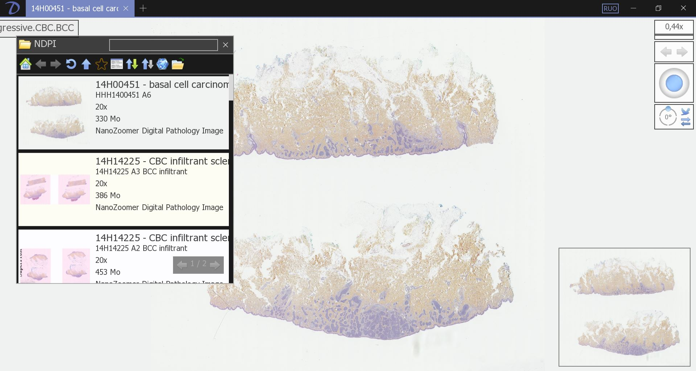
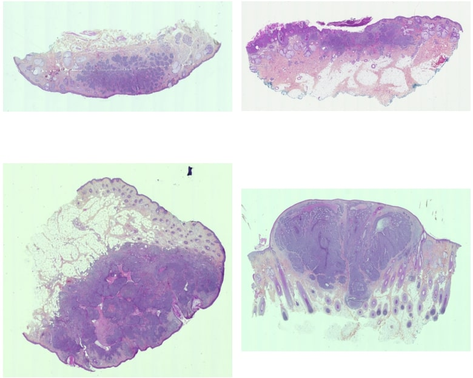


**Niveau :** Avancé
**Prérequis :** [à définir]


## Sommaire

1. Introduction
2. Description du projet
3. Sprint 1 : analyse préliminaire des données
(Il sera dans un 1er temps nécessaire d'effectuer du pré-traitement de ces données puis de réaliser de la segementation afin d'uniquement détecter les zones cancéreuses)
4. Sprint 2 : algorithmes de Machine Learning
(Ensuite, une fois la segmentation au point, nous allons pouvoir commencer à faire tourner des algorithmes de ML pour effectuer une classification : "cancer" ou "pas de cancer")
5. Conclusion
6. Bibliographie

## 1. Introduction

Le but de ce projet est d'apporter des solutions informatiques d'analyse de données au service de l'anatomie pathologique. En particulier, concernant le risque de récidive du carcinome basocellulaire.

Les médecins perdent un temps précieux dans l'analyse de lames afin d'évaluer l'envergure du carcinome basocellulaire. Le Machine Learning doit pouvoir aider à trier ces différentes lames pour ne demander aux médecins qu'une analyse approfondie.

## 2. Description du projet

### 2.1 Informations générales

**Titre :** Évaluation du risque d’agressivité des carcinomes basocellulaires à partir de multiples jeux de données
**Champ médical	:** Cancérologie Diagnostic Anatomie Pathologique
**Entité de rattachement :**	Service d’Anatomie Pathologiques, Timone, APHM, UMR911, MMG, AMU

### 2.2 Description du projet

L'Anatomie Pathologique (anapath) est une spécialité médicale portant le diagnostic des maladies sur le plan microscopique, c’est-à-dire sur l'interprétation d’images des tissus et cellules, et notamment de toute la pathologie tumorale et du cancer.

Le développement des techniques de numérisation offre de nouvelles perspectives pour cette spécialité qui pourra bientôt se passer de microscopes optiques au profit d’écran haute résolution. Dans ce contexte de numérisation totale, l'analyse d'images et certains pipeline de machine-learning offrent des perspectives de développement d’outils pratiques et/ou puissants d’aide au diagnostic : outre l’accélération de la vitesse pour rendre un diagnostic en routine aidé par l’informatique, la genèse de données normalisées et reproductibles de santé par l’intermédiaire de ces outils est un enjeu de compétitivité majeure pour la recherche et le développement en cancérologie dans les 5 prochaines années. Les tissus offrent de très nombreuses couches d’information actuellement peu exploitables. 

Les images microscopiques sont multimodales et le pathologiste peut s’aider de techniques pour visualiser différentes modalités d’information biologique, superposées sur une même coupe tissulaire, comme l’expression de protéines spécifiques qui jouent alors un rôle de filtre pour masquer ou au contraire révéler des cellules tumorales, les vaisseaux ou encore l’inflammation : l’immunohistochimie. Grace à ces images, et après intégration aux données cliniques, le pathologiste est à même de proposer des éléments pour la décision médicale. 

Le cancer de la peau le plus fréquent est le carcinome basocellulaire, qui est un diagnostic facile au microscope avec des images prototypiques, reproductibles. L’incidence élevée de ce cancer mobilise de nombreuses ressources pour le diagnostic, qui pourraient être automatisées.

La thématique de l’aide au diagnostic et de l’automatisation du diagnostic en pathologie s’inscrit dans un contexte actuel très concurrentiel portant essentiellement sur l’analyse d’image avec divers projets industriels et commerciaux en phase de validation voire de production dans d’autres organes (Medipath, Ibex, Vita-DX, Primaa, Howkin), qui sont financés. Seule la société Primaa développe des algorithmes dédiés à la dermatopathologie. In fine, ces nouveaux outils d’aide au diagnostic rencontreront nécessairement des obstacles réglementaires (marquage CE) et financiers (remboursement CPAM et/ou RIHN).

Aucun de ces projets ne se focalisent sur les données existantes (compte-rendus) ni sur l’intégration de multiples jeux de données (clinique, histologique) avec l’analyse d’image pour répondre à des questions cliniques précises. Dans le carcinome basocellulaire, la question clinique à se poser est : la tumeur va-t-elle récidiver ? Ce qui conditionne la surveillance et des traitements complémentaires.

**Le but de ce projet est de créer un outil répondant le plus précisément à cette question du risque de récidive en se basant sur le plus de données disponibles et fiables possible.**

Ce projet s’articule en parallèle, pour la partie compte-rendus, avec un autre projet déposé portant sur l’extraction automatisée de données de compte-rendus d’anatomie pathologique : il sert de validation théorique en vie réelle, sur une question clinique donnée.

Données : fichiers images, lames de microscopes numérisées, format .ndpi – anonymisées.

### 2.3 Missions et attendus souhaités

Le but de ce POK est de proposer un algorithme fonctionnel permettant de classer les lames cancéreuses et celles non cancéreuses.

## 3. Sprint 1 : analyse préliminaire des données

### 3.1 Conversion automatisée des images du format ..ndpi au format .jpg

Les images sur lesquelles je travaille proviennent de microscopes numériques. Elles sont extraites au format .ndpi "NanoZoomer Digital Pathology Image" et sont de très hautes résolutions.

L'échantillon dont je dispose propose des images allant de 100Mo à 1Go.

Il est possible de les lire en utilisant le NDPI Viewer "NDP.wiew2" développé par le fabricant japonais d'instruments scientifiques Hamamatsu Photonics K.K..
Ce logiciel est téléchargeable gratuitement sur [le site d'Hamamatsu](https://www.hamamatsu.com/eu/en/product/life-science-and-medical-systems/digital-slide-scanner/U12388-01.html)

Voici son interface :



Afin de pouvoir utiliser ces images dans un algorithme de machine learning, il faudrait les convertir dans un format plus propice à la programmation et permettant de réduire leur taille.

Toutefois, depuis NDP Viewer2, cette conversion ne peut se faire qu'image par image et serait trop chronophage pour convertir des 100aines d'images.

La première problématique de ce POK consiste alors à automatiser une conversion des images au format .ndpi vers .jpg afin de les lire plus facilement dans un algorithme python en réduisant notamment leur taille.

#### Tentative d'automatisation avec NDPview2

Ayant téléchargé NDPview2, ma première idée consiste alors à créer un algorithme Python convertissant les différents fichiers en faisant appel à ce NDP viewer.

```python
import os
import subprocess

# Chemins des dossiers
input_folder = 'C:\\Test-TER\\DATA-NDPI'
viewer_path = 'C:\\Program Files\\Hamamatsu\\NDP.view 2\\NDPView2.exe'
output_folder = 'C:\\Test-TER\\DATA-JPG'

# Chemin du fichier test
test_file = 'test.ndpi'
test_file_path = os.path.join(input_folder, test_file)

# Génération du chemin de sortie avec le même nom de fichier mais en extension .jpg
output_file_path = os.path.join(output_folder, os.path.splitext(test_file)[0] + '.jpg')

# Commande pour appeler le viewer NDPI et effectuer la conversion
command = [viewer_path, '-i', test_file_path, '-o', output_file_path]

# Exécuter la commande en utilisant subprocess.Popen
process = subprocess.Popen(command, stdout=subprocess.PIPE, stderr=subprocess.PIPE)
output, error = process.communicate()

# Afficher la sortie et les erreurs
print("Sortie:", output.decode())
print("Erreurs:", error.decode())

print("Conversion pour le fichier de test terminée.")
```
Hélas le programme se contente de lancer le viewer sans effectuer la conversion. Il semblerait donc que le viewer ne puisse servir de façon automatisée mais nécessite des actions manuelles pour effectuer la conversion.

#### Tentative d'automatisation avec OpenSlide


### 3.2 Visualisation d'images

Pour commencer, regardons quelques images dont nous disposons.

```python
import matplotlib.pyplot as plt
import matplotlib.image as mpimg

# Liste des chemins d'accès aux images
image_paths = ['C:\\TER\\visu1.png', 'C:\\TER\\visu3.png', 'C:\\TER\\visu2.png', 'C:\\TER\\visu4.png']

# Créer une figure avec 2x2 sous-graphiques
plt.figure(figsize=(8, 8))

# Boucle pour afficher chaque image dans un sous-graphique
for i, image_path in enumerate(image_paths, 1):
    
    img = mpimg.imread(image_path)
    plt.subplot(2, 2, i)
    plt.imshow(img)
    plt.axis('off')

# Ajuster l'espacement entre les sous-graphiques
plt.tight_layout()

plt.show()
```


Ces différentes images sont à l'heure actuelle peu exploitables.
On y remarque beaucoup de bruit, des tâches qui pourraient tromper l'algorithme quant à la détection du carcinome... 


En noir, la zone où se trouve le carcinome.
En rouge, du bruit pour l'algorithme

Il va donc être nécessaire d'effectuer un pré-traitement de ces données pour réaliser la segmentation "zone cancéreuse vs zone non cancéreuse".

### 3.1 test de pré-traitement sur les fichiers .ndpi
### 3.2 Conversion des fichiers .ndpi au format .jpg
https://www.hamamatsu.com/eu/en/product/life-science-and-medical-systems/digital-slide-scanner/U12388-01.html

### 3.3 pré-traitement 
## 4. Sprint 2 : algorithmes de Machine Learning
(Ensuite, une fois la segmentation au point, nous allons pouvoir commencer à faire tourner des algorithmes de ML pour effectuer une classification : "cancer" ou "pas de cancer")

## 5. Conclusion
## 6. Bibliographie