
**Niveau :** Avancé
**Prérequis :** Bases en Python et en Datasciences (traitement d'image, segmentation, machine learning)


## Sommaire

1. Introduction
2. Description du projet
3. Analyse préliminaire des données
4. Pré-traitement des données
5. Conclusion
6. Bibliographie

## 1. Introduction

Le but de ce projet est d'apporter des solutions informatiques d'analyse de données au service de l'anatomie pathologique. L'objectif est de créer un algorithme de classification afin d'aider au diagnostique les médecins dans le risque de récidive du carcinome basocellulaire.

Cette solution permettrait l'économie d'un temps précieux dans la lecture de lames au microscope afin de détecter les souches plus ou moins atteintes. La science des données doit pouvoir aider à trier ces différentes lames pour ne demander aux médecins qu'une analyse approfondie de certains échantillons.

## 2. Description du projet

### 2.1 Informations générales

**Titre :** Évaluation du risque d’agressivité des carcinomes basocellulaires à partir de multiples jeux de données
**Champ médical	:** Cancérologie Diagnostic Anatomie Pathologique
**Entité de rattachement :**	Service d’Anatomie Pathologiques, Timone, APHM, UMR911, MMG, AMU

### 2.2 Description du projet


L'Anatomie Pathologique (anapath) est une spécialité médicale centrée sur **le diagnostic des maladies à un niveau microscopique, en interprétant des images de tissus et de cellules, notamment dans le contexte de la pathologie tumorale et du cancer.** Les avancées dans la numérisation ouvrent de nouvelles perspectives, permettant potentiellement de se passer des microscopes optiques au profit d'écrans haute résolution. Cette transition vers la numérisation totale offre des opportunités de **développement d'outils basés sur l'analyse d'images et des pipelines de machine learning pour faciliter le diagnostic.**

En plus d'accélérer le processus diagnostique, ces outils peuvent contribuer à générer des données de santé normalisées et reproductibles, représentant un enjeu majeur pour la recherche en cancérologie. Les images microscopiques, souvent multimodales, peuvent être analysées en utilisant des techniques telles que l'immunohistochimie, permettant au pathologiste de visualiser différentes modalités d'information biologique superposées sur une même coupe tissulaire.

La thématique de l'aide au diagnostic et de l'automatisation en pathologie est actuellement compétitive, principalement axée sur l'analyse d'image. Plusieurs projets industriels et commerciaux se concentrent sur cette problématique, bien que peu d'entre eux se consacrent spécifiquement à la dermatopathologie. Ces nouvelles approches rencontrent des défis réglementaires et financiers, notamment liés à l'obtention du marquage CE et au remboursement par les organismes de santé.

En particulier, le carcinome basocellulaire, le cancer de la peau le plus fréquent, offre des images prototypiques et reproductibles au microscope, ce qui pourrait **permettre une automatisation accrue du diagnostic.** Cependant, les projets existants ne se concentrent pas suffisamment sur l'intégration des données existantes (compte-rendus) ni sur la combinaison de multiples jeux de données (clinique, histologique) avec l'analyse d'image pour répondre à des questions cliniques spécifiques, telles que **la prédiction de la récidive tumorale.**

Données : fichiers images, lames de microscopes numérisées, format .ndpi – anonymisées.

### 2.3 Missions et attendus souhaités

Le but de ce POK est de proposer un algorithme fonctionnel permettant de classer les lames cancéreuses et celles non cancéreuses.
Pour se faire :
**- le sprint 1** consistera en la **compréhension** du projet, sa **description** ainsi qu'en **l'analyse préliminaire** des données.
**- le sprint 2** consistera à effectuer un pré-traitement qualitatif des données pour qu'elles soient prêtes à faire passer dans un algorithme de classification.


## 3. Analyse préliminaire des données

### 3.1 Conversion automatisée des images du format ..ndpi au format .webp

Les images sur lesquelles je travaille proviennent de microscopes numériques. Elles sont extraites au format .ndpi "NanoZoomer Digital Pathology Image" et sont de très hautes résolutions.

L'échantillon dont je dispose **propose des images allant de 100Mo à 1Go.**

Il est possible de les lire en utilisant le NDPI Viewer "NDP.wiew2" développé par le fabricant japonais d'instruments scientifiques Hamamatsu Photonics K.K..

Ce logiciel est téléchargeable gratuitement sur [le site d'Hamamatsu](https://www.hamamatsu.com/eu/en/product/life-science-and-medical-systems/digital-slide-scanner/U12388-01.html)

Voici son interface :

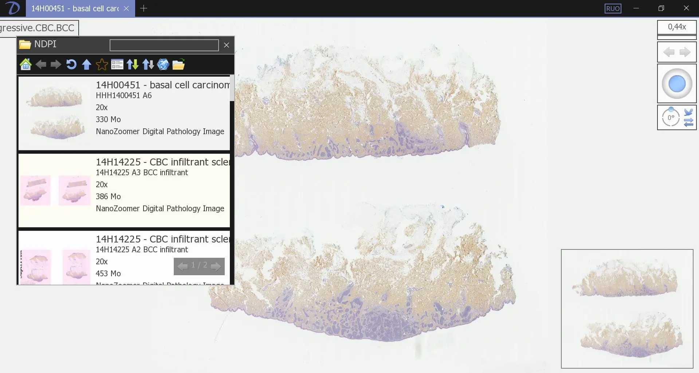

Afin de pouvoir utiliser ces images dans un algorithme de machine learning, **il faudrait les convertir dans un format plus propice à la programmation et permettant de réduire leur taille.**

Toutefois, depuis NDP Viewer2, cette conversion ne peut se faire qu'image par image et serait trop chronophage pour convertir des 100aines d'images.

La première problématique de ce POK consiste alors à **automatiser une conversion des images au format .ndpi vers .webp.**

#### Tentative d'automatisation avec NDPview2

Ayant téléchargé NDPview2, ma première idée consiste alors à créer un algorithme Python convertissant les différents fichiers en faisant appel à ce NDP viewer.

```python
import os
import subprocess

# Chemins des dossiers
input_folder = 'C:\\Test-TER\\DATA-NDPI'
viewer_path = 'C:\\Program Files\\Hamamatsu\\NDP.view 2\\NDPView2.exe'
output_folder = 'C:\\Test-TER\\DATA-JPG'

# Chemin du fichier test
test_file = 'test.ndpi'
test_file_path = os.path.join(input_folder, test_file)

# Génération du chemin de sortie avec le même nom de fichier mais en extension .webp
output_file_path = os.path.join(output_folder, os.path.splitext(test_file)[0] + '.webp')

# Commande pour appeler le viewer NDPI et effectuer la conversion
command = [viewer_path, '-i', test_file_path, '-o', output_file_path]

# Exécuter la commande en utilisant subprocess.Popen
process = subprocess.Popen(command, stdout=subprocess.PIPE, stderr=subprocess.PIPE)
output, error = process.communicate()

# Afficher la sortie et les erreurs
print("Sortie:", output.decode())
print("Erreurs:", error.decode())

print("Conversion pour le fichier de test terminée.")
```
Hélas le programme se contente de lancer le viewer sans effectuer la conversion. Il semblerait donc que le viewer ne puisse servir de façon automatisée mais nécessite des actions manuelles pour effectuer la conversion.

#### Tentative d'automatisation avec OpenSlide

Le programme ci-dessous n'est pas abouti...
Il semble théoriquement possible de convertir les fichiers .ndpi vers .webp grâce à la bibliothèque Python or en sortie ce programme renvoie une erreur indiquant que la bibliothèque ne peut lire les fichiers .ndpi.

cf [Documentation OpenSlyde Python](https://openslide.org/api/python/)


```python
!pip install openslide-python

!apt-get install openslide-tools
!pip install openslide-python

from openslide import OpenSlide
from PIL import Image

def convert_ndpi_to_jpg(input_path, output_path):
    # Ouvrir le fichier NDPI avec OpenSlide
    ndpi_slide = OpenSlide(input_path)

    # Extraire les dimensions de l'image
    width, height = ndpi_slide.dimensions

    # Lire l'image entière
    image = ndpi_slide.read_region((0, 0), 0, (width, height))

    # Convertir l'image PIL en mode RVB (si elle n'est pas déjà en mode RVB)
    if image.mode != 'RGB':
        image = image.convert('RGB')

    # Enregistrer l'image au format JPG
    image.save(output_path, 'JPEG')

    # Fermer la lecture du fichier NDPI
    ndpi_slide.close()

# Chemin du fichier NDPI d'entrée
input_ndpi_path = 'C:\\Test-TER\\DATA-NDPI\\test.ndpi'

# Dossier de sortie pour les fichiers JPG
output_jpg_folder = 'C:\\Test-TER\\DATA-JPG'

# Construire le chemin de sortie pour le fichier JPG
output_jpg_path = output_jpg_folder + '\\test.webp'

# Appeler la fonction pour convertir le fichier NDPI en JPG
convert_ndpi_to_jpg(input_ndpi_path, output_jpg_path)

print(f"Conversion terminée. Fichier JPG enregistré à : {output_jpg_path}")
```

### 3.2 Visualisation d'images

Pour commencer, regardons quelques images dont nous disposons.

```python
import matplotlib.pyplot as plt
import matplotlib.image as mpimg

# Liste des chemins d'accès aux images
image_paths = ['C:\\TER\\visu1.webp', 'C:\\TER\\visu3.webp', 'C:\\TER\\visu2.webp', 'C:\\TER\\visu4.webp']

# Créer une figure avec 2x2 sous-graphiques
plt.figure(figsize=(8, 8))

# Boucle pour afficher chaque image dans un sous-graphique
for i, image_path in enumerate(image_paths, 1):
    
    img = mpimg.imread(image_path)
    plt.subplot(2, 2, i)
    plt.imshow(img)
    plt.axis('off')

# Ajuster l'espacement entre les sous-graphiques
plt.tight_layout()

plt.show()
```


Ces différentes images sont à l'heure actuelle peu exploitables.
On y remarque beaucoup de bruit, des tâches qui pourraient tromper l'algorithme quant à la détection du carcinome... 

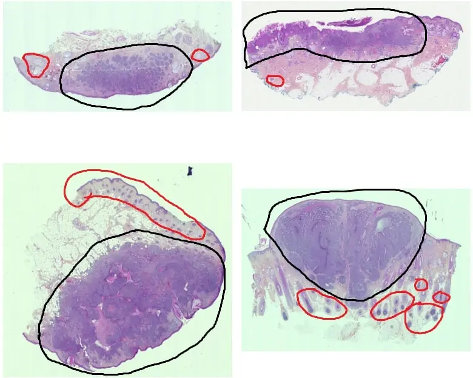
En noir, la zone où se trouve le carcinome.
En rouge, du bruit pour l'algorithme

Il va donc être nécessaire d'effectuer un pré-traitement de ces données pour réaliser la segmentation "zone cancéreuse vs zone non cancéreuse".

### 3.3 Premier pré-traitement - Segmentation

```python
import cv2
import numpy as np
import matplotlib.pyplot as plt

# Chemin de l'image
image_path = "D:/Master_SID/projet_TER/data/tumeur/9.webp"

# Lecture de l'image et conversion BGR2RGB
image = cv2.imread(image_path)
image = cv2.cvtColor(image, cv2.COLOR_BGR2RGB)

# Aplatissement des pixels, préparation à la segmentation
pixels = image.reshape((-1, 3))
pixels = np.float32(pixels)

# Définition des critères pour l'algorithme k-means
criteria = (cv2.TERM_CRITERIA_EPS + cv2.TERM_CRITERIA_MAX_ITER, 100, 0.2)

# Choix du nombre de clusters
k = 3

# Modèle
_, labels, centers = cv2.kmeans(pixels, k, None, criteria, 10, cv2.KMEANS_RANDOM_CENTERS)

centers = np.uint8(centers)

# Reconstruction de l'image segmentée
segmented_image = centers[labels.flatten()]
segmented_image = segmented_image.reshape(image.shape)


# Chemin de sortie
cv2.imwrite("D:/Master_SID/projet_TER/data/pretraitement_tumeur/9.webp", cv2.cvtColor(segmented_image, cv2.COLOR_RGB2BGR))

# Affichage

plt.subplot(121), plt.imshow(image), plt.title('Original Image')
plt.subplot(122), plt.imshow(segmented_image), plt.title('Segmented Image')
plt.show()
```
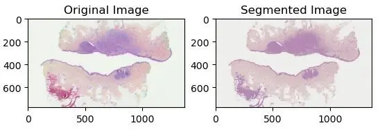

## 4. Pré-traitement des données

Le pré-traitement précédent est une première avancée pour par la suite optimiser la classification. Cependant, il **reste encore un peu de bruit** risquant d'abaisser les performances de l'algorithme.
Il est alors nécessaire d'accoître la performance du pré-traitement.

### 4.1 Délimitation du contour

Une première chose à faire consiste à **délimiter le contour** des membranes, cela permettra à l'algorithme de se focaliser uniquement sur la membrane et non pas sur les corps étrangers présents sur la lame.

Voici une membrane :

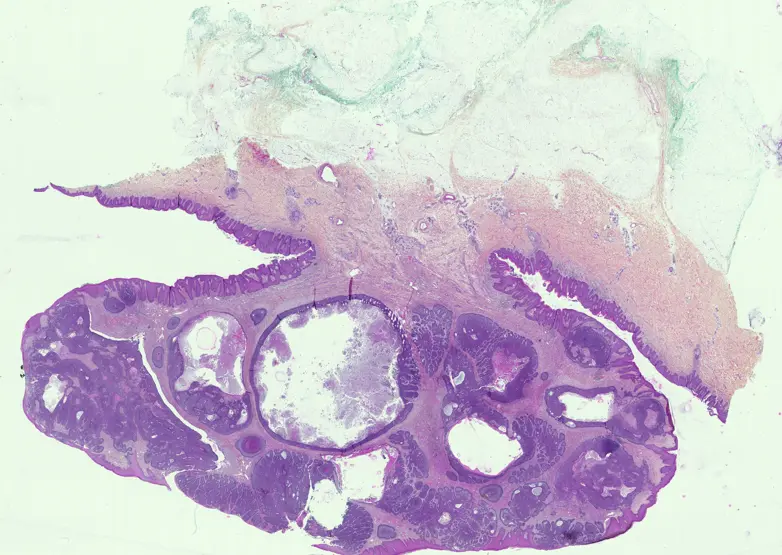{width=50%}

Et le 1er code testé pour extraire le contour :

```python
def extraire_contour(image_entree, image_sortie, seuil_canny, taille_dilatation, superficie_min):
    # Charger l'image en niveaux de gris
    image = cv2.imread(image_entree, cv2.IMREAD_GRAYSCALE)

    # Appliquer un flou pour réduire le bruit
    image_floue = cv2.GaussianBlur(image, (5, 5), 0)

    # Utiliser le détecteur de contours Canny avec le seuil spécifié
    contours = cv2.Canny(image_floue, seuil_canny, 2 * seuil_canny)

    # Appliquer la dilatation pour lier les contours discontinus
    element_structurel = cv2.getStructuringElement(cv2.MORPH_RECT, (taille_dilatation, taille_dilatation))
    contours = cv2.dilate(contours, element_structurel)

    contours, _ = cv2.findContours(contours, cv2.RETR_EXTERNAL, cv2.CHAIN_APPROX_SIMPLE)

    contours = [contour for contour in contours if len(contour) > superficie_min]

    contours_image = np.zeros_like(image)

    cv2.drawContours(contours_image, contours, -1, (255), 2)

    cv2.imwrite(image_sortie, contours_image)
    
    return contours
```
Ce 1er code hélas n'est pas suffisament robuste. Le bruit perturbe le découpage et toutes les formes et contour à l'intérieur de la membrane sont découpés.

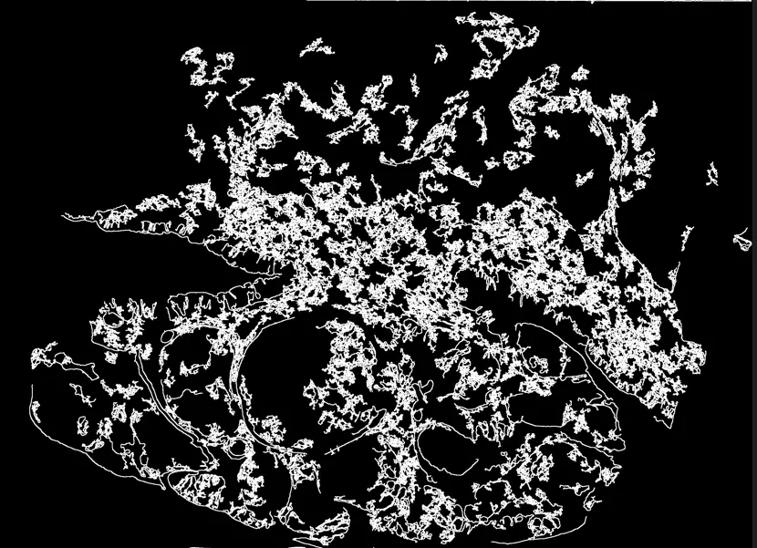{width=50%}

Pour y remédier, j'ai donc décidé d'apporter de la **dilatation :** concrètement, la dilatation consiste à élargir les régions d'une image qui contiennent des pixels blancs. Elle va permettre ainsi de connecter les régions blanches qui sont proches les unes des autres et ainsi combler les lacunes.

```python
def decouper_image(image_entree, contours, dossier_sortie,fichier):
    # Charger l'image originale
    image_originale = cv2.imread(image_entree)
   
    # Boucler sur les contours
    for i, contour in enumerate(contours):
        masque = np.zeros_like(image_originale)

        # Dessiner le contour sur le masque
        cv2.drawContours(masque, [contour], 0, (255, 255, 255), -1)

        petite_image = cv2.bitwise_and(image_originale, masque)

        # Trouver la boîte englobante du contour
        x, y, w, h = cv2.boundingRect(contour)

        petite_image = image_originale[y:y+h, x:x+w]

        cv2.imwrite(os.path.join(dossier_sortie, f"{fichier}image_{i}.webp"), petite_image)
```

```python
def pre_traitement_1_contour_dilatation(dossier_E,dossier_S,dossier_C):
    
    seuil_canny = 100
    taille_delatation=80
    superficier_mini=300
    seuil_contour=20
    
    fichiers = os.listdir(dossier_E)
    
    for fichier in fichiers:
        if fichier.lower().endswith(('.webp', '.webp', '.webp', '.bmp', '.gif')):
            
            chemin_entree = os.path.join(dossier_E, fichier)
            chemin_contour = os.path.join(dossier_C, fichier)
            
            #### premier fonction
            contours = extraire_contour(chemin_entree, chemin_contour, seuil_canny,taille_delatation,superficier_mini)
            #### deuxieme fonction
            decouper_image(chemin_entree, contours, dossier_S,fichier)

pre_traitement_1_contour_dilatation('D:/Master_SID/projet_TER/data/tumeur','D:/Master_SID/projet_TER/data/pretraitement_1','D:/Master_SID/projet_TER/data/contour')
```
Le résultat est tout de suite plus satisfaisant, la forme globale de la membrane est respectée et plus aucun contour n'apparaît à l'intérieur.

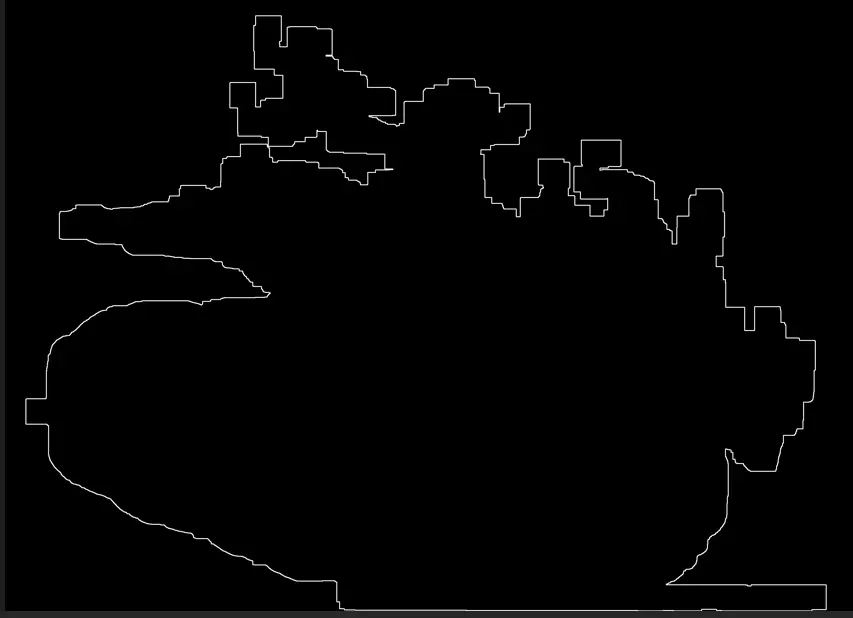{width=50%}

Seul un problème persiste, lorsque plusieurs membranes sont présents sur une même lame, le programme risque de fusionner certaines membranes. Dans un premier temps, je décide de ne pas m'attarder sur ce problème et débuterai la classification avec des lames ne présentant qu'une seule membrane.

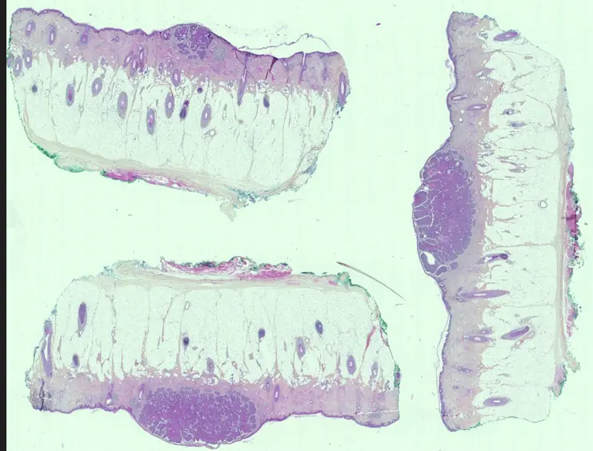{width=50%}

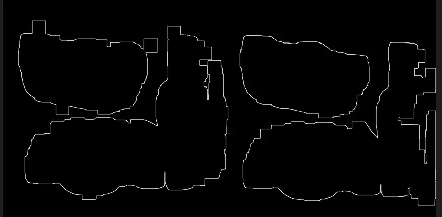{width=50%}

### 4.2 Amélioration de la segmentation

Les contours délimités, je décide de revoir l'opération de segmentation des images avec l'algorithme de k-means.

```python
def pre_traitement_2_segmentation(dossier_E,dossier_S):
    
    
    fichiers = os.listdir(dossier_E)
    
    for fichier in fichiers:
        if fichier.lower().endswith(('.webp', '.webp', '.webp', '.bmp', '.gif')):
            
            chemin_entree = os.path.join(dossier_E, fichier)
            chemin_sortie = os.path.join(dossier_S, fichier)
    
            image_path = chemin_entree

            ######################################################
            image = cv2.imread(image_path)
            image = cv2.cvtColor(image, cv2.COLOR_BGR2RGB)
            pixels = image.reshape((-1, 3))
            pixels = np.float32(pixels)
            criteria = (cv2.TERM_CRITERIA_EPS + cv2.TERM_CRITERIA_MAX_ITER, 100, 0.2)

            ############ le NB de clusters
            ######## changer le pour tester

            k = 3

            ############################
            ######## modele ############
            _, labels, centers = cv2.kmeans(pixels, k, None, criteria, 10, cv2.KMEANS_RANDOM_CENTERS)
            centers = np.uint8(centers)
            segmented_image = centers[labels.flatten()]
            segmented_image = segmented_image.reshape(image.shape)
            cv2.imwrite(chemin_sortie, cv2.cvtColor(segmented_image, cv2.COLOR_RGB2BGR))

pre_traitement_2_segmentation('D:/Master_SID/projet_TER/data/pretraitement_1','D:/Master_SID/projet_TER/data/pretraitement_2')
```
Avant segmentation
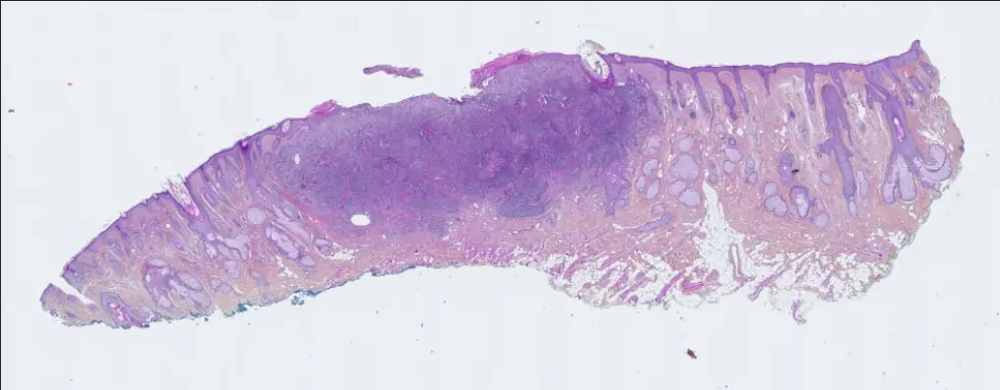{width=50%}

Après segmentation
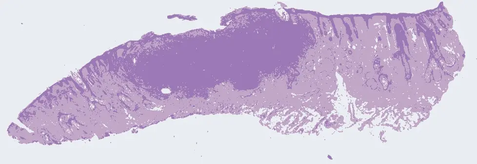{width=50%}

Le résultat semble tout à fait satisfaisant, je décide donc dans un dernier temps d'effectuer de l'annotation avec le logiciel QuPath pour aider le futur algorithme de classification à détecter la zone de la tumeur.

### 4.3 Annotation

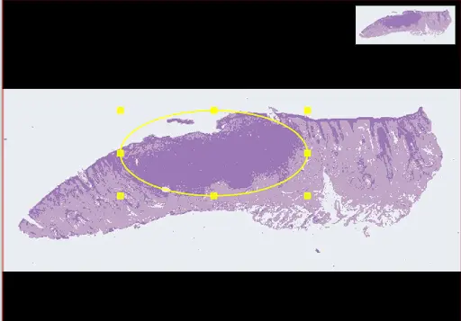{width=50%}

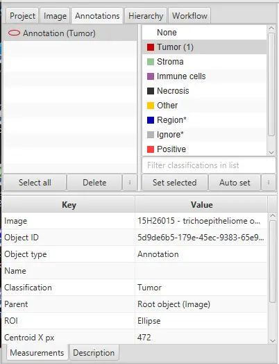{width=50%}


## 5. Conclusion
**Timing Sprint 1**
| Timing | Introduction du sujet (déplacement à la Timone) | Prise en main des données | Conversion auto avec NDPview2 | Pré-traitement |
| -------| -------- | -------- | -------- |
| Sprint 1 - Temps prévu (en heures) | 2 | 2 | 3 | 3 |
| Sprint 1 - Temps dédié (en heures) | 2 | 3 | 4 | 2 |

**Timing Sprint 2**
| Timing | Extraction contour | Segmentation | Annotation | Choix algorithme |
| -------| -------- | -------- | -------- |
| Sprint 2 - Temps prévu (en heures) | 4 | 3 | 1 | 2 |
| Sprint 2 - Temps dédié (en heures) | 5 | 2 | 1 | 2 |