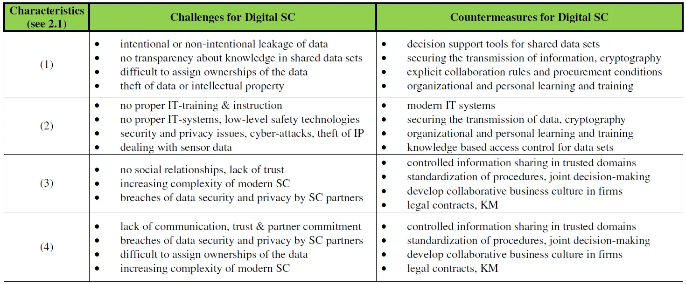

## Contexte
Très concerné par l'industrie et la Supply Chain - y ayant déjà été confronté lors de ma césure via un stage chez L'Oréal et souhaitant y faire mon cadre de carrière - je souhaite réaliser un POK dans le but d'accroître ma connaissance de la Supply Chain, en particulier les enjeux auxquels elle se retrouve confronté face à la digitalisation des industries.

Le but du 1er sprint serait de faire un état de l'art de cette thématique : sur les enjeux d'Industrie 4.0 de Lean Management, un focus sur certaines technologies et les risques qu'ils font encourir à la Supply Chain.

Le 2ème sprint consisterait en la préparation d'une grille d'entretien pour questionner ces sujets auprès d'experts de la Supply Chain afin d'en faire une analyse/synthèse.

## Horodateur des sprints

**Sprint 1 : état de l'art**
| Timing | Notions de bases, définitions | SC & I4.0 | I4.0 & Lean Management | Applications concrètes d'IA et IoT dans la SC | Risks in Digital Supply Chain |
| -------| -------- | -------- | -------- | -------- | -------- |
| Sprint 1 - Temps prévu (en heures) | 2 | 4 | 2 | 2 | 2 |
| Sprint 1 - Temps dédié (en heures) | 2 | 5 | 3 | 2 | 2 |

**Sprint 2**
| Timing | Identification des intervenants | Lecture d'articles | Grille d'entretien | Entretiens | Analyse & Restitution |
| -------| -------- | -------- | -------- | -------- | -------- |
| Sprint 2 - Temps prévu (en heures) | 1 | 3 | 2 | 2 | 2 |
| Sprint 2 - Temps dédié (en heures) | 1 | 4 | 2 | 2 | 2 |

## Sommaire

1. Introduction
2. Sprint 1
3. Sprint 2
4. Conclusion
5. Bibliographie

## 1. Introduction

Aujourd'hui, la logistique en France [1] c'est :
- 10 % du PIB national
- 200 Md€ de chiffre d’affaires
- 1,8 million d’emplois
- 168,4 millards de tonnes-kilomètres pour l'activité intérieur du pavillon français [2]

À l'ère de la digitalisation et de l'interconnexion croissante des marchés mondiaux, la Supply Chain connaît une transformation sans précédent. Les avancées technologiques telles que l'internet des objets (IoT), l'intelligence artificielle (IA) et la blockchain ont révolutionné la façon dont les entreprises gèrent leurs flux de marchandises et d'informations.
Cette évolution n'a pas été sans défi : bien que la pandémie de COVID-19 fut un catalyseur à l'adoption des nouvelles technologies numériques, elle a largement exposé les vulnérabilités et les lacunes de nombreuses Supply Chain traditionnelles, pénurie de main-d'oeuvre, pénurie de matériaux, retards de livraisons...
Désormais, la résilience devient un impératif majeur pour les entreprises, et la transformation de la Supply Chain est au cœur des stratégies visant à garantir une agilité et une adaptabilité face à l'incertitude et aux perturbations futures.

Dans ce contexte, ce POK vise à présenter les enjeux auxquels la Supply Chain est aujourd'hui confrontée et ainsi comprendre le défi de taille qu'est la construction de ["l'Usine du Futur" présentée par le GROUPE PSA en septembre 2016.](https://www.youtube.com/watch?v=igW-MyX7PkI)

## 2. Sprint 1

Avent de pouvoir entrer dans le vif de sujet et dans le but de rendre ce POK accessible, il est nécessaire de définir quelques termes.

### Quelques définitions
**!!! Supply Chain != Logistique != Transport !!!**

#### Supply Chain

La Supply Chain - chaîne d'approvisionnement en français - est un terme général qui englobe tous les processus impliqués dans la production et la distribution de biens, depuis l'approvisionnement en matières premières jusqu'à la livraison des produits finis au client final. Elle implique de multiples étapes et diverses entités telles que les fournisseurs, les fabricants, les distributeurs et les détaillants. [3]

"La Supply Chain a pour mission de gérer de bout en bout les flux, flux de produits, flux d’information, les infrastructures physiques et les organisations humaines, depuis les fournisseurs jusqu’au client final. " [4]

#### Logistique (Pour la Supply Chain)

La logistique est une composante de la chaîne d'approvisionnement qui se concentre sur la planification, la mise en œuvre et le contrôle de l'efficacité et de l'efficience des flux avant et arrière et du stockage des biens, des services et des informations connexes entre le point d'origine et le point de consommation afin de répondre aux exigences des clients. Elle comprend des activités telles que la gestion des stocks, l'entreposage, l'emballage et le transport. [3]

#### Transport

Le transport est une partie de la logistique qui implique spécifiquement le déplacement de produits, de matériaux et de personnel d'un endroit à un autre. Il comprend des activités telles que la sélection du mode de transport (camion, bateau, train ou avion) et la planification et la gestion des itinéraires et des calendriers d'expédition. [3]

#### Industrie 4.0

À ce jour, il n'existe pas de définition exacte et précise de l'industrie 4.0. Un consensus admet pour autant que ce concept provient d'Allemagne - le terme est apparu la première fois en 2011 au forum mondial de l'Industrie de Hanovre - et qu'il s'agit d'une nouvelle organisation des moyens de production basée sur l'interopérabilité des nouvelles technologies : Big Data, Intelligence Artificielle, IoT, Machine Learning, Cloud Computing... Cette interconnexion, ce flux de données en temps réel aurait alors pour vocation d'accroître la flexibilité des usines désormais nommées "smart factories" et ainsi d'une part réduire les délais de production, d'autre part optimiser la gestion des ressources.

Pour reprendre la définition proposée dans le cours de Monsieur Magnani en filière Production, Logistique [5] : Le concept d'"Industrie 4.0" vient d'Allemagne. Il définit une nouvelle organisation des usines, nommées smart factories, afin de mieux servir ses clients, grâce à une flexibilité accrue de la production et de l'optimisation des ressources.
Ses principes clés en sont :
- l'usine devient numérique et flexible
- des outils de simulation et de traitement de données puissants
- une usine économe en énergie et en matières premières.

#### Lean Management
Le Lean Management est une méthode d'organisation de la production et du travail inspirée du Toyotisme visant à minimiser le gaspillage.
Il repose sur 2 principaux principes :
- une production "Just in Time" évitant ainsi toute surproduction et commande inutile auprès des fournisseurs
- un service qualité cadré par la méthode Jidoka incitant au 0 défaut en ajoutant des contrôles à chaque étape.

Pour citer l'Institut Lean Français [6] : "Le lean vise la réconciliation de la satisfaction des clients, de l’engagement des équipes et de la réduction des coûts globaux de l’entreprise en développant l’autonomie des équipes, leurs capacités de changement et, au final, l’agilité de l’entreprise dans son ensemble. La stratégie Lean est la recherche de plus de qualité et de flexibilité (fluidité) tout en réduisant les coûts induits par les gaspillages." 

#### Blockchain

"La technologie Blockchain est un mécanisme de base de données avancé qui permet un partage transparent des informations au sein d'un réseau d'entreprises. Une base de données Blockchain stocke les données dans des blocs qui sont reliés entre eux dans une chaîne. Les données sont chronologiquement cohérentes, car vous ne pouvez pas supprimer ou modifier la chaîne sans le consensus du réseau. Par conséquent, vous pouvez utiliser la technologie Blockchain pour créer un grand livre inaltérable ou immuable pour le suivi des ordres, des paiements, des comptes et d'autres transactions. Le système dispose de mécanismes intégrés qui empêchent les entrées de transactions non autorisées et créent une cohérence dans la vue partagée de ces transactions." [7]

#### Bullwhip effect

"L’effet coût de fouet (ECF) correspond au phénomène d’amplification croissante de la variabilité de la demande en remontant le long de la chaîne logistique (CL)." [8]

Un bon exemple prend racine dans une étude proposée sur le Groupe Volvo. [9]

#### Muda, Muri, Mura pour éliminer le gaspillage

**Muda**
"Les Mudas sont des éléments du processus de production qui n’apportent pas de valeur particulière au client, et qui sont donc superflus et à éliminer afin d’éviter de gaspiller des ressources inutilement. Les Mudas sont au nombre de sept : la surproduction, les stocks, l'attente, le transport, les défauts, les mouvements, les processus trop poussés/inutiles."

**Muri**
"Le terme japonais Muri signifie « surcharge » et implique que les machines ou les employés sont surexploités, risquant ainsi d’entrainer des dysfonctionnements, des accidents de travail, des ralentissements au niveau du flux de production… La gestion Lean peut ainsi intervenir en favorisant un cadre de travail sécuritaire et en instaurant un ensemble de standards afin d’éviter ce type de surcharge."

**Mura**
"Enfin, Mura est synonyme d’irrégularité, c’est-à-dire les périodes où les employés ou les machines doivent être opérationnels de manière intensive afin de répondre à un pic de demandes ou respecter certains critères de performance. Les flux de travail ne sont pas réguliers et il y a donc des zones d’attente et de travail intensif et cela a un impact sur le fonctionnement harmonieux de l’entreprise." [10]

#### Takt Time, Cycle Time & Lead Time : les métriques temporelles de la Supply Chain

**Takt Time**: rythme de production nécessaire pour répondre à la demande des clients, exprimé comme le temps moyen pour produire un produit.
Calcul : Temps disponible divisé par la demande du client (en nombre d'unités).

**Cycle Time**: temps nécessaire pour accomplir une opération spécifique, mesuré de son début à sa fin.
Utilité : Dimensionner les ressources, identifier les goulots d'étranglement, produire en juste-à-temps.
Calcul : Temps disponible divisé par le nombre d'unités produites.

**Lead Time**: temps total requis pour qu'un produit traverse toute la chaîne de valeur, de l'entrée de la matière première à la livraison au client.
Utilité : Déterminer la vitesse de réalisation, gérer les stocks, planifier la demande.
Calcul : Soustraction de la date de fin du processus par la date de début du processus.

### Revue de la littérature

#### Industry 4.0 and supply chain [11]

**L'avènement des technologies numériques** plonge une nouvelle fois l'industrie dans une révolution. Caractérisée d'Industrie 4.0 et reposant sur **l'interconnexion, le flux en temps réel** - flux physique, financier ou d'information - ce concept ne fait plus référence qu'à l'usine à la gestion de la production mais bien à **toute la Supply Chain.**

Cette révolution est un réel essor pour la Supply Chain qui voit **l'apparition de nouveaux jobs** depuis quelques années. L'intégration de nouvelles technologies permettant le suivi en temps réel des produits **tout au long de leur cycle de vie** offre de nouvelles perspectives d'avenir sur différents enjeux clés de la Supply Chain tels que l'entreposage, le transport.

D'une part, la robotisation, l'automatisation permet d'accélérer la réception, la fabrication des produits, d'autres part elle **diminue les erreurs humaines** d'enregistrement, de préparation de commandes...

Plus que des leviers d'amélioration, les technologies telles que le Big Data, le Cloud, l'Iot, la 5G et les systèmes cyberphysiques sont de **réels catalyseurs pour transformer les anciennes usines en smart factories.**

Ils permettent ainsi la création d'un **écosystème cyber-physique** où données numériques et produits physiques vivent ensemble.

Cet écosystème cyber-physique soulève pour autant de nouvelles problématiques. Il ouvre les portes de l'industrie aux **cybermenaces** et **accroît la vulnérabilité de la triade CIA - Confidentiality, Integrety, Availability - de l'information.**
(**Confidentiality** = limiting data access, **Integrity** = ensuring your data is accurate, **Availability** = making sure it is accessible to those who need it)

Des solutions existent pour pallier cette menace telle que l'utilisation de la **Blockchain**. Un système basé sur la Blockchain permettrait d'assurer l'interoperabilité des systèmes tout en maintenant la confidentialité et la sécurité, certaines applications de la Blockchain ont d'ailleurs déjà été testées dans le transport maritime.

De plus, la Blockchain offre de nouvelles perspectives intéressantes pour la durabilité de l'industrie 4.0. **Au travers sa traçabilité, elle octroie une transparence, confiance et automatisation de l'information** permettant un meilleur contrôle des différents niveaux d'émissions et des coûts opérationnels de l'ensemble des acteurs de la Supply Chain incitant dès lors à une **économie circulaire** et contribuant à une meilleure gestion de l'eau du réusage et du recyclage.

Cette nouvelle révolution est également une opportunité de transformer l'industrie que nous connaissons en une **industrie plus durable**. **Les enjeux sociaux, d'économie et d'environnement durables sont un des plus grands défis de la Supply Chain à l'heure actuelle** or il s'agit d'un des objectifs de cette révolution industrielle de **minimiser le gaspillage en couplant ressources et efficacité energétique.**

**Pour autant, le simple recourt à la technologie n'est pas suffisant. Leur mise en place et leur exploitation n'est pas anodine, elles nécessitent des compétences techniques et organisationelles qui peuvent s'avérer être un réel obstacle au succès de la transformation digitale de la Supply Chain.**

Au lendemain de la crise sanitaire, l'incertitude, la volatilité, les risques - approvisionnement, crise d'un produit, retards... - ont largement été renforcés. La Supply Chain s'est complexifiée et **l'usage des nouvelles technologies est la clé pour assurer intelligence, flexibilité et agilité de la Supply Chain afin d'ajuster les achats, productions, livraisons** dans les meilleures perspectives et ainsi notamment éviter le **Bullwhip effect.**

Malgré les changements induits par la quatrième révolution industrielle dans les rôles des individus au sein des processus organisationnels et de la Supply Chain, **l'aspect humains est trop souvent négligé dans la recherche**. Cette lacune crée une opportunité importante d'étude sur le n**ouveau rôle des individus dans les environnements industriels hautement technologiques,** où les machines prennent le relais dans les tâches monotones et répétitives.
Il est crucial de comprendre les **compétences et les connaissances nécessaires à chaque échelle** - travailleurs, cadres intermédiaires, haute direction - dans ce contexte de l'Industrie 4.0.

#### Industry 4.0 in Logistics and Supply Chain Management [12]

À l'heure actuelle, "l'objectif de toutes les entreprises est d'atteindre une **Supply Chain Moderne** dans la mesure où celle-ci est **rapide, automatique dans les process, permet de travailler avec des systèmes dynamiques avec un grand volume de données".** Amazon est ses millions de commandes quotidiennes en est un exemple.

L'objectif de l'Industrie 4.0 est **d'améliorer la productivité et réduire les coûts.** Elle se focalise sur l'automatisation, la digitalisation, l'**interconnexion** rendant dès lors possible l'**intégration des différents acteurs de la Supply Chain : fournisseurs, manufacturiers, consommateurs... au coeur des mêmes systèmes dynamiques.** Cette intégration permet un meilleur **decision-making** de la part des managers réduisant ainsi les risques et augmentant la productivité.

Le recourt au Big Data par exemple, collectant et évaluant les données va rendre possible l'amélioration de la Supply Chain sans interrompre les opérations et ainsi améliorer la **satisfaction client.**

Cependant, **le concept et le rôle de l'industrie 4.0 ne sont pas encore clairement établis.** Apparu au milieu des années 2010, l'Industrie 4.0 ne présente pas de définition exacte. Repris sous les termes de "d'usine intelligente", "d'industrie intégrée", elle évoque les notions de réseau intelligent basé sur la digitalisation soulignant une interaction entre machines et produits sans besoin d'intervention humaine.
Elle **promeut l'utilisation de systèmes cyber-physiques** : IoT, IoS, Big Data, Cloud Manufacturing... dont les techniques de Machine Learning, d'Intelligence Artificielle, de Business Analysis aident à son déploiement.

L'Industrie 4.0 affecte 4 principaux pans de la Supply Chain : **l'intégration, les opérations, les achats et la distribution.** Son impact consiste à améliorer la productivité de l'entreprise en "réduisant le Lead Time, en réduisant le temps de réponse aux événement imprévus et en suscitant une augmentation significative de la qualité de la prise de décision."
Elle est également précieuse pour les services S&OP et logistique afin d'améliorer les **prévisions et planifications.**

**Challenges :**
**L'implémentation de l'Industrie 4.0 n'en reste pas moins évidente :** le manque d'infrastructure technologique couplé à une pénurie d'experts pour démarrer ou améliorer les systèmes existants rend difficile sa mise en place. De plus, outre le capital initial requis pour innover, il reste **complexe d'évaluer le retour sur investissement de cette transition,** ce qui entrave le soutien des gestionnaires.

L'Industrie 4.0, prônant la réduction de l'implication humaine, soulève des préoccupations quant à l'avenir des employés jusqu'à soulever une question fondamentale **"Qu'adviendra-t-il aux employés perdant leur emploi au cours de cette transition ?"**

Des recherches supplémentaires sont nécessaires pour clarifier les avantages potentiels et les impacts sur la productivité des entreprises.

Pour ces raisons, **peu d'entreprises restent désireuses d'expérimenter l'industrie 4.0.**

La question à se poser est alors la suivante : **"Où, quand et comment les industries devraient implémenter l'Industrie 4.0 dans l'approche de leur SUpply Chain ?".**

#### Lean Supply Chain management (LSCM) and Industry 4.0 (I4.0) [13]

Les pratiques de Lean Supply Chain Management sont d'ores et déjà adoptés dans différents secteurs depuis quelques décennies. Elles consistent à **intégrer les flux amont et aval** des différentes entités pour **augmenter la valeur, réduire les coûts et les déchets, et répondre rapidement** à la demande des clients.

Dès lors, les entreprises les plus **performantes** sont celles prenant en compte les **clients et les fournisseurs externes** dans leurs processus d'amélioration interne avec pour objectif d'améliorer compétitivité et efficacité.

Une approche du flux aval pour réduire les gaspillages et atteindre la durabilité dans la Supply Chain est la production Lean (heijunka), basée sur le système de production Toyota. Elle vise a réduire les irrégularités (mura), ce qui a pour effet de réduire les déchets (muda). Néanmons, cette **approche aval ne suffit pas** à l'obtention de résultats durables. Il est nécessaire d'employer des méthodes similaires du développement produit jusqu'à la livraison client en passant par le sourcing, l'approvisionnement et ainsi englober tous les acteurs de la Supply Chain.

L'I4.0 offre de nouvelles possibilités en reliant les différentes entités de la Supply Chain en temps réel, il reste alors à définir si une **synergie est possible entre celle-ci et le Lean Supply Chain Management.**

De manière globale, cette revue de la littérature montre clairement que le **LSCM et L'I4.0 se soutiennent mutuellement dans une perspective synergique.** Les technologies de l'I4.0 améliorent les pratiques du LSCM grâce à la numérisation des éléments traditionnels du LSCM, tandis que les pratiques du LSCM facilitent l'introduction des technologies de l'I4.0 dans le système de chaîne d'approvisionnement.

Toutefois, cette synergie semble nuancée lorsque l'on pousse l'analyse en se penchant soit au **niveau stratégique** soit au **niveau opérationnel.**

**Au niveau stratégique,** le LSCM soutient l'I4.0 dans la mesure où il favorise son introduction. Pour aller plus loin, la review souligne même que la **LSCM est une base nécessaire au bon déploiement de l'I4.0** : étant donné la qualité de la Supply Chain que permet le LSCM, elle permet de préciser une ligne de conduite claire pour mener aux bons investissements.

À l'opposé, **au niveau opérationnel, l'I4.0 soutient le LSCM car il améliore ses pratiques.** On peut notamment mentionner l'amélioration des techniques lean tel que l'outil 5S en MSP (Maitrîse Statistiques des Procédés) ou en Total Productive Maintenance (TPM) par les technologies de l'I4.0.

**En résumé, au niveau stratégique la LSCM stimule l'intégration durable de l'I4.0 en tenant compte de la diversification des demandes clients alors qu'au niveau opérationnel l'I4.0 améliore les performances de la LSCM en permettant l'accès à un flux continu en temps réel de l'information grâce aux technologies de CloudChain, Big Data, réalité augmentée, Blockchain...**

De cette conclusion, la review souligne 2 leçons :
- il semble **judicieux de favoriser l'adoption de la LSCM dans un premier temps** afin d'établir une Supply Chain efficace et durable conductrice de l'amélioration via l'I4.0.
- **L'I4.0 joue un rôle actif dans l'amélioration continue** ce qui est la caractéristique phare du LSCM.

#### Impact of Digital Technology on Supply Chain Efficiency in Manufacturing Industry [14]

Les résultats de l'étude réalisée à travers cette revue de littérature démontrent que **l'IoT et l'IA** sont les deux technologies les plus susceptibles d'atteindre l'autonomie et la capacité prédictive nécessaires pour répondre aux futures attentes de la chaîne d'approvisionnement.

Pour autant, **80% des pratiques liées à la transformation digitale ont échoué.** En cause, les entreprises **n'identifient pas clairement quelle technologie devrait être mise en place** en concordance avec leurs objectifs stratégiques de opérationnels et **optent aveuglement sur une technologie pour le plaisir de la technologie.**

Dès lors, le but de cette étude est de répondre aux 2 questions suivantes :
- "Comment l'IA et l'IoT améliorent l'effiacité de la SUpply Chain ?"
- "Quels facteurs influencent le succès de l'implémentation d'une Supply Chain digitale ?"

Kevin Ashton, pionner britannique de la technologie, a décrit le premier l'IoT comme "l'identification unique d'un objet en connectant des choses physiques via la technologie et son réseau virtuel. Trois éléments sont nécessaires pour atteindre la fonction de l'IoT : **l'acquisition de données, le transfert de données et l'analyse de données.** L'IoT devient alors un réseau intelligent basé sur l'internet qui permet non seulement de collecter, transférer et analyser les données d'un appareil mais également d'observer en continu tout son environnement.

L'IA quant à elle, va être couplée aux larges quantitées de données récupérées par l'IoT pour **effectuer des prédictions, aider à la prise de décision.** Ses applications dans la Supply Chain prennent place dans le transport, la maintenance prédictive, la prévision de la demande.

Néanmoins, des doutes persistent quant à l'IA, notamment en ce qui concerne ses **implications éthiques** notamment sur l'éventualité d'accorder aux systèmes intelligents, comme les robots, les mêmes droits que les êtres humains. De plus, l'extraction d'informations sensibles peut compromettre la sécurité de la vie privée et même influencer les affaires politiques.

Le développement de l'IA et l'IoT ont largement favorisé l'émergence de l'Industrie 4.0 et des usines intelligentes. **L'IoT est alors décrite comme la partie hardware de la technologie produisant une grande quantité d'information, dirigée par l'IA en tant que software.**

Leur intérêt est le **partage de l'information pertinente en temps réel** permettant ainsi de prendre de meilleurs déceisions, d'optimiser les opérations, de mieux appréhender les risques. Cependant, ces technologies ne sont pas le seul élément clé contribuant à l'amélioration de la Supply Chain : elles sont un outil utile à la favorisation de la communication entre les différentes parties prenantes de la Supply Chain. **"L'essence de l'IoT est de fournir des informations et des les intégrer. Cependant, ce qui améliore réellement la performance opérationnel est la vitesse de transmission de cette information et son niveau de transparence"**. L'information doit être complétée d'analyse, de traitement pour tirer des décisions.

**IoT applications**
Les applications de l'IoT sont diverses. Elles permettent d'optimiser la précision, l'intégration et la transparence de l'information.
General Motors, par exemple, utilise les données de capteurs pour déterminer l'humidité de l'environnement de peinture des voitures. Cette donnée est envoyée à un algorithme afin de savoir si la dose est dans la gamme d'acceptation, sinon la voiture est envoyée à un autre endroit ce qui permet de miniser la re-peinture et de maximiser le temps de fonctionnement de l'usine. **Cette innovation à elle seule permet à General Motors d'économiser des millions de dollars par an.**

L'IoT permet également l'amélioration des stocks de 2 manières différentes. D'une part il facilite le partage des stocks inutilisés entre entreprises, d'autre part il permet de visualiser l'état des stocks en temps réel et ainsi mieux les gérer ressources. En le combinant avec l'utilisation d'un ERP, **l'IoT facilite le Product Lifecycle Management.**

Également, la mise en oeuvre de composants IoT sur les lignes de production permmet de **surveiller en permanence l'état des véhicules, d'anticiper les dommages ou défaillances potentielles et prendre des mesures préventives.**

**IA applications**
Différentes IA sont envisagées pour améliorer le management de la SUpply Chain, des réseaux de neurones (ANN) à la réalité virtuelle (VR) en passant par les algorithmes génétiques (AG).

Ces applications permettent d'améliorer les prévisions de la demande, les décisions marketing, la maintenance système, la tarification, le choix des fournisseurs, la fabrication des produits. Elle aide notamment la logistique à éviter le gachis de ressources et **diminue les risques business tels que le "Bullwhip Effect".**

Son intérêt est de développer une **stratégie opérationelle dynamique** en se basant sur l'analyse des données historiques. Ainsi, elle est capable de minimiser les risques même dans des périodes chaotiques. Par exemple, lors des **inondations en Thaïlande en août 2017,** la division de la Supply Chain Management d'IBM à Singapour a rapidement réagi en anticipant les impacts sur les fabricants thaïlandais de disques durs. **Grâce à l'IA, ils ont pu sélectionner des fournisseurs alternatifs, passer des commandes et organiser le transport afin de maintenir l'approvisionnement en disques durs et éviter toute interruption de la production.**

Cependant, pour effectuer de bonnes prédictions il est n**écessaire d'avoir une base de données conséquente, précise, bien intégrée par l'algorithme.** Une mauvaise prédiction pourrait être dramatique comme ce fut le cas pour **Nike en 2001.** L'entreprise a introduit un programme de prédiction de la demande mais n'a pas réussi à le mettre en œuvre ce qui a conduit à un stock insuffisant de Air Jordans et à un excès de types moins populaires. Cette expérience valut **environ 100 millions de dollars de ventes perdues à Nike.**

L'IA est également efficace pour **automatiser les tâches répétitives coutant du temps et de l'argent** : algorithmes d'emballage, appariement des véhicules et des cargaisons, planification des AGV (Automated Guided Vehicles).

**Tungsten Network** (entreprise mondiale de facturation électronique fournissant des services de financement de la SUpply Chain) a rapporté qu'elle perdait en moyenne 125 heures par semaine sur des tâches commerciales triviales telles que des routines répétitives, des traitements de demandes fournisseurs ou des audits comptables, ce qui représente environ 6 500 heures par an de travail inefficace. En réponse, certaines organisations adoptent des applications avancées d'IA, telles que des robots, pour automatiser ces tâches répétitives.

Un exemple typique est **l'usine intelligente d'Audi**, où la logistique et le transport des pièces sont gérés par des systèmes de conduite autonome, réalisant ainsi une véritable automatisation de l'usine. Des robots légers remplacent le travail fastidieux dans l'installation de parties faciles et l'assistance du système d'assemblage indique à l'opérateur où assembler les pièces les plus difficiles en plus de lui indiquer les vérifications finales.

**Facteurs influençant le succès d'implémentation de la Supply Chain digitale**
Les facteurs influençant la mise en œuvre réussie de la chaîne d'approvisionnement numérique sont variés et comprennent des éléments internes et externes tels que l'internationalisation croissante des entreprises, la fluctuation de la demande et les cycles de production plus rapides. Malgré les avantages potentiels, de nombreux obstacles persistent, notamment des **défis technologiques, organisationnels et stratégiques.** Bien que les entreprises investissent davantage dans la digitalisation de leur Supply Chain, **seulement 5% sont satisfaites de leur transformation.**

**3 freins majoritaires aux transformations digitales semblent se prononcer.**

Le 1er est le **manque de budget,** la mise en place des technologies peut se montrer très onéreuse et **manquer de visibilité quant à son retour sur investissement** dans la mesure où ce dernier est difficile à déterminer. Qui plus est, l'intégration de ces technologies recquiert le **recrutement de talents** spécialisés dans ces domaines puis la formation des employés à ces nouvelles technologies.

Vient ensuite le **manque de lignes de conduites, de stratégies de déploiement.** Bien que certaines entreprises soient déjà équipées en WMS, TMS, OMS... elles n'ont pas de ligne de conduite précise pour digitaliser leur métier. Il existe diverses façons de digitalisation mais **la plupart des entreprises choisiront la technologie la plus populaire plutôt que celle la plus appropriée à leur développement.** Ce n'est pas tant l'application de la technologie numérique qui détermine l'efficacité du management de la Supply Chain, mais plutôt le degré d'adaptation entre le mode opératoire et la technologie de l'information. La transformation réussie d'une entreprise vers le numérique repose sur le changement de business modèle.

Enfin arrive la **question des droits sociaux et de l'environnement.** Une enquête du MIT Sloan Management Review révèle que la résistance au changement, notamment chez les dirigeants d'entreprise, constitue un obstacle majeur à la transformation numérique. **43% des 4 500 directeurs des systèmes d'information (CIO) interrogés dans l'enquête Harvard Nash/KPMG CIO ont identifié la résistance au changement comme le plus grand obstacle à une stratégie numérique réussie.**
Cette réticence est exacerbée par les **préoccupations en matière de sécurité et de confidentialité des données**, entravant ainsi la transparence nécessaire à la réussite des chaînes d'approvisionnement numériques. De plus, les risques croissants liés à la cybersécurité, notamment les cyber-attaques provenant de dispositifs IoT, soulignent **l'urgence d'une législation et d'une réglementation appropriées** pour garantir la sécurité et accroître la confiance dans le développement numérique.

#### Knowledge Risks in Digital Supply Chains: A Literature Review [15]

Les avancées des technologies de l'information ont rendu les échanges de données plus vastes et complexes, mais ont aussi exposé les Supply Chain à de **nouveaux risques liés à la connaissance.**
Pourtant, une **gestion appropriée** de ces risques peut contribuer à renforcer la **résilience** des Supply Chain. Les caractéristiques des Supply Chain numériques, telles que l'échange accru de données, la dépendance accrue aux systèmes informatiques, les changements fréquents et la transparence limitée entre les partenaires, soulignent l'importance de la **sécurisation des données** et d'une **gestion des risques** efficace. Il est crucial d'assurer la **transparence** sur les risques afin de permettre aux acteurs de prendre des décisions éclairées sur le **partage des données,** et de développer de n**ouvelles approches techniques et juridiques** pour protéger les connaissances dans les collaborations centrées sur les données.

**D'un point de vue organisationnel :**
- les chercheurs soulignent le **manque de communication** ou l'**asymétrie de l'information**, ce qui peut entraîner des **résistances au partage de données**. Ces résistances peuvent conduire au refus d'adopter des Supply Chain numériques et à des barrières supplémentaires à la communication entre les acteurs de la chaîne, réduisant ainsi la **transparence**.
- *Les risques identifiés* incluent **la perte ou le vol de propriété intellectuelle**, ainsi que les **fuites de connaissances intentionnelles ou non intentionnelles**.
- *Pour faire face à ces risques*, des stratégies de **gestion proactive et réactive** sont nécessaires, ainsi que l'**établissement de règles de collaboration explicites et communes**. Il est également important d'investir dans la **formation à la sensibilisation** et à la gestion des risques, ainsi que dans l'**utilisation de systèmes** d'aide à la décision pour faciliter l'apprentissage collaboratif au sein des Supply Chain numériques.

**D'un point de vue technique technique :**
- l'augmentation de la **dépendance aux technologies** de l'information expose les entreprises à des risques accrus. Des lacunes dans la réingénierie des processus métier, la conception concurrente, les systèmes informatiques inadéquats ou la sécurité informatique laxiste peuvent faciliter les **cyberattaques** ou le **vol de données.** De plus, l'absence de système de mesure de performance, de procédure de résolution de conflits, de plan de contingence ou de restrictions d'accès peuvent également entraîner des risques. Ces risques sont particulièrement préoccupants pour les entreprises axées sur les données, qui échangent de vastes ensembles de données de manière automatisée. La sécurisation des systèmes informatiques et des données devient donc une priorité, d'autant plus que les cyberattaques deviennent plus courantes avec la pénétration accrue des systèmes informatiques et des objets connectés.
- *Les risques identifiés* comprennent la **perte de propriété intellectuelle** due à l'extraction de connaissances à partir de données partagées et les menaces pour la **sécurité** et la **confidentialité** des informations, en particulier avec la dépendance croissante à l'égard des technologies de l'information.
- *Pour contrer ces risques,* des mesures techniques telles que les **architectures de sécurité, la cryptographie, la détection d'anomalies et la gestion des données** sont essentielles. L'utilisation de l'analyse prédictive pour la maintenance prédictive et la prévision, ainsi que l'exploitation des systèmes informatiques avancés pour prendre des décisions automatisées, sont également recommandées pour renforcer la résilience des chaînes d'approvisionnement face aux perturbations et aux risques liés aux données.

**D'un point de vue juridique :**
- les risques liés à la sécurité et à la confidentialité des données peuvent résulter de **violations des accords de sécurité et de confidentialité** par les partenaires de la Supply Chain ou les employés. L'**absence de clarté** concernant la propriété des données peut rendre difficile l'application des lois sur la propriété intellectuelle traditionnelles. De plus, le turnover des employés peut entraîner une incertitude quant à la **propriété des droits** sur le savoir-faire agrégé et les données techniques, ce qui peut également poser des risques. Les partenaires de la SC peuvent extraire des connaissances concurrentielles à partir des données partagées, ce qui soulève des questions juridiques sur l'**utilisation non intentionnelle des données partagées**. Ces défis légaux peuvent conduire à la divulgation non voulue de connaissances concurrentielles, ce qui représente un défi juridique supplémentaire, notamment en ce qui concerne la protection de la propriété intellectuelle (PI).
- *Les contre-mesures juridiques comprennent* la gestion des **contrats** intégrée dans le réseau de la SC, l'utilisation de contrats de non-divulgation et l'adoption de **mesures formelles et informelles** de protection, telles que les secrets commerciaux, la protection par le droit d'auteur ou les brevets. En résumé, il est essentiel d'élaborer des **contrats formels et des accords de non-divulgation adaptés** aux collaborations centrées sur les données afin de prévenir les risques juridiques associés à l'échange de données au sein de la Supply Chain numérique.

(1) more and more comprehensive data sets are exchanged
(2) the IT penetration and the dependency on IT systems increased
(3) the SC are more frequently changed and composed differently
(4) there is only a limited transparency and relational capital between SC partners

## Sprint 2

### Identification des intervenants

Différents experts de la Supply Chain ont été sollicités, la plupart à l'aide de Florian Magnani que je remercie amplement.
Parmi eux, deux ont accepté de mettre à disposition de leur temps pour m'accorder une interview : Richard Markoff et Olivier Gléron.

Richard Markoff a debuté sa carrière chez L'Oréal. Il y a passé plus de 10 ans jusqu'à atteindre les postes de Director Global Manufacturing Supply Chain et de Corporate Supply Chain Standards & Audits Director. Richard fut à l'initiative de différents projets de digitalisation afin d'optimiser le transfert d'information et la communication au sein de la Supply Chain mais aussi avec les intervenants extérieurs.
Professeur en Supply Chain à l'ESCP et auteur de sujets en Supply Chain pour l'IMD Business School il est désormais co-dirigeant et co-fondateur d'Innovobot : une plateforme d'investissement et d'innovation aidant les entreprises proposant des technologies disruptives.

Olivier Gléron a gravi les échelons au sein de la Supply Chain de Nestlé. Il y aura passé plus de 20 ans au sein de différentes entités en France, en Roumanie, en Suisse ou en Pologne. Devenu Global Supply Chain Head en 2020, il décide en 2024 de rejoindre les locaux parisiens pour contribuer au One Operation Project de Nestlé France.

Olivier et Richard sont deux Senior Supply Chain Operations Leader accomplis que je suis ravi d'avoir pu interviewer et que je remercie une fois de plus pour leur temps, nos échanges furent très intéressants et dépassèrent largement le cadre de mon projet, réaffirmant une fois de plus ma motivation à faire carrière au coeur de la Supply Chain.

### Lecture de nouveaux articles (Covid / résilience / énergie...)

### Grille d'entretien

#### Introduction
**1-	Présentation du parcours : pouvez-vous, présentez votre parcours, les différents rôles que vous avez assumez au sein de votre carrière.**

#### Généralités directeur de Supply Chain
*En tant que directeur de Supply Chain, on voit passer beaucoup d’indicateurs, de KPI... De mon point de vue de stagiaire, lorsque chez L'Oréal le Directeur Technique passait à la logistique (tous les 2/3 mois), il ingurgitait en une petite heure une quantité de statistiques, de chiffres et d'indicateurs : performances en production, en terme d'approvisionnement, avancées projets...*

**2-	Parmi toutes les informations que vous devez assimiler, les quelles vous paraissent être les plus importantes pour mesurer la performance de votre Supply Chain ? Quels sont les KPIs clés que vous regardez ?**

**3-	Quels ont été les principaux défis auxquels vous étiez confrontés ?**

#### Nouvelles technologies
*Chez L’Oréal j’étais surpris de voir l’automatisation qui était réalisée en production : besoin d’un seul opérateur par ligne, robots, AGV… Forte présence d’IoT en production. J’ai d’ailleurs vu que Richard avait fait un article sur le digital chez L’Oréal (Richard Markoff, Ralf W. Seifert : L’Oréal: the beauty of supply chain digitalization (2022), IMD https://www.imd.org/ibyimd/innovation/loreal-the-beauty-of-supply-chain-digitalization/), montrant qu’il s’agissait d’une entreprise assez novatrice, qu’en 2016  avait été nommé un « Chief Operations Digital Officer » pour comprendre et explorer comment les nouvelles technologies pouvaient changer la manufacture et la distribution des produits. Cependant, je n’ai vu que peu de technologies implémentées au niveau décisionnel, à un niveau plus stratégique.*

**4-	Utilisez vous des technologies de l’Industrie 4.0 dans votre Supply Chain ? Plutôt au niveau opérationnel (automatisation en production, IoT pour suivre la production, le flux des stocks...) ? Stratégique (prise de décision, prévisions marketing, prévision de la demande, des besoins en ressources et énergies, anticipaction de crises…) ?**

**5-	Comment a été vécu la mise en place de ces nouvelles technologies ? Y a-t-il eu de la résistance au changement, des formations pour l'accompagner ?**

*Une revue de la littérature datant de 2022 (Industry 4.0 and supply chain [11]) soulignait que la Blockchain pouvait être une solution révolutionnaire pour l’avenir des Digital Supply Chain. Qu'elle permettrait d'assurer l'interoperabilité des systèmes, leur transparence, leur traçabilité favorisant l’économie circulaire tout en maintenant la confidentialité et la sécurité.
Pour autant, dans un de vos articles (Richard Markoff, Ralf W. Seifert : Where does Blockchain go from where (2022), IMD, https://www.imd.org/ibyimd/supply-chain/where-does-blockchain-go-from-here/) vous mentionnez que l’implémentation de la Blockchain fut un échec (notamment sur l’exemple d’IBM) et qu’elle semblerait moins révolutionnaire que prévue.

**6-	Pourquoi ces échecs ? Qu’est-ce qui n’a pas fonctionné ? Quel est l’avenir de la blockchain dans la Supply Chain ?**

**7- Quel est le top 3 des + gros changements apportés dans la Supply Chain que vous avez vécu ? Quel serait le top 3 des futurs changements à effectuer ? Sentez-vous votre entreprise prête/armée pour faire face à ces futurs changements ?**

*Parmi les lecture review que j’ai feuilletés sur les enjeux de la Supply Chain face à la digitalisation des industries, il était notamment souligné que parmi les entreprises qui rencontraient des échecs dans leur digitalisation, beaucoup d’entre elles n’avaient pas de ligne de conduite précise des investissements à mener, de la digitalisation à effectuer et que globalement elles optaient pour la technologie la plus populaire plutôt que la technologie la plus propice à leur développement. Dans la mesure où quand on parle de digitalisation, on parle de technologies dont les rendements sont encore difficiles à chiffrer, dont les investissements sont conséquents, dont la nature peut-être très diverse (IA, IoT, Big Data Analytics, Blockchain...)*

**8-	Comment on définit une stratégie de digitalisation ? Comment on choisit vers quelles technologies s’orienter ?**

*Afin de mettre en place les nouvelles technologies, les entreprises auront besoin de connaissances/compétences.*

**9-  Concrètement, comment réaliser l’intégration de ces nouvelles technologies ? Mise en place d’outils via du consulting, recrutement de talents, création d'un pôle digital au cœur des entreprises veillant à la mise en place d’outils IoT / Big Data / IA… ?**

#### Cybersécurité & cybermenaces

*L'implémentation de nouvelles tech ouvre les portes aux Supply Chain Attack. Sur l'exemple du cas SolardWind en 2020, les hackers s'en prennent désormais aux sous-traitants, fournisseurs et acteurs extérieurs de la Supply Chain mère pour attaquer indirectement certaines entreprises.*

**10-	Comment on se prépare à ce genre de menace dans la Supply Chain ? Doit-on intégrer tous les fournisseurs et sous-traitants dans notre système pour solidifer le réseau global ?**

#### Éthique et place de l'homme dans l'industrie
*On parle de nouvelles technologies, de robots, d'automatisation… mais la place de l'homme au coeur de la SUpply Chain et de l'industrie est peu souvent abordée : comment évoluera son métier, comment devra-t-il s'adapter...? Dans un article de Richard Markoffs (Richard Markoff, Ralf W. Seifert : Is Industry 4.0 Tech for Good? (2022), IMD, https://www.imd.org/ibyimd/innovation/is-industry-4-0-tech-for-good/) sont évoqués les enjeux sociétiaux de l’industrie 4.0. Un impact serait notamment le remplacement des hommes par les robots et il est notamment mentionné que Bill Gates proposait de taxer les robots pour ralentir leur déploiement et de mieux gérer les risques.*

*cf position de Singapour 16 février 2024*

**11-	Faut-il ralentir l’innovation dans le domaine de la Supply Chain ? Quels sont les bénéfices et inconvénients à l’accélération de l’innovation ? Au ralentissement.. ?**

### Entretiens
Le but de ces entretiens était d'obtenir des réponses personnelles des 2 experts de la Supply Chain, voici quelques unes de leurs réponses aux différentes questions.

2- Olivier rappelle que selon lui 3 principaux KPI sont à mettre en avant :
- le service client
- la Demand Planning Accuracy and Biased
- le niveau de stock
Ces 3 KPI sont les réels indicateurs de la bonne performance de la Supply Chain et sont à surveiller de près.

En ce qui concerne Richard, le point primordial est la qualité des précisions de vente. Celui-ci reflète la connaissance du marché, la qualité de notre service, de nos talents et des outils qu'ils emploient, permet d'atteindre un stock optimal.

4- Du point de vue de Richard, l'implémentation de technologies numériques pour L'Oréal semble complexe au niveau décisionnel : l'entreprise propose beaucoup de références, leur durée de vie est relativement courte, il préfère compter sur les talents de l'entreprise et la qualité du service S&OP. Il est nécessaire pour l'entreprise d'avoir des fondations solides avant d'implémenter de nouvelles technologies, autrement les prédictions risquent d'être pires que sans ces technologies. À l'inverse, Richard mentionnait le cas de Philip Morris qui, présentant moins de référence, dont la demande étant moins soumise aux crises et/ou aux tendances, était plus à même d'opter pour des outils stratégiques de prédiction.

Olivier rebondit à ce sujet en le liant à la question précédente et le thème du Demand Planning Accuracy and Biased. Au cours de sa carrière, l'amélioration de la prédiction de la demande fut un réel sujet propice à l'implémentation de nouvelles technologies. Initialement basée sur des prévisions statistiques, il fut l'opportunité d'intégrer du Machine Learning. Toutefois, cette intégration reste à surveiller avec précaution : pour recourir à cet outil, il est nécessaire d'être en possession de grandes bases de données produit (ce point est probablement lié au manque de possibilité de L'Oréal d'implémenter du ML du fait du court cycle de vie de leurs produits), ainsi l'entreprise fut confronté à un réel problème durant la crise du Covid pendant laquelle aucune donnée n'était pertinente.

La qualité des services prévisions (S&OP) reste primordial.

6- L'implémentation de la blockchain dans la chaîne d'approvisionnement a été considérée comme un échec pour plusieurs raisons. Tout d'abord, malgré les promesses de révolution en éliminant les tiers, offrant une transparence totale et permettant un suivi précis des marchandises, les projets ont souvent rencontré des difficultés à passer de la phase pilote à une adoption à grande échelle. Des initiatives majeures telles que Food Trust et TradeLens ont échoué à maintenir leur élan initial, avec des partenariats qui se sont estompés et des annonces de fermeture. De plus, des problèmes persistants tels que des attentes irréalistes quant aux capacités de la technologie et des difficultés à intégrer la blockchain dans les infrastructures existantes ont contribué à cet échec. En fin de compte, la blockchain n'était pas nécessaire pour résoudre les différents problèmes de traçabilité ou de transparence. Richard mentionnait tout de même le cas de Clarins qui parvint tout de même à adopter une plateforme intitulée T.R.U.S.T qui est fondée sur la technologie blockchain.

7- Olivier :
Top 3 des défis vécus
- L'apparition de nouvelles technologies
- La création de la S&OP dans la fin des années 2000 et qui est désormais cruciale au bon fonctionnement de la SUpply Chain
- le remplacement d'APO

Top 3 des futurs défis :
- Le remplacement d'APO est toujours un sujet actuel, la restructure des organisations notamment via leur digitalisation est au cours des stratégies des entreprises.
- La digitalisation et la gestion des données dans des cas particuliers de déménagement, rachat d'entreprises...
- La gestion du cycle S&OP qui reste un must-to

8- Pour Richard comme pour Olivier, le point est clair : il est nécessaire d'avoir un objectif clair, un business case, un besoin. Dans ce cas, il sera possible d'envisager une solution digitale. Définir une ligne de conduite digitale sans réel besoin n'a pas de sens. "Que veut-on vraiment ?"

9- Olivier évoquait en point majeur la nécessité de recruter des talents en IT. Ce point est particulièrement crucial dans la mesure où le marché des spécialistes en DataSciences est tendu. Dans une politique d'anticipation, différentes entreprises (le cas P&G était notamment soulevé) décident alors de créer des hubs/pools afin de former et fidéliser leurs talents. 

11- Les opinions d'Olivier et Richard sont similaires : ralentir l'innovation n'est pas une solution. Pour citer Richard "I don't know what I like but I know what I don't like, and that, I don't like".
Il va de soi qu'il faut se poser les bonnes questions dès à présent et anticiper les futurs changements, des reconversions seront à envisager et toute une stratégie consiste à la mise en oeuvre de ces reconversions : Richard illustrait le fait qu'un cariste ne pourrait probablement pas se reconvertir en aide-soignant en hopital.
Pour autant, selon Olivier "nous ne sommes pas encore à l'aube du remplacement des hommes", en particulier dans la Supply Chain. Il y aura probablement des changements d'organisation mais nous avons toujours besoins de compétences analytiques. 
Ces réorganisations, ces changements de modèle iront de paire avec les enjeux environnementaux de la Supply Chain : celle-ci est probablement vouée à davantage de résilience, à faire appel à une économie circulaire. Olivier évoquait notamment la valeur ajoutée qui résidait dans l'import de produits basiques depuis l'international pour de simples raisons économiques (sans prise en compte d'enjeux sociétaux et environnementaux), prenant pour exemple l'import du lait en poudre depuis le Canada.

### Analyse & Restitution

La transformation numérique, notamment à travers l'Industrie 4.0, est incontestablement l'avenir de la Supply Chain. Cependant, malgré les avancées significatives, nous sommes encore aux prémices de cette révolution, pour citer Olivier Gléron "nous ne sommes pas encore à l'aube de cette transformation". Au niveau opérationnel, l'automatisation en production, l'IoT et d'autres technologies émergentes offrent des opportunités d'optimisation des processus, mais leur intégration reste un défi majeur, toutes les entreprises ne peuvent pas se permettre d'investir dans ces changements. Au niveau stratégique, la plupart des dirigeants préfèrent pour le moment continuer de miser sur leurs talents et la qualité de leur travail plutôt que d'investir dans l'IA et le Machine Learning : bien que ces technologies puissent apporter un gain de temps et une amélioration des prédictions en "temps normal", le manque de ressources lors de périodes de crises reste problématique.

En somme, la priorité des entreprises reste la bonne structuration de leur organisation, l'atteinte d'un niveau de qualité satisfaisant de leurs processus. Cette volonté passe notamment par la mise en place de méthodes Lean.

L'arrivée de nouvelles technologies soulève également des questions éthiques et sociales importantes. Il est crucial de poser des bases éthiques solides pour guider le déploiement et l'utilisation des technologies de manière responsable. Cela inclut la considération de l'impact sur les emplois, la sécurité des données et la protection de la vie privée.

La pandémie de COVID-19 a mis en lumière la nécessité de renforcer la résilience des chaînes d'approvisionnement. La capacité à s'adapter rapidement aux perturbations et à maintenir des opérations fluides est devenue essentielle pour assurer la continuité des activités. Une voie de sortie semble être l'intégration d'une économie circulaire, relocalisation, approvisionnement auprès de fournisseurs de proximité... Ce sont tous les flux de la Supply Chain qui sont à revoir, Olivier Gléron soulevait notamment la question de la nécessité d'importer des produits à faible valeur ajoutée depuis d'autres continents pour une simple question de coûts.

Enfin, la transition vers des sources d'énergie durables et la réduction de l'empreinte carbone sont des défis croissants pour la Supply Chain. Les entreprises doivent intégrer des pratiques et des technologies respectueuses de l'environnement pour répondre aux attentes des consommateurs et aux impératifs de durabilité.

## Conclusion

Ce POK renouvèle une fois de plus ma volonté de travailler dans la Supply Chain, je fus extrêmement passioné par la lecture de revues et d'articles à son sujet. Qu'il s'agisse des futurs changements auquel la Supply Chain sera confrontée, des questions éthiques ou environnementales qu'elle soulève, des enjeux numériques auquel elle fait face, je suis stimulé par son dynamisme et son importance dans notre monde.
Les interviews que j'ai pu réalisées furent également très exaltantes, c'est une réelle chance pour moi d'avoir pu échanger avec des experts de la Supply Chain dont le parcours est à mes yeux un réel exemple.

## Bibliographie

[1] : Ministère de la transition écologique et de la cohésion des territoires, le 3 novembre 2021. Disponible ici : https://www.ecologie.gouv.fr/logistique-en-france
[2] : Ministère de la transition écologique et de la cohésion des territoires, le 25 janvier 2024. Disponible ici : https://www.statistiques.developpement-durable.gouv.fr/transport-routier-de-marchandises?rubrique=62
[3] : "Supply Chain, Logistics, and transportation", post Linkedin publié sur le groupe Supply Chain & Logistics Management par Christopher A. Saavedra Tam en février 2024. Disponible ici : https://www.linkedin.com/feed/update/urn:li:activity:7166012750836543488?updateEntityUrn=urn%3Ali%3Afs_updateV2%3A%28urn%3Ali%3Aactivity%3A7166012750836543488%2CFEED_DETAIL%2CEMPTY%2CDEFAULT%2Cfalse%29
[4] : Yann de Feraudy, président de l'association France Supply Chain. Disponible ici : https://www.francesupplychain.org/quest-ce-que-la-supply-chain/
[5] : "INDUSTRIE DU FUTUR". Cours de Filière Production, Logistique proposé par Florian Magnani enseignant à Centrale Mediterranée, en mars 2023.
[6] : "DÉFINITION DU LEAN". Institut Lean France. Disponible ici : https://www.institut-lean-france.fr/introduction-au-lean/definition-du-lean/
[7] : "Qu'est-ce que la technologie Blockchain ?". Amazon Web Services. Disponible ici : https://aws.amazon.com/fr/what-is/blockchain/?aws-products-all.sort-by=item.additionalFields.productNameLowercase&aws-products-all.sort-order=asc" 
[8] : Vincent Giard, Mustapha Sali. L’effet coup de fouet dans la chaîne logistique : une littérature contingente et incomplète. Revue française de gestion industrielle, 2012, 31 (2). ffhal-01508406. Disponible ici : https://hal.science/hal-01508406/document
[9] : "Causes of the bullwhip effect - A Study of the bullwhip effect in the Volvo Group Service Market Logistics' supply chain". Klara Dahlin, Oscar Säfström, Linköping University, Departement of Management and Engineering, 2021. Disponible ici : http://www.diva-portal.org/smash/record.jsf?pid=diva2%3A1579568&dswid=-1487
[10] : "Muda, Muri, Mura pour éliminer le gaspillage". Lea, Six Sigma France, le 12 janvier 2021. Disponible ici : https://leansixsigmafrance.com/blog/muda-muri-mura-pour-eliminer-le-gaspillage/
[11] : Miguel Núnez-Merino, Juan Manuel Maqueira-Marín, José Moyano-Fuentes & Carlos Alberto Castano-Moraga (2022): Industry 4.0 and supply chain. A Systematic Science Mapping analysis". Literature Review, Technological Forecasting and Social Change.
[12] :  Maryam Abdirad & Krishna Krishnan (2020): Industry 4.0 in Logistics and Supply Chain Management: A Systematic Literature Review, Engineering Management Journal.
[13] : Matteo Rossini, Daryl John Powell, Kaustav Kundu (2022): Lean supply chain management and Industry 4.0: a systematic literature review. Literature review, International Journal of Lean Six Sigma.
[14] : Xuan Wang, Vikas Kumar, Archana Kumari, Evgeny Kuzmin (2022): Impact of Digital Technology on Supply Chain Efficiency in Manufacturing Industry. Literature Review.
[15] : Johannes Paul Zeiringer, Stefan Thalmann (2020) : Knowledge Risks in Digital Supply Chains: A Literature Review, 
