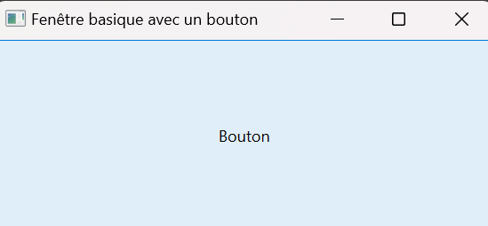
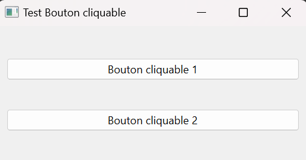
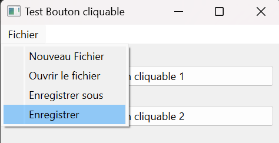

## Introduction

Qt est une interface de programmation d'application (API) orientée objet pour développer des interfaces graphiques en C++. Dans ce MON, nous allons utiliser Python pour exploiter cet API, grâce au projet *Qt for Python*. L'installation se fait rapidement en rentrant la ligne de commande suivante sur un terminal:

```python
pip install PySide6
```

PySide6 est un module de Python développé par le projet *Qt for Python*, et va nous permettre d'utiliser diverses méthodes pour développer des interfaces graphiques dans des fenêtres.

## Présentation des classes de Qt for Python

Nous allons présenter les différentes classes utiles de *Qt for Python*, afin de créer des interfaces basiques.

### QMainWindow

La première étape est de créer une fenêtre basique, avec rien dedans. Après avoir importé les différentes classes de la bibliothèque PySide, on créé une instance de la classe **QMainWindow** et on l'affiche:

```python
from PySide6.QtWidgets import QApplication, QMainWindow
import sys

app.QApplication(sys.argv)
window = QMainWindow()
window.setWindowTitle("Fenêtre basique")
window.show()
app.exec()

```

L'exécution de ce premier code ouvre cette fenêtre:


Comme on peut le voir, la classe **QMainWindow** permet de créer une fenêtre, qui va contenir tout les autres éléments que l'on veut.

### QPushButton

Cette classe permet de créer des boutons avec lesquels l'utilisateur peut interagir. Dans l'exemple suivant, on va faire apparaître une fenêtre avec un bouton au milieu:

```python
from PySide6.QtWidgets import QApplication, QMainWindow, QPushButton
import sys

app = QApplication(sys.argv)
window = QMainWindow()
window.setWindowTitle("Fenêtre basique avec un bouton")
button = QPushButton("Bouton")
window.setCentralWidget(button)
window.show()
app.exec()
```

L'execution de ce code affiche la fenêtre suivante:



Pour l'instant, il ne se passe rien lorsque l'on clique sur ce bouton. C'est parce que on n'a pas associé d'action à ce bouton. Pour se faire, on va utiliser la méthode *clicked.connect* de la classe **QPushButton**. Cette méthode permet d'associer une autre méthode au bouton: lorsque l'utilisateur va cliquer sur ce bouton, ce dernier va envoyer un signal au programme et va exécuter la méthode que l'on a renseigné en argument:

```python
from PySide6.QtWidgets import QApplication, QMainWindow, QPushButton
import sys
from PySide6.QtCore import Qt

class Test_button(QMainWindow):
    def __init__(self):
        super().__init__()
        self.setWindowTitle("Test Bouton cliquable")
        self.button = QPushButton("Bouton cliquable")
        self.button.clicked.connect(self.button_clicked)
        self.setCentralWidget(self.button)
        self.show()
    
    def button_clicked(self):
        print("Le bouton a été cliqué!")

app = QApplication(sys.argv)
window = Test_button()

app.exec()
```


Notons que le code ci-dessus est organisé sour forme d'une classe. Il est préférable de faire ainsi pour rendre le code plus lisible.


Ce code fait bien apparaître la même fenêtre que précédemment, mais cette fois-ci le bouton print du texte lorsque l'on clique dessus.

### QWidget

La classe **QWidget** permet, comme son nom l'indique, de créer des widgets. Ces widgets permettent de placer des éléments dans la fenêtre principale où l'on veut. A l'intérieur de ces widgets, on peut utiliser des classes comme **QVBoxLayout** ou **QHBoxLayout** pour placer les différents éléments. Par exemple, on peut ajouter à notre classe Test_button un widget pour y centrer notre bouton. On peut même y ajouter un deuxième bouton:

```python
class Test_button(QMainWindow):
    def __init__(self):
        super().__init__()
        self.setWindowTitle("Test Bouton cliquable")
        central_widget = QWidget()
        self.setCentralWidget(central_widget)
        self.button1 = QPushButton("Bouton cliquable 1", central_widget)
        self.button1.clicked.connect(self.button_clicked)
        self.button2 = QPushButton("Bouton cliquable 2", central_widget)
        self.button2.clicked.connect(self.button_clicked)

        layout = QVBoxLayout()
        layout.addWidget(self.button1)
        layout.addWidget(self.button2)
        central_widget.setLayout(layout)
        self.show()
    
    def button_clicked(self):
        print("Le bouton a été cliqué!")
```

Ce code fait apparaître la fenêtre suivante:



La classe **QVBoxLayout** permet de créer un layout vertical où tout les éléments sont centrés verticalement.

### MenuBar

La différence entre **QWidget** et **QMainWindow** est qu'avec cette dernière classe, il est possible d'ajouter plusieurs éléments, notamment une barre de menu en haut de la fenêtre. Pour cela, nous allons utiliser la méthode **MenuBar**. Cette classe a de nombreuses méthodes, par exemple la méthode addMenu qui permet d'ajouter des onglets dans la barre de menu, ou bien encore la méthode addAction qui permet d'associer des actions à un onglet. A l'image des boutons, on peut également associer des méthodes pour que ces actions produisent quelque chose, grâce à la méthode triggered.connect:

```python
class Test_button(QMainWindow):
    def __init__(self):
        super().__init__()

        menu_bar = self.menuBar()
        file_menu = menu_bar.addMenu("Fichier")
        file_menu.addAction("Nouveau Fichier")
        file_menu.addAction("Ouvrir le fichier")
        file_menu.addAction("Enregistrer sous")
        save_action = file_menu.addAction("Enregistrer")
        save_action.triggered.connect(self.save)
        
        self.setWindowTitle("Test Bouton cliquable")
        central_widget = QWidget()
        self.setCentralWidget(central_widget)
        self.button1 = QPushButton("Bouton cliquable 1", central_widget)
        self.button1.clicked.connect(self.button_clicked)
        self.button2 = QPushButton("Bouton cliquable 2", central_widget)
        self.button2.clicked.connect(self.button_clicked)

        layout = QVBoxLayout()
        layout.addWidget(self.button1)
        layout.addWidget(self.button2)
        central_widget.setLayout(layout)
        self.show()
    
    def button_clicked(self):
        print("Le bouton a été cliqué!")
    
    def save(self):
        print("Le fichier a été enregistré")

```

Ce code ouvre la même fenêtre que précédemment, mais avec un onglet "Fichier". Lorsque l'on passe la souris dessus, un menu déroulant apparaît et lorque l'on clique sur "enregistrer", un voit print "Le fichier a été enregistré":




Notons qu'il existe énormément de méthodes associées à chaque classes. Je présente ici les méthodes que je trouve les plus importantes, mais elles sont toutes répertoriées et expliquées sur le site de la documentation du projet *Qt for Python*: [Documentation QT](https://doc.qt.io/)

