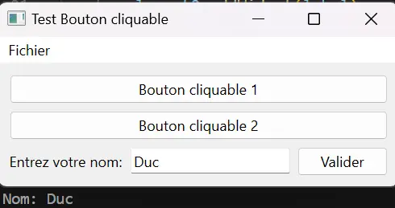


Connaissance basique de la programmation objet avec Python.



Tout les codes présentés ci-dessous sont disponibles dans le dossier Github de Do-It: [Codes du MON1.1](https://github.com/FrancoisBrucker/do-it/tree/main/src/promos/2023-2024/Dang-Vu-Duc/mon/temps-1.1)


## Introduction

Qt est une interface de programmation d'application (API) orientée objet pour développer des interfaces graphiques en C++. Dans ce MON, nous allons utiliser Python pour exploiter cet API, grâce au projet *Qt for Python*. L'installation se fait rapidement en rentrant la ligne de commande suivante sur un terminal:

```python
pip install PySide6
```

PySide6 est un module de Python développé par le projet *Qt for Python*, et va nous permettre d'utiliser diverses méthodes pour développer des interfaces graphiques dans des fenêtres.

## Présentation des classes de Qt for Python

Nous allons présenter les différentes classes utiles de *Qt for Python*, afin de créer des interfaces basiques.

### QMainWindow

La première étape est de créer une fenêtre basique, avec rien dedans. Après avoir importé les différentes classes de la bibliothèque PySide, on créé une instance de la classe **QMainWindow** et on l'affiche:

```python
from PySide6.QtWidgets import QApplication, QMainWindow
import sys

app.QApplication(sys.argv)
window = QMainWindow()
window.setWindowTitle("Fenêtre basique")
window.show()
app.exec()

```

L'exécution de ce premier code ouvre cette fenêtre:


Comme on peut le voir, la classe **QMainWindow** permet de créer une fenêtre, qui va contenir tout les autres éléments que l'on veut.

### QPushButton

Cette classe permet de créer des boutons avec lesquels l'utilisateur peut interagir. Dans l'exemple suivant, on va faire apparaître une fenêtre avec un bouton au milieu:

```python
from PySide6.QtWidgets import QApplication, QMainWindow, QPushButton
import sys

app = QApplication(sys.argv)
window = QMainWindow()
window.setWindowTitle("Fenêtre basique avec un bouton")
button = QPushButton("Bouton")
window.setCentralWidget(button)
window.show()
app.exec()
```

L'execution de ce code affiche la fenêtre suivante:


Pour l'instant, il ne se passe rien lorsque l'on clique sur ce bouton. C'est parce que on n'a pas associé d'action à ce bouton. Pour se faire, on va utiliser la méthode *clicked.connect* de la classe **QPushButton**. Cette méthode permet d'associer une autre méthode au bouton: lorsque l'utilisateur va cliquer sur ce bouton, ce dernier va envoyer un signal au programme et va exécuter la méthode que l'on a renseigné en argument:

```python
from PySide6.QtWidgets import QApplication, QMainWindow, QPushButton
import sys
from PySide6.QtCore import Qt

class Test_button(QMainWindow):
    def __init__(self):
        super().__init__()
        self.setWindowTitle("Test Bouton cliquable")
        self.button = QPushButton("Bouton cliquable")
        self.button.clicked.connect(self.button_clicked)
        self.setCentralWidget(self.button)
        self.show()
    
    def button_clicked(self):
        print("Le bouton a été cliqué!")

app = QApplication(sys.argv)
window = Test_button()

app.exec()
```


Notons que le code ci-dessus est organisé sour forme d'une classe. Il est préférable de faire ainsi pour rendre le code plus lisible.


Ce code fait bien apparaître la même fenêtre que précédemment, mais cette fois-ci le bouton print du texte lorsque l'on clique dessus.

### QWidget

La classe **QWidget** permet, comme son nom l'indique, de créer des widgets. Ces widgets permettent de placer des éléments dans la fenêtre principale où l'on veut. A l'intérieur de ces widgets, on peut utiliser des classes comme **QVBoxLayout** ou **QHBoxLayout** pour placer les différents éléments. Par exemple, on peut ajouter à notre classe Test_button un widget pour y centrer notre bouton. On peut même y ajouter un deuxième bouton:

```python
class Test_button(QMainWindow):
    def __init__(self):
        super().__init__()
        self.setWindowTitle("Test Bouton cliquable")
        central_widget = QWidget()
        self.setCentralWidget(central_widget)
        self.button1 = QPushButton("Bouton cliquable 1", central_widget)
        self.button1.clicked.connect(self.button_clicked)
        self.button2 = QPushButton("Bouton cliquable 2", central_widget)
        self.button2.clicked.connect(self.button_clicked)

        layout = QVBoxLayout()
        layout.addWidget(self.button1)
        layout.addWidget(self.button2)
        central_widget.setLayout(layout)
        self.show()
    
    def button_clicked(self):
        print("Le bouton a été cliqué!")
```

Ce code fait apparaître la fenêtre suivante:


La classe **QVBoxLayout** permet de créer un layout vertical où tout les éléments sont centrés verticalement.

### MenuBar

La différence entre **QWidget** et **QMainWindow** est qu'avec cette dernière classe, il est possible d'ajouter plusieurs éléments, notamment une barre de menu en haut de la fenêtre. Pour cela, nous allons utiliser la méthode **MenuBar**. Cette classe a de nombreuses méthodes, par exemple la méthode addMenu qui permet d'ajouter des onglets dans la barre de menu, ou bien encore la méthode addAction qui permet d'associer des actions à un onglet. A l'image des boutons, on peut également associer des méthodes pour que ces actions produisent quelque chose, grâce à la méthode triggered.connect:

```python
class Test_button(QMainWindow):
    def __init__(self):
        super().__init__()

        menu_bar = self.menuBar()
        file_menu = menu_bar.addMenu("Fichier")
        file_menu.addAction("Nouveau Fichier")
        file_menu.addAction("Ouvrir le fichier")
        file_menu.addAction("Enregistrer sous")
        save_action = file_menu.addAction("Enregistrer")
        save_action.triggered.connect(self.save)
        
        self.setWindowTitle("Test Bouton cliquable")
        central_widget = QWidget()
        self.setCentralWidget(central_widget)
        self.button1 = QPushButton("Bouton cliquable 1", central_widget)
        self.button1.clicked.connect(self.button_clicked)
        self.button2 = QPushButton("Bouton cliquable 2", central_widget)
        self.button2.clicked.connect(self.button_clicked)

        layout = QVBoxLayout()
        layout.addWidget(self.button1)
        layout.addWidget(self.button2)
        central_widget.setLayout(layout)
        self.show()
    
    def button_clicked(self):
        print("Le bouton a été cliqué!")
    
    def save(self):
        print("Le fichier a été enregistré")

```

Ce code ouvre la même fenêtre que précédemment, mais avec un onglet "Fichier". Lorsque l'on passe la souris dessus, un menu déroulant apparaît et lorque l'on clique sur "enregistrer", un voit print "Le fichier a été enregistré":



Notons qu'il existe énormément de méthodes associées à chaque classes. Je présente ici les méthodes que je trouve les plus importantes, mais elles sont toutes répertoriées et expliquées sur le site de la documentation du projet *Qt for Python*: [Documentation QT](https://doc.qt.io/)


### QMessageBox

Cette classe permet de faire apparaître une fenêtre "popup". On peut définir des boutons de base qui sont dans ce popup, avec la méthode *setStandardButtons*. Voici un exemple d'un code qui fait apparaître un popup (ce code est ajouté à notre méthode *button_clicked*):

```python
def button_clicked(self):
        message = QMessageBox()
        message.setMinimumSize(700,200)
        message.setWindowTitle("Titre du popup")
        message.setText("Message d'erreur")
        message.setIcon(QMessageBox.Critical)
        message.setStandardButtons(QMessageBox.Ok | QMessageBox.Cancel)
        message.setDefaultButton(QMessageBox.Ok)
        message.exec()
```

Lorsque l'on clique sur un des deux boutons, le popup suivant apparaît:


Encore une fois, il est possible de faire bien plus de choses avec cette fenêtre popup, tout est documenté sur le site de Qt.

### QLabel et QLineEdit

La classe **QLabel** permet de mettre des labels (c'est-à-dire du texte) dans la fenêtre, et la classe **QLineEdit** permet d'afficher un champ où l'utilisateur peut rentrer du texte. Ce texte peut être récupéré grâce à la méthode *text* de la classe **QLineEdit**. Voici un exemple d'utilisation de ces deux classes (on ajoute le code suivant dans l'initialisation de la classe *Test_button*):

```python
label = QLabel("Entrez votre nom:")
self.line_edit = QLineEdit()
button_valider = QPushButton("Valider")
button_valider.clicked.connect(self.valider)

layout2 = QHBoxLayout()
layout2.addWidget(label)
layout2.addWidget(self.line_edit)
layout2.addWidget(button_valider)

layout = QVBoxLayout()
layout.addWidget(self.button1)
layout.addWidget(self.button2)
layout.addLayout(layout2)
central_widget.setLayout(layout)
self.show()

def valider(self):
  print("Nom:", self.line_edit.text())
```

L'exécution de ce code fait apparaître notre fenêtre test, mais avec en plus un champ à remplir. Quand on clique sur le bouton valider, on voit que l'information du nom a bien été print:



On remarque l'utilisation de la classe **QHBoxLayout** pour mettre le label, le champ à remplir et le bouton valider côte-à-côte. Ensuite, on a rajouté ce layout au layout vertical principal.

## Utilisation de Qt Designer

### Création d'une interface graphique sur Qt Designer

Il existe bien plus de classes disponibles avec Qt. Il peut-être difficile de se retrouver parmi tout cela, et trouver les bonnes méthodes pour faire ce que l'on veut. Il existe ainsi un outil pour pallier à ce problème: **Qt Designer**. Ce logiciel est disponible en open source sur le [site de Qt](https://qt.io). Grâce à cet outil, on peut placer tout les éléments possibles comme on le souhaite dans une fenêtre.
Pour illustrer l'utilisation de cet outil, nous allons créer une fenêtre pour jouer à un jeu de carte basique: la bataille. Pour cela, on doit télécharger un dossier avec des images de cartes à jouer. Ensuite, on créé une **MainWindow** sur Qt Designer.


On peut voir ci-dessus à quoi ressemble le terminal de QT Designer. Sur le côté droit, il y a l'endroit pour modifier les propriétés de chaque objet; sur la gauche, il y a tout les objets que l'on peut utiliser. Il suffit de les cliquer-glisser sur l'interface. On peut également changer les couleurs, on encore assigner des images aux objets (dans notre cas, les images de cartes).
J'ai choisi un fond vert pour représenter le tapis de jeu. Pour charger une image sur un label (par exemple ici, une image de dos de carte), il faut cliquer sur cet élément et changer la "pixmap" dans les options du label (sur le côté gauche).

### Utilisation de l'interface dans un programme

L'enregistrement de ce fichier via Qt Designer produit un fichier .ui, qui va pouvoir être utilisé dans un programme. Pour ce faire, on va utliser la classe **QUiLoader**, qui va permettre de charger le fichier .ui et l'associer à une fenêtre grâce à la méthode *load* de cette classe. Ensuite, il faut associer les éléments du fichier .ui à des variables dans notre code. Pour cela, on va utiliser la méthode *findChild*, qui prend en argument le type d'objet que l'on recherche ainsi que son nom que l'on a attribué dans Qt Designer. Ainsi, l'initialisation de notre classe **Bataille** ressemble à ceci:

```python
class Bataille(QMainWindow):
    def __init__(self):
        super().__init__()

        ui_file_name = "bataille.ui"
        ui_file = QFile(ui_file_name)
        loader = QUiLoader()
        self.main_window = loader.load(ui_file)
        ui_file.close()
        self.main_window.setWindowTitle("Bataille")

        self.DealerCard = self.main_window.findChild(QLabel, "dealer_card")
        self.PlayerCard = self.main_window.findChild(QLabel, "player_card")
        self.DealerCount = self.main_window.findChild(QLabel, "dealer_count")
        self.PlayerCount = self.main_window.findChild(QLabel, "player_count")
        self.PlayerName = self.main_window.findChild(QLabel, "player_header")
        self.CardsLeft = self.main_window.findChild(QLabel, "cards_left")
        self.result = self.main_window.findChild(QLabel, "result")
        self.PlayButton = self.main_window.findChild(QPushButton, "play_button")
        self.RestartButton = self.main_window.findChild(QPushButton, "restart_button")
        self.ShuffleButton = self.main_window.findChild(QPushButton, "shuffle_button")

        self.PlayButton.clicked.connect(self.play)
        self.RestartButton.clicked.connect(self.restart)
        self.ShuffleButton.clicked.connect(self.newdeck)

        self.dealer_count = 0
        self.player_count = 0

        widget = QWidget()
        self.name_window = QMainWindow()
        self.name_window.setWindowTitle("Nom du joueur")
        self.name_window.setCentralWidget(widget)
        label = QLabel("Entrez votre nom:")
        self.line_edit = QLineEdit()
        button_valider = QPushButton("Valider")
        button_valider.clicked.connect(self.valider)
        layout = QHBoxLayout()
        layout.addWidget(label)
        layout.addWidget(self.line_edit)
        layout.addWidget(button_valider)
        widget.setLayout(layout)
        self.name_window.show()

        self.newdeck()
```

On remarque que l'on a bien associé chaque bouton à une action (que l'on va définir plus tard). On a également deux fenêtres: main_window et name_window. Cette dernière fenêtre permet au joueur de renseigner son nom, grâce à la classe **QLineEdit**, explicitée précédemment.

Il faut maintenant créer les méthodes pour associées à chaque bouton. La méthode newdeck créé un jeu de 52 cartes grâce à une classe **Card**, qui associe à chaque carte un nom et une valeur. La méthode restart créé un nouveau deck et réinitialise les compteurs de points et la méthode play affiche deux cartes aléatoires et compare leur valeurs. L'affichage des cartes se faire grâce à la métnode setPixmap de la classe **QLabel**. Cette pixmap contient l'information d'une image, qu'on définit grâce à la classe **QPixmap**. Voici le code de ces méthodes:

```python
    def valider(self):
        name = self.line_edit.text()
        self.PlayerName.setText(f"Cartes du joueur {name}")
        self.main_window.show()
        self.name_window.close()

    def newdeck(self):
        suits = ["diamonds", "clubs" ,"hearts", "spades"]
        values = range(2,15)
        self.deck = []
        for suit in suits:
            for value in values:
                self.deck.append(Card(f"{value}_of_{suit}", value))
        self.CardsLeft.setText(f"{len(self.deck)} cartes restantes")
    
    def play(self):
        card_dealer = random.choice(self.deck)
        self.deck.remove(card_dealer)
        pixmap_dealer = QPixmap(f'PNG-cards/{card_dealer.name}.webp')
        self.DealerCard.setPixmap(pixmap_dealer)
        card_player = random.choice(self.deck)
        self.deck.remove(card_player)
        pixmap_player = QPixmap(f'PNG-cards/{card_player.name}.webp')
        self.PlayerCard.setPixmap(pixmap_player)
        self.CardsLeft.setText(f"{len(self.deck)} cartes restantes")

        if card_dealer.value > card_player.value:
            self.result.setText("Le dealer a gagné!")
            self.dealer_count += 1
            self.DealerCount.setText(f"Le dealer a {self.dealer_count} points")

        if card_dealer.value < card_player.value:
            self.result.setText("Le joueur a gagné!")
            self.player_count += 1
            self.PlayerCount.setText(f"Le joueur a {self.player_count} points")

        if card_dealer.value == card_player.value:
            self.result.setText("Egalité!")
        
        if len(self.deck) == 0:
            self.newdeck()

    def restart(self):
        self.player_count = 0
        self.dealer_count = 0
        self.PlayerCount.setText("Le joueur a 0 points")
        self.DealerCount.setText("Le dealer a 0 points")
        pixmap = QPixmap('PNG-cards/dos.webp')
        self.DealerCard.setPixmap(pixmap)
        self.PlayerCard.setPixmap(pixmap)
        self.newdeck()

class Card():
    def __init__(self, name, value):
        self.value = value
        self.name = name
```

L'exécution de ce code fait apparaître dans un premier temps une fenêtre demandant au joueur de rentrer son nom. Une fois que le joueur a validé son nom, la méthode "valider" change le Label du joueur pour y mettre son nom, avec la méthode setText.


Ce jeu de bataille est donc bien fonctionnel. Il compte les points à chaque tour et met bien à jour chaque texte.

## Conclusion

Comme on a pu le voir, Qt permet de faire des interfaces graphiques de tout genre. Il existe une multitude de classes et de méthodes, je n'ai ici que présenté une infime partie de ce qui est possible. Cependant, avec ces principales classes, il est possible de faire les applications les plus basiques, comme par exemple le jeu de bataille que j'ai implémenté en application de ce MON (ce code python se trouve dans le dossier GitHub). De plus, si l'on veut découvrir encore plus de choses sur Qt, il peut être intéressant de parcourir le site de la documentation de Qt, ainsi que le Qt Designer pour voir tout les éléments possibles.
