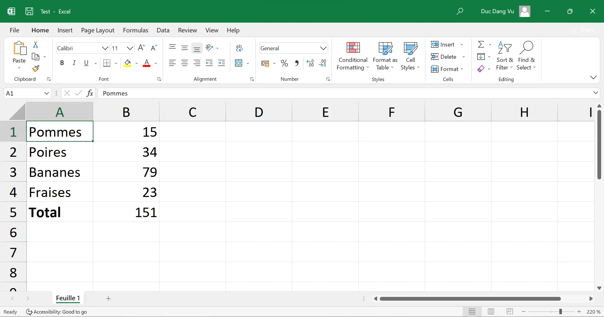
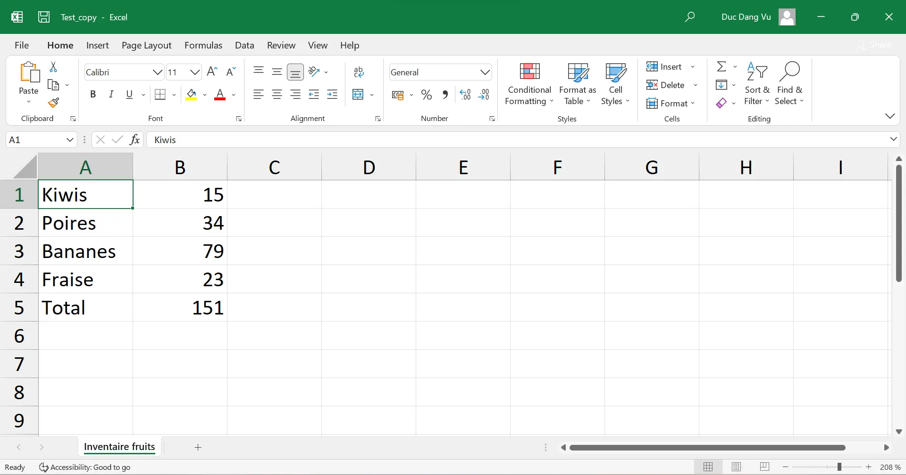
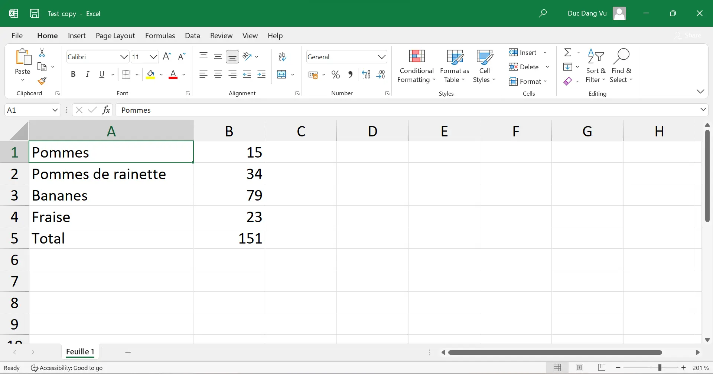
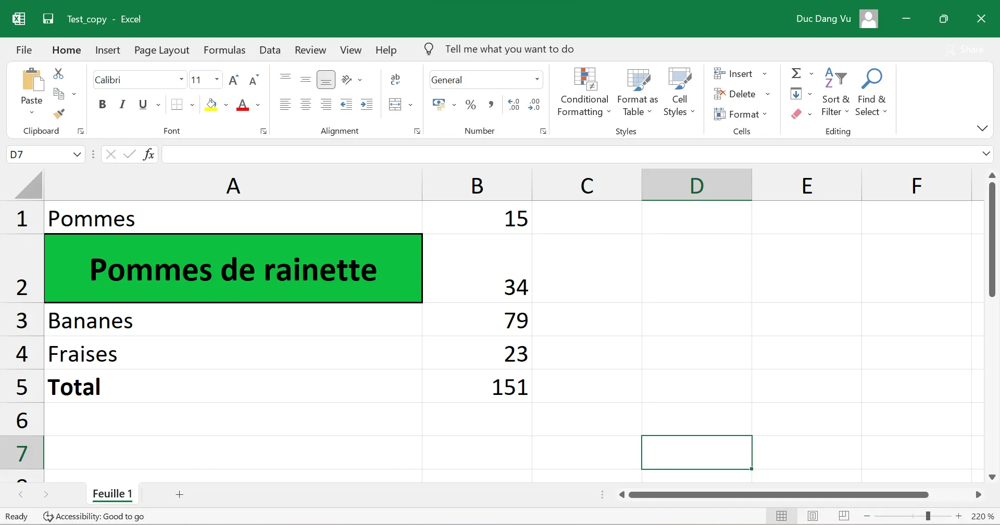
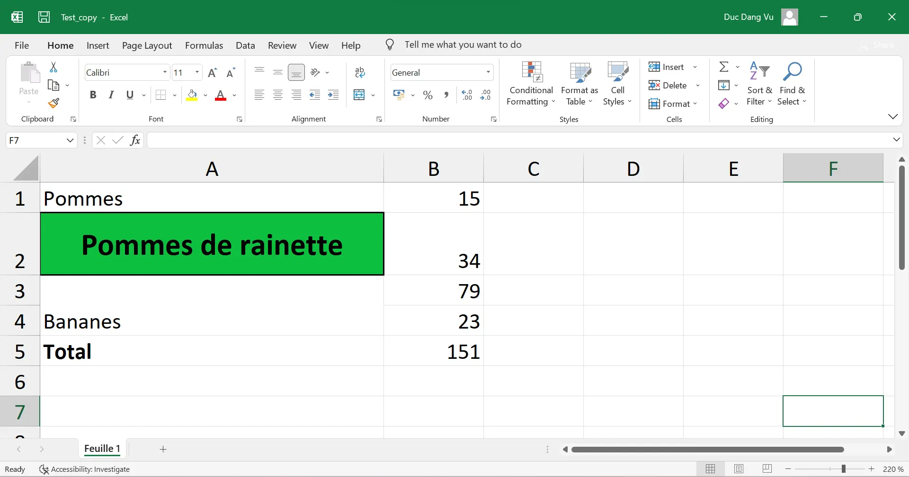
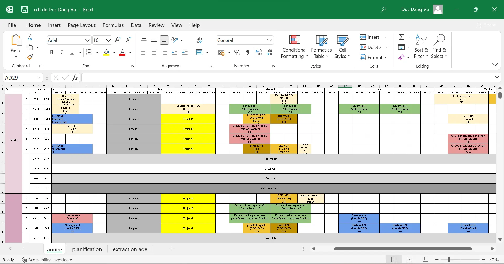
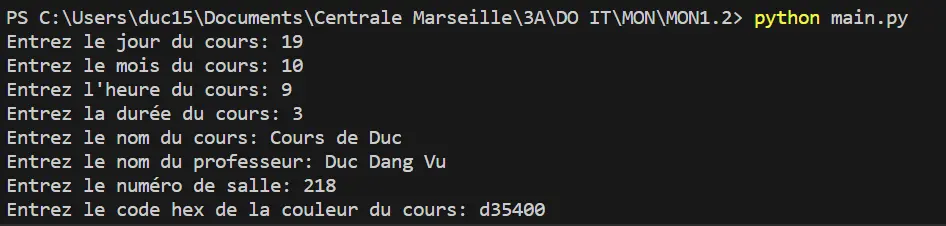
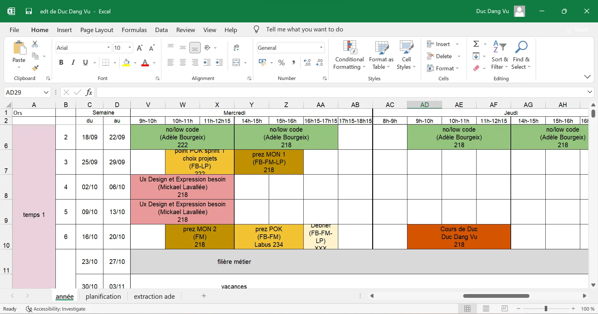
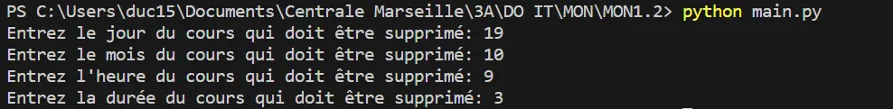
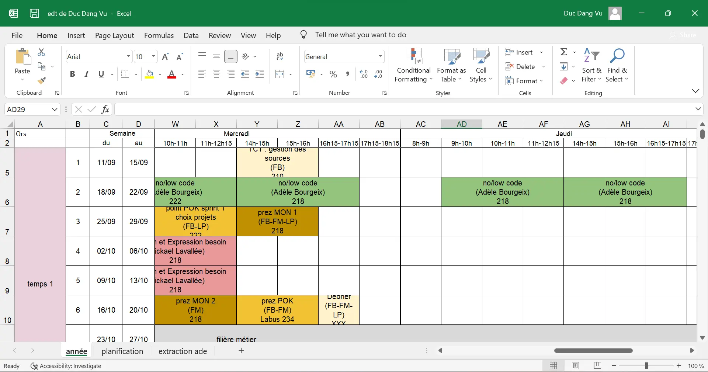


Connaissance basique de la programmation objet avec Python.



Tout les codes présentés ci-dessous ainsi que les fichiers de ce MON (notamment les emplois du temps personnalisés) sont disponibles dans le dossier Github de Do-It: [Codes du MON1.2](https://github.com/FrancoisBrucker/do-it/tree/main/src/promos/2023-2024/Dang-Vu-Duc/mon/temps-1.2)


## Introduction

L'outil Excel du pack Office est un outil très répandu dans toutes les entreprises. Tout le monde sait à peu près comment fonctionne ce logiciel, mais peu de gens savent qu'il existe une bibliothèque python qui permet de lire et modifier des fichier Excel: **openpyxl**. Ce MON aura donc pour objectif d'apprendre à utiliser openpyxl pour automatiser des tâches sur des fichiers Excel qui seraient en temps normal longues à faire à la main.

Dans un premier temps, nous expliquerons les méthodes principales de openpyxl. Ensuite, nous appliquerons ces connaissances en créant des emplois du temps personnalisés pour chaque élève Do-It 2023/2024.

Dans ce MON, seulement une petite partie des commandes de la bibliothèque openpyxl seront expliquées (celles les plus importantes). Le reste est très bien expliqué sur le [site de openpyxl](https://openpyxl.readthedocs.io/en/stable/).

Dans la suite, quelques lignes de code en python seront présentées. Le résultat de l’exécution des lignes de code est indiqué juste après celles-ci, après 3 chevrons `>>>`

## Apprentissage de la bibliothèque

Tout d'abord, il faut installer openpyxl. Pour cela, il faut rentrer la commande suivante dans une invite de commande:

```python
pip install openpyxl
```

Une fois la bibliothèque installée, il faut l'importer au début du code python, et nous sommes prêts! Nous allons dans la suite expliquer les méthodes principales qui permettent de lire et modifier des données dans des fichiers Excel. Dans la suite, les fichiers manipulés doivent se trouver dans le même repertoire que le fichier python exécuté. Le fichier Excel que nous allons manipuler en exemple se nomme *test.xlsx* et contient le simple tableur suivant:



La feuille qui est remplie se nomme *Feuille 1*.

### Lecture de données

Dans un premier temps, nous allons expliquer comment lire des données. La première classe qui est importante à connaître est la classe **Workbook**. Pour créer un objet de cette classe, on utilise la méthode *openpyxl.load_workbook*. Les objets de cette classe correspondent au fichier Excel renseigné en paramètre de la méthode. Ils contiennent toutes les informations du fichier: lignes, colonnes, cellules etc... Par exemple, on peut récupérer les noms des feuilles du fichier Excel avec la méthode *sheetnames*.
Il faut ensuite récupérer la feuille sur laquelle on veut lire les données. Pour cela, on renseigne le nom de la feuille en question comme suit:

```python
import openpyxl

wb = openpyxl.load_workbook('test.xlsx')
sheet = wb['Feuille 1']
```


Il est également possible de récupérer la feuille active (c'est-à-dire celle qui s'affiche lorsqu'on ouvre le fichier Excel) par l'attribut *active* de la classe Workbook: `sheet = wb.active`


La variable *sheet* est un objet de la classe **Worksheet**. Cet objet contient notamment les informations de toutes les cellules de la feuille. On récupère une cellule en indiquant directement son nom, ou bien en indiquant son numéro de ligne et de colonne via la méthode *cell*. Notons que ces numéros commencent à 1 (et pas 0) et le numéro de colonne 27 correspond à la colonne "AA". On peut récupérer le contenu de la cellule avec l'attribut *value*. On peut également récupérer les coordonnées d'une cellule avec l'attribut *coordinate*.

```python
cell = sheet['A1']
# ou cell = sheet.cell(row = 1, column = 1)
print(cell.value)
print(cell.coordinate)

>>> 'Pommes'
>>> 'A1'
```

Il est possible de convertir un nombre vers la lettre d'une colonne et vice-versa. Par exemple, 1 correspond à "A" et 28 correspond à "AB". Les fonctions utilisées sont *get_column_letter* et *column_index_from_string*. Ces fonctions doivent être importées avant d'être utilisées:

```python
from openpyxl.utils import get_column_letter, column_index_from_string

print(get_column_letter(30))
print(column_index_from_string('E'))

>>> 'AD'
>>> 5
```

### Écriture de données

En plus de lire des données, il est possible de les modifier, et d'en rajouter dans les fichiers Excel. Par exemple, on peut modifier le titre d'une feuille, ou encore modifier le contenu d'une cellule. Après chaque modification, il faut enregistrer le workbook avec la méthode *save*. Notons qu'on ne peut pas sauvegarder un fichier qui est ouvert dans un autre onglet. Il est recommandé d'enregistrer le fichier modifié sous un autre nom afin de ne pas écraser le fichier original. Ainsi, si jamais il y a des erreurs dans le programme, il est possible de récupérer le fichier original.

```python
wb = openpyxl.load_workbook('test.xlsx')
sheet = wb['Feuille 1']
cell = sheet['A1']

sheet.title = 'Inventaire fruits'
cell.value = 'Kiwis'

wb.save('test_copy.xlsx')
```

Voici à quoi ressemble le fichier *test_copy.xlsx*, qui a été enregistré dans le même repertoire que le code python exécuté:



La cellule A1 a bien été modifiée, ainsi que le nom de la feuille.

On peut également modifier la hauteur et la largeur des cellules en modifiant les attributs *row_dimensions.height* et *column_dimensions.width* des objets de la classe **Worksheet**. Les valeurs indiquées sont en "pt".

```python
cell = sheet['A2']
cell.value = 'Pommes de rainette'
sheet.column_dimensions['A'].width = 30

wb.save('test_copy.xlsx')
```

Le fichier *test_copy.xlsx* produit est le suivant:



La largeur de la colonne A s'est bien modifiée.

On peut aussi centrer horizontalement et verticalement le contenu d'une cellule avec la classe **Alignment**, changer le style de police du contenu d'une cellule avec la classe **Font** ou encore changer la couleur de fond d'une cellule avec la classe **PatternFill**. Ces classes doivent être importées de la bibliothèque *openpyxl.styles*. Enfin, il est possible de créer des bordures sur les cellules en modifiant leurs attributs *border* de la classe **Cell**. Encore une fois, il faut importer la classe **Border** depuis la bibliothèque *openpyxl.styles.borders*.

```python
from openpyxl.styles import Font, PatternFill, Alignment

wb = openpyxl.load_workbook('test.xlsx')
sheet = wb['Feuille 1']

cell = sheet['A2']
cell.value = 'Pommes de rainette'
sheet.column_dimensions['A'].width = 30
sheet.row_dimensions[2].height = 30
cell.font = Font(size = 15, bold = True)
cell.alignment = Alignment(horizontal = "center", vertical = "center")
cell.fill = PatternFill("solid", start_color = "0ebf3e")
cell.border = Border(left = Side(style='thick'), right = Side(style='thick'), top = Side(style='thick'), bottom = Side(style='thick'))

wb.save('test_copy.xlsx')
```

Le résultat est le suivant:



Le texte "Pomme de rainette" est bien centré horizontalement et verticalement dans sa cellule et il est bien en gras et de taille 15. De plus, la couleur de la cellule a bien changé et la cellule a bien des bordures épaisses.


La couleur renseignée en paramètres de la classe **PatternFill** est sous la forme d'un code hex. Ce code peut être déterminé grâce au site suivant: [htmlcolorcode.com](https://htmlcolorcodes.com/)


Enfin, il est possible de fusionner des cellules ou de les séparer, grâce aux méthodes *merge_cells* et *unmerge_cells*. Par exemple, si l'on ajoute au code précédent la commande `sheet.merge_cells('A3:A4')`, on obtient le résultat suivant:




On remarque que seul le contenu de la première cellule est conservé. De plus, les autres cellules de la cellule fusionnée sont des objets de la classe **MergedCell**. Il est possible de récupérer tout ces objets grâce à l'attribut *merged_cell.ranges* de la classe **Worksheet**.


## Application des connaissances acquises

Afin d'appliquer ces connaissances de openpyxl, nous allons travailler sur les fichiers Excel disponibles dans le Drive Do-It 2023/2024. Nous allons récupérer le fichier contenant la liste des élèves ainsi que leur choix de cours, ainsi que le fichier contenant l'emploi du temps de l'année. L'objectif est de créer un emploi du temps personnalisé pour chaque élève, en fonction de ses choix de cours. Il faudra donc lire les données de la première feuille puis écrire de nouvelles données sur la deuxième feuille. Ensuite, nous allons implémenter des méthodes pour permettre à l'utilisateur de rajouter ou supprimer manuellement des cours sur son emploi du temps.

### Création automatique d'emplois du temps personnalisés

Le premier fichier Excel sur lequel nous allons travailler est celui contenant la liste des élèves ainsi que leurs choix de cours. Ce fichier est nommé *étudiants_Do-It_23_24.xlsx*. Le deuxième fichier est nommé *edt Do_It.23-24.xlsx*, et contient l'emploi du temps de la promo Do-It 2023/2024 sous forme d'un tableau. On va créer une classe **Create_timetable** qui va contenir les méthodes pour manipuler les emplois du temps. Plus particulièrement, la méthode *create_timetable_automatic* va prendre en argument le nom et le prénom d'un étudiant et va enregistrer son emploi du temps personnalisé. Voici les différentes étapes que le programme va suivre:

- Création d'une liste *courses_name*, qui contient initialement les cours qui sont communs à tout les élèves (par exemple filière métier, les cours de tronc commun, les vacances etc...) On s'assure que tout ces cours soient écrits en lettres minuscules.
- Récupération du numéro de ligne correspondant au nom et prénom (donnés en arguments) dans le document Excel *étudiants_Do-It_23_24.xlsx*. Si le nom ou le prénom ne figure pas dans le document, on affiche une erreur et on sort de la méthode.
- Récupération des cours de l'élève. Pour cela, on parcourt le numéro de ligne que l'on vient de déterminer et on vérifie si une croix s'y trouve. Si c'est le cas, on remonte jusqu'au nom du cours (ligne 2) et on ajoute à la liste *courses_name* le nom du cours.
- Suppression des cours que l'élève n'a pas choisi. On parcourt toutes les cellules à l'intérieur du tableau du fichier Excel *edt Do_It.23-24.xlsx*, et on relève son contenu. Si ce contenu n'est pas l'élément vide, on vérifie si le nom du cours est présent dans la liste *courses_name*. Si ce n'est pas le cas, on supprime ce cours. Pour supprimer ce cours, on fait appel à la méthode *remove_course_automatic*, qui suit les étapes suivantes:
  - Séparation des cellules
  - Coloration de chaque cellule en blanc
  - Suppression du contenu de ces cellules.
- Si le cours est dans la liste des cours, on réajuste la hauteur de la cellule
- Une fois que toutes les cellules ont été visitées, on enregistre l'emploi du temps sous le nom de *edt de "prénom" "nom"*

On créé également une méthode *create_all_timetable*, qui itère la méthode précédente 24 fois (une fois pour chaque élève) pour créer chaque emploi du temps pour chaque élèves. Ces emplois du temps sont disponibles dans le dossier GitHub de ce MON: [Codes du MON1.2](https://github.com/FrancoisBrucker/do-it/tree/main/src/promos/2023-2024/Dang-Vu-Duc/mon/temps-1.2)

Pour executer ce code, il faut créer un objet de la classe **Create_timetable** et appeler la méthode *create_timetable_automatic*, en renseignant les nom et prénom de l'élève (sous forme de chaîne de caractères):

```python
test = Create_timetable()
test.create_timetable_automatic("Dang Vu", "Duc")
```

L'exécution de ces lignes produit le fichier Excel suivant:




Les emplois du temps produits sont basés sur le fichier original datant du 14/10/23. Il est possible que d'ici cette date, de nouveaux cours soient rajoutés, ou bien modifiés voire même supprimés. C'est pourquoi le temps 3 n'est pas complet pour tout les emplois du temps car à l'heure où j'écris ces lignes, les cours du temps 3 ne sont pas encore fixés. De plus, il est très important que les noms des cours indiqués dans le fichier *étudiants_Do-It_23_24.xlsx* correspondent **mot pour mot** à ceux présents dans le fichier *edt Do_It.23-24.xlsx*. Même un espace à la fin du nom posera des problèmes.


### Ajout et suppression automatisé d'un cours

La classe **Create_timetable** contient également des méthodes pour ajouter ou supprimer des cours dans un fichier Excel renseigné en argument. Voici les étapes que suit la méthode *add_course* pour ajouter des cours:

- Demande des informations suivantes: jour et mois du cours qui doit être ajouté, date et durée du cours, nom du professeur, numéro de salle et couleur du cours (au format hex)
- Récupération de la cellule correspondant à la date renseignée. Pour cela, on appelle la méthode *get_cell_reference*, qui utilise une liste *weeks* composée des semaines de l'année (obtenue grâce aux colonnes C et D de l'edt) et qui en déduit la cellule correspondante.
- Ajout du cours en question: on fusionne les $n$ cellules en partant de la cellule obtenue, $n$ étant la durée du cours renseignée.

La méthode *remove_course* suit des étapes similaires.

Voici ce que produit la méthode *add_course* quand on exécute la commande `test.add_course("edt de Duc Dang Vu.xlsx")`, après avoir rentré les informations du cours à rajouter:





Et voici ce que produit la méthode *remove_course* quand on exécute la commande `test.remove_course("edt de Duc Dang Vu.xlsx")`, après avoir rentré les informations du cours à supprimer:





Le cours a bien été ajouté, puis supprimé comme on le voulait.



```python
import openpyxl
from openpyxl.styles import Font, PatternFill, Alignment
from openpyxl.utils import get_column_letter
from openpyxl.styles.borders import Border, Side

class Create_timetable():
    def __init__(self):
        self.create_new_sheets()
        self.weeks = []
        self.possible_times = [8, 9, 10, 11, 12, 14, 15, 16, 17, 18]
        self.wb = openpyxl.load_workbook('edt Do_It.23-24.xlsx')
        self.sheet = self.wb['année']
        for i in range(3,35):
            cell_begin = self.sheet.cell(row = i, column = 3)
            cell_end = self.sheet.cell(row = i, column = 4)
            self.weeks.append([cell_begin.value, cell_end.value])
    
    def create_new_sheets(self):
        self.wb2 = openpyxl.load_workbook('étudiants_Do-It_23_24.xlsx')
        self.sheet2 = self.wb2['effectif']
        self.wb3 = openpyxl.load_workbook('edt Do_It.23-24.xlsx')
        self.sheet3 = self.wb3['année']
    
    def get_cell_reference(self, day, month, time):
        nb_week = None
        nb_day = None
        for k in range(len(self.weeks)):
            date_begin = self.weeks[k][0]
            date_end = self.weeks[k][1]
            if date_begin.month == date_end.month and month == date_begin.month:
                if day in range(date_begin.day, date_end.day + 1):
                    nb_week = k
                    nb_day = day - date_begin.day
                    break
            if date_begin.month != date_end.month and month == date_begin.month:
                if day >= date_begin.day:
                    nb_week = k
                    nb_day = day - date_begin.day
                    break
            if date_begin.month != date_end.month and month == date_end.month:
                if day <= date_end.day:
                    nb_week = k
                    virtual_day_begin = date_end.day - 4
                    nb_day = day - virtual_day_begin
                    break
        if nb_week == None:
            print("La date indiquée n'est pas valide")
            return(False)
        nb_row = nb_week + 3
        if time not in self.possible_times:
            print("L'heure indiquée n'est pas valide")
            return(False)
        else:
            index = self.possible_times.index(time)
            nb_column = nb_day * 8 + 5 + index
        return(get_column_letter(nb_column) + str(nb_row))

    def add_course(self, file_name):
        current_wb = openpyxl.load_workbook(file_name)
        current_sheet = current_wb['année']
        day = int(input("Entrez le jour du cours: "))
        month = int(input("Entrez le mois du cours: "))
        time = None
        while time not in self.possible_times:
            time = int(input("Entrez l'heure du cours: "))
        duration = int(input("Entrez la durée du cours: "))
        name = str(input("Entrez le nom du cours: "))
        professor = str(input("Entrez le nom du professeur: "))
        room = str(input("Entrez le numéro de salle: "))
        color = str(input("Entrez le code hex de la couleur du cours: "))
        cell_reference = self.get_cell_reference(day, month, time)
        cell_reference2 = self.get_cell_reference(day, month, time + duration - 1)
        current_sheet.merge_cells(cell_reference + ':' + cell_reference2)
        cell = current_sheet[cell_reference]
        cell.fill = PatternFill("solid", start_color = color)
        cell.value = f"{name}\n{professor}\n{room}"
        cell.alignment = Alignment(wrapText=True, horizontal = "center", vertical = "center")
        current_sheet.row_dimensions[cell.row].height = 10 * 3 + 10
        current_wb.save(file_name)
    
    def remove_course(self, file_name):
        current_wb = openpyxl.load_workbook(file_name)
        current_sheet = current_wb['année']
        day = int(input("Entrez le jour du cours qui doit être supprimé: "))
        month = int(input("Entrez le mois du cours qui doit être supprimé: "))
        time = int(input("Entrez l'heure du cours qui doit être supprimé: "))
        duration = int(input("Entrez la durée du cours qui doit être supprimé: "))
        cell_reference = self.get_cell_reference(day, month, time)
        cell_reference2 = self.get_cell_reference(day, month, time + duration - 1)
        border = Border(left = Side(style='thin'), right = Side(style='thin'), top = Side(style='thin'), bottom = Side(style='thin'))
        current_sheet.unmerge_cells(cell_reference + ':' + cell_reference2)
        for k in range(duration):
            cell_reference = self.get_cell_reference(day, month, time + k)
            cell = current_sheet[cell_reference]
            cell.border = border
            cell.fill = PatternFill("solid", start_color = "FFFFFF")
            cell.value = None
        current_wb.save(file_name)
    
    def remove_course_automatic(self, cell, duration):
        border = Border(left = Side(style='thin'), right = Side(style='thin'), top = Side(style='thin'), bottom = Side(style='thin'))
        if duration == 1:
            cell.border = border
            cell.fill = PatternFill("solid", start_color = "FFFFFF")
            cell.value = None
        else:
            cell_end_coordinate = str(get_column_letter(cell.column + duration - 1)) + str(cell.row)
            self.sheet3.unmerge_cells(cell.coordinate + ':' + cell_end_coordinate)
            for k in range(duration):
                current_cell_coordinate = str(get_column_letter(cell.column + k)) + str(cell.row)
                current_cell = self.sheet3[current_cell_coordinate]
                current_cell.border = border
                current_cell.fill = PatternFill("solid", start_color = "FFFFFF")
                current_cell.value = None

    def get_course_duration(self, cell):
        for mergedCell in self.sheet3.merged_cells.ranges:
            if cell.coordinate in mergedCell:
                return(mergedCell.max_col - mergedCell.min_col + 1)
        return(1)
        


    def create_timetable_automatic(self, nom, prénom):
        courses_name = ["bonjour !", "tc1 : agilité", "lancement projet 3a", "tc1 : gestion des sources", "tc1 : service design", "langues", "projet 3a", "vacances", "filière métier", "tronc commun 3a", "prez mon 2", "prez pok", "point pok sprint 1", "point pok sprint 2", "prez mon 1", "pok&mon", "cap 1a/3a/conception si", "prez projet", "rencontre w3g", "débrief", "conférence métier"]
        row_number = None
        for k in range(3,27):
            cell_nom = self.sheet2.cell(row = k, column = 1)
            cell_prénom = self.sheet2.cell(row = k, column = 2)
            if prénom.lower() == cell_prénom.value.lower() and nom.lower() == cell_nom.value.lower():
                row_number = k
                break
        if row_number == None:
            print("Nom ou prénom invalide")
            return()
        for k in range(7,30):
            cell = self.sheet2.cell(row = row_number, column = k)
            if cell.value == 'x' or cell.value == "X":
                course = self.sheet2.cell(row = 2, column = k).value
                course = course.lower()
                if course == 'bonnes pratiques':
                    courses_name.append("structuration d'un projet info")
                    courses_name.append("programmation par les tests")
                else:
                    courses_name.append(course)
        border_medium_left =  Border(left = Side(style='medium'), right = Side(style='thin'), top = Side(style='thin'), bottom = Side(style='thin'))
        border = Border(left = Side(style='thin'), right = Side(style='thin'), top = Side(style='thin'), bottom = Side(style='thin'))
        border_thick_left = Border(left = Side(style='thick'), right = Side(style='thin'), top = Side(style='thin'), bottom = Side(style='thin'))
        for nb_row in range(5, 35):
            for nb_column in range(5, 45):
                cell = self.sheet3.cell(row = nb_row, column = nb_column)
                course_name = ''
                if cell.value != None:
                    for char in cell.value:
                        course_name += char.lower()
                        if "\n" in course_name:
                            course_name = course_name[:len(course_name) - 1]
                            break
                    if course_name not in courses_name:
                        course_duration = self.get_course_duration(cell)
                        self.remove_course_automatic(cell, course_duration)
                    else:
                        cell.alignment = Alignment(wrapText=True, horizontal = "center", vertical = "center")
                        cell.font = Font(size = 10)
                        self.sheet3.row_dimensions[cell.row].height = 10 * 3 + 10
                if (nb_column - 5) % 8 == 0:
                    cell.border = border_thick_left
                elif (nb_column - 5) % 8 == 4:
                    cell.border = border_medium_left
                else:
                    cell.border = border
        self.wb3.save(f'edt de {cell_prénom.value} {cell_nom.value}.xlsx')
        print(f'Emploi du temps enregistré sous le nom de "edt de {cell_prénom.value} {cell_nom.value}.xlsx"')

    def create_all_timetable(self):
        for k in range(3,27):
            self.create_new_sheets()
            nom = self.sheet2.cell(row = k, column = 1).value
            prénom = self.sheet2.cell(row = k, column = 2).value
            self.create_timetable_automatic(nom, prénom)
        print("Tout les edt ont été enregistrés")
```



## Conclusion

Ce MON fut très intéressant. Je ne savais pas qu'il était possible d'automatiser des opérations sur Excel avec Python, et j'ai donc beaucoup appris. Ces connaissances peuvent très certainement m'être utiles dans ma future carrière.

## Sources

- Al Sweigart. *Automate the boring stuff with Python*. Chapitre 13: *Working with Excel spreadsheets*. [https://automatetheboringstuff.com/](https://automatetheboringstuff.com/). Consulté pour la dernière fois le 15/10/23
- Documentation de openpyxl. *readthedoc.io*. [site d'openpyxl](https://openpyxl.readthedocs.io/en/stable/)
- Tout les codes présentés ont été écrits par mes soins, de A à Z
