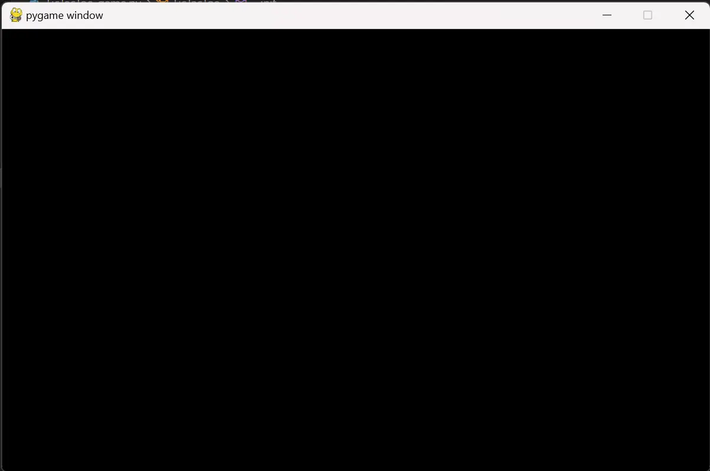
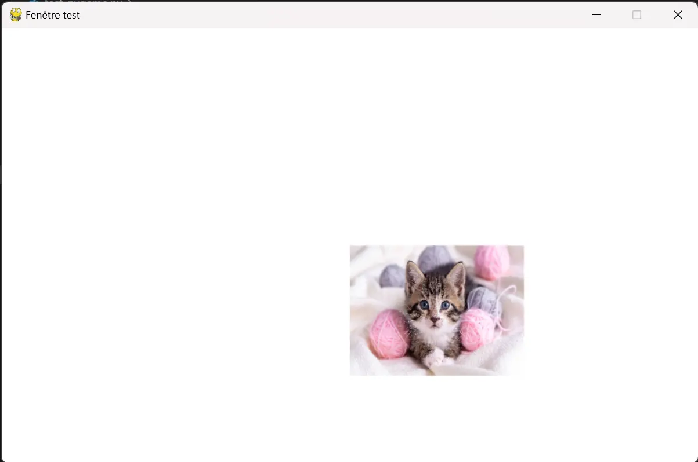
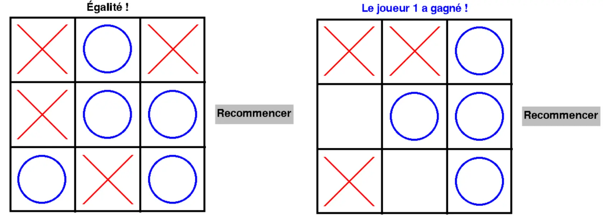


Connaissance basique de la programmation objet avec Python.



Le jeu du Morpion codé en exemple est disponible sur le lien suivant: [Jeu du morpion avec Pygame](https://duc-dgv.itch.io/morpion)
Tout les codes présentés sont disponibles dans le dossier Git du MON2.1: [codes du MON2.1](https://github.com/FrancoisBrucker/do-it/tree/main/src/promos/2023-2024/Dang-Vu-Duc/mon/temps-2.1)


## Introduction

Pygame est une bibliothèque Python permettant d'implémenter des jeux. Ce MON va présenter comment utiliser cette bibliothèque en utilisant l'exemple de l'implémentation d'un simple jeu de Morpion. Notons que Pygame permet de faire des jeux bien plus sophistiqués qu'un simple morpion (par exemple, il est possible de faire des animations ou gérer des collisions). Cependant, la durée du MON ne permet pas de développer un jeu très avancé. Nous allons quand même expliquer les principes de base pour réaliser ce genre d'opération.

Avant toute chose, il faut installer la bibliothèque. Pour cela, il faut rentrer la commande suivant sur un terminal:

```python
pip install pygame
```

## Création d'une fenêtre de jeu

La première étape est de créer une fenêtre, où tout les éléments pourront être placés. Après avoir importé la bibliothèque, on initialise le jeu: `pygame.init()`. Ensuite, on crée la fenêtre grâce au module *display* et de sa méthode *set_mode*.

Il faut ensuite créer la boucle d'évènements. Cette boucle permet d'actualiser constamment ce qui se passe à l'écran. Une classe importante à comprendre est la classe **Event**. Les objets de cette classe sont, comme son nom l'indique, des évènements qui correspondent à tout ce que l'utilisateur peut faire sur la fenêtre. Par exemple, on peut détecter quand l'utilisateur appuie sur la croix de la fenêtre. C'est ce qu'on implémente dans le code suivant:

```python
import pygame
from sys import exit

pygame.init()
screen = pygame.display.set_mode((800, 500))

while True:
    for event in pygame.event.get():
        if event.type == pygame.QUIT:
            pygame.quit()
            exit()
```

L'exécution de ce code affiche la fenêtre suivante:



Il faut à présent remplir cette page. Une première étape est de personnaliser le fond, en utilisant la méthode *fill* : `screen.fill("White")`. Il est également possible de rajouter une image. Pour cela, il faut comprendre la classe **Surface**. Les objets de cette classe sont des éléments, sur lesquels on peut placer différents éléments, comme des images par exemple. Pour associer une image à une surface, on utilise le module *image* et sa méthode *load*. Ensuite, on utilise la méthode *blit* pour afficher cette surface sur l'écran principal. Il ne faut pas oublier d'actualiser la fenêtre avec la méthode *update* du module *display*.
On peut également ajuster la taille de la surface avec le module *tranform* et la méthode *scale*, ou aussi renommer la fenêtre grâce à la méthode *set_caption*.

```python
import pygame
from sys import exit

pygame.init()
screen = pygame.display.set_mode((800, 500))
pygame.display.set_caption("Fenêtre test")
screen.fill("White")
image_chaton = pygame.image.load("Image_chaton.webp")
image_chaton = pygame.transform.scale(image_chaton, (200,150))

while True:
    for event in pygame.event.get():
        if event.type == pygame.QUIT:
            pygame.quit()
            exit()
    screen.blit(image_chaton, (400, 250))
    pygame.display.update()
```

Ce nouveau code affiche la fenêtre suivante:




Toutes les coordonnées spécifiées dans la nomenclature pygame ont pour origine le coin supérieure gauche de l'écran.


Il est également possible de dessiner des formes, ou insérer du texte. Pour cette dernière opération, on doit créer une police grâce à la classe **Font** du module *font*. Ensuite, il faut l'afficher puis le mettre dans une rectangle. Ce rectangle est en fait une surface, et on va pouvoir le placer ou l'on veut dans la fenêtre. Pour ce qui est de dessiner des formes, il faut utiliser le module *draw*, qui contient plusieurs méthodes pour dessiner des lignes, des rectangles, des cercles...

## Création d'un jeu de morpion

Pour appliquer toutes ces notions, nous allons créer un jeu de morpion. On va donc créer une classe **TicTacToe** qui va définir tout ce qui va se trouver sur la fenêtre de jeu ainsi que les différentes interactions qu'il va y avoir. L'initialisation va simplement initier la fenêtre et les variables telle que le tableau *board*, qui contiendra les informations de la partie en cours ou encore le booléen *playing* qui indique si la partie est encore en cours ou non.



```python
class TicTacToe():
    def __init__(self):
        pygame.init()
        self.screen = pygame.display.set_mode((800, 500))
        self.background_color = "White"
        self.screen.fill(self.background_color)
        pygame.display.set_caption("Morpion")
        self.clock = pygame.time.Clock()
        self.font = pygame.font.Font(None, 33)
        self.morpion_surface = pygame.image.load('Plateau morpion.webp')
        self.title_surface = self.font.render('Jeu du morpion', False, "Black")
        self.text_rect = self.title_surface.get_rect(center = (400, 30))
        self.board = [[None for j in range(3)] for i in range(3)]
        self.playing = True
```



Ensuite, on crée la méthode *game* qui lance la boucle d'évènement. Dans cette boucle, on donne la possibilité à l'utilisateur de fermer la fenêtre, mais surtout on détecte quand l'utilisateur clique sur la fenêtre. Pour cela, on récupère l'évènement *MOUSEBUTTONDOWN*. Quand on l'utilisateur clique, on exécute la méthode *player_click*. Cette méthode récupère la position de la souris, et on détermine la zone dans laquelle elle est dans la grille. Suivant cette zone, et sous réserve qu'elle soit vide, on appelle la méthode *play* qui dessine un cercle bleu ou une croix rouge.
De plus, dans cette boucle d'évènement, on doit dessiner le plateau le module *draw*. On utilise la méthode *line* en indiquant les coordonnées de la ligne ainsi que sa couleur.



```python
def game(self):
  self.is_player_one_to_play = True
  self.display_who_to_play(True)
  self.count = 0
  while True:
      for event in pygame.event.get():
          if event.type == pygame.QUIT:
              pygame.quit()
              exit()
          if event.type == pygame.MOUSEBUTTONDOWN:
              self.player_click()
      # self.screen.blit(self.morpion_surface, (160, 30))
      self.draw_board()
      pygame.display.update()
      self.clock.tick(60)

def play(self, spot):
  if self.is_player_one_to_play:
      if spot == 1:
          pygame.draw.circle(self.screen, "Blue", (266.66, 116.65), 50, 4)
          self.is_player_one_to_play = not self.is_player_one_to_play
      if spot == 2:
          pygame.draw.circle(self.screen, "Blue", (400, 116.65), 50, 4)
          self.is_player_one_to_play = not self.is_player_one_to_play
      if spot == 3:
          pygame.draw.circle(self.screen, "Blue", (533.33, 116.65), 50, 4)
          self.is_player_one_to_play = not self.is_player_one_to_play
      if spot == 4:
          pygame.draw.circle(self.screen, "Blue", (266.66, 250), 50, 4)
          self.is_player_one_to_play = not self.is_player_one_to_play
      if spot == 5:
          pygame.draw.circle(self.screen, "Blue", (400, 250), 50, 4)
          self.is_player_one_to_play = not self.is_player_one_to_play
      if spot == 6:
          pygame.draw.circle(self.screen, "Blue", (533.33, 250), 50, 4)
          self.is_player_one_to_play = not self.is_player_one_to_play
      if spot == 7:
          pygame.draw.circle(self.screen, "Blue", (266.66, 383.3), 50, 4)
          self.is_player_one_to_play = not self.is_player_one_to_play
      if spot == 8:
          pygame.draw.circle(self.screen, "Blue", (400, 383.3), 50, 4)
          self.is_player_one_to_play = not self.is_player_one_to_play
      if spot == 9:
          pygame.draw.circle(self.screen, "Blue", (533.33, 383.3), 50, 4)
          self.is_player_one_to_play = not self.is_player_one_to_play
  else:
      if spot == 1:
          pygame.draw.line(self.screen, "Red", (216.66, 66.65), (316.66, 166.65), 4)
          pygame.draw.line(self.screen, "Red", (216.66, 166.65), (316.66, 66.65), 4)
          self.is_player_one_to_play = not self.is_player_one_to_play
      if spot == 2:
          pygame.draw.line(self.screen, "Red", (350, 66.65), (450, 166.65), 4)
          pygame.draw.line(self.screen, "Red", (350, 166.65), (450, 66.65), 4)
          self.is_player_one_to_play = not self.is_player_one_to_play
      if spot == 3:
          pygame.draw.line(self.screen, "Red", (483.33, 66.65), (583.33, 166.65), 4)
          pygame.draw.line(self.screen, "Red", (483.33, 166.65), (583.33, 66.65), 4)
          self.is_player_one_to_play = not self.is_player_one_to_play
      if spot == 4:
          pygame.draw.line(self.screen, "Red", (216.66, 200), (316.66, 300), 4)
          pygame.draw.line(self.screen, "Red", (216.66, 300), (316.66, 200), 4)
          self.is_player_one_to_play = not self.is_player_one_to_play
      if spot == 5:
          pygame.draw.line(self.screen, "Red", (350, 200), (450, 300), 4)
          pygame.draw.line(self.screen, "Red", (350, 300), (450, 200), 4)
          self.is_player_one_to_play = not self.is_player_one_to_play
      if spot == 6:
          pygame.draw.line(self.screen, "Red", (483.33, 200), (583.33, 300), 4)
          pygame.draw.line(self.screen, "Red", (483.33, 300), (583.33, 200), 4)
          self.is_player_one_to_play = not self.is_player_one_to_play
      if spot == 7:
          pygame.draw.line(self.screen, "Red", (216.66, 333.33), (316.66, 433.33), 4)
          pygame.draw.line(self.screen, "Red", (216.66, 433.33), (316.66, 333.33), 4)
          self.is_player_one_to_play = not self.is_player_one_to_play
      if spot == 8:
          pygame.draw.line(self.screen, "Red", (350, 333.33), (450, 433.33), 4)
          pygame.draw.line(self.screen, "Red", (350, 433.33), (450, 333.33), 4)
          self.is_player_one_to_play = not self.is_player_one_to_play
      if spot == 9:
          pygame.draw.line(self.screen, "Red", (483.33, 333.33), (583.33, 433.33), 4)
          pygame.draw.line(self.screen, "Red", (483.33, 433.33), (583.33, 333.33), 4)
          self.is_player_one_to_play = not self.is_player_one_to_play
  self.display_who_to_play(self.is_player_one_to_play)

def draw_board(self):
  board_rect = pygame.Rect(200, 50, 400, 400)
  pygame.draw.rect(self.screen, "Black", board_rect, 4)
  pygame.draw.line(self.screen, "Black", (333.333333, 50),(333.333333, 450), 4)
  pygame.draw.line(self.screen, "Black", (466.666666, 50),(466.666666, 450), 4)
  pygame.draw.line(self.screen, "Black", (200, 183.3333),(600, 183.333), 4)
  pygame.draw.line(self.screen, "Black", (200, 316.6663),(600, 316.6663), 4)
  button_restart = pygame.Rect(620, 230, 160, 40)
  pygame.draw.rect(self.screen, "Gray", button_restart)
  text_restart = self.font.render("Recommencer", False, "Black")
  self.screen.blit(text_restart, (623,237))
```



Il faut également implémenter des méthodes pour afficher le tour du joueur 1 ou 2, le gagnant, ou le match nul.



```python
def display_who_to_play(self, is_player_one_to_play):
  self.remove_text()
  if is_player_one_to_play:
      text_player_one_to_play = self.font.render("Au tour du joueur 1", False, "Blue")
      text_rect = text_player_one_to_play.get_rect(center = (400, 30))
      self.screen.blit(text_player_one_to_play, text_rect)
  else:
      text_player_one_to_play = self.font.render("Au tour du joueur 2", False, "Red")
      text_rect = text_player_one_to_play.get_rect(center = (400, 30))
      self.screen.blit(text_player_one_to_play, text_rect)

def display_winner(self, is_player_one_winner):
  self.remove_text()
  if is_player_one_winner:
      text_player_one_wins = self.font.render("Le joueur 1 a gagné !", False, "Blue")
      text_rect = text_player_one_wins.get_rect(center = (400, 30))
      self.screen.blit(text_player_one_wins, text_rect)
  else:
      text_player_one_wins = self.font.render("Le joueur 2 a gagné !", False, "Red")
      text_rect = text_player_one_wins.get_rect(center = (400, 30))
      self.screen.blit(text_player_one_wins, text_rect)
  self.playing = False

def display_draw(self):
  self.remove_text()
  text_draw = self.font.render("Égalité !", False, "Black")
  text_rect = text_draw.get_rect(center = (400, 30))
  self.screen.blit(text_draw, text_rect)

def remove_text(self):
  white_rect = pygame.Rect(0, 0, 700, 50)
  pygame.draw.rect(self.screen, self.background_color, white_rect)
```



Enfin, il faut créer une méthode *check* pour vérifier si un joueur a gagné ou pas. Pour cela, on vérifie au cas par cas les différents possibilité de motifs gagnants. Il faut aussi créer une méthode pour recommencer la partie.



```python
def check(self):
  if (self.board[0][0] != None and self.board[0][0]) and (self.board[1][1] != None and self.board[1][1]) and (self.board[2][2] != None and self.board[2][2]):
      self.display_winner(True)
  elif (self.board[0][0] != None and not self.board[0][0]) and (self.board[1][1] != None and not self.board[1][1]) and (self.board[2][2] != None and not self.board[2][2]):
      self.display_winner(False)
  elif (self.board[0][0] != None and self.board[0][0]) and (self.board[0][1] != None and self.board[0][1]) and (self.board[0][2] != None and self.board[0][2]):
      self.display_winner(True)
  elif (self.board[0][0] != None and not self.board[0][0]) and (self.board[0][1] != None and not self.board[0][1]) and (self.board[0][2] != None and not self.board[0][2]):
      self.display_winner(False)
  elif (self.board[0][0] != None and self.board[0][0]) and (self.board[1][0] != None and self.board[1][0]) and (self.board[2][0] != None and self.board[2][0]):
      self.display_winner(True)
  elif (self.board[0][0] != None and not self.board[0][0]) and (self.board[1][0] != None and not self.board[1][0]) and (self.board[2][0] != None and not self.board[2][0]):
      self.display_winner(False)
  elif (self.board[1][0] != None and self.board[1][0]) and (self.board[1][1] != None and self.board[1][1]) and (self.board[1][2] != None and self.board[1][2]):
      self.display_winner(True)
  elif (self.board[1][0] != None and not self.board[1][0]) and (self.board[1][1] != None and not self.board[1][1]) and (self.board[1][2] != None and not self.board[1][2]):
      self.display_winner(False)
  elif (self.board[0][1] != None and self.board[0][1]) and (self.board[1][1] != None and self.board[1][1]) and (self.board[2][1] != None and self.board[2][1]):
      self.display_winner(True)
  elif (self.board[0][1] != None and not self.board[0][1]) and (self.board[1][1] != None and not self.board[1][1]) and (self.board[2][1] != None and not self.board[2][1]):
      self.display_winner(False)
  elif (self.board[2][0] != None and self.board[2][0]) and (self.board[2][1] != None and self.board[2][1]) and (self.board[2][2] != None and self.board[2][2]):
      self.display_winner(True)
  elif (self.board[2][0] != None and not self.board[2][0]) and (self.board[2][1] != None and not self.board[2][1]) and (self.board[2][2] != None and not self.board[2][2]):
      self.display_winner(False)
  elif (self.board[0][2] != None and self.board[0][2]) and (self.board[1][2] != None and self.board[1][2]) and (self.board[2][2] != None and self.board[2][2]):
      self.display_winner(True)
  elif (self.board[0][2] != None and not self.board[0][2]) and (self.board[1][2] != None and not self.board[1][2]) and (self.board[2][2] != None and not self.board[2][2]):
      self.display_winner(False)
  elif (self.board[2][0] != None and self.board[2][0]) and (self.board[1][1] != None and self.board[1][1]) and (self.board[0][2] != None and self.board[0][2]):
      self.display_winner(True)
  elif (self.board[2][0] != None and not self.board[2][0]) and (self.board[1][1] != None and not self.board[1][1]) and (self.board[0][2] != None and not self.board[0][2]):
      self.display_winner(False)
  elif self.count == 9:
      self.display_draw()

def restart(self):
  self.screen.fill(self.background_color)
  self.draw_board()
  self.is_player_one_to_play = True
  self.playing = True
  self.display_who_to_play(self.is_player_one_to_play)
  self.board = [[None for j in range(3)] for i in range(3)]
  self.count = 0
```



Voici deux exemples de parties avec cette implémentation:



Le jeu est disponible sur le lien suivant: [Jeu du morpion avec Pygame](https://duc-dgv.itch.io/morpion).

## Conclusion

Pygame offre des possibilités de jeu très grandes, bien plus que ce j'ai pu expliquer dans ce MON. On peut par exemple implémenter des images qui bougent, et qui peuvent entrer en collision. Cela consiste en une superposition d'images dans la boucle d'évènements. Ce point n'est pas développé ici, par manque de temps, mais il est tout à fait possible de faire des jeux bien plus sophistiqués que cela. Cependant, il fut intéressant d'apprendre ces opérations basiques, et de comprendre la logique qui se cache derrière l'implémentation des jeux.
