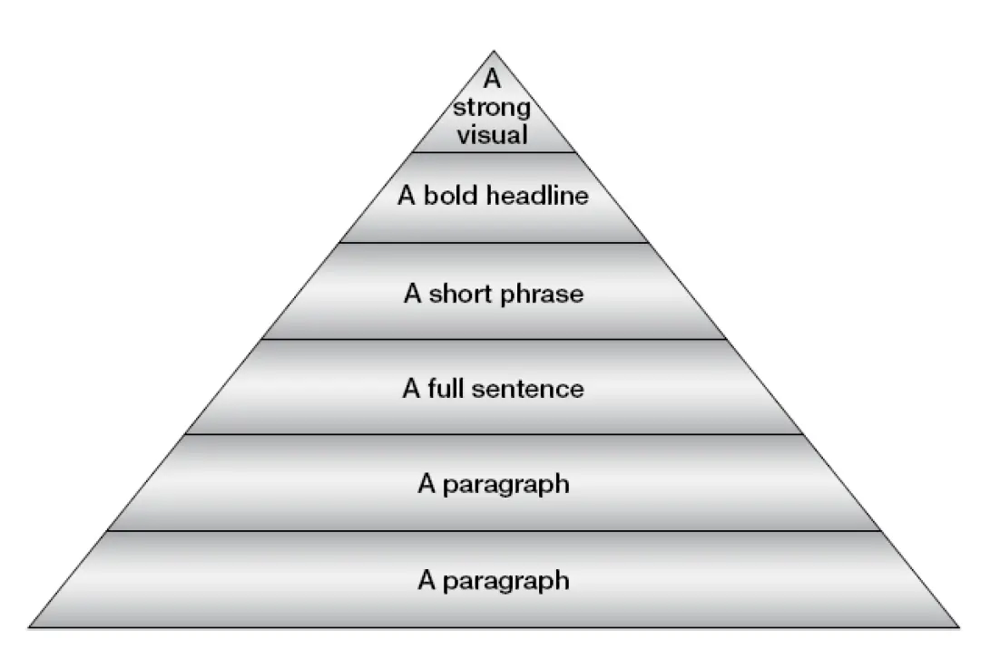

## Introduction

Faire des présentations devant une audience a toujours été un exercice difficile et cela le sera encore plus dans notre future carrière. Il sera plus que jamais important de savoir bien préparer et bien présenter une présentation devant des supérieurs ou devant des clients. Ce MON présentera des éléments pour mieux aborder cet exercice et répondra à la problématique suivante: **Comment faire des présentation impactantes ?**

## Sommaire

1. Comment se préparer avant une présentation
2. Comment utiliser PowerPoint pour accrocher le public
3. Comment utiliser d'autres outils que PowerPoint pour accrocher le public

## Comment se préparer avant une présentation

La préparation avant un présentation est tout aussi important que le fond. Il ne faut surtout pas négliger cette phase, et y aller les mains dans les poches. Il faut avoir une attitude positive face à cette préparation et ne pas voir cette phase comme une corvée. Se mettre dans cet état d'esprit permet bien démarrer cette phase.

### La technique des "Six Helpers"

Cette technique permet de se poser les bonnes questions avant une présentation. Elle consiste à se poser 6 questions (*5 W's and 1 H*): Who? What? Why? Where? When? How?.

- **Who**: Qui est l’audience? Connaître son besoin, ses attentes, ce qu’elle aime et n’aime pas. Cela peut aider à structurer la présentation de manière effective. Un changement du profil de l’audience nécessite un changement de la structuration de la présentation.
- **What** : Que voulons-nous présenter ? Idéalement, une liste de points à aborder est explorée par l’audience et le présentant. Il faut avoir une vision claire de quoi présenter. Dans le cas où les attentes de l’audience ne sont pas formalisées, une étude du profil de l’audience peut suffire.
- **Why** : Pourquoi voulons-nous faire la présentation ? Il faut se poser la question de l’objectif de la présentation : est-ce que le but est d’éduquer ? d’informer ? de convaincre ? d’entraîner etc… Un changement de l’objectif nécessite un changement de la structure. Par exemple, dans l’objectif de convaincre, l’accent sera mis sur des arguments prônant l’intérêt de l’objet alors que dans l’objectif d’entraîner et d’éduquer, l’accent sera mis sur la participation et l’interaction.
- **Where** : Où voulons-nous faire la présentation ? L’endroit de la présentation est important : il faut se poser la question du matériel disponible et de l’éclairage. Il faut arriver en avance pour faire du repérage, tester les slides, et regarder si on voit tout depuis le fond de la salle. D’après l’auteur, la meilleure configuration est la configuration en U, pour pouvoir regarder chaque personne une à une.
- **When** : Quand voulons-nous faire la présentation ? Il faut vérifier la véracité des informations dans le contexte du marché actuel. Il faut se demander si l’analyse proposée est correcte au moment de la présentation. De plus, le moment de la présentation peut influer l’attention de l’audience. Par exemple, le vendredi soir précédent des vacances, il n’est pas approprié de faire une présentation longue et complexe sur une analyse de marché.
- **How** : Comment voulons-nous faire la présentation ? Quels mots utiliser, éviter, ou quelles slides inclure ou pas ? La présentation sera technique ou pas ? formelle ou pas ? Quelles stratégies pour captiver l’audience ?

### Analyse de l'audience

**L'analyse de l'audience est également cruciale**, car cela va permettre de mieux comprendre ses besoins et donc d'adapter le discours proposé. Il existe deux types d'audience: celle familière et celle non familière. Dans le premier cas, il est facile de trouver les besoins de l'audience. Dans l'autre cas, c'est plus difficile: est-ce que l'audience a le sens de l'humour? Est-ce qu'elle est plutôt conservatrice ou plutôt enclin à l'innovation? Pour répondre à toutes ces questions, il est important de parler avec des gens de l'audience en amont, pour percevoir leur profil. Il peut être intéressant de trouver les noms des personnes de l’audience pour demander à l’entreprise leur poste et leur place dans la hiérarchie. Ne pas hésiter à demander directement aux personnes leurs besoins. Se renseigner sur l’entreprise est aussi capital.

Il faut aussi **évaluer le niveau d'intérêt et le niveau de connaissance de l’audience sur le sujet présenté**. Selon le niveau de connaissance de l’audience, il faudra adapter le vocabulaire utilisé. Si l’audience est mixte, c’est-à-dire qu’elle est composée de différents niveaux de connaissance et différents domaines d’expertise, il faut adapter le discours et identifier les points communs entre ces domaines. Reconnaître les sujets d’intérêt de chaque personne de l’audience aide à cadrer la présentation et à garder leur attention. Il peut être intéressant de créer des persona des membres de l'audience pour mieux les cerner. De plus, dans le cas d’un groupe mixte, ce n’est pas grave de ne pas avoir l'attention de tout le monde en même temps. Dans le cas où l'on aurait besoin de l'attention d’un groupe de personne en particulier, il faut le verbaliser (particulièrement si son attention a été perdue juste avant car le présentant parlait de quelque chose moins intéressant pour ce groupe) Exemple : « Messieurs les managers, la stratégie que je m’apprête à vous présenter est l'une de celle que vous voudrez présenter à vos équipes » ou bien « Stéphanie, cette partie devrait vous intéresser puisqu'elle inclut des personnes de votre service »

Il peut être intéressant **d’anticiper les questions de l’auditoire**, et de bien les préparer. La partie questions réponse est très importante. En effet, une excellente présentation peut laisser une mauvaise impression si la partie finale de questions réponses s’est mal passée, puisque c’est la dernière impression laissée.

Enfin avant même de structurer la présentation, il faut **collecter des informations sur le sujet présenté** en parlant à différentes personnes de l’entreprise, en allant sur Internet ou en lisant différents rapports (internes à l’entreprise par exemple). En effet, il est possible que l’audience ait plus de connaissances que le présentant, donc ce dernier doit palier à cela avant même de commencer à structurer la présentation.

### Structure de la présentation

Pour structurer la présentation, une des techniques possibles est la suivante : écrire les idées de la présentation sur des bouts de papier et les étaler sur une table. Après les avoir toute lus, essayer de faire des liens entre chacune et structurer la présentation.

Une présentation a 3 parties : le début/l’ouverture, le milieu et la fin/la fermeture. La partie la plus cruciale est l’ouverture. Elle permet d’introduire le sujet, le rythme et permet de capturer l’attention de l’audience. La deuxième partie critique est la fin. C’est la dernière impression de la présentation, donc c’est celle que l’audience va retenir. Bien évidemment, le milieu de la présentation ne doit pas pour autant être négligé. L’idée centrale y est présentée, sa structure et sa logique doivent être claires et précises.


Pour une présentation de 30 minutes, le découpage suivant est suggéré: 2 à 2.5min pour le début, 21 à 22 minutes pour le milieu et 1 à 2 min pour la fin.


#### L'ouverture

Pour capturer l’attention de l’audience lors de l’ouverture, plusieurs techniques sont possibles :

- **L’anecdote** : raconter une anecdote en rapport avec le sujet est un très bon moyen d’attirer l’attention de l’auditoire. Il est possible de décrire très précisément l’anecdote pour que l’audience puisse se projeter dans celle-ci.
- **L’humour** : utiliser l’humour pour ouvrir la présentation peut s’avérer très efficace, mais c’est aussi très risqué. Si l’humour utilisé n’est pas apprécié par l’auditoire, cela peut rompre la connexion entre le présentant et l’audience. Il faut bien cerner l’auditoire pour savoir s’il faut utiliser l’humour ou non. En cas de doute, mieux vaut opter pour une technique d’ouverture plus classique.
- **Faits et chiffres** : cette technique consiste à énoncer des faits ou des chiffres solides. Cela ajoute du sérieux et de la précision, et peut permettre à certains profils d’accrocher au discours dès le début.
- **Citations** : Une citation en rapport avec le sujet, claire et concise peut être un bon choix pour amorcer la présentation.
- **Questions** : l’utilisation des questions pour capturer l’attention de l’auditoire est puissant. Cela incite le public à participer et donc à faire de l’écoute active. Ces questions peuvent être rhétoriques.

#### La fin de la présentation

Cette partie est presque aussi importante que le début. Plusieurs techniques sont possibles:

- **Retour à l’objectif fixé au début de la présentation** : cela permet de faire une boucle, et de rappeler la raison de cette présentation.
- **Le challenge** : procédé surtout utilisé par les chefs d’équipe. Le challenge permet de mobiliser et motiver les troupes suite aux mesures proposées lors de la présentation.
- **Récapitulatif des points principaux** : il est possible que la présentation ait perdu certaines personnes de l’audience. Ainsi, cette technique permet de rafraîchir la mémoire de ces personnes.

## Comment utiliser PowerPoint pour accrocher le public

Maintenant que la présentation a été bien préparée en amont, nous allons présenter plusieurs points à respecter pour avoir les meilleures slides pour accompagner le discours.

### Utilisation du texte sur les slides

Il existe deux types d’informations dans une présentation : visuelle et verbale. La plupart des gens sont « visuels », c’est-à-dire que s’ils entendent et voient des informations en même temps, ils auront tendance à se concentrer sur l’information visuelle. Ce qui veut dire que s’il y a trop de texte sur les diapositives, alors ils vont tout lire et arrêter d’écouter. Ainsi, il est préférable **d’utiliser le moins de texte possible** : le texte doit être donné par la voix et non par les slides. Les seuls textes qui doivent apparaître sur les slides sont des **mots-clés** ou des **phrases-clés**, et ils doivent apparaître au bon moment, c’est-à-dire au moment où ils sont énoncés. Si on utilise des bullets points, il est préférable de les faire apparaître individuellement.

**Il ne faut pas surcharger les slides de texte**. Cela a plusieurs risques:

- L'audience risque de décrocher car elle verra simplement quelqu'un lire un texte affiché.
- Le temps imparti risque d'être dépassé.
- L'audience aura un sentiment de redondance, car on dit ce qui est déjà affiché.

Pour cela, il faut respecter la **règle du 6x6**: chaque slide doit contenir au maximum 6 idées avec au maximum 6 mots par idée.
Il est crucial de garder la même police durant toute la présentation, ou du moins une utilisation logique des différentes polices. De plus, il faut utiliser des polices classiques et pas trop fantaisistes.
Dans la même veine, il faut utiliser des couleurs, mais sans en abuser. Elles doivent être utilisées pour souligner des informations importantes. Ces couleurs, tout comme les polices, ne doivent pas être trop "flashy", ni trop sophistiquées.

### Utilisation des images et des graphiques

Il existe plusieurs niveau d'importance dans une slide. Le schéma suivant montre au sommet de la pyramide les éléments les plus importants, et ceux les moins important se trouvent à la base de la pyramide:

KRUGER, Douglas. *How to make your point without PowerPoint*, 2016, P.125

D'après cette modélisation, la meilleure slide contient **seulement des visuels forts et impactants**. La pire slide contient plusieurs longs paragraphes. Autrement dit, il est préférable de mettre dans des slides des images fortes et impactantes et de s'y appuyer pour développer l'explication à l'oral. Un mauvais orateur va mettre ses notes sur les slides et les lire devant l'auditoire. Il est possible de combiner plusieurs éléments de la pyramide, par exemple en faisant une slide avec un visuel impactant accompagné d'un titre en gras et d'une phrase courte qui explique les grandes lignes de l'idée.

En cas de présence de graphique, il faut s'assurer qu’ils sont **suffisamment simples** pour que chaque personne de l’audience puisse les comprendre, et puisse lire toutes les informations du graphe (même ceux situés au fond). Privilégier les graphiques en barre, car ils sont plus simples à lire et ne pose pas de problèmes de lecture pour ceux au fond. De plus, en cas d'utilisation de courbes, il faut faire attention à ce que les points de ces courbes soient suffisamment gros. Enfin, il peut être intéressant d'inclure les valeurs clés dans ces graphes, afin de les expliquer à l'oral.

### Utilisation des animations

Il est fortement déconseillé d'utiliser des animations trop compliquées. Cela peut distraire l'audience et aura tendance à les perdre. Les seules animations à inclure sont celles du type "apparaître" et "disparaître". Ces animations permettent de faire apparaître les informations au bon moment, c'est-à-dire lorsqu'elles sont énoncées à l'oral.

## Comment utiliser d'autres outils que PowerPoint pour accrocher le public

PowerPoint n'est pas la seule manière de transmettre la pensée du présentant. Il peut être intéressant d'utiliser d'autres éléments pour faire une bonne présentation.

Il est possible d'utiliser **des extraits vidéos**, mais pas trop longues (3 à 5 minutes) pour ne pas perdre l'audience. On peut aussi utiliser des musiques ou des extraits audio ; cela aide à rythmer la présentation.

Comme évoqué au début de ce MON, il est également possible de solliciter l'audience en lui demandant de participer, par exemple en lui proposant un quizz ou un questionnaire. Cela s'avère très efficace pour garder l'attention du public.

Une autre idée serait d'utiliser un accessoire. Cela peut être un objet qui serait introduit pendant le speech par exemple. Cet accessoire doit être gardé à portée de main pour pouvoir le sortir au moment opportun. Cet accessoire peut aussi être interactif, afin d'inclure le public.

## Bibliographie

- KAUL, Asha. *The Effective Presentation: talk your way to success*, Inde: SAGE Publications India Pvt Ltd, 2005
- DIONNE, Jean-Philippe. *Presentation Skills for Scientists and Engineers*, Suisse: Springer Nature, 2021
- NUSSBAUMER KNAFLIC, Cole. *storytelling with you: plan, create, and deliver a stellar presentation*, États-Unis: John Wiley & Sons Inc., 2023
- KRUGER, Douglas. *How to make your point without PowerPoint: 50 ways to present effectively*, Afrique du Sud: Penguin Books, 2015
