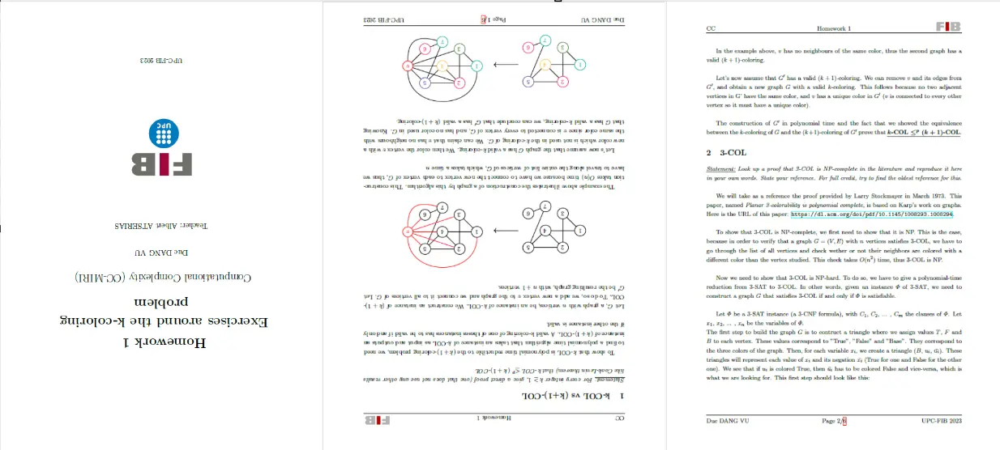
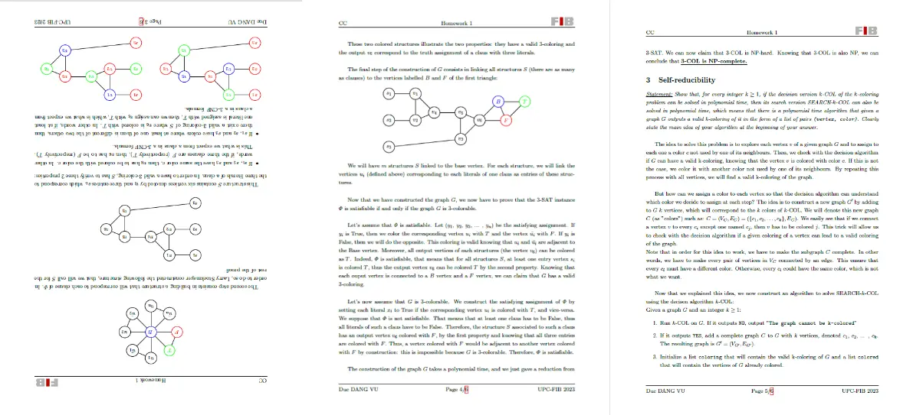
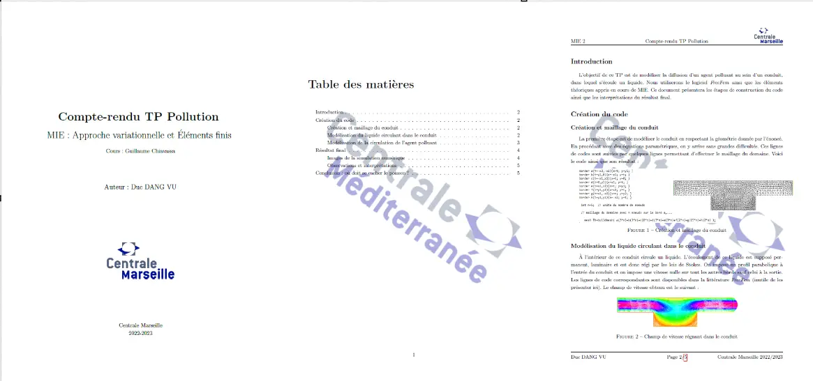
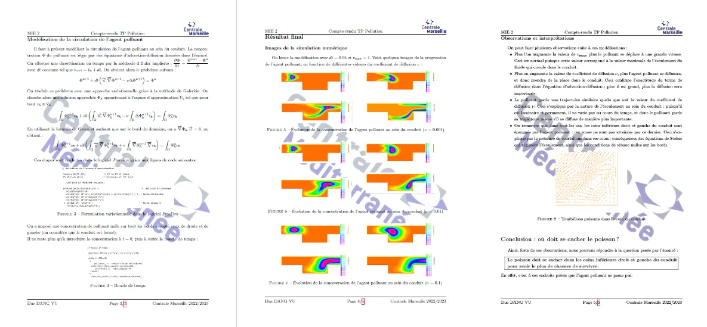
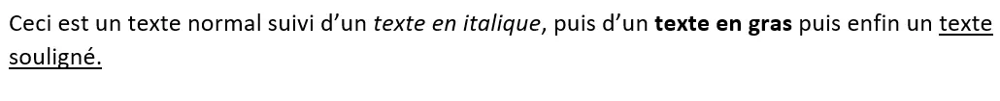
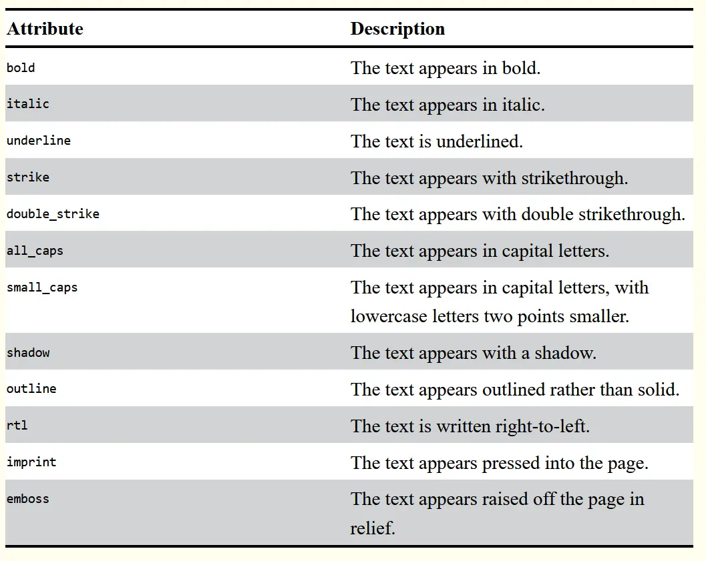


Connaissance basique de la programmation objet avec Python.



Tout les codes présentés sont disponibles dans mon [dossier GitHub de temps 3.1](https://github.com/FrancoisBrucker/do-it/tree/main/src/promos/2023-2024/Dang-Vu-Duc/mon/temps-3.1)


## Introduction

Les formats PDF et Word sont des formats très utilisés. Il peut être intéressant de pouvoir automatiser certaines tâches concernant ces formats, ou bien récupérer les données de ces documents dans des programmes Python. En effet, ces documents ont des encodages plus complexes qu'un simple fichier *.txt*, ce qui les rend difficile à manipuler sans bibliothèques adéquates. Ce MON présentera comment utiliser les bibliothèques **PyPDF2** et **Python-Docx** pour pouvoir manipuler de tels documents.

Dans la suite, quelques lignes de code en Python seront présentées. Le résultat de l’exécution des lignes de code est indiqué juste après celles-ci, après 3 chevrons `>>>`

Il faut commencer par installer ces bibliothèques, avec les commandes `pip install PyPDF2==1.26.0` et `pip install python-docx==0.8.10`.

## Utilisation de PyPDF2

### Présentation des éléments de base du module

Nous allons commencer par présenter les éléments de base de cette bibliothèque. La première classe à connaître est la classe **PdfFileReader**. Les objets de cette classe permettent d'intégrer dans le code Python un document PDF. Ces objets ont différents attributs, correspondants à différentes caractéristiques du document en question. Elles ont également plusieurs méthodes pour effectuer des opérations sur le document.

Dans la suite de cette section, nous nous appuierons sur deux documents PDF, enregistrés sous les noms de *PDF test 1.pdf* et *PDF test 2.pdf*. Ces documents sont des travaux que j'ai effectué lors de ma deuxième année.

Pour ouvrir les documents PDF et les associer à des objets de la classe **PdfFileReader**, il faut d'abord les ouvrir avec la fonction *open*, en précisant en argument le paramètre *rb*, qui permet de lire en binaire le fichier. Ensuite, on créé l'objet en appellant la classe **PdfFileReader** du module **PyPDF2**.
Une fois que l'on a cet objet, on peut récupérer ses attributs et utiliser les méthodes associées.

```python
pdfFile = open('PDF test 2.pdf', 'rb')
pdfReader = PyPDF2.PdfFileReader(pdfFile)
print(pdfReader.numPages)
>>> 6
```

Dans l'exemple ci-dessus, on ouvre le fichier test numéro 2 et on récupère son nombre de pages.

L'autre classe à connaître est la classe **PageObject**. Les objets de cette classe représentent les différentes pages du document, ainsi que leurs contenu. On récupère ces objets à partir d'un objet de la classe **PdfFileReader** grâce à la méthode *getPage*. En spécifiant le numéro de page que l'on veut récupérer (indexation commençant à 0), on peut récupérer un objet de la classe **PageObject**. Encore une fois, ces objets ont différents attributs et méthodes pour les manipuler, telle que par exemple la méthode *extractText()* qui permet d'extraire du texte de la page. Notons également la méthode *rotateClockwise*, qui prend en argument un des entiers 90, 180 ou 270, et qui permet d'effectuer une rotation de la page.

```python
page = pdfReader.getPage(2)
print(page.extractText())
>>> Compte-renduTPPollution
MIE:Approchevariationnelleet

Elements
Cours:GuillaumeChiavassa
Auteur:DucDANGVU
CentraleMarseille
2022-2023
```

Notons que le texte renvoyé est loin d'être parfait. On remarque que certains élément manquent à l'appel. Cependant, ce texte est globalement conforme à ce qui est présent réellement dans le PDF.

Enfin, la dernière classe importante de ce module est la classe **PdfFileWriter**. Les objets de cette classe permettent de créer des nouveaux fichiers PDF, à partir des classes précédemment présentées. Les méthodes importantes de cette classe sont les suivantes:

- La méthode *addPage*, qui permet d'ajouter une page au nouveau fichier PDF en spécifiant en argument un objet de la classe **PageObject**
- La méthode *write*, qui prend en argument un fichier écrit en binaire et qui permet de sauvegarder sous format PDF le document associé à l'objet.
- La méthode *encrypt* permet de protéger le fichier PDF par un mot de passe, renseigné en argument de la méthode.

### Utilisation de ces éléments

Pour appliquer ces connaissances, nous allons à présent créer une classe **PDF_Tools**. Les objets de cette classe pourront effectuer des opérations sur des fichiers PDF grâce à des méthodes qui utiliseront les éléments présentés ci-dessus.

#### Création de la méthode pour combiner des PDF

Cette méthode permettra de combiner plusieurs documents PDF, c'est-à-dire mettre les pages les une à la suite des autres. Elle prend en argument une liste contenant les noms des PDF à combiner ainsi que le nom du nouveau fichier PDF créé. Pour cela, on doit utiliser un objet de la classe **PdfFileWriter**, qui va permettre de construire le nouveau fichier PDF. On ajoute ensuite les pages (qui sont en fait des objets de la classe **PageObject**) une par une grâce à la méthode *addPage*, puis on sauvegarde le nouveau fichier grâce à la méthode *write*.



```python
class PDF_Tools():
  def combine_pdf(self, list_pdf: list, name_merged_file: str):
    pdf_writer = PyPDF2.PdfFileWriter()
    list_pdf_objects = []
    for pdf_name in list_pdf:
      pdf_file = open(pdf_name, 'rb')
      list_pdf_objects.append(PyPDF2.PdfFileReader(pdf_file))
    for pdf_object in list_pdf_objects:
      for page_num in range(pdf_object.numPages):
        page_object = pdf_object.getPage(page_num)
        pdf_writer.addPage(page_object)
    new_pdf = open(name_merged_file, 'wb')
    pdf_writer.write(new_pdf)
    new_pdf.close()
```



#### Création de la méthode pour effectuer des rotations sur des pages

Cette méthode prend en argument le nom du fichier PDF à modifier, ainsi qu'une liste contenant les numéros de page sur lesquelles effectuer des rotations. Enfin, le dernier argument spécifie quelle rotation effectuer (90, 180 ou 270). Il suffit d'utiliser la méthode *rotateClockwise* de la classe **PageObject**, et de l'utiliser dans la boucle qui ajoute les pages une par une dans le nouveau fichier.



```python
def rotate_pages(self, pdf_name: str, list_num_pages: list, rotation: int, name_new_file: str):
      pdf_file = open(pdf_name, 'rb')
      pdf_reader = PyPDF2.PdfFileReader(pdf_file)
      pdf_writer = PyPDF2.PdfFileWriter()
      for num_page in range(pdf_reader.numPages):
        page_object = pdf_reader.getPage(num_page)
        if num_page in list_num_pages:
          page_object.rotateClockwise(rotation)
        pdf_writer.addPage(page_object)
      new_pdf = open(name_new_file, 'wb')
      pdf_writer.write(new_pdf)
      new_pdf.close()
```



Voici un exemple de l'utilisation de ce code. Si on crée un objet de la classe PDF_Tools (`test = PDF_Tools()`) et que l'on rentre la ligne de code `test.rotate_pages("PDF test 1.pdf", [0,1,3], 180, "Nouveau PDF.pdf")`, on obtient le fichier PDF suivant:





Seules les pages numéro 1, 2 et 4 (indexées 0, 1 et 3) ont été tournées, ce qui est bien ce qu'on voulait.

#### Création de la méthode pour superposer des pages

Cette méthode prend argument un nom de fichier à modifier et un autre nom de fichier contenant l'image à superposer. Un autre paramètre est une liste contenant les numéros des pages que l'on veut modifier. On utilise la méthode *mergePage* de la classe *PageObject*, qui prend en argument un autre objet de la classe *PageObject* et qui superpose les deux pages.



```python
def overlay_pages(self, pdf_name: str, pdf_name_overlay: str, list_num_pages: list, name_new_file: str):
  pdf_file = open(pdf_name, 'rb')
  pdf_reader = PyPDF2.PdfFileReader(pdf_file)
  pdf_writer = PyPDF2.PdfFileWriter()
  for num_page in range(pdf_reader.numPages):
    if num_page not in list_num_pages:
      page_object = pdf_reader.getPage(num_page)
      pdf_writer.addPage(page_object)
    else:
      pdf_file_overlay = open(pdf_name_overlay, 'rb')
      pdf_reader_overlay = PyPDF2.PdfFileReader(pdf_file_overlay)
      page_overlay = pdf_reader_overlay.getPage(0)
      page_object = pdf_reader.getPage(num_page)
      page_overlay.mergePage(page_object)
      pdf_writer.addPage(page_overlay)
  new_pdf = open(name_new_file, 'wb')
  pdf_writer.write(new_pdf)
  new_pdf.close()
```



Pour tester cette fonction, on rentre la commande suivante: `test.overlay_pages("PDF test 2.pdf", "Logo Centrale.pdf", [1, 2, 3, 4, 5], "Nouveau PDF3.pdf")`, et le fichier suivant est produit:





Le logo a bien été placé sur les pages qu'il fallait.

#### Création de la méthode pour protéger un PDF par un mot de passe

Cette méthode permet de crypter un fichier pdf avec un mot de passe, renseigné en argument de la méthode. Cette dernière utilise la méthode *encrypt* de la classe **PdfFileWriter**.



```python
def encrypt(self, pdf_name: str, password: str, name_encrypted_file):
    pdf_file = open(pdf_name, 'rb')
    pdf_reader = PyPDF2.PdfFileReader(pdf_file)
    pdf_writer = PyPDF2.PdfFileWriter()
    for page_num in range(pdf_reader.numPages):
      page_object = pdf_reader.getPage(page_num)
      pdf_writer.addPage(page_object)
    pdf_writer.encrypt(password)
    new_pdf = open(name_encrypted_file, 'wb')
    pdf_writer.write(new_pdf)
    new_pdf.close()
```



#### Création de la méthode pour réarranger les pages d'un PDF

Cette dernière méthode prend en argument le nom du fichier à modifier ainsi qu'une liste contenant le nouvel ordre des pages.



```python
def reorder(self, pdf_name: str, list_new_order: list, name_reordered_file: str):
    pdf_file = open(pdf_name, 'rb')
    pdf_reader = PyPDF2.PdfFileReader(pdf_file)
    pdf_writer = PyPDF2.PdfFileWriter()
    for num_page in list_new_order:
      page_object = pdf_reader.getPage(num_page)
      pdf_writer.addPage(page_object)
    new_pdf = open(name_reordered_file, 'wb')
    pdf_writer.write(new_pdf)
    new_pdf.close()
```



## Utilisation de python-docx

Nous allons à présent explorer les possibilités qu'offre le module Python-docx. Pour charger un fichier Word avec ce module, il faut utiliser la commande: `doc = docx.Document("Word test 1.docx")`. On pourra ensuite manipuler cet objet et utiliser ses attributs.

Le texte d'un document Word est décomposé en paragraphes, qui se terminent à un retour à la ligne. Dans ces paragraphes, on y trouve des objets de la classe **Runs** qui correspondent à du texte de la même police. Par exemple, dans le texte suivant:



on y trouve 6 objets de la classe **Runs**. Chacun de ces objets ont des attributs que l'ont peut modifier. En voici une liste:


*Source: [Automate the boring stuff with Python](https://automatetheboringstuff.com/2e/chapter15/)*

On peut changer chacun de ces attributs en True ou False.

L'attribut *paragraphs* de la classe **Document** permet de récupérer une liste de tout les paragraphes du documents. Chaque objet de la classe **Paragraphs** a un attribut *runs*, qui est une liste d'objets de la classe **Runs**.

Une autre chose utile à faire est changer le style d'un paragraphe. Pour cela, on doit changer l'attribut *style* d'un objet *paragraph* et l'assigner à un nom de style. Le style de base se nomme "Normal", mais il est possible d'en créer un autre directement depuis le logiciel Word, avec le raccourci Ctrl + Maj + S.

En connaissant tout ces éléments, on peut changer facilement le contenu d'un document Word, ainsi que ses attributs de base tels que le soulignage, l'italique etc...
