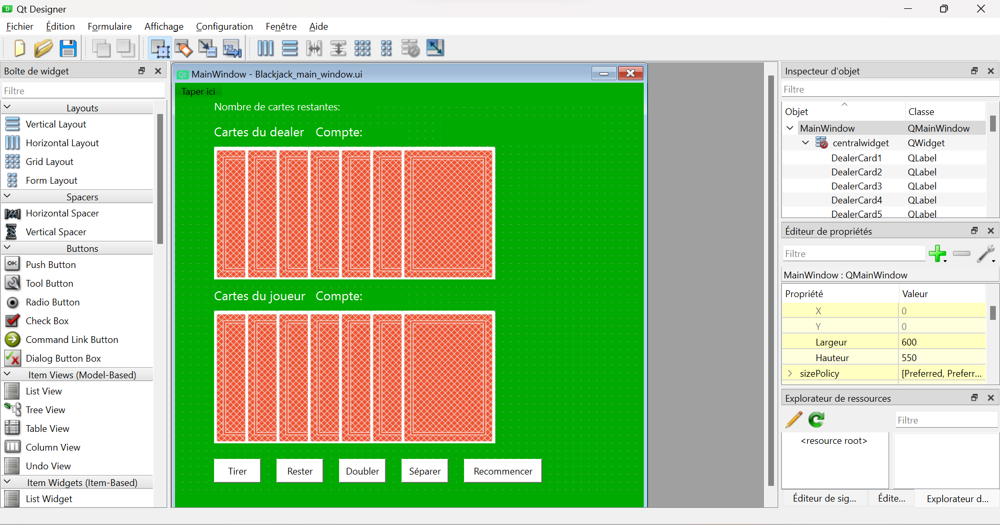
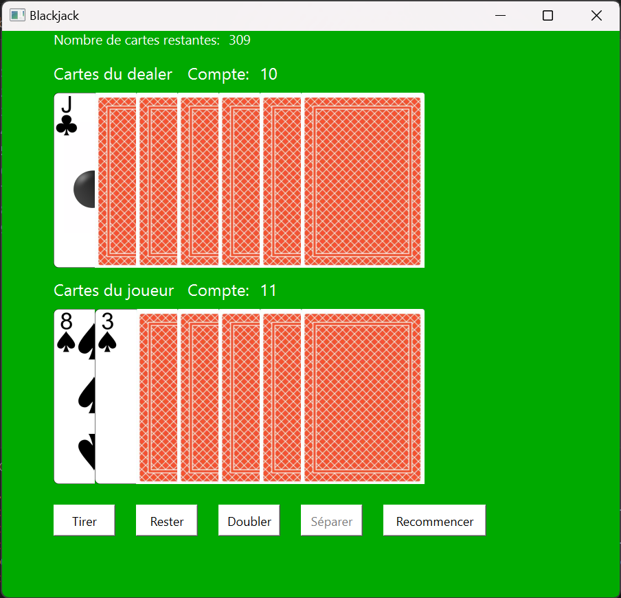
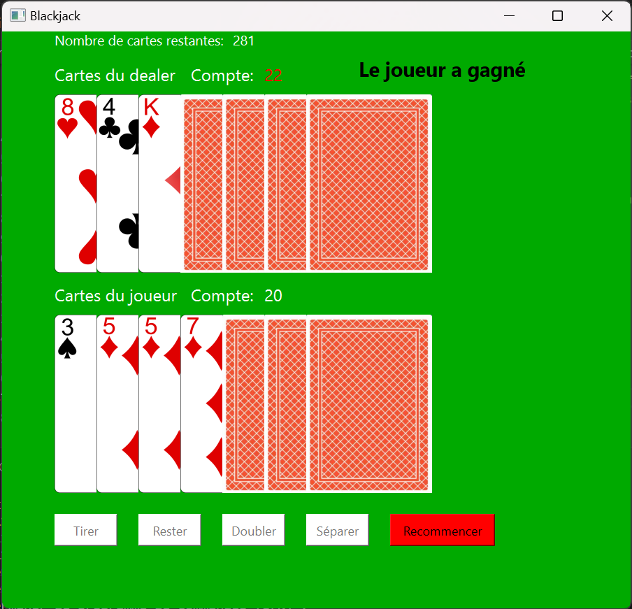
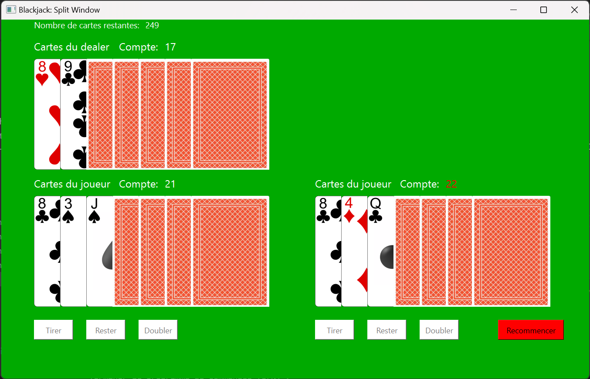


Connaissance basique de Qt pour Python (cf mon [MON1 du temps 1](../../mon/temps-1.1))



Tout les codes présentés ci-dessous sont disponibles dans le dossier Github de Do-It: [Codes du POK](https://github.com/FrancoisBrucker/do-it/tree/main/src/promos/2023-2024/Dang-Vu-Duc/pok/temps-1)


## Introduction

Le Blackjack est l'un des jeux de carte les plus connus et joués dans les casinos. C'est un jeu qui oppose les joueurs au casino (dénommé aussi le dealer, puisqu'il distribue les cartes). Le Blackjack étant un jeu de carte de casino, on peut se douter que ce jeu est naturellement à l'avantage du casino. Il serait ainsi intéressant de se demander à quel point le joueur est perdant dans ce jeu, sachant qu'il utilise une stratégie connue pour être optimale. En d'autres termes, **quelle est l'espérance de gain d'un joueur qui joue au Blackjack?** D'autres statistiques seront également calculées, comme par exemple la meilleure carte que le dealer peut avoir ou bien encore l'influence du *comptage de cartes*.

L'objectif sera également de recréer un jeu de Blackjack, en utilisant le module *Qt for Python*, que j'ai appris à maîtriser lors de mon premier MON du temps 1. C'est d'ailleurs par cela que ce POK va commencer.

## Brève explication des règles du Blackjack

Il faut tout d'abord commencer par expliquer rapidement les (simples) règles du Blackjack. Ce jeu oppose les joueurs à la *maison* (autrement dit le casino, ou bien le dealer). Lors de chaque tour, le dealer distribue 2 cartes faces ouvertes à chaque joueur et une carte face ouverte à lui-même. Le but pour chaque joueur est de se rapprocher le plus possible de 21 points, sans dépasser cette limite. Chaque carte vaut sa valeur (le 2 vaut 2 points, le 5 vaut 5 points etc...), les têtes (valet, dame et roi) valent 10 points et l'As vaut 1 ou 11 points. Le joueur peut décider parmi plusieurs actions lors de son tour:

- Tirer une nouvelle carte et l'ajouter à son compte (action de *tirer*),
- Garder son compte actuel et terminer son tour (action de *rester*),
- Si le joueur a deux cartes, il peut *doubler*: dans ce cas, il double sa mise et pioche une unique carte, puis termine son tour,
- Si le joueur a deux cartes de même valeur, il peut les *séparer*: dans ce cas, il joue avec deux mains, chacune contenant une carte initialement en double. Sa mise initiale est donc misée également sur la deuxième main.
  
Une fois que le joueur a terminé son tour, le dealer joue. Il joue toujours de la même manière: il pioche tant qu'il a un compte inférieur ou égal à 16, puis il reste s'il a un compte supérieur ou égal à 17. Si le joueur a dépassé 21 (on dit qu'il a *bust*), il perd; même si le dealer bust après lui, et perd sa mise. Si le joueur a un compte supérieur à celui du dealer, ou que le dealer bust sans que le joueur ne bust, alors le joueur gagne et il reçoit deux fois sa mise.

## Implémentation d'un jeu de Blackjack avec Qt sur Python

La première étape de ce POK est de recréer ce jeu sur Python grâce au module Qt. Toutes les méthodes et classes utilisées dans le code sont expliquées dans mon [MON 1.1](../../mon/temps-1.1).

J'ai utilisé l'outil Qt Designer pour designer l'aspect de l'interface utilisateur. J'ai opté pour un simple fond vert, pour représenter le tapis de jeu, ainsi que 7 images de dos de carte pour le joueur et le dealer. Au-dessus de ces cartes, on voit le compte des points et en-dessous, il y a les boutons correspondant aux actions que le joueur peut effectuer à chaque tour. Il faut bien s'assurer de renommer chaque objet avec un nom logique, pour pouvoir s'y retrouver dans le code. Voici à quoi ressemble la fenêtre sur Qt Designer:



Cette fenêtre est enregistrée sous le nom de *main_window*. On crée une autre fenêtre que l'on nomme *split_window*. En effet, il faut une autre disposition des éléments dans le cas où le joueur décide de séparer ses cartes. Voici à quoi ressemble cette fenêtre sur Qt Designer:


## Création du code Python pour implémenter le jeu

Maintenant qu'on a les deux fichiers .ui de chaque fenêtre, on commence à implémenter le jeu. Pour organiser correctement le code et le rendre plus lisible, on crée trois fichiers .py:

- Un fichier *blackjack_methods.py* qui va contenir la classe **Blackjack_methods** contenant les méthodes relatives à la manipulation du deck de cartes et des mains (création du deck, calcul du compte des mains),
- Un fichier *UI_blackjack.py* qui va contenir la classe **Blackjack** contenant les méthodes relatives à la création de l'interface graphique,
- Un fichier *main.py* qui va contenir les instructions pour exécuter le code.
  
### La classe Blackjack_methods

Comme explicité ci-dessus, cette classe contient les méthodes pour manipuler le deck. La méthode *newdeck* permet de créer le sabot pour le Blackjack. Ce sabot est composé de 6 jeux de 52 cartes. Ce sabot (dénommé *deck* dans le code) est une liste d'objet de la classe **Card**. Ces objets ont comme attribut un nom (par exemple 2_of_clubs pour le 2 de trèfle ou 11_of_hearts pour le valet de coeur) et sa valeur (1 pour as, 11 pour valet, 12 pour dame et 13 pour roi). Cette classe a également une méthode appelée *sum_hand*, qui prend en argument une liste et qui renvoie sa somme. Cette méthode prend en compte que l'As (donc la valeur 1) vaut soit 1 soit 11. Ainsi, si la main est `[1, 4]`, la méthode renvoie 15, mais si la main est `[1, 5, 7]`, la méthode renvoie 13. Voici l'implémentation de cette classe:



```python
class Blackjack_methods():
    def __init__(self):
        self.newdeck()
    
    def newdeck(self):
        suits = ["diamonds", "clubs" ,"hearts", "spades"]
        values = range(1,14)
        initial_deck = []
        for suit in suits:
            for value in values:
                if value < 10:
                    initial_deck.append(Card(f"{value}_of_{suit}", value))
                if value >= 10:
                    initial_deck.append(Card(f"{value}_of_{suit}", 10))

        self.deck = initial_deck * 6
    
    def sum_hand(self, hand):
        if 1 in (card.value for card in hand):
            sum1 = sum([card.value for card in hand]) + 10
            if sum1 > 21:
                return(sum([card.value for card in hand]))
            else:
                return(sum1)
        else:
            return(sum([card.value for card in hand]))

class Card():
    def __init__(self, name, value):
        self.value = value
        self.name = name
```



### La classe Blackjack

#### L'initialisation

Cette classe hérite des classes **QMainWindow** et **Blackjack_methods**, dans l'optique de réaliser l'interface graphique du jeu. Dans l'initialisation de cette classe, on retrouve les éléments suivants:

- La création des fenêtres *main_window* et *split_window* avec l'aide des fichiers .ui précédemment créés. On utilise la méthode *load* de la classe **QUiLoader**.
- La création des attributs associés à chaque objet des fichiers .ui (les labels, les boutons etc...). On utilise la méthode *findChild* de la classe **QWidget**
- L'association des méthodes correspondantes à chaque bouton de l'interface grâce à la méthode *clicked.connect* de la classe **QPushButton** (par exemple, la méthode *restart* pour le bouton *restartButton*)

Voilà l'implémentation de cette initialisation:



```python
class Blackjack(QMainWindow, Blackjack_methods):
    def __init__(self):
        super().__init__()

        ui_file_name = "Blackjack_main_window.ui"
        ui_file = QFile(ui_file_name)
        loader = QUiLoader()
        self.main_window = loader.load(ui_file)
        ui_file.close()
        self.main_window.setWindowTitle("Blackjack")
        
        self.label_dealercard1 = self.main_window.findChild(QLabel, "DealerCard1")
        self.label_dealercard2 = self.main_window.findChild(QLabel, "DealerCard2")
        self.label_dealercard3 = self.main_window.findChild(QLabel, "DealerCard3")
        self.label_dealercard4 = self.main_window.findChild(QLabel, "DealerCard4")
        self.label_dealercard5 = self.main_window.findChild(QLabel, "DealerCard5")
        self.label_dealercard6 = self.main_window.findChild(QLabel, "DealerCard6")
        self.label_dealercard7 = self.main_window.findChild(QLabel, "DealerCard7")
        self.label_playercard1 = self.main_window.findChild(QLabel, "PlayerCard1")
        self.label_playercard2 = self.main_window.findChild(QLabel, "PlayerCard2")
        self.label_playercard3 = self.main_window.findChild(QLabel, "PlayerCard3")
        self.label_playercard4 = self.main_window.findChild(QLabel, "PlayerCard4")
        self.label_playercard5 = self.main_window.findChild(QLabel, "PlayerCard5")
        self.label_playercard6 = self.main_window.findChild(QLabel, "PlayerCard6")
        self.label_playercard7 = self.main_window.findChild(QLabel, "PlayerCard7")

        self.label_dealerheader = self.main_window.findChild(QLabel, "labelDealerCards")
        self.label_playerheader = self.main_window.findChild(QLabel, "labelPlayerCards")
        self.label_dealercount = self.main_window.findChild(QLabel, "labelDealerCount")
        self.label_playercount = self.main_window.findChild(QLabel, "labelPlayerCount")
        self.PlayerCount = self.main_window.findChild(QLabel, "PlayerCount")
        self.DealerCount = self.main_window.findChild(QLabel, "DealerCount")
        self.result = self.main_window.findChild(QLabel, "label_result")
        self.label_cards = self.main_window.findChild(QLabel, "label_cards")
        self.cardsLeft = self.main_window.findChild(QLabel, "cardsLeft")

        self.hitButton = self.main_window.findChild(QPushButton, "button_hit")
        self.stayButton = self.main_window.findChild(QPushButton, "button_stay")
        self.doubleButton = self.main_window.findChild(QPushButton, "button_double")
        self.restartButton = self.main_window.findChild(QPushButton, "button_restart")
        self.splitButton = self.main_window.findChild(QPushButton, "button_split")

        ui_file_name2 = "Blackjack_split_window.ui"
        ui_file2 = QFile(ui_file_name2)
        loader2 = QUiLoader()
        self.split_window = loader2.load(ui_file2)
        ui_file2.close()
        self.split_window.setWindowTitle("Blackjack: Split Window")

        self.label_split_dealercard1 = self.split_window.findChild(QLabel, "DealerCard1")
        self.label_split_dealercard2 = self.split_window.findChild(QLabel, "DealerCard2")
        self.label_split_dealercard3 = self.split_window.findChild(QLabel, "DealerCard3")
        self.label_split_dealercard4 = self.split_window.findChild(QLabel, "DealerCard4")
        self.label_split_dealercard5 = self.split_window.findChild(QLabel, "DealerCard5")
        self.label_split_dealercard6 = self.split_window.findChild(QLabel, "DealerCard6")
        self.label_split_dealercard7 = self.split_window.findChild(QLabel, "DealerCard7")
        self.label_split_playercard1_1 = self.split_window.findChild(QLabel, "PlayerCard1_1")
        self.label_split_playercard1_2 = self.split_window.findChild(QLabel, "PlayerCard1_2")
        self.label_split_playercard1_3 = self.split_window.findChild(QLabel, "PlayerCard1_3")
        self.label_split_playercard1_4 = self.split_window.findChild(QLabel, "PlayerCard1_4")
        self.label_split_playercard1_5 = self.split_window.findChild(QLabel, "PlayerCard1_5")
        self.label_split_playercard1_6 = self.split_window.findChild(QLabel, "PlayerCard1_6")
        self.label_split_playercard1_7 = self.split_window.findChild(QLabel, "PlayerCard1_7")
        self.label_split_playercard2_1 = self.split_window.findChild(QLabel, "PlayerCard2_1")
        self.label_split_playercard2_2 = self.split_window.findChild(QLabel, "PlayerCard2_2")
        self.label_split_playercard2_3 = self.split_window.findChild(QLabel, "PlayerCard2_3")
        self.label_split_playercard2_4 = self.split_window.findChild(QLabel, "PlayerCard2_4")
        self.label_split_playercard2_5 = self.split_window.findChild(QLabel, "PlayerCard2_5")
        self.label_split_playercard2_6 = self.split_window.findChild(QLabel, "PlayerCard2_6")
        self.label_split_playercard2_7 = self.split_window.findChild(QLabel, "PlayerCard2_7")
        self.split_PlayerCount1 = self.split_window.findChild(QLabel, "PlayerCount1")
        self.split_PlayerCount2 = self.split_window.findChild(QLabel, "PlayerCount2")
        self.split_DealerCount = self.split_window.findChild(QLabel, "DealerCount")
        self.cardsLeft_split = self.split_window.findChild(QLabel, "cardsLeft")

        self.split_hitButton1 = self.split_window.findChild(QPushButton, "button_hit1")
        self.split_stayButton1 = self.split_window.findChild(QPushButton, "button_stay1")
        self.split_doubleButton1 = self.split_window.findChild(QPushButton, "button_double1")
        self.split_hitButton2 = self.split_window.findChild(QPushButton, "button_hit2")
        self.split_stayButton2 = self.split_window.findChild(QPushButton, "button_stay2")
        self.split_doubleButton2 = self.split_window.findChild(QPushButton, "button_double2")
        self.split_buttonRestart = self.split_window.findChild(QPushButton, "button_restart")

        self.split_hitButton1.clicked.connect(self.hit_split)
        self.split_hitButton2.clicked.connect(self.hit_split)
        self.split_stayButton1.clicked.connect(self.stay_split_first)
        self.split_stayButton2.clicked.connect(self.stay_split)
        self.split_buttonRestart.clicked.connect(self.restart_split)
        
        self.restart()
        
        self.hitButton.clicked.connect(self.hit)
        self.restartButton.clicked.connect(self.restart)
        self.stayButton.clicked.connect(self.stay)
        self.splitButton.clicked.connect(self.split)
        self.main_window.show()
```



On peut remarquer qu'il y a beaucoup de lignes de codes, mais que c'est assez répétitif, notamment parce qu'il faut associer chaque objet de l'interface à des attributs de la classe dans le code.

Il faut ensuite créer chaque méthode associée aux boutons.

#### La méthode restart

Cette méthode est appelée dans l'initialisation de la classe. Elle permet de réaliser les actions suivantes:

- Refaire un nouveau deck lorsque la taille du sabot est inférieure à 52 cartes,
- Piocher deux nouvelles cartes pour le joueur et une nouvelle carte pour le dealer, et les afficher à leurs endroits respectifs grâce à la méthode *setPixmap* de la classe **QPixmap**,
- Mettre à jour les comptes du dealer et du joueur grâce à la méthode *display_player_count*. Cette méthode permet d'afficher le compte du joueur, en faisant attention au cas où un As est dans la main. Par exemple, si la main du joueur est As-4, alors le compte doit afficher 5/15.
- Activer ou désactiver le bouton *séparer* grâce à la méthode *setEnabled* de la classe **QPushButton**. En effet, ce bouton n'est actif que si le joueur a deux cartes de même valeur,
- Réinitialiser les attributs de la classe, que l'on explicitera au fur et à mesure.

Cette méthode est appelée lorsque l'utilisateur clique sur le bouton "Recommencer" dans l'interface.



```python
def restart(self):
    if len(self.deck) <= 52:
        self.newdeck()
    self.player_bust = False
    self.hitButton.setEnabled(True)
    self.stayButton.setEnabled(True)
    self.doubleButton.setEnabled(True)
    self.result.setText("")
    self.DealerCount.setStyleSheet("color : white")
    self.PlayerCount.setStyleSheet("color : white")
    self.restartButton.setStyleSheet("background-color: white")
    self.split_buttonRestart.setStyleSheet("background-color: white")
    self.dealer_spot = 1
    self.dealer_spot_split = 1
    card = self.draw()
    self.dealer_hand = [card]
    if card.value == 1:
        self.DealerCount.setText("1/11")
    else:
        self.DealerCount.setText(f"{self.sum_hand(self.dealer_hand)}")
    pixmap = QPixmap(f'PNG-cards/{card.name}.png')
    self.label_dealercard1.setPixmap(pixmap)
    self.player_spot = 2
    self.player_spot_split_1 = 1
    self.player_spot_split_2 = 1
    card1 = self.draw()
    card2 = self.draw()
    pixmap1 = QPixmap(f'PNG-cards/{card1.name}.png')
    pixmap2 = QPixmap(f'PNG-cards/{card2.name}.png')
    self.player_hand = [card1, card2]
    self.label_playercard1.setPixmap(pixmap1)
    self.label_playercard2.setPixmap(pixmap2)
    self.display_player_count()
    pixmap = QPixmap(f'PNG-cards/dos.png')
    self.label_playercard3.setPixmap(pixmap)
    self.label_playercard4.setPixmap(pixmap)
    self.label_playercard5.setPixmap(pixmap)
    self.label_playercard6.setPixmap(pixmap)
    self.label_playercard7.setPixmap(pixmap)
    self.label_dealercard2.setPixmap(pixmap)
    self.label_dealercard3.setPixmap(pixmap)
    self.label_dealercard4.setPixmap(pixmap)
    self.label_dealercard5.setPixmap(pixmap)
    self.label_dealercard6.setPixmap(pixmap)
    self.label_dealercard7.setPixmap(pixmap)
    if card1.value == card2.value:
        self.splitButton.setEnabled(True)
    else:
        self.splitButton.setEnabled(False)
```



#### La méthode draw

Cette méthode permet de piocher une carte dans le deck. Pour cela, on utilise la méthode *choice* de la bibliothèque *random* pour choisir une carte aléatoire dans le deck. Ensuite, on la retire du deck et on la renvoie. A chaque fois que le joueur pioche une carte, il faut mettre à jour le nombre de cartes restantes.



```python
def draw(self):
        card = random.choice(self.deck)
        self.deck.remove(card)
        self.cardsLeft.setText(f"{len(self.deck)}")
        self.cardsLeft_split.setText(f"{len(self.deck)}")
        return(card)
```



#### La méthode hit

Cette méthode est appelée lorsque l'utilisateur clique sur le bouton "Tirer" de l'interface. Cette méthode permet de réaliser les actions suivantes:

- Désactiver le bouton "Séparer". En effet, lorsque le joueur a pioché une carte, il ne peut plus séparer ses cartes,
- Piocher une carte grâce à la méthode *draw* et on la place à l'endroit adéquat. Pour déterminer cet endroit adéquat, on doit créer un attribut *player_spot* qu'on incrémente au fur et à mesure que l'on avance dans la pioche. A noter que l'attribut "name" de chaque objet de la classe **Card** correspond exactement au nom qui est donné dans le fichier qui contient toutes les cartes en png, afin que la méthode *setPixmap* puisse retrouver l'image.
- Mettre à jour le compte du joueur.

Si le compte du joueur dépasse 21, on appelle la méthode *stay*.



```python
def hit(self):
    self.splitButton.setEnabled(False)
    card = self.draw()
    self.player_hand.append(card)
    pixmap = QPixmap(f'PNG-cards/{card.name}.png')
    if self.player_spot == 0:
        self.label_playercard1.setPixmap(pixmap)
        self.player_spot += 1

    elif self.player_spot == 1:
        self.label_playercard2.setPixmap(pixmap)
        self.player_spot += 1
    
    elif self.player_spot == 2:
        self.label_playercard3.setPixmap(pixmap)
        self.player_spot += 1
    
    elif self.player_spot == 3:
        self.label_playercard4.setPixmap(pixmap)
        self.player_spot += 1
    
    elif self.player_spot == 4:
        self.label_playercard5.setPixmap(pixmap)
        self.player_spot += 1
    
    elif self.player_spot == 5:
        self.label_playercard6.setPixmap(pixmap)
        self.player_spot += 1
    
    elif self.player_spot == 6:
        self.label_playercard7.setPixmap(pixmap)
        self.player_spot += 1
    
    self.display_player_count()
    count = self.sum_hand(self.player_hand)
    if count > 21:
        self.player_bust = True
        self.result.setText("Le joueur a bust")
        self.PlayerCount.setStyleSheet("color : red")
        self.stay()
```



#### La méthode stay

Cette méthode est associée au bouton "Rester" de l'interface, et permet de finir le tour du joueur. Elle permet de réaliser les actions suivantes:

- Piocher des cartes jusqu'à ce que le dealer dépasse 16, et afficher les cartes au fur et à mesure de la même manière qu'avec la méthode *hit*.
- Déterminer si le joueur a gagné ou si le dealer a gagné, et l'afficher sur l'interface,
- Désactiver tout les boutons sauf le bouton "recommencer", que l'on mettra en rouge.



```python
def stay(self):
    if 1 in (card.value for card in self.player_hand):
        self.PlayerCount.setText(f"{self.sum_hand(self.player_hand)}")
    while self.sum_hand(self.dealer_hand) < 17:
        card = self.draw()
        self.dealer_hand.append(card)
        pixmap = QPixmap(f'PNG-cards/{card.name}.png')
        if self.dealer_spot == 0:
            self.label_dealercard1.setPixmap(pixmap)
            self.dealer_spot += 1

        elif self.dealer_spot == 1:
            self.label_dealercard2.setPixmap(pixmap)
            self.dealer_spot += 1
        
        elif self.dealer_spot == 2:
            self.label_dealercard3.setPixmap(pixmap)
            self.dealer_spot += 1
        
        elif self.dealer_spot == 3:
            self.label_dealercard4.setPixmap(pixmap)
            self.dealer_spot += 1
        
        elif self.dealer_spot == 4:
            self.label_dealercard5.setPixmap(pixmap)
            self.dealer_spot += 1
        
        elif self.dealer_spot == 5:
            self.label_dealercard6.setPixmap(pixmap)
            self.dealer_spot += 1
        
        elif self.dealer_spot == 6:
            self.label_dealercard7.setPixmap(pixmap)
            self.dealer_spot += 1
        count = self.sum_hand(self.dealer_hand)
        self.DealerCount.setText(f"{count}")
        #time.sleep(1)
    if not self.player_bust and self.sum_hand(self.dealer_hand) > 21:
        self.result.setText("Le dealer a bust")
    if not self.player_bust and (self.sum_hand(self.dealer_hand) < self.sum_hand(self.player_hand) or self.sum_hand(self.dealer_hand) > 21):
        self.result.setText("Le joueur a gagné")
    if not self.player_bust and (self.sum_hand(self.dealer_hand) > self.sum_hand(self.player_hand) and self.sum_hand(self.dealer_hand) <= 21):
        self.result.setText("Le dealer a gagné")
    if not self.player_bust and self.sum_hand(self.dealer_hand) == self.sum_hand(self.player_hand):
        self.result.setText("Egalité!")
    if count > 21:
        self.DealerCount.setStyleSheet("color : red")
    self.restartButton.setStyleSheet("background-color: red")
    self.hitButton.setEnabled(False)
    self.stayButton.setEnabled(False)
    self.doubleButton.setEnabled(False)
    self.splitButton.setEnabled(False)

```



#### Les méthodes dans le cas du split

Toutes ces méthodes ont leur équivalent si jamais le joueur décide de séparer ses cartes. En effet, comme la fenêtre *split_window* est différente de la fenêtre *main_window*, on a par conséquent d'autres boutons, et donc d'autres méthodes à créer. Cependant, ces méthodes sont sensiblement les mêmes que celles explicitées précédemment, il est inutile de les expliciter ici. On peut mentionner tout de même que ces méthodes doivent gérer l'activation ou la désactivation des différents boutons, puisque le joueur ne peut pas jouer ses mains en même temps.



```python
def display_player_count_split(self):
  if self.IsFirst:
      count = self.sum_hand(self.player_hand_split_1)
      if 1 in (card.value for card in self.player_hand_split_1) and (sum([card.value for card in self.player_hand_split_1]) + 10) < 21:
          self.split_PlayerCount1.setText(f"{sum([card.value for card in self.player_hand_split_1])}" + "/" + f"{count}")
      else:
          self.split_PlayerCount1.setText(f"{count}")
  else:
      count = self.sum_hand(self.player_hand_split_2)
      if 1 in (card.value for card in self.player_hand_split_2) and (sum([card.value for card in self.player_hand_split_2]) + 10) < 21:
          self.split_PlayerCount2.setText(f"{sum([card.value for card in self.player_hand_split_2])}" + "/" + f"{count}")
      else:
          self.split_PlayerCount2.setText(f"{count}")

def hit_split(self):
  if self.IsFirst:
      card = self.draw()
      self.player_hand_split_1.append(card)
      pixmap = QPixmap(f'PNG-cards/{card.name}.png')
      if self.player_spot_split_1 == 0:
          self.label_split_playercard1_1.setPixmap(pixmap)
          self.player_spot_split_1 += 1

      elif self.player_spot_split_1 == 1:
          self.label_split_playercard1_2.setPixmap(pixmap)
          self.player_spot_split_1 += 1
      
      elif self.player_spot_split_1 == 2:
          self.label_split_playercard1_3.setPixmap(pixmap)
          self.player_spot_split_1 += 1
      
      elif self.player_spot_split_1 == 3:
          self.label_split_playercard1_4.setPixmap(pixmap)
          self.player_spot_split_1 += 1
      
      elif self.player_spot_split_1 == 4:
          self.label_split_playercard1_5.setPixmap(pixmap)
          self.player_spot_split_1 += 1
      
      elif self.player_spot_split_1 == 5:
          self.label_split_playercard1_6.setPixmap(pixmap)
          self.player_spot_split_1 += 1
      
      elif self.player_spot_split_1 == 6:
          self.label_split_playercard1_7.setPixmap(pixmap)
          self.player_spot_split_1 += 1
      
      self.display_player_count_split()
      count = self.sum_hand(self.player_hand_split_1)
      if count > 21:
          self.split_PlayerCount1.setStyleSheet("color : red")
          self.split_hitButton2.setEnabled(True)
          self.split_stayButton2.setEnabled(True)
          self.split_doubleButton2.setEnabled(True)
          self.split_hitButton1.setEnabled(False)
          self.split_stayButton1.setEnabled(False)
          self.split_doubleButton1.setEnabled(False)
          self.IsFirst = False
  
  else:
      card = self.draw()
      self.player_hand_split_2.append(card)
      pixmap = QPixmap(f'PNG-cards/{card.name}.png')
      if self.player_spot_split_2 == 0:
          self.label_split_playercard2_1.setPixmap(pixmap)
          self.player_spot_split_2 += 1

      elif self.player_spot_split_2 == 1:
          self.label_split_playercard2_2.setPixmap(pixmap)
          self.player_spot_split_2 += 1
      
      elif self.player_spot_split_2 == 2:
          self.label_split_playercard2_3.setPixmap(pixmap)
          self.player_spot_split_2 += 1
      
      elif self.player_spot_split_2 == 3:
          self.label_split_playercard2_4.setPixmap(pixmap)
          self.player_spot_split_2 += 1
      
      elif self.player_spot_split_2 == 4:
          self.label_split_playercard2_5.setPixmap(pixmap)
          self.player_spot_split_2 += 1
      
      elif self.player_spot_split_2 == 5:
          self.label_split_playercard2_6.setPixmap(pixmap)
          self.player_spot_split_2 += 1
      
      elif self.player_spot_split_2 == 6:
          self.label_split_playercard2_7.setPixmap(pixmap)
          self.player_spot_split_2 += 1

      self.display_player_count_split()
      count = self.sum_hand(self.player_hand_split_2)
      if count > 21:
          self.split_PlayerCount2.setStyleSheet("color : red")
          self.stay_split()            


def stay_split_first(self):
    self.IsFirst = False
    if 1 in (card.value for card in self.player_hand_split_1):
        self.split_PlayerCount1.setText(f"{self.sum_hand(self.player_hand_split_1)}")
    self.split_hitButton2.setEnabled(True)
    self.split_stayButton2.setEnabled(True)
    self.split_doubleButton2.setEnabled(True)
    self.split_hitButton1.setEnabled(False)
    self.split_stayButton1.setEnabled(False)
    self.split_doubleButton1.setEnabled(False)

def stay_split(self):
  self.split_hitButton2.setEnabled(False)
  self.split_stayButton2.setEnabled(False)
  self.split_doubleButton2.setEnabled(False)
  while self.sum_hand(self.dealer_hand) < 17:
      card = self.draw()
      self.dealer_hand.append(card)
      pixmap = QPixmap(f'PNG-cards/{card.name}.png')
      if self.dealer_spot_split == 0:
          self.label_split_dealercard1.setPixmap(pixmap)
          self.dealer_spot_split += 1

      elif self.dealer_spot_split == 1:
          self.label_split_dealercard2.setPixmap(pixmap)
          self.dealer_spot_split += 1
      
      elif self.dealer_spot_split == 2:
          self.label_split_dealercard3.setPixmap(pixmap)
          self.dealer_spot_split += 1
      
      elif self.dealer_spot_split == 3:
          self.label_split_dealercard4.setPixmap(pixmap)
          self.dealer_spot_split += 1
      
      elif self.dealer_spot_split == 4:
          self.label_split_dealercard5.setPixmap(pixmap)
          self.dealer_spot_split += 1
      
      elif self.dealer_spot_split == 5:
          self.label_split_dealercard6.setPixmap(pixmap)
          self.dealer_spot_split += 1
      
      elif self.dealer_spot_split == 6:
          self.label_split_dealercard7.setPixmap(pixmap)
          self.dealer_spot_split += 1
      
      count = self.sum_hand(self.dealer_hand)
      self.split_DealerCount.setText(f"{count}")
  self.split_buttonRestart.setStyleSheet("background-color: red")
  if count > 21:
      self.split_DealerCount.setStyleSheet("color : red")

def restart_split(self):
  self.main_window.show()
  self.split_window.close()
  pixmap = QPixmap(f'PNG-cards/dos.png')
  self.label_split_playercard1_2.setPixmap(pixmap)
  self.label_split_playercard1_3.setPixmap(pixmap)
  self.label_split_playercard1_4.setPixmap(pixmap)
  self.label_split_playercard1_5.setPixmap(pixmap)
  self.label_split_playercard1_6.setPixmap(pixmap)
  self.label_split_playercard1_7.setPixmap(pixmap)
  self.label_split_playercard2_2.setPixmap(pixmap)
  self.label_split_playercard2_3.setPixmap(pixmap)
  self.label_split_playercard2_4.setPixmap(pixmap)
  self.label_split_playercard2_5.setPixmap(pixmap)
  self.label_split_playercard2_6.setPixmap(pixmap)
  self.label_split_playercard2_7.setPixmap(pixmap)
  self.label_split_dealercard2.setPixmap(pixmap)
  self.label_split_dealercard3.setPixmap(pixmap)
  self.label_split_dealercard4.setPixmap(pixmap)
  self.label_split_dealercard5.setPixmap(pixmap)
  self.label_split_dealercard6.setPixmap(pixmap)
  self.label_split_dealercard7.setPixmap(pixmap)
  self.split_PlayerCount1.setStyleSheet("color : white")
  self.split_PlayerCount2.setStyleSheet("color : white")
  self.split_DealerCount.setStyleSheet("color : white")
  self.restart()
```



### Démonstration du code

Pour exécuter ce code, on exécute ces quelques lignes dans un fichier main.py:

```python
app = QApplication(sys.argv)
window = Blackjack()
app.exec()
```



On voit bien l'interface que l'on a créé plus tôt sur Qt Designer. Voici ce à quoi ressemble la fenêtre à la fin d'un tour:



De plus, voici à quoi ressemble l'interface après la fin d'un tour où le joueur a split:


