
Connaissance basique de Qt pour Python (cf mon [MON1 du temps 1](../../mon/temps-1.1))



Tout les codes présentés ci-dessous sont disponibles dans le dossier Github de Do-It: [Codes du POK](https://github.com/FrancoisBrucker/do-it/tree/main/src/promos/2023-2024/Dang-Vu-Duc/pok/temps-1)


## Introduction

Le Blackjack est l'un des jeux de carte les plus connus et joués dans les casinos. C'est un jeu qui oppose les joueurs au casino (dénommé aussi le dealer, puisqu'il distribue les cartes). Le Blackjack étant un jeu de carte de casino, on peut se douter que ce jeu est naturellement à l'avantage du casino. Il serait ainsi intéressant de se demander à quel point le joueur est perdant dans ce jeu, sachant qu'il utilise une stratégie connue pour être optimale. En d'autres termes, **quelle est l'espérance de gain d'un joueur qui joue au Blackjack?** D'autres statistiques seront également calculées, comme par exemple la meilleure carte que le dealer peut avoir ou bien encore l'influence du *comptage de cartes*.

L'objectif sera également de recréer un jeu de Blackjack, en utilisant le module *Qt for Python*, que j'ai appris à maîtriser lors de mon premier MON du temps 1. C'est d'ailleurs par cela que ce POK va commencer.

Tout les codes présentés ci-après ont été écrits par mes soins, de A à Z.

## Sommaire

- Brève explication des règles du Blackjack
- Prévision du premier sprint
- Implémentation d'un jeu de Blackjack avec Qt sur Python
- Démonstration du code
- Bilan du premier sprint et prévision du deuxième sprint
- Implémentation des simulations autour du jeu de Blackjack
- Conclusion

## Brève explication des règles du Blackjack

Il faut tout d'abord commencer par expliquer rapidement les (simples) règles du Blackjack. Ce jeu oppose les joueurs à la *maison* (autrement dit le casino, ou bien le dealer). Lors de chaque tour, le dealer distribue 2 cartes faces ouvertes à chaque joueur et une carte face ouverte à lui-même. Le but pour chaque joueur est de se rapprocher le plus possible de 21 points, sans dépasser cette limite. Chaque carte vaut sa valeur (le 2 vaut 2 points, le 5 vaut 5 points etc...), les têtes (valet, dame et roi) valent 10 points et l'As vaut 1 ou 11 points. Le joueur peut décider parmi plusieurs actions lors de son tour:

- Tirer une nouvelle carte et l'ajouter à son compte (action de *tirer*),
- Garder son compte actuel et terminer son tour (action de *rester*),
- Si le joueur a deux cartes, il peut *doubler*: dans ce cas, il double sa mise et pioche une unique carte, puis termine son tour,
- Si le joueur a deux cartes de même valeur, il peut les *séparer*: dans ce cas, il joue avec deux mains, chacune contenant une carte initialement en double. Sa mise initiale est donc misée également sur la deuxième main.
  
Une fois que le joueur a terminé son tour, le dealer joue. Il joue toujours de la même manière: il pioche tant qu'il a un compte inférieur ou égal à 16, puis il reste s'il a un compte supérieur ou égal à 17. Si le joueur a dépassé 21 (on dit qu'il a *bust*), il perd; même si le dealer bust après lui, et perd sa mise. Si le joueur a un compte supérieur à celui du dealer, ou que le dealer bust sans que le joueur ne bust, alors le joueur gagne et il reçoit deux fois sa mise.

## Prévision du premier sprint

L'objectif du premier sprint est de finir l'interface graphique du jeu de Blackjack avec Python. L'idéal serait d'avoir un jeu de Blackjack fonctionnel, comprenant les fonctionnalités suivantes:

- Interface affichant les cartes du dealer et du joueur
- Boutons permettant au joueur de tirer, rester, doubler ou séparer
- Interface dans le cas du split, avec la séparation des deux mains
- Bouton pour recommencer
- Interface pour permettre au joueur de miser, compter les mises du joueur.

## Implémentation d'un jeu de Blackjack avec Qt sur Python

La première étape de ce POK est de recréer ce jeu sur Python grâce au module Qt. Toutes les méthodes et classes utilisées dans le code sont expliquées dans mon [MON 1.1](../../mon/temps-1.1).

J'ai utilisé l'outil Qt Designer pour designer l'aspect de l'interface utilisateur. J'ai opté pour un simple fond vert, pour représenter le tapis de jeu, ainsi que 7 images de dos de carte pour le joueur et le dealer. Au-dessus de ces cartes, on voit le compte des points et en-dessous, il y a les boutons correspondant aux actions que le joueur peut effectuer à chaque tour. Il faut bien s'assurer de renommer chaque objet avec un nom logique, pour pouvoir s'y retrouver dans le code. Voici à quoi ressemble la fenêtre sur Qt Designer:


Cette fenêtre est enregistrée sous le nom de *main_window*. On crée une autre fenêtre que l'on nomme *split_window*. En effet, il faut une autre disposition des éléments dans le cas où le joueur décide de séparer ses cartes. Voici à quoi ressemble cette fenêtre sur Qt Designer:

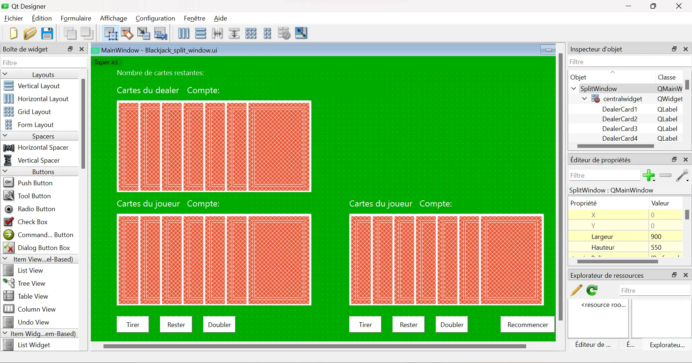

Maintenant qu'on a les deux fichiers .ui de chaque fenêtre, on commence à implémenter le jeu. Pour organiser correctement le code et le rendre plus lisible, on crée trois fichiers .py:

- Un fichier *blackjack_methods.py* qui va contenir la classe **Blackjack_methods** contenant les méthodes relatives à la manipulation du deck de cartes et des mains (création du deck, calcul du compte des mains),
- Un fichier *UI_blackjack.py* qui va contenir la classe **Blackjack** contenant les méthodes relatives à la création de l'interface graphique,
- Un fichier *main.py* qui va contenir les instructions pour exécuter le code.
  
### La classe Blackjack_methods

Comme explicité ci-dessus, cette classe contient les méthodes pour manipuler le deck. La méthode *newdeck* permet de créer le sabot pour le Blackjack. Ce sabot est composé de 6 jeux de 52 cartes. Ce sabot (dénommé *deck* dans le code) est une liste d'objet de la classe **Card**. Ces objets ont comme attribut un nom (par exemple 2_of_clubs pour le 2 de trèfle ou 11_of_hearts pour le valet de coeur) et sa valeur (1 pour As, et 10 pour les têtes). Cette classe a également une méthode appelée *sum_hand*, qui prend en argument une liste et qui renvoie sa somme. Cette méthode prend en compte que l'As (donc la valeur 1) vaut soit 1 soit 11. Ainsi, si la main est `[1, 4]`, la méthode renvoie 15, mais si la main est `[1, 5, 7]`, la méthode renvoie 13. Voici l'implémentation de cette classe:



```python
class Blackjack_methods():
    def __init__(self):
        self.newdeck()
    
    def newdeck(self):
        suits = ["diamonds", "clubs" ,"hearts", "spades"]
        values = range(1,14)
        initial_deck = []
        for suit in suits:
            for value in values:
                if value < 10:
                    initial_deck.append(Card(f"{value}_of_{suit}", value))
                if value >= 10:
                    initial_deck.append(Card(f"{value}_of_{suit}", 10))

        self.deck = initial_deck * 6
    
    def sum_hand(self, hand):
        if 1 in (card.value for card in hand):
            sum1 = sum([card.value for card in hand]) + 10
            if sum1 > 21:
                return(sum([card.value for card in hand]))
            else:
                return(sum1)
        else:
            return(sum([card.value for card in hand]))

class Card():
    def __init__(self, name, value):
        self.value = value
        self.name = name
```



### La classe Blackjack

#### L'initialisation

Cette classe hérite des classes **QMainWindow** et **Blackjack_methods**, dans l'optique de réaliser l'interface graphique du jeu. Dans l'initialisation de cette classe, on retrouve les éléments suivants:

- La création des fenêtres *main_window* et *split_window* avec l'aide des fichiers .ui précédemment créés. On utilise la méthode *load* de la classe **QUiLoader**.
- La création des attributs associés à chaque objet des fichiers .ui (les labels, les boutons etc...). On utilise la méthode *findChild* de la classe **QWidget**
- L'association des méthodes correspondantes à chaque bouton de l'interface grâce à la méthode *clicked.connect* de la classe **QPushButton** (par exemple, la méthode *restart* pour le bouton *restartButton*)

Voilà l'implémentation de cette initialisation:



```python
class Blackjack(QMainWindow, Blackjack_methods):
    def __init__(self):
        super().__init__()

        ui_file_name = "Blackjack_main_window.ui"
        ui_file = QFile(ui_file_name)
        loader = QUiLoader()
        self.main_window = loader.load(ui_file)
        ui_file.close()
        self.main_window.setWindowTitle("Blackjack")
        
        self.label_dealercard1 = self.main_window.findChild(QLabel, "DealerCard1")
        self.label_dealercard2 = self.main_window.findChild(QLabel, "DealerCard2")
        self.label_dealercard3 = self.main_window.findChild(QLabel, "DealerCard3")
        self.label_dealercard4 = self.main_window.findChild(QLabel, "DealerCard4")
        self.label_dealercard5 = self.main_window.findChild(QLabel, "DealerCard5")
        self.label_dealercard6 = self.main_window.findChild(QLabel, "DealerCard6")
        self.label_dealercard7 = self.main_window.findChild(QLabel, "DealerCard7")
        self.label_playercard1 = self.main_window.findChild(QLabel, "PlayerCard1")
        self.label_playercard2 = self.main_window.findChild(QLabel, "PlayerCard2")
        self.label_playercard3 = self.main_window.findChild(QLabel, "PlayerCard3")
        self.label_playercard4 = self.main_window.findChild(QLabel, "PlayerCard4")
        self.label_playercard5 = self.main_window.findChild(QLabel, "PlayerCard5")
        self.label_playercard6 = self.main_window.findChild(QLabel, "PlayerCard6")
        self.label_playercard7 = self.main_window.findChild(QLabel, "PlayerCard7")

        self.label_dealerheader = self.main_window.findChild(QLabel, "labelDealerCards")
        self.label_playerheader = self.main_window.findChild(QLabel, "labelPlayerCards")
        self.label_dealercount = self.main_window.findChild(QLabel, "labelDealerCount")
        self.label_playercount = self.main_window.findChild(QLabel, "labelPlayerCount")
        self.PlayerCount = self.main_window.findChild(QLabel, "PlayerCount")
        self.DealerCount = self.main_window.findChild(QLabel, "DealerCount")
        self.result = self.main_window.findChild(QLabel, "label_result")
        self.label_cards = self.main_window.findChild(QLabel, "label_cards")
        self.cardsLeft = self.main_window.findChild(QLabel, "cardsLeft")

        self.hitButton = self.main_window.findChild(QPushButton, "button_hit")
        self.stayButton = self.main_window.findChild(QPushButton, "button_stay")
        self.doubleButton = self.main_window.findChild(QPushButton, "button_double")
        self.restartButton = self.main_window.findChild(QPushButton, "button_restart")
        self.splitButton = self.main_window.findChild(QPushButton, "button_split")

        ui_file_name2 = "Blackjack_split_window.ui"
        ui_file2 = QFile(ui_file_name2)
        loader2 = QUiLoader()
        self.split_window = loader2.load(ui_file2)
        ui_file2.close()
        self.split_window.setWindowTitle("Blackjack: Split Window")

        self.label_split_dealercard1 = self.split_window.findChild(QLabel, "DealerCard1")
        self.label_split_dealercard2 = self.split_window.findChild(QLabel, "DealerCard2")
        self.label_split_dealercard3 = self.split_window.findChild(QLabel, "DealerCard3")
        self.label_split_dealercard4 = self.split_window.findChild(QLabel, "DealerCard4")
        self.label_split_dealercard5 = self.split_window.findChild(QLabel, "DealerCard5")
        self.label_split_dealercard6 = self.split_window.findChild(QLabel, "DealerCard6")
        self.label_split_dealercard7 = self.split_window.findChild(QLabel, "DealerCard7")
        self.label_split_playercard1_1 = self.split_window.findChild(QLabel, "PlayerCard1_1")
        self.label_split_playercard1_2 = self.split_window.findChild(QLabel, "PlayerCard1_2")
        self.label_split_playercard1_3 = self.split_window.findChild(QLabel, "PlayerCard1_3")
        self.label_split_playercard1_4 = self.split_window.findChild(QLabel, "PlayerCard1_4")
        self.label_split_playercard1_5 = self.split_window.findChild(QLabel, "PlayerCard1_5")
        self.label_split_playercard1_6 = self.split_window.findChild(QLabel, "PlayerCard1_6")
        self.label_split_playercard1_7 = self.split_window.findChild(QLabel, "PlayerCard1_7")
        self.label_split_playercard2_1 = self.split_window.findChild(QLabel, "PlayerCard2_1")
        self.label_split_playercard2_2 = self.split_window.findChild(QLabel, "PlayerCard2_2")
        self.label_split_playercard2_3 = self.split_window.findChild(QLabel, "PlayerCard2_3")
        self.label_split_playercard2_4 = self.split_window.findChild(QLabel, "PlayerCard2_4")
        self.label_split_playercard2_5 = self.split_window.findChild(QLabel, "PlayerCard2_5")
        self.label_split_playercard2_6 = self.split_window.findChild(QLabel, "PlayerCard2_6")
        self.label_split_playercard2_7 = self.split_window.findChild(QLabel, "PlayerCard2_7")
        self.split_PlayerCount1 = self.split_window.findChild(QLabel, "PlayerCount1")
        self.split_PlayerCount2 = self.split_window.findChild(QLabel, "PlayerCount2")
        self.split_DealerCount = self.split_window.findChild(QLabel, "DealerCount")
        self.cardsLeft_split = self.split_window.findChild(QLabel, "cardsLeft")

        self.split_hitButton1 = self.split_window.findChild(QPushButton, "button_hit1")
        self.split_stayButton1 = self.split_window.findChild(QPushButton, "button_stay1")
        self.split_doubleButton1 = self.split_window.findChild(QPushButton, "button_double1")
        self.split_hitButton2 = self.split_window.findChild(QPushButton, "button_hit2")
        self.split_stayButton2 = self.split_window.findChild(QPushButton, "button_stay2")
        self.split_doubleButton2 = self.split_window.findChild(QPushButton, "button_double2")
        self.split_buttonRestart = self.split_window.findChild(QPushButton, "button_restart")

        self.split_hitButton1.clicked.connect(self.hit_split)
        self.split_hitButton2.clicked.connect(self.hit_split)
        self.split_stayButton1.clicked.connect(self.stay_split_first)
        self.split_stayButton2.clicked.connect(self.stay_split)
        self.split_buttonRestart.clicked.connect(self.restart_split)
        
        self.restart()
        
        self.hitButton.clicked.connect(self.hit)
        self.restartButton.clicked.connect(self.restart)
        self.stayButton.clicked.connect(self.stay)
        self.splitButton.clicked.connect(self.split)
        self.main_window.show()
```



On peut remarquer qu'il y a beaucoup de lignes de codes, mais que c'est assez répétitif, notamment parce qu'il faut associer chaque objet de l'interface à des attributs de la classe dans le code.

Il faut ensuite créer chaque méthode associée aux boutons.

#### La méthode restart

Cette méthode est appelée dans l'initialisation de la classe. Elle permet de réaliser les actions suivantes:

- Refaire un nouveau deck lorsque la taille du sabot est inférieure à 52 cartes,
- Piocher deux nouvelles cartes pour le joueur et une nouvelle carte pour le dealer, et les afficher à leurs endroits respectifs grâce à la méthode *setPixmap* de la classe **QPixmap**,
- Mettre à jour les comptes du dealer et du joueur grâce à la méthode *display_player_count*. Cette méthode permet d'afficher le compte du joueur, en faisant attention au cas où un As est dans la main. Par exemple, si la main du joueur est As-4, alors le compte doit afficher 5/15.
- Activer ou désactiver le bouton *séparer* grâce à la méthode *setEnabled* de la classe **QPushButton**. En effet, ce bouton n'est actif que si le joueur a deux cartes de même valeur,
- Réinitialiser les attributs de la classe, que l'on explicitera au fur et à mesure.

Cette méthode est appelée lorsque l'utilisateur clique sur le bouton "Recommencer" dans l'interface.



```python
def restart(self):
    if len(self.deck) <= 52:
        self.newdeck()
    self.player_bust = False
    self.hitButton.setEnabled(True)
    self.stayButton.setEnabled(True)
    self.doubleButton.setEnabled(True)
    self.result.setText("")
    self.DealerCount.setStyleSheet("color : white")
    self.PlayerCount.setStyleSheet("color : white")
    self.restartButton.setStyleSheet("background-color: white")
    self.split_buttonRestart.setStyleSheet("background-color: white")
    self.dealer_spot = 1
    self.dealer_spot_split = 1
    card = self.draw()
    self.dealer_hand = [card]
    if card.value == 1:
        self.DealerCount.setText("1/11")
    else:
        self.DealerCount.setText(f"{self.sum_hand(self.dealer_hand)}")
    pixmap = QPixmap(f'PNG-cards/{card.name}.webp')
    self.label_dealercard1.setPixmap(pixmap)
    self.player_spot = 2
    self.player_spot_split_1 = 1
    self.player_spot_split_2 = 1
    card1 = self.draw()
    card2 = self.draw()
    pixmap1 = QPixmap(f'PNG-cards/{card1.name}.webp')
    pixmap2 = QPixmap(f'PNG-cards/{card2.name}.webp')
    self.player_hand = [card1, card2]
    self.label_playercard1.setPixmap(pixmap1)
    self.label_playercard2.setPixmap(pixmap2)
    self.display_player_count()
    pixmap = QPixmap(f'PNG-cards/dos.webp')
    self.label_playercard3.setPixmap(pixmap)
    self.label_playercard4.setPixmap(pixmap)
    self.label_playercard5.setPixmap(pixmap)
    self.label_playercard6.setPixmap(pixmap)
    self.label_playercard7.setPixmap(pixmap)
    self.label_dealercard2.setPixmap(pixmap)
    self.label_dealercard3.setPixmap(pixmap)
    self.label_dealercard4.setPixmap(pixmap)
    self.label_dealercard5.setPixmap(pixmap)
    self.label_dealercard6.setPixmap(pixmap)
    self.label_dealercard7.setPixmap(pixmap)
    if card1.value == card2.value:
        self.splitButton.setEnabled(True)
    else:
        self.splitButton.setEnabled(False)
```



#### La méthode draw

Cette méthode permet de piocher une carte dans le deck. Pour cela, on utilise la fonction *choice* de la bibliothèque *random* pour choisir une carte aléatoire dans le deck. Ensuite, on la retire du deck et on la renvoie. A chaque fois que le joueur pioche une carte, il faut mettre à jour le nombre de cartes restantes.



```python
def draw(self):
        card = random.choice(self.deck)
        self.deck.remove(card)
        self.cardsLeft.setText(f"{len(self.deck)}")
        self.cardsLeft_split.setText(f"{len(self.deck)}")
        return(card)
```



#### La méthode hit

Cette méthode est appelée lorsque l'utilisateur clique sur le bouton "Tirer" de l'interface. Cette méthode permet de réaliser les actions suivantes:

- Désactiver le bouton "Séparer". En effet, lorsque le joueur a pioché une carte, il ne peut plus séparer ses cartes,
- Piocher une carte grâce à la méthode *draw* et la placer à l'endroit adéquat. Pour déterminer cet endroit adéquat, on doit créer un attribut *player_spot* qu'on incrémente au fur et à mesure que l'on avance dans la pioche. A noter que l'attribut "name" de chaque objet de la classe **Card** correspond exactement au nom qui est donné dans le fichier qui contient toutes les cartes en png, afin que la méthode *setPixmap* puisse retrouver l'image.
- Mettre à jour le compte du joueur.

Si le compte du joueur dépasse 21, on appelle la méthode *stay*.



```python
def hit(self):
    self.splitButton.setEnabled(False)
    card = self.draw()
    self.player_hand.append(card)
    pixmap = QPixmap(f'PNG-cards/{card.name}.webp')
    if self.player_spot == 0:
        self.label_playercard1.setPixmap(pixmap)
        self.player_spot += 1

    elif self.player_spot == 1:
        self.label_playercard2.setPixmap(pixmap)
        self.player_spot += 1
    
    elif self.player_spot == 2:
        self.label_playercard3.setPixmap(pixmap)
        self.player_spot += 1
    
    elif self.player_spot == 3:
        self.label_playercard4.setPixmap(pixmap)
        self.player_spot += 1
    
    elif self.player_spot == 4:
        self.label_playercard5.setPixmap(pixmap)
        self.player_spot += 1
    
    elif self.player_spot == 5:
        self.label_playercard6.setPixmap(pixmap)
        self.player_spot += 1
    
    elif self.player_spot == 6:
        self.label_playercard7.setPixmap(pixmap)
        self.player_spot += 1
    
    self.display_player_count()
    count = self.sum_hand(self.player_hand)
    if count > 21:
        self.player_bust = True
        self.result.setText("Le joueur a bust")
        self.PlayerCount.setStyleSheet("color : red")
        self.stay()
```



#### La méthode stay

Cette méthode est associée au bouton "Rester" de l'interface, et permet de finir le tour du joueur. Elle permet de réaliser les actions suivantes:

- Piocher des cartes jusqu'à ce que le dealer dépasse 16, et afficher les cartes au fur et à mesure de la même manière qu'avec la méthode *hit*.
- Déterminer si le joueur a gagné ou si le dealer a gagné, et l'afficher sur l'interface,
- Désactiver tout les boutons sauf le bouton "recommencer", que l'on mettra en rouge.



```python
def stay(self):
    if 1 in (card.value for card in self.player_hand):
        self.PlayerCount.setText(f"{self.sum_hand(self.player_hand)}")
    while self.sum_hand(self.dealer_hand) < 17:
        card = self.draw()
        self.dealer_hand.append(card)
        pixmap = QPixmap(f'PNG-cards/{card.name}.webp')
        if self.dealer_spot == 0:
            self.label_dealercard1.setPixmap(pixmap)
            self.dealer_spot += 1

        elif self.dealer_spot == 1:
            self.label_dealercard2.setPixmap(pixmap)
            self.dealer_spot += 1
        
        elif self.dealer_spot == 2:
            self.label_dealercard3.setPixmap(pixmap)
            self.dealer_spot += 1
        
        elif self.dealer_spot == 3:
            self.label_dealercard4.setPixmap(pixmap)
            self.dealer_spot += 1
        
        elif self.dealer_spot == 4:
            self.label_dealercard5.setPixmap(pixmap)
            self.dealer_spot += 1
        
        elif self.dealer_spot == 5:
            self.label_dealercard6.setPixmap(pixmap)
            self.dealer_spot += 1
        
        elif self.dealer_spot == 6:
            self.label_dealercard7.setPixmap(pixmap)
            self.dealer_spot += 1
        count = self.sum_hand(self.dealer_hand)
        self.DealerCount.setText(f"{count}")
        #time.sleep(1)
    if not self.player_bust and self.sum_hand(self.dealer_hand) > 21:
        self.result.setText("Le dealer a bust")
    if not self.player_bust and (self.sum_hand(self.dealer_hand) < self.sum_hand(self.player_hand) or self.sum_hand(self.dealer_hand) > 21):
        self.result.setText("Le joueur a gagné")
    if not self.player_bust and (self.sum_hand(self.dealer_hand) > self.sum_hand(self.player_hand) and self.sum_hand(self.dealer_hand) <= 21):
        self.result.setText("Le dealer a gagné")
    if not self.player_bust and self.sum_hand(self.dealer_hand) == self.sum_hand(self.player_hand):
        self.result.setText("Egalité!")
    if count > 21:
        self.DealerCount.setStyleSheet("color : red")
    self.restartButton.setStyleSheet("background-color: red")
    self.hitButton.setEnabled(False)
    self.stayButton.setEnabled(False)
    self.doubleButton.setEnabled(False)
    self.splitButton.setEnabled(False)

```



#### Les méthodes dans le cas du split

Toutes ces méthodes ont leur équivalent si jamais le joueur décide de séparer ses cartes. En effet, comme la fenêtre *split_window* est différente de la fenêtre *main_window*, on a par conséquent d'autres boutons, et donc d'autres méthodes à créer. Cependant, ces méthodes sont sensiblement les mêmes que celles explicitées précédemment, il est inutile de les expliciter ici. On peut mentionner tout de même que ces méthodes doivent gérer l'activation ou la désactivation des différents boutons, puisque le joueur ne peut pas jouer ses mains en même temps.



```python
def display_player_count_split(self):
  if self.IsFirst:
      count = self.sum_hand(self.player_hand_split_1)
      if 1 in (card.value for card in self.player_hand_split_1) and (sum([card.value for card in self.player_hand_split_1]) + 10) < 21:
          self.split_PlayerCount1.setText(f"{sum([card.value for card in self.player_hand_split_1])}" + "/" + f"{count}")
      else:
          self.split_PlayerCount1.setText(f"{count}")
  else:
      count = self.sum_hand(self.player_hand_split_2)
      if 1 in (card.value for card in self.player_hand_split_2) and (sum([card.value for card in self.player_hand_split_2]) + 10) < 21:
          self.split_PlayerCount2.setText(f"{sum([card.value for card in self.player_hand_split_2])}" + "/" + f"{count}")
      else:
          self.split_PlayerCount2.setText(f"{count}")

def hit_split(self):
  if self.IsFirst:
      card = self.draw()
      self.player_hand_split_1.append(card)
      pixmap = QPixmap(f'PNG-cards/{card.name}.webp')
      if self.player_spot_split_1 == 0:
          self.label_split_playercard1_1.setPixmap(pixmap)
          self.player_spot_split_1 += 1

      elif self.player_spot_split_1 == 1:
          self.label_split_playercard1_2.setPixmap(pixmap)
          self.player_spot_split_1 += 1
      
      elif self.player_spot_split_1 == 2:
          self.label_split_playercard1_3.setPixmap(pixmap)
          self.player_spot_split_1 += 1
      
      elif self.player_spot_split_1 == 3:
          self.label_split_playercard1_4.setPixmap(pixmap)
          self.player_spot_split_1 += 1
      
      elif self.player_spot_split_1 == 4:
          self.label_split_playercard1_5.setPixmap(pixmap)
          self.player_spot_split_1 += 1
      
      elif self.player_spot_split_1 == 5:
          self.label_split_playercard1_6.setPixmap(pixmap)
          self.player_spot_split_1 += 1
      
      elif self.player_spot_split_1 == 6:
          self.label_split_playercard1_7.setPixmap(pixmap)
          self.player_spot_split_1 += 1
      
      self.display_player_count_split()
      count = self.sum_hand(self.player_hand_split_1)
      if count > 21:
          self.split_PlayerCount1.setStyleSheet("color : red")
          self.split_hitButton2.setEnabled(True)
          self.split_stayButton2.setEnabled(True)
          self.split_doubleButton2.setEnabled(True)
          self.split_hitButton1.setEnabled(False)
          self.split_stayButton1.setEnabled(False)
          self.split_doubleButton1.setEnabled(False)
          self.IsFirst = False
  
  else:
      card = self.draw()
      self.player_hand_split_2.append(card)
      pixmap = QPixmap(f'PNG-cards/{card.name}.webp')
      if self.player_spot_split_2 == 0:
          self.label_split_playercard2_1.setPixmap(pixmap)
          self.player_spot_split_2 += 1

      elif self.player_spot_split_2 == 1:
          self.label_split_playercard2_2.setPixmap(pixmap)
          self.player_spot_split_2 += 1
      
      elif self.player_spot_split_2 == 2:
          self.label_split_playercard2_3.setPixmap(pixmap)
          self.player_spot_split_2 += 1
      
      elif self.player_spot_split_2 == 3:
          self.label_split_playercard2_4.setPixmap(pixmap)
          self.player_spot_split_2 += 1
      
      elif self.player_spot_split_2 == 4:
          self.label_split_playercard2_5.setPixmap(pixmap)
          self.player_spot_split_2 += 1
      
      elif self.player_spot_split_2 == 5:
          self.label_split_playercard2_6.setPixmap(pixmap)
          self.player_spot_split_2 += 1
      
      elif self.player_spot_split_2 == 6:
          self.label_split_playercard2_7.setPixmap(pixmap)
          self.player_spot_split_2 += 1

      self.display_player_count_split()
      count = self.sum_hand(self.player_hand_split_2)
      if count > 21:
          self.split_PlayerCount2.setStyleSheet("color : red")
          self.stay_split()            


def stay_split_first(self):
    self.IsFirst = False
    if 1 in (card.value for card in self.player_hand_split_1):
        self.split_PlayerCount1.setText(f"{self.sum_hand(self.player_hand_split_1)}")
    self.split_hitButton2.setEnabled(True)
    self.split_stayButton2.setEnabled(True)
    self.split_doubleButton2.setEnabled(True)
    self.split_hitButton1.setEnabled(False)
    self.split_stayButton1.setEnabled(False)
    self.split_doubleButton1.setEnabled(False)

def stay_split(self):
  self.split_hitButton2.setEnabled(False)
  self.split_stayButton2.setEnabled(False)
  self.split_doubleButton2.setEnabled(False)
  while self.sum_hand(self.dealer_hand) < 17:
      card = self.draw()
      self.dealer_hand.append(card)
      pixmap = QPixmap(f'PNG-cards/{card.name}.webp')
      if self.dealer_spot_split == 0:
          self.label_split_dealercard1.setPixmap(pixmap)
          self.dealer_spot_split += 1

      elif self.dealer_spot_split == 1:
          self.label_split_dealercard2.setPixmap(pixmap)
          self.dealer_spot_split += 1
      
      elif self.dealer_spot_split == 2:
          self.label_split_dealercard3.setPixmap(pixmap)
          self.dealer_spot_split += 1
      
      elif self.dealer_spot_split == 3:
          self.label_split_dealercard4.setPixmap(pixmap)
          self.dealer_spot_split += 1
      
      elif self.dealer_spot_split == 4:
          self.label_split_dealercard5.setPixmap(pixmap)
          self.dealer_spot_split += 1
      
      elif self.dealer_spot_split == 5:
          self.label_split_dealercard6.setPixmap(pixmap)
          self.dealer_spot_split += 1
      
      elif self.dealer_spot_split == 6:
          self.label_split_dealercard7.setPixmap(pixmap)
          self.dealer_spot_split += 1
      
      count = self.sum_hand(self.dealer_hand)
      self.split_DealerCount.setText(f"{count}")
  self.split_buttonRestart.setStyleSheet("background-color: red")
  if count > 21:
      self.split_DealerCount.setStyleSheet("color : red")

def restart_split(self):
  self.main_window.show()
  self.split_window.close()
  pixmap = QPixmap(f'PNG-cards/dos.webp')
  self.label_split_playercard1_2.setPixmap(pixmap)
  self.label_split_playercard1_3.setPixmap(pixmap)
  self.label_split_playercard1_4.setPixmap(pixmap)
  self.label_split_playercard1_5.setPixmap(pixmap)
  self.label_split_playercard1_6.setPixmap(pixmap)
  self.label_split_playercard1_7.setPixmap(pixmap)
  self.label_split_playercard2_2.setPixmap(pixmap)
  self.label_split_playercard2_3.setPixmap(pixmap)
  self.label_split_playercard2_4.setPixmap(pixmap)
  self.label_split_playercard2_5.setPixmap(pixmap)
  self.label_split_playercard2_6.setPixmap(pixmap)
  self.label_split_playercard2_7.setPixmap(pixmap)
  self.label_split_dealercard2.setPixmap(pixmap)
  self.label_split_dealercard3.setPixmap(pixmap)
  self.label_split_dealercard4.setPixmap(pixmap)
  self.label_split_dealercard5.setPixmap(pixmap)
  self.label_split_dealercard6.setPixmap(pixmap)
  self.label_split_dealercard7.setPixmap(pixmap)
  self.split_PlayerCount1.setStyleSheet("color : white")
  self.split_PlayerCount2.setStyleSheet("color : white")
  self.split_DealerCount.setStyleSheet("color : white")
  self.restart()
```



## Démonstration du code

Pour exécuter ce code, on exécute ces quelques lignes dans un fichier main.py:

```python
app = QApplication(sys.argv)
window = Blackjack()
app.exec()
```

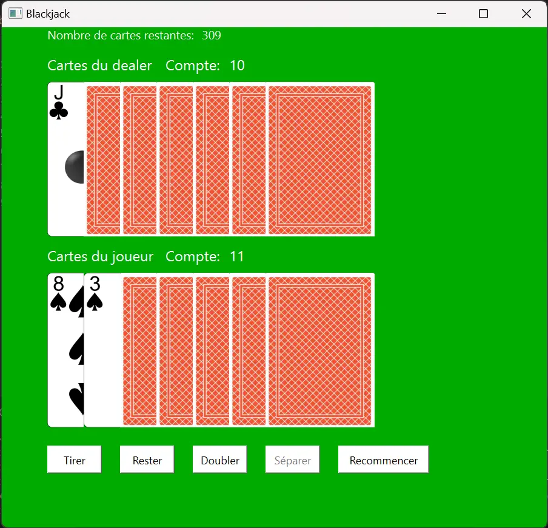

On voit bien l'interface que l'on a créé plus tôt sur Qt Designer. Voici ce à quoi ressemble la fenêtre à la fin d'un tour:


De plus, voici à quoi ressemble l'interface après la fin d'un tour où le joueur a split:

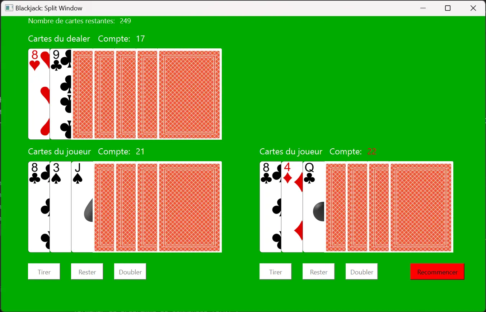

## Bilan du premier sprint et prévision du deuxième sprint

Tout les objectifs du premier sprint ont été réalisés, sauf la réalisation de l'interface de mise. En effet, l'implémentation des autres fonctionnalités m'ont pris plus de temps que prévu, de nombreux problèmes de programmation et de débogage ont été très chronophage. Cependant, l'interface de mise devrait être plus rapide à coder.

Ainsi, l'objectif pour le deuxième sprint est de coder les simulations pour obtenir des statistiques autour du jeu de Blackjack (et de finir l'interface de mise). Voici les différents objectifs du deuxième sprint:

- Implémenter des simulations pour calculer l'espérance de gain d'un joueur qui suit une stratégie optimale
- Implémenter des simulations pour calculer les taux de réussite d'un joueur face à chaque première cartes du dealer possibles
- Implémenter des simulations pour calculer les taux de réussites de chaque mains possibles d'un joueur

## Implémentation de l'interface de mise

Pour finaliser l'implémentation du jeu sur Python, il ne manque plus qu'à réaliser l'interface de mise, où le joueur pourra saisir sa mise. On utilise encore une fois l'outil Qt Designer pour faire l'aspect de l'interface:

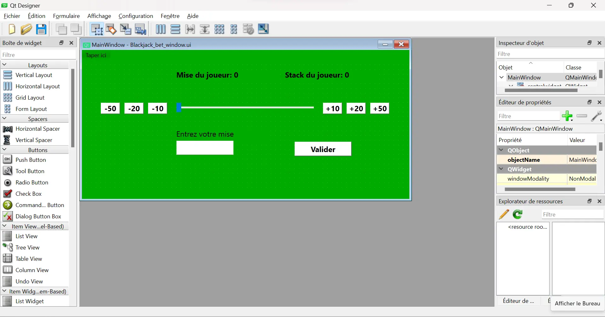

Il faut ensuite assigner chaque objet ainsi créé à des attributs de la classe **Blackjack** dans l'initialisation, et assigner les méthodes correspondantes à chaque bouton.



```python
def __init__(self):
    super().__init__()
    self.player_stack = 200

    ui_file_name = "Blackjack_main_window.ui"
    ui_file = QFile(ui_file_name)
    loader = QUiLoader()
    self.main_window = loader.load(ui_file)
    ui_file.close()
    self.main_window.setWindowTitle("Blackjack")
    
    self.label_dealercard1 = self.main_window.findChild(QLabel, "DealerCard1")
    self.label_dealercard2 = self.main_window.findChild(QLabel, "DealerCard2")
    self.label_dealercard3 = self.main_window.findChild(QLabel, "DealerCard3")
    self.label_dealercard4 = self.main_window.findChild(QLabel, "DealerCard4")
    self.label_dealercard5 = self.main_window.findChild(QLabel, "DealerCard5")
    self.label_dealercard6 = self.main_window.findChild(QLabel, "DealerCard6")
    self.label_dealercard7 = self.main_window.findChild(QLabel, "DealerCard7")
    self.label_playercard1 = self.main_window.findChild(QLabel, "PlayerCard1")
    self.label_playercard2 = self.main_window.findChild(QLabel, "PlayerCard2")
    self.label_playercard3 = self.main_window.findChild(QLabel, "PlayerCard3")
    self.label_playercard4 = self.main_window.findChild(QLabel, "PlayerCard4")
    self.label_playercard5 = self.main_window.findChild(QLabel, "PlayerCard5")
    self.label_playercard6 = self.main_window.findChild(QLabel, "PlayerCard6")
    self.label_playercard7 = self.main_window.findChild(QLabel, "PlayerCard7")

    self.label_dealerheader = self.main_window.findChild(QLabel, "labelDealerCards")
    self.label_playerheader = self.main_window.findChild(QLabel, "labelPlayerCards")
    self.label_dealercount = self.main_window.findChild(QLabel, "labelDealerCount")
    self.label_playercount = self.main_window.findChild(QLabel, "labelPlayerCount")
    self.PlayerCount = self.main_window.findChild(QLabel, "PlayerCount")
    self.DealerCount = self.main_window.findChild(QLabel, "DealerCount")
    self.result = self.main_window.findChild(QLabel, "label_result")
    self.label_cards = self.main_window.findChild(QLabel, "label_cards")
    self.cardsLeft = self.main_window.findChild(QLabel, "cardsLeft")
    self.player_stack_main = self.main_window.findChild(QLabel, "player_stack")
    self.player_bet_main = self.main_window.findChild(QLabel, "player_bet")

    self.hitButton = self.main_window.findChild(QPushButton, "button_hit")
    self.stayButton = self.main_window.findChild(QPushButton, "button_stay")
    self.doubleButton = self.main_window.findChild(QPushButton, "button_double")
    self.restartButton = self.main_window.findChild(QPushButton, "button_restart")
    self.splitButton = self.main_window.findChild(QPushButton, "button_split")

    ui_file_name2 = "Blackjack_split_window.ui"
    ui_file2 = QFile(ui_file_name2)
    loader2 = QUiLoader()
    self.split_window = loader2.load(ui_file2)
    ui_file2.close()
    self.split_window.setWindowTitle("Blackjack: Split Window")

    self.label_split_dealercard1 = self.split_window.findChild(QLabel, "DealerCard1")
    self.label_split_dealercard2 = self.split_window.findChild(QLabel, "DealerCard2")
    self.label_split_dealercard3 = self.split_window.findChild(QLabel, "DealerCard3")
    self.label_split_dealercard4 = self.split_window.findChild(QLabel, "DealerCard4")
    self.label_split_dealercard5 = self.split_window.findChild(QLabel, "DealerCard5")
    self.label_split_dealercard6 = self.split_window.findChild(QLabel, "DealerCard6")
    self.label_split_dealercard7 = self.split_window.findChild(QLabel, "DealerCard7")
    self.label_split_playercard1_1 = self.split_window.findChild(QLabel, "PlayerCard1_1")
    self.label_split_playercard1_2 = self.split_window.findChild(QLabel, "PlayerCard1_2")
    self.label_split_playercard1_3 = self.split_window.findChild(QLabel, "PlayerCard1_3")
    self.label_split_playercard1_4 = self.split_window.findChild(QLabel, "PlayerCard1_4")
    self.label_split_playercard1_5 = self.split_window.findChild(QLabel, "PlayerCard1_5")
    self.label_split_playercard1_6 = self.split_window.findChild(QLabel, "PlayerCard1_6")
    self.label_split_playercard1_7 = self.split_window.findChild(QLabel, "PlayerCard1_7")
    self.label_split_playercard2_1 = self.split_window.findChild(QLabel, "PlayerCard2_1")
    self.label_split_playercard2_2 = self.split_window.findChild(QLabel, "PlayerCard2_2")
    self.label_split_playercard2_3 = self.split_window.findChild(QLabel, "PlayerCard2_3")
    self.label_split_playercard2_4 = self.split_window.findChild(QLabel, "PlayerCard2_4")
    self.label_split_playercard2_5 = self.split_window.findChild(QLabel, "PlayerCard2_5")
    self.label_split_playercard2_6 = self.split_window.findChild(QLabel, "PlayerCard2_6")
    self.label_split_playercard2_7 = self.split_window.findChild(QLabel, "PlayerCard2_7")
    self.split_PlayerCount1 = self.split_window.findChild(QLabel, "PlayerCount1")
    self.split_PlayerCount2 = self.split_window.findChild(QLabel, "PlayerCount2")
    self.split_DealerCount = self.split_window.findChild(QLabel, "DealerCount")
    self.cardsLeft_split = self.split_window.findChild(QLabel, "cardsLeft")
    self.split_player_bet1 = self.split_window.findChild(QLabel, "player_bet1")
    self.split_player_bet2 = self.split_window.findChild(QLabel, "player_bet2")
    self.split_player_stack = self.split_window.findChild(QLabel, "player_stack")
    self.split_player_bet_total = self.split_window.findChild(QLabel, "player_bet_total")

    self.split_hitButton1 = self.split_window.findChild(QPushButton, "button_hit1")
    self.split_stayButton1 = self.split_window.findChild(QPushButton, "button_stay1")
    self.split_doubleButton1 = self.split_window.findChild(QPushButton, "button_double1")
    self.split_hitButton2 = self.split_window.findChild(QPushButton, "button_hit2")
    self.split_stayButton2 = self.split_window.findChild(QPushButton, "button_stay2")
    self.split_doubleButton2 = self.split_window.findChild(QPushButton, "button_double2")
    self.split_buttonRestart = self.split_window.findChild(QPushButton, "button_restart")

    self.split_hitButton1.clicked.connect(self.hit_split)
    self.split_hitButton2.clicked.connect(self.hit_split)
    self.split_stayButton1.clicked.connect(self.stay_split_first)
    self.split_stayButton2.clicked.connect(self.stay_split)
    self.split_buttonRestart.clicked.connect(self.restart_split)
    self.split_doubleButton1.clicked.connect(self.double_split)
    self.split_doubleButton2.clicked.connect(self.double_split)

    ui_file_name3 = "Blackjack_bet_window.ui"
    ui_file3 = QFile(ui_file_name3)
    loader3 = QUiLoader()
    self.bet_window = loader2.load(ui_file3)
    ui_file3.close()
    self.bet_window.setWindowTitle("Blackjack: Fenêtre de mise")

    self.playerBet = self.bet_window.findChild(QLabel, "player_bet")
    self.playerStack = self.bet_window.findChild(QLabel, "player_stack")
    self.line_edit_bet = self.bet_window.findChild(QLineEdit, "line_edit_bet")
    self.slideBet = self.bet_window.findChild(QSlider, "slide_bet")
    self.validerButton = self.bet_window.findChild(QPushButton, "button_valider")
    self.validerButton.clicked.connect(self.valider_bet)

    self.add10 = self.bet_window.findChild(QPushButton, "add_10")
    self.add20 = self.bet_window.findChild(QPushButton, "add_20")
    self.add50 = self.bet_window.findChild(QPushButton, "add_50")
    self.add10.clicked.connect(self.add_10)
    self.add20.clicked.connect(self.add_20)
    self.add50.clicked.connect(self.add_50)

    self.remove10 = self.bet_window.findChild(QPushButton, "remove_10")
    self.remove20 = self.bet_window.findChild(QPushButton, "remove_20")
    self.remove50 = self.bet_window.findChild(QPushButton, "remove_50")
    self.remove10.clicked.connect(self.remove_10)
    self.remove20.clicked.connect(self.remove_20)
    self.remove50.clicked.connect(self.remove_50)

    onlyInt = QIntValidator()
    onlyInt.setRange(0,self.player_stack)
    self.line_edit_bet.setValidator(onlyInt)
    self.line_edit_bet.textChanged.connect(self.line_edit_changed)
    self.line_edit_bet.returnPressed.connect(self.valider_bet)

    self.slideBet.setSingleStep(10)
    self.slideBet.setTickPosition(QSlider.TicksBelow)
    self.slideBet.valueChanged.connect(self.slide_changed)

    self.restart()
    
    self.hitButton.clicked.connect(self.hit)
    self.restartButton.clicked.connect(self.restart)
    self.stayButton.clicked.connect(self.stay)
    self.splitButton.clicked.connect(self.split)
    self.doubleButton.clicked.connect(self.double)
```



Pour rentrer sa mise, le joueur aura plusieurs possibilités:

- Entrer sa mise avec son clavier dans un champ textuel,
- Ajuster sa mise avec un curseur,
- Ajuster sa mise avec des boutons.

### Implémentation du champ textuel

Pour implémenter un champ dans lequel le joueur pourra rentrer sa mise, on va utiliser la classe **QLineEdit**. L'objet *line_edit_bet* de cette classe est défini dans l'initialisation. On utilise la classe **QIntValidator** pour n'autoriser que les entiers dans le champ. Ensuite, on utilise la méthode *textChanged.connect* pour détecter quand l'utilisateur rentre du texte dans le champ. Quand c'est le cas, la méthode *line_edit_changed* est appelée: cette méthode va récupérer la mise du joueur en arrondissant à la dizaine supérieure la valeur rentrée par le joueur. Cette mise va être affichée sur le curseur et le texte indiquant la mise du joueur.



```python
def line_edit_changed(self, value):
    if value != '':
        value = int(value)
        if value > self.player_stack:
            value = self.player_stack
            self.slideBet.setValue(value)
            self.playerBet.setText(f"Mise du joueur: {value}")
            self.player_bet = value
        else:
            value = value / 10
            value = round(value)
            value = value * 10
            if value == 0:
                self.validerButton.setEnabled(False)
            else:
                self.validerButton.setEnabled(True)
            self.slideBet.setValue(value)
            self.playerBet.setText(f"Mise du joueur: {value}")
            self.player_bet = value
```



### Implémentation du curseur

L'implémentation du curseur se fait via la classe **QSlider**. L'objet *slideBet* de cette classe est défini dans l'initialisation. Lorsque que le joueur change la valeur du curseur, on récupère cette valeur et on exécute la méthode *slide_changed*. Cette méthode récupère la mise indiquée par le curseur (arrondie à la dizaine supérieure) et l'affiche dans le champ textuel.



```python
def slide_changed(self, value):
    value = value / 10
    value = round(value)
    value = value * 10
    if value == 0:
        self.validerButton.setEnabled(False)
    else:
        self.validerButton.setEnabled(True)
    self.slideBet.setValue(value)
    self.playerBet.setText(f"Mise du joueur: {value}")
    self.player_bet = value
    self.line_edit_bet.setText(str(value))
```



Le joueur peut valider sa mise grâce au bouton "valider". Ce bouton ferme la fenêtre de mise et ouvre la fenêtre de jeu principale. De plus, ce bouton actualise le "stack" du joueur (c'est-à-dire le nombre jetons restants) et affiche la mise dans l'espace dédié. Enfin, il active ou désactive les boutons "Doubler" et "Séparer", suivant le stack restant du joueur et de sa mise actuelle.
Notons que ce bouton est désactivé lorsque la mise est égale à 0.



```python
def valider_bet(self):
    if self.player_bet != 0:
        self.player_stack -= self.player_bet
        self.player_stack_main.setText(f"Stack du joueur: {self.player_stack}")
        self.player_bet_main.setText(f"Mise du joueur: {self.player_bet}")
        if self.player_bet > self.player_stack:
            self.doubleButton.setEnabled(False)
            self.splitButton.setEnabled(False)
        else:
            self.doubleButton.setEnabled(True)
        self.main_window.show()
        self.bet_window.close()
```



### Implémentation des boutons de mise

Dans l'interface de mise, il est également possible d'ajuster sa mise grâce à 6 boutons: 3 boutons pour enlever 10, 20 ou 50 à la mise et 3 boutons pour ajouter 10, 20 ou 50 à la mise. Chacun de ces boutons est relié aux méthodes correspondantes (*add_10*, *add_20*, *add_50*, *remove_10*, *remove_20* et *remove_50*). Ces méthodes ajoutent ou retirent la quantité voulue de la mise du joueur, en vérifiant bien s'il est possible d'effectuer la modification (la mise ne peut pas être négative ou bien excéder le stack du joueur).



```python
def add_10(self):
    if self.player_bet + 10 > self.player_stack:
        return()
    else:
        self.player_bet += 10
        self.slideBet.setValue(self.player_bet)
        self.playerBet.setText(f"Mise du joueur: {self.player_bet}")
        self.line_edit_bet.setText(str(self.player_bet))

def remove_10(self):
    if self.player_bet - 10 < 0:
        return()
    else:
        self.player_bet -= 10
        self.slideBet.setValue(self.player_bet)
        self.playerBet.setText(f"Mise du joueur: {self.player_bet}")
        self.line_edit_bet.setText(str(self.player_bet))

def add_20(self):
    if self.player_bet + 20 > self.player_stack:
        return()
    else:
        self.player_bet += 20
        self.slideBet.setValue(self.player_bet)
        self.playerBet.setText(f"Mise du joueur: {self.player_bet}")
        self.line_edit_bet.setText(str(self.player_bet))

def remove_20(self):
    if self.player_bet - 20 < 0:
        return()
    else:
        self.player_bet -= 20
        self.slideBet.setValue(self.player_bet)
        self.playerBet.setText(f"Mise du joueur: {self.player_bet}")
        self.line_edit_bet.setText(str(self.player_bet))

def add_50(self):
    if self.player_bet + 50 > self.player_stack:
        return()
    else:
        self.player_bet += 50
        self.slideBet.setValue(self.player_bet)
        self.playerBet.setText(f"Mise du joueur: {self.player_bet}")
        self.line_edit_bet.setText(str(self.player_bet))

def remove_50(self):
    if self.player_bet - 50 < 0:
        return()
    else:
        self.player_bet -= 50
        self.slideBet.setValue(self.player_bet)
        self.playerBet.setText(f"Mise du joueur: {self.player_bet}")
        self.line_edit_bet.setText(str(self.player_bet))
```



### Démonstration de l'interface de mise

Lorsque l'on exécute le code avec ces nouvelles lignes de code, on obtient bien l'interface voulue. On peut bouger le curseur à notre guise, et on peut également rentrer la mise dans le champ. Dans les deux cas, la valeur change dans le champ ou le curseur bouge en adéquation avec l"action réalisée.

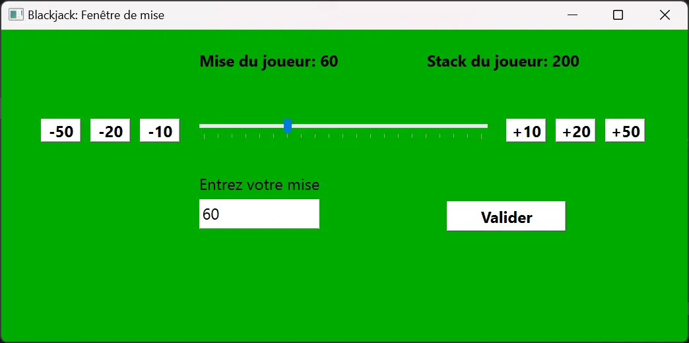


Pour compléter le système de mise, il faut également compléter le code présenté lors du premier sprint pour actualiser le stack du joueur en fonction de sa mise, s'il a gagné ou pas, s'il a doublé ou pas etc... Cette partie n'est pas expliquée ici, mais elle est bien implémentée dans le code Python présent dans mon [dossier GitHub](https://github.com/FrancoisBrucker/do-it/tree/main/src/promos/2023-2024/Dang-Vu-Duc/pok/temps-1) de Do-It


## Implémentation des simulations autour du jeu de Blackjack

Maintenant que l'implémentation de l'interface graphique du jeu de Blackjack est fonctionnelle, il faut implémenter le code nécessaire aux simulations pour obtenir des statistiques autour du jeu de Blackjack.
Pour rappel, d'après les règles du jeu, le dealer pioche tant qu'il n'a pas 16 points mais s'arrête quand il a 17 points ou plus. Sur cette base, il est connu qu'il existe une stratégie nommée "stratégie de base". Cette stratégie se présente sous forme de tableau, qui indique quelle action doit réaliser le joueur en fonction de sa main et de la première carte du dealer.

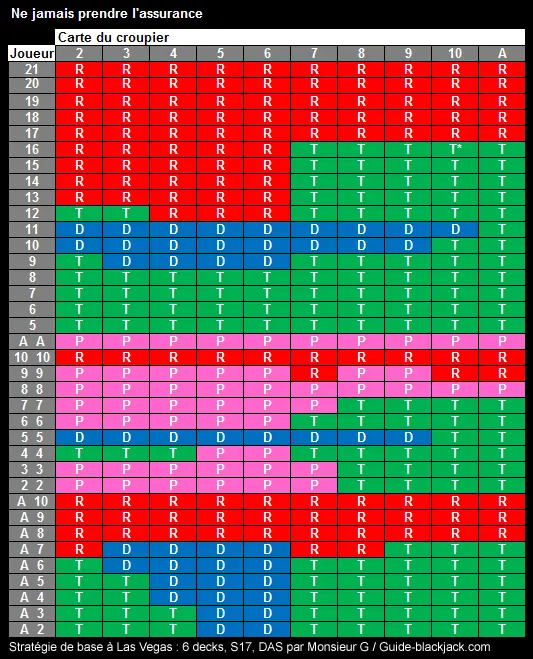
*Source: [Guide-Blackjack.com](https://www.guide-blackjack.com/strategie-base-las-vegas.html)*


On remarque que cette stratégie de base se présente sous forme de trois parties: un tableau dans le cas où le joueur a un As, un autre où il a un double et un dernier dans les autres cas. Ceci est dû au fait que le comptage est différent dans le cas d'un As, et que le joueur peut séparer ses cartes dans le cas d'un double.


Nous allons donc créer une classe **Blackjack_simulation** qui va permettre de simuler cette stratégie et d'en estimer son efficacité. Nous allons expliciter ses méthodes une par une.

### L'initialisation de la classe **Blackjack_simulation**

Cette classe hérite de la classe **Blackjack_methods**, présentée précédemment, afin d'hériter des méthodes pour créer des nouveaux decks et pour compter les points d'une main. L'initialisation a pour but de créer les 3 parties du tableau de la stratégie de base, nommées *strat1* pour le cas de base, *strat2* pour le cas du double et *strat3* pour le cas de l'As.



```python
def __init__(self):
    super().__init__()
    #0: stay
    #1: hit
    #2: double
    #3: split
    self.true_count = 0
    self.running_count = 0
    self.strat1 = [[0 for j in range(10)] for i in range(13)]
    for i in range(4):
        for j in range(10):
            self.strat1[i][j] = 1
    for j in range(5,10):
        self.strat1[4][j] = 1
    for i in range(7,11):
        for j in range(5,10):
            self.strat1[i][j] = 1
    self.strat1[4][0] = 1
    self.strat1[5][8] = 1
    self.strat1[5][9] = 1
    self.strat1[7][0] = 1
    self.strat1[7][1] = 1
    for j in range(1,5):
        self.strat1[4][j] = 2
    for j in range(8):
        self.strat1[5][j] = 2
    for j in range(10):
        self.strat1[6][j] = 2
    self.strat2 = [[3 for j in range(10)] for i in range(10)]
    for i in range(0,3):
        for j in range(6,10):
            self.strat2[i][j] = 1
    for j in range(3):
        self.strat2[2][j] = 1
    self.strat2[2][5] = 1
    for i in range(4,6):
        for j in range(6,10):
            self.strat2[i][j] = 1
    self.strat2[4][5] = 1
    self.strat2[3][8] = 1
    self.strat2[3][9] = 1
    for j in range(10):
        self.strat2[8][j] = 0
    self.strat2[7][5] = 0
    self.strat2[7][8] = 0
    self.strat2[7][9] = 0
    for j in range(8):
        self.strat2[3][j] = 2
    self.strat3 = [[2 for j in range(10)] for i in range(9)]
    for i in range(5):
        for j in range(5,10):
            self.strat3[i][j] = 1
    for j in range(7,10):
        self.strat3[5][j] = 1
    for i in range(6,9):
        for j in range(10):
            self.strat3[i][j] = 0
    self.strat3[5][5] = 0
    self.strat3[5][6] = 0
    for i in range(4):
        for j in range(2):
            self.strat3[i][j] = 1
    self.strat3[4][0] = 1
    self.strat3[0][2] = 1
    self.strat3[1][2] = 1
```




Dans ces tableaux, la valeur 0 indique qu'il faut rester, 1 indique qu'il faut tirer, 2 indique qu'il faut doubler et 3 indique qu'il faut séparer.


### La méthode *play_casino*

Cette méthode prend en argument une main (c'est-à-dire une liste d'objet de la classe **Card**) et la modifie pour simuler le fait que le dealer joue. En d'autres termes, cette méthode va ajouter des cartes jusqu'à ce que le compte de la main atteigne ou dépasse 17.



```python
def play_casino(self,hand):
        while self.sum_hand(hand) <= 16:
            card = self.draw()
            self.count(card)
            hand.append(card)
```



### La méthode *simulation*

Cette méthode va permettre de simuler la stratégie de base face au dealer pendant n parties (n étant spécifié en argument). Elle va permettre d'afficher plusieurs graphiques:

- Un graphique en barres affichant le taux de réussite face à chaque première carte possible du dealer, ainsi que l'espérance de gain du joueur,
- Des graphiques en couleur indiquant les taux de réussite du joueur de chaque main possibles et face à chaque première carte possibles du dealer. Il y aura 3 de ces graphiques, puisqu'il existe 3 tableaux de stratégies possibles.

L'implémentation de ces simulations est assez longue, mais assez répétitive. Avant de jouer les mains, on initialise le gain du joueur à 0 et on crée des listes qui contiendront les taux de réussite du joueur en fonction de sa main. Voici les étapes que la méthode suit:

- Piocher 4 cartes: deux cartes pour le joueur et deux cartes pour le dealer. Le joueur ne voit que la première carte du dealer.
- Vérifier le cas du Blackjack (un As et une carte de valeur 10):
  - Si le joueur a un Blackjack et pas le dealer, ajouter à son gain 1.5,
  - Si le dealer a Blackjack et pas le joueur, enlever à son gain 1,
  - Si les deux ont un Blackjack, ne pas toucher au gain du joueur.
- Vérifier le cas où les deux cartes sont égales. Dans ce cas, on se réfère au tableau *strat2* en utilisant la première carte du dealer et le compte de la main du joueur. Ces éléments vont servir d'indices pour récupérer la valeur dans le tableau de la stratégie de base, qui indiquera l'action à faire. Ensuite, on utilise la méthode *play_casino* pour faire jouer le dealer, on vérifie qui gagne et on actualise le gain du joueur en conséquence.
- Vérifier le cas où le joueur a un As. On se réfère au tableau *strat3* et on fait effectue les actions en conséquence. On fait ensuite jouer le dealer et on vérifie qui gagne.
- Vérifier le cas normal (sans As ni doubles). On se réfère au tableau *strat1* et on fait le même processus.

On effectue cet algorithme n fois. On remarque que cet algorithme est répétitif, et cela se voit dans l'implémentation, qui est assez longue.

Après la simulation de ces n parties, il n'y a plus qu'à afficher les résultats sous forme de graphiques en couleur et d'un graphique en barre (comme explicité précédemment), grâce à la bibliothèque matplotlib. On peut choisir d'afficher seulement un graphique, ou bien les 4 en même temps.



```python
def simulation(self,n,count,graph_type):
    gain = 0
    winrate_player = 0
    bust_player = 0
    bust_casino = 0
    list_card_winrate = [0 for i in range(10)]
    list_card_played = [0 for i in range(10)]
    played = False
    number_count = 0
    hands_played_normal = [[0 for i in range(15)] for k in range(10)]
    winrates_normal = [[0 for i in range(15)] for k in range(10)]
    hands_played_split = [[0 for i in range(10)] for k in range(10)]
    winrates_split = [[0 for i in range(10)] for k in range(10)]
    hands_played_ace = [[0 for i in range(9)] for k in range(10)]
    winrates_ace = [[0 for i in range(9)] for k in range(10)]
    for game in range(n):
        played = False
        factor = 1
        if len(self.deck) < 52:
            self.newdeck()
            self.true_count, self.running_count = 0, 0
        if count and self.true_count >= 1:
            factor *= (self.true_count)
            number_count += 1
        # if self.true_count >= count_threshold and count:
        #     factor *= (count_factor)
        #     number_count += 1
        card1 = self.draw()
        card3 = self.draw()
        card2 = self.draw()
        card4 = self.draw()
        self.count(card1)
        self.count(card2)
        self.count(card3)
        self.count(card4)
        if card3.value == 1:
            index3 = 9
        else:
            index3 = card3.value - 2
        hand_player = [card1, card2]
        hand_casino = [card3, card4]
        list_card_played[index3] += 1
        played_normal = False
        played_split = False
        played_ace = False
        if card1.value != 1 and card2.value != 1 and card1.value != card2.value:
            index_player = card1.value + card2.value - 5
            if card3.value == 1:
                index_casino = 0
            else:
                index_casino = 11 - card3.value
            hands_played_normal[index_casino][index_player] += 1
            played_normal = True
        if card1.value == card2.value:
            if card1.value == 1:
                index_player = 9
            else:
                index_player = card1.value - 2
            if card3.value == 1:
                index_casino = 0
            else:
                index_casino = 11 - card3.value
            hands_played_split[index_casino][index_player] += 1
            played_split = True
        if ((card1.value == 1) ^ (card2.value == 1)):
            no_ace = max(card1.value,card2.value)
            if card3.value == 1:
                index_casino = 0
            else:
                index_casino = 11 - card3.value
            index_player = no_ace - 2
            hands_played_ace[index_casino][index_player] += 1
            played_ace = True
        #Cas du Blackjack
        if ((card1.value == 1 and card2.value == 10) or (card1.value == 10 and card2.value == 1)) and not ((card3.value == 1 and card4.value == 10) or (card3.value == 10 and card4.value == 1)):
            played = True
            gain += factor * 1.5
            winrate_player += 1
            list_card_winrate[index3] += 1
            winrates_ace[index_casino][index_player] += 1
        if ((card3.value == 1 and card4.value == 10) or (card3.value == 10 and card4.value == 1)) and not ((card1.value == 1 and card2.value == 10) or (card1.value == 10 and card2.value == 1)):
            played = True
            gain -= factor * 1
        if ((card3.value == 1 and card4.value == 10) or (card3.value == 10 and card4.value == 1)) and ((card1.value == 1 and card2.value == 10) or (card1.value == 10 and card2.value == 1)):
            played = True
            winrates_ace[index_casino][index_player] += 1/2
            gain += 0
            winrate_player += 1/2
            list_card_winrate[index3] += 1/2
        #Cas du split
        if card1.value == card2.value:
            if card1.value == 1:
                index1 = 9
            else:
                index1 = card1.value - 2
                
            if card3.value == 1:
                index2 = 9
            else:
                index2 = card3.value - 2
            if self.strat2[index1][index2] == 1:
                card = self.draw()
                hand_player.append(card)
                self.count(card)
            elif self.strat2[index1][index2] == 2 and len(hand_player) == 2:
                card = self.draw()
                hand_player.append(card)
                self.count(card)
                factor *= 2
                played = True
                if self.sum_hand(hand_player) <= 21:
                    self.play_casino(hand_casino)
                    if self.sum_hand(hand_casino) > 21:
                        bust_casino += 1
                    if self.sum_hand(hand_casino) < self.sum_hand(hand_player) or self.sum_hand(hand_casino)>21:
                        gain += factor*1
                        winrate_player += 1
                        list_card_winrate[index3] += 1
                        if played_split:
                            winrates_split[index_casino][index_player] += 1
                    if self.sum_hand(hand_casino) > self.sum_hand(hand_player) and self.sum_hand(hand_casino)<=21:
                        gain -= factor*1
                else:
                    bust_player += 1
                    gain -= factor*1
            elif self.strat2[index1][index2] == 3:
                played = True
                card11 = self.draw()
                self.count(card11)
                card22 = self.draw()
                self.count(card22)
                hands = []
                hand_player1 = [card1,card11]
                hand_player2 = [card2,card22]
                hands = [hand_player1,hand_player2]
                for k in range(2):
                    card1 = hands[k][0]
                    card2 = hands[k][1]
                    if (card1.value == 1 and card2.value == 10) or (card2.value == 1 and card1.value == 10):
                        self.play_casino(hand_casino)
                        if self.sum_hand(hand_casino) != 21 or len(hand_casino) != 2:
                            gain += factor*1.5*0.5
                            winrate_player += 1/2
                            list_card_winrate[index3] += 1/2
                            if played_split:
                                winrates_split[index_casino][index_player] += 1/2
                        else:
                            gain += 0
                            if played_split:
                                winrates_split[index_casino][index_player] += 1/4
                    else:
                        index1 = self.sum_hand(hands[k]) - 5
                        if index1 < 0:
                            index1 = 0
                        if index1 > 12:
                            index1 = 12
                        if card3.value == 1:
                            index2 = 9
                        if card3.value != 1:
                            index2 = card3.value - 2
                        while (self.strat1[index1][index2] == 1 or self.strat1[index1][index2] == 2) and self.sum_hand(hands[k]) <= 21:
                            if self.strat1[index1][index2] == 2 and len(hands[k]) == 2:
                                card = self.draw()
                                hands[k].append(card)
                                self.count(card)
                                factor *= 2
                                break
                            card = self.draw()
                            self.count(card)
                            hands[k].append(card)
                            index1 = self.sum_hand(hands[k]) - 5
                            if index1 < 0:
                                index1 = 0
                            if index1 > 12:
                                index1 = 12
                        if self.sum_hand(hands[k]) <= 21:
                            self.play_casino(hand_casino)
                            if self.sum_hand(hand_casino) > 21:
                                bust_casino += 1
                            if self.sum_hand(hand_casino) < self.sum_hand(hands[k]) or self.sum_hand(hand_casino)>21:
                                gain += factor*1*0.5
                                winrate_player += 1/2
                                list_card_winrate[index3] += 1/2
                                if played_split:
                                    winrates_split[index_casino][index_player] += 1/2
                            if self.sum_hand(hand_casino) > self.sum_hand(hands[k]) and self.sum_hand(hand_casino)<=21:
                                gain -= factor*1*0.5
                            if self.sum_hand(hand_casino) == self.sum_hand(hands[k]):
                                winrates_split[index_casino][index_player] += 1/4
                        else:
                            bust_player += 1
                            gain -= factor*1*0.5
        #Cas de l'As
        if ((card1.value == 1) ^ (card2.value == 1)) and not played:
            played = True
            index1 = max(card1.value,card2.value) - 2
            if card3.value == 1:
                index2 = 9
            if card3.value != 1:
                index2 = card3.value - 2
            while (self.strat1[index1][index2] == 1 or self.strat1[index1][index2] == 2) and self.sum_hand(hand_player) <= 21:
                if self.strat1[index1][index2] == 2 and len(hand_player) == 2:
                    card = self.draw()
                    hand_player.append(card)
                    self.count(card)
                    factor *= 2
                    break
                card = self.draw()
                self.count(card)
                hand_player.append(card)
                index1 = self.sum_hand(hand_player) - 5
                if index1 < 0:
                    index1 = 0
                if index1 > 12:
                    index1 = 12
            if self.sum_hand(hand_player) <= 21:
                self.play_casino(hand_casino)
                if self.sum_hand(hand_casino) > 21:
                    bust_casino += 1
                if self.sum_hand(hand_casino) < self.sum_hand(hand_player) or self.sum_hand(hand_casino)>21:
                    gain += factor*1
                    winrate_player += 1
                    list_card_winrate[index3] += 1
                    if played_ace:
                        winrates_ace[index_casino][index_player] += 1
                if self.sum_hand(hand_casino) > self.sum_hand(hand_player) and self.sum_hand(hand_casino)<=21:
                    gain -= factor*1
            else:
                bust_player += 1
                gain -= factor*1
        #Cas normal
        elif not played:
            index1 = self.sum_hand(hand_player) - 5
            if index1 < 0:
                index1 = 0
            if index1 > 12:
                index1 = 12
            if card3.value == 1:
                index2 = 9
            if card3.value != 1:
                index2 = card3.value - 2
            while (self.strat1[index1][index2] == 1 or self.strat1[index1][index2] == 2) and self.sum_hand(hand_player) <= 21:
                if self.strat1[index1][index2] == 2 and len(hand_player) == 2:
                    card = self.draw()
                    hand_player.append(card)
                    self.count(card)
                    factor *= 2
                    break
                card = self.draw()
                self.count(card)
                hand_player.append(card)
                index1 = self.sum_hand(hand_player) - 5
                if index1 < 0:
                    index1 = 0
                if index1 > 12:
                    index1 = 12
            if self.sum_hand(hand_player) <= 21:
                self.play_casino(hand_casino)
                if self.sum_hand(hand_casino) > 21:
                    bust_casino += 1
                if self.sum_hand(hand_casino) < self.sum_hand(hand_player) or self.sum_hand(hand_casino)>21:
                    gain += factor*1
                    winrate_player += 1
                    list_card_winrate[index3] += 1
                    if played_normal:
                        winrates_normal[index_casino][index_player] += 1
                    if played_split:
                        winrates_split[index_casino][index_player] += 1
                if self.sum_hand(hand_casino) == self.sum_hand(hand_player):
                    if played_normal:
                        winrates_normal[index_casino][index_player] += 1/2
                    if played_split:
                        winrates_split[index_casino][index_player] += 1/2
                if self.sum_hand(hand_casino) > self.sum_hand(hand_player) and self.sum_hand(hand_casino)<=21:
                    gain -= factor*1
            else:
                bust_player += 1
                gain -= factor*1
    for k in range(10):
        list_card_winrate[k] = round(list_card_winrate[k] * 100 /list_card_played[k],2)
    if graph_type == 1 or graph_type == 5:
        x = ('2','3','4','5','6','7','8','9','10','A')
        X = np.arange(len(x))
        ax = plt.axes()
        ax.set_xticks(X, x)
        for i in range(len(X)):
            plt.text(i,list_card_winrate[i] + 1,f"{list_card_winrate[i]}%", ha = "center")
        plt.text(8, 55, f"Espérance de gain: {round(gain*100/n, 2)}%", ha = "center")
        plt.bar(X, list_card_winrate)
        ax.set_xlabel("Première carte du dealer")
        ax.set_ylabel("Taux de réussite (en %)")
        plt.title(f"Taux de réussite du joueur face à chaque première carte possible du dealer. Taux de réussite moyen: {round(winrate_player * 100 /n, 2)}%")

    if graph_type == 2 or graph_type == 5:
        for i in range(10):
            for j in range(15):
                winrates_normal[i][j] = round((winrates_normal[i][j]/hands_played_normal[i][j])*100,1)
        size_x = 15
        size_y = 10
        x_start = 0
        x_end = 15
        y_start = 0
        y_end = 10
        extent = [x_start,x_end, y_end, y_start]
        fig = plt.figure(figsize=(8,8))
        ax = fig.add_subplot(111)
        axes = plt.gca()
        axes.set_ylabel('Première carte du dealer')
        axes.yaxis.set_ticks(np.arange(0.5,10.5))
        axes.yaxis.set_ticklabels(['A','10','9','8','7','6','5','4','3','2'], rotation = 0, color = 'red',fontsize = 12)
        axes.set_xlabel('Main du joueur')
        axes.xaxis.set_ticks(np.arange(0.5,15.5))
        axes.xaxis.set_ticklabels([str(i) for i in range(5,20)], rotation = 0, color = 'green', verticalalignment = 'center',fontsize = 12)
        im = ax.imshow(winrates_normal,extent = extent, cmap="RdYlGn",vmin = 0, vmax = 100)
        plt.title("Taux de réussite de chaque main possible (sans As ni double)", pad = 22)
        
        jump_x = (x_end - x_start) / (2.0 * size_x)
        jump_y = (y_end - y_start) / (2.0 * size_y)
        x_positions = np.linspace(start=x_start, stop=x_end, num=size_x, endpoint=False)
        y_positions = np.linspace(start=y_start, stop=y_end, num=size_y, endpoint=False)
        
        for y_index, y in enumerate(y_positions):
            for x_index, x in enumerate(x_positions):
                label = winrates_normal[y_index][x_index]
                text_x = x + jump_x
                text_y = y + jump_y
                ax.text(text_x, text_y, label, color='black', ha='center', va='center')
        for dealerhand in range(10):
            S = 0
            S2 = 0
            for winrate in range(15):
                S += winrates_normal[dealerhand][winrate] * hands_played_normal[dealerhand][winrate]
                S2 += hands_played_normal[dealerhand][winrate]
            S = S/S2
            ax.text(15 + jump_x, dealerhand + jump_y, round(S,1), color='black', ha='center', va='center')
        for winrate in range(15):
            S = 0
            S2 = 0
            for dealerhand in range(10):
                S += winrates_normal[dealerhand][winrate] * hands_played_normal[dealerhand][winrate]
                S2 += hands_played_normal[dealerhand][winrate]
            S = S/S2
            ax.text(winrate + jump_x, -jump_y/2, round(S,1), color='black', ha='center', va='center')
        fig.colorbar(im)
    
    if graph_type == 3 or graph_type == 5:
        for i in range(10):
            for j in range(10):
                winrates_split[i][j] = round((winrates_split[i][j]/hands_played_split[i][j])*100,1)
        size_x = 10
        size_y = 10
        x_start = 0
        x_end = 10
        y_start = 0
        y_end = 10
        extent = [x_start,x_end, y_end, y_start]
        fig = plt.figure(figsize=(8,8))
        ax = fig.add_subplot(111)
        axes = plt.gca()
        axes.set_ylabel('Première carte du dealer')
        axes.yaxis.set_ticks(np.arange(0.5,10.5))
        axes.yaxis.set_ticklabels(['A','10','9','8','7','6','5','4','3','2'], rotation = 0, color = 'red',fontsize = 12)
        axes.set_xlabel('Main du joueur')
        axes.xaxis.set_ticks(np.arange(0.5,10.5))
        axes.xaxis.set_ticklabels([f"{i}-{i}" for i in range(2,11)] + ["A-A"], rotation = 0, color = 'green', verticalalignment = 'center',fontsize = 12)
        im = ax.imshow(winrates_split,extent = extent, cmap="RdYlGn",vmin = 0, vmax = 100)
        plt.title("Taux de réussite de chaque main possible (seulement les doubles)", pad = 22)
        
        jump_x = (x_end - x_start) / (2.0 * size_x)
        jump_y = (y_end - y_start) / (2.0 * size_y)
        x_positions = np.linspace(start=x_start, stop=x_end, num=size_x, endpoint=False)
        y_positions = np.linspace(start=y_start, stop=y_end, num=size_y, endpoint=False)
        
        for y_index, y in enumerate(y_positions):
            for x_index, x in enumerate(x_positions):
                label = winrates_split[y_index][x_index]
                text_x = x + jump_x
                text_y = y + jump_y
                ax.text(text_x, text_y, label, color='black', ha='center', va='center')
        for dealerhand in range(10):
            S = 0
            S2 = 0
            for winrate in range(10):
                S += winrates_split[dealerhand][winrate] * hands_played_split[dealerhand][winrate]
                S2 += hands_played_split[dealerhand][winrate]
            S = S/S2
            ax.text(10 + jump_x, dealerhand + jump_y, round(S,1), color='black', ha='center', va='center')
        for winrate in range(10):
            S = 0
            S2 = 0
            for dealerhand in range(10):
                S += winrates_split[dealerhand][winrate] * hands_played_split[dealerhand][winrate]
                S2 += hands_played_split[dealerhand][winrate]
            S = S/S2
            ax.text(winrate + jump_x, -jump_y/2, round(S,1), color='black', ha='center', va='center')
        fig.colorbar(im)
    
    if graph_type == 4 or graph_type == 5:
        for i in range(10):
            for j in range(9):
                winrates_ace[i][j] = round((winrates_ace[i][j]/hands_played_ace[i][j])*100,1)
        size_x = 9
        size_y = 10
        x_start = 0
        x_end = 9
        y_start = 0
        y_end = 10
        extent = [x_start,x_end, y_end, y_start]
        fig = plt.figure(figsize=(8,8))
        ax = fig.add_subplot(111)
        axes = plt.gca()
        axes.set_ylabel('Première carte du dealer')
        axes.yaxis.set_ticks(np.arange(0.5,10.5))
        axes.yaxis.set_ticklabels(['A','10','9','8','7','6','5','4','3','2'], rotation = 0, color = 'red',fontsize = 12)
        axes.set_xlabel('Main du joueur')
        axes.xaxis.set_ticks(np.arange(0.5,9.5))
        axes.xaxis.set_ticklabels(['A-2','A-3','A-4','A-5','A-6','A-7','A-8','A-9','A-10'], rotation = 0, color = 'green', verticalalignment = 'center',fontsize = 12)
        im = ax.imshow(winrates_ace,extent = extent, cmap="RdYlGn",vmin = 0, vmax = 100)
        plt.title("Taux de réussite de chaque main possible (avec un As dans la main)", pad = 22)
        
        jump_x = (x_end - x_start) / (2.0 * size_x)
        jump_y = (y_end - y_start) / (2.0 * size_y)
        x_positions = np.linspace(start=x_start, stop=x_end, num=size_x, endpoint=False)
        y_positions = np.linspace(start=y_start, stop=y_end, num=size_y, endpoint=False)
        
        for y_index, y in enumerate(y_positions):
            for x_index, x in enumerate(x_positions):
                label = winrates_ace[y_index][x_index]
                text_x = x + jump_x
                text_y = y + jump_y
                ax.text(text_x, text_y, label, color='black', ha='center', va='center')
        for dealerhand in range(10):
            S = 0
            S2 = 0
            for winrate in range(9):
                S += winrates_ace[dealerhand][winrate] * hands_played_ace[dealerhand][winrate]
                S2 += hands_played_ace[dealerhand][winrate]
            S = S/S2
            ax.text(9 + jump_x, dealerhand + jump_y, round(S,1), color='black', ha='center', va='center')
        for winrate in range(9):
            S = 0
            S2 = 0
            for dealerhand in range(10):
                S += winrates_ace[dealerhand][winrate] * hands_played_ace[dealerhand][winrate]
                S2 += hands_played_ace[dealerhand][winrate]
            S = S/S2
            ax.text(winrate + jump_x, -jump_y/2, round(S,1), color='black', ha='center', va='center')
        fig.colorbar(im)

    # print(gain/n,winrate_player/n,bust_player/n,bust_casino/n,number_count/n)
    if graph_type >= 1:
        plt.show()
    return(round(gain*100/n,2))
```




Il y a beaucoup de détails importants dans ce code et il est très répétitif, c'est pourquoi il est très long. J'ai choisi de ne pas expliquer ces détails, car ils ne sont pas pertinents. Il est plus important de comprendre l'idée générale du code.


### Résultats et analyse de la simulation

Voici les (jolis) graphiques que produit cette simulation. Cette simulation a été réalisée sur 10 millions de parties, afin d'avoir un echantillon suffisamment grand pour tendre vers les probabilités réélles. Les valeurs infiquées dans les graphiques en couleur indiquent le taux de réussite du joueur ayant la main indiquée en abscisses face à la première carte du dealer indiquée en ordonnée. Pour le premier graphique en couleur, les valeurs indiquées en abscisses sont les sommes des deux premières cartes du joueur. Par exemple, l'abscisse 10 se réfère à une des mains suivantes: 2-8, 3-7, 4-6 (les mains 5-5 et A-9 ne sont pas dans cette liste car elles sont prises en compte dans les tables des doubles et des As).

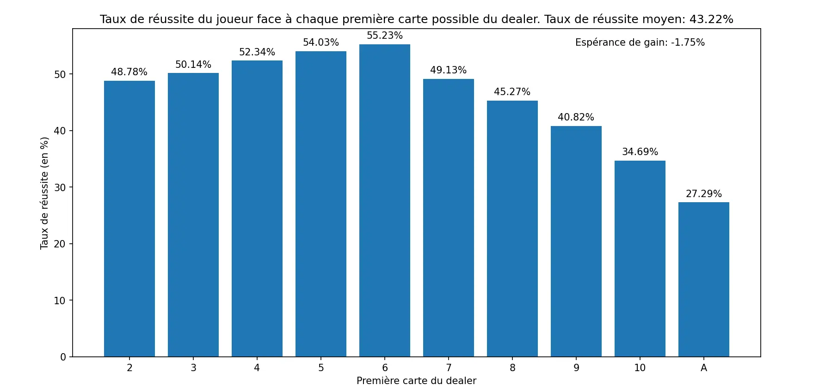

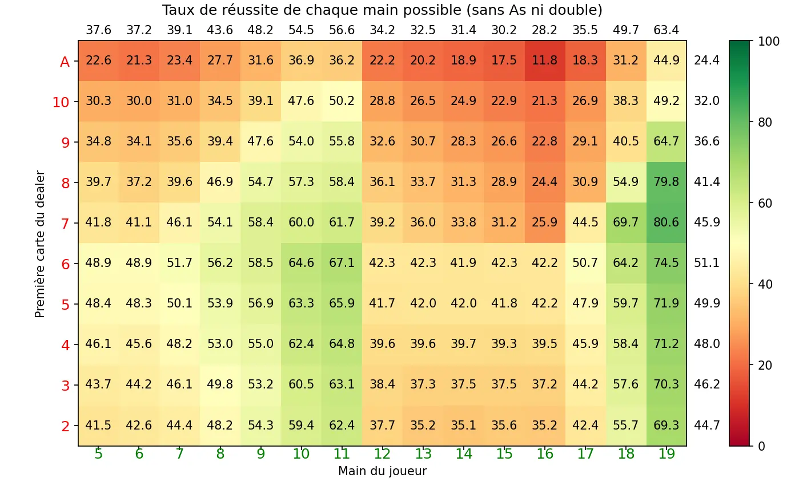

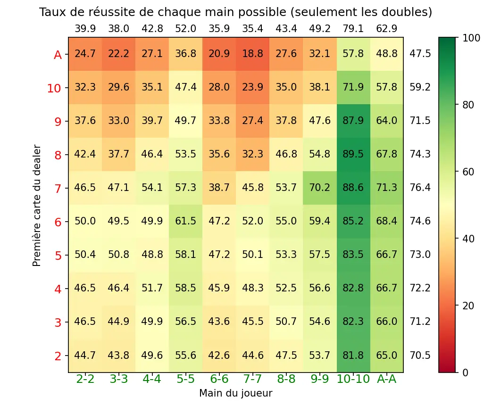

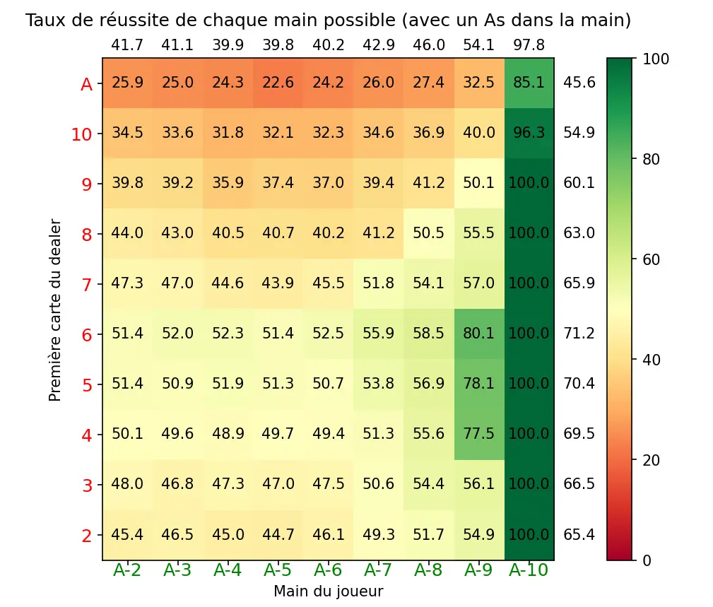


Sur la droite des graphiques en couleur, il est indiqué les moyennes (pondérées par le nombre de mains jouées) des taux de réussites face à la première carte du dealer correspondante. En haut de ces graphiques, on a les moyennes des taux de réussites des mains du joueur correspondante.


Le taux de réussite moyen du joueur est de 43,22% et l'espérance de gain est de -**1,75%**. Ce chiffre est appelé l'avantage de la maison. Cela veut dire que pour une mise de 100 euros, le joueur perd en moyenne 1,75 euros. Pour se donner une idée, voici quelques avantages de la maison sur les jeux de roulette (jeux également populaires au casino):

- Roulette Américaine: **5,4%**
- Roulette Européenne: **2,76%**
- Roulette Française: **1,35%**

*Source: [JeuxRoulette.org](https://www.jeuxroulette.org/articles/41-lavantage-casino-sur-jeu-roulette.html)*

Ainsi, le Blackjack est un jeu intéréssant à jouer car il a un avantage de la maison relativement faible comparé à d'autres jeux de casino. A noter que l'avantage de la maison pour les machines à sous se situe entre 10% et 15%, ce qui est très élevé comparé au Blackjack.

D'après le graphique en barres, on observe que le joueur a plus d'une chance sur deux de gagner quand le dealer a un 3, 4, 5 ou 6, avec un pic à 55.23% lorsqu'il a un 6. Cette carte est la pire carte à avoir pour le dealer. Ensuite, pour les cartes supérieures ou égales à 7, les chances de gagner du joueur chutent, jusqu'à atteindre moins de 35% face à un 10 et moins de 28% face à un As.

D'après les graphiques en couleurs, on voit clairement que les meilleures mains à avoir sont les mains qui ont une valeur de 10, 11, 18 et 19 avec des taux de réussite qui excèdent 50%. Les mains qui ont une valeur de 8 ou 9 ont également des taux de réussite assez bons. Cependant, les mains avec une valeur comprise entre 12 et 17, ou inférieure à 8 ont des taux de réussite inférieurs à 40%, descendant même à moins de 30% pour les mains à 15 ou 16.

Pour les mains en double, la main 5-5 a un bon taux de réussite, mais la meilleure reste la main 10-10 qui a un excellent taux de réussite de 79,1%. La main A-A se défend également très bien, avec un taux de réussite à 62,9%. Le reste des mains en double ont des taux de réussite en dessous de 50%.

Enfin, pour les mains contenant un As, la meilleure main est évidemment A-10, qui correpond à un "Blackjack" et qui gagne à tout les coups, sauf si le dealer en a un aussi. Sinon, la main A-9 a un bon taux de réussite, et le reste des mains avec un As ont un taux de réussite entre 40% et 50%.

### Le comptage des cartes: la méthode *count*

Il existe une méthode pour améliorer son espérance au Blackjack qui s'appelle le comptage des cartes. Une des méthodes s'appelle le *système Hi-Lo*, et permet d'estimer le nombre de cartes hautes restantes dans le sabot. En effet, plus il y a de cartes hautes dans le sabot, plus le joueur aura une main de départ élevée et plus le dealer aura de chance de bust. Concrètement, le joueur compte les cartes avec un "running count". Il ajoute à ce running count 1 si une carte entre 2 et 6 sort, et enlève 1 a ce compte quand une carte d'une valeur de 10 ou un As sort. Ce compte ne change pas dans le cas où un 7, 8 ou 9 sort. Le joueur doit ensuite diviser ce running count part le nombre de decks de 52 cartes qu'il reste dans le sabot, pour obtenir le "true_count". Lorsque ce true count dépasse une certaine valeur, le joueur va miser plus car il aura le sabot contient à ce moment là un grand nombre de cartes hautes comparé aux cartes basses.

On implémente alors une méthode *count*, qui prend en argument une carte et modifie les comptes suivant sa valeur. Cette méthode est appelée à chaque fois qu'une carte est piochée.



```python
def count(self,card):
    if card.value >= 2 and card.value <= 6:
        self.running_count += 1
    if card.value == 10 or card.value == 1:
        self.running_count -= 1
    nb_deck = len(self.deck)/52
    self.true_count = self.running_count/nb_deck
```



Il faut maintenant déterminer à partir de quelle valeur du true count le joueur commencer à changer sa mise, et à quel point il change sa mise. Plusieurs valeurs sont possibles, j'ai choisi pour le test de mettre la valeur seuil à 3 et le facteur multiplicatif de la mise égal au true count plus quatre. Ce facteur est proportionnel au compte; en effet plus le compte est elevé, plus il y a de chances de gagner, et donc plus il faut miser.
Ainsi, avant de jouer, le programme compare le true count au seuil fixé et si ce seuil est dépassé, la mise est plus grande. L'éxecution de cet algorithme sur 10 millions de parties   avec le comptage des cartes activé donne ce graphique en barre:

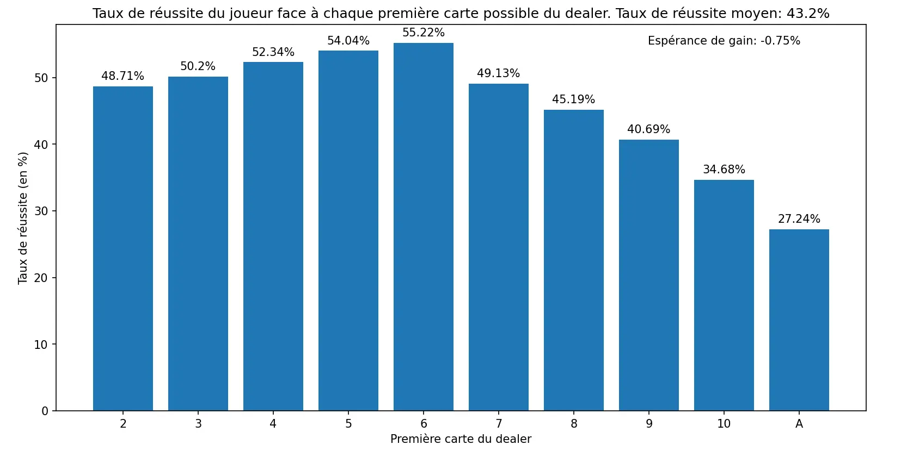

On remarque que le taux de réussite moyen et les taux de réussite face à chaque main du dealer ne changent pas comparé au graphique obtenu quand le joueur ne compte pas. Ceci est logique, puisque l'on change seulement la mise. Cependant, on remarque que l'avantage au casino n'est plus que de **0,75%!** C'est plus de deux fois moins que précédemment. Le comptage des cartes est donc bien efficace, mais ne permet cependant pas d'avoir une espérance positive: le casino sera donc toujours gagnant!


Notons qu'il est possible de changer la valeur seuil et le facteur multiplicatif. Les résultats seront légèrement différents mais ne permettront jamais d'avoir l'avantage sur le casino. De plus, dans la vraie vie, il est difficile de calculer exactement le true count, notamment parce qu'il est difficile d'estimer le nombre de decks restants dans le sabot. Certains casinos cachent également le sabot, ce qui empêche les joueurs de compter les cartes.


## Conclusion

Ce POK fut très intéressant pour moi car j'ai pu m'entraîner sur la programmation d'interface graphique. Je suis conscient que Python n'est pas le langage le plus répandu pour coder des applications ou des jeux, mais j'ai néanmoins au moins pu comprendre la logique derrière l'implémentation de simples jeux. La deuxième partie du POK fut égalemnt très intéressante: j'ai pu consolider mes acquis sur la programmation objet ainsi que sur ma façon d'organiser mes codes. Sur le plan de la gestion de projet, j'ai pu me rendre compte que j'ai surestimé mes capacités pour le premier sprint (je n'ai pas pu finir l'interface de mise comme je l'avais prévu), et j'ai donc dû mettre les bouchées doubles lors de la deuxième partie du premier temps. Je me suis donc rendu compte de l'importance de connaître mes capacités et d'estimer la compléxité d'une tâche.

Enfin, je suis très satisfait des résultats expérimentaux sur le jeu du Blackjack que j'ai obtenu. Etant un grand fan des jeux de casino, j'ai toujours voulu savoir les statistiques qui se cachent derrière ce jeu: voilà qui est chose faite!
